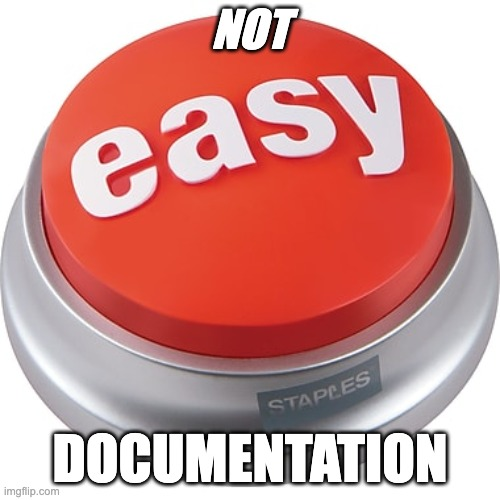

Today I want to write about engineering documentation. That is, docs that are written by engineers, for engineers that are or will be working on the same project. It's known that despite the many benefits of having good project documentation, engineers generally dislike writing it. This means useful docs tend to be lacking on projects. Before we get into how to rectify this, let's first discuss what *not* to do.

## What Not To Do

For the process-minded, it's tempting to think that the lack-of-documentation problem can be solved with process. For example:

* Create an engineering documentation template on the internal wiki with sections such as title, high level description, technical details, etc.
* Amend the Pull Request template for the project to include a checkbox for "Added Documentation".
* Inform the team that no PR will be approved unless it also has documentation added, as per the template.

Don't do this! Why not? There are several problems with this:

### Force Doesn't Work

Forcing engineers to do anything without them having bought into the benefits is unlikely to yield good results. If you don't believe this, try forcing a team to write automated tests when they don't understand why or how these tests will benefit the project. The result will be useless tests that either fail when nothing is broken or don't fail when something is broken. If you've never worked on a project with such tests, count yourself lucky!

Similarly, forcing documentation via process will result in useless paperwork. A template people fill in with the bare minimum, just because they were told they have to. It can also lead to poor team dynamics when people feel they are being forced to do something they wouldn't otherwise want to do.

### Templates Don't Work

There's also a problem with the prescribed template approach. It doesn't work for the same reason that prescribing coding solutions wouldn't work. For example, consider a coding template that instructs every developer for every feature they work on to:

* Generate a migration for a new table.
* Add a new model.
* Add a new controller to implement all CRUD methods on the model.
* Add new views for CRUD operations on model.

Well this may make sense when a new model is being added, but what if the best solution would be to enhance an existing model? Or what if the code change has nothing to do with models? It quickly becomes apparent that a general template solution for code doesn't make sense.

The same can be said of documentation. It may not always be the case that a new doc needs to be added. Maybe an existing doc needs more details added or changed.  Maybe an existing doc needs to be removed because it's no longer applicable. Or maybe it's an "obvious" change that follows the conventions of the framework being used for development and doesn't require any docs at all. Maybe its a simple bug fix that is adequately explained by thorough unit tests with good descriptions.

The kind and amount of documentation that will be needed (or not) for any given code change will vary depending on what is being changed. This is why a templated documentation solution is not recommended.

Now that we know what not to do, what should be done instead to ensure useful engineering docs are written and maintained as the project progresses? Unfortunately there is no "easy button" on this.

Good docs are part art, part science, and require some practice for everyone to get in the habit. Let's look at some things that can help.

## Frame of Mind

The first thing to do is get into the right frame of mind for writing. What do I mean by this?

Engineers: Think about a time when you joined an existing project. Were you able to get the project built and running on your laptop by following the `README.md` or did you have to reach out to a team member for help?

What if you had to change some details of a third party integration or deploy to the test environment? Were you able to find where the relevant code is, how to configure it for test vs real environments and deploy or did you have to reach out to a team member for help? What if the only person on the team that knew how that particular integration works was on vacation? How frustrating was it to have your assigned tasks take longer than expected due to knowledge in one person's head that's inaccessible to the rest of the team?

Or maybe you're the person that's been on the team longest and all the knowledge is in your head. Does your manager get a pained look when you ask to take a long vacation? Do they ask if you're planning to check your Slack notifications periodically? Would you like to take a long vacation without receiving panicky phone calls from your team about the something-or-other feature you worked on having issues in production?

If you're the only one on the team that knows how most features work or how the app is configured or how the build pipeline works, how many interruptions do you get in a day from colleagues asking you about details that are only in your head? Wondering why you can never seem to focus? Research shows that every interruption slows you down by about [20 minutes](https://medium.com/thrive-global/this-is-how-interruptions-kill-your-productivity-bb89c86a4eb8) to get back on track with your original task. The more knowledge that only you know, the more hits your productivity will take.

Thinking about the scenarios described above will put you in a good frame of mind for writing documentation, that is to say, empathy for future team members and yourself. The general idea is you want to write yourself off the critical path. Never be the only one on a team that knows how something works or where some important configuration is located. Whenever someone comes to you with a question about the project that they couldn't find anywhere else, that's an opportunity to add some documentation about that feature or process.

Another way to think about it is to imagine you're the new person on this project - write the docs that would help "new you" get up to speed quickly. This will also help "future you" who may forget 6 months down the line how something you built works.

<aside class="markdown-aside">
A personal benefit of documenting your knowledge is it makes it easier to move off the project and onto something new. Managers may be hesitant to move someone if they feel the project would suffer from loss of that person's expertise.
</aside>

## What to Document

Now that we're in the right frame of mind to write, what should get documented? Below are some general principles, and then we'll get into specifics.

As a general rule, document the non-obvious things. For example, if its a Rails project, following all the conventions, there's no need to document where the router is located, or where the models, views and controllers should go. All Rails developers will already know this, and even Rails newbies can read the [Rails Guides](https://guides.rubyonrails.org/getting_started.html) and quickly learn about the conventions.

On the other hand, if the project is written in an "anything goes" style framework, or not following conventions, or for example, using a library that auto generates an API such as [json-resources](https://jsonapi-resources.com/v0.10/guide/index.html), then this should be documented.

<aside class="markdown-aside">
This is one of the many benefits of choosing a well structured, convention based framework for your project. It reduces the amount of documentation you have to write as every project will have the same structure and any developer familiar with the framework will be able to dive in quickly.
</aside>

Also document anything where questions or misunderstandings frequently arise. For example, if there are multiple sources for configuration information but everyone tends to assume it can only come from environment variables, document this.

### Architecture Decision Records

Write up an [ADR](https://adr.github.io/) for proposed architectural changes to the project. This is a markdown document that gets created in a `decisions` dir in the project. Here is an optional [template](https://github.com/tucowsinc/hover/blob/master/mainsite/doc/architecture/decisions/optional-template.md) but feel free to add/remove sections as appropriate to the change being proposed.

In the early days of a project, there will be many architectural decisions to be made such as choice of server side framework, client side framework, database, background job processing, monolith vs microservices etc. For example, if you would like to propose that the project should use Rails 7, and eschew any JavaScript SPA in favor of [Turbo, Stimulus, and Hotwire](https://world.hey.com/dhh/rails-7-will-have-three-great-answers-to-javascript-in-2021-8d68191b), you would write an ADR explaining why you think that would be optimal for the project, technical details, and potential drawbacks.

This document gets submitted as a Pull Request, which the rest of the team can review and provide their feedback. For example, someone may be aware of a specific business requirement that wouldn't be well served by the proposed solution, it's important to capture that information. When all the feedback has been addressed and team is in agreement, the PR gets merged, which means its been approved, and the project proceeds with that decision.

<aside class="markdown-aside">
For new developers joining the project, it's not necessary for them to pore over all the historical ADRs. However, it is useful anytime someone asks "Why was technology X used for this project? Technology Y is superior to X!". Anyone wanting to know why certain decisions were made can read the relevant ADR(s) to understand the context in which the team was working at the time.
</aside>

Use ADRs for large, high impact decisions that are difficult to change later. Don't use this for smaller decisions like what to name a method or what the max method length lint rule should be.

### Readme.md Project Setup

The `README.md` is a markdown file located in the project root. The main purpose is to ensure a new engineer can follow the setup instructions within the readme to get the project checked out, built and successfully running, without getting on a call with anyone else on the team. This is especially critical in a fully distributed or [asynchronous](../markdown/working-towards-asynchronous-future) team where people may be working non-overlapping hours.

Here are some sections the readme should contain:

* High level overview/description of project
* Architecture diagram
* Required dependencies (eg: Docker, language version, version manager etc.)
* Step by step instructions to install, configure, build, and run project on laptop
* Instructions for how to run all the tests
* Links to "Further Reading" (each should be a markdown file in the `/docs` dir), for example, but not limited to:
  * Troubleshooting
  * Workflows
  * 3rd party integrations (one doc for each)
  * Configuration
  * Continuous Integration
  * Environments

Let's look at the "Further Reading" docs in turn.

### Troubleshooting

This should include errors that may be encountered when setting up the project and how to resolve them. A common source of these issues is different laptop OS, i.e. Mac vs Windows vs Linux.

### Workflows

Given that a new developer has a working project running on their laptop, this document should explain how to go through the most common workflows in the application. An example for a domain registrar application might include: Login as a test user, search for a domain, purchase the domain with a test credit card, and update dns records.

### 3rd party integrations

For each service that the project integrates with (eg: Braintree, Stripe, Mandrill, etc) add a document explaining:

* What the service does and why the project is using it.
* Differences in local vs deployed use (eg: is there a fake version of it for local use? How to update laptop config to use a real version, does the service provide a sandbox vs production mode?).
* Where/how its configured.
* How to get an account/credentials to the service.
* Does the service use webhooks? If yes, document the project endpoints that implement these.
* Link to the docs for the client library that's being used to communicate with the service.
* Troubleshooting - for example, is all communication with service logged somewhere?

### Configuration

This document should explain where and how the project is configured. For example, where is the database host/name/port/password? Where is the Redis URL? Where are all the 3rd party API keys?

Typically the source of this config will vary when the project is run locally on developers laptop vs in a deployed environment. For example, on a laptop there may be a git ignored `.env` file the developer needs to create, whereas on deployed environments, configuration may come from a secrets manager such as [Vault](https://www.hashicorp.com/products/vault). If there are secret values that cannot be committed, then document how/where the developer can find local values.

### Continuous Integration

This document should explain where and how continuous integration (CI) is being run for the project, for example:

* What tooling/services are being used for continuous integration? (Github Actions, Circle CI, Travis CI, Jenkins, etc.)
* Where is the CI script(s) located in project?
* How to troubleshoot if a commit results in a CI failure?

### Environments

This document should cover:

* What are all the deployed environments (eg. dev, staging, production) and where to find them, how to ssh into the server, etc.
* How to deploy branch code to each environment (if supported).
* How to monitor deployments.

## Code Comments as Documentation

So far, we've covered what kind of documents to write, that are separate from the code. But there are a few other ways that important project information can be conveyed from within the code itself. The first of these is code comments.

This one can be controversial. If you've read [Clean Code](https://www.goodreads.com/book/show/3735293-clean-code), then you know the recommendation is to think carefully about naming things (variables, methods, classes etc), and to structure your code into smaller, single-purpose methods so that the intention is clear from the names and structure. The idea is this eliminates the need for code comments.

However, there's still a place for code comments, and this has to do with the *why* rather than *what*. For example, suppose some section of code is storing the same information in two different places. It may be obvious from reading it that's what its doing. But the natural question an engineer will have when reading that code is *why* is this necessary? Perhaps the answer has to do with compliance requirements for the industry this project is involved in. Adding in the why as a code comment will be helpful, and prevent future developers from shooting themselves in the foot!

When doing this, follow the documentation conventions for the programming language the project is written in, and add the comment at the method or class level rather than inline, where it can get messy as the code is refactored.

## Automated Tests as Documentation

Another way that documentation can be written is through the use of automated tests.

When well named and described, automated tests can also serve as a form of documentation, although they don't take the place of everything mentioned in this document.

For example, there may be a business rule where a statuses received from a 3rd party integration get converted to different statuses within the project. Given that there's a method that is solely responsible for this conversion, unit tests to cover each status translation with meaningful descriptions can document this requirement adequately.

## Less Suck

Now that you know the benefits of documentation and what to document, how can we make it less sucky to create?

My recommendation is that all documentation written by engineers for engineers should be written in markdown and located with the project source. Specifically, a `README.md` in the project root, and all other docs in a `/docs` directory, with links from the `Further Reading` section of the readme, to each doc.

The reason for having all engineering docs with the code, rather than an external tool such as Confluence, is that the docs participate in the same lifecyle as the code. That is, they get included in PR reviews, which raises their visibility among the team. This also makes it more natural to maintain them, as the developer doesn't need to remember to login to some external tool after the PR is merged to add docs. Also, the docs become easily searchable along with the code, making them easier to maintain. In my experience, docs located outside the source get forgotten and stale.

The reason for using markdown is it's a lightweight, developer-friendly text format. Just about every IDE and editor as a plugin for it. The [Markdown All in One](https://marketplace.visualstudio.com/items?itemName=yzhang.markdown-all-in-one&ssr=false#review-details) for VS Code comes with syntax highlighting and snippets, which makes editing easy and efficient.

For example, suppose you just finished adding Stripe integration into a project and are now adding a document explaining how it's integrated into the project. Using VS Code the process would be:

* `Ctrl` + backtick to open the integrated terminal
* Enter in terminal: `touch docs/working-with-stripe.md`
* `Cmd` + `P` to launch fuzzy search by name
* Start typing `working` or `stripe` until the new markdown file is selected and hit `Enter`
* Start typing information about working with Stripe in the doc
* Edit `README.md`, under the "Further Reading" section, add a link to your new doc, for example: `[Working with Stripe](docs/working-with-stripe.md)`
* Follow your usual git process to add/commit

Never even had to leave the editor, beautiful! The above makes creating/maintaining docs follow the same flow developers are already used to for code.

## Conclusion

This document has covered what not to do for documentation, how to put yourself in the right frame of mind for writing, what areas of a project should be documented, and a process to make it as easy and natural as possible. But don't limit yourself to just the suggested areas covered here. As your project grows, you will discover other areas that require documentation, add them as you go.

Finally, I'd like to leave you with a few more references. Having good documentation also supports asynchronous work. When all information is "self serve", it eliminates the need for the entire team to be [online at the same time](https://danielabaron.me/blog/working-towards-asynchronous-future/). Also, here is another [take](https://chelseatroy.com/2021/09/14/the-art-of-documentation/) on the topic of documentation.
