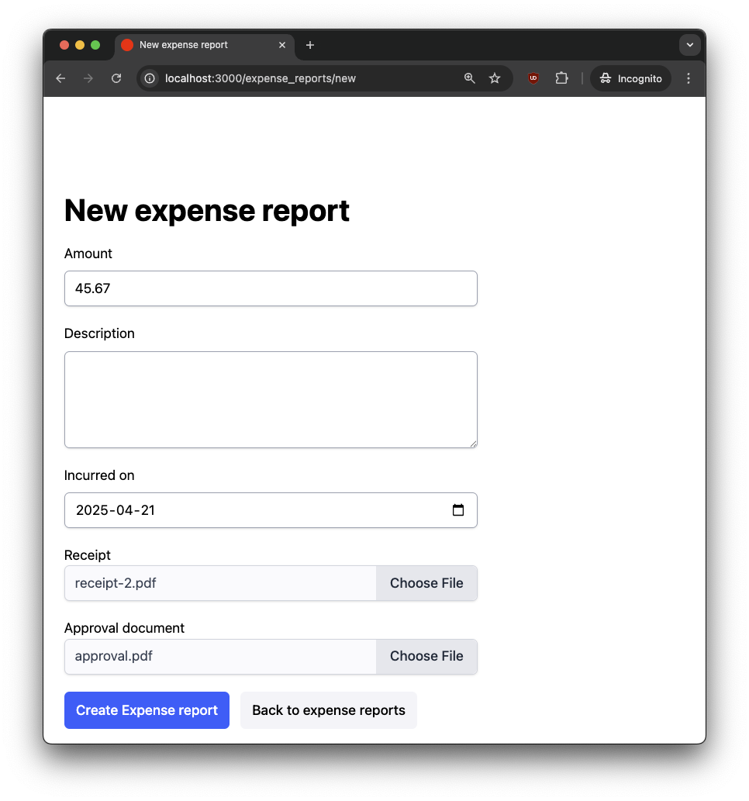

Rails' Active Storage is a powerful, built-in solution for handling file uploads, providing integration with cloud storage and automatic attachment management. It works out of the box, making it easy to associate files with models. However, when a form includes an attachment and a validation errors occur, the uploaded file is lost when the form re-renders to display the validation errors, forcing users to select their file again. This happens because [Active Storage](https://guides.rubyonrails.org/active_storage_overview.html) only associates a file with a model after a successful save. If the model fails validation, the attachment is not persisted, and the file selection is lost.

This post will walk through a solution using direct uploads, hidden signed IDs, and a custom file input with Stimulus. By the end, you'll have a robust way to ensure users don't lose their file uploads due to form validation errors. The complete working solution is also available on [GitHub](https://github.com/danielabar/expense_tracker).

## Demo Project Setup

To demonstrate the issue, we'll setup a new Rails project (as of this writing, I'm on Rails 8.0.2) for a simple expense tracker application. It will have one model, `ExpenseReport`, which represents an expense submission. This model will have a single file attachment named `receipt` for users to upload evidence of their expense.

The commands to get started:

```bash
# Create new rails application (defaults to sqlite database)
rails new expense_tracker

# Install dependencies and initialize database
bin/setup

# Initialize Active Storage
bin/rails active_storage:install
bin/rails db:migrate
```

The Active Storage installation generates a database migration to create two tables:

1. `active_storage_blobs` to store information about the uploaded file.
2. `active_storage_attachments`, which associates the blob to a model. This can be any model in your application, which is accomplished via [polymorphic association](https://guides.rubyonrails.org/association_basics.html#polymorphic-associations) under the hood.

Next, the `scaffold` generator is used to generate a migration, model, controller, views, and routes for the `ExpenseReport` model. This model will have a dollar amount, description, date on which the expense was incurred, and a receipt, which is an attachment:

```bash
bin/rails g scaffold ExpenseReport \
  amount:decimal \
  description:text \
  incurred_on:date \
  receipt:attachment
```

The generated migration is modified to ensure amount, description, and incurred_on are always provided:

```ruby
class CreateExpenseReports < ActiveRecord::Migration[8.0]
  def change
    create_table :expense_reports do |t|
      t.decimal :amount, precision: 10, scale: 2, null: false
      t.text :description, null: false
      t.date :incurred_on, null: false

      t.timestamps
    end
  end
end
```

The corresponding `ExpenseReport` model is also updated to have validation rules matching the database constraints:

```ruby
class ExpenseReport < ApplicationRecord
  has_one_attached :receipt

  validates :amount, presence: true, numericality: { greater_than_or_equal_to: 0 }
  validates :description, presence: true
  validates :incurred_on, presence: true
end
```

Finally, the generated form partial `app/views/expense_reports/_form.html.erb` (which is used for both new and edit actions as per Rails conventions) is modified to display a download link to the attachment, if one exists. This provides a nicer user experience if user needs to edit their expense report, they can see the receipt that is currently attached:

```erb
<%= form_with(model: expense_report) do |form| %>
  <!-- other form fields... -->

  <div>
    <%= form.label :receipt %>
    <%= form.file_field :receipt %>

    <%# Display download link for current attachment if one exists %>
    <% if expense_report.receipt.attached? %>
      <div>
        <strong>Current Receipt:</strong>
        <%= link_to expense_report.receipt.filename, expense_report.receipt %>
      </div>
    <% end %>
  </div>

  <!-- submit -->
<% end %>
```

<aside class="markdown-aside">
The demo code uses Tailwind CSS for styling, but most classes have been removed from the ERB snippets to keep the focus on file attachments and Active Storage behavior.
</aside>


When the form is submitted for a new expense report, the `create` action in the controller will run. The only change I've made to the generated code is to add a `debugger` breakpoint after a successful save. This will allow us to inspect the `@expense_report` model when the model and attachment have been successfully saved:

```ruby
class ExpenseReportsController < ApplicationController
  # ...

  def create
    @expense_report = ExpenseReport.new(expense_report_params)

    respond_to do |format|
      if @expense_report.save
        debugger # === ADDED BREAKPOINT HERE ===
        format.html { redirect_to @expense_report, notice: "Expense report was successfully created." }
      else
        format.html { render :new, status: :unprocessable_entity }
      end
    end
  end
  # ...
end
```

The `debug` gem is included by default in modern Rails projects. If you’re using an older version or don’t have it installed, you can add it to your Gemfile. See the [Rails Debugging Guide](https://guides.rubyonrails.org/debugging_rails_applications.html#debugging-with-the-debug-gem) for more information.

<aside class="markdown-aside">
In a real-world application, authentication and authorization would be necessary to ensure users can only view and modify their own expense reports. However, this post focuses solely on Active Storage and file persistence, so auth concerns are omitted for simplicity.
</aside>

## Happy Path

Let's explore how Active Storage works as part of the form submission when all is well.

Since the scaffold generator also added the standard CRUD routes for the `ExpenseReport` model, we can start the Rails server, and navigate to `http://localhost:3000/expense_reports/new` to create a new expense report:


Here's the form filled in with valid values and an attachment selected for the receipt:


Submitting the form will pause on the `debugger` breakpoint in the `ExpenseReportsController#create` method, just after the model has been successfully saved. You should see something like the following in the terminal where the Rails server was started:


In the debug session, we can inspect the `blob`, which contains the metadata and storage details for the file attached to the expense report's `receipt`. This includes attributes like `id`, `key`, and `filename`:

```ruby
@expense_report.receipt.blob
# <ActiveStorage::Blob:0x000000012657eb18
#  id: 1,
#  key: "6081val5vwpz691v8ukv8tc4zma0",
#  filename: "receipt-1.pdf",
#  content_type: "application/pdf",
#  metadata: {"identified" => true, "analyzed" => true},
#  service_name: "local",
#  byte_size: 7171,
#  checksum: "PnVMB8Sc/us7Jy4wxuy07w==",
#  created_at: "2025-03-21 12:46:13.604118000 +0000">
```

The `signed_id` method can be called on the blob. This method returns a secure identifier that can be passed to the client. It encodes the blob’s ID along with a cryptographic signature to prevent manipulation. This is how Active Storage allows clients to reference uploaded files:

```ruby
@expense_report.receipt.blob.signed_id
# "eyJfcmFpbHMiOnsiZGF0YSI6MSwicHVyIjoiYmxvYl9pZCJ9fQ==--42eb19d188a21278e0c6add2449a511283e28afe"
```

We can also check whether the `receipt`, which is an instance of [ActiveStorage::Attached::One](https://api.rubyonrails.org/classes/ActiveStorage/Attached/One.html), is `attached?` and `persisted?`. That latter method comes from [ActiveRecord::Persistence](https://api.rubyonrails.org/classes/ActiveRecord/Persistence.html):

```ruby
@expense_report.receipt.attached?
# true

@expense_report.receipt.persisted?
# true

# let the request continue to get out of debug session
continue
```

Since the `@expense_report` model was saved successfully, the controller redirects to the show view for this expense report. The show view has a link to edit, which navigates to `http://localhost:3000/expense_reports/1/edit`. This renders the shared form partial `app/views/expense_reports/_form.html.erb`, which now renders a download link for the receipt we just attached:


Recall we modified the form partial earlier to show the download link if one is attached with this code:

```erb
<!-- app/views/expense_reports/_form.html.erb -->
<% if expense_report.receipt.attached? %>
  <div>
    <strong>Current Receipt:</strong>
    <%= link_to expense_report.receipt.filename, expense_report.receipt %>
  </div>
<% end %>
```

Right-clicking the download link and selecting "Copy Link Address" reveals a long tokenized URL that begins with `eyJFcm...`. This is the same `signed_id` we saw earlier in the debug session, confirming that Active Storage uses this signed identifier to securely reference the file:

```
http://localhost:3000/rails/active_storage/blobs/redirect/eyJfcmFpbHMiOnsiZGF0YSI6MSwicHVyIjoiYmxvYl9pZCJ9fQ==--42eb19d188a21278e0c6add2449a511283e28afe/receipt-1.pdf
```

Now let's start a database session with `bin/rails db` and see what got saved in the active storage database tables:

```
sqlite> select id, key, filename, content_type from active_storage_blobs;
id  key                           filename       content_type
--  ----------------------------  -------------  ---------------
1   6081val5vwpz691v8ukv8tc4zma0  receipt-1.pdf  application/pdf

sqlite> select * from active_storage_attachments;
id  name     record_type    record_id  blob_id  created_at
--  -------  -------------  ---------  -------  --------------------------
1   receipt  ExpenseReport  1          1        2025-03-21 12:46:13.604834

sqlite> select id, amount, description, incurred_on from expense_reports;
id  amount  description                incurred_on
--  ------  -------------------------  -----------
1   123.45  Uber trip to the airport.  2025-03-21
```

That `id`, `key`, and `filename` in the `active_storage_blobs` table matches what we saw in the debug session when inspecting `@expense_report.receipt.blob`.

The `active_storage_attachments` associates that blob to the expense report record with id of `1`, which we can see is the expense report we just created.

Where is the actual file? The answer can be found in `config/storage.yml`. This file automatically got created earlier when running `rails new...`:

```yml
test:
  service: Disk
  root: <%= Rails.root.join("tmp/storage") %>

local:
  service: Disk
  root: <%= Rails.root.join("storage") %>

# amazon:
#   service: S3
#   access_key_id: <%= Rails.application.credentials.dig(:aws, :access_key_id) %>
#   secret_access_key: <%= Rails.application.credentials.dig(:aws, :secret_access_key) %>
#   region: us-east-1
#   bucket: your_own_bucket-<%= Rails.env %>

# other cloud storage providers...
```

In development mode, Active Storage uses the local file system, storing files in the `storage` directory in the project root. In production, you'll need to configure a cloud storage service like AWS S3, Azure, Cloudflare R2, etc. The <a class="markdown-link" href="https://guides.rubyonrails.org/active_storage_overview.html#setup">Active Storage Setup</a> guide has details on how to do this.

Since we're running locally, the uploaded files can be found in the `storage` directory in the project root:

```
tree storage

storage
└── 60
    └── 81
        └── 6081val5vwpz691v8ukv8tc4zma0
```

That leaf entry `6081val5vwpz691v8ukv8tc4zma0` is the actual pdf file. Notice that the file name matches the `key` stored in `active_storage_blobs` table. It's also the `key` value we saw when inspecting `@expense_report.receipt.blob` earlier in the debug session.

Going through this happy path has demonstrated that in order for an Active Storage attachment to be saved and associated to a model, the following must occur:

1. File uploaded to storage service (locally, this is the `storage` directory in the project root).
2. New record inserted in database table `active_storage_blobs` with the `key` matching the file name uploaded to storage.
3. New record inserted in database table `active_storage_attachments` that associated the model (which also got saved in the database) to the blob, which represents the file.

## Validation Errors

Now that we understand what Active Storage does in the success case, it's time to look at what happens when things go wrong. Specifically, what happens when the form is submitted with an attachment, but with one or more validation errors in the other form fields?

For this demo, the `debugger` statement is moved to the `else` clause in the `ExpenseController#create` method, so we can inspect what the receipt blob looks like when the model fails to be saved:

```ruby
class ExpenseReportsController < ApplicationController
  # ...

  def create
    @expense_report = ExpenseReport.new(expense_report_params)

    respond_to do |format|
      if @expense_report.save
        format.html { redirect_to @expense_report, notice: "Expense report was successfully created." }
      else
        debugger # === ADDED BREAKPOINT HERE ===
        format.html { render :new, status: :unprocessable_entity }
      end
    end
  end
  # ...
end
```

Since the `ExpenseReport` model requires the description field to be filled in, let's try to submit another expense report with another attachment `receipt-2.pdf`, leaving description blank:


Once again submitting the form will launch us into a debug session. This time, `@expense_report.save` returned `false` due to a validation error (because `description` is required, but was not provided).

The debug session shows that there is a blob with a `key` in memory, and it has a reference to the `filename` the user uploaded. However it's not persisted - notice the `id` and `created_at` attributes are `nil`:

```ruby
@expense_report.receipt.blob
<ActiveStorage::Blob:0x00000001247b3890
 id: nil,
 key: "6pyvo9nv8tl81rh8wl3ykkcu6d5e",
 filename: "receipt-2.pdf",
 content_type: "application/pdf",
 metadata: {"identified" => true},
 service_name: "local",
 byte_size: 42223,
 checksum: "IO+1GEvBwGHnvuy0kYIpzw==",
 created_at: nil>
```

Also notice if we try to invoke the `signed_id` method on the blob, an error is raised that it's not possible to have a signed_id on a new record. We'll see why this is important shortly when observing what happens on the page:

```ruby
@expense_report.receipt.blob.signed_id
# eval error: Cannot get a signed_id for a new record
# nil
```

Another interesting observation is that `@expense_report.receipt.attached?` returns `true` even though the blob isn't actually persisted. So this just means that the user is attempting to attach a file. `persisted?` however returns `false`:

```ruby
@expense_report.receipt.attached?
# true

@expense_report.receipt.persisted?
# false
```

Before turning our attention to what happens on the page, let's launch another database session `bin/rails db` and observe that there are no new entries in the active storage tables:

```
# NO NEW BLOBS - THIS IS THE PREVIOUS HAPPY PATH
sqlite> select id, key, filename, content_type from active_storage_blobs;
id  key                           filename       content_type
--  ----------------------------  -------------  ---------------
1   6081val5vwpz691v8ukv8tc4zma0  receipt-1.pdf  application/pdf


# NO NEW EXPENSE REPORTS - THIS IS THE PREVIOUS HAPPY PATH
sqlite> select id, amount, description, incurred_on from expense_reports;
id  amount  description                incurred_on
--  ------  -------------------------  -----------
1   123.45  Uber trip to the airport.  2025-03-21


# NO NEW ATTACHMENTS - SINCE THERE'S NO NEW BLOB OR EXPENSE REPORT TO ASSOCIATE
# THIS RECORD IS FROM THE PREVIOUS HAPPY PATH
sqlite> select * from active_storage_attachments;
id  name     record_type    record_id  blob_id  created_at
--  -------  -------------  ---------  -------  --------------------------
1   receipt  ExpenseReport  1          1        2025-03-21 12:46:13.604834
```

We can also check the `storage` directory in the project root and observe that there are no new files uploaded, even though the user did attempt to upload a new file `receipt-2.pdf`. The only file is listed is from the previous happy path, which was `receipt-1.pdf` with a key of `6081val5vwpz691v8ukv8tc4zma0`:

```
storage
└── 60
    └── 81
        └── 6081val5vwpz691v8ukv8tc4zma0
```

Now let's look at what happens on the page in the browser. Normally when there is a model validation error on `create`, the expected result is that the new view renders the form again, displaying the validation errors. Any data the user had entered into the form fields is preserved.

However, in this case, an error page is displayed with error message: "Cannot get a signed_id for a new record":


The Rails server output also shows the error:

```
ActionView::Template::Error (Cannot get a signed_id for a new record)
Caused by: ArgumentError (Cannot get a signed_id for a new record)

Information for: ActionView::Template::Error (Cannot get a signed_id for a new record):
    40:     <% if expense_report.receipt.attached? %>
    41:       <div>
    42:         <strong>Current Receipt:</strong>
    43:         <%= link_to expense_report.receipt.filename, expense_report.receipt %>
    44:       </div>
    45:     <% end %>
    46:   </div>

app/views/expense_reports/_form.html.erb:43
```

We saw in the debug session that `expense_report.receipt.attached?` returns `true`, even though the attachment didn't actually get associated to the model. This means the view code will attempt to generate a download link `<%= link_to expense_report.receipt.filename, expense_report.receipt %>`. But in order to do this, it needs a `signed_id` for the file, which isn't available because the file hasn't been uploaded to storage and is not associated to the model.

The next section will walk through how to solve this.

## 1. Check Persisted

The most immediate problem to be solved is to not render the 500 Server Error page, so at the very least, the user can continue to interact with the form. From our earlier debug session, we saw that while `expense_report.receipt.attached?` returned true when an attachment had been attempted but the form had not been saved, `expense_report.receipt.persisted?` returned false.

Let's switch the portion of the form partial that attempts to render a download link to the receipt to check for `persisted?` rather than `attached?`:

```erb
<%= form_with(model: expense_report) do |form| %>
  <!-- form fields... -->

  <!-- Receipt Attachment -->
  <div>
    <%= form.label :receipt %>
    <%= form.file_field :receipt %>

    <%# Display current attachment if there is one %>
    <%# === CHANGE CHECK TO PERSISTED HERE === %>
    <% if expense_report.receipt.persisted? %>
      <div>
        <strong>Current Receipt:</strong>
        <%= link_to expense_report.receipt.filename, expense_report.receipt %>
      </div>
    <% end %>
  </div>

  <!-- submit -->
<% end %>
```

Now we can again try to create a new expense report, with a receipt, and blank description. This time when the form is submitted, it will render in an error state, showing that the Description must be provided, i.e. classic Rails CRUD behavior. And it will not attempt to render a download link to the receipt because there isn't one:


But this exposes a new problem - the user's upload has been lost. This is unlike the other form fields that Rails was able to remember what user previously filled in (amount and incurred_on date). In order to proceed, the user needs to fill in the Description field *and* select the receipt from their file system again. It would be nice if we could remember the file they were trying to upload, just like all the other form fields that were remembered.

## 2. Direct Upload

This leads us to the next part of the solution. By default, when using Active Storage, file uploads and database record creation happen in a single request when the user submits the form. The server handles both tasks: uploading the file to the storage service, and creating the corresponding database record for the file in the `active_storage_blobs` table.

An alternative approach is to enable [Direct Uploads](https://guides.rubyonrails.org/active_storage_overview.html#direct-uploads). With direct uploads, client-side JavaScript will first make a request to upload the file to the storage service, and once the upload is complete, it will send a request to the Rails server to create the corresponding record in the `active_storage_blobs` table. This happens separately from submitting the form to create the expense report. Having separate requests for file upload vs form submission provides flexibility to save the file, *regardless* of the expense report being saved successfully or not.

Since Direct Uploads is a JavaScript feature, the steps to enable it depend on what front-end build system your project is using. The demo project is using Rails 8 with Propshaft and import maps so the steps are to add an entry to the import maps and initialize Active Storage in the application's JavaScript:

```ruby
# config/importmap.rb
pin "@rails/activestorage", to: "activestorage.esm.js"
```

```javascript
// app/javascript/application.js
import * as ActiveStorage from "@rails/activestorage";
ActiveStorage.start();
```

Instructions for other setups can be found in the [Rails Guide on Active Storage](https://guides.rubyonrails.org/active_storage_overview.html#direct-uploads) and [Direct upload installation](https://api.rubyonrails.org/files/activestorage/README_md.html).

With Direct Upload enabled, we can add the `direct_upload: true` option for the `file_field` helper in the form partial:

```erb
<%= form_with(model: expense_report) do |form| %>
  <!-- other fields... -->

  <%= form.label :receipt %>

  <!-- === USE DIRECT UPLOAD HERE === -->
  <%= form.file_field :receipt, direct_upload: true %>

  ...

  <!-- submit -->
<% end %>
```

After restarting the Rails server, we can once again attempt to submit an expense with `receipt-2.pdf` attachment and description field left blank:


The controller still has the `debugger` breakpoint in the failure case - which it will stop on because the model is invalid:

```ruby
class ExpenseReportsController < ApplicationController
  # ...

  def create
    @expense_report = ExpenseReport.new(expense_report_params)

    respond_to do |format|
      if @expense_report.save
        format.html { redirect_to @expense_report, notice: "Expense report was successfully created." }
      else
        debugger # === BREAKPOINT WHEN MODEL INVALID ===
        format.html { render :new, status: :unprocessable_entity }
      end
    end
  end
  # ...
end
```

Here we are in the debug session after submitting the form. This time when inspecting the receipt blob, there's a significant difference: The blob has an `id` and we can invoke the `signed_id` method on it successfully!

```ruby
# === HAS AN ID! ===
@expense_report.receipt.blob
#<ActiveStorage::Blob:0x000000016341c800
#  id: 2,
#  key: "8gxcs3hkovtiapbmrjx0f32ejqhy",
#  filename: "receipt-2.pdf",
#  content_type: "application/pdf",
#  metadata: {"identified" => true},
#  service_name: "local",
#  byte_size: 42223,
#  checksum: "IO+1GEvBwGHnvuy0kYIpzw==",
#  created_at: "2025-03-25 13:01:01.188138000 +0000">

# === SIGNED_ID WORKS! ===
@expense_report.receipt.blob.signed_id
# "eyJfcmFpbHMiOnsiZGF0YSI6MiwicHVyIjoiYmxvYl9pZCJ9fQ==--cb69cfd5043d24d8af9c289739183e40974271c6"

@expense_report.receipt.attached?
# true

@expense_report.receipt.persisted?
# false
```

Another significant difference can be observed in the database: `receipt-2.pdf` has been added to `active_storage_blobs` with `id` of `2`, which matches what was shown in the debug session for `@expense_report.receipt.blob`. There are no new records in `active_storage_attachments` or `expense_reports` because the model wasn't saved, but at least, the receipt blob did get saved:

```
=== NEW BLOB GOT SAVED ===
sqlite> select id, key, filename, content_type from active_storage_blobs;

id  key                           filename       content_type
--  ----------------------------  -------------  ---------------
1   6081val5vwpz691v8ukv8tc4zma0  receipt-1.pdf  application/pdf
2   8gxcs3hkovtiapbmrjx0f32ejqhy  receipt-2.pdf  application/pdf
```

Another important difference is in the `storage` directory, which shows a new file with the `receipt-2.pdf` key of `8gxcs3hkovtiapbmrjx0f32ejqhy` was uploaded:

```
tree storage
storage
├── 60
│   └── 81
│       └── 6081val5vwpz691v8ukv8tc4zma0
└── 8g
    └── xc
        └── 8gxcs3hkovtiapbmrjx0f32ejqhy
```

If you want to see even more details of how this happened, keep the Network tab of your browser Developer Tools open while submitting the form. There will be three requests:


* **Direct Upload Request:** The first request (`/rails/active_storage/direct_uploads`) is made from the client-side JavaScript to the Rails server to initiate the upload. This request contains metadata about the file (like its name, content type, checksum, etc.). The Rails server then responds with an upload URL and a `signed_id` to track the file.
*  **File Upload to Storage:** The second request (`/rails/active_storage/disk/...`) is a PUT request that uploads the file (e.g., `receipt-1.pdf`) to the storage service, using the URL provided in the first request. The client sends the file's binary data in the body of this request.
* **Form Submission:** The third request is a regular form submission to create the `ExpenseReport` (e.g., `POST /expense_reports`).

<aside class="markdown-aside">
The form submission is of type `fetch` rather than `document` because <a class="markdown-link" href="https://turbo.hotwired.dev/handbook/drive">Turbo Drive</a> is enabled. This intercepts all link clicks and form submissions and turns them into background requests, which allows the page to update without a full reload.
</aside>

Even though the form submission failed with a status of 422 due to the validation error, the file upload requests were able to proceed independently of the form submission.

Recall earlier when walking through the [Happy Path](../active_storage_form_errors#happy-path), we learned that three things need to be true for an attachment to be successfully saved:

1. File uploaded to storage service.
2. New record inserted in database table `active_storage_blobs` with the `key` matching the file name uploaded to storage.
3. New record inserted in database table `active_storage_attachments` that associated the model (which also got saved in the database) to the blob, which represents the file.

By enabling Direct Uploads, the first two of these have completed, even when the model couldn't be saved due to validation errors. This is progress 🙏

***Quick notes on direct uploads:***

- It's worth implementing even if you don't encounter the validation issue, since it prevent slow clients from tying up application server threads during uploads.
- If you're uploading directly to a third-party storage service like S3 , make sure you've configured [CORS](https://guides.rubyonrails.org/active_storage_overview.html#cross-origin-resource-sharing-cors-configuration) to allow direct uploads from your app.
- Be sure to schedule a job to [purge unattached uploads](https://guides.rubyonrails.org/active_storage_overview.html#purging-unattached-uploads), which can accumulate if users abandon the form after a validation error.

Back on the page, it still displays the same validation error message as before about missing Description, and the user still needs to select their file again. Now we're in a good position to improve the user experience.

## 3. Hidden Signed ID

When using Direct Uploads, the file is uploaded and a blob is created immediately, even before the form is successfully submitted. This gives us access to the blob’s `signed_id`, which we can use to re-attach the file later.

To avoid forcing the user to re-select their file after a validation error, we can store the `signed_id` in a hidden field. On the next successful form submission, Rails will associate the already-uploaded file with the model using this ID.

However, we only want to render the hidden field if the file was uploaded (`attached?`) but not yet saved with the record (`persisted?`). That’s how we know the user attached something, but the form failed validation.

Here’s how to implement that in the form partial:

```erb
<%= form_with(model: expense_report) do |form| %>
  <!-- other fields... -->

  <%= form.label :receipt %>
  <%= form.file_field :receipt, direct_upload: true %>

  <%# === ADD HIDDEN SIGNED_ID HERE === %>
  <% if expense_report.receipt.attached? && !expense_report.receipt.persisted?%>
    <%= form.hidden_field :receipt, value: expense_report.receipt.signed_id %>
  <% end %>

  <!-- submit -->
<% end %>
```

Once again let's try the test case of submitting the form with an attachment, but description left blank. It will render with validation errors as expected, but this time, inspecting the DOM will show a hidden field is rendered containing the `signed_id` of the receipt upload:

```htm
<form action="/expense_reports" method="post">
  <!-- other fields... -->

  <!-- what the user sees -->
  <label for="expense_report_receipt">Receipt</label>
  <input type="file" name="expense_report[receipt]" id="expense_report_receipt">

  <!-- === NEW: HIDDEN FIELD WITH ATTACHMENT SIGNED_ID -->
  <input
    value="8gxcs3h..."
    autocomplete="off"
    type="hidden"
    name="expense_report[receipt]"
    id="expense_report_receipt">

  <!-- submit -->
</form>
```

As far as the user is concerned, the file upload still looks "lost" because the native file picker still displays "No file chosen". But things are different this time because we have a reference to the file upload via the hidden `signed_id` field:


We'll address the user display in the next step. But for now, if we update the description field with some value and submit the form again, it will be saved successfully, including associating to the file the user previously uploaded:


Checking in the database shows that the second expense report was saved (because we fixed the validation error), and it used the hidden `signed_id` field to associate the expense report with the `receipt-2.pdf` attachment user previously uploaded:

```
select * from active_storage_attachments;
id  name     record_type    record_id  blob_id  created_at
--  -------  -------------  ---------  -------  --------------------------
1   receipt  ExpenseReport  1          1        2025-03-21 12:46:13.604834
2   receipt  ExpenseReport  2          2        2025-03-21 12:50:14.151515

-- Earlier we saw that active_storage_blob with id of 2 is for receipt-2.pdf
```

At this point, we have the ability to hold on to a user's previously uploaded file and ensure it gets saved on the next successful form submission. But there's a UX issue - the native file picker displays as if no file is selected. This would confuse the user into thinking they need to select it again. The next section will cover how to solve this.

## 4. Custom File Input

The problem we need to solve now is that the form shows "No file chosen" beside the "Choose File" button, even when we do actually have the user's previous upload saved.


Earlier in a debug session, we saw that we do have access to the filename via the `@expense_report` model, even if it the model itself wasn't saved due to the validation error:

```ruby
# === FILE NAME IS POPULATED ===
@expense_report.receipt.blob
#<ActiveStorage::Blob:0x000000016341c800
#  id: 2,
#  key: "8gxcs3hkovtiapbmrjx0f32ejqhy",
#  filename: "receipt-2.pdf",
#  content_type: "application/pdf",
# ...
```

It would be nice if we could programmatically set the file selector's value in the form, since it's available via `@expense_report.receipt.blob.filename`. However, this won't work, because this is the native file picker.

Earlier, when we generated the scaffold and included `receipt:attachment` as a model field, Rails recognized `receipt` as an attachment. As a result, it used the [file_field](https://api.rubyonrails.org/classes/ActionView/Helpers/FormBuilder.html#method-i-file_field) helper inside the [form_with](https://api.rubyonrails.org/classes/ActionView/Helpers/FormHelper.html#method-i-form_with) block to create a file input in the form partial:

```erb
<%= form_with(model: expense_report) do |form| %>
  <!-- other fields... -->

  <%= form.label :receipt %>
  <%= form.file_field :receipt, direct_upload: true %>

  <!-- submit -->
<% end %>
```

This renders markup:

```htm
<form enctype="multipart/form-data" action="/expense_reports" method="post">
  <!-- other fields... -->

  <label for="expense_report_receipt">Receipt</label>
  <input type="file" name="expense_report[receipt]" id="expense_report_receipt">

  <!-- submit -->
</form>
```

`<input type="file" ...>` is the browser's native file picker. The [Mozilla Developer Network (MDN)](https://developer.mozilla.org/en-US/docs/Web/HTML/Element/input/file) has a reference on how file inputs behave. With regards to populating the selected file name, here are the key things to understand:

* The file input’s `value` attribute defaults to an empty string.
* When `value` is empty, the browser displays “No file chosen.”
* After a user selects a file, the browser updates the file input to display the file name.
* The actual file data is stored in the `files` attribute, which is a `FileList` object.
* The `value` cannot be set programmatically to anything other than an empty string. Setting it in HTML or JavaScript has no effect and can throw an error.

For example, trying to programmatically populate the file input's value won't work:

```javascript
const input = document.querySelector("input[type=file]");
input.value = "receipt-2.pdf"

// Uncaught InvalidStateError:
//  Failed to set the 'value' property on 'HTMLInputElement':
//    This input element accepts a filename, which may only be
//    programmatically set to the empty string.
```

If user clicks the Choose File button and selects a file from their file system, then the input is populated:

```javascript
// From the browser page, select a file, then run in Console tab of browser dev tools:
const input = document.querySelector("input[type=file]");

// Value always preceded with `fakepath` rather than actual file system path for security
input.value
//  'C:\\fakepath\\receipt-2.pdf'

// FileList is array-like object with a single entry
// containing the file user just selected
input.files
// FileList {0: File, length: 1}

// That FileList expanded looks something like this:
{
  0: File {
    name: "receipt-2.pdf",
    type: "application/pdf",
  },
  length: 1
}
```

Since the browser does not allow programmatically setting the file input’s value, we can’t use the filename from `@expense_report.receipt.blob.filename` to populate the input. This means that even if a file is already attached, the input will still display "No file chosen" on page load. To provide a better user experience, and accurately reflect the file's presence, we'll need to hide the native file input (while keeping it functional) and replace it with a custom button and label. These custom controls will let us display the actual file name when available, and mimic the native behavior in other scenarios.

The custom label should display:

1. "No file chosen" if the user has not selected a file.
2. The selected file name if the user clicks the custom "Choose file" button and picks a file from their file system (mimicking native behavior).
3. The filename from the model (`expense_report.receipt.blob.filename`) if the form renders with an attached, but not yet persisted, receipt.

Let's modify the form partial for the additional markup needed:

```erb
<%= form_with(model: expense_report, class: "contents") do |form| %>
  <!-- other fields... -->

  <!-- receipt attachment-->
  <%= form.label :receipt %>

  <!-- logic we added earlier to preserve file if necessary -->
  <% if expense_report.receipt.attached? && !expense_report.receipt.persisted? %>
    <%= form.hidden_field :receipt, value: expense_report.receipt.signed_id %>
  <% end %>

  <!-- wrapper div for native file input and custom controls -->
  <div class="relative w-full">

    <!-- hide the native file input from display with css -->
    <!-- make it take up full width of container so it receives clicks -->
    <%= form.file_field :receipt,
          direct_upload: true,
          class: "opacity-0 absolute w-full" %>

    <!-- add a placeholder div to display "No file chosen" or selected file -->
    <div>
      <!-- will be filled in by JavaScript -->
    </div>

    <!-- button to display instead of hidden file input -->
    <button type="button">Choose File</button>
  </div>

  <!-- submit -->
<% end %>
```

**Explanation:**

* The native file picker is still present in the DOM but hidden from display with css
* A placeholder div has been added to display the file picker selection ("No file chosen" or filename user has selected or has saved from previous form submission with validation errors). This isn't functional at the moment, we'll get there soon.
* A button has been added with text "Choose File" to mimic the native file picker.
* A wrapper div is introduced with some css to allow the native file input to take up the full width of the container - this means even though it's hidden, it will receive the click event when the custom button is clicked.

At this point, the form looks like this:


Clicking the custom "Choose File" button launches the system file selector because it's rendered on top of the hidden native file input. To make the custom file name display functional, we'll need to add some JavaScript. [Stimulus](https://stimulus.hotwired.dev/handbook/introduction) is a minimal JavaScript framework that works with Rails that to enhance server-rendered pages. To get started, run the following command to generate a new Stimulus controller:

```bash
bin/rails generate stimulus file_upload
```

This generates the following JavaScript file:

```javascript
// app/javascript/controllers/file_upload_controller.js
import { Controller } from "@hotwired/stimulus"

// Connects to data-controller="file-upload"
export default class extends Controller {
  connect() {
  }
}
```

Then update it:

```javascript
import { Controller } from "@hotwired/stimulus";

// Connects to: data-controller="file-upload"
export default class extends Controller {
  // Targets are the DOM elements that this controller will interact with
  // `input` is the native file input so we can inspect it's `files` property
  // `fileNameContainer` is the custom div to display a previously selected file name
  static targets = ["input", "fileNameContainer"];

  // Values are inputs the DOM can provide to the controller.
  // `fileSelectionText` will have the file name of a previously selected file
  // or if it's not provided, we'll use a default of "No file chosen".
  static values = {
    fileSelectionText: { type: String, default: "No file chosen" },
  };

  connect() {
    this.updateFileName();
  }

  // Updates the custom div with a file name or "No file chosen"
  updateFileName() {
    this.fileNameContainerTarget.textContent = this.fileSelectionTextValue;
  }

  // When user selects a new file, update the display based on the native file input selection
  handleNewFileSelection() {
    if (this.inputTarget.files.length > 0) {
      this.fileNameContainerTarget.textContent = this.inputTarget.files[0].name;
    } else {
      this.updateFileName(); // Reset display if no file selected
    }
  }
}
```

<aside class="markdown-aside">
It's beyond the scope of this post to go in depth on Stimulus. If you're not familiar with it, or want a refresher on concepts like targets and values, check out my earlier guide <a class="markdown-link" href="https://danielabaron.me/blog/stimulus-copy-to-clipboard/">on building a Stimulus controller</a>.
</aside>

To make use of the Stimulus controller, we add some data-dash attributes to the form partial. These connect the markup to the Stimulus targets and values:

```erb
<%= form_with(model: expense_report, class: "contents") do |form| %>
  <!-- other fields... -->

  <%# === data-controller ON WRAPPER DIV CONNECTS TO STIMULUS CONTROLLER === %>
  <%# === data-file-upload-file-selection-text-value PROVIDES FILE NAME DISPLAY VALUE === %>
  <div
      data-controller="file-upload"
      data-file-upload-file-selection-text-value="<%= expense_report.receipt.attached? && !expense_report.receipt.persisted? ? expense_report.receipt.blob.filename : "No file chosen" %>">
    <%= form.label :receipt %>

    <% if expense_report.receipt.attached? && !expense_report.receipt.persisted? %>
      <%= form.hidden_field :receipt, value: expense_report.receipt.signed_id %>
    <% end %>

    <div >

      <%# === data-file-upload-target PROVIDES REFERENCE TO NATIVE FILE INPUT TO STIMULUS CONTROLLER === %>
      <%= form.file_field :receipt, direct_upload: true,
            data: { file_upload_target: "input", action: "change->file-upload#handleNewFileSelection" },
            class: "absolute w-full opacity-0" %>

      <%# === data-file-upload-target PROVIDES REFERENCE TO CUSTOM LABEL TO STIMULUS CONTROLLER === %>
      <div data-file-upload-target="fileNameContainer">
      </div>

      <button type="button">
        Choose File
      </button>
    </div>

    <% if expense_report.receipt.persisted? %>
      <div>
        <strong>Current Receipt:</strong>
        <%= link_to expense_report.receipt.filename, expense_report.receipt %>
      </div>
    <% end %>
  </div>

  <!-- submit -->
<% end %>
```

Now if we try to submit a new expense report with an attachment and form validation errors, the form will re-render with the validation errors *and* the file name is preserved!


Now all the user has to do is correct the validation error(s) and submit the form again. And they can see that the file name they previously selected is still there.

## 5. Reusable File Field Partial

While our file attachment now persists through validation errors, the solution adds a lot of boilerplate to the form. If we need to support more attachments, whether on the same model or others, this code will become hard to maintain. To avoid duplication and keep our forms clean, let’s extract a reusable file field partial.

For example, suppose submitting an expense report also requires attaching an approval document to prove that the user was previously approved for this kind of expense. The model is updated:

```ruby
class ExpenseReport < ApplicationRecord
  has_one_attached :receipt

  # === ADD ANOTHER ATTACHMENT HERE ===
  has_one_attached :approval_document

  # ...
end
```

The server side controller is updated to permit this additional parameter:

```ruby
class ExpenseReportsController < ApplicationController
  # ...

  private

  def expense_report_params
    params.expect(expense_report: [
      :amount,
      :description,
      :incurred_on,
      :receipt,
      # === ADD APPROVAL DOCUMENT TO LIST OF ALLOWED PARAMS ===
      :approval_document
    ])
  end
end
```

Now we introduce a new partial `app/views/shared/_file_field.html.erb` to handle the display of any attachment, including displaying the file name from the previous selection if necessary. It uses [strict locals](https://api.rubyonrails.org/classes/ActionView/Template.html#method-i-strict_locals-21) to ensure it's provided with a form builder, a model instance, and an attachment attribute. It still makes use of the Stimulus controller via the data-dash attributes:

```erb
<%# locals: (form:, object:, attribute:) %>

<%#
  Render a file input field with enhanced behavior using Stimulus.
  Ensure that selected files persist across form validation errors,
  preventing users from having to reselect them.

  Locals:
  - form: The form builder object, used to generate form fields.
  - object: The model instance being edited, providing access to attached files.
  - attribute: The attribute representing the file attachment (e.g., :receipt, :approval_document).
%>

<div data-controller="file-upload"
    data-file-upload-file-selection-text-value="<%= object.send(attribute).attached? && !object.send(attribute).persisted? ? object.send(attribute).blob.filename : "No file chosen" %>">

  <%= form.label attribute %>

  <%# Preserve previously uploaded file if it was %>
  <%# submitted along with form validation errors %>
  <% if object.send(attribute).attached? && !object.send(attribute).persisted? %>
    <%= form.hidden_field attribute, value: object.send(attribute).signed_id %>
  <% end %>

  <div>
    <%# Hidden (but still functional) native file input %>
    <%= form.file_field attribute, direct_upload: true,
          data: { file_upload_target: "input", action: "change->file-upload#handleNewFileSelection" },
          class: "absolute inset-0 w-full opacity-0 cursor-pointer" %>

    <%# Custom file name display - populated by Stimulus controller %>
    <div data-file-upload-target="fileNameContainer"></div>

    <%# Custom button to select a file - renders on top of hidden file input %>
    <button type="button" data-file-upload-target="button" >
      Choose File
    </button>
  </div>

  <%# Only display download link if file is actually associated with the model %>
  <% if object.send(attribute).persisted? %>
    <div>
      <strong>Current <%= attribute.to_s.humanize %>:</strong>
      <%= link_to object.send(attribute).filename, object.send(attribute) %>
    </div>
  <% end %>
</div>
```

Finally, we can add the new approval attachment in the form `app/views/expense_reports/_form.html.erb`, and replace the existing receipt attachment, using the new file field partial:

```erb
<%= form_with(model: expense_report, class: "contents") do |form| %>
  <%# Other fields... %>

  <%# Use file_field partial for attachment fields %>
  <%= render "shared/file_field", form: form, object: expense_report, attribute: :receipt %>
  <%= render "shared/file_field", form: form, object: expense_report, attribute: :approval_document %>

  <%# Submit %>
<% end %>
```

Now the form looks like this with the two attachments, suppose user has selected both their receipt and approval document, but again forgets to fill in the description:



With no additional effort on our part, both attachment names are preserved when the form is submitted, and rendered with validation errors:


## Summary

In this post, we explored how Rails' Active Storage handles file attachments, and what goes wrong when a form submission fails validation. Along the way, we:

- **Learned that Active Storage only attaches files after a successful save**, which means uploaded files can be lost when validations fail.
- **Walked through the "happy path"**, demonstrating how attachments are persisted when everything goes smoothly.
- **Used the debugger to inspect attachment state in memory**, distinguishing between `attached?` and `persisted?`.
- **Enabled Direct Uploads**, allowing files to be uploaded and blob records created via client-side JavaScript, in parallel as the form is submitted, making it possible to preserve uploads through validation errors.
- **Used the signed ID of the blob** to reattach the uploaded file via a hidden field on subsequent submissions.
- **Built a custom file input using Stimulus**, giving users visual feedback about their selected file, even when the native file picker resets.
- **Created a reusable partial for file inputs** that combines the hidden field and Stimulus enhancements, making it easy to apply this pattern across an application.

With these techniques, you now have a robust, user-friendly way to preserve file uploads through validation cycles. With all that said, this took more effort than the usual "it just works" Rails experience. Maybe a future version will handle file inputs like it does other fields on validation errors. Until then, it was a good excuse to peek under the hood of Active Storage and learn how attachments are handled.
