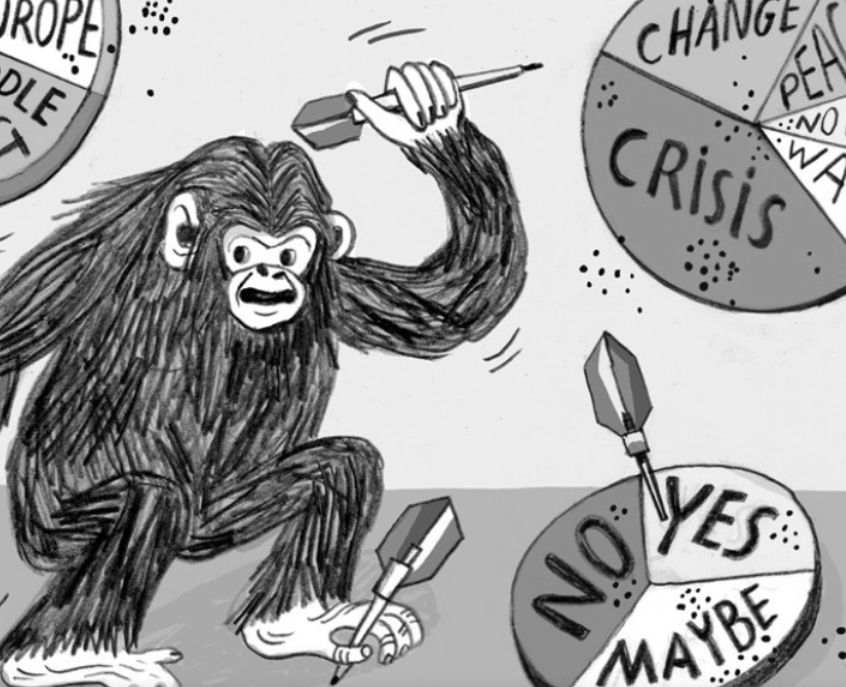

Lately, I've noticed a disturbing trend in my podcast feed. An increasing number of episodes are full of "AI will do X or Y…" predictions. From the doom‑and‑gloom end (*AI will turn humans into paperclips!*) to the utopian extreme (*AI will solve all our problems!*), and everything in between, including the dreaded *AI will take all our jobs by 20...something...*, the stories can get anxiety-inducing fast.

Over time, I've realized that most of this content isn't useful. It's designed to grab attention, not help you make better decisions. In this post, I'll explain why alarming AI predictions tend to overreach what anyone can know, why your brain is wired to pay attention to them anyway, and what you can do to focus on what really matters.

## Most Predictions Are Wrong

There's a body of research showing that many confident expert predictions fail to come true. One of the most widely discussed studies on this was led by Philip E. Tetlock in his book [Expert Political Judgment](https://press.princeton.edu/books/hardcover/9780691178288/expert-political-judgment) and later expanded in [Superforecasting](https://www.penguinrandomhouse.com/books/227815/superforecasting-by-philip-e-tetlock-and-dan-gardner/). Tetlock had hundreds of experts make tens of thousands of predictions about politics, economics, wars, and other complex domains, and then checked how those forecasts actually panned out.

The surprising result? The majority of so-called "experts" were often no better at predicting the future than random chance, or a "dart-throwing chimpanzee" as Tetlock put it. The most confident pundits were often among the worst at forecasting. Credentials and media prominence didn't reliably translate into accuracy.

What did matter was how people approached prediction itself. Tetlock found that a small group he called [superforecasters](https://www.richardhughesjones.com/superforecasting-summary/) consistently performed better by thinking in probabilities rather than absolutes, breaking complex questions into smaller parts, and continuously updating their beliefs as new evidence emerged. Their edge didn't come from bold confidence or impressive credentials, but from treating uncertainty as something to be measured and revised, not ignored.

<aside class="markdown-aside">
I wouldn't spend time seeking out "AI superforecasters", they're unlikely to be the bold, attention-grabbing types making headlines, and in any case, only time will tell.
</aside>

This doesn't mean all predictions are useless. But it does mean sensational, confident (and often vague) predictions are usually not trustworthy, especially when they're made for capturing attention rather than clear, measurable foresight.

So why do the most alarming AI predictions still feel so compelling?

## Negativity Bias

The short answer is that our brains are wired to treat potential threats as urgent. Psychologists call this *negativity bias*: the tendency for negative information to carry more psychological weight than positive or neutral information. Threats, losses, and worst-case scenarios are processed more quickly, remembered more vividly, and exert a disproportionate influence on our judgments.

This bias is a feature of human cognition shaped by evolution. For most of human history, failing to notice danger carried far higher costs than overlooking opportunity. Missing a predator could be fatal; missing a benefit usually wasn't. Our brains evolved to err on the side of vigilance.

Modern psychology has confirmed this pattern. A research paper [Negativity Bias, Negativity Dominance, and Contagion](https://www.researchgate.net/publication/228778181_Negativity_Bias_Negativity_Dominance_and_Contagion) showed that negative information is more potent than equivalent positive information, tends to dominate mixed evaluations, and spreads more easily through memory and social narratives. A single negative element can outweigh many positives.

Another paper [Bad Is Stronger than Good](https://www.researchgate.net/publication/46608952_Bad_Is_Stronger_than_Good), demonstrated that across relationships, learning, and social interaction, bad events have stronger and longer-lasting effects than good ones of similar intensity. Negative impressions form faster, are processed more deeply, and are harder to dislodge once established.

These ideas were later synthesized for a broader audience by Daniel Kahneman, a psychologist and Nobel Prize winning behavioral economist, in [Thinking, Fast and Slow](https://www.penguinrandomhouse.ca/books/89308/thinking-fast-and-slow-by-daniel-kahneman/9780385676533). Kahneman explains how related mechanisms, such as loss aversion (the tendency to feel losses more strongly than equivalent gains) and the availability heuristic (the tendency to judge likelihood by how easily examples come to mind), cause negative possibilities to loom larger in our minds, especially under uncertainty.

In today's media environment, this ancient survival mechanism is easy to exploit. Predictions framed around catastrophe, loss, or existential threat reliably outperform cautious, probabilistic analysis in the attention economy. A podcast teaser asking *Is AI going to end civilization?* or *Will AI take your job next quarter?* triggers a very different response than one about incremental productivity gains. This type of content feels impossible to ignore because it sounds like a threat.

Your brain is doing exactly what it evolved to do: paying close attention to potential danger. The problem is that attention is being captured, not informed. Understanding negativity bias doesn't make us immune to it. But it does make the pattern easier to recognize. And once you see that many sensational AI predictions are optimized for attention rather than accuracy, tuning them out becomes less an act of denial and more an act of cognitive self-defense.

## Concern vs Influence

Once you recognize how easily fear-based predictions hijack attention, the obvious follow-up question is: *What should you do instead?* It's one thing to understand why alarming AI narratives are hard to ignore; it's another to decide where your attention is actually worth spending.

A framework that's helped me answer that question comes from the book [The 7 Habits of Highly Effective People](https://www.franklincovey.com/books/the-7-habits-of-highly-effective-people/) by Steven Covey. In Habit 1, *Be Proactive*, Covey introduces two deceptively simple ideas that map almost perfectly onto today's AI discourse: the **Circle of Concern** and the **Circle of Influence**:

> We each have a wide range of concerns, our health, our children, problems at work, the national debt, nuclear war… As we look at those things within our Circle of Concern, it becomes apparent that there are some things over which we have no real control and others that we can do something about. We could identify those concerns in the latter group by circumscribing them within a smaller Circle of Influence.

In other words, the Circle of Concern contains everything we care about, while the Circle of Influence contains the subset of concerns where our actions, habits, and decisions actually make a difference. Covey emphasizes that proactive people focus on the latter: they put energy into the things they can influence, expanding that circle over time. Reactive people, by contrast, spend most of their attention on worries outside their control, which can increase stress and shrink their influence.

Even though the book was first published in 1989, this lesson is timeless. Applied to AI, much of the media hype, from doomsday scenarios to utopian promises, falls within in our *Circle of Concern*. Focusing on it might trigger anxiety or fascination, but it rarely changes anything we can act on.

By focusing instead on what we can influence, such as our skills, our understanding of AI tools, and how we use them in daily life, we can put energy into tangible progress. This shift, from reacting to speculative futures to acting within our sphere of influence, helps to reclaim attention from fear-driven narratives.

## What I Focus On

So how do I actually sift through the noise?

At this point, it's less about having strong opinions on AI's distant future and more about having a filter for my attention. When considering a piece of content, I'm no longer asking Is this exciting? Is this alarming? I'm asking a actionable question: Does this help me do something better today?

That usually means I gravitate toward material that's educational or practical - explanations that deepen my understanding, or concrete examples of how a tool can be used to solve a real problem. By contrast, I've learned to skip content that exists purely to provoke a reaction. If the entire premise is *Will AI destroy everything?* or *Nothing will ever be the same again!*, there's rarely anything actionable hiding underneath.

Tuning out fear-driven narratives frees up mental bandwidth to focus on things that compound over time: learning new tools, integrating AI into my workflow as an engineer, and using it to reduce friction in everyday tasks. That's my Circle of Influence. It's not about predicting where AI will be a decade from now; it's about deciding where my attention goes this week. For me, that's been a far better use of cognitive energy than worrying about futures I can't control.

## Closing Thoughts

AI is fascinating and important, and it's natural to wonder where it's headed. But not all predictions are equally worth listening to. By understanding how our minds are wired, how predictions really stack up, and where our real influence lies, it's possible to cut through the hype and make your attention work for you, not against you.
