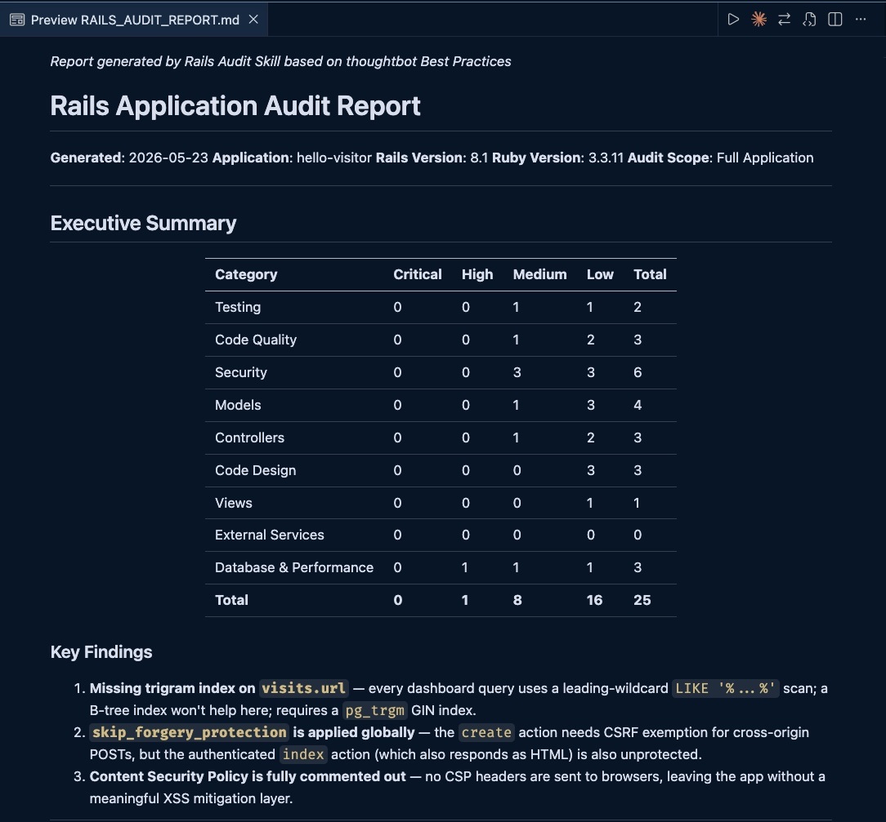
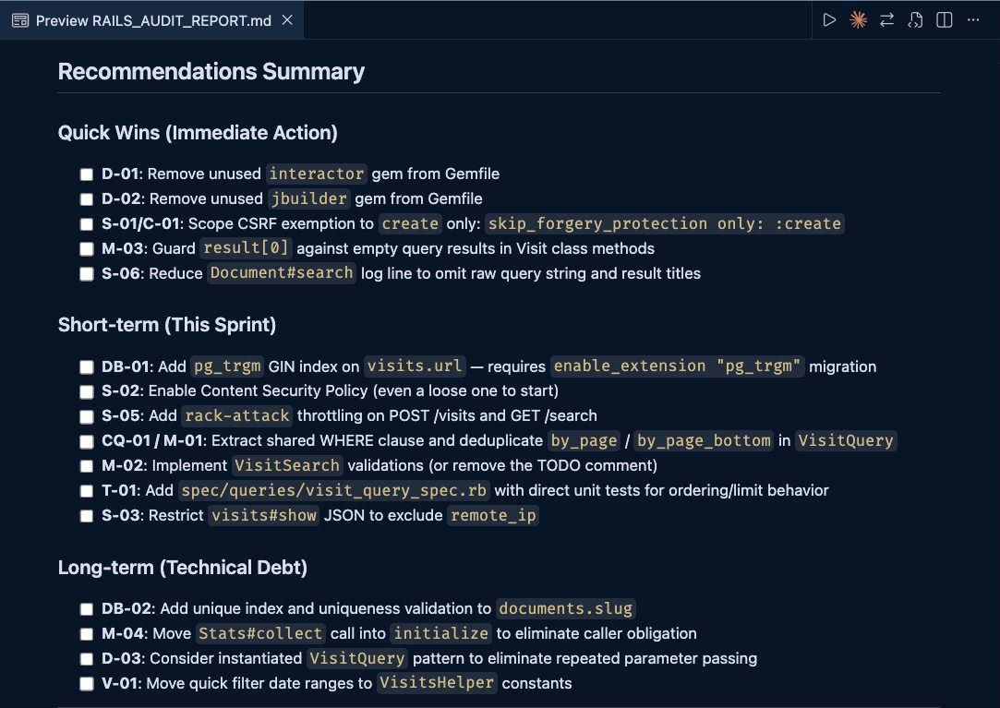
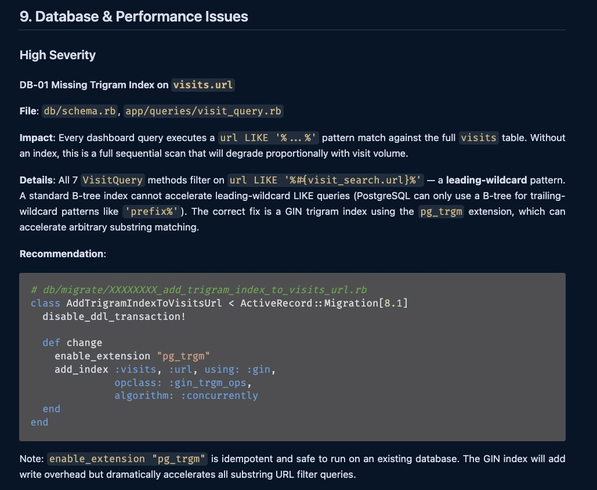
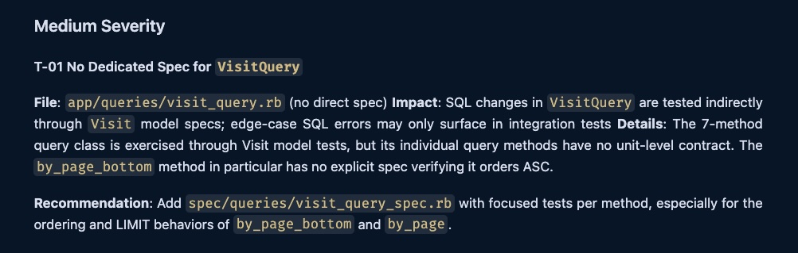
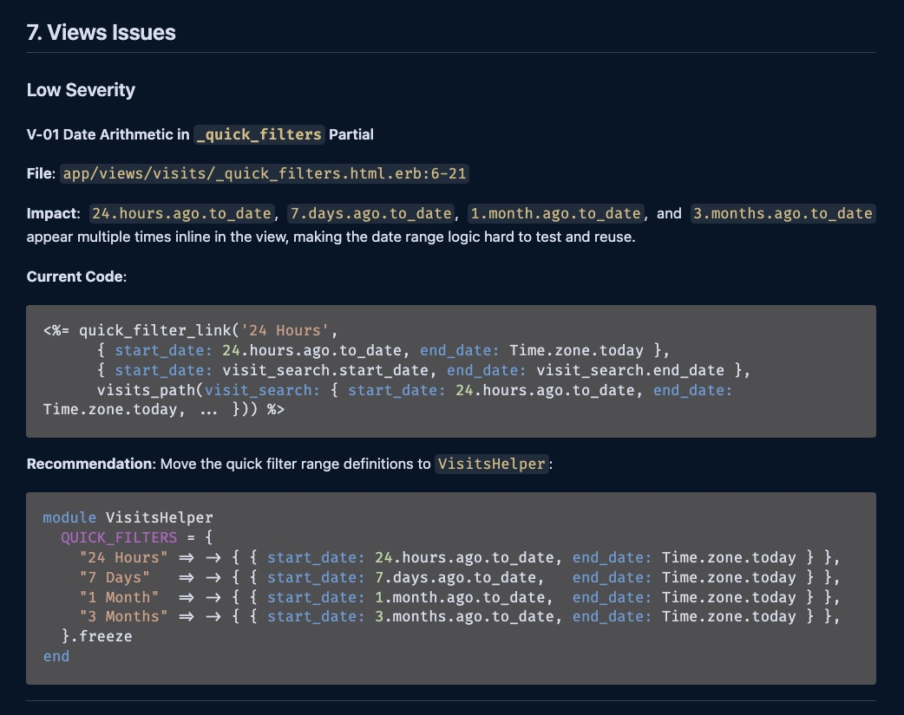
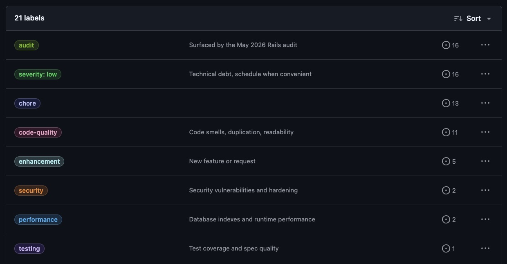

I maintain a small Rails app to power cookie-free page analytics, and search on this blog. It's been chugging along for about five years. Like many solo side projects, it grew over time, and quietly accumulated tech debt. Then I came across the [Thoughtbot Rails Audit skill](https://github.com/thoughtbot/rails-audit-thoughtbot), a Claude Skill that walks a Rails codebase and produces a structured audit report against Thoughtbot's best practices.

This post walks through a few of the findings the audit caught, and a workflow I developed to turn the markdown report into prioritized GitHub issues so improvements can be tackled one at a time.

## What the skill does

A [Claude Skill](https://claude.com/skills) is a packaged set of instructions Claude can follow on demand via a slash command.

The Rails Audit skill walks your codebase against Thoughtbot's Ruby Science and Testing Rails guidance, covering testing practices, security, code design (skinny controllers, POROs, ActiveModel), Rails conventions, database and migration hygiene, external service handling, performance antipatterns, and Ruby style. It can optionally run [SimpleCov](https://github.com/simplecov-ruby/simplecov) for test coverage and [RubyCritic](https://github.com/whitesmith/rubycritic) for code quality metrics if you opt in when prompted. The output is a single markdown report grouped by category and severity.

Installation is one command from the skill's [README](https://github.com/thoughtbot/rails-audit-thoughtbot):

```bash
git clone https://github.com/thoughtbot/rails-audit-thoughtbot \
  ~/.claude/skills/rails-audit-thoughtbot
```

There are three ways to invoke it:

| Context                           | Command                                     |
| --------------------------------- | ------------------------------------------- |
| Terminal, from Rails project root | `claude audit`                              |
| Inside a Claude session           | `/rails-audit-thoughtbot`                   |
| Inside a Claude session, scoped   | `/rails-audit-thoughtbot audit controllers` |

Here's the prompt that I actually typed:

```
/rails-audit-thoughtbot save all reports, output etc to scratch/rails-audit/
```

That trailing instruction is a free-form argument. The skill picks it up and routes its outputs into `scratch/` instead of the repo root, which keeps AI-generated artefacts out of git, as I have `scratch` in my global gitignore file.

The audit ran in under 10 minutes. It generated a single markdown file named `RAILS_AUDIT_REPORT.md` with an Executive Summary, a Key Findings list, then the findings themselves grouped by category (Testing, Security, Models, Controllers, Database & Performance, etc.) with detailed explanations and recommended fixes. Within each category, issues are listed as high, medium, or low severity. The report closes with a Recommendations Summary that re-groups the findings into Quick Wins, Short-term, and Long-term buckets.


...


## What it actually caught

The full report had 25 findings across 9 categories. I'm only going to walk through three, because each one is a different *shape* of finding and together they hint at the range of things an audit like this can surface.

### A missing trigram index

This was marked as high severity in the Database & Performance section. Every dashboard query in my analytics project filters visits by URL with `LIKE '%...%'`, a leading-wildcard pattern that a standard B-tree index can't accelerate. The fix is to enable the [pg-trgm](https://www.postgresql.org/docs/current/pgtrgm.html) extension, then add a GIN trigram index on `visits.url`.

I'd noticed the dashboard getting sluggish over the years but never had time to dig into it. Fixing it turned out to be relatively easy.

Here's the actual section of the audit:



### A class with no dedicated tests

`app/queries/visit_query.rb` is the SQL layer behind the analytics dashboard. It had no spec file of its own. Its query methods were exercised indirectly through integration tests, but not every branch was covered, and the SQL behaviour itself wasn't pinned down anywhere. The audit recommended a dedicated spec file so each query method has its own focused tests.

Here's the actual section of the audit:



### Date arithmetic hiding in a view partial

The analytics dashboard's "Quick Filters" partial has buttons for 24 Hours, 7 Days, 1 Month, 3 Months. The audit pointed out that the implementation lived directly in the ERB. The same `24.hours.ago.to_date` / `7.days.ago.to_date` / `1.month.ago.to_date` literals appeared multiple times inside the same partial: once for the link's target, once for the active-state check, once for the URL. The audit recommended pulling the ranges into `VisitsHelper` as a constant hash so the view loops over a single source of truth.

This is a view-layer organization smell: the code works, but having the logic directly in the view makes it difficult to test and re-use.

Here's the actual section of the audit:



## Turning the report into a backlog

The report is a single markdown file. Useful as a one-time read, but in order to start making the improvements, I needed each finding as its own GitHub issue, labelled by severity and area so I could filter the list down to whatever fit the time I had. The next sections walk through how I went from audit report to organized GitHub issues.

### 1. Draft one issue file per finding

The first step was to split the report into one markdown file per finding, so I could think about each one in isolation before any of it touched GitHub. My prompt:

> read: scratch/rails-audit/RAILS_AUDIT_REPORT.md
> i want to split out the recommended improvements into separate tickets, and actually i dont completely understand all of them so each one needs a writeup like what the problem is and why we're addresing it and what expected results are and how the agent can verify its own work that the change was done correctly
>
> so please create a new dir: scratch/rails-audit/issues
> and under there writeup a file per each issue with the title and description, eventually these will get created as github issues so we can address them one at a time

The key parts of this prompt are asking for the *why* behind each finding so each ticket would teach me something rather than just hand off a task to an agent, and asking for a verification step so every issue carries its own success criteria when an agent later picks it up.

### 2. Have Claude propose a label scheme

With the per-finding files in hand, I wanted labels so I could later filter the GitHub issues by severity and area. The existing repo only had the default GitHub labels (`bug`, `help wanted`, `good first issue`, etc), which weren't enough.

I asked Claude to read both the audit report and the issue files I'd just generated, and propose a set of new labels:

> read scratch/rails-audit/RAILS_AUDIT_REPORT.md
> then quickly skim through all the issue md files in: scratch/rails-audit/issues
> specifically at severity and category and just the problem statement
> then look at what github issue labels are already available in this project
> then writeup as sibling to the audit report a file like github-issue-new-labels.md and propose what new labels would be useful for later when we create all these issues, and choose colors as well i use dark theme

Claude came back with eight labels across three groups: severity (high/medium/low), area (security/performance/testing/code-quality), and a single `audit` origin tag so I could later filter back to the source.

<aside class="markdown-aside">
For anything beyond a quick lookup, I usually ask Claude to write its answer to a markdown file under <code>scratch/</code> rather than just reply in the terminal. Formatted markdown is easier to skim than scrolling a session, and I can come back to it days later without hunting for the right conversation. <code>claude --resume</code> exists for picking up a session, but navigating a directory of named files is faster than scanning conversation summaries when I just want to re-read one specific answer.
</aside>

### 3. Apply labels back to the issue files

The label scheme lived in `github-issue-new-labels.md`. The issue files didn't know about it yet. So my next prompt was:

> now update all the md files in scratch/rails-audit/issues with all the labels each should get

Each issue file now had a `**Labels**` line declaring exactly which labels it should be created with, so the eventual `gh issue create` loop could just parse that line out of each file.

### 4. Create the labels on GitHub

Up to this point everything was local markdown. Now the labels needed to actually exist on GitHub before I could attach them to issues:

> read: scratch/rails-audit/github-issue-new-labels.md
> then create the new labels

The proposal file already had the names, colors, and descriptions; Claude just had to translate them into `gh label create` calls. Here is the result on GitHub:



<aside class="markdown-aside">
This and the next step assume the <a class="markdown-link" href="https://cli.github.com/">GitHub CLI</a> (<code>gh</code>) is installed and authenticated. Claude uses it for all GitHub operations, such as creating labels, issues, PRs, etc.
</aside>

### 5. Create the issues on GitHub

By this point all the thinking was in the files: each one had its title, body, and labels. The next prompt was simply to get Claude to create the issues and label them accordingly:

> for each md file in scratch/rails-audit/issues
> create the issue

Two lines. Claude wrote a loop that read the title and `**Labels**` line out of each file and called `gh issue create` for each one.

**Why the detour matters**: editing 25 markdown files locally is cheap. Editing 25 GitHub issues after the fact is awkward: every change is a PUT, every typo a notification email. Doing the thinking in plain files, *then* batch-pushing, kept the loop fast.

### 6. Work the backlog

I started with `severity: high` (just the trigram index), then moved into the medium pile. Beyond that there's no schedule; I work one or two on a weekend when I have time, then nothing for a few weeks, then maybe one more. Because every finding is a labelled issue, I can drop in and out without losing context. Filter by `severity: medium`, pick whichever has the cleanest scope for the time I have, ship a PR. The labelled backlog is what makes "a few hours when I have them" actually add up over time. Without it, this whole list would have lived in `scratch/rails-audit/` forever.

### What this actually cost

The 8-minute audit headline is only the audit itself, not the rest of the workflow above. End-to-end, from invoking the skill to having all the labelled issues live on GitHub, was an afternoon. About 72 minutes was active Claude conversation across five sessions; the rest was me reading the report, deciding what I wanted, and breaks. The active typing time is small; the *thinking* time isn't.

<aside class="markdown-aside">
I reconstructed those times by reading my own Claude Code conversation history. Every Claude Code conversation is persisted as a <code>.jsonl</code> file under <code>~/.claude/projects/&lt;encoded-project-path&gt;/</code>, one event per line with timestamps. That means Claude can read its own history, so if you've forgotten how long a session took, what you actually typed, or which conversation a decision happened in, you can just ask.
</aside>

## The skill is opinionated

The audit reflects thoughtbot's house style: business logic in models, POROs, or ActiveModel objects rather than service objects; names that read as Ruby objects (`Stats#collect`) rather than as patterns (`StatsCollector#call`); skinny controllers, decomposed models.

In Hello Visitor's case this lined up: the codebase already uses `VisitSearch` (ActiveModel form object), `VisitQuery` (raw SQL PORO), and `Stats` (plain aggregate). The audit was effectively grading against the style I happened to use, which made it work well here. It might land differently on a codebase built around `Interactor` / `call` / service objects.

The skill's README doesn't document any config for projects that intentionally diverge. What you can do (and this is inference, not documentation) is pass intent in the same free-form arg, something like *"we use the Interactor pattern deliberately; don't flag it as an issue."* I haven't tested how reliably the skill respects that, but it's what I'd try first.

## Wrapping up

The audit was worth running because the workflow gave me a backlog I can actually work: labelled, severity-sorted, one issue at a time. The opinionatedness lined up with my style; that's not a given on every codebase, so your mileage will vary.

If you want to try a similar workflow on your own project, I bundled it into a [companion gist](https://gist.github.com/danielabar/87730357992409e51384cc41bdc0e07a). Drop it into your project as `scratch/rails-audit/AGENT_PLAYBOOK.md`, point Claude at it with *"read scratch/rails-audit/AGENT_PLAYBOOK.md and execute it"*, and it'll walk through the same steps.

The trigram index was the most satisfying find, a real performance issue I'd been quietly noticing for years. The rest of the backlog is making its way through one PR at a time, as I have time.

## TODO
* WIP screenshots
* WIP edit (next up: Create the issues on GitHub)
* link to Thoughtbot, mention Rails consultancy
* conclusion - maybe focus on sort of like having a professional consultant review? emphasize not replacing human but a good starting point for improving code quality
* tidy up spelling/grammar/line breaks on prompts, then somewhere add that prompts where cleaned up for that but otherwise are exactly what was typed
