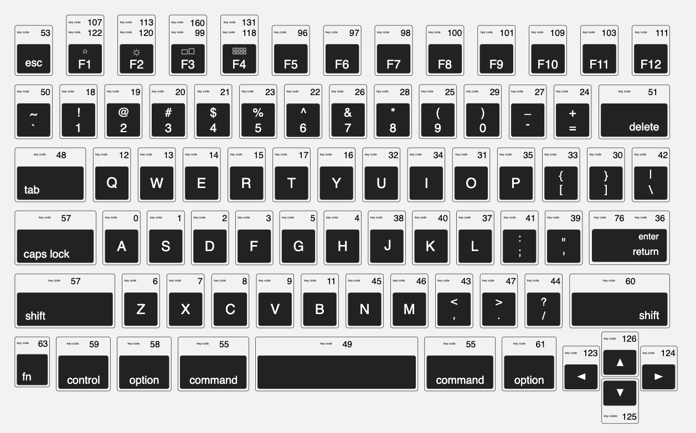

This post will explain how to automate a series of key sequences on a Mac and assign a keyboard shortcut to play the entire sequence. But first, a little background on how I came to be solving this particular problem.

I recently found myself having to use a website to perform a critical task. This website required constantly refreshing, as in every second, to get up to date data. However, pressing the browser refresh button or keyboard shortcut for refresh triggered navigation to the previous page rather than refreshing the current data. The only way to force a refresh on the current page was to select a different value from a dropdown that had values for number of kilometers away for the location data being displayed. For example, 10km away, 20km away, etc.

At first I was using the mouse to do this which involved one click on the dropdown control to open it, and another click on any option other than the currently selected one. However, after a few minutes of this, my right wrist (mouse hand) began to ache. Fortunately the dropdown was keyboard accessible, and could be manipulated with the following key sequence:

* <kbd class="markdown-kbd">Space</kbd> to open the dropdown.
* <kbd class="markdown-kbd">Tab</kbd> to move the focus to the next selection within the open dropdown.
* <kbd class="markdown-kbd">Down Arrow</kbd> to select the next option, if current selection was last in the list, this would circle around to the first selection.
* <kbd class="markdown-kbd">Enter</kbd> to submit the change.

However, after several more minutes of refreshing via keyboard, both my wrists started to ache. This is something to watch out for if you type for a living, a repetitive strain injury can put a serious dent in your career. That's why seeking out automation solutions to replace repetitive tasks is so important. In this case, I wasn't seeking to replace the entire workflow, only this small repetitive sequence that was causing wrist strain.

<aside class="markdown-aside">
The automation solution described in this post is not a bot that scoops up concert tickets or causes other such mischief by impersonating human users. It is only to automate a small repetitive sequence that is otherwise painful to execute over and over. A real human is still required to provide personal information to authenticate to the website and get to the location selection screen.
</aside>

You would think there was a built-in macro recorder on Mac for this sort of thing, but that's not the case. There are a few third party apps, some paid, some freemium, but it seemed like overkill to install an app just for this small automation. It turns out, it is possible to do with native Mac apps, but the solution is not intuitive. There are four parts to the solution:

1. Use the built-in [Script Editor](https://support.apple.com/en-ca/guide/script-editor/welcome/mac) app to write an [AppleScript](https://developer.apple.com/library/archive/documentation/AppleScript/Conceptual/AppleScriptLangGuide/introduction/ASLR_intro.html) script to activate Chrome (or whatever browser) and send the key sequences as system events.
2. Use the built-in [Automator](https://support.apple.com/en-ca/guide/automator/welcome/mac) app to "register" the AppleScript as a service.
3. Use the [Keyboard Preferences](https://support.apple.com/en-mide/guide/mac-help/kbdm162/mac) to assign a keyboard shortcut to the newly registered service.
4. Enable the Automator, Script Editor, and the custom script to control your computer in the [Security & Privacy](https://support.apple.com/en-ae/guide/mac-help/mh32356/mac) -> Accessibility preferences.

Ok, let's dive into each of these.

## 1. ScriptEditor

Launch the [Script Editor](https://support.apple.com/en-ca/guide/script-editor/welcome/mac) app, create a new file, and enter the following AppleScript code. `tell` is is a statement that sends a command to a script object:

```applescript
tell application "Google Chrome" to activate

tell application "System Events"
	-- Space
	key code 49

	-- Tab
	key code 48

	-- Down Arrow
	key code 123

	-- Enter
	key code 76
end tell
```

This script ensures that Chrome is the active application, and then uses the `key code` command to emulate key presses using Apple's system events. You're not limited to these key codes of course, you can script any sequence you like using this [reference](https://eastmanreference.com/complete-list-of-applescript-key-codes):



Hit <kbd class="markdown-kbd">Cmd</kbd> + <kbd class="markdown-kbd">s</kbd> to save the script, but save it as an *application* (app extension), not a script file. Save this anywhere you like, but remember the location, we'll return to this later.

<aside class="markdown-aside">
AppleScript can be used to do a lot more than automating the keyboard. It can be used to create custom workflows for just about any aspect of your Mac and even to create apps. This post is limited to keyboard automation but if you're interested in learning more about what can be done with AppleScript, checkout this <a class="markdown-link" href="https://discover.hubpages.com/technology/applescript_code">post</a>.
</aside>

## 2. Automator

Although it's not obvious, this next step will register the script app created in the previous step as a Service, which is necessary for being able to assign a keyboard shortcut to it.

Launch the [Automator](https://support.apple.com/en-ca/guide/automator/welcome/mac) app and choose Quick Action.

Set the "Workflow receives" dropdown to "no input".

Using the search bar at the top, search for "Launch Application" and drag the result to the middle of the workflow pane (on top of the message that says Drag actions or files here).

From the Launch Application inner pane that gets created, click on the Application dropdown and select the script `.app` file created in the previous step. Unless you saved it in the main Applications folder, it probably will not show up in the list of options. However, the second from last option says "Other...", select that. It will open a file finder window, navigate to wherever you saved your `.app` file and select it.

Notice that it only allows selection of `.app` files, this is why we saved our script as an application in the previous step.

Hit <kbd class="markdown-kbd">Cmd</kbd> + <kbd class="markdown-kbd">s</kbd> to save the Quick Action. Give it a meaningful name such as "Chrome Dropdown Selector". This save dialog doesn't give you a choice as to where the Quick Action gets saved, but fyi, it will be saved in ` ~/Library/Services/*.workflow`.

## 3. Keyboard Shortcut

Open System Preferences -> Keyboard.

Click on "Services" from the left pane. Then in the right pane, scroll all the way down to "General". Here you will see the Quick Action created in the previous step. It will show up as whatever name you saved it as.

Select your Quick Action, then click on the "Add Shortcut" button directly beside it, and press your desired keyboard shortcut to associate it with this Action. Test that your desired shortcut isn't already in use for some other feature.

Almost there, one more step to pull this all together.

## 4. Security

By default, Mac will not allow any custom scripts/workflow/automation etc to control your computer. This must be enabled with the following steps:

* Open System Preferences -> Security & Privacy.
* Click the lock icon at the bottom left and enter your computer password.
* Select Accessibility from the left hand side.
* Click on the Privacy tab at the top.
* From the right hand list of applications, make sure Automator and Script Editor are selected. If they don't appear in the list, click on the plus button, locate them from the Applications folder (might be under Applications/Utilities) and add them.
* Also add the script app file created in Step 1.

Now open the browser to the web site where the automation should be performed, ensure focus is on the select control, and hit the keyboard shortcut that was set in Step 3.

## Conclusion

Phew, that was a lot of work, but worth it to save some wrist strain. This is just the tip of the iceberg in terms of what these automation tools can do for your Mac. Here are some resources I used to put this all together and further reading:

* [Automate Keyboard with AppleScript](https://eastmanreference.com/how-to-automate-your-keyboard-in-mac-os-x-with-applescript)
* [Complete List of AppleScript Keycodes](https://eastmanreference.com/complete-list-of-applescript-key-codes)
* [Save AppleScript as Application](https://www.addictivetips.com/mac-os/convert-an-applescript-to-an-app-on-macos/)
* [Run AppleScript with Keyboard Shortcut](https://www.addictivetips.com/mac-os/run-an-applescript-with-a-keyboard-shortcut-on-macos/)
* [AppleScript Language Guide](https://developer.apple.com/library/archive/documentation/AppleScript/Conceptual/AppleScriptLangGuide/introduction/ASLR_intro.html)
* [10 Cool Things to do with Automator](https://www.idownloadblog.com/2018/11/21/cool-things-mac-automator-tutorial/)