If you've ever given a presentation at a conference, meetup, or even a lunch and learn for your colleagues at work, you probably needed some slides to go along with your talk. The standard tools to make these are Microsoft PowerPoint, Apple Keynote, or Google Slides. These will get the job done, with PowerPoint and Keynote being more feature rich than the free Google Slides.

However, if you're a web developer, there is another option. [RevealJS](https://github.com/hakimel/reveal.js/) is a JavaScript framework that allows you to leverage your HTML, CSS, and JavaScript skills to build beautiful and polished presentations. Some benefits this has over the standard software packages include being able to use version control (since the presentation is just html, css, and js files rather than a proprietary binary format), collaborate with others, and the sheer joy of using your favorite web technologies and text editor.

This post will walk you through how to get started with RevealJS, build a simple presentation, and publish it to Github Pages so you can share it with the world. If you want a quick "reveal" so to speak, here is the sample [presentation](https://danielabar.github.io/demo-presentation/) we're going to be building and the [source](https://github.com/danielabar/demo-presentation).

## Getting Started

The build tooling for RevealJS uses [Node.js](https://nodejs.org) so make sure you have that installed. I like to be on the latest LTS version.

Start by cloning the RevealJS repo from Github, installing the dependencies, then run the dev server:

```bash
git clone git@github.com:hakimel/reveal.js.git
# rename the directory to whatever you like
mv reveal.js demo-presentation
cd demo-presentation
npm install
npm start
```

At this point, you should be able to navigate to [http://0.0.0.0:8000](http://0.0.0.0:8000) and view the simple presentation that comes with the repo. Use the left/right arrow keys to navigate back and forth, or click on the caret icons displayed on the bottom of the slide. As you navigate the slides, notice the url changes, eg: `http://0.0.0.0:8000/#/1` and a blue progress bar animates across the bottom of the page. All these features are configurable as we'll learn later.

Now we're ready to start building the presentation.

## Slides

Open the `demo-presentation` project (or whatever you called it in the Getting Started step earlier) in your editor of choice. I'll be using VS Code.

Open the file `index.html` - this is where you'll be making the majority of changes. The entire presentation is contained in a div with a class of `slides`, which is contained in another div with a class of `reveal`. Each `<section>content...</section>` element denotes a slide.

Right now it looks as follows:

```html
<div class="reveal">
  <div class="slides">
    <section>Slide 1</section>
    <section>Slide 2</section>
  </div>
</div>
```

Delete the two `<section>` elements that came with the repo, and replace them with some content as shown below:

```html
<section>
  <h1>Demo Presentation</h1>
</section>

<section>
  <h2>I'm a Sub Heading</h2>
  <p>Here is some content.</p>
  <p>and more content!</p>
</section>
```

As soon as you save the changes, the presentation should refresh in the browser. The auto-refresh feature is provided by the development server that comes with the project. At this point, there are still two slides but the content has changed. Notice the default styles that get applied for `<h1>`, `<h2>`, and `<p>` elements. Don't worry if you don't exactly like these styles, everything's customizable.

Also notice how everything is centered and pleasing to look at. Try resizing the browser window or use Device Mode in Chrome devtools. Mobile/responsive design is already built into the presentation styles, nice!

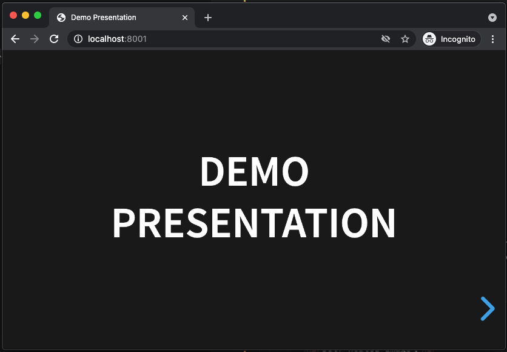

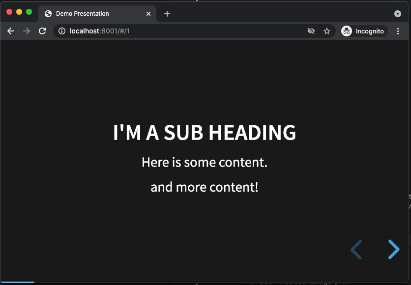

## Vertical Slides

Generally a presentation progresses linearly from left to right across each slide. But sometimes, the content needs to go off on a tangent, say to explain some point in more detail before moving on with the rest of the presentation. Vertical slides are a great way to organize this type of content. To try this out, nest a `<section>` element inside another element like this:

```html
<section>
  <p>This will remain visible for all vertical slides</p>
  <section>Here is some vertical content</section>
  <section>and some more</section>
  <section>more stuff...</section>
</section>
```

Save the changes, then navigate to the third slide in the presentation. Notice there's now a down caret in addition to the left pointing caret. Click it (or press the down arrow), the slides will now start to transition according to the nested `<section>` elements. This only works one level deep, do not try to nest any deeper. At any point the usual left/right key or arrow navigation still works to move to the previous or next slides.

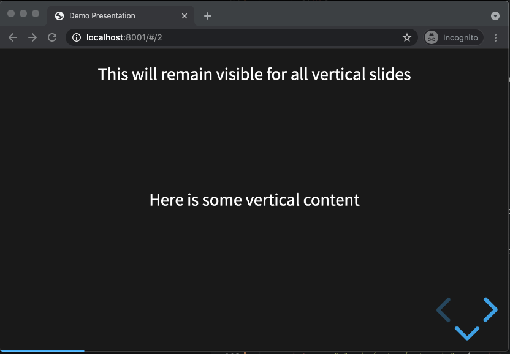

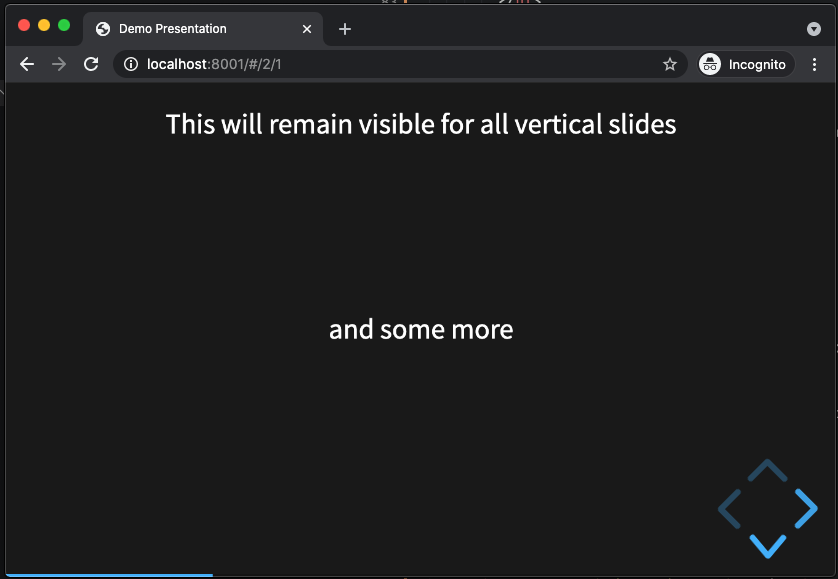

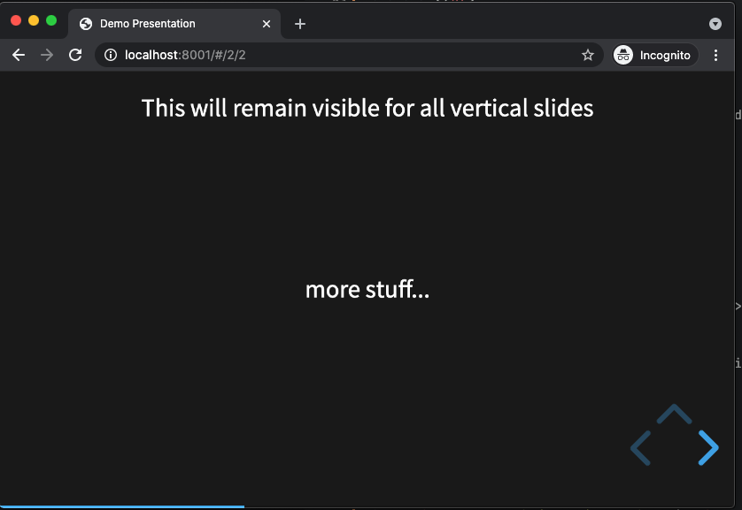

### Overview

With a lot of vertical slides, it can be useful to jump out and get a bird's eye view of the entire presentation. To do this, press the <kbd class="markdown-kbd">o</kbd> key from any slide. It should look something like this:

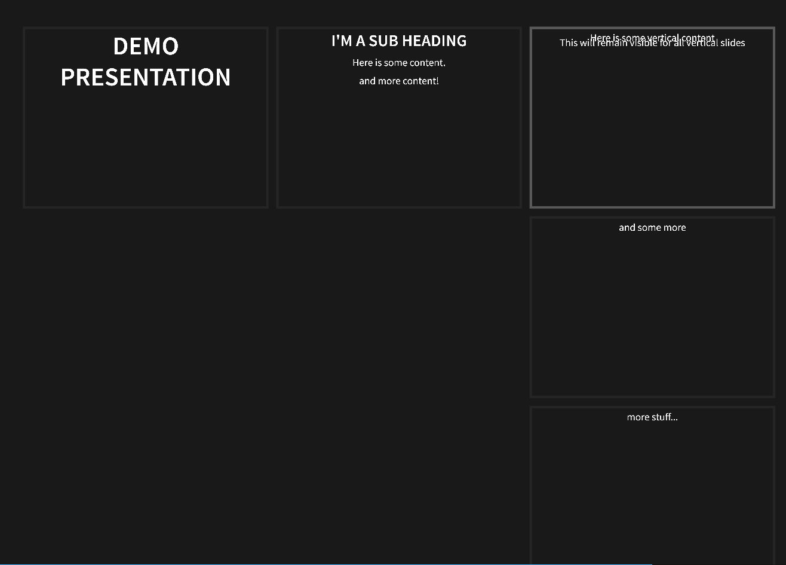

Press the <kbd class="markdown-kbd">esc</kbd> key to return to regular slide mode.

## Images

To add images to the presentation, make an `images` directory in the project root and place any image(s) you'd like in this directory. Then simply use the standard html `` tag to display the image centered in the slide, don't forget the `alt` tag:

```html
<section>
  <h2>Self hosted image</h2>
  
</section>
```

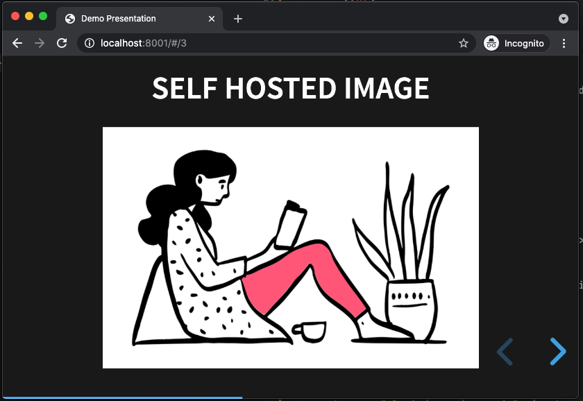

Note: The framework is not opinionated about where the images are placed so feel free to name this directory anything you like or even to place the images in project root if there's not too many of them.

Of course you can also simply link to an image from the internet, for example:

```html
<section>
  <h2>Linked image</h2>
  
</section>
```

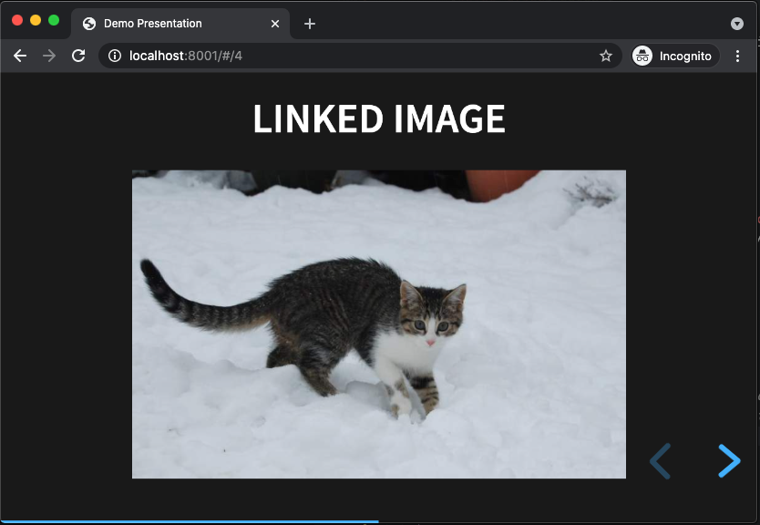

## Full Screen Background

By default, all the slide content is contained within a portion of the screen to fit any display and scale. But if you want to break outside of this container to use up the entire background, this can be done with the `data-background` attribute on any `<section>` element.

For example, to have an animated gif take up the entire slide:

```html
<section data-background="https://media.giphy.com/media/3oKIPmDhXaieiJE3Sg/giphy.gif">
  <h2>Full Screen Background</h2>
</section>
```

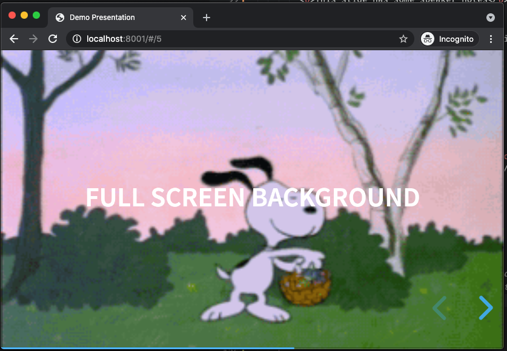

## Animate in Visibility

Fragments are used to animate content in a slide, one element at a time. This is useful when you don't want all the content to show up at once. A classic example is a bullet point list where you want to talk to each point one at a time. To add visibility animation to any element, simply add `class="fragment"`.

For example:

```html
<section>
  <h2>fragments in DOM order</h2>
  <ul>
    <li class="fragment">This item will be displayed first</li>
    <li class="fragment">This item will be second</li>
    <li class="fragment">And this will be last</li>
  </ul>
</section>
```

Use the left/right arrow keys to have the elements animate in, or click on the caret icon at the bottom of the presentation.

By default, fragments will animate in the same order that they appear in the DOM. The order can be controlled by adding `data-fragment-index` to any element that has a `class="fragment"`. For example, to display a list in reverse order:

```html
<section>
  <h2>Fragments in Custom Order</h2>
  <ul>
    <li class="fragment" data-fragment-index="3">Third</li>
    <li class="fragment" data-fragment-index="2">Second</li>
    <li class="fragment" data-fragment-index="1">First</li>
  </ul>
</section>
```

The default animation is for elements to fade in. But there are a number of other animations available such as fade up, down, left, right, changing color etc. To use these other effects, add the appropriate class to the fragment. For example:

```html
<section>
  <h2>Another Fragment Example</h2>
  <p class="fragment fade-left">I will fade in from the left</p>
</section>
```

The RevealJS docs list all the possible [fragment animation classes](https://revealjs.com/fragments/).

## Custom CSS

The framework comes with a lot of built in styles for headers, paragraphs, lists etc. It's possible to customize any of these by adding the `data-state` attribute to any `<section>` element.

```html
<section data-state="my-style">
  <p>I'm special!</p>
</section>
```

The `data-state` attribute causes the value, in this example `my-style` to be added as a class on the `<body>` element. This allows for overriding of the framework styles by using a selector such as `.my-style p`.

One thing I couldn't find in the docs was where to place custom styles. The quickest way for now is to add a file in the dist dir such as `dist/custom.css` and then add a link to it in the `<head>` section of `index.html`, after all the framework css is loaded:

```html
<!-- Framework -->
<link rel="stylesheet" href="dist/reset.css">
<link rel="stylesheet" href="dist/reveal.css">
<link rel="stylesheet" href="dist/theme/black.css" id="theme">

<!-- Theme used for syntax highlighted code -->
<link rel="stylesheet" href="plugin/highlight/monokai.css" id="highlight-theme">

<!-- Add your custom stylesheet here -->
<link rel="stylesheet" href="dist/custom.css">
```

Now edit `custom.css` - adding a class for the value in `data-state`, for example, to make the paragraph text bright pink and pop out:

```css
.my-style p {
  color: #fcdde8;
  font-size: 180px;
  font-weight: 900;
  text-shadow: -0.0075em 0.0075em 0 #fef2f6,
    0.005em 0.005em 0 #f6a5c1,
    0.01em 0.01em 0 #f7aac4,
    0.015em 0.015em #f7aec7,
    0.02em 0.02em 0 #f8b3ca,
    0.025em 0.025em 0 #f8b7cd,
    0.03em 0.03em 0 #f8bcd0,
    0.035em 0.035em 0 #f9c0d3;
}
```

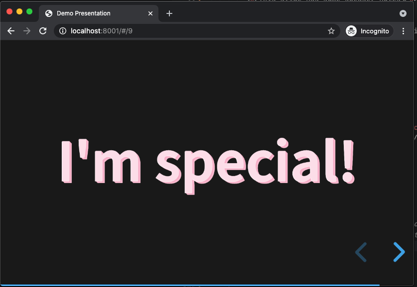
## Speaker Notes

One really helpful feature when giving a talk is the ability to have speaker notes displayed in a separate window from the presentation. RevealJS makes it easy to add these. Add an `<aside class="notes">` element anywhere in a `<section>` element (i.e. slide), then that content will not be displayed in the
slide, for example:

```html
<section>
  <p>This slide has some speaker notes</p>
  <aside class="notes">
    These are the speaker notes.
    They are only visible in a separate window after pressing the s key.
  </aside>
</section>
```

From the browser where the presentation is being displayed, press <kbd class="markdown-kbd">s</kbd> to reveal the speaker notes in a new browser window. This window also conveniently has a timer, and displays the current and upcoming slide to help keep you on track. It looks something like this:

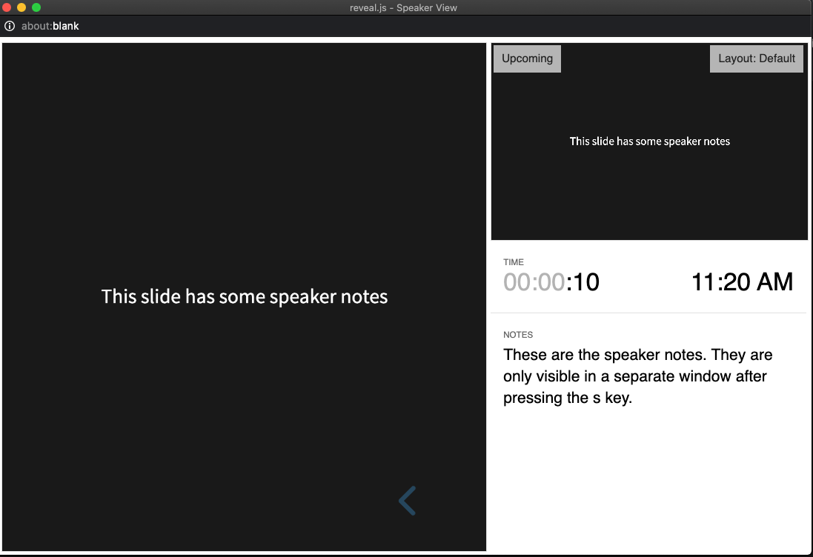

## Themes

By now you'll have noticed there's some common styling applied to all the slides such as a black background and blocky white text. These styles come from the `black` theme stylesheet that is referenced in the head section of `index.html`:

```html
<head>
  ...
  <link rel="stylesheet" href="dist/theme/black.css" id="theme">
  ...
</head>
```

This can be changed to any of the built-in themes RevealJS comes with, which are listed in the `dist/theme` directory. To change, simply swap out  `black.css` for any other theme, for example, I like `moon` theme, which has a dark blue background and thick grey text:

```html
<head>
  ...
  <link rel="stylesheet" href="dist/theme/moon.css" id="theme">
  ...
</head>
```

Here's one of the slides from our presentation now with `moon` theme applied:

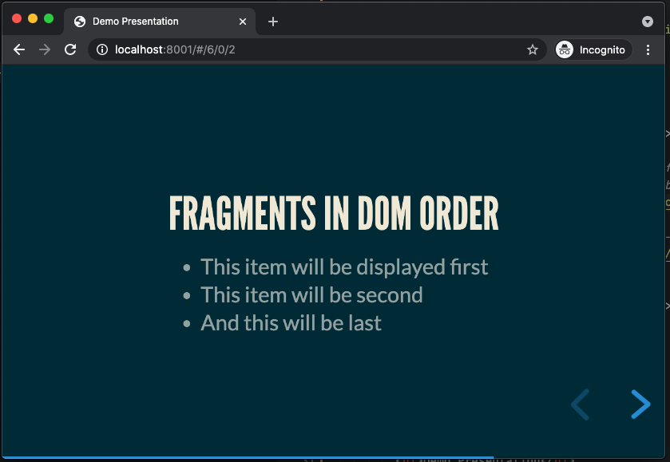

It's also possible to create a [custom theme](https://github.com/hakimel/reveal.js/blob/master/css/theme/README.md).

## Slide Transitions

Up until now, we've been dealing with the HTML and CSS. But to further customize the presentation, there's a `<script>` section at the bottom of `index.html` where the framework gets initialized. Here you can control many features of how the presentation will behave. For example, by default, the slides transition with a slide animation going from right to left. This can be changed by specifying the `transition` property of the object passed to the `Reveal.initialize` function.

For example, to use a `convex` transition:

```js
<script>
  // More info about initialization & config:
  // - https://revealjs.com/initialization/
  // - https://revealjs.com/config/
  Reveal.initialize({
    hash: true,

    // Add your config here:
    transition: 'convex',

    // Learn about plugins: https://revealjs.com/plugins/
    plugins: [RevealMarkdown, RevealHighlight, RevealNotes]
  });
</script>
```

## Further Customization

Besides slide transitions, many more features of the framework can be controlled through configuration. Just to list a few examples:

```js
<script>
  Reveal.initialize({
    // Add the current slide number to the URL hash so that reloading the
    // page/copying the URL will return you to the same slide
    hash: true,

    // Add your config here:
    transition: 'convex',           // default 'slide'
    transitionSpeed: 'slow',        // slow down slide transitions
    controlsTutorial: false,        // turn off arrow bumping
    controlsLayout: 'edges',        // default 'bottom-right'
    controlsBackArrows: 'visible',  // make previous slide arrow bright instead of faded
    progress: false                 // turn off progress bar display

    // Learn about plugins: https://revealjs.com/plugins/
    plugins: [RevealMarkdown, RevealHighlight, RevealNotes]
  });
</script>
```

Read about all the [configuration options](https://revealjs.com/config/) in the RevealJS docs.

## Publish to Github Pages

It's time to share our presentation with the world. To do this, we'll use [Github Pages](https://pages.github.com/), which is free static web site hosting provided by Github. In order to do this, we need to create a new git repository with a branch named `gh-pages`, then create a corresponding repository on Github, and push the project files to this branch.

Start in a terminal at the project root and run the following commands:

```bash
# To not have the Funding button displayed in your Github repo
rm FUNDING.yml
# A clean start to not have framework commit history
rm -rf .git
# Initialize a git repo with default branch `gh-pages` instead of the default `main`
git init -b gh-pages
# Add all project files to the newly created `gh-pages` branch
git add .
# Commit changes: Use whatever commit message you wish
git commit -m "Initial commit"
```

Now login to your [Github](https://github.com/) account and create a new repository. At the time of this writing, the new repo menu button is located at the top right of the Github landing page, given that you're logged in:

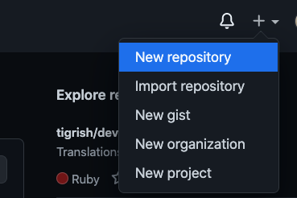

Make the repository name the same as your project. For example, mine will is `demo-presentation`. Optionally add a description. Make sure `Public` option is checked. Leave all the other checkboxes blank because we're going to be pushing up the project files in the next step:

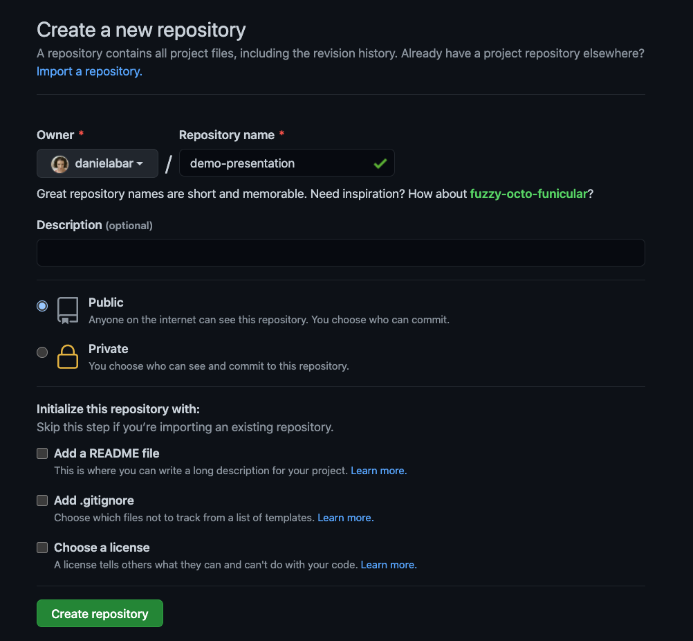

Now, Github will display a page with instructions for how to push your code up, normally you could just copy paste this, but that will create a default `main` branch. This case is a little different because we want `gh-pages` branch for static hosting. Run the following replacing `yourGithubUserName` and `your-repo-name`:

```bash
git remote add origin git@github.com:yourGithubUserName/your-repo-name.git
git push -u origin gh-pages
```

After the push has completed, go back to Github in your browser and refresh the project page. The code you just pushed should be displayed.

And now, to finally see your presentation published on the web, click on Settings from your repository page:

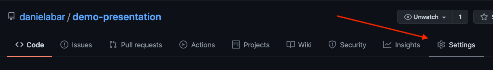

Then scroll down to the "GitHub Pages" section. It should show something like the following:

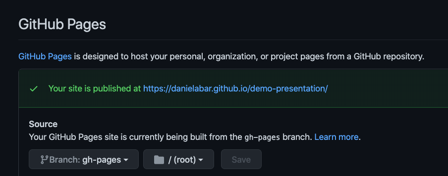

Go ahead and click on the "Your site is published at" link. The presentation is now publicly available at that url, which in general will look like `https://yourGithubUserName.github.io/your-repo-name/`.

Of course you're not limited to Github Pages for deployment. Since the project is just html, css, and javascript, it can be deployed to any static web site host.

## Next Steps

This post has just barely scratched the surface of all the features that RevealJS provides. Checkout the  [documentation](https://revealjs.com/) to learn more about it. There's also a rich ecosystem of [plugins](https://github.com/hakimel/reveal.js/wiki/Plugins,-Tools-and-Hardware) in case you need some behavior that's not provided by the framework. I hope you'll give this a try next time you're giving a talk and good luck with your presentation!
