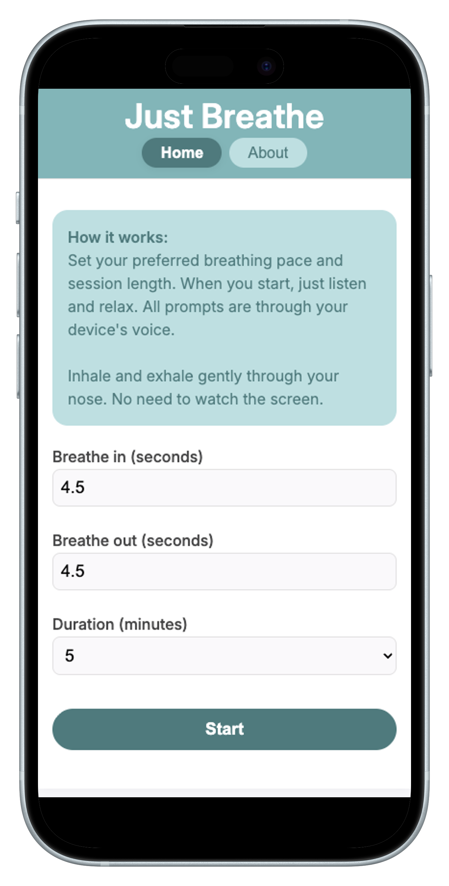
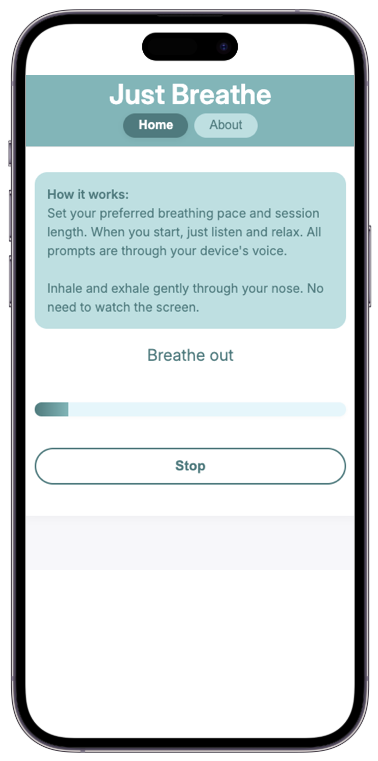

This is the story of how I built Just Breathe, a no-frills meditation app: part personal journey, part technical walkthrough.

I first heard about the benefits of meditation years ago on a podcast. An expert practitioner was being interviewed on a health podcast and said if the benefits of meditation were available as a pill, it would make some pharmaceutical company billions in profits. Benefits such as: lower stress, reduced anxiety, better blood pressure, improved focus, clearer thinking, enhanced performance on cognitive tasks, even longevity. I was intrigued enough to buy the author's book, especially because he billed it as a "no BS" guide.

<aside class="markdown-aside">
As someone who's been listening to podcasts for over a decade, I've noticed an increasing trend of podcasts being book tours in disguise: Casual conversations that somehow always end up pitching someone's latest "life changing" book.
</aside>

But then I got to the chapter about people meditating in the forest, claiming they could intuit which plants were safe to eat or use as medicine based on what the plants *told* them during meditation. While I'm sure some people genuinely feel that the plants are communicating with them, that chapter reminded me why I've been skeptical of meditation in the past.

That's been my issue with meditation all along. I'm open to the science, but not the pseudoscience. I also didn't find it easy: trying to meditate on my own usually resulted in me either zoning out or falling asleep. So I turned to a tech solution.

## Tech Fixes?

I wanted something simple: a gentle breathing reminder to help me focus. But everything I tried had problems.

* **Guided meditation apps** often required subscriptions. While useful, they never felt worth a recurring fee.
* **Free versions** were full of ads and usually demanded I create an account.
* **Distractions** Even in the health and wellness space, many apps are still designed around the attention economy: upsells, notifications, and nudges to buy extras instead of just letting you breathe.
* **Tone** Full of vague spiritual platitudes and ambient whale sounds. Not my thing.
* **Meditation podcasts** Same issue - plus ads - and often just as "out there."
* **YouTube** Forget it. You sit down to meditate and end up watching cat videos for an hour.

After a while I realized I wasn’t looking for "content" at all. I didn't need a guru, a playlist, or a subscription. I just needed a technique, something simple, concrete, and grounded in science.

## Simple Discovery

Then I read the book [Breath: The New Science of a Lost Art](https://www.mrjamesnestor.com/breath-book/), by James Nestor. It made a strong case for a simple, yet effective practice: breathing in through the nose for 5.5 seconds, and out through the nose for 5.5 seconds. Just a few minutes a day, the author argued, could activate the parasympathetic nervous system, improve oxygen saturation, and more.

Nestor calls this technique **Resonant (or Coherent) Breathing**. He describes it as:

> A calming practice that places the heart, lungs, and circulation into a state of coherence, where the systems of the body are working at peak efficiency. There is no more essential technique, and none more basic.

The instructions were straightforward:

* Sit up straight, relax the shoulders and belly, and exhale.
* Inhale softly for 5.5 seconds, expanding the belly as air fills the bottom of the lungs.
* Without pausing, exhale softly for 5.5 seconds, bringing the belly in as the lungs empty.
* Repeat at least ten times, more if possible.

That clicked. Finally, here was something grounded and practical, stripped of mysticism. But when I tried to create a custom meditation session around this technique, new problems emerged.

## Breathing Math

The technique sounds simple, but here's what happened for me in practice:

* **Counting 5.5 seconds** wasn't intuitive, whole numbers felt easier, but stressing about the additional half second defeated the purpose.
* **Constant counting** was distracting, pulling attention away from the feeling of the breath.
* **Mind wandering** often led to zoning out and forgetting the pattern altogether.
* **Knowing when to stop** required setting a timer, but even the gentlest alert felt jarring if already relaxed, undoing the benefit of the session.

After running into all these frictions, I came to the realization that I needed a bare-bones tool that would:

guide me through 5.5-second breaths with voice prompts,

keep me on track without me having to count, and

end the session gently, not abruptly.

That was it. Nothing more.

Since I couldn't find it, I decided to build it.

## Building My Own

I opened VS Code, created a new project, and asked my AI assistant to help me put together something simple and mobile-friendly. No frameworks, no accounts, no backend. Just vanilla JavaScript and CSS. Here’s the prompt I used:

<aside class="markdown-memory-lane">
Help me think about how I could use vanilla web tech for building the following web app, which will be deployed to github pages because it shouldn't require an application server:

Mobile first layout because it will be used primarily on a phone

Very simple meditation app without all the "woo woo"

Inspired by the learnings from James Nestor book Breath: The New Science of a Lost Art: https://www.mrjamesnestor.com/breath-book/

Essentially the optimal breathing for good health is 5.5 seconds in, 5.5 seconds out, all through the nose

But it's really hard to count 5.5 seconds, and it's kind of distracting to keep counting

I'm picturing an app that prompts user for:

1. How many seconds they want to breathe in (default 5.5)
2. How many seconds they want to breathe out (default 5.5)
3. How many minutes they want to mediate for (default 10 minutes, other options 5, 10, 15..., maybe let user enter their own amount, validation integer, numeric, between 1 and some max)
4. Click Start

At this point the user no longer needs to look at the app, although it should show "something pleasing" if user is looking at it, maybe a horizontal bar animating the time remaining or something like that.

At this point the user would find a comfortable place to sit or lie down where they will be undisturbed for the duration. I'm not sure if these instructions, along with the instruction to nasal breathe should be displayed somewhere in the app either before or after they make their selections. I don't want to confuse the user with too much details, particularly on a small phone screen.

Then the app will play a calming audio voice saying "Breath in" (I don't know where to find such an asset).

Then after the number of seconds have elapsed for breath-in that user selected, same calming audio voice says "Breath out" (again where to find audio asset?).

Then after the duration has elapsed (although let it go past the duration if in the middle of a breath in breath out so they can complete their last breathe out cycle because it would be jarring to be interrupted in the middle), same calming voice says "All done".
</aside>

After submitting that prompt and a good deal of iteration to resolve issues, here are the results:



After clicking Start, it looks like this in the middle of the session:



* [Live Demo](https://danielabar.github.io/just-breathe/)
* [GitHub Repo](https://github.com/danielabar/just-breathe)

## Technical Highlights

This app is structured as follows:

```
.
├── assets
│   └── fonts
│       ├── InterVariable-Italic.woff2
│       └── InterVariable.woff2
├── index.html
├── js
│   ├── about.js
│   ├── index.js
│   ├── main.js
│   ├── session.js
│   ├── userPrefs.js
│   └── voice.js
└── styles
    ├── app.css
    ├── fonts.css
    ├── global.css
    ├── index.css
    ├── reset.css
    └── variables.css
```

Where `index.html` loads the entry point styles and code:

```htm
<head>
  <!-- other stuff... -->
  <link rel="stylesheet" href="./styles/index.css">
  <script type="module" src="./js/index.js" defer></script>
</head>
```

Even though *Just Breathe* is simple on the surface, a few small technical decisions help keep it lightweight, offline-friendly, and distraction-free.

### Vanilla Stack

Using native ES modules means no bundler or transpiler is needed, and the whole app stays readable to anyone curious about the code. For example, the `js/index.js` entrypoint imports the main and about modules so the views can be toggled (no fancy router needed here for just two views):

```javascript
// js/index.js
import { renderMainView } from './main.js';
import { renderAboutView } from './about.js';

const appView = document.getElementById('app-view');
const navMain = document.getElementById('nav-main');
const navAbout = document.getElementById('nav-about');

function showView(view) {
  if (view === 'about') {
    navMain.removeAttribute('aria-current');
    navAbout.setAttribute('aria-current', 'page');
    renderAboutView(appView);
  } else {
    navMain.setAttribute('aria-current', 'page');
    navAbout.removeAttribute('aria-current');
    renderMainView(appView);
  }
}

navMain.addEventListener('click', () => showView('main'));
navAbout.addEventListener('click', () => showView('about'));

// Default view
showView('main');
```

### Voice-Guided

All prompts come from the [Web Speech API](https://developer.mozilla.org/en-US/docs/Web/API/SpeechSynthesis), so the user doesn't need to keep an eye on the screen during the breathing session:

```js
export function speak(text) {
  const utter = new SpeechSynthesisUtterance(text);
  speechSynthesis.speak(utter);
}
```

### Staying Awake

Sessions request a screen wake lock so the device won't lock up mid-breath:

```js
async function requestWakeLock() {
  wakeLock = await navigator.wakeLock.request('screen');
}
```

### Custom Preferences

Breathing pace and session duration are remembered between visits using local storage. Namespaced keys are used:

```js
localStorage.setItem('justBreathe:prefs', JSON.stringify(prefs));
```

For this simple requirement, no account or back end is needed.

### Progress Bar

A simple countdown and filling progress bar track the session:

```js
stateEl.textContent = 'Starting in 3...';
speak('Starting in 3');
progressEl.style.width = (percent * 100) + '%';
```

This provides just enough feedback to stay on pace for those who choose to look at the screen during the session.

### Installable

With a manifest and icons, *Just Breathe* can be added to the device home screen:

```html
<link rel="manifest" href="site.webmanifest">
```

### CSS Modularity

In addition to the JavaScript setup, the CSS is organized into multiple smaller files and brought together in `index.css` using `@import`:

```css
/* styles/index.css */
@import './fonts.css';
@import './reset.css';
@import './variables.css';
@import './global.css';
@import './app.css';
```

<aside class="markdown-aside">
While <code>@import</code> has historically been discouraged for performance reasons, since older browsers loaded files sequentially, HTTP/2's multiplexing reduces that concern. In this small app, the tradeoff favors developer experience and maintainability, making the modular file structure more valuable than micro-optimizing CSS delivery. <a class="markdown-link" href="https://css-tricks.com/almanac/rules/i/import">Details</a>.
</aside>

### CSS Variables

The app defines a centralized color and typography system using CSS custom properties in `variables.css`. This makes it easy to maintain consistent design choices and update them globally:

```css
:root {
  --font-main: 'Inter', 'Segoe UI', 'Roboto', 'Arial', sans-serif;
  --color-bg: #f6f7f9;
  --color-text: #444;
  --color-accent: #6bb7b7;
  --color-card: #fff;
}
```

Instead of hardcoding values across components, classes reference these variables:

```css
body {
  font-family: var(--font-main);
  background: var(--color-bg);
  color: var(--color-text);
}
```

### Variable Font

The project loads the Inter typeface as a variable font via `@font-face`. Variable fonts allow a single file to cover a wide weight range (100–900), reducing HTTP requests while offering flexibility in typography:

```css
@font-face {
  font-family: 'Inter';
  src: url('../assets/fonts/InterVariable.woff2') format('woff2');
  font-weight: 100 900;
  font-style: normal;
  font-display: swap;
}
```

Components can then select any weight without requiring separate font files:

```css
h1 { font-weight: 700; }
p  { font-weight: 400; }
```


### Automated Testing

Even though it's a small project, I found myself iterating and adding features often enough that it was worth having some automated test coverage.

Testing with Vitest, started with Jest but surprised that it doesn't support ESM easily (some experimental feature that felt very messy). Out of scope to get into all the details so just point to some relevant files in project like vitest.config.js to configure jsdom (since this is a browser based project, not back end node) and coverage reporting.

### Zero-Build

The entire app runs as a static site. There's no bundler, no framework, no auth, and no build process. It's just plain HTML, JavaScript modules, and CSS. It's deployed via GitHub Pages using the `gh-pages` npm package. This keeps maintenance simple.

## Using It

I now use it almost every day after my workout and stretching. It's simple, peaceful, and effective. Lying down, I prefer longer cycles: **7 seconds in, 9 seconds out**. But the app supports whatever timing feels best. It's flexible.

## Final Thoughts

This project reminded me how satisfying it is to build tools *just* for yourself. Especially ones that make your day measurably better.

If you've ever wanted to meditate but got turned off by mysticism, ads, paywalls, or distractions - give [Just Breathe](https://danielabar.github.io/just-breathe/) a try, and let me know if you found it helpful.


## TODO
* Maybe mention Paced Breathing app (but there are in-app purchases, notifications are off by default thankfully as of 2025=08-24)
  * Choice between musical like tone or vibration to mark the breaths (although I found still have a tendancy to fall asleep, there's something about the spoken english words that keeps me awake).
* Update all js and css code snippets with latest version from GitHub.
  * include module file path/name as comment in each snippet
* Explain use of localstorage, namespaced keys for saving user prefs
* For visual progress bar explanation, also show code that calls requestAnimationFrame in a loop
* Phrasing better explanation on Vitest automated testing
* edit
