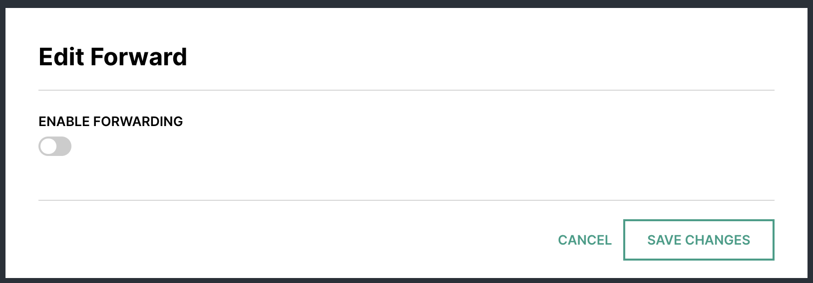
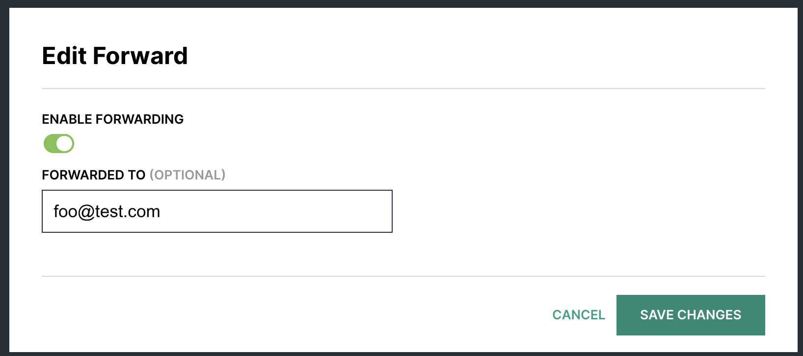
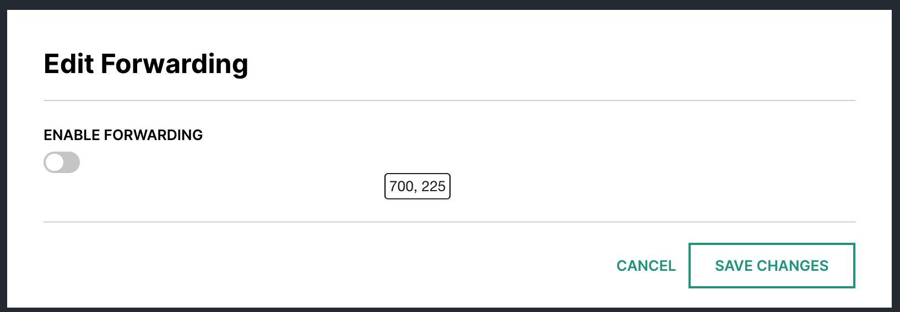
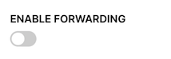
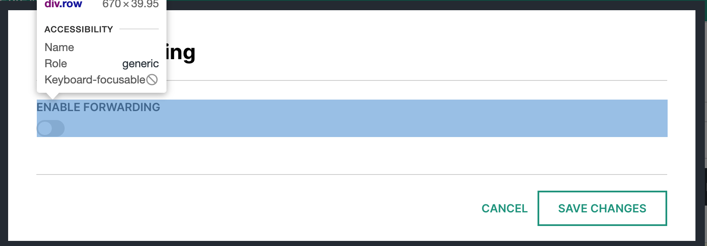
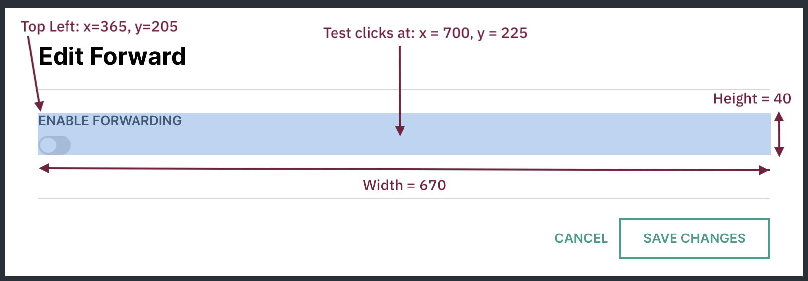
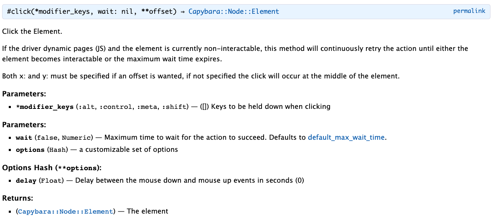
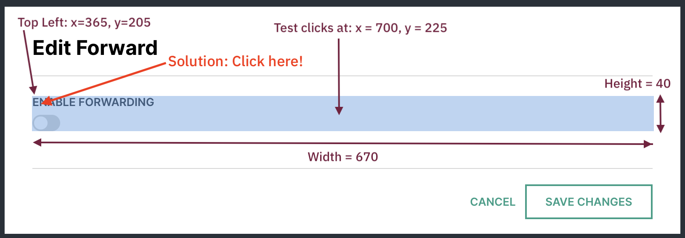
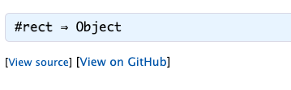
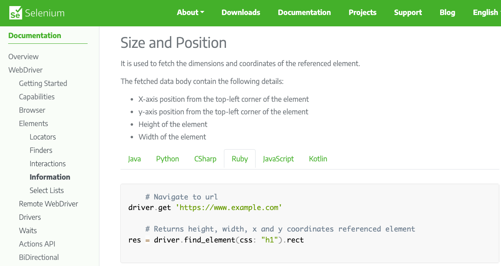

This post will walk you through how to troubleshoot the "Element is not clickable at point... Other element would receive the click" error when running Selenium based tests with Capybara. I encountered this recently when a feature test started breaking when running as part of the Continuous Integration checks on a project I'm working on, which is run with a Github Actions workflow.

## Test Failure

This was the error message:

```
element click intercepted:
Element <label class="forward-toggle">...</label> is not clickable at point (700, 225).
Other element would receive the click: <div class="row">...</div>
(Session info: headless chrome=101.0.4951.54)
(Selenium::WebDriver::Error::ElementClickInterceptedError)
```

The error message was coming from this line in the test:

```ruby
find("label", text: "FORWARDING").click
```

Which means find an html element `<label>...</label>` on the page that contains the text `FORWARDING` and click on it. See the [Capybara Docs](https://rubydoc.info/github/teamcapybara/capybara/master/Capybara/Node/Finders#find-instance_method) for more details about the `find` method.

Here is the UI that is exercised for this test. This app allows users to manage email mailboxes and optionally update forward settings:



After the test clicks the forwarding toggle, the expected result is that the UI updates to allow entering an email address to forward to and saving changes:



It was very strange that this test started failing, as the mailbox management area of the code hadn't changed in years, *and* the test was passing when run locally on my laptop.

## Testing Stack

Before getting further into troubleshooting, a brief description of this projects' testing stack:

This is a Rails project which uses [Capybara](http://teamcapybara.github.io/capybara/) to write the feature tests. Capybara is capable of launching a real browser (either visual or headless), navigating to pages of the application, interacting with elements just like a human user would, and executing assertions to verify that expected elements are on the page.

Capybara requires a [driver](https://github.com/teamcapybara/capybara#drivers) to control the browser. By default, it uses the `:rack_test` driver, which is fast, but only suitable for pure fullstack Rails projects (i.e. no front end JavaScript). Since this project uses React for the front end, the [Selenium](https://www.selenium.dev/projects/) driver is used instead. Specifically, `:selenium_chrome` when running the tests against visual Chrome, and `:selenium_chrome_headless` for running against headless Chrome.

Use of Selenium also requires that the browser-specific drivers are installed on the machine where the tests are running. For example, if running tests against Chrome, then Selenium expects to find [ChromeDriver](https://chromedriver.chromium.org/) installed, whose version must be compatible with the version of the Chrome browser that the tests are running against.

To avoid developers having to manually install and maintain browser driver versions, this project uses the [webdrivers](https://github.com/titusfortner/webdrivers/) gem, which automatically installs and updates the browser drivers.

## What's Changed?

When encountering this type of situation (test fails on CI but passes locally), the first thing to do is determine what's different between CI and laptop setup? My first thought went to browser and driver versions. The code itself hadn't changed, but browser/driver versions are updated constantly so this is a likely culprit.

Looking more closely at the error message, it indicates that Chrome 101 is being used on the Github runner:

```
...
(Session info: headless chrome=101.0.4951.54)
...
```

The next question to ask is: What version is being used locally on my laptop (recall this test was passing locally). The tests are run against a headless Chrome browser which requires a local installation of chromedriver. This project uses the [webdrivers](https://github.com/titusfortner/webdrivers/) gem which automatically downloads the latest version of the driver for the browser being used by the tests. This gem by default downloads drivers to the `~/.webdrivers` diory so you can check what it installed. From my laptop:

```bash
ls ~/.webdrivers
chromedriver chromedriver.version

cat ~/.webdrivers/chromedriver.version
100.0.4896.60
```

Aha! My local had one version (100) older of chromedriver. In order for webdriver to update to the latest, I opened Chrome on my laptop and selected from the menu: Chrome -> About Google Chrome, which triggered an update to the latest 101. Yes Chrome is auto updating, but sometimes it requires a little "kick" to get going to the next version.

I then ran the test locally, and this time the webdrivers gem detected Chrome 101, and installed an updated driver for this version. This caused the test to fail, with the same error message as was displayed on CI. This was progress, at least there was consistent behaviour between my laptop and the CI system.

## Coordinates

Next step was to dig in more into the error, I was curious about the specific point reference:

```
Element <label class="forward-toggle">...</label> is not clickable at point (700, 225).
```

This means the test is trying to click at `x` position `700` and `y` position `225` on the page and not finding anything clickable such as an input or link. None of the tests use co-ordinates to select elements because it would be too brittle. Any design change or layout shift would break a test that expected an element to be in a specific location on the page. So why was the test reporting an error about a specific point reference?

To find where this point was on the page, I installed the [coordinates](https://chrome.google.com/webstore/detail/coordinates/bpflbjmbfccblbhlcmlgkajdpoiepmkd) Chrome extension, navigated to the Email Forwarding area of the app and enabled the extension. Here is where point `(700, 225)` occurs on the page:



Indeed this is a point of "white space" with nothing clickable in that area. The actual toggle that should be clicked occurs way more to the left and slightly above this point. So that explains why the test reports `not clickable at point (700, 225)`. But *why* is the test trying to click at this specific point rather than the toggle that is selected by the test?

## Markup

To investigate further, I needed to take a closer look at the markup for the element the test is trying to click:



This toggle control is not a native element. The implementation to achieve this effect is to use native `<label>...</label>` and `<input type="checkbox">...</input>` elements, hide the input element, and then style the label to appear like a toggle. Here's the markup for this control:

```html
<div class="row">
  <label class="forward-toggle"> <!-- test tries to click this element -->
    <div class="caption">Enable Forwarding</div> <!-- styled as upper case -->
    <div class="onoff_slide">
        <input type="checkbox" id="forward">
        <label for="forward">...</label> <!-- toggle styles applied here -->
    </div>
  </label>
</div>
```

Recall that the test is trying to click on the `<label>` element that contains "FORWARDING" text. Let's see what this element looks like when selected in Chrome Developer Tools:



Well that's a surprise, look how wide it is! But actually, this makes sense given the markup. The label is contained in a div that's styled as a row, so it's taking up the entire width of its parent container.

It was at this point that I started to wonder whether the larger than expected size of the label element might have something to do with Capybara reporting there was nothing clickable here.
## Position and Size

Next I wanted to understand where the coordinates from the error message `is not clickable at point (700, 225)` fit in with respect to the label element selected by the test.

Selenium can provide more details about a selected element using the [rect](https://rubydoc.info/github/teamcapybara/capybara/master/Capybara/Node/Element#rect-instance_method) method. This method returns the `x` and `y` coordinates of the top left corner of the element, along with its width and height. Here's a temporary modification of the test to output the results of the `rect` method:

```ruby
# temporary debug code to learn more about the element
label_elem = find("label", text: "FORWARDING")
pp label_elem.rect

# original test line that causes test to fail
find("label", text: "FORWARDING").click
```

Here's the output in console from running the test:

```
#<struct Selenium::WebDriver::Rectangle
x=365,
y=205.2578125,
width=670,
height=40>
```

The output is showing that the top left position of the label element occurs at `x` position 365 and `y` position 205. Further, the element is 670 wide by 40 tall.

<aside class="markdown-aside">
The Capybara docs link for the <a class="markdown-link" href="https://rubydoc.info/github/teamcapybara/capybara/master/Capybara/Node/Element#rect-instance_method">rect method</a>, doesn't have any details about what this method does. It can be intuitively deduced from running it on an element as I've done above and inspecting the output. However, if you're curious as to what it actually does, see the Appendix at the end of this post.
</aside>

Here's a visual putting this all together, along with the point the text is actually clicking on (x of 700 and y of 225):



It *looks* like the test is clicking in the center of the element, but is it really? Some quick arithmetic shows that it is. Starting at the left, the `x` position of 365, plus half the width (670 / 2 = 335) is 700. And starting at the top, the `y` position of 205, plus half the height (40 / 2 = 20) is 225. Recall the error message:

```
Element <label class="forward-toggle">...</label> is not clickable at point (700, 225).
```

So this explains where the point co-ordinates in the error message come from. The next question is *why* does the test click in the center of the element? Recall the line of the test that performs the click is:

```ruby
find("label", text: "FORWARDING").click
```

The `find` method returns an instance of `Capybara::Node::Element`, and then the test invokes the `click` method on the found element. Let's see what the Capybara API docs say about the [click](https://rubydoc.info/github/teamcapybara/capybara/master/Capybara%2FNode%2FElement:click) method:



Aha! Another mystery solved, the documentation clearly states that the element will be clicked in the middle unless offsets are specified:

> Both x: and y: must be specified if an offset is wanted, if not specified the click will occur at the middle of the element.
## Solution

Now finally we're in a position to solve the problem. If we want the test to click on an element on anywhere other than the center position, the `x` and `y` offsets must be provided to the click method, where `x` is the number of pixels to the right, starting from the left-most edge, and `y` is the number of pixels down from the top of the element.

Since the particular UI this test is driving has the actual toggle input near the top left corner, a small amount of offset can resolve this:

```ruby
find("label", text: "FORWARDING").click(x: 5, y: 5)
```



And indeed, running the test with this updated code, both locally and the continuous integration workflow passed.

## Unexplained


There does remain one unexplained piece of this puzzle.

*Why* was this test passing on all older Chrome versions up to 100, and only started failing on 101? Is it possible that older versions of ChromeDriver were actually clicking at the top left of elements, and that center clicking was only implemented in v101? It's not clear from the [release notes](https://chromedriver.chromium.org/downloads):

```
Supports Chrome version 101

Resolved issue 4046: DCHECK hit when appending empty fenced frame [Pri-]

Resolved issue 4080: Switching to nested frame fails [Pri-]
```

## Conclusion

This post has covered how to debug and solve the "Element is not clickable at point... Other element would receive the click" error when running Selenium based tests with Capybara. The process was to compare dependency versions on CI vs local, setup the conditions to reproduce the issue locally, inspect the co-ordinates reported by the failing test, compare this to the markup and element in developer tools, and some careful review of the Capybara documentation to understand the nuances of the click method.

## Appendix:  Rect Method

WIP...

As part of debugging this issue, the `rect` method was helpful in identifying details of the element selected by the test. However, the Capybara documentation for this [method](https://rubydoc.info/github/teamcapybara/capybara/master/Capybara/Node/Element#rect-instance_method) doesn't contain any explanation as to what it does:



Intuitively it can be understood from calling it that it returns size and positioning details of the element, but my curiosity was piqued as to exactly what it does so I went down a little rabbit hole to trace it through.

Following the [View on Github](https://github.com/teamcapybara/capybara/blob/master/lib/capybara/node/element.rb#L380) link from the Capybara documentation site led to the following code:

```ruby
module Capybara
  module Node
    class Element < Base
      # ...
      def
        synchronize { base.rect }
      end
      # ...
    end
  end
end
```

What is `synchronize` - Monitor mixin: https://docs.ruby-lang.org/en/2.7.0/MonitorMixin.html#method-i-mon_synchronize OR custom definition: https://github.com/teamcapybara/capybara/blob/d08e88dadd44b7572b1ae37f44649d42180e8000/lib/capybara/node/base.rb#L76

Where the implementation of the rect method is defined in [Capybara::Selenium::Node](https://github.com/teamcapybara/capybara/blob/98e367d9f9f4b56652b3e7dd41996c9a1d5ae26a/lib/capybara/selenium/node.rb#L216):

```ruby
class Capybara::Selenium::Node < Capybara::Driver::Node
  # ...
  def rect
    native.rect
  end
  # ...
end
```

According to [this discussion](https://github.com/teamcapybara/capybara/issues/2419#issuecomment-832076535), `native` is an instance of `::Selenium::WebDriver::Element`, so to understand what the `rect` method does requires finding this implementation. However, this class isn't in the Capybara project, rather, it's in a runtime dependency `selenium-webdriver`. This means the `rect` method is actually implemented in selenium-webdriver.

Capybara uses this gem: https://rubygems.org/gems/selenium-webdriver (runtime dependency? https://github.com/teamcapybara/capybara/commit/3f53e82ed9b9717505e998a4127ab3577d87b0a2)

Looking through the Selenium Webdriver documentation for Elements, found the definition: https://www.selenium.dev/documentation/webdriver/elements/information/#size-and-position:



And that ultimately explains what the rect method returns. It matches my intuition about it from seeing the returned result but it was good to confirm this with the official documentation.