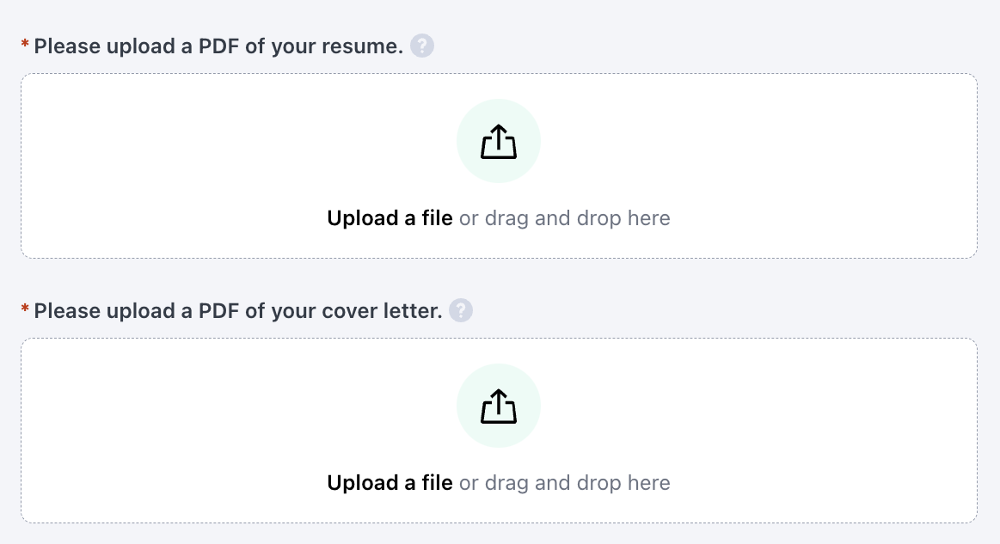
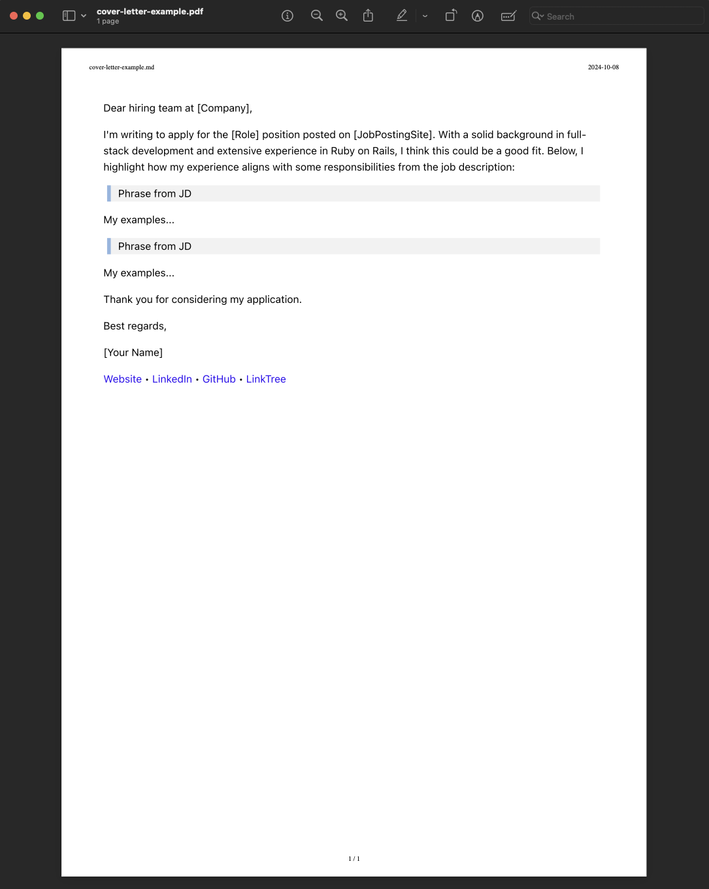

I was inspired to write this after encountering a LinkedIn discussion on the topic of cover letters. The debate centered on whether it still makes sense to submit a cover letter with your application in 2025 and beyond? Many on the thread thought it was no longer necessary, and that your resume and/or LinkedIn profile should be sufficient to show why you're a good fit for the job. While I didn't save the link to that specific discussion, a search for "cover letter waste" on LinkedIn yields many discussions and opinions.

This post will cover why I think cover letters remain valuable and offer a technique to make writing them easier and more effective, especially for techies that use markdown. Writing a custom cover letter can feel daunting, as writing isn’t often a core focus in technical education. However, strong communication is essential in many tech roles, and a well-written cover letter can make a meaningful impact.

<aside class="markdown-aside">
This is of course, anecdotal based on my experience. I don't have any hard data or industry-wide metrics to prove the usefulness of cover letters one way or the other.
</aside>

Before getting into it, let's briefly define what a cover letter is: A document sent with your resume to provide additional information about your skills and experience. It typically highlights specific achievements and experiences that make you a suitable candidate for the job.

Here's an example from an ATS (Applicant Tracking System) asking to upload both a resume and cover letter in pdf format. In this particular case, the cover letter is required, although other systems may mark it as optional:



## Why Cover Letters Are Still Useful

I believe it's definitely still worth spending the time to craft a *custom* cover letter for each role being applied to. In my experience, this has helped my application to get noticed. That word "custom" is key. Sending a formulaic letter such as...

> I am writing to express my interest in the Software Engineer position at [Company Name], as advertised on [Job Board/Company Website]...I have attached my resume for your review and would welcome the opportunity to discuss how my background, skills, and experiences will be beneficial to [Company Name]. Thank you for considering my application.

... will not have much impact. Might as well just send your resume and be done with it.

A well crafted cover letter is an opportunity to personalize and tailor your content to the specific role. Think of it as: How to make life easier for hiring managers or recruiters that may be scanning a large number of applications? I do this by highlighting specific phrases or sentences from the job description (JD), then showing how I've developed or used that skill.

## The Nerd Way

I’ve developed a process using Markdown that makes it a bit more enjoyable and, more importantly, more effective.

### Gather Your Tools

Start by creating a simple Markdown document. I prefer to work in VSCode because it allows me to write my cover letter in Markdown and then easily convert it to a PDF using an extension, [Markdown PDF](https://marketplace.visualstudio.com/items?itemName=yzane.markdown-pdf), which I’ll explain in more detail later.

### Analyze the Job Description

Go through the job description with a fine-tooth comb. Your goal is to find key phrases or requirements that you can address directly. These might be specific technical skills, methodologies, or other skills like communication or teamwork. For each key responsibility or qualification, copy the text into your Markdown file like this:

```markdown
> Design, develop, and ship major features using Ruby on Rails
```

By quoting the job description, you’re explicitly showing the recruiter that you’ve read it thoroughly. This small detail makes it clear that you’re taking the time to craft a personalized response, not just recycling the same generic letter.

### Tailor Your Response

Under each quoted sentence from the job description, write a paragraph explaining how you’ve applied that skill or experience in your career. This could be from work experience, a side project, or even coursework. For example:

```markdown
> Design, develop, and ship major features using Ruby on Rails

In my last role at XYZ Corp, I led the development of several major features using Rails.
One of the highlights was integrating third-party APIs to enhance the platform’s
capabilities, resulting in a 20% increase in user engagement.
Additionally, I’ve written several blog posts sharing tips and tricks
for Rails development, including [this post on caching strategies](https://example.com).
```

Notice how the response is specific to the requirement. It also provides concrete examples, which are far more compelling than general statements like, "I’m a strong developer." Whenever possible, link to relevant blog posts, side projects, or public code repositories that showcase your work.

### Use Side Projects, Courses, or Volunteer Work

If you don’t have work experience that matches a requirement, don’t worry. Side projects, open-source contributions, volunteer work, or even personal study is also valuable. For example:

```markdown
> Familiarity with Hotwire and Turbo

While I haven’t used Hotwire in a professional setting yet,
I’ve been working on a side project that integrates Turbo with Rails
to create a real-time chat application.
You can check it out on GitHub [here](https://github.com/username/chat-app).
```

You could also reference coursework or certifications. Mentioning a public-facing project, even a small one, shows initiative and your ability to learn new technologies. For example, if the job description mentions that Tailwind is a requirement or a nice to have:

```markdown
> Experience with TailwindCSS

I recently completed a Pluralsight course on TailwindCSS that covered
utility-first principles and responsive design.
As part of the course, I built a personal portfolio site using Tailwind,
which you can view here: [My Tailwind Portfolio](https://example.com).
I also wrote detailed course notes, documenting my learning process and
challenges faced while implementing Tailwind in real-world scenarios:
[TailwindCSS Course Notes](https://example.com/course-notes).
```

This example shows how you can emphasize not only your experience but also your willingness to share your learning journey, which can make a strong impression on recruiters or hiring managers.

### Keep It Focused and Specific

It's not necessary to address every single point in the job description. Focus on 3 - 4 key responsibilities or qualifications that you can speak to the most. This ensures that your cover letter is concise and easy to read, making it more likely to get noticed.

### Wrap it Up

Finish up the cover letter by adding a brief introduction and end with your profile links. The text below is just an example, customize it to suit your communication style and the company/role:

```markdown
Dear hiring team at [Company],

I'm writing to apply for the [Role] position posted on [JobPostingSite].
With a solid background in full-stack development and extensive experience
in Ruby on Rails, I think this could be a good fit.
Below, I highlight how my experience aligns with
some responsibilities from the job description:

> Phrase from JD

My examples...

> Phrase from JD

My examples...

...

Thank you for considering my application.

Best regards,

[Your Name]
[Website](https://your.website/) •
[LinkedIn](https://www.linkedin.com/in/user/) •
[GitHub](https://github.com/user) •
[LinkTree](https://linktr.ee/user)
```

### Export to PDF

Once you’ve written your cover letter in Markdown, it’s time to export it to PDF. This is where the [Markdown PDF](https://marketplace.visualstudio.com/items?itemName=yzane.markdown-pdf) extension comes in handy. To use it in VSCode, follow these steps:

1. Install the Markdown PDF extension.
2. Configure the extension settings to define the export format and output directory (see below for an example configuration).
3. Start a new markdown document in any directory (eg: `jsmith-cover-letter-acme-corp.md`) and fill in the content as described earlier.
4. With your Markdown cover letter open, hit <kbd class="markdown-kbd">Cmd</kbd> + <kbd class="markdown-kbd">Shift</kbd> + <kbd class="markdown-kbd">P</kbd> (on Mac) or <kbd class="markdown-kbd">Ctrl</kbd> + <kbd class="markdown-kbd">Shift</kbd> + <kbd class="markdown-kbd">P</kbd> (on Windows) to open the command palette.
5. Select `Markdown PDF: Export (pdf)`.
6. Wait a few seconds, and your PDF will be generated in your configured output directory.

Here’s an example of my settings in `~/Library/Application Support/Code/User/settings.json`. The extension is supposed to download Chromium if an `executablePath` isn't provided but that didn't work for me so I had to specify the path to Chrome:

```json
{
  "markdown-pdf.executablePath": "/Applications/Google Chrome.app/Contents/MacOS/Google Chrome",
  "markdown-pdf.outputDirectory": "~/tmp",
  "markdown-pdf.type": [
    "pdf",
    "html",
    "png",
    "jpeg"
  ]
}
```

This means if you're working on a document named `jsmith-cover-letter-acme-corp.md`, the pdf will be generated in `~/tmp/jsmith-cover-letter-acme-corp.pdf`. Then it's ready for upload to your job application portal.

Here's an example of what the pdf will look like - any links in the content will be clickable.



By default, the Markdown PDF extension generates a header with the file name and date in ISO format, and a footer with the page number. You can disable header or footer generation by adding this to your VSCode `settings.json`:

```json
{
  // turn off header
  "markdown-pdf.headerTemplate": "",

  // turn off footer
  "markdown-pdf.footerTemplate": "",
}
```

You can also customize the contents of the header and footer using `markdown-pdf.headerTemplate` and `markdown-pdf.footerTemplate`. Read the [extension documentation](https://marketplace.visualstudio.com/items?itemName=yzane.markdown-pdf#pdf-options) for further details.

## Conclusion

Writing a custom cover letter doesn’t have to be overwhelming. By using Markdown and focusing on specific examples from your experience, you can craft a letter that helps your application stand out. While it takes a bit more effort than sending a generic one, it’s often the extra touch needed to get noticed in a competitive job market.

Even if your cover letter ends up being ignored by a recruiter or filtered out by an ATS, this exercise is still worth doing. Writing the letter forces helps to clarify in your own mind why you're a great fit for the role. And if you do land that initial call, you'll be better prepared to answer the inevitable "Why are you a good fit for this role?" or "Can you describe a situation where..." type questions, with specific examples ready to go.

Keep in mind that the goal of a cover letter is simply to increase your chances of getting that first call. It won’t get you the job on its own, but it can be a powerful tool. And for techies, using markdown can make the process just a little bit more enjoyable.
