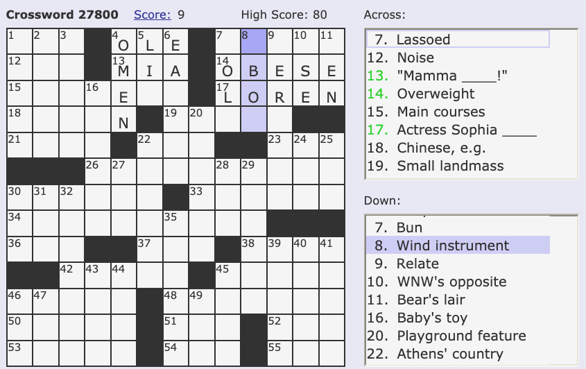
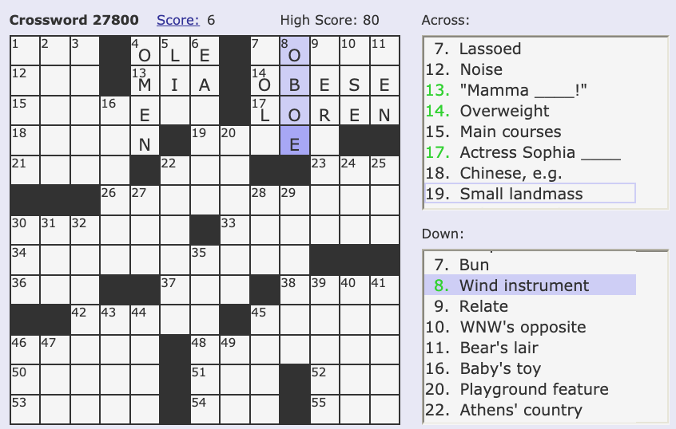

If you enjoy crossword puzzles but sometimes get stuck on a devious one, here's a fun use of the CentOS [words](https://centos.pkgs.org/7/centos-x86_64/words-3.0-22.el7.noarch.rpm.html) package.

If you don't already have a CentOS image running, the following will get you and running quickly. Make sure [Docker](https://www.docker.com/) is installed, then run the following commands in a terminal:

```bash
docker pull centos:7
docker run --name mycentos -d centos:7 tail -f /dev/null
docker exec -it mycentos bash
```

If you exit out of the container and want to come back, run the following to restart it and get back in:

```bash
docker start mycentos
docker exec -it mycentos bash
```

Now, in a bash shell in the container, install the package:

```bash
yum install words
# dictionary file is now in /usr/share/dict/words
```

You can use the grep command with regex to search the dictionary files, for example, to find all words ending in "ion":

```bash
grep -E 'ion$' /usr/share/dict/words
# abacination
# abaction
# abalation
# ...
```

Now here's how it can be used to help with crossword puzzles, suppose you've gotten this far, and stuck on number 8 down "Wind instrument":



Few hints we have is that it's a four letter word, starting with an unknown character, followed by "BO", followed by one more unknown character. All that's needed is to construct a regex to express this, then search the words dictionary:

```bash
grep -iE '^.BO.$' /usr/share/dict/words
# abos
# abow
# abox
# Eboe
# eboe
# Eboh
# ebon
# Ibos
# Oboe
# oboe
# obol
# RBOC
# RBOR
```

Aha, "oboe" is the answer!



To test this out, try free online crossword puzzles at [https://www.boatloadpuzzles.com/playcrossword](https://www.boatloadpuzzles.com/playcrossword).

Of course, try to solve as much of the puzzle without help but when you get stuck, the words package can come to the rescue. Enjoy!
