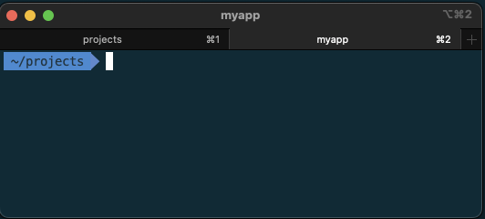
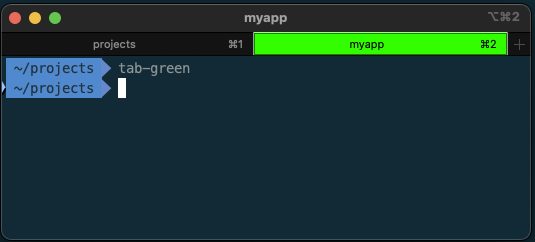
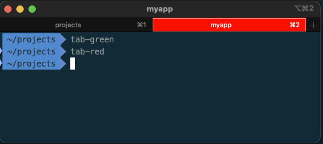
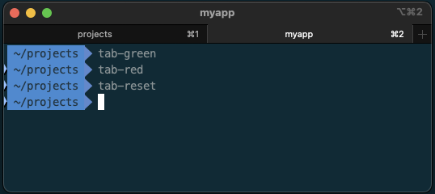

Application performance monitoring (APM) is essential for understanding how a web application behaves in production. While Heroku provides basic metrics such as memory usage and CPU load, this is not enough for in-depth analysis of what's happening inside a Rails controller or background job. Such as what database queries are running, Redis access, how much time is spent waiting for external services, etc. That's where Datadog APM steps in, offering detailed insights and monitoring capabilities.

Heroku makes it easy to add some APMs such as NewRelic or Scout APM with a one-click add-on, but sometimes, your company may already be using Datadog across different projects. Integrating everything into the same observability tool keeps things consistent, simplifies cross-project monitoring, and leverages existing Datadog dashboards.

This post will walk through setting up Datadog APM on a Heroku-hosted Rails application.

**Assumptions:** This guide assumes familiarity with deploying and managing a Rails app on Heroku, along with Heroku CLI installed and authenticated.

## Install Buildpack

Since Heroku doesn't offer a one-click Datadog integration, we need to use the [Datadog Heroku Buildpack](https://docs.datadoghq.com/agent/basic_agent_usage/heroku/). To install it, run the following:

```bash
heroku buildpacks:add \
  --index 1 https://github.com/DataDog/heroku-buildpack-datadog.git \
  -a your-app-name
```

**Buildpack order matters:** If you're running a Rails application, you likely already have the `heroku/ruby` buildpack. The Datadog buildpack needs to be listed *before* the Ruby buildpack. Setting `--index 1` will make it first in the list. The `--index` flag is 1-based, not 0-based.

You can confirm the buildpack is installed by running the following, your output may look a little different depending on what other buildpacks are already installed:

```bash
heroku buildpacks -a my-app

# === my-app Buildpack URLs
# 1. https://github.com/DataDog/heroku-buildpack-datadog.git
# 2. heroku/ruby
```

<aside class="markdown-aside">
Even if you've never explicitly added a buildpack to your Heroku app, you'll still have at least one. This is because when you push code to Heroku and it starts building, it will automatically look for an appropriate buildpack for the project's language (Ruby, Python, PHP, etc.) and add it. Read more about working with Heroku buildpacks <a class="markdown-link" href="https://devcenter.heroku.com/articles/buildpacks">here</a>.
</aside>

## Enable Dyno Metadata

Heroku dyno names are ephemeral, meaning their identifiers can change frequently. To maintain continuity of metrics, we need to enable [Heroku Dyno Metadata](https://devcenter.heroku.com/articles/dyno-metadata):

```bash
heroku labs:enable runtime-dyno-metadata -a your-app-name
```

This allows the Heroku app name, dyno type, and dyno number to be used in Datadog for better tracking of performance metrics.

<aside class="markdown-aside">
The Heroku docs for dyno metadata have a warning: "Features added through Heroku Labs are experimental and subject to change.". It's concerning that something so critical as APM is depending on an experimental feature. However, when I reached out to Heroku support for help with setting up Datadog, their reply was "Just use NewRelic" ¯\_(ツ)_/¯
</aside>

## Configure Agent

The next step is to configure the Datadog agent. This requires setting several environment variables, as explained below:

```bash
# Set this if your app uses a Heroku Redis add-on
# Assumes `REDIS_URL` env var is set
heroku config:set DD_ENABLE_HEROKU_REDIS=true -a your-app-name

# Set the Datadog hostname to include app name, dyno type, and dyno number.
# Improves metrics continuity by providing detailed info about dynos.
# This is why we enabled dyno metadata in the previous step!
heroku config:set DD_DYNO_HOST=true -a your-app-name

# Ensures metrics are sent to the correct Datadog site.
heroku config:set DD_SITE="datadoghq.com" -a your-app-name

# Set Datadog agent log level to error to avoid littering Heroku CLI
# and Rails server output with Datadog trace messages.
heroku config:set DD_LOG_LEVEL="error" -a your-app-name

# Add your Datadog API key to Heroku's config.
# Keys are at: https://app.datadoghq.com/organization-settings/api-keys
heroku config:set DD_API_KEY="REDACTED" -a your-app-name

# === THIS WILL BE EXPLAINED FURTHER IN THIS POST ===
# Set the location for the Heroku configuration folder for Datadog.
# This is required to execute the prerun.sh script for unified service tagging
heroku config:set DD_HEROKU_CONF_FOLDER="/app/.datadog" -a your-app-name
```

Heroku restarts the application every time an environment variable is set. To avoid numerous restarts, you can set multiple environment variables in a single command as shown below:

```bash
heroku config:set \
  DD_ENABLE_HEROKU_REDIS=true \
  DD_DYNO_HOST=true \
  DD_SITE="datadoghq.com" \
  DD_LOG_LEVEL="error" \
  DD_API_KEY="your_api_key" \
  DD_HEROKU_CONF_FOLDER="/app/.datadog" \
  -a your-app-name
```

This way the app will only be restarted once.

<aside class="markdown-aside">
The above mentioned environment variables are a minimum to get started. Datadog provides many more <a class="markdown-link" href="https://docs.datadoghq.com/agent/basic_agent_usage/heroku/#configuration">configuration</a> options.
</aside>


## Apply Buildpack

At this point, the agent isn't running yet. This is because it requires the Heroku slug to be re-built. To do this, add an empty commit and push to your `heroku` remote:

```bash
git commit --allow-empty -m "Rebuild slug to apply Datadog setup"
git push heroku main
```

From this point onwards, the Datadog Agent will be started automatically when each dyno starts.

You can verify the agent was started successfully by shelling into a Heroku web or worker dyno, and using the `agent-wrapper` command provided by the Datadog buildpack:

```bash
heroku ps:exec --dyno=web.1 -a your-app-name
agent-wrapper status
```

Ignore the warnings about `DD_API_KEY` not being set. Heroku doesn't set configuration variables for the SSH session, but the Datadog Agent process is able to access them.

Check the output of the status command to verify the API key you configured earlier is valid, and that the APM agent is running:

```
API key ending with xxxxx: API Key valid
[...]

=========
APM Agent
=========
  Status: Running
[...]
```

## Enable Application Tracing

The next step is to install and configure the [datadog](https://github.com/DataDog/dd-trace-rb) gem for the Rails project. Add it to your Gemfile's `production` group, and optionally `staging` if you have another environment setup, as shown below:

```ruby
group :staging, :production do
  gem "datadog", require: "datadog/auto_instrument"
end
```
I intentionally do not install it in `development` and `test` groups because the agent isn't running in those environments, which would result in seeing connection errors every time you run a local Rails server or console. This is because the  code in the datadog gem attempts to connect to the agent running on port 8126 to send traces.

Run `bundle install` to apply the changes.

<aside class="markdown-aside">
Even though the gem repository on GitHub is named `dd-trace-rb`, the name of the gem is `datadog` and that's what goes in the `Gemfile`. If you were expecting it to be `ddtrace`, that's from the old 1.x version of the gem and has since been renamed as of 2.x, which is what's being used here. See the <a class="markdown-link" href="https://github.com/DataDog/dd-trace-rb/blob/release/docs/UpgradeGuide2.md#rename-to-datadog-gem">Upgrade Guide</a> for more details.
</aside>

**Auto Instrumentation**

The `require: "datadog/auto_instrument"` in the Gemfile works for supported Ruby [frameworks and libraries](https://docs.datadoghq.com/tracing/trace_collection/automatic_instrumentation/dd_libraries/ruby/#integration-instrumentation). This means that the gem will automatically detect calls to controllers, background jobs, ActiveRecord queries, Action Mailer, etc. and send the traces to Datadog. Without `auto_instrument`, you would have to manually instrument your code, which means wrapping every section of code you wanted sent to datadog in trace blocks like this:

```ruby
Datadog::Tracing.trace(name, **options) do |span, trace|
  # Wrap this block around the code you want to instrument
  # Additionally, you can modify the span here.
  # e.g. Change the resource name, set tags, etc...
end
```

You can also combine auto and manual instrumentation. For example, if there's a particular section of code that you want further details sent to Datadog that the auto instrumentation isn't capturing, you can still wrap your code as shown above. See [Manual Instrumentation](https://docs.datadoghq.com/tracing/trace_collection/automatic_instrumentation/dd_libraries/ruby/#manual-instrumentation) for further details.

Once the `datadog` gem is installed, add a config initializer for further customization. For example:

```ruby
# config/initializers/datadog.rb
if Rails.env.staging? || Rails.env.production?
  Datadog.configure do |c|
    # set DD logger level to ERROR to reduce log noise.
    c.logger.level = Logger::ERROR

    # set environment tag based on the Rails environment
    c.env = Rails.env.production? ? "prod-my-app-name" : "staging-my-app-name"

    # set version tag, eg: `version:v123`
    c.version = ENV["HEROKU_RELEASE_VERSION"] if ENV["HEROKU_RELEASE_VERSION"].present?
  end
end
```

**Explanation:**

* **Rails Environment Check:** By wrapping the initializer in a `Rails.env.staging? || Rails.env.production?` check, we ensure Datadog configuration only runs in environments where the Datadog agent is running.
* **Log Level:** Even though earlier we ran `heroku config:set DD_LOG_LEVEL="error"`, I found it necessary to also set the log level in the initializer to fully quiet all the Datadog logs noise.
* **Environment Tagging:** Datadog uses the `env` tag to segment and filter application data by environment, like "staging" or "production". Setting `c.env` to `prod-my-app-name` or `staging-my-app-name` ensures that traces, are grouped by environment.
* **Version Tagging:** The `version` tag tracks specific app versions, which is handy for tracing changes over deployments. Here, we pull `HEROKU_RELEASE_VERSION` directly from the environment, so each deployment’s metrics reflect its specific version tag, such as `v123`. This allows us to see how a particular deployment performs, compare releases, and track down any regressions or improvements made in recent updates.

<aside class="markdown-aside">
You could simply populate the `env` tag with the value of `Rails.env` if your project is the only one using Datadog at your company. In my case, there were several different teams/projects sharing the same Datadog instance, and we wanted to keep the env tags distinct across project teams.
</aside>

There's a lot more that can be done in the config block, including optionally disabling/enabling integrations. See the [Datadog Ruby](https://docs.datadoghq.com/tracing/trace_collection/automatic_instrumentation/dd_libraries/ruby/#integration-instrumentation) docs for further details.

At this point, we're nearly done with the APM setup. There's just one last step required to tie everything together.

## Unified Service Tagging

When the Datadog agent runs on the web and worker dyno's, in addition to sending instrumentation data from the Rails application and background jobs to Datadog, it also sends metrics about the web and worker dynos such as memory and CPU utilization. We need to ensure this information is correctly tagged with the service, environment, and release versions so that the host metrics can be filtered on, and correlated to the APM data. For example, when investigating a particular Rails controller action, it would be interesting to see if there's a memory spike every time it runs.

Datadog can display this information all in a single view, but it requires setting up [Unified Service Tagging](https://docs.datadoghq.com/getting_started/tagging/unified_service_tagging/). The documentation mentions several different ways to set this up, but on Heroku, our team found this easiest to accomplish with a [Prerun script](https://docs.datadoghq.com/agent/basic_agent_usage/heroku/#prerun-script).

A Prerun script runs after all of the standard configuration, but immediately before starting the Datadog Agent. Recall earlier we set the following environment variable for Heroku:

```bash
heroku config:set DD_HEROKU_CONF_FOLDER="/app/.datadog" -a your-app-name
```

In this case, Datadog will expect to find a folder named `.datadog` in your project root (not in the Rails `app` dir, this will be explained shortly), with an executable file named `prerun.sh`. In this script, the `env`, `service`, and `version` tags are populated. For example:

```bash
# .datadog/prerun.sh

#!/bin/bash

if [ "$RAILS_ENV" == "production" ]; then
  export DD_ENV="prod-my-app-name"
elif [ "$RAILS_ENV" == "staging" ]; then
  export DD_ENV="staging-my-app-name"
fi

export DD_SERVICE="my-app-name"

if [ -n "$HEROKU_RELEASE_VERSION" ]; then
  export DD_VERSION="${HEROKU_RELEASE_VERSION}"
fi

if [ -n "$DD_ENV" ] && [ -n "$DD_VERSION" ] && [ -n "$DD_SERVICE" ]; then
  export DD_TAGS="env:${DD_ENV},version:${DD_VERSION},service:${DD_SERVICE}"
fi
```

**Why We Place the `.datadog` Directory in the Project Root**

On Heroku, your app is deployed within a top-level `/app` directory, so your project's root directory in the Heroku environment is actually `/app`. This means that when we specify `DD_HEROKU_CONF_FOLDER="/app/.datadog"`, the `.datadog` directory should be created in the root of your project repository, not inside the `app` directory where Rails controllers, models, and views are located.

In other words, your project structure on your laptop will look like this:

```
.
├── .datadog
│   └── prerun.sh
├── Gemfile
├── Gemfile.lock
├── Procfile
├── ...
└── app
    ├── controllers
    ├── models
    ├── views
    └── ...
```

But when it runs on Heroku, it looks like this:

```
.
└── app                   === HEROKU LEVEL APP DIR ===
    ├── .datadog
    │   └── prerun.sh
    ├── Gemfile
    ├── Gemfile.lock
    ├── Procfile
    ├── ...
    └── app               === YOUR RAILS APP DIR ===
        ├── controllers
        ├── models
        ├── views
        └── ...
```

## Deploy

Once you've merged all the changes to the main branch, you can deploy with `git push heroku main`. Here’s a quick recap of the changes:

* Updated `Gemfile` and `Gemfile.lock` to include the `datadog` gem.
* Created `config/initializers/datadog.rb` for Datadog configuration within Rails.
* Added `.datadog/prerun.sh` to consistently tag host metrics with the app's environment, service, and version information.

After deployment, give it a few minutes, then open Datadog’s Infrastructure section in the web UI. Use filters like `env:...`, `service:...`, or `version:...` (as configured in `prerun.sh`) to verify your host metrics and confirm they are tagged correctly.

Next, go to APM -> Service Catalog -> Select your service, then from the list of resources, select any Resource Page. This should also display the host metrics, now correlated with specific resource executions. This setup ensures you can track performance and resource usage comprehensively across both Infrastructure and APM sections. You should also see telemetry data for the Rails app, with each `Controller#action` instrumented by Datadog appearing as a Resource.

## Memory Usage

Since the Datadog agent is another process that will always be running on your dyno's, be aware that it does consume additional memory. Our staging environment was using the Basic dyno type, which only has 512MB of memory, and it started crashing frequently after adding the Datadog agent. To resolve this we had to upgrade to the Standard dyno type. To be fair, it was the Rails app was consuming most of this memory, and adding the Datadog agent just pushed it over the edge.

Although the Heroku web dashboard shows memory consumption, it doesn't break this down by process. To view memory consumption for both the Datadog agent, and the Rails app on either the web or worker dyno's, you can shell in as we did before to check the agent status, then run the `ps` command, which displays information about active processes:

```bash
heroku ps:exec --dyno=web.1 -a your-app-name
ps auxww --sort=-%mem
```

- `a`: Show processes for all users, not just the current user.
- `u`: Display the output in a user-oriented format, showing user-related columns like `USER`, `%CPU`, and `%MEM`.
- `x`: Show processes not attached to a terminal.
- `ww`: Provides unlimited width for the command output, ensuring the full command line (`COMMAND`) for each process is shown without truncation.
- `--sort=-%mem`: Sorts the processes by memory usage (`%MEM`) in descending order. The `-` sign indicates descending order, so processes using the most memory appear at the top.

<aside class="markdown-aside">
The Heroku docs have the complete list of <a class="markdown-link" href="https://www.heroku.com/dynos">Dyno Types</a>. Notice the steep price increase from Basic to Standard. This is the cost of the convenience of a PaaS. Although with consistent improvements in deployment tooling such as <a class="markdown-link" href="https://kamal-deploy.org/">Kamal</a>, it may be possible to get this convenience at a lower price. Perhaps a blog post for another day.
</aside>

## Summary References

In this guide, we walked through integrating Datadog APM with a Rails app deployed on Heroku. Key steps included adding the Datadog buildpack, enabling Heroku dyno metadata, configuring environment variables for the Datadog agent, and setting up unified service tagging for consistent metrics and traces. We also installed and configured the `datadog` gem in the Rails application.

**References:**

- [Datadog Heroku Buildpack](https://docs.datadoghq.com/agent/basic_agent_usage/heroku/)
- [Heroku Dyno Metadata](https://devcenter.heroku.com/articles/dyno-metadata)
- [Datadog Tracing Ruby Applications](https://docs.datadoghq.com/tracing/trace_collection/automatic_instrumentation/dd_libraries/ruby/)

## Bonus: Terminal Tab Visual Cues

A few times during this post, we had to shell into Heroku to check on things. To [avoid disasters](https://np.reddit.com/r/cscareerquestions/comments/6ez8ag/accidentally_destroyed_production_database_on/), I like to colorize my terminal tabs differently to make it obvious that I'm no longer in my own laptop's shell. You can change the terminal tab colors by adding a function to your shell profile (`~/.bash_profile` or `~/.zshrc`), which will adjust the red, green, and blue values of the tab background.

Add the following to your profile:

```bash
# Define a function to set the tab color in your terminal
tab-color() {
  echo -ne "\033]6;1;bg;red;brightness;$1\a"
  echo -ne "\033]6;1;bg;green;brightness;$2\a"
  echo -ne "\033]6;1;bg;blue;brightness;$3\a"
}

# Functions to quickly set a specific color.
# Adjust as per your preference.
tab-green() { tab-color 0 255 0; }   # For staging
tab-red() { tab-color 255 0 0; }     # For production

# Function to reset the color back to the default
tab-reset() { echo -ne "\033]6;1;bg;*;default\a"; }
```

To demonstrate, here is what my regular terminal tabs look like:



After running the `tab-green` function:



After running `tab-red`:



And resetting:



Next, define aliases for shelling into your Heroku environments (for example: staging and production) that will use the tab color functions. My aliases are as follows:

```bash
# SSH into Heroku staging dyno and turn tab green
alias hss='tab-green && heroku ps:exec --dyno=web.1 -a your-staging-app'

# SSH into Heroku production dyno and turn tab red
alias hsp='tab-red && heroku ps:exec --dyno=web.1 -a your-production-app'
```

Customize the aliases for whatever you'll remember. For me I think of "Heroku Shell Staging" or "Heroku Shell Production" and take the first characters of each. Now whenever you shell into either staging or production, you'll have a strong visual cue that you're in a deployed environment.

Note that I use [iTerm with zsh and oh-my-zsh](../how-i-setup-my-terminal) and the above technique has only been tested on this particular setup.

## TODO
* Nice to have: a visual showing how the components fit together: Heroku dynos, DD agent installed on dyno and sending host metrics, datadog gem installed as part of Rails app and sending instrumentation data to DD agent, DD site receiving metrics from DD agent.
  * See WIP `tech/blog-research/rails-heroku-datadog/mermaid4.html`
* After dyno metadata enabled, maybe show expectation that now a bunch of `HEROKU_...` env vars should be populated? (get example from work laptop, make generic if necessary)
* Aside: telemetry data will show the database queries executed by the Rails app, but PostgreSQL monitoring is an additional service that has to be paid for if you want it, and involves another whole set of steps to setup. And some challenges given that the PG add-on for Heroku is a managed service, i.e. you can't just ssh in there and modify the conf file. My team isn't using this at the moment, so perhaps a topic for a future blog post.
* Explain a little more about what auto instrument does, try to find it in the dd-trace-rb repo on GitHub: https://github.com/search?q=repo%3ADataDog%2Fdd-trace-rb%20auto_instrument&type=code and https://github.com/DataDog/dd-trace-rb/issues/2343#issuecomment-1299009009
* Add references (get more links from work laptop?) such as
  * https://docs.datadoghq.com/agent/basic_agent_usage/heroku/
  * terminology: https://docs.datadoghq.com/tracing/glossary/
  * tracing ruby apps: https://docs.datadoghq.com/tracing/trace_collection/automatic_instrumentation/dd_libraries/ruby/
  * troubleshooting: https://docs.datadoghq.com/agent/basic_agent_usage/heroku/#troubleshooting
* potentially different feature image -> dogs!
* edit

### Somewhere explain the visual + diagram

When you’re using the `datadog` gem in a Rails app on Heroku, the trace data flow typically follows this path:

1. **Your Rails app**, instrumented by the `datadog` gem, generates trace data as it processes requests.
2. The `datadog` gem sends this trace data **to the Datadog Agent** running on your Heroku dynos (usually listening on port `8126`).
3. **The Datadog Agent** then aggregates and forwards the traces it receives from the gem **to Datadog’s backend**, specifically to `DD_SITE="datadoghq.com"`.

```htm
<!-- https://mermaid.js.org/config/usage.html#cdn -->
<!doctype html>
<html lang="en">

<head>
  <script src="https://cdnjs.cloudflare.com/ajax/libs/html2canvas/1.4.1/html2canvas.min.js"></script>
</head>

<body>
  <pre class="mermaid">
  architecture-beta
    group heroku(cloud)[Heroku Server]

    group web_dyno(server)[Web Dyno] in heroku
    group rails_app(skill-icons:rails)[Rails App] in web_dyno

    group dd_cloud(internet)[Datadog Backend]
    service dd_backend(vscode-icons:folder-type-datadog-opened) in dd_cloud

    group worker_dyno(server)[Worker Dyno] in heroku
    group rails_app_j(skill-icons:rails)[Rails App] in worker_dyno
    service datadog_gem_j(logos:rubygems)[Datadog Gem] in rails_app_j
    service datadog_agent_j(vscode-icons:file-type-datadog)[Datadog Agent] in worker_dyno

    service datadog_gem(logos:rubygems)[Datadog Gem] in rails_app
    service datadog_agent(vscode-icons:file-type-datadog)[Datadog Agent] in web_dyno

    datadog_gem:R --> L:datadog_agent
    datadog_gem_j:R --> L:datadog_agent_j
    datadog_agent:R --> L:dd_backend
    datadog_agent_j:R --> B:dd_backend
  </pre>

  <button id="downloadBtn">Download Diagram as PNG</button>

  <script type="module">
    import mermaid from 'https://cdn.jsdelivr.net/npm/mermaid@11/dist/mermaid.esm.min.mjs';
    // import html2canvas from 'https://cdnjs.cloudflare.com/ajax/libs/html2canvas/1.4.1/html2canvas.min.js';

    // Register the icon pack for Iconify
    mermaid.registerIconPacks([
      {
        name: 'skill-icons', // Specify the name used in Mermaid syntax (e.g., skill-icons:rails)
        loader: () =>
          fetch('https://unpkg.com/@iconify-json/skill-icons@1/icons.json').then(res => res.json())
      },
      {
        name: 'vscode-icons', // For using icons like vscode-icons:file-type-datadog
        loader: () =>
          fetch('https://unpkg.com/@iconify-json/vscode-icons@1/icons.json').then(res => res.json())
      },
      {
        name: 'logos', // For logos like 'logos:rubygems'
        loader: () =>
          fetch('https://unpkg.com/@iconify-json/logos@1/icons.json').then(res => res.json())
      },
    ]);

    // Initialize Mermaid with the configuration
    // mermaid.initialize({ startOnLoad: true });

    // Download button functionality
    document.getElementById('downloadBtn').addEventListener('click', () => {
      const svgElement = document.querySelector('.mermaid svg');

      if (svgElement) {
        // Convert SVG to PNG using html2canvas
        html2canvas(svgElement).then(canvas => {
          // Create a link to download the image
          const link = document.createElement('a');
          link.download = 'mermaid_diagram.png';
          link.href = canvas.toDataURL('image/png');
          link.click();
        });
      } else {
        alert('Diagram not rendered yet!');
      }
    });
  </script>
</body>

</html>
```
