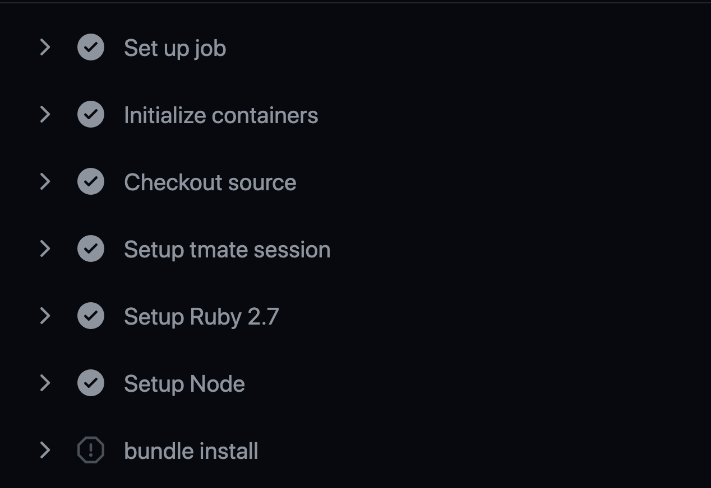

A few weeks ago I was setting up CI (continuous integration) for a Rails project that uses Sidekiq, Redis, and Postgres. Pretty straightforward, just needed to run a build, install and configure the services (Postgres and Redis), initialize the database, then run linting and tests.

Prior to the general release of Github Actions, I would have reached for Travis CI or Circle CI to set this up, which involves giving a 3rd party service access to your Github repo. But ever since [Github Actions](https://github.com/features/actions) has been available, its no longer necessary to integrate a 3rd party solution. Github Actions support running any workflow on any event such as push to a branch, merge a PR etc. The configuration is done via a yaml file in the `.github/workflows` directory in your project. No need to install anything, as soon as you push a branch with a workflow yaml in the directory Github looks for, it will start running the jobs and steps specified in the file. By default, the action will run on Github hosted machines but it's also possible to configure a self-hosted runner. For this post, we will be using the Github action runner.

As great as Github Actions are, sometimes something will go wrong with the workflow, and the console output from the runner will not be sufficient to figure out what the issue is. This post will walk you through a debugging technique you can use to troubleshoot your workflow.

## First Attempt

The `ci.yml` file shown below was my first attempt at getting a build going for my Rails project. This file specifies the services that are needed (Postgres and Redis) which are defined in the same syntax as a docker-compose file. The next section specifies all the steps that should be run in sequence. These include checking out the project, setting up the necessary Ruby and Node versions, installing the project dependencies with `bundle install` and `yarn install`, then initializing the database with `rake db:reset`, and finally running the linter (rubocop) and RSpec tests.

```yml
# .github/workflows/ci.yml
name: CI

on: push

env:
  RAILS_ENV: test
  RACK_ENV: test
  DATABASE_HOST: "127.0.0.1"
  REDIS_URL: "redis://127.0.0.1"

jobs:
  ci:
    runs-on: ubuntu-latest

    services:
      db:
        image: postgres:13
        env:
          POSTGRES_PASSWORD: its_a_secret
          POSTGRES_USER: postgres
        ports:
          - 5432:5432
        volumes:
          - /home/runner/work/myapp/myapp/init.sql:/docker-entrypoint-initdb.d/init.sql

      redis:
        image: redis:6
        ports:
          - 6379:6379

    steps:
      - name: Checkout source
        uses: actions/checkout@v1

      - name: Setup Ruby 2.7
        uses: actions/setup-ruby@v1
        with:
          ruby-version: '2.7'

      - name: Setup Node
        uses: actions/setup-node@v2-beta
        with:
          node-version: '12'

      - name: bundle install
        run: bundle install

      - name: yarn install
        run: yarn

      - name: Initialize database
        run: bundle exec rake db:reset

      - name: Run linter
        run: rubocop

      - name: Run tests
        run: bundle exec rspec
```

But after pushing this file and monitoring the Actions output (as soon as you push a valid workflow file, Github will run in and display the results in a new `Actions` tab displayed on your project page on github.com), the workflow failed with the following error displayed under the `Initialize database` step:

```
PG::ConnectionBad: could not connect to server: Connection refused
Is the server running on host "127.0.0.1" and accepting
TCP/IP connections on port 5432?
/opt/hostedtoolcache/Ruby/2.7.2/x64/bin/bundle:23:in `load'
/opt/hostedtoolcache/Ruby/2.7.2/x64/bin/bundle:23:in `<main>'
Tasks: TOP => db:reset => db:drop => db:check_protected_environments
(See full trace by running task with --trace)
Error: Process completed with exit code 2.
```

According to the error message, the rake task to initialize the database could not run because the database server wasn't running. This seemed strange as I had the same services configured locally via a `docker-compose.yml` file and it worked perfectly on my laptop. What I needed was a way to "inspect" the Github runner host machine where this flow was running, to investigate why the database failed to start up.

## Add Tmate Debugger

Fortunately, there's a relatively easy way to do this via a community action named [tmate](https://github.com/mxschmitt/action-tmate). This action can be added as a step anywhere in the workflow. It outputs a temporary hostname that you can ssh to and you will be connected to the runner machine. Here's the modified workflow with tmate added just after checking out sources:

```yml
# .github/workflows/ci.yml
name: CI

on: push

env:
  RAILS_ENV: test
  RACK_ENV: test
  DATABASE_HOST: "127.0.0.1"
  REDIS_URL: "redis://127.0.0.1"

jobs:
  ci:
    runs-on: ubuntu-latest

    services:
      db:
        image: postgres:13
        env:
          POSTGRES_PASSWORD: its_a_secret
          POSTGRES_USER: postgres
        ports:
          - 5432:5432
        volumes:
          - /home/runner/work/myapp/myapp/init.sql:/docker-entrypoint-initdb.d/init.sql

      redis:
        image: redis:6
        ports:
          - 6379:6379

    steps:
      - name: Checkout source
        uses: actions/checkout@v1

      - name: Setup tmate session
        uses: mxschmitt/action-tmate@v3

      # rest of the steps...
```

After pushing this change and monitoring the action runner again, when it got to the `Setup tmate session` step, the following was displayed:

```
SSH: ssh HghSLAQZ6JqNEQjPEHTu5prMM@nyc1.tmate.io
```

## Debugging in Runner

To make use of this, open a terminal tab (I use iTerm) and enter:

```bash
ssh HghSLAQZ6JqNEQjPEHTu5prMM@nyc1.tmate.io
```

This opens a temporary ssh session on the Github action runner, that is now paused at the last step it was running. In this case, I put the tmate action just after checking out sources but before the setup Ruby step.

Recall the error said that the rake task to initialize the database had been unable to connect to Postgres. Since Postgres is supposed to be running in a Docker container (that's what the `services` section of `ci.yml` specifies), I listed all the active docker processes with the `docker ps` command (reminder, I'm on the Github Action runner machine here):

```
runner@fv-az139-674:~/work/myapp/myapp$ docker ps
CONTAINER ID        IMAGE               COMMAND                  CREATED             STATUS              PORTS                    NAMES
4336ebfbbd89        redis:6             "docker-entrypoint.s…"   4 minutes ago       Up 4 minutes        0.0.0.0:6379->6379/tcp   d04eb80007624ff19d2b34cb344cf4fd_redis6_d9fced
```

Well that's clearly a problem, only the Redis container is running, so what happened to the Postgres container? To get the answer to this question, list the docker processes again but this time with the `-a` flag to list *all* processes, not just the running processes:

```
runner@fv-az139-674:~/work/myapp/myapp$ docker ps -a
CONTAINER ID        IMAGE               COMMAND                  CREATED             STATUS                     PORTS                    NAMES
4336ebfbbd89        redis:6             "docker-entrypoint.s…"   5 minutes ago       Up 4 minutes               0.0.0.0:6379->6379/tcp   d04eb80007624ff19d2b34cb344cf4fd_redis6_d9fced
3ce2dda6db40        postgres:13         "docker-entrypoint.s…"   5 minutes ago       Exited (1) 5 minutes ago                            d9f1a3d336094b2d8b26703081b78d99_postgres13_67885a
```

Ah, so a Postgres container was started, but something went wrong and it exited shortly after starting. In order to get a clue as to what went wrong, we can check the containers logs using the `docker logs` command, passing in the container name:

```
runner@fv-az139-674:~/work/myapp/myapp$ docker logs d9f1a3d336094b2d8b26703081b78d99_postgres13_67885a
The files belonging to this database system will be owned by user "postgres".
This user must also own the server process.

The database cluster will be initialized with locale "en_US.utf8".
The default database encoding has accordingly been set to "UTF8".
The default text search configuration will be set to "english".

Data page checksums are disabled.

fixing permissions on existing directory /var/lib/postgresql/data ... ok
creating subdirectories ... ok
selecting dynamic shared memory implementation ... posix
selecting default max_connections ... 100
selecting default shared_buffers ... 128MB
selecting default time zone ... Etc/UTC
creating configuration files ... ok
running bootstrap script ... ok
performing post-bootstrap initialization ... ok
syncing data to disk ... ok


Success. You can now start the database server using:

    pg_ctl -D /var/lib/postgresql/data -l logfile start

initdb: warning: enabling "trust" authentication for local connections
You can change this by editing pg_hba.conf or using the option -A, or
--auth-local and --auth-host, the next time you run initdb.
waiting for server to start....2021-01-31 18:52:53.451 UTC [47] LOG:  starting PostgreSQL 13.1 (Debian 13.1-1.pgdg100+1) on x86_64-pc-linux-gnu, compiled by gcc (Debian 8.3.0-6) 8.3.0, 64-bit
2021-01-31 18:52:53.461 UTC [47] LOG:  listening on Unix socket "/var/run/postgresql/.s.PGSQL.5432"
2021-01-31 18:52:53.463 UTC [48] LOG:  database system was shut down at 2021-01-31 18:52:52 UTC
2021-01-31 18:52:53.467 UTC [47] LOG:  database system is ready to accept connections
 done
server started

/usr/local/bin/docker-entrypoint.sh: running /docker-entrypoint-initdb.d/init.sql
psql:/docker-entrypoint-initdb.d/init.sql: error: could not read from input file: Is a directory
```

This reveals another clue, so the database fails to start because it tried to run `init.sql` but was unable to find it. Before moving on, to exit the debug session, enter `touch continue` in the runner ssh session, this will end it and the workflow on Github will continue to run after this point.

Back to the investigation, what is this `init.sql` file that the Postgres container logs reported as not being able to read? The `postgres:13` Docker image has support for running one-time initialization sql files. The first time the database is being created, if any files are found in directory `/docker-entrypoint-initdb.d`, then they will be run.

For this project, `init.sql` is located in the project root and is only intended to be used for development and CI where Postgres is run in a container:

```sql
-- init.sql
create role myapp with createdb login password 'thepasswordgoeshere'
```

Looking back at the service definition, a [bind mount](https://docs.docker.com/storage/bind-mounts/) is used to mount `init.sql` from the project root into the Postgres container:

```yml
# .github/workflows/ci.yml
services:
  db:
    image: postgres:13
    env:
      POSTGRES_PASSWORD: its_a_secret
      POSTGRES_USER: postgres
    ports:
      - 5432:5432
    volumes:
      - /home/runner/work/myapp/myapp/init.sql:/docker-entrypoint-initdb.d/init.sql
```

## Second Attempt

So why couldn't it find `init.sql`? Doing some searching led me to a suggestion to try mounting to a folder rather than specific file like this:

```yml
# .github/workflows/ci.yml
services:
  db:
    image: postgres:13
    env:
      POSTGRES_PASSWORD: its_a_secret
      POSTGRES_USER: postgres
    ports:
      - 5432:5432
    volumes:
      - /home/runner/work/myapp/myapp:/docker-entrypoint-initdb.d/
```

So I pushed this change, leaving the debug tmate action in place, triggering another run of the action runner. Then once again used the ssh command provided by tmate to connect to the runner (it provides a different address each time), then ran `docker ps` to see if this time the Postgres container was running. This time it did look like Postgres started successfully:

```
runner@fv-az121-980:~/work/myapp/myapp$ docker ps
CONTAINER ID   IMAGE         COMMAND                  CREATED         STATUS         PORTS                    NAMES
42a987ae5e27   redis:6       "docker-entrypoint.s…"   3 minutes ago   Up 3 minutes   0.0.0.0:6379->6379/tcp   fe73cffdfe5a474cb4844f6018b151f8_redis6_db473b
f96addde3fe1   postgres:13   "docker-entrypoint.s…"   3 minutes ago   Up 3 minutes   0.0.0.0:5432->5432/tcp   aeaf1d3eae4b46948276077399135246_postgres13_3406a2
```

But it was too early to declare success. The question is - was it able to locate the `init.sql` file and run it to create the `myapp` role? A check of the logs revealed that did not happen (it would otherwise output `CREATE ROLE` in the logs). Also note the logs indicate its ignoring the docker entrypoint script:

```
runner@fv-az121-980:~/work/myapp/myapp$ docker logs aeaf1d3eae4b46948276077399135246_postgres13_3406a2
/usr/local/bin/docker-entrypoint.sh: ignoring /docker-entrypoint-initdb.d/*
[snip]
PostgreSQL init process complete; ready for start up.

2021-02-15 16:45:09.125 UTC [1] LOG:  starting PostgreSQL 13.2 (Debian 13.2-1.pgdg100+1) on x86_64-pc-linux-gnu, compiled by gcc (Debian 8.3.0-6) 8.3.0, 64-bit
2021-02-15 16:45:09.126 UTC [1] LOG:  listening on IPv4 address "0.0.0.0", port 5432
2021-02-15 16:45:09.126 UTC [1] LOG:  listening on IPv6 address "::", port 5432
2021-02-15 16:45:09.129 UTC [1] LOG:  listening on Unix socket "/var/run/postgresql/.s.PGSQL.5432"
2021-02-15 16:45:09.135 UTC [1] LOG:  database system is ready to accept connections
```

Hmm... so the folder mount didn't work. So what is the containers view of the `/docker-entrypoint-initdb.d` directory? To answer this question, you can use `docker exec container_name command` to run a command in the container. Let's run bash so we can run further shell commands inside the Postgres container:

```
runner@fv-az121-980:~/work/myapp/myapp$ docker exec -it aeaf1d3eae4b46948276077399135246_postgres13_3406a2 bash
root@f96addde3fe1:/# ls -al /docker-entrypoint-initdb.d
[no output - empty dir]
```

So the `/docker-entrypoint-initdb.d` directory is empty, which is strange because in the workflow file `.github/workflows/ci.yml` it's mounted to the project root, so you would think all the project files would be listed.

And here is where I had a big AHA! moment. Looking at the order in which Github processes the workflow file, the containers are started BEFORE the project source is checked out. This means a bind mount to any file in the project will never work because the project sources don't yet exist on the host (i.e. Github Action runner).



## Solution

So now that we know the root cause of the issue, the problem can be solved. The solution is to use `docker exec` to run a `psql` client inside the container to create the role rather than relying on a bind mount. However, in order to run `docker exec` the container name must be known. As can be seen from the earlier output, by default, the name is dynamically generated. This can be resolved by passing the `--name` flag in the service options which assigns the container a predictable name:

```yml
# .github/workflows/ci.yml
services:
  db:
    image: postgres:13
    env:
      POSTGRES_PASSWORD: its_a_secret
      POSTGRES_USER: postgres
    ports:
      - 5432:5432
    # volume for bind mount removed!
    # assign the container a predictable name
    options: --name myapp_db
  redis:
    # same as before...

steps:
  - name: Checkout source
  uses: actions/checkout@v1

  - name: Create role
  run: docker exec myapp_db bash -c "PGPASSWORD=shhhhh psql -U postgres -c \"create role myapp with createdb login password 'myapp'\""

  # remainder of the steps...
```

And this time the workflow did run successfully. The database was initialized with the role so `bundle exec rake:db_reset` could complete successfully.

## Conclusion

If you get stuck on a Github Action workflow not running as you would expect, try adding the [tmate](https://github.com/mxschmitt/action-tmate) action to your workflow file, ssh to the runner machine, and see what you can find. Remember to remove the debug step when the issue has been resolved.

## Related Content

The following includes Amazon affiliate links:

Working on a large legacy code base? This book [Working Effectively with Legacy Code](https://amzn.to/3accwHF) is a must read.

Looking to level up on Rails 6? You might like this book: [Agile Web Development with Rails 6](https://amzn.to/3wS8GNA).