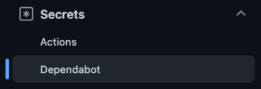
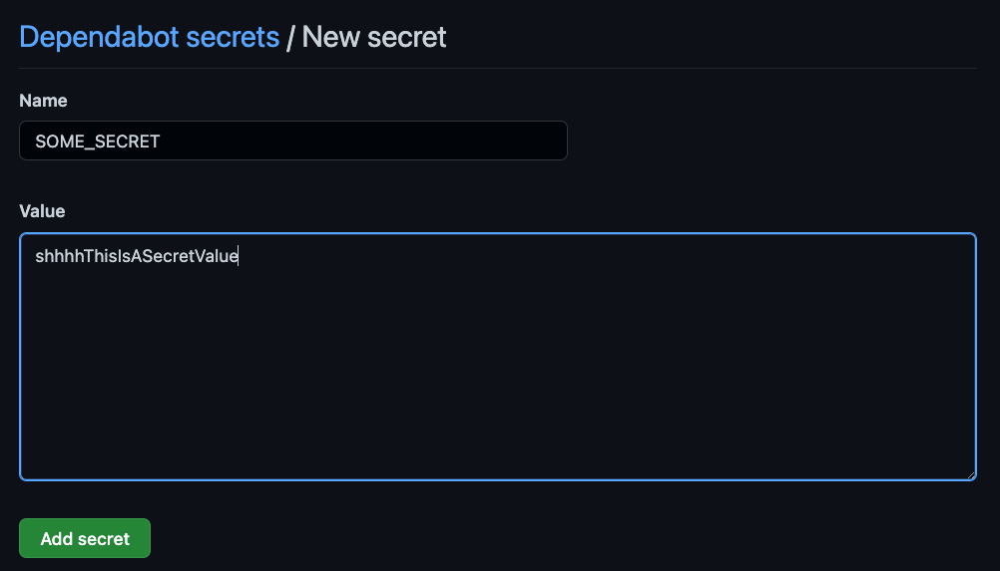
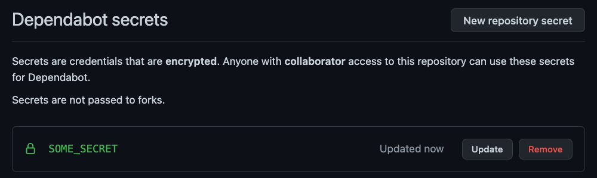

A few months ago I noticed all the Github Dependabot pull requests were failing the required continuous integration (CI) check on a project I'm working on. This check is implemented as a Github Action workflow that runs the build, linting, unit, and end-to-end tests on every push. It's a required check, which means any pull request to the mainline must pass CI before it can be merged, including the [Dependabot](https://docs.github.com/en/code-security/dependabot/dependabot-security-updates/about-dependabot-security-updates) PRs. This is critical because sometimes a dependency update to fix a security vulnerability can unintentionally break an existing feature.

<aside class="markdown-aside">
Forcing all PRs to run a certain check before being allowed to be merged to the mainline in Github, requires configuring a <a class="markdown-link" href="https://docs.github.com/en/repositories/configuring-branches-and-merges-in-your-repository/defining-the-mergeability-of-pull-requests/managing-a-branch-protection-rule?ref=hackernoon.com">Branch Protection Rule</a>. This can specify which branch(es) should be protected and what checks are required to be passing before any code can be merged to said branch.
</aside>

## The Failures

However, if *all* the Dependabot PRs are failing CI, it's unlikely that every single dependency update is breaking something in the project, especially if they're all failing in the same way. Here's the error I was seeing on test failures from these PRs:

```
Braintree::ConfigurationError: Braintree::Configuration.merchant_id needs to be set
```

Indeed, this project does use Braintree to process payments, with a [sandbox](https://developer.paypal.com/braintree/articles/get-started/try-it-out#sandbox-vs.-production) environment being used for tests. An initializer is used to configure Braintree, and the values are populated from environment variables. Even in test mode, it's good practice to avoid hard-coding 3rd party configuration. Note this is a Rails project:

```ruby
# config/initializers/braintree.rb

Braintree::Configuration.merchant_id = ENV["BRAINTREE_MERCHANT_ID"]
# populate other Braintree config...
```

## Populating Environment Variables

To understand why the tests were complaining about Braintree configuration not being set requires understanding how environment variables are populated on this project.

Locally, the values of all environment variables come from a git ignored `.env` file that developers populate on their laptops during project setup.

For the Continuous Integration workflow that runs with Github Actions, this environment variables are populated in the Github repository secrets. Secrets can be set in Github by anyone with administrator access to the project by going to Settings -> Secrets -> Actions, and then clicking on the "New repository secret" button. For example to add a secret named `SOME_SECRET`:


After saving it, it will be displayed as follows:


These secrets can then be used to populate environment variables in Github Action workflows by using the [env](https://docs.github.com/en/enterprise-server@3.3/actions/using-workflows/workflow-syntax-for-github-actions#env) section, for example:

```yml
# .github/workflows/ci.yml
name: CI
on: push

env:
  SOME_SECRET: ${{ secrets.SOME_SECRET }}
  BRAINTREE_MERCHANT_ID: ${{ secrets.BRAINTREE_MERCHANT_ID }}
  # other env vars...

jobs:
  # build, lint, test, etc...
```

Given the above, any code that runs as part of the workflow on the Github Action runner will have access to `ENV["BRAINTREE_MERCHANT_ID"]` and `ENV["SOME_SECRET"]`, which is the Ruby syntax for accessing environment variables.

## Dependabot Secrets

However, it turns out, Dependabot doesn't have permission to read the main repository secrets. This means when any Dependabot PR is running the Continuous Integration check and attempts to run initializers, it's as if the code had the following:

```ruby
Braintree::Configuration.merchant_id = nil
# other config...
```

Which would cause all tests that need to communicate with the Braintree sandbox to fail. Essentially, anywhere `ENV["SOMETHING"]` is referenced would return `nil`.

The solution is to specify a set of secrets specifically for Dependabot. This can be done in the Github UI by going to your repository's Settings, then in the Secrets section, selecting Dependabot. Note that the secrets specified in the Actions section are only available to your own PRs. Anything that the Dependabot PRs need to run must be specified in the Dependabot section.

The UI to add a secret in the Dependabot section is the same as adding in the Actions section, for example:







In the example above, the Dependabot PRs will now have access to `SOME_SECRET`. After specifying all the actual secrets needed, re-run the failed Dependabot checks and this time they should pass.

## Conclusion

This post has covered a simple reason why your Dependabot PRs may be failing required checks on Github, and how to fix it by configuring secrets specifically for Dependabot.