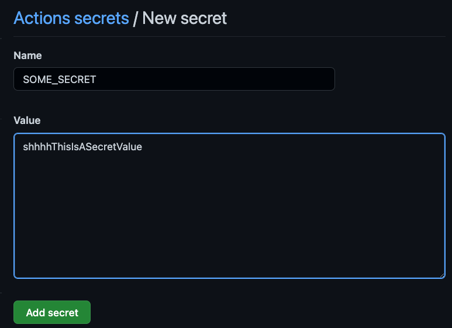
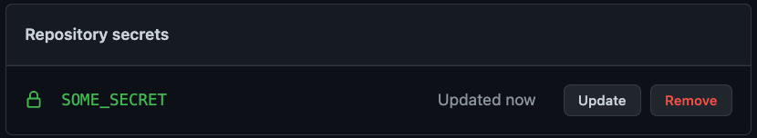

A few months ago I noticed all the Github Dependabot pull requests were failing the required continuous integration (CI) check on a project I'm working on. This check is implemented as a Github Action workflow that runs the build, linting, unit, and end-to-end tests on every push. Being a required check means any pull request to the mainline must pass CI before it can be merged, including the [Dependabot](https://docs.github.com/en/code-security/dependabot/dependabot-security-updates/about-dependabot-security-updates) PRs. This is critical because sometimes a dependency update to fix a security vulnerability can unintentionally break an existing feature.

## The Failures

However, if *all* the Dependabot PRs are failing CI, it's unlikely that every single dependency update is breaking something in the project, especially if they're all failing in the same way. Here's the error I was seeing on test failures from these PRs:

```
Braintree::ConfigurationError: Braintree::Configuration.merchant_id needs to be set
```

Indeed, this project does use Braintree to process payments, with a "sandbox" environment being used for tests. An initializer is used to configure Braintree from environment variables (this is a Rails project):

```ruby
# config/initializers/braintree.rb

Braintree::Configuration.merchant_id = ENV["BRAINTREE_MERCHANT_ID"]
# populate other Braintree config...
```

## Populating Environment Variables

To understand why the Braintree configuration wasn't populated requires understanding how environment variables are populated on this project.

Locally, the value of the Braintree environment variables (actually, all environment variables) comes from a git ignored `.env` file that developers populate on their laptops during project setup.

For the Continuous Integration workflow on Github, this value is populated in the Github repository secrets, so all the developers' PRs use it and pass. Secrets can be set in Github by anyone with administrator access to the project by going to Settings -> Secrets -> Actions, and then clicking on the "New repository secret" button. For example to add a secret named `SOME_SECRET`:



After saving it, it will be displayed as follows:



These secrets can then be used to populate environment variables in Github Action workflows by using the [env](https://docs.github.com/en/enterprise-server@3.3/actions/using-workflows/workflow-syntax-for-github-actions#env) section, for example:

```yml
env:
  SOME_SECRET: ${{ secrets.SOME_SECRET }}
  BRAINTREE_MERCHANT_ID: ${{ secrets.BRAINTREE_MERCHANT_ID }}
  # other env vars...
```

Given the above, any code that runs as part of the workflow on the Github Action runner will have access to `ENV["BRAINTREE_MERCHANT_ID"]` or `ENV["SOME_SECRET"]`, which is the Ruby syntax for accessing environment variables.

## Dependabot Secrets

However, it turns out, dependabot doesn't have access to the main repository secrets. Essentially, it was as if the initializer had the following:

```ruby
Braintree::Configuration.merchant_id = nil
# other config...
```

* Solution, go to project settings on Github -> Secrets -> click down caret, notice there's two different sections, one for Actions, and another for Dependabot. (ref image: github-repo-secrets.png)
* Click on Dependabot from Secrets settings and populate the secrets necessary for required checks to pass when run by dependabot.
* Re-run the failed dependabot checks and this time they should pass.