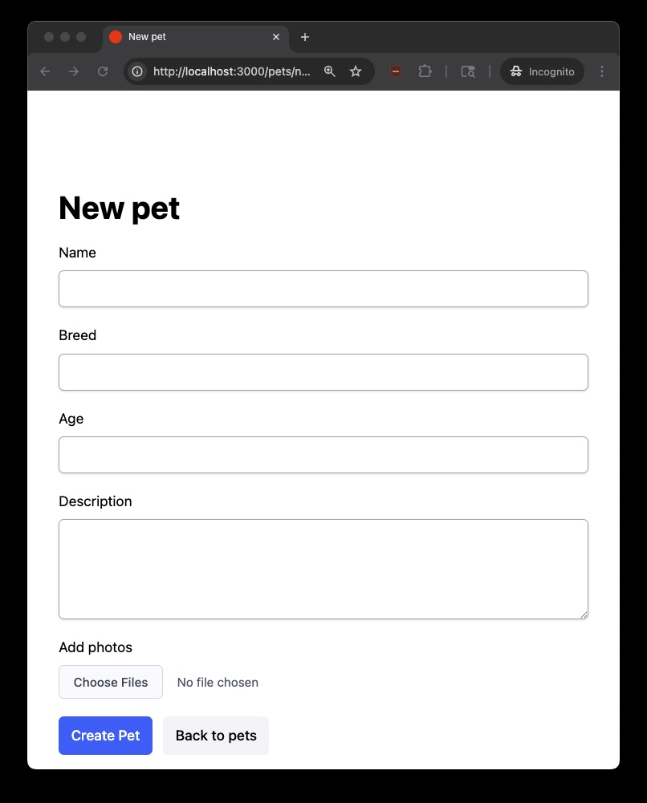
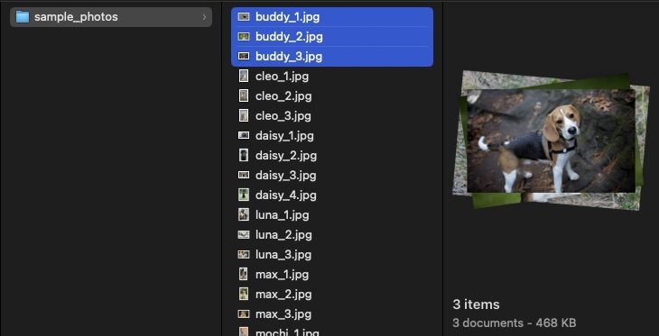
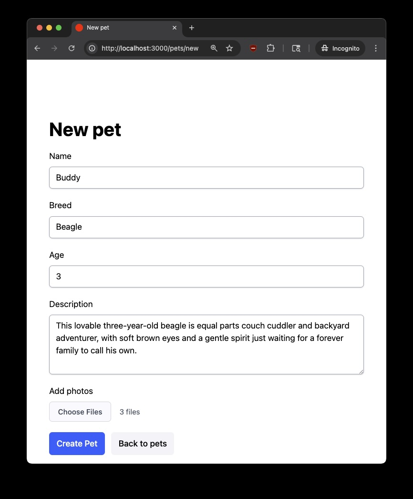
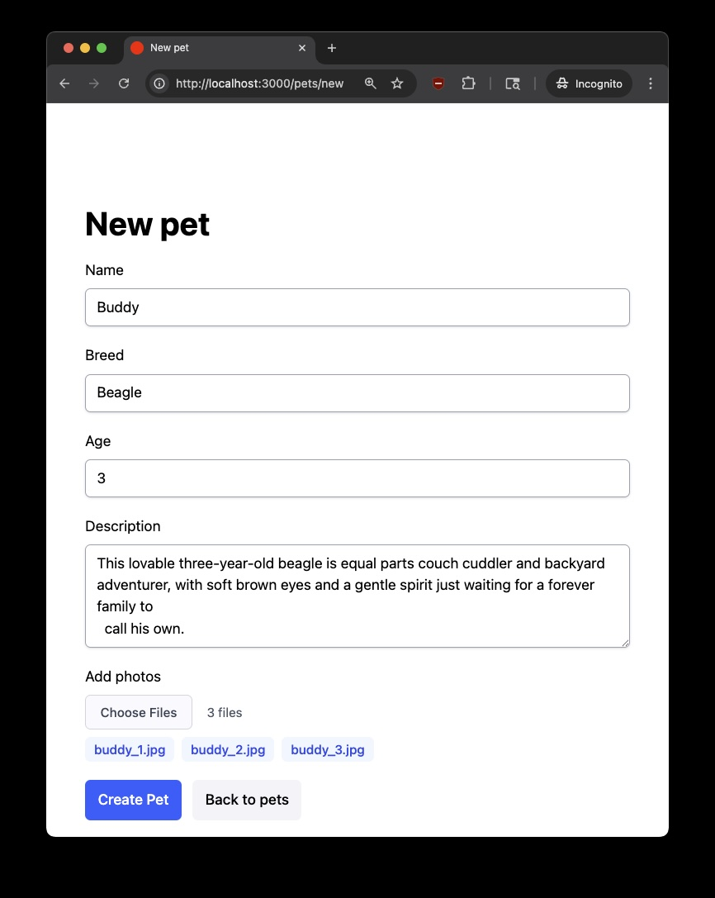
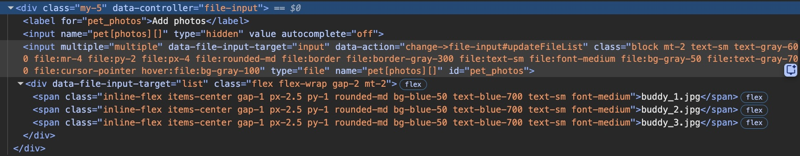
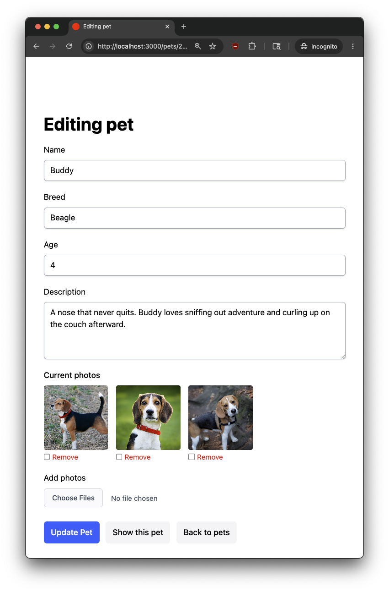

When you add a multi-file upload to a Rails form with Active Storage's `has_many_attached`, the browser's native file input shows something like "3 files" instead of listing the actual file names. This isn't a Rails limitation, it's how `<input type="file" multiple>` works in every browser. In this post, we'll build a small [Stimulus](https://stimulus.hotwired.dev) controller that reads the selected files and displays each name, giving users clear confirmation of what they picked. If you're new to Stimulus, the [official handbook](https://stimulus.hotwired.dev/handbook/introduction) is a good starting point, as this post assumes basic familiarity.

## Understanding the Browser Behavior

Before writing any code, let's understand *why* the file input behaves this way. A multi-file input looks like this:

```html
<label for="photos">Choose photos:</label>
<input type="file" id="photos" name="photos" accept="image/png, image/jpeg" multiple>
```

From the [MDN file input reference](https://developer.mozilla.org/en-US/docs/Web/HTML/Reference/Elements/input/file):

> When the user selected multiple files, the value represents the first file in the list of files they selected. The other files can be identified using the input's HTMLInputElement.files property.

But the files *are* accessible through the [`HTMLInputElement.files`](https://developer.mozilla.org/en-US/docs/Web/API/File_API/Using_files_from_web_applications#getting_information_about_selected_files) property, which returns a `FileList` containing every selected file. This means that the data is already there in the DOM. We can read it and render the file names with a few lines of JavaScript.

## Demo App Setup

To demonstrate the solution, we'll build a simple Pet Adoption Board where shelter staff post pets that are up for adoption with multiple photos.

<aside class="markdown-aside">
The demo uses <a class="markdown-link" href="https://tailwindcss.com">Tailwind CSS</a> for styling. Code samples omit the utility classes to stay focused on the file input behavior.
</aside>

**Create the App**

Note that Rails 8 includes Stimulus by default:

```bash
rails new pet_adoptions_demo
cd pet_adoptions_demo
```

**Set Up Active Storage and Scaffold**

```bash
bin/rails active_storage:install
bin/rails db:migrate

bin/rails generate scaffold Pet name:string breed:string age:integer description:text
bin/rails db:migrate
```

**Configure the Model**

Add `has_many_attached` to the `Pet` model:

```ruby
# app/models/pet.rb
class Pet < ApplicationRecord
  has_many_attached :photos
end
```

**Update the Controller**

It might seem natural to add `photos: []` to `pet_params`, but two things complicate that. First, assigning `photos` through `pet.update` replaces the entire attachment collection rather than appending to it. A user adding one photo to a pet that already has three would lose the existing three. Second, we want users to have the ability to remove individual existing photos when editing. The form will handle that with a checkbox per attached photo, submitting `pet[remove_photo_ids][]` as an array of IDs, which isn't a model attribute. So the controller permits only the regular pet attributes, then handles photos separately: append new uploads after save, and purge any marked for removal.

```ruby
# app/controllers/pets_controller.rb
def create
  @pet = Pet.new(pet_params)

  respond_to do |format|
    if @pet.save
      attach_new_photos
      format.html { redirect_to @pet, notice: "Pet was successfully created." }
      # ...
    end
  end
end

def update
  respond_to do |format|
    if @pet.update(pet_params)
      purge_removed_photos
      attach_new_photos
      format.html { redirect_to @pet, notice: "Pet was successfully updated." }
      # ...
    end
  end
end

def pet_params
  params.expect(pet: [ :name, :breed, :age, :description ])
end

def attach_new_photos
  new_photos = params.dig(:pet, :photos)
  return if new_photos.blank? || new_photos.all?(&:blank?)

  @pet.photos.attach(new_photos)
end

def purge_removed_photos
  ids = params.dig(:pet, :remove_photo_ids)
  return if ids.blank?

  @pet.photos.where(id: ids).each(&:purge)
end
```

`attach_new_photos` digs into params for the uploaded files, guards against blank submissions, and calls `attach` so existing photos stay put. `purge_removed_photos` removes any photos whose IDs came in via the remove checkboxes.
**Add the File Input to the Form**

**Update the View**

Add a file input before the submit button in `app/views/pets/_form.html.erb`. When editing a pet that already has photos, also render each existing photo with a checkbox for removing it:

```erb
<%# app/views/pets/_form.html.erb %>
<% pet.photos.each do |photo| %>
  <%= image_tag photo %>
  <%= check_box_tag "pet[remove_photo_ids][]", photo.id, false %>
  Remove
<% end %>

<div>
  <%= form.label :photos, "Add photos" %>
  <%= form.file_field :photos, multiple: true %>
</div>
```

This is just a snippet. See the [demo project form](https://github.com/danielabar/pet_adoptions_demo/blob/main/app/views/pets/_form.html.erb) for the full markup.

Run the server with `bin/dev` and visit `http://localhost:3000/pets/new`. You'll see a form like this:



Now click on "Choose Files" and select three files using the OS file picker:



After selecting, the browser just shows "3 files":



Which three? The user can't tell without opening the file picker again. Let's fix that.

## Building the Stimulus Controller

To read `HTMLInputElement.files` and update the DOM on each selection change, we need a small JavaScript event listener. Stimulus is well-suited for this: it wires DOM events to controller methods with minimal setup and no build complexity.

Generate the controller:

```bash
bin/rails generate stimulus file_input
# create  app/javascript/controllers/file_input_controller.js
```

Replace the generated boilerplate with:

```javascript
// app/javascript/controllers/file_input_controller.js
import { Controller } from "@hotwired/stimulus"

export default class extends Controller {
  static targets = ["input", "list"]

  updateFileList() {
    const files = this.inputTarget.files
    this.listTarget.innerHTML = ""

    if (files.length === 0) return

    Array.from(files).forEach((file) => {
      const span = document.createElement("span")
      span.className = "pill"
      span.textContent = file.name
      this.listTarget.appendChild(span)
    })
  }
}
```

Let's walk through this:

- **`static targets = ["input", "list"]`** declares two [targets](https://stimulus.hotwired.dev/reference/targets): `input` for the file input element (to read its `files` property) and `list` for a container div where we'll render the file names.
- **`this.inputTarget.files`** accesses the `FileList` from the file input. This is the DOM API that gives us what the browser's native display doesn't show.
- **`this.listTarget.innerHTML = ""`** clears any previously rendered file names. This handles the case where the user selects files, then changes their selection.
- **`Array.from(files).forEach(...)`** converts the `FileList` (which isn't a true array) to an array, so we can iterate. For each file, we create a styled `<span>` pill showing the file name.

## Wiring It Up in the View

Update `app/views/pets/_form.html.erb` to wire up the controller:

```erb
<div data-controller="file-input">
  <%= form.label :photos, "Add photos" %>
  <%= form.file_field :photos,
      multiple: true,
      data: {
        file_input_target: "input",
        action: "change->file-input#updateFileList" } %>
  <div data-file-input-target="list"></div>
</div>
```

Three things changed:

1. **`data-controller="file-input"`** on the wrapper div connects this section of the DOM to the Stimulus controller `file_input_controller.js`.
2. **`data: { file_input_target: "input", action: "change->file-input#updateFileList" }`** on the file field marks this element as the `input` target and calls `updateFileList()` on every `change` event (i.e., whenever the user selects files).
3. **`<div data-file-input-target="list">`** is an empty container where the controller will render file name pills.

<aside class="markdown-aside">
Notice that the event binding uses <code>data-action</code> on the input element rather than adding an event listener in the controller's <code>connect()</code> callback. This is <a class="markdown-link" href="https://stimulus.hotwired.dev/reference/actions">idiomatic Stimulus</a>. Actions declared in the markup keep the controller focused on behavior, and Stimulus handles the listener lifecycle automatically.
</aside>

Now when selecting multiple files, it displays each file name as a pill in the list section:



Opening the browser DevTools confirms the controller is creating a `<span>` for each file:



And here is what the edit view looks like for a pet that was saved with photos attached:



## What About Existing Solutions?

Before building this, I used an AI assistant to survey the existing solutions. Here's what's available and why I didn't use them:

**Full upload libraries** like [Uppy](https://uppy.io/), [Dropzone.js](https://www.dropzone.dev/), and [FilePond](https://pqina.nl/filepond/) replace the native file input entirely with a custom UI that includes drag-and-drop, image previews, progress bars, and more. If you need those features, they're excellent. But if all you need is to show file names alongside a standard form input, pulling in tens to hundreds of KB of library is overkill.

**The Stimulus ecosystem**: Searched across [stimulus-components](https://www.stimulus-components.com/), [stimulus-use](https://stimulus-use.github.io/stimulus-use/), [tailwindcss-stimulus-components](https://github.com/excid3/tailwindcss-stimulus-components), and the [awesome-stimulusjs](https://github.com/stimulus-components/awesome-stimulusjs) curated list. None contained a file input display controller.

## Using Without Rails

Note that Stimulus isn't tied to Rails, so if you want this functionality in any web app, Stimulus can be loaded from a CDN and used as follows:

```html
<!DOCTYPE html>
<html>
<head><title>File Input Demo</title></head>
<body>
  <div data-controller="file-input">
    <label for="photos">Choose photos:</label>
    <input type="file" id="photos" name="photos" multiple
           data-file-input-target="input"
           data-action="change->file-input#updateFileList">
    <div data-file-input-target="list"></div>
  </div>

  <script type="module">
    import { Application, Controller } from "https://unpkg.com/@hotwired/stimulus/dist/stimulus.js"

    const application = Application.start()

    class FileInputController extends Controller {
      static targets = ["input", "list"]

      updateFileList() {
        const files = this.inputTarget.files
        this.listTarget.innerHTML = ""

        if (files.length === 0) return

        Array.from(files).forEach((file) => {
          const span = document.createElement("span")
          span.textContent = file.name
          this.listTarget.appendChild(span)
        })
      }
    }

    application.register("file-input", FileInputController)
  </script>
</body>
</html>
```

Two things differ from the Rails setup:

- **`Application.start()`** launches the Stimulus runtime (Rails handles this in `app/javascript/controllers/application.js`).
- **`application.register("file-input", FileInputController)`** maps the controller name to the class (Rails' `controllers/index.js` does this automatically via its eager-load convention).

The `data-controller`, `data-action`, and `data-*-target` attributes in the markup are identical.

## Conclusion

The native file input's "n files" display is a well-known UX gap, and the fix is straightforward once you know about `HTMLInputElement.files`. A small focused Stimulus controller reads the `FileList`, renders each name, and gives users clear feedback on their selection. The controller itself is framework-agnostic; the standalone example shows it works just as well outside Rails via a CDN import.

The completed demo project is available on [Github](https://github.com/danielabar/pet_adoptions_demo).
