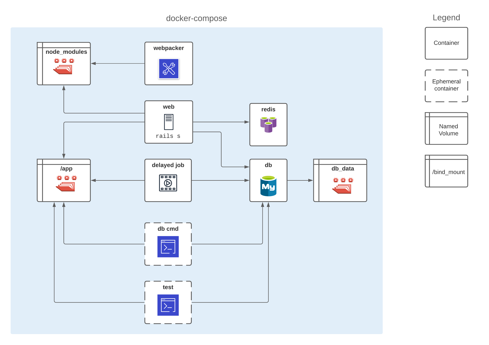
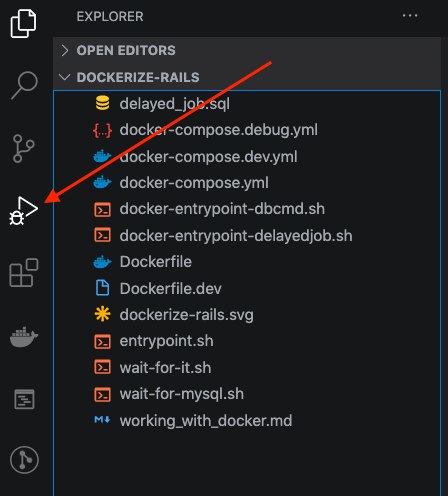

At work, I was recently tasked with Dockerizing a Rails monolith. This app has a React front end built with Webpacker, client side dependencies managed with Yarn, runs background jobs with Active Job, and uses a MySQL database and Redis. The existing setup involved developers installing all dependencies on their laptops and took some non-trivial amount of time to get working. The goal of packaging everything with Docker was to make it easier and faster for new developers to get up and running. It was also important to ensure the project could still be run the "old fashioned" way, i.e. all dependencies installed directly on laptop. This was a hedge in case something was found that could not be made to work with Docker.

## Development Workflow

Although there are many benefits to using Docker for development, there are also some challenges such as how to run tests? how to debug? In order for the Docker setup to be effective, it needs to cover the entire development workflow, including:

1. Running the Rails app with changes to server side code made on host machine automatically reflected in container.
2. Running one-time setup tasks such as applying the schema to database and populating it with `db/seeds.rb`.
3. Running a Webpack dev server so that changes in client side code made on host machine are automatically compiled in container and browser is automatically refreshed to reflect these changes.
4. Running a background job processor (this project uses Active Job, but Sidekiq could be used instead).
5. Debugging with either a command line debugger (`binding.pry`) or an IDE such as VS Code.
6. Running one off commands such as applying database migrations or running tests.
7. Being able to access an interactive Rails console.

This post will walk through the setup, to achieve each of the above workflows steps. A quick note first - this post assumes knowledge of Docker concepts such as Images, Containers and Volumes. For those unfamiliar or new to Docker, I recommend the [Docker Deep Dive](https://www.pluralsight.com/courses/docker-deep-dive-update) course on Pluralsight.

## Introducing docker-compose

According to [Docker Best Practices](https://docs.docker.com/develop/develop-images/dockerfile_best-practices/):
>Each container should have only one concern. Decoupling applications into multiple containers makes it easier to scale horizontally and reuse containers. For instance, a web application stack might consist of three separate containers, each with its own unique image, to manage the web application, database, and an in-memory cache in a decoupled manner.

Looking at what's needed to run a Rails app (server, webpacker, MySQL, Redis, etc), it becomes clear that each of these is a separate concern, therefore should be run in a separate container. However, these containers will need to communicate with each other, and be coordinated such that they run at the appropriate time. For example, it would not make sense for the container that seeds the database to start running before the container that houses the MySQL database is available.

[Docker Compose](https://docs.docker.com/compose/) is a great tool to coordinate and synchronize multiple containers for this purpose. Here is a visual representation of what we will be creating:



In order to proceed with the next steps in this post, make sure [Docker](https://docs.docker.com/get-docker/) is installed, this installation also comes with docker-compose.

## 1. Run Rails with changes on host machine reflected in container

Start by creating a `Dockerfile` at the root of the project as follows. This particular project uses Ruby version 2.6.6 and is deployed on Debian Stretch. It's a good idea to have the base image be the same as the projects' production environment. This provides an early warning in case of environment issues such as something that works on a laptop (eg: Mac or Windows) but fails or behaves differently in production (eg: Linux).

```Dockerfile
# Replace this with your Ruby version and Linux flavor/version
FROM ruby:2.6.6-stretch

# Package dependencies
RUN apt-get update && apt-get install -y curl build-essential gnupg mysql-client

# Replace with newer bundler version if using
RUN gem install bundler --no-document -v '1.17.3'

# Replace this with your Node version if newer than 10.x, this is for client side tooling.
# Install Node.js https://www.digitalocean.com/community/tutorials/how-to-install-node-js-on-debian-9
RUN curl -sL https://deb.nodesource.com/setup_10.x -o nodesource_setup.sh
RUN bash nodesource_setup.sh
RUN apt-get install -y nodejs

# Skip this if your project uses npm instead of yarn
# Install yarn https://linuxize.com/post/how-to-install-yarn-on-debian-9/
RUN curl -sS https://dl.yarnpkg.com/debian/pubkey.gpg | apt-key add -
RUN echo "deb https://dl.yarnpkg.com/debian/ stable main" | tee /etc/apt/sources.list.d/yarn.list
RUN apt update
RUN apt install -y yarn
ENV PATH $(yarn global bin):$PATH

# Copy all project source to working directory
WORKDIR /app
COPY . /app

# Run server and client side builds. These steps are performed one time as part of the image build,
# so they don't need to be re-run each time a container is started.
RUN bundle check || bundle install
RUN yarn install --check-files
```

Next, create a `docker-compose.yml` file at the root of the project as follows. Note that the `web` service refers to the Dockerfile created previously:

```yml
version: "3.3"
services:
  # The main service that runs a Rails server
  web:
    build:
      context: .
      dockerfile: Dockerfile
    # This runs when container started as part of docker-compose up.
    command: bash -c "rm -f tmp/pids/server.pid && bundle exec rails s -b '0.0.0.0'"
    depends_on:
      - "db"
      - "redis"
    volumes:
      # Mount current directory as shared volume for development so that changes
      # made to local code will reflect on app running on container.
      - .:/app
      # Mount a persistent docker volume in place of local node_modules directory
      # this prevents yarn (or npm) errors in case developer has also been running the app natively.
      - node_modules:/app/node_modules
    ports:
      # Expose port 3000 from container to host so can run http://localhost:3000 in browser on laptop.
      - "3000:3000"
    environment:
      # Used in database.yml to tell Rails where the database is.
      DB_HOST: db
      RAILS_ENV: development
      REDIS_URL: "redis://redis/"

  # Run MySQL database
  db:
    # Replace with your MySQL version or refer to Postgres image if using.
    image: mysql:5.7
    volumes:
      # Use a named volume so that changes to db state will persist even if container removed.
      - db_data:/var/lib/mysql
    ports:
      # If a MySQL database is also running on laptop, map 3306 in container to a different port on host,
      # such as 3307. Otherwise can use "3306:3306" here. This is useful for connecting a SQL client from
      # host machine to container.
      - "3307:3306"
    environment:
      MYSQL_ALLOW_EMPTY_PASSWORD: "yes"
      # Replace with your app's database name
      MYSQL_DATABASE: appdb
      # Enable if required for development
      # MYSQL_USERNAME: appdbuser
      # MYSQL_PASSWORD: appdbpassword

  # Run Redis
  redis:
    image: redis:3
    ports:
      # If you're also running a Redis instance on host, map 6379 in container to a different port on host,
      # such as 6380. Otherwise can use "6379:6379" here. This is useful for connecting a Redis client from
      # host machine to container.
      - "6380:6379"

# All named volumes referenced by services must be listed here.
volumes:
  db_data:
  node_modules:
```

Next, modify the application's `database.yml` file to tell Rails where the database is located:

```yml
development
  adapter: mysql2
  # Use DB_HOST environment variable if set, otherwise default to localhost,
  # This ensures that project can still run the "old fashioned" way when everything
  # is installed directly on laptop.
  host: <%= ENV['DB_HOST'] || "127.0.0.1" %>
  # Replace with your app's database name
  database: appdb
```

Next, open a terminal and run the following commands to build the app image, and run the containers:

```bash
docker-compose build
docker-compose up
```

At this point, the containers should all start up (run `docker ps` to confirm), but the app won't work yet because the database schema has not been loaded. Hit <kbd>Ctrl</kbd> + <kbd>C</kbd> to stop the containers, then continue to next step.

## 2. Run one-time database setup

This project makes use of `db/seeds.rb` to initialize the database with some sample data, which should only run on first time setup. The solution is to use an ephemeral container, based on the app image to issue the `rake db:reset` command, if the `INIT_DBS` environment variable is set. This will drop the database if it already exists, then run `db:setup` which will create the database, load the schema (defined in `db/schema.rb` which gets populated every time a new migration is added), and run `db:seed` to populate the database.

Aside: See this [Stack Overflow Answer](https://stackoverflow.com/a/10302357/3991687) for an explanation of what all the various `rake db:xxx` tasks do.

One thing to watch out for, is that the `db:reset` command cannot run until the database is available to handle requests. We will use [wait-for-it.sh](https://github.com/vishnubob/wait-for-it) to solve this synchronization issue.

Download [wait-for-it.sh](https://github.com/vishnubob/wait-for-it) from Github and place it in project root.

Then modify `Dockerfile` so that this file is included in the image and made executable:

```Dockerfile
# Replace this with your Ruby version and Linux flavor/version
FROM ruby:2.6.6-stretch

# Package dependencies
RUN apt-get update && apt-get install -y curl build-essential gnupg mysql-client

# Replace with newer bundler version if using
RUN gem install bundler --no-document -v '1.17.3'

# Replace this with your Node version if newer than 10.x, this is for client side tooling.
# Install Node.js https://www.digitalocean.com/community/tutorials/how-to-install-node-js-on-debian-9
RUN curl -sL https://deb.nodesource.com/setup_10.x -o nodesource_setup.sh
RUN bash nodesource_setup.sh
RUN apt-get install -y nodejs

# Skip this if your project uses npm instead of yarn
# Install yarn https://linuxize.com/post/how-to-install-yarn-on-debian-9/
RUN curl -sS https://dl.yarnpkg.com/debian/pubkey.gpg | apt-key add -
RUN echo "deb https://dl.yarnpkg.com/debian/ stable main" | tee /etc/apt/sources.list.d/yarn.list
RUN apt update
RUN apt install -y yarn
ENV PATH $(yarn global bin):$PATH

############## NEW SECTION TO ADD HERE #############################
# Use wait-for-it.sh to control startup order of containers
COPY wait-for-it.sh /wait-for-it.sh
RUN chmod +x /wait-for-it.sh
####################################################################

# Copy all project source to working directory
WORKDIR /app
COPY . /app

# Run server and client side builds. These steps are performed one time as part of the image build,
# so they don't need to be re-run each time a container is started.
RUN bundle check || bundle install
RUN yarn install --check-files
```

Then modify `docker-compose.yml` to define a new `dbcmd` service. Note that it's based on the same app image as the `web` service, which means that when `docker-compose build` is run, it won't need to run a separate build for this service because it can re-use the same image that's already been built for the `web` service. For this to work, the `web` service definition is modified to name the image `app`:

```yml
version: "3.3"
services:
  # The main service that runs a Rails server
  web:
    build:
      context: .
      dockerfile: Dockerfile
    ############### ADD THIS LINE HERE #####################
    # name this image so it can be used by other containers without requiring a build
    image: app
    # This runs when container started as part of docker-compose up.
    command: bash -c "rm -f tmp/pids/server.pid && bundle exec rails s -b '0.0.0.0'"
    depends_on:
      - "db"
      - "redis"
    volumes:
      # Mount current directory as shared volume for development so that changes
      # made to local code will reflect on app running on container.
      - .:/app
      # Mount a persistent docker volume in place of local node_modules directory
      # this prevents yarn (or npm) errors in case developer has also been running the app natively.
      - node_modules:/app/node_modules
    ports:
      # Expose port 3000 from container to host so can run http://localhost:3000 in browser on laptop.
      - "3000:3000"
    environment:
      # Used in database.yml to tell Rails where the database is.
      DB_HOST: db
      RAILS_ENV: development
      REDIS_URL: "redis://redis/"

  ############### ADD NEW SERVICE HERE #####################
  # Ephemeral container to issue rake db:reset command
  dbcmd:
    # Use same image as `web` service to avoid multiple builds
    image: app
    # Make sure MySQL is up before attempting db population
    command: ["/wait-for-it.sh", "db:3306", "--", "./docker-entrypoint-dbcmd.sh"]
    depends_on:
      - "db"
    volumes:
      - .:/app
      - node_modules:/app/node_modules
    environment:
      DB_HOST: db
      RAILS_ENV: development
      # Usage to populate databases with seed data: INIT_DBS=yes docker-compose up
      INIT_DBS:

  # Run MySQL database
  db:
    # Replace with your MySQL version or refer to Postgres image if using.
    image: mysql:5.7
    volumes:
      # Use a named volume so that changes to db state will persist even if container removed.
      - db_data:/var/lib/mysql
    ports:
      # If a MySQL database is also running on laptop, map 3306 in container to a different port on host,
      # such as 3307. Otherwise can use "3306:3306" here. This is useful for connecting a SQL client from
      # host machine to container.
      - "3307:3306"
    environment:
      MYSQL_ALLOW_EMPTY_PASSWORD: "yes"
      # Replace with your app's database name
      MYSQL_DATABASE: appdb
      # Enable if required for development
      # MYSQL_USERNAME: appdbuser
      # MYSQL_PASSWORD: appdbpassword

  # Run Redis
  redis:
    image: redis:3
    ports:
      # If you're also running a Redis instance on host, map 6379 in container to a different port on host,
      # such as 6380. Otherwise can use "6379:6379" here. This is useful for connecting a Redis client from
      # host machine to container.
      - "6380:6379"

# All named volumes referenced by services must be listed here.
volumes:
  db_data:
  node_modules:
```

Also add `docker-entrypoint-dbcmd.sh` to project root which contains the database reset commands for the development and test databases:

```sh
#!/bin/sh

set -e

if [ "$INIT_DBS" = "yes" ]; then
  echo "=== INITIALIZING DATABASES"
  bin/rails db:environment:set RAILS_ENV=development && bundle exec rake db:reset
  bin/rails db:environment:set RAILS_ENV=test && bundle exec rake db:test:reset
fi
```

Now run the build again (since the `Dockerfile` was modified) and bring up the containers with the `INIT_DBS` environment variable set to trigger database population:

```bash
docker-compose build
INIT_DBS=yes docker-compose up
```

Now open a browser and navigate to [http://localhost:3000](http://localhost:3000), your app's homepage should load. It may be very slow due to webpacker compiling front end assets on demand, but not to worry, this will be resolved in the next step.

Before moving on to next step, make sure that the `/app` bind mount is working by making a small change to the server side code on your laptop, then check that it's reflected in the `web` container. For example, add some logging to the `index` method of the main controller:

```ruby
def index
  Rails.logger.info("Hello from Docker!)
  ...
end
```

Refresh the app in browser (assuming it's still on the main page) and watch the console output where `docker-compose up` is running, it should display `Hello from Docker!`.

## 3. Run Webpacker

The next step is to run a Webpack dev server in another container to watch for changes to front end assets, recompile them, and refresh the browser. This will greatly speed up page load time during development.

But first, take a look at the `dev_server` section of `config/webpacker.yml`:

```yml
dev_server:
  https: false
  host: localhost
  port: 3035
  ...
```

In order for the Webpack dev server to work in a container, the host can no longer be `localhost`, instead it should be the container this service will be running in, which will be named `webpacker`. However, the goal is to also have this setup work in a non Docker environment, so it won't work to simply change it to `host: webpacker`. One would think that since this is a yaml file in Rails, ERB syntax is supported to make a similar change as was done in `database.yml`, for example something like this:

```yml
dev_server:
  https: false
  # DOES NOT WORK!
  host: host: <%= ENV['WEBPACK_HOST'] || "localhost" %>
  port: 3035
  ...
```

However, this particular yaml file is also used on the JavaScript side therefore ERB cannot be used. Fortunately, Webpacker has a solution for this, the `WEBPACKER_DEV_SERVER_HOST` environment variable can be specified when running Webpacker, which will override the `host` value in `config/webpacker.yml`. It should also be specified in the container running the Rails server.

Modify `docker-compose.yml` to add a new `webpacker` service as shown below. Also note the change to the `web` container command to specify the `WEBPACKER_DEV_SERVER_HOST` environment variable.

```yml
version: "3.3"
services:
  # The main service that runs a Rails server
  web:
    build:
      context: .
      dockerfile: Dockerfile
    # name this image so it can be used by other containers without requiring a build
    image: app
    ################ MODIFY COMMAND HERE ####################
    # This runs when container started as part of docker-compose up.
    command: bash -c "rm -f tmp/pids/server.pid && WEBPACKER_DEV_SERVER_HOST=webpacker bundle exec rails s -b '0.0.0.0'"
    depends_on:
      - "db"
      - "redis"
    volumes:
      # Mount current directory as shared volume for development so that changes
      # made to local code will reflect on app running on container.
      - .:/app
      # Mount a persistent docker volume in place of local node_modules directory
      # this prevents yarn (or npm) errors in case developer has also been running the app natively.
      - node_modules:/app/node_modules
    ports:
      # Expose port 3000 from container to host so can run http://localhost:3000 in browser on laptop.
      - "3000:3000"
    environment:
      # Used in database.yml to tell Rails where the database is.
      DB_HOST: db
      RAILS_ENV: development
      REDIS_URL: "redis://redis/"

  # Ephemeral container to issue rake db:reset command
  dbcmd:
    # Use same image as `web` service to avoid multiple builds
    image: app
    # Make sure MySQL is up before attempting db population
    command: ["/wait-for-it.sh", "db:3306", "--", "./docker-entrypoint-dbcmd.sh"]
    depends_on:
      - "db"
    volumes:
      - .:/app
      - node_modules:/app/node_modules
    environment:
      DB_HOST: db
      RAILS_ENV: development
      # Usage to populate databases with seed data: INIT_DBS=yes docker-compose up
      INIT_DBS:

  # Run MySQL database
  db:
    # Replace with your MySQL version or refer to Postgres image if using.
    image: mysql:5.7
    volumes:
      # Use a named volume so that changes to db state will persist even if container removed.
      - db_data:/var/lib/mysql
    ports:
      # If a MySQL database is also running on laptop, map 3306 in container to a different port on host,
      # such as 3307. Otherwise can use "3306:3306" here. This is useful for connecting a SQL client from
      # host machine to container.
      - "3307:3306"
    environment:
      MYSQL_ALLOW_EMPTY_PASSWORD: "yes"
      # Replace with your app's database name
      MYSQL_DATABASE: appdb
      # Enable if required for development
      # MYSQL_USERNAME: appdbuser
      # MYSQL_PASSWORD: appdbpassword

  # Run Redis
  redis:
    image: redis:3
    ports:
      # If you're also running a Redis instance on host, map 6379 in container to a different port on host,
      # such as 6380. Otherwise can use "6379:6379" here. This is useful for connecting a Redis client from
      # host machine to container.
      - "6380:6379"

  ############## ADD NEW SERVICE HERE ##################
  # Run Webpack
  webpacker:
    image: app
    command: bash -c "WEBPACKER_DEV_SERVER_HOST=webpacker ./bin/webpack-dev-server"
    volumes:
      - .:/app
      - node_modules:/app/node_modules
    ports:
      - 3035:3035
    environment:
      RAILS_ENV: development

# All named volumes referenced by services must be listed here.
volumes:
  db_data:
  node_modules:
```

Now start the containers again (`docker-compose up`), give webpacker a few seconds to compile all front end assets, then open a browser and navigate to [http://localhost:3000](http://localhost:3000). This time the home page should load quickly. Also make a change to some front end code on your laptop, save it, then watch the terminal where docker-compose is running. Webpack should pick up the change, recompile, and browser should refresh and the change should be visible.

## 4. Running background job processor

This project uses [Active Job](https://guides.rubyonrails.org/active_job_basics.html) with Delayed Job queuing backend, which uses the `delayed_job` table. As we've seen in previous sections, the job processor is a separate process therefore will run in its own container. However, because it depends on the existence of the `delayed_job` table, this introduces another synchronization issue with the database. The simplest solution would be to use `wait-for-it.sh` again, waiting for the database on port 3306. But this will fail on first time setup when the database is being seeded. Since the seeds take some time to run, its possible the database will be available, but the schema has not yet been applied therefore the `delayed_job` table doesn't exist yet.

A custom wait wrapper can be used to solve this. Start by modifying the `docker-compose.yml` file to add a new `delayedjob` service:

```yml
version: "3.3"
services:
  # The main service that runs a Rails server
  web:
    build:
      context: .
      dockerfile: Dockerfile
    # name this image so it can be used by other containers without requiring a build
    image: app
    # This runs when container started as part of docker-compose up.
    command: bash -c "rm -f tmp/pids/server.pid && WEBPACKER_DEV_SERVER_HOST=webpacker bundle exec rails s -b '0.0.0.0'"
    depends_on:
      - "db"
      - "redis"
    volumes:
      # Mount current directory as shared volume for development so that changes
      # made to local code will reflect on app running on container.
      - .:/app
      # Mount a persistent docker volume in place of local node_modules directory
      # this prevents yarn (or npm) errors in case developer has also been running the app natively.
      - node_modules:/app/node_modules
    ports:
      # Expose port 3000 from container to host so can run http://localhost:3000 in browser on laptop.
      - "3000:3000"
    environment:
      # Used in database.yml to tell Rails where the database is.
      DB_HOST: db
      RAILS_ENV: development
      REDIS_URL: "redis://redis/"

  # Ephemeral container to issue rake db:reset command
  dbcmd:
    # Use same image as `web` service to avoid multiple builds
    image: app
    # Make sure MySQL is up before attempting db population
    command: ["/wait-for-it.sh", "db:3306", "--", "./docker-entrypoint-dbcmd.sh"]
    depends_on:
      - "db"
    volumes:
      - .:/app
      - node_modules:/app/node_modules
    environment:
      DB_HOST: db
      RAILS_ENV: development
      # Usage to populate databases with seed data: INIT_DBS=yes docker-compose up
      INIT_DBS:

  # Run MySQL database
  db:
    # Replace with your MySQL version or refer to Postgres image if using.
    image: mysql:5.7
    volumes:
      # Use a named volume so that changes to db state will persist even if container removed.
      - db_data:/var/lib/mysql
    ports:
      # If a MySQL database is also running on laptop, map 3306 in container to a different port on host,
      # such as 3307. Otherwise can use "3306:3306" here. This is useful for connecting a SQL client from
      # host machine to container.
      - "3307:3306"
    environment:
      MYSQL_ALLOW_EMPTY_PASSWORD: "yes"
      # Replace with your app's database name
      MYSQL_DATABASE: appdb
      # Enable if required for development
      # MYSQL_USERNAME: appdbuser
      # MYSQL_PASSWORD: appdbpassword

  # Run Redis
  redis:
    image: redis:3
    ports:
      # If you're also running a Redis instance on host, map 6379 in container to a different port on host,
      # such as 6380. Otherwise can use "6379:6379" here. This is useful for connecting a Redis client from
      # host machine to container.
      - "6380:6379"

  # Run Webpack
  webpacker:
    image: app
    command: bash -c "WEBPACKER_DEV_SERVER_HOST=webpacker ./bin/webpack-dev-server"
    volumes:
      - .:/app
      - node_modules:/app/node_modules
    ports:
      - 3035:3035
    environment:
      RAILS_ENV: development

  ############## ADD NEW SERVICE HERE ##################
  delayedjob:
    image: app
    # Make sure delayed_jobs table has been created before starting jobs processing
    command: ["/wait-for-mysql.sh", "db", "./docker-entrypoint-delayedjob.sh"]
    volumes:
      - .:/app
      - node_modules:/app/node_modules
    depends_on:
      - "web"
      - "db"
      - "dbcmd"
    environment:
      DB_HOST: db
      RAILS_ENV: development

# All named volumes referenced by services must be listed here.
volumes:
  db_data:
  node_modules:
```

Create a new file in project root named `delayed_job.sql`, this simply queries the `delayed_job` table:

```sql
select * from delayed_jobs;
```

Then create a new file in project root named `wait-for-mysql.sh`. Notice the way it gets invoked from the compose file, the first argument will be the host, in this case the `db` service to query. Then it enters a loop, invoking `mysql` client with the `delayed_job.sql` file. The `mysql` client is installed on the image as part of the `Dockerfile`. If the table exists, this will return 0 (i.e. success) and exit the loop. Otherwise, it sleeps for 3 seconds, then tries again. Upon successful exit of the loop, it then runs whatever command the script was called with as its remaining arguments. In our case, `docker-entrypoint-delayedjob.sh`, which will be created in the next step.

```bash
#!/bin/sh
# wait-for-mysql.sh
# https://docs.docker.com/compose/startup-order/

host="$1"
shift
cmd="$@"

while true; do
  mysql -h "$host" -u root appdbpswd < /delayed_job.sql
  if [ $? -eq 0 ]; then
      break
  fi
  >&2 echo "MySQL delayed_jobs table is UNAVAILABLE - sleeping"
  sleep 3
done

>&2 echo "MySQL delayed_jobs table is AVAILABLE - executing command"
exec $cmd
```

Add another file `docker-entrypoint-delayedjob.sh` in project root, which simply starts the Active Job processor:

```bash
#!/bin/sh

set -e

echo "=== RUNNING DELAYED JOBS"
bundle exec rails jobs:work
```

One final change required to make this all work is to modify the `Dockerfile` to add these additional files and make them executable.

```Dockerfile
# Replace this with your Ruby version and Linux flavor/version
FROM ruby:2.6.6-stretch

# Package dependencies
RUN apt-get update && apt-get install -y curl build-essential gnupg mysql-client

# Replace with newer bundler version if using
RUN gem install bundler --no-document -v '1.17.3'

# Replace this with your Node version if newer than 10.x, this is for client side tooling.
# Install Node.js https://www.digitalocean.com/community/tutorials/how-to-install-node-js-on-debian-9
RUN curl -sL https://deb.nodesource.com/setup_10.x -o nodesource_setup.sh
RUN bash nodesource_setup.sh
RUN apt-get install -y nodejs

# Skip this if your project uses npm instead of yarn
# Install yarn https://linuxize.com/post/how-to-install-yarn-on-debian-9/
RUN curl -sS https://dl.yarnpkg.com/debian/pubkey.gpg | apt-key add -
RUN echo "deb https://dl.yarnpkg.com/debian/ stable main" | tee /etc/apt/sources.list.d/yarn.list
RUN apt update
RUN apt install -y yarn
ENV PATH $(yarn global bin):$PATH

# Use wait-for-it.sh to control startup order of containers
COPY wait-for-it.sh /wait-for-it.sh
RUN chmod +x /wait-for-it.sh
############## NEW COMMANDS TO ADD HERE #############################
COPY wait-for-mysql.sh /wait-for-mysql.sh
RUN chmod +x /wait-for-mysql.sh
COPY delayed_job.sql /delayed_job.sql
####################################################################

# Copy all project source to working directory
WORKDIR /app
COPY . /app

# Run server and client side builds. These steps are performed one time as part of the image build,
# so they don't need to be re-run each time a container is started.
RUN bundle check || bundle install
RUN yarn install --check-files
```

Now if the database has not been seeded, and the containers are started, the console will display several `MySQL delayed_jobs table is UNAVAILABLE - sleeping`. Then when the `dbcmd` service has finished seeding the database, shortly after the compose console should display `MySQL delayed_jobs table is AVAILABLE - executing command`, then the Active Job processor should start up. Remember to run a build first as the `Dockerfile` wss modified:

```bash
docker-compose build
INIT_DBS=yes docker-compose up
```

## 5. Debugging

At this point, all app services are fully functional. However, we also need the ability to debug (i.e. step through the code one line at a time, inspecting variables). There are two ways to do this depending on the developers preference - either via command line with [binding.pry](https://github.com/pry/pry), or with an IDE such as VS Code.

### Command line debugging

First add [pry](https://github.com/pry/pry) and [pry-byebug](https://github.com/deivid-rodriguez/pry-byebug) to the `Gemfile`, then run `docker-compose build` to update the app image with these installed gems.

Given that the `pry` is available, the line `binding.pry` can be inserted anywhere in a running Ruby program, which will suspend execution and open an interactive `pry` session. From there, variable values can be inspected, expressions can be evaluated, basically anything that could be done in pry.

To make this work in a Docker container, add the following two properties to the `web` service definition in `docker-compose.yml`. The code below only shows the web service portion of the file:

```yml
version: "3.3"
services:
  # The main service that runs a Rails server
  web:
    build:
      context: .
      dockerfile: Dockerfile
    # name this image so it can be used by other containers without requiring a build
    image: app
    # This runs when container started as part of docker-compose up.
    command: bash -c "rm -f tmp/pids/server.pid && WEBPACKER_DEV_SERVER_HOST=webpacker bundle exec rails s -b '0.0.0.0'"
    depends_on:
      - "db"
      - "redis"
    volumes:
      # Mount current directory as shared volume for development so that changes
      # made to local code will reflect on app running on container.
      - .:/app
      # Mount a persistent docker volume in place of local node_modules directory
      # this prevents yarn (or npm) errors in case developer has also been running the app natively.
      - node_modules:/app/node_modules
    ports:
      # Expose port 3000 from container to host so can run http://localhost:3000 in browser on laptop.
      - "3000:3000"
    ################# ADD THESE TWO PROPERTIES ################################
    # Keep the stdin open to support attaching to app containers process for binding.pry
    tty: true
    # Allow for sending signals (CTRL+C, CTRL+P + CTRL+Q) into the container
    stdin_open: true
    ###########################################################################
    environment:
      # Used in database.yml to tell Rails where the database is.
      DB_HOST: db
      RAILS_ENV: development
      REDIS_URL: "redis://redis/"
```

Restart the containers with these new properties set, then add `binding.pry` to any section of code to be inspected, for example, the `index` method in home controller:

```ruby
def index
  binding.pry
  ...
end
```

Then open a new terminal and `attach` to the running `web` container. You'll need the name of the container to do this, first run `docker ps`, it will be named after the directory compose is running in. For example, if you're in a directory named `myproject`, then the `web` container name will be `myproject_web_1`. To attach to it, run the following:

```bash
docker attach myproject_web_1
```

This will display the console output of the `web` container. It may display nothing at the moment because there's no activity. Let's change that. On your laptop, open a browser and navigate to your project's home page (or any page that will exercise the code where `binding.pry` was added earlier). Keep an eye on the terminal where the `attach` command is running. It will now show the console output, AND pause execution at the line where `binding.pry` was added, and open an interactive pry session. Go ahead and inspect variables.

When finished, type `exit` to end `pry`. Do NOT use <kbd>Ctrl</kbd> + <kbd>C</kbd> to end the attach session because that will cause the process (rails server) in the container to end, which causes the container to exit. Instead, use the detach sequence <kbd>Ctrl</kbd> + <kbd>P</kbd> + <kbd>Q</kbd>.

### IDE Debugging

This is a little more complicated than command line debugging because the Rails server needs to be started in a different way, with some additional ports exposed. To start, make sure the [rdebug-ide](https://github.com/ruby-debug/ruby-debug-ide) gem is included in the Gemfile. If it's not, add it, then run `docker-compose build`.

Then add a new file to project root named `docker-compose.debug.yml`:

```yml
version: "3.3"
services:
  web:
    command: bash -c "rm -f tmp/pids/server.pid && WEBPACKER_DEV_SERVER_HOST=webpacker bundle exec rdebug-ide --debug --host 0.0.0.0 --port 1234 -- bin/rails s -p 3000 -b 0.0.0.0"
    depends_on:
      - "db"
      - "redis"
      - "webpacker"
    volumes:
      - .:/app
      - node_modules:/app/node_modules
    ports:
      # IDE debug
      - "1234:1234"
      - "26166:26168"
      - "26162:26162"
```

Now run the containers with the debug file specified as an override. What this will do is override the definition of the `web` service in `docker-compose.yml` with the version in `docker-compose.debug.yml`.

```bash
docker-compose -f docker-compose.debug.yml up
```

Since the `command` is running `rdebug-ide`, the rails server won't start as it usually does, but rather, it's waiting for an IDE debugger to be attached. to do that, open your project in VS Code, click on the Run button from the sidebar as shown below:



Then add the following configuration to `launch.json`. If this file hasn't been created, click on `create a launch.json file` link in the `Run` panel.

```json
{
  "name": "Attach to Docker",
  "type": "Ruby",
  "request": "attach",
  "remotePort": "1234",
  "remoteHost": "0.0.0.0",
  "remoteWorkspaceRoot": "/app",
  "cwd": "${workspaceRoot}",
  "showDebuggerOutput": true
}
```

After this is added, `Attach to Docker` will show up in the dropdown menu at the top of the Run panel. Click on the green triangle to run it. This will attach to the Rails server via rdebug-ide on port `1234`.

Then add breakpoints in VS Code, navigate to a page in your browser to exercise that code, and VS Code will suspend at that point in the Debugger.

## 6. Run one-off commands such as migrations or tests

To run commands such as migrations or tests, the `docker-compose run` command will be used. This will start up another container based on the service specified (`web`), overriding the `command` in the compose file with a provided command. Use the `--no-deps` option to tell compose not to also start up this service's dependent containers and the `--rm` option to have this temporary container removed after the command is finished.

To run migrations: (if you use a rake task, replace the command in quotes with your command)

```bash
docker-compose run --no-deps --rm web bash -c "bin/rails db:migrate RAILS_ENV=development"
docker-compose run --no-deps --rm web bash -c "bin/rails db:migrate RAILS_ENV=test"
```

A similar technique is used to run tests. Use `-e` option to override the services' `RAILS_ENV: development` environment variable to `test`:

```bash
docker-compose run -e RAILS_ENV=test --no-deps --rm web bash -c "bundle exec rspec"
```

More generally, this technique can be used for any command to run against the Rails environment. Anywhere you would have opened a new terminal tab at the project root and run a command, place that command in the quotes:

```bash
docker-compose run --no-deps --rm web bash -c "your command here"
```

## 7. Rails Console

Last thing that's needed to complete the development workflow is to have access to an interactive Rails console. Turns out this is simple, use the same technique as in the previous section to run a command against a temporary container from the same image as `web`. Except this time, since the Rails console is interactive, you will be in a shell in the container until exiting <kbd>Ctrl</kbd> + <kbd>D</kbd>, at which point the container will be removed:

```bash
docker-compose run --no-deps --rm web bash -c "bundle exec rails c"
```

## Conclusion

Phew, that was a lot of work, but well worth it to have a complete development workflow in Docker. This took me several weeks of work to figure out all the details but hopefully will save you some time if you're looking to Dockerize your Rails setup.

## Related Content

The following section contains affiliate links for related content you may find useful. I get a small commission from purchases which helps me maintain this site.

If you're looking for a deeper understanding of Docker, try Nigel Poulton's [Docker Deep Dive](https://amzn.to/3g7LaGt) book.

Looking to level up on Rails 6? You might like this book: [Agile Web Development with Rails 6](https://amzn.to/3wS8GNA).

Working on a large legacy code base? This book [Working Effectively with Legacy Code](https://amzn.to/3accwHF) is a must read.

Martin Fowler's [Refactoring: Improving the Design of Existing Code](https://amzn.to/2RFC0Xn) is also amazingly useful on this topic.