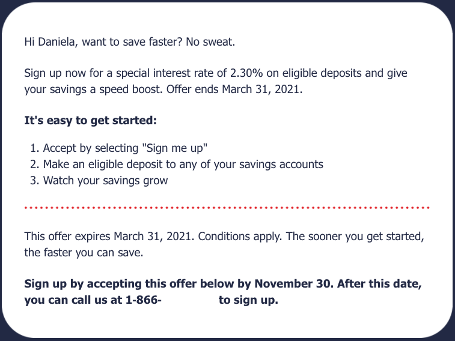
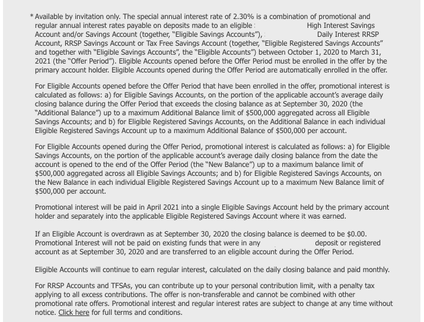

Taking a break from programming topics to blog about personal finance today. Wanted to share an experience I had recently with one of the banks in Canada that left me feeling deceived, even though strictly speaking, they did nothing wrong.

## Background

First, a little background. If there’s one thing the Covid era has taught us, it’s the importance of having a well stocked emergency fund.  Readers familiar with basic personal finance may want to skip this section and jump ahead to “The Incident”, otherwise, read on while I explain the concept.

An emergency fund is basically a pile of cash that you sock away somewhere safe but that can be accessed easily and quickly, so that you have something to fall back on should an emergency happen. For example, being able to pay for an unexpected car repair when you rely on your car to get to work, or paying to replace the hot water tank should it break down.

Financial experts say you should have approximately 3 - 6 months worth of expenses saved up in an emergency fund. This can be calculated by tracking all your expenses for a few months including fixed expenses such as mortgage/rent, car payments, property taxes, utilities, cell phone/internet, etc, and variable expenses such as groceries, personal care, clothing, gas, restaurants, entertainment etc. (albeit, much less of the latter categories lately). Then take an average of your monthly expenses, multiply by either 3 or 6 and that’s how much you should have saved in an emergency fund.

<aside class="markdown-aside">
If you’re looking for an app to track your expenses and make recommendations on savings and an emergency fund, check out <a class="markdown-link" href="https://github.com/danielabar/tidysum">Tidysum</a>, a free, privacy-focused command line tool I wrote.
</aside>

I would argue that given the effects of this pandemic, a 1 year or slightly larger emergency fund is more appropriate to provide breathing room in case of a job loss where the entire industry is affected. This probably won’t be the last pandemic we face and who knows what other catastrophes may occur so better safe than sorry.

Ok so we’ve established the need for an emergency fund. Next question is - where should it be located? Keeping that amount of physical cash in your home is not a good idea because it could be lost due to theft or a fire. And physical cash loses its value due to inflation (has been running ~2% in Canada), so you’re literally losing money by holding on to physical cash.

On the other extreme, to get an inflation beating return, the most common option these days is the stock market, HOWEVER DO NOT PUT YOUR EMERGENCY FUND THERE! The stock market is too volatile for this purpose. Financial experts say don’t put any money in the stock market that you might need in less than 10 years.

So basically that leaves savings accounts at banks. Unfortunately with interest rates being near 0 these days, it’s difficult to get much return on your cash. The best consistent rate in Canada has been 1.5% from one of the online-only banks. So you’re still losing money to inflation but its better than the big chartered banks that are paying at most 0.1% (at the time of this writing).

## The Incident

Which brings me to the incident that led to writing this blog post. Given the strong need to have an emergency fund (ideally not losing money to inflation), low interest rate environment and knowing that banks pay almost nothing in interest, imagine my delight to receive this offer from one of the major banks. The email subject line was “Ready, set, save with 2.30% interest”

Well this sounds just wonderful, even if it is only for a limited time (at the time I received it, it would have provided 6 months of the high interest). So naturally I called to sign up. Keep in mind this is from a large, chartered and reputable bank in Canada. Also I’d had some accounts with them in the past, already had their call centre number from having called them before, and confirmed it was the same number as shown in the promotion. So there was no concern about this being a scam.

The sign up process was straightforward, my account was opened in minutes, and I was able to transfer funds from another institution where I was keeping my emergency fund previously, and only earning 1.5%, looking forward to end of the month to start seeing the 2.3% build up (with the understanding that this is an annualized rate).

But when month end came and went, was very surprised to see the interest only being a tiny portion of the promised 2.3%. Figuring there must have been a mistake and the promotion hadn’t yet been applied to my account, I called them to determine the issue.

And this is where things went sideways. I was told that the 2.3% is a combination of of the regular rate of 0.1% and a promotional rate of 2.2%, but that during the promotional period, only the 0.1% would be paid out monthly (and compounded). The 2.2% would only be paid out one-time, after the offer period had finished, and would be based on the average daily balance during the offer period.

In other words, the 2.2% would NOT be compounded, the way every other interest rate on savings accounts (promotional or otherwise) is calculated and how my intuition had told me this would work. Suddenly this “wonderful” offer was not looking so good, in fact, it was looking more like a trick. When I pointed this out I was told that all this was explained in the terms and conditions.

Luckily I kept the promotional email. It turns out the the terms and conditions are displayed in tiny font below the fold of the catchy promotional material (bank name has been blanked out as it’s not the point of this post to call out any particular institution):

And indeed, zooming way in reveals some surprising details about how the interest is calculated. I’ve plucked out the relevant portions below:

“The special annual interest rate of 2.30% is a combination of promotional and regular annual interest rates…”

“Promotional interest is calculated as follows:… on the portion of the applicable account’s average daily closing balance from the date the account is opened to the end of the Offer Period…”

“Promotional interest will be paid in Ap‌ril 2021 into a single Eligible Savings Account”

“Eligible Accounts will continue to earn regular interest, calculated on the daily closing balance and paid monthly.”

Ok so technically and legally speaking, there’s nothing wrong here, the interest is being paid out exactly as per the terms. So why am I left with a bad feeling? Well the problem is how most ordinary people understand how interest on savings accounts work, based on their experiences at other banks. It’s generally understood that the posted regular or promotional rate will compound on a monthly basis. This is why people open savings account to get the “magic” of compounding, however small the interest rate may be.

It is not at all intuitive that an interest rate would only get calculated one-time and not compound. This isn’t even hinted at in the main promotional material. How many people are actually going to zoom in on the tiny font in the terms and conditions to decipher that it will only be a one-time payment and not compounded? Even if you read the terms closely, it’s not obvious that it’s a one-time non-compounding payment because these words are not used. It’s like they went out of their way to not use these obvious words that might set off alarm bells in customers heads that maybe this deal isn’t as good as it sounds.

I can almost imagine the marketing team (or whoever comes up with these promotions at banks) sitting around a zoom meeting coming up with this idea. Something like…

“How can we get Canadians to withdraw their funds from our online-only high interest competitors and get them to come to our bank?”

“I know let’s offer a slightly higher rate, maybe 1.6%”

“Nah, that would increase our costs but it’s too small to get people out of their natural inertia”

“How about a really high rate that they wouldn’t be able to ignore, like 2.3%?”

“Yeah that would work but would affect our bottom line too much”

“I’ve got an idea, how about we offer the 2.3% but don’t compound it, just make it a one-time payment at the end of the promotional period”

“Would anyone go for that?”

“They would if we present it like a regular interest rate, then bury the details in the tiny point font terms and conditions that no one ever reads”

“Brilliant, we have a winner!”

Of course that’s all just a dramatization and my possibly over-active imagination of how bank meetings go.

## Conclusion

So what’s the moral of the story here? Could I have been more vigilant about reading the terms? Sure, although I’m not sure that the wording would have overridden my strong intuition about how interest works on savings accounts, based on all my past experience. Is there any legal case to be made that the bank is in the wrong here? Nope, the terms are very clear about how it works.

However, people don’t make their impressions based on legalities and technicalities. My perception is that I’ve been tricked, even if legally everything is above board. That perception becomes reality, that I can no longer trust this institution and would not want to do business with them again. It’s sad that a Canadian bank would resort to a tactic like this to gain more customers. I hope other institutions won’t attempt to emulate this, and that with this post, I’ve increased some awareness of this issue.

## Related Content

The following section contains affiliate links for related content you may find useful. I get a small commission from purchases which helps me maintain this site.

This book [Your Money or Your Life](https://amzn.to/2Q4UboX), completely changed how I view money. Never mind all the economists definitions like money is a "unit of account" or a "store of value". This book will teach you the only definition of money that matters in your life.

Even if you love your job and could never imagine quitting, [Quit Like A Millionaire](https://amzn.to/3hu0xcQ) will teach you how to amass enough wealth to live life on your own terms. Equal parts entertaining and educational, this is one of the most enjoyable personal finance books I have read.

Looking for more information on Canadian taxes? You might like this book: [The Grumpy Accountant: One Fed-Up Tax Pro's Practical Plan to Fix Canada's Senselessly Complicated Tax System](https://amzn.to/3aaj4qh).

A book I really enjoyed is [The Psychology of Money: Timeless lessons on wealth, greed, and happiness](https://amzn.to/2Q7BIrT). In it you'll learn that being successful with money depends way more on how you behave than being a so-called financial expert.