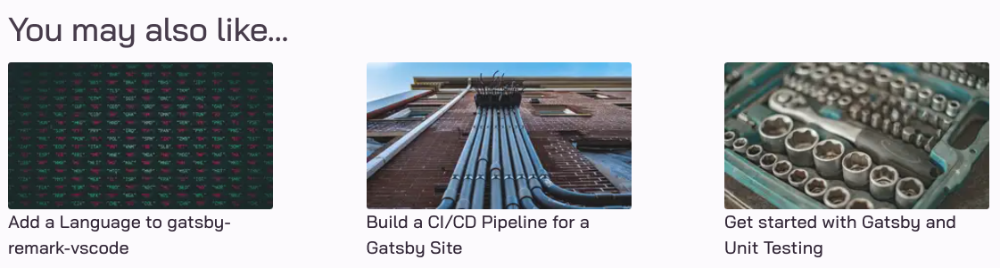

This post will explain how to add a Related Posts feature to a Gatsby blog. The idea is to add a small number of links at the bottom of a post page, to other posts that the reader may be interested in. The display of these could be just simple text links, or include a small version of the feature photo and the title. For example, at the end of a post about Gatsby, display a few other articles about Gatsby like this:



## Existing Post Page

Before getting into adding Related Posts, let's briefly look at how a typical post page is built with Gatsby using the [gatsby-transformer-remark](https://www.npmjs.com/package/gatsby-transformer-remark) plugin. If you already have a solid understanding of Gatsby and the remark plugin, feel free to jump ahead to the [related posts](../gatsby-related-posts#related-posts) section.

This plugin allows you to write posts in markdown, and then exposes fields that it generates such as `html` and `excerpt` in the GraphQL server during development, under the node type `allMarkdownRemark`. It also exposes any frontmatter fields you add at the top of your markdown (content delimited by `--` symbols).

For example, given the following project layout:

```
.
├── README.md
├── gatsby-config.js
├── gatsby-node.js
├── package.json
├── src
│   ├── components
│   │   ├── article.js
│   │   ├── footer.js
│   │   ├── header.js
│   │   ├── layout.js
│   ├── markdown
│   │   ├── here-is-a-post.md
│   │   ├── another-post.md
│   │   ├── yet-another-post.md
│   ├── pages
│   │   ├── index.js
│   ├── templates
│   │   ├── post.js
```

And some markdown content in `markdown/here-is-a-post.md`:

```markdown
---
title: "Here is an example markdown post"
description: "This is a sample description for the post."
date: "2022-02-15"
category: "example"
featuredImage: "../images/example.jpg"
---

And here is the sample post. Lorem ipsum dolor sit amet, consectetur adipiscing elit, sed do eiusmod tempor incididunt ut labore et dolore magna aliqua. In nulla posuere sollicitudin aliquam ultrices sagittis orci a scelerisque.
```

The following GraphQL query would find this post and return all its data. Notice that all the fields in the markdown frontmatter can be exposed from the schema via `edges -> node -> frontmatter`. To execute queries in Gatsby during development, navigate to `http://localhost:8000/___graphql`:

```graphql
{
  allMarkdownRemark(
    # limit results to only the example post
    filter: { frontmatter: { title: { in: "Here is an example markdown post" } } }
  ) {
    edges {
      node {
        # These fields come from the top of markdown/here-is-a-post.md
        frontmatter {
          title
          description
          category
          date
          # Images are a little more complicated, making use of gatsby-plugin-sharp and gatsby-transformer-sharp plugins.
          featuredImage {
            childImageSharp {
              gatsbyImageData(width: 900, layout: CONSTRAINED)
            }
          }
        }
        # This is generated by the gatsby-transformer-remark plugin,
        # which converts the markdown content to html.
        html
      }
    }
  }
}
```

And here is the resulting JSON response from the GraphQL server. Notice that it pretty much mirrors the structure of the query, with the exception of being wrapped in a `data` object and the `featuredImage` field containing more details for rendering responsive images:

```json
{
  "data": {
    "allMarkdownRemark": {
      "edges": [
        {
          "node": {
            "frontmatter": {
              "title": "Here is an example markdown post",
              "description": "This is a sample description for the post.",
              "category": "example",
              "date": "2022-02-15",
              "featuredImage": {
                "childImageSharp": {
                  "gatsbyImageData": {
                    "layout": "constrained",
                    "images": {
                      "sources": [
                        {
                          "srcSet": "/static/67f.../71a10/example.webp 225w,\n/static/67f.../901f1/example.webp 450w,\n/static/67f.../5acd1/example.webp 900w",
                          "type": "image/webp",
                          "sizes": "(min-width: 900px) 900px, 100vw"
                        }
                      ]
                    },
                    "width": 900,
                    "height": 599
                  }
                }
              }
            },
            "html": "<p>And here is the sample post. Lorem ipsum dolor sit amet, consectetur adipiscing elit, sed do eiusmod tempor incididunt ut labore et dolore magna aliqua. In nulla posuere sollicitudin aliquam ultrices sagittis orci a scelerisque.</p>..."
          }
        }
      ]
    }
  }
}
```

<aside class="markdown-aside">
While it's easy to understand how the frontmatter text fields are populated, the contents of featuredImage are more complicated. This is generated by some additional plugins that make the job of generating responsive images with Gatsby relatively easy. A full discussion of this topic is outside the scope of this post, but if you'd like to learn more about this, see the Gatsby docs on <a class="markdown-link" href="https://www.gatsbyjs.com/docs/working-with-images/">Working with Images</a>.
</aside>

### Retrieve all Posts

We've just seen an example GraphQL query and JSON response to retrieve a single post. But for building a blog, all the posts must be retrieved, and then fed one at a time to the post template for rendering. This is performed by `gatsby-node.js`, a file that sits at the project root. It should export a `createPages` function, which the Gatsby build process will invoke:

```js
// gatsby-node.js

exports.createPages = ({ graphql, actions }) => {
  // A Gatsby function which will be used to create the post pages from GraphQL data and a template.
  const { createPage } = actions

  // This gets ALL markdown posts, sorting by most recent date first.
  // We only need to retrieve the slug so that the post template can use this
  // to lookup all the other content from in a page query (see next section).
  return new Promise(resolve => {
    graphql(`
      {
        allMarkdownRemark(sort: { fields: [frontmatter___date], order: DESC }) {
          edges {
            node {
              fields {
                slug
              }
            }
          }
        }
      }
    `).then(result => {
      result.data.allMarkdownRemark.edges.forEach(({ node }) => {
        createPage({
          path: node.fields.slug,
          component: path.resolve("./src/templates/post.js"),
          // any field provided here in context will be available to the post.js template
          // to be used in a page query to retrieve further details about this post.
          context: {
            slug: node.fields.slug,
          },
        })
      })
      resolve()
    })
  })
}
```

### Post Template

The Post template, which is a React component, receives this JSON data as props and renders it. It does so by running a GraphQL page query at build time, using the `slug` field  provided to it by the `createPages` function implemented in `gatsby-node.js`. This query is doing the GraphQL equivalent of something like this SQL statement: `SELECT html, title, date... FROM markdown WHERE slug = $slug`.

Somewhat confusingly, the page query is written *after* the rendering code in the template. I'm going to focus in on just the query, and come back to the rendering code in a bit:

```js
// src/templates/post.js

const Post = props => {
  return (
    ...
  )
}
export default Post

// This is called once for each markdown file from gatsby-node.js.
// The $slug paramter is available because of the context that was
// passed in to the createPage function in gatsby-node.js.
export const query = graphql`
  query($slug: String!) {
    markdownRemark(fields: { slug: { eq: $slug } }) {
      html
      frontmatter {
        title
        date
        featuredImage {
          childImageSharp {
            gatsbyImageData(width: 900, layout: CONSTRAINED)
          }
        }
      }
      fields {
        slug
      }
    }
  }
`
```

Finally, the results of the page query are exposed to the Post component in its `props` via the `data` property. For example, the markdown html is available at `props.data.markdownRemark.html`, whereas the title is available at `props.data.markdownRemark.frontmatter.title`. The Post component extracts these properties and renders them using React.

For example, this Post template renders the title, publish date, a featured image and html content generated from the markdown:

```js
// src/templates/post.js
import React from "react"
import { graphql } from "gatsby"
import { GatsbyImage } from "gatsby-plugin-image"
import Layout from "../components/layout"

const Post = props => {
  const markdown = props.data.markdownRemark
  const title = markdown.frontmatter.title
  const publishedDate = markdown.frontmatter.date
  const featuredImgFluid = markdown.frontmatter.featuredImage.childImageSharp.gatsbyImageData
  const content = markdown.html

  return (
    <Layout>
      <article>
        <h1>{title}</h1>
        <div>Published {publishedDate}</div>
        <GatsbyImage image={featuredImgFluid} />
        <div dangerouslySetInnerHTML={{ __html: content }} />
      </article>
    </Layout>
  )
}
export default Post

export const query = graphql`
  query($slug: String!) {
    ...
  }
`
```

Now that we have an understanding of how a basic post page gets rendered from Markdown content in Gatsby, we can move on to enhancing this process with a Related Posts feature.

## Related Posts

TBD:
* Maybe: aside like "If that seems like a lot of work to generate some blog pages, it is! If you're looking to start a blog and just want to hit the ground writing without "programming your blog", Gatsby may not be the optimal choice for this, consider platforms like Medium or dev.to. A full discussion of pros/cons of various blogging platforms could probably be the topic of a blog post.
* section: Adding related posts (note: frontmatter fields are not constrained, you can add anything you like and its available in the schema)
  * update markdown frontmatter with list of related posts (nested bulleted list generates array)
  * update post template query
  * update post template JSX to extract the related posts data from the query results and pass to a new RelatedPosts component (covered in next section)
  * new RelatedPosts component to iterate over each related post and display image and title, linking to slug.