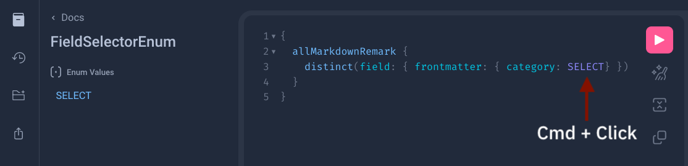

If you're building a website or web application with Gatsby, you might come across a situation where you need to perform a distinct query. This is a query that only returns unique results, eliminating any duplicates. This post will show how to do a distinct query in Gatsby 5 (which is the latest version at the time of this writing) using GraphQL.

<aside class="markdown-aside">
This post assumes that the reader has some basic knowledge of building websites with Gatsby, including familiarity with GraphQL queries. If you're new to Gatsby, or need a refresher on GraphQL, there are plenty of resources available to help you get up to speed. The official <a class="markdown-link" href="https://www.gatsbyjs.com/docs/">documentation</a> is a great place to start. Pluralsight also has some <a class="markdown-link" href="https://www.pluralsight.com/paths/building-static-sites-with-gatsbyjs">courses</a>, although at the time of this writing, they're mostly for an older version.
</aside>

## Example

A common use case for Gatsby is to generate a static site where the content for the pages comes from markdown files. The [gatsby-transformer-remark](https://www.npmjs.com/package/gatsby-transformer-remark) plugin transforms markdown files into HTML and creates nodes for them in Gatsby's GraphQL data layer. For instance, suppose we have a fitness site and the  `src` directory contains markdown files for each workout routine as follows:

```
src
├── components
│   ├── footer.js
│   ├── header.js
│   ├── layout.js
├── markdown
│   ├── advanced-lifting-techniques.md
│   ├── cardio-basics.md
│   ├── strength-training-tips-for-beginners.md
│   ├── yoga-for-flexibility.md
│   ├── ...
├── pages
│   ├── about.js
│   ├── index.js
└── templates
    ├── post.js
```

Here are some example markdown files with title, description, publish date, and category in the frontmatter, and a sample body content:

```markdown
---
title: "Advanced Lifting Techniques"
description: "Learn some advanced techniques to take your lifting to the next level."
date: "2023-01-15"
category: "strength"
---
If you've been lifting weights for a while and want to take your workout to the next level,
you'll need to start incorporating some advanced techniques...
```

```markdown
---
title: "Cardio Basics"
description: "Get back to the basics with a beginner's guide to cardio workouts."
date: "2023-03-22"
category: "cardio"
---
If you're new to working out or just looking to get back into shape,
cardio is a great place to start...
```

```markdown
---
title: "Strength Training Tips for Beginners"
description: "Get started with strength training and build a foundation for a healthier life."
date: "2023-07-16"
category: "strength"
---
Strength training is an effective way to build muscle,
increase bone density, and improve overall health...
```

```markdown
---
title: "Yoga for Flexibility"
description: "Improve your flexibility and reduce stress with this beginner's guide to yoga."
date: "2023-09-02"
category: "yoga"
---
Yoga is a good way to improve flexibility, reduce stress,
and promote overall wellness...
```

Now we would like to get a list of all the categories, perhaps to generate a list of category tags that readers could click on to view articles for that category.

## Solution

Here is the GraphQL query to get a list of distinct categories. The key here is to use the `distinct` *aggregation resolver*, and within that, specify the field to extract unique values for. The nesting of `category` within `frontmatter` matches how the nodes are structured when using the [gatsby-transformer-remark](https://www.npmjs.com/package/gatsby-transformer-remark) plugin. The `SELECT` after specifying the `category` field seems a little odd, more on this later:

```graphql
{
  allMarkdownRemark {
    distinct(field: { frontmatter: { category: SELECT} })
  }
}
```

<aside class="markdown-aside">
An aggregation resolver is a type of resolver function that aggregates data from multiple sources into a single field on a GraphQL node. In addition to the distinct aggregation, Gatsby also supports group, min, max, and sum. I couldn't find documentation about these built-in resolvers but here's a <a class="markdown-link" href="https://github.com/gatsbyjs/gatsby/pull/30789">PR</a> where some of them got introduced. It's also possible to create your own <a class="markdown-link" href="https://www.gatsbyjs.com/docs/reference/graphql-data-layer/schema-customization/#createresolvers-api">custom resolvers</a>.
</aside>

Running the above query will produce output like this:

```json
{
  "data": {
    "allMarkdownRemark": {
      "distinct": [
        "strength",
        "cardio",
        "yoga"
      ]
    }
  },
  "extensions": {}
}
```

To have the categories sorted alphabetically in ascending order, pass in the `sort` option to the query field `allMarkdownRemark`. Use `DESC` instead of `ASC` for reverse alphabetic order:

```graphql
{
  allMarkdownRemark(
    sort: {frontmatter: {category: ASC}}
  ) {
    distinct(field: { frontmatter: { category: SELECT} })
  }
}
```

If the markdown files are located in different directories such as `/src/markdown/fitness` and `/src/markdown/recipes` and you only want the distinct categories for the `fitness` articles, pass the `filter` option to the query field. Within that, specify the field that should be filtered on, in this case, `fileAbsolutePath`. Then use the `regex` filter operator to limit the results to only markdown files that are located in a certain directory:

```graphql
{
  allMarkdownRemark(
    filter: { fileAbsolutePath: { regex: "/src/markdown/fitness/" } }
    sort: {frontmatter: {category: ASC}}
  ) {
    distinct(field: { frontmatter: { category: SELECT} })
  }
}
```

For more filter options and how they can be combined, see the [Gatsby GraphQL](https://www.gatsbyjs.com/docs/graphql-reference/#filter) docs.

If you just needed to find the solution quickly, you can copy paste the above and move on. But if you're curious as to how I found it when regular searching failed, read on.

## Finding The Solution

Although the query seems straightforward enough, finding the correct syntax was surprisingly difficult. The reason is the aggregation syntax has changed from Gatsby v4 to Gatsby v5. In my search for the correct syntax, I tried both Duck Duck Go (my default search engine) and Google (my fallback option), but both returned either invalid syntax or links to official Gatsby docs with no mention of the "distinct" keyword. Here is the query that was turning up from web search:

```graphql
# OLD GATSBY V4 SYNTAX - DO NOT USE ON GATSBY V5
{
  allMarkdownRemark {
    distinct(field: frontmatter___category)
  }
}
```

Running the above will result in an error:

```json
{
  "errors": [
    {
      "message": "Expected value of type \"MarkdownRemarkFieldSelector!\", found frontmatter___category.",
      "locations": [
        {
          "line": 3,
          "column": 21
        }
      ]
    }
  ]
}
```

### How About AI?

I also asked ChatGPT but it returned the same invalid syntax. When told about the error, ChatGPT suggested this variation which also does not work:

```graphql
# ALSO INCORRECT - DO NOT USE!
{
  allMarkdownRemark {
    distinct(field: frontmatter { category })
  }
}
```

Running the above results in a syntax error:

```json
{
  "errors": [
    {
      "message": "Syntax Error: Expected Name, found \"{\".",
      "locations": [
        {
          "line": 3,
          "column": 33
        }
      ]
    }
  ]
}
```

When I told ChatGPT this solution was also not working, it responded with "I apologize, the correct syntax is...", and then proceeded to provide the first "solution" that I had already told it was incorrect `distinct(field: frontmatter___category)`. When I pointed this out it apologized again and then gave me the second incorrect "solution" `distinct(field: frontmatter { category })`. It was literally stuck in a loop apologizing and alternating between incorrect solutions. So our engineering jobs are safe for now.

### Dig Into The Source

A useful technique when web search fails is to search in the source code. Since Gatsby is open source and hosted on Github, the source is easily accessible. I started on the [Gatsby repo on Github](https://github.com/gatsbyjs/gatsby) and entered `distinct` in the search box, then selected to search "In this repository" as follows:


A number of results were returned. One of the results was for a test with the description being `returns list of distinct values in a field` as shown below:


This seemed promising as that was exactly the problem I was trying to solve. Looking more closely at this [test](https://github.com/gatsbyjs/gatsby/blob/master/packages/gatsby/src/schema/__tests__/connection-input-fields.js#L177-L215), it defines a query that extracts distinct values from a number of fields. One of them is a frontmatter field which is what I was looking for - notice the field `blue` in this test:

```js
// Copied from: packages/gatsby/src/schema/__tests__/connection-input-fields.js
it(`returns list of distinct values in a field`, async () => {
  const result = await queryResult(
    makeNodes(),
    `
      {
        allTest {
          totalCount
          names: distinct(field: { name: SELECT })
          array: distinct(field: { anArray: SELECT })
          blue: distinct(field: { frontmatter: { blue: SELECT }})
          dates: distinct(field: { dateArray: SELECT })
          # Only one node has this field
          circle: distinct(field: { frontmatter: { circle: SELECT }})
          nestedField: distinct(field: { anotherKey:{ withANested:{ nestedKey: SELECT }}})
        }
      }
    `
  )

  expect(result.errors).not.toBeDefined()
  expect(result.data.allTest.names.length).toEqual(2)
  expect(result.data.allTest.names[0]).toEqual(`The Mad Max`)

  expect(result.data.allTest.array.length).toEqual(5)
  expect(result.data.allTest.array[0]).toEqual(`1`)

  expect(result.data.allTest.blue.length).toEqual(2)
  expect(result.data.allTest.blue[0]).toEqual(`100`)

  expect(result.data.allTest.circle.length).toEqual(1)
  expect(result.data.allTest.circle[0]).toEqual(`happy`)

  expect(result.data.allTest.dates[2]).toEqual(`2006-07-04T22:39:53.000Z`)
  expect(result.data.allTest.dates.length).toEqual(4)

  expect(result.data.allTest.nestedField.length).toEqual(2)
  expect(result.data.allTest.nestedField[0]).toEqual(`bar`)
  expect(result.data.allTest.nestedField[1]).toEqual(`foo`)
})
```

So to make the `distinct` query work requires specifying an object for the field rather than triple underscores, and the addition of `: SELECT` after specifying which field you want to extract distinct values for. Updating my query to the syntax shown in the rest resolved the issue.

### But Why?

I could have left it at that but got curious as to what this special word `SELECT` was doing and whether there were any other special values that could be specified in the query. In GraphiQL, the in-browser GraphQL IDE that's running on `http://localhost:8000/___graphql` when you run Gatsby in development mode, you can <kbd class="markdown-kbd">Cmd</kbd> + click on any text in the query to open the documentation. Doing this on the `SELECT` keyword revealed that its a `FieldSelectorEnum`:



Unfortunately there was no additional description of what this is or what other values are possible. So I searched for `FieldSelectorEnum` in the Gatsby source (same technique as before, searching with Github UI) and found it defined [here](https://github.com/gatsbyjs/gatsby/blob/master/packages/gatsby/src/schema/types/pagination.ts#L114-L125):

```js
// Copied from: packages/gatsby/src/schema/types/pagination.ts
leafInputComposer: schemaComposer.getOrCreateETC(
    `FieldSelectorEnum`,
    etc => {
      etc.setFields({
        // GraphQL spec doesn't allow using "true" (or "false" or "null") as enum values
        // so we "SELECT"
        SELECT: { value: `SELECT` },
      })
    }
  ),
  postfix: `FieldSelector`,
}).getTypeNonNull()
```

From the comment, it looks like it would have made more sense to have nothing specified, for example `distinct(field: frontmatter { category })` but the GraphQL spec doesn't allow this and that's why `SELECT` had to be added as in `distinct(field: frontmatter { category: SELECT })`. To see if I could get any more explanation about this, I clicked on the "Blame" button (in the Github UI, it shows up at the top of every source file) as follows:


This shows the commit messages for every line in the source file. For the section of code that defined `FieldSelectorEnum`, the commit message was: `feat: [v5 breaking change] change sort and aggregation fields API #36708`. In Github the `#` before a number makes it link to either an issue or a PR, so I clicked on #36708 and it led to this [PR](https://github.com/gatsbyjs/gatsby/pull/36708). The description for this PR indicates that it implements changes from a discussion titled [RFC: Change to sort and aggregation fields API #36242](https://github.com/gatsbyjs/gatsby/discussions/36242). This discussion explains the syntax change from the triple underscore format to the object format for sorting and aggregation and provides some examples of old vs new syntax. This change was done to improve performance. The examples provided are:

```graphql
# OLD SYNTAX
{
  allMarkdownRemark(sort: { fields: [frontmatter___date], order: DESC }) {
    nodes {
      ...fields
    }
  }
}

# NEW SYNTAX
{
  allMarkdownRemark(sort: { frontmatter: { date: DESC } }) {
    nodes {
      ...fields
    }
  }
}

# OLD
{
  allMarkdownRemark {
    distinct(field: frontmatter___category)
  }
}

# NEW
{
  allMarkdownRemark {
    distinct(field: { frontmatter: { category: SELECT } })
  }
}
```

For sorting, it makes sense that you would have to specify ASC or DESC, for example, but for distinct, there's nothing that really fits but the GraphQL forces "something" to go there so that's why `SELECT` is used.

## Conclusion

This post has covered how to write a GraphQL query for Gatsby v5 to extract distinct values for a given field. It has also covered options for sorting and limiting results to a particular directory where markdown files are located. Finally, it also covered a useful technique for getting answers to questions about open source projects when a web search doesn't turn up the answer.
