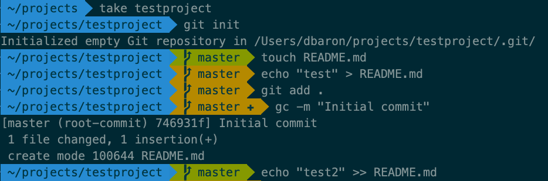
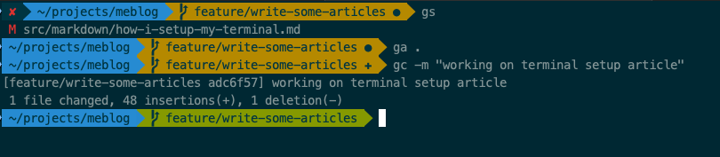

Have you ever seen a course, tutorial or colleague using their terminal and it looks something like this:



and wondered "how do they make it look like that"?

There's a lot of cool features about this setup, especially if you use [Git](https://git-scm.com/book/en/v2) version control, including git status information right in the prompt, and an eye-friendly color scheme that doesn't strain your vision looking at a screen all day. This post will walk you through step by step how to get your terminal looking this awesome.

## Step 1: Terminal
Start by installing [iTerm2](https://www.iterm2.com/). This is a replacement for the default terminal that comes installed with a Mac. It has a lot of flexibility for customizing colors, which will be needed for this setup, as well as many other cool [features](https://www.iterm2.com/features.html).

## Step 2: Shell
Next, install [Oh My Zsh](https://github.com/ohmyzsh/ohmyzsh). This will switch your shell from bash (usually the default on Macs) to Z shell. This has some improvements over bash including better tab completion and unified history search across all open tabs. Read more about Z shell on the [wiki page](https://en.wikipedia.org/wiki/Z_shell).

## Step 3: Fonts
Oh My Zsh adds a lot of additional utilities including plugins and themes. Speaking of themes, we'll be configuring the agnoster theme, and this requires some fonts. Go ahead and install the [Powerline fonts](https://github.com/powerline/fonts) from Github. The `install.sh` script will add all the fonts to the Font Book app on your Mac.

## Step 4: Configure iTerm2
Some changes are required to iTerm2 preferences to support the agnoster theme from Oh My Zsh. Launch iTerm2, then hit <kbd>Cmd</kbd> + <kbd>,</kbd> to open the Preferences panel.

Select the `Profiles` tab. Use the `+` button at the bottom of the Profile pane to add a new profile, and name it whatever you like. You can also modify the Default profile but it's safer to make a custom one, if things go horribly wrong you can always delete the custom one and go back to Default settings.

Now with your new custom profile selected, click `Other Actions` dropdown and select `Set as Default`. Then click on the `Colors` tab. From the `Color Presets` dropdown, select `Solarized Dark`.

Next, switch to the `Text` tab, and change both Font and Non-ASCII Font selections to any of the powerline fonts installed in the previous step. For example, I use `Meslo LG M DZ for Powerline` in 14pt, but you can choose any you like.

## Step 5: Configure Oh My Zsh
The final step is to configure your Oh My Zsh profile to set [agnoster](https://github.com/ohmyzsh/ohmyzsh/wiki/Themes#agnoster) theme. In bash, your profile is stored in `~/.bash_profile` or `~/.bashrc`. The equivalent file when using Oh My Zsh is `~/.zshrc`. Go ahead and open that in your favourite text editor, for example `vim ~/.zshrc` or `code ~/.zshrc`.

Now that the profile is open in a text editor,  change the `ZSH_THEME` environment variable to `agnoster` as shown below. This line should appear early in the file:

```
ZSH_THEME="agnoster"
```

Optionally, if you don't want to see your username in the terminal prompt, then also set the `DEFAULT_USER`  environment variable:

```
DEFAULT_USER=yourUserName
```

Also notice the plugins section, by default, the `git` plugin will be loaded, but you can add others. I keep mine relatively lightweight with just git and docker plugins:

```
plugins=(git docker)
```

## Step 6: Try it out

Back in iTerm2, reload your profile so the changes you just made will take effect:

```
source ~/.zshrc
```

Now your terminal should look something like this. Try it out in a directory with a git repo, notice how the prompt changes color and symbols based on the git status:



## Migrating from Bash

If you're a longtime Bash user, you'll probably have an assortment of aliases and profile customizations. To migrate, copy all aliases to the following file (create it if Oh My Zsh installation didn't already create it):

```
touch ~/.oh-my-zsh/custom/aliases.sh
# open aliases.sh in text editor and paste in all your aliases
```

For any other customizations, copy them over from your old profile `~/.bashrc` or `~/.bash_profile` to `~/.zshrc`.

## Next steps

* Check out the other Oh My Zsh [themes](https://github.com/ohmyzsh/ohmyzsh/wiki/Themes), there's a whole bunch.
* Learn more about iTerm2 [here](https://www.iterm2.com/documentation.html).
* Enjoy looking at your awesome terminal.

## Related Content

The following section contains affiliate links for related content you may find useful. I get a small commission from purchases which helps me maintain this site.

Looking to level up on Rails 6? You might like this book: [Agile Web Development with Rails 6](https://amzn.to/3wS8GNA).

Working on a large legacy code base? This book [Working Effectively with Legacy Code](https://amzn.to/3accwHF) is a must read.

Martin Fowler's [Refactoring: Improving the Design of Existing Code](https://amzn.to/2RFC0Xn) is also amazingly useful on this topic.

Is your organization introducing microservices? This book [Building Event-Driven Microservices: Leveraging Organizational Data at Scale](https://amzn.to/3uSxa87) is a fantastic resource on this topic.
