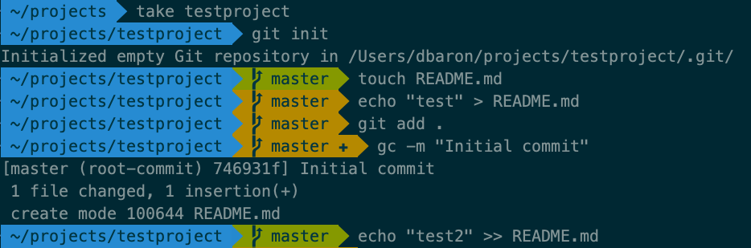

Have you ever seen a course, tutorial or colleague using their terminal and it looks something like this:

and wondered "how do they make it look like that"?

There's a lot of cool features about this setup, especially if you use [Git](https://git-scm.com/book/en/v2) version control, including git status information right in the prompt, and an eye-friendly color scheme that doesn't strain your vision looking at a screen all day.

TBC...