These days nearly all my engineering work runs through AI: analysis, design, coding, code review, debugging production issues, documentation.
At work my team is using Claude Enterprise, and I assumed that meant I didn't need to think about usage or limits. Then, mid-month, I got this error message from Claude in the middle of a session:

> You've hit your org's monthly spend limit · ask your admin to raise it at claude.ai/admin-settings/usage

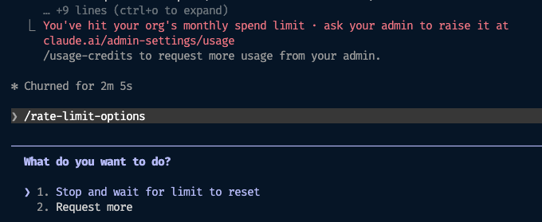

After posting in Slack to ask if anyone else had seen it, turns out several other engineers on the team had hit the exact same wall, right around the same point in the month. Someone pointed me to the individual usage meter on Claude desktop, which I hadn't known existed on Enterprise plans. Our workspace admin also gave everyone a bump in tokens, buying some breathing room. But now that I could see the meter and watch the burn rate, it was clear that even with the extra tokens, it wasn't going to last to the end of the month.

That's when I realized this wasn't sustainable. This post walks through the tools and techniques I've since put together, which have cut my token usage without giving up quality or slowing down.

## Watching Usage

**Usage Meter**

The first thing to know is you can check your usage directly. In Claude Desktop, click your name at the bottom left, then Settings, then Usage. Ever since that mid-month scare, I keep this open in a window off to the side. Here's what it looks like on my personal Pro plan but it's a similar process for Enterprise:

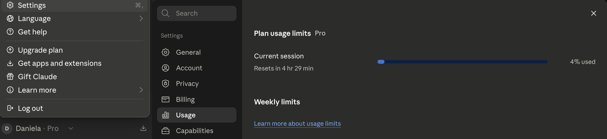

**Claude Monitor**

[Claude Code Usage Monitor](https://github.com/Maciek-roboblog/Claude-Code-Usage-Monitor) is a separate CLI tool that gives you a live read on burn rate within a rolling 5-hour session window. It's not connected to your account, so it's estimating, not reading real numbers. You can tell it what plan you're on (there's no Enterprise option, but there is a "custom" plan you can configure), and it'll show you things like a prediction for when you'll run out at your current rate. Treat it as a gut check on how fast you're going, not an exact figure. It aggregates across every active Claude Code session on the machine, so the burn rate and prediction reflect all of them combined, not just the session you're currently working in.

I keep this running in a terminal window in VS Code, beside my Claude Code terminal. Here's a sample screenshot:

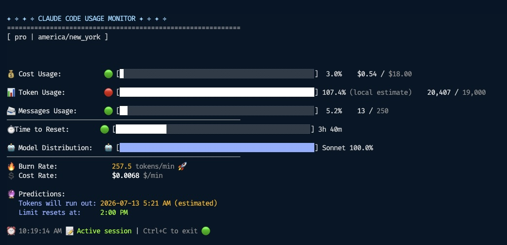

## Input tokens vs output tokens

Before getting into the tools to optimize usage, it helps to know that pricing is split into two buckets: input tokens (everything sent to the model: your prompt, the conversation history, any files or context loaded) and output tokens (what the model generates back). They're priced differently, with output tokens typically costing more per token than input.

## Tools

### rtk

[rtk](https://github.com/rtk-ai/rtk) (Rust Token Killer) saves input tokens. It acts as a proxy for common CLI commands. For example, when Claude runs a command like `git log`, instead of the raw output going straight into the conversation, `rtk` intercepts it, runs the real command, and returns a condensed version. That condensed version is what actually gets sent to the model.

To demonstrate, the screenshot below shows on the left side, the output of `git log` on one of my projects, and that's not even the entire output you can see there's more to page. On the right is the rtk version `rtk git log`, notice how much more condensed the output is.

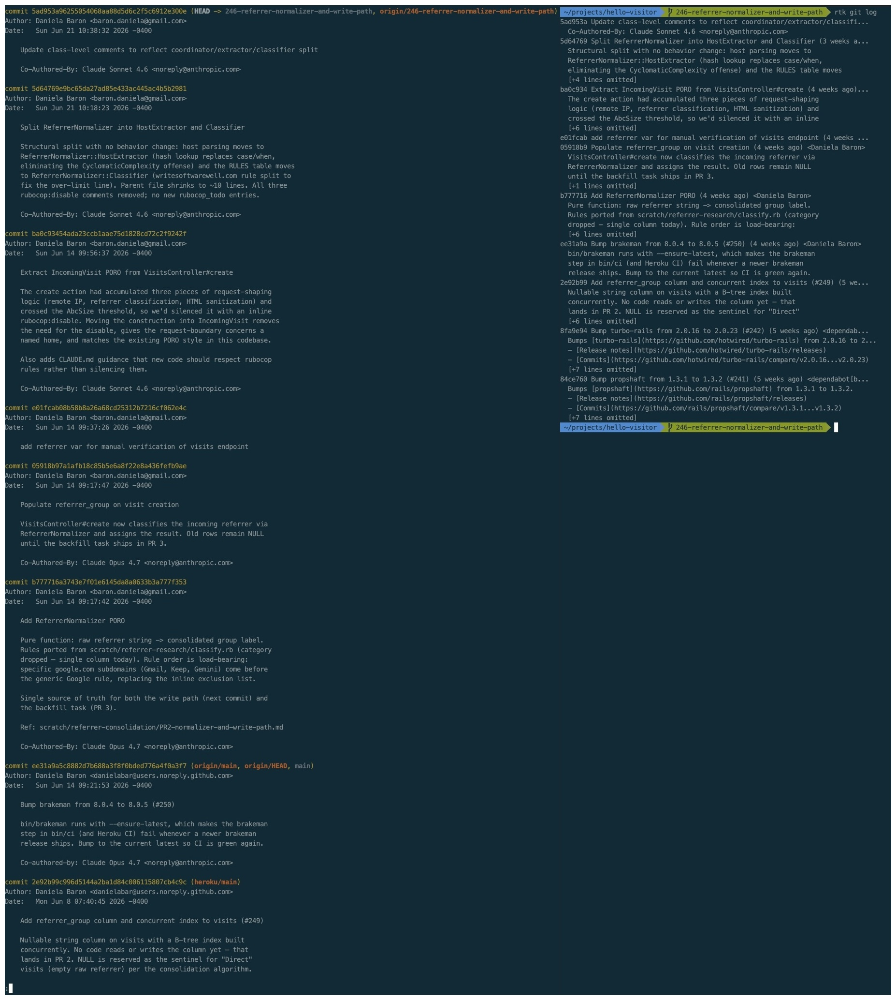

Multiply this by all the commands Claude typically runs for coding sessions and the savings add up significantly. You can see your savings with `rtk gain --daily`. For example:

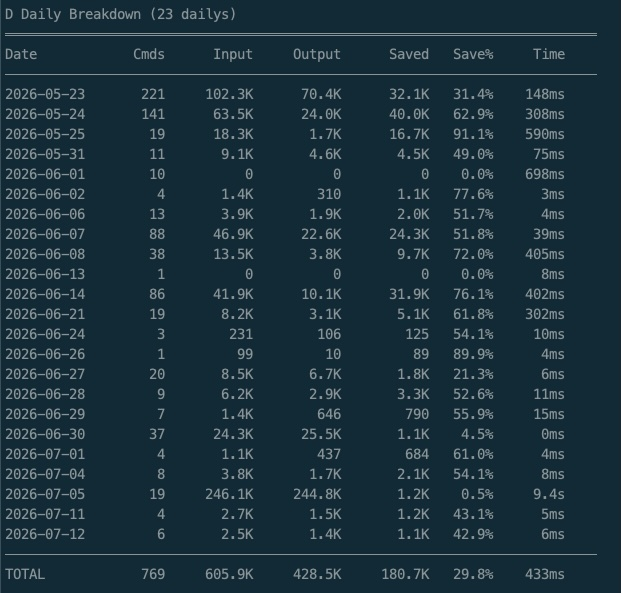

The "Input" and "Output" columns in the savings table refer to the size of the *command's* output before and after rtk compresses it, not input/output tokens in the model-pricing sense. The words overlap, but they mean different things here: "Output" in this table is the raw stdout from the shell command, which then becomes a smaller amount of input sent to Claude.

For example the table shows that on May 23, I ran 221 commands, which produced 102.3K of raw output. That's what would have been sent to the model had I not been using `rtk`. But `rtk` intercepted those and compressed the output so that only 70.4K was actually sent to the model. That yields a savings of 32.1K (31.4%) input tokens from running commands.

**How does Claude know to invoke rtk?**

If you're curious how Claude knows to use `rtk`: installing it adds a reference in your user-level `~/.claude/CLAUDE.md`, like this:

```
@RTK.md
```

That `@` reference tells Claude to load `RTK.md`, which has the actual instructions for how and when to route commands through rtk. It's set up this way so it's active on every conversation.

The install also generates `~/.claude/RTK.md` alongside it, containing the actual instructions. From my install, it looks like this:

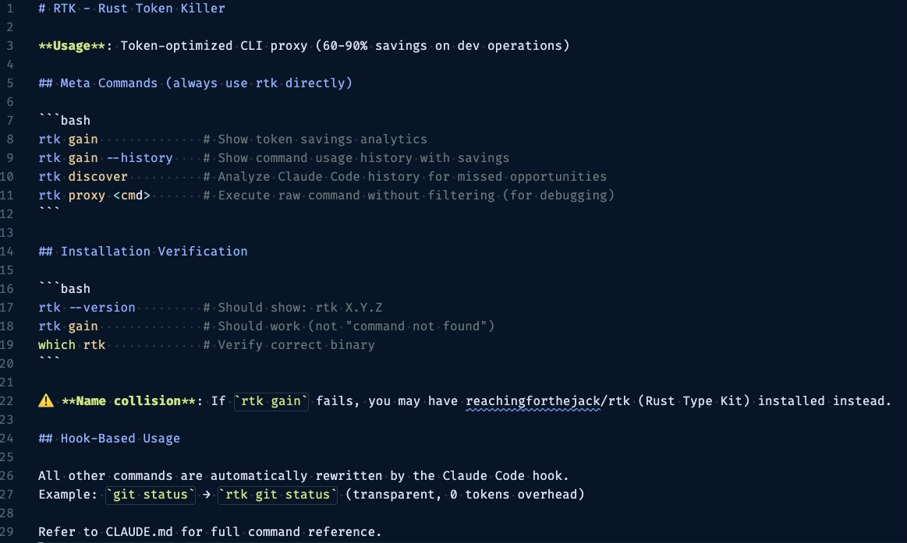

### Caveman

[Caveman](https://github.com/JuliusBrussee/caveman) saves output tokens. It changes how Claude responds by stripping out filler, hedging, and pleasantries, while keeping the technical content intact. It's not just shorter responses, it's a different shape. Caveman trades prose for fragments, bullets, and arrow chains (`→`), and front-loads file:line references instead of burying them in sentences. That structure carries more signal per token, not just fewer of them.

You can turn it off mid-conversation by starting a prompt with `normal mode` to compare the more verbose output that Claude otherwise responds with. The screenshot below shows the model responses side by side with and without caveman to the same prompt, asking how referrer normalization works on an analytics project. On the right side, non-caveman explains the flow in paragraphs. On the left, Caveman gives the same flow as a numbered list. Caveman comes in at ~424 tokens vs ~487 (13% savings), but the real gain is how much of each response is signal instead of connective words.

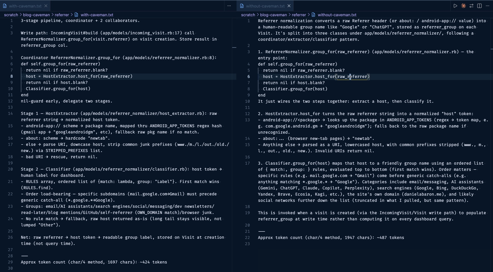

<aside class="markdown-aside">
The token counts at the bottom of each file aren't something caveman adds automatically. After getting both responses, I asked Claude to estimate the token count for each using the <a class="markdown-link" href="https://help.openai.com/en/articles/4936856-what-are-tokens-and-how-to-count-them">char 4 heuristic</a>, then appended those lines myself for the comparison.
</aside>

`/caveman-stats` gives you an estimate of output token savings for the current session. It's not re-running your actual commands against the model without caveman for a real comparison. Instead it estimates against benchmarks from its own repo. Treat the number as a rough estimate, not an exact accounting.

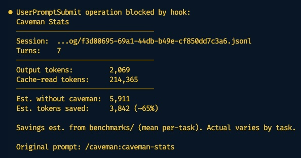

Caveman's repo claims up to 65% output token reduction across its test prompts (this post's 13% example is one data point, not the tool's ceiling), and cites research suggesting brevity-constrained answers can improve accuracy, not just cut cost.

**How does Claude know to invoke caveman?**

Caveman is installed as a Claude Code plugin. You don't have to remember to type `/caveman` every time you start a conversation because the plugin registers two hooks: a `SessionStart` hook that turns the mode on at the start of a session, and a `UserPromptSubmit` hook that re-applies it on every single message you send. Check your `~/.claude/plugins/marketplaces/caveman/.claude-plugin/plugin.json` for how the hooks are set up.

### CodeGraph

[CodeGraph](https://github.com/colbymchenry/codegraph) parses your codebase into a graph of nodes and edges (symbols and their relationships) stored in a local SQLite database. When you ask a structural question such as "what calls this function" or "what would break if I changed this", Claude can query the graph directly instead of grepping and reading through files to piece the answer together.

While this tool does not offer a token savings report, my understanding is that it helps because querying a database is a more direct path to the answer than searching and reading files. It also tends to be faster.

Here's an example of the model using CodeGraph to trace a "share plan" flow across controller, serializer, and nutrition-calculation code, narrowing in on the right entry point over several calls:

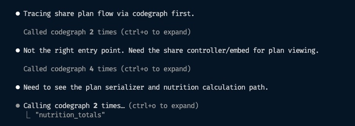

**How does Claude know to invoke codegraph?**

After running the `init` command, CodeGraph adds a gitignored `.codegraph/` directory to your project root containing `codegraph.db`. Since it's just a SQLite file, you can open it yourself with any SQLite tool. For example, I used DBeaver to open it and inspect the first few rows of the `nodes` table:

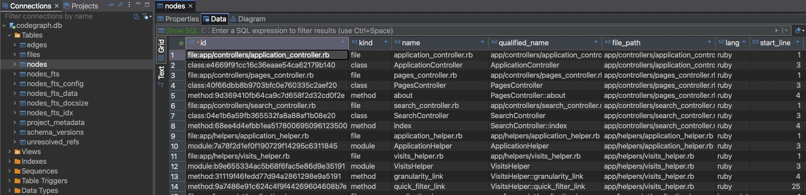

Like rtk, CodeGraph adds itself to your project-level `CLAUDE.md` so it's part of every session in that repo. It does this by adding the following line at the end of your `~/.claude/CLAUDE.md` file:

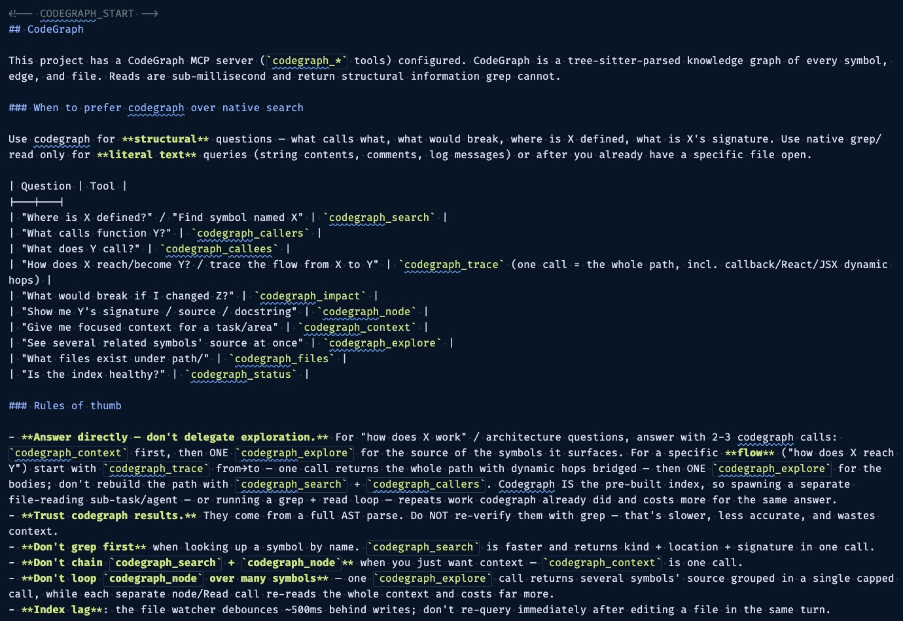

It also runs a background process that watches your files and keeps the graph in sync as you edit, so there's nothing to manually re-run. You can see it with `ps aux | grep -i codegraph | grep -v grep` (condensed here to just the CPU/MEM columns and command):

```
0.0  0.2  .../codegraph-darwin-arm64/node --liftoff-only .../codegraph.js serve --mcp
```

## Settings and habits

### Default to Sonnet

I used to default to Opus, and then try to remember to switch to Sonnet for simpler tasks, but kept forgetting and burned Opus-level tokens on stuff that didn't need it. Since then I've learned Sonnet is good enough for the majority of day-to-day work, so now it's my default, with effort set to `medium` rather than the default of `high`.

<aside class="markdown-aside">
With the newer Sonnet 5 model, effort defaults to <code>high</code>, and if you push it up further to <code>xhigh</code> or <code>max</code>, it can end up costing more than using Opus for that task. If you find yourself wanting extra-high or max effort regularly, that's probably a sign to switch models rather than crank the effort dial. More on the effort/cost tradeoff: <a class="markdown-link" href="https://www.digitalapplied.com/blog/claude-sonnet-5-opus-4-8-fable-5-when-to-use-which-2026#effort-matrix">Claude Sonnet 5, Opus 4.8, Fable 5: when to use which</a>.
</aside>

### Set advisor to Opus

Claude Code has an [advisor](https://code.claude.com/docs/en/advisor) feature. With it set to Opus, Sonnet handles the day-to-day and delegates Opus in when it hits something that genuinely needs the stronger model. Use `/advisor` to set this. Here's an example of Sonnet calling advisor mid-task, catching an untested edge case before wrapping up:

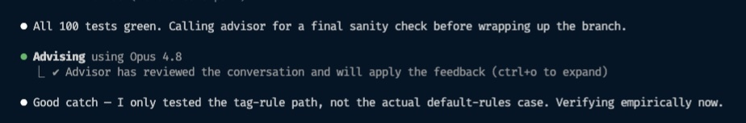

The effect is you get cheaper execution most of the time, since Sonnet is doing the bulk of the work, and you only pay Opus rates for the parts that actually need it.

### Scope your prompts

Not every question needs the full history of a task loaded in. If you're reviewing one piece of PR feedback on a single method, you don't need the entire planning discussion or every commit that led up to it. The more narrowly you can scope what's relevant to the actual question, the less gets sent as input on every turn of that conversation. This one takes some judgment. There isn't a command for it. It's more about noticing when you're carrying context that has nothing to do with what you're currently asking.

### Run /context periodically

`/context` shows you what's currently loaded into the context window during a session. This is worth checking on longer sessions because loaded context counts as input tokens, and it gets resent on every message in that conversation.

Running this at work is what led me to the biggest single win I found, covered next.

### Audit your CLAUDE.md

My team's project-level `CLAUDE.md` had accumulated a lot of `@` references over time: frontend docs, analytics how-tos, Stripe subscription details, third-party integration guides, and more. Each `@` reference tells Claude to load that file's contents into every session automatically. So even a conversation with nothing to do with subscriptions was loading the full subscriptions doc, on top of everything else, every single time.

I had Claude audit the file and help whittle it down. First pass: some of those `@` references turned out to be redundant, already covered by Rails-specific skills we had set up in the project. For the rest, the fix was to reword them from always-load references into conditional ones, something like *"When asked about subscriptions, read `path/to/subscriptions-doc.md`."* Claude only pulls that file in when it's actually relevant to the question being asked.

To make sure I wasn't losing fidelity in the process, I asked Claude to generate sample prompts that I could run after the file was trimmed down, to confirm it could still find the same details as before. I also had Claude check its own context size before and after the edits, then share those numbers in the PR description so my team could see the impact. Here's a snip from one of the PR's I submitted to edit the project level `CLAUDE.md` to reduce the amount of context it was consuming:

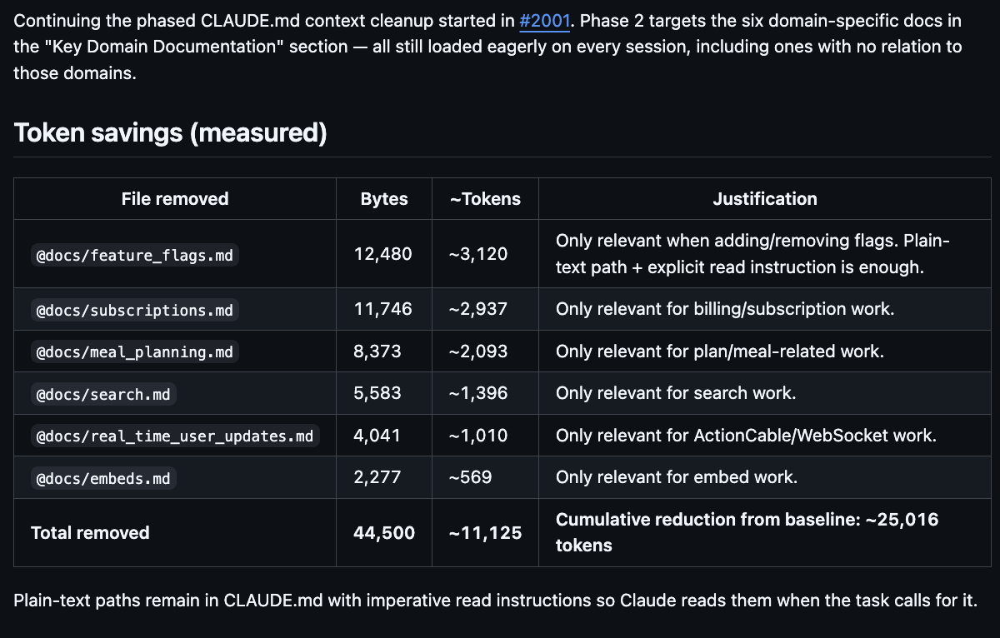

This one is definitely worth doing if you're on a team because it's not just your own savings. It multiplies by every team member, on every conversation, for as long as that file stays bloated.

### Clear often

Claude Code doesn't hold state between messages the way you might assume. The model is stateless, so the only way to maintain continuity in a conversation is to resend the entire thing each time you ask something new. A long-running session doesn't just accumulate context, every additional message costs more than the last, even if the new message itself is short.

`/clear` when you finish a task or switch to a new one. I'll also clear mid-task if I'm taking a different approach on the same problem, even before it's done, if the earlier back-and-forth isn't useful anymore.

**Nuance:** Prompt caching softens the resend cost somewhat. Cached portions of a conversation are cheaper to resend than fresh input, but there's still a (smaller) cost to writing to the cache, and cached entries expire after a TTL that varies by plan. The [documentation](https://code.claude.com/docs/en/prompt-caching) goes into more details, but the short version is that while caching helps, it doesn't eliminate the cost of a long conversation.

## Is it working?

At this point you may be wondering: Is all this effort actually worth it, is it really saving anything? In my case the answer is a resounding yes. The chart below (which you can find from the Claude Desktop usage view) shows my daily spend by model. There's a clear cluster of high-cost days around mid-June, before I started optimizing, followed by a noticeable drop in daily cost once I started applying these techniques:

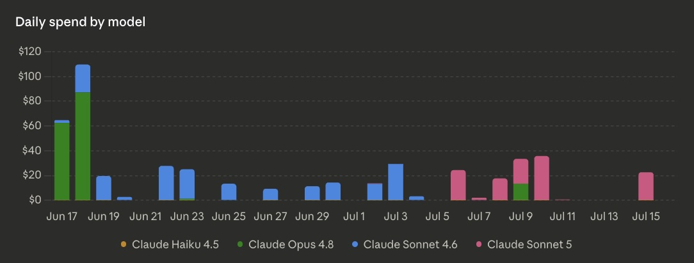

**Haven't tried yet**

A few more things on my radar that I haven't gotten to yet, but seem like they would also be helpful:

- [Headroom](https://github.com/headroomlabs-ai/headroom): another token-efficiency tool, similar territory to rtk and Caveman.
- [Tool Search Tool](https://www.anthropic.com/engineering/advanced-tool-use): Anthropic's own guidance on trimming token usage from tool definitions.
- `/checkup` (alias `/doctor`): flags further inefficiencies in your setup, like unused MCP servers and skills. See [this X post](https://x.com/bcherny/status/2074997570317779038) for further details.

## Summary

| Tool / technique | Saves | What it does |
|---|---|---|
| [rtk](https://github.com/rtk-ai/rtk) | Input tokens | Condenses CLI command output before it's sent to the model |
| [Caveman](https://github.com/JuliusBrussee/caveman) | Output tokens | Strips filler and pleasantries from responses, keeps technical content |
| [CodeGraph](https://github.com/colbymchenry/codegraph) | Likely both | Answers structural code questions via a graph database instead of grep/read |
| [Claude Monitor](https://github.com/Maciek-roboblog/Claude-Code-Usage-Monitor) | N/A (visibility only) | Live burn-rate gauge based on a 5-hour rolling window |
| Default to Sonnet + [advisor](https://code.claude.com/docs/en/advisor) → Opus | Both | Runs cheaper model by default, escalates to a stronger model only when needed |
| Scope your prompts | Input tokens | Avoid loading irrelevant history/context into a focused question |
| `/context` | Visibility | Shows what's currently loaded into the context window |
| Audit `CLAUDE.md` | Input tokens | Replace always-loaded `@` references with conditional, on-demand ones |
| `/clear` often | Input tokens | Avoids resending a long, no-longer-relevant conversation history |

Most of what's here I picked up from the [Code newsletter](https://codenewsletter.ai/subscribe). Sign up if you want more like this.

## Closing thoughts

If you're feeling exhausted reading this, I don't blame you. Learning to use AI tools effectively is already a big shift in how software engineering gets done. And just as that starts to feel normal, here comes another layer: "also, watch your spending," and a laundry list of further things to incorporate.


An analogy I keep coming back to: a high-efficiency washing machine uses less water by design. You don't buy a separate gadget and bolt it onto your washer to make it use less water. It's just built that way. I'm hoping token efficiency eventually gets baked into the AI tooling the same way, so we can spend less time watching meters and more time focused on shipping things that solve problems for the people using our software.

## TODO
- edit
