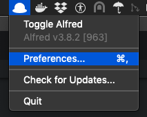
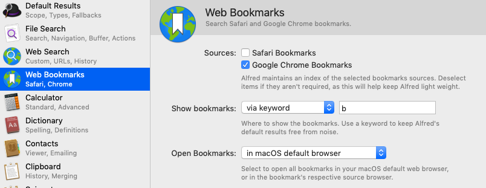
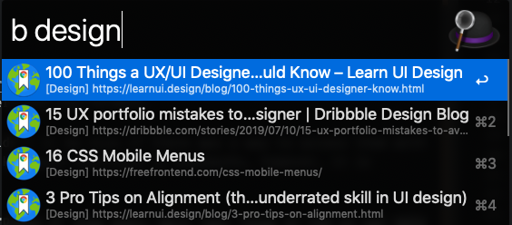

If you frequently use [Chrome bookmarks](https://support.google.com/chrome/answer/188842?co=GENIE.Platform%3DDesktop&hl=en), then you probably have long lists of them, possibly nested if they're organized with folders and sub-folders.

But it can be kind of a pain to always have to use the mouse to access them. Wouldn't it be nice if there was a way to access them with the keyboard? As far as I've researched, Chrome does not provide a way to assign keyboard shortcuts to bookmarks, however, it is possible to get that convenience using [Alfred](https://www.alfredapp.com/).

Alfred is a free productivity tool for Mac and has many features. But for the purposes of this post, will just focus on how it can make you more productive accessing your bookmarks.

## Configure Alfred
After Alfred is installed, click on the hat icon from the menu, and select `Preferences` as shown below:

Select `Web Bookmarks` from the left hand side of the Preferences pane, it will look something like this:

Check off `Google Chrome Bookmarks` (also check off `Safari Bookmarks` if you use it).

For `Show bookmarks`, there are two options - I use `via keyword`, with a single character `b`. This means that bookmark results will be shown after typing `b` in Alfred launcher, and they will be filtered to only the bookmarks. If you choose `in default results`, then the bookmark results will be mixed up with everything else such as list of applications.

For `Open bookmarks` option, I use default browser which on my system is Chrome. But if you're importing bookmarks from both Chrome and Safari, you may also choose `in bookmark's source browser` for this option.

## Launch Bookmarks
Now close Alfred preferences and try it out - launch Alfred via your configured hotkey (I leave mine at the default <kbd>alt</kbd> + <kbd>space</kbd>), type <kbd>b</kbd>, then start typing to see your bookmarks. When the one you want shows up, hit <kbd>Enter</kbd> to action it and it should launch in your browser of choice.

For example, I have a bookmark folder named "design", so typing <kbd>b</kbd> followed by first few letters of design brings up all these bookmarks:

Enjoy improved productivity.

## Related Content

The following section contains affiliate links for related content you may find useful. I get a small commission from purchases which helps me maintain this site.

Looking to level up on Rails 6? You might like this book: [Agile Web Development with Rails 6](https://amzn.to/3wS8GNA).

Working on a large legacy code base? This book [Working Effectively with Legacy Code](https://amzn.to/3accwHF) is a must read.

Martin Fowler's [Refactoring: Improving the Design of Existing Code](https://amzn.to/2RFC0Xn) is also amazingly useful on this topic.

Is your organization introducing microservices? This book [Building Event-Driven Microservices: Leveraging Organizational Data at Scale](https://amzn.to/3uSxa87) is a fantastic resource on this topic.
