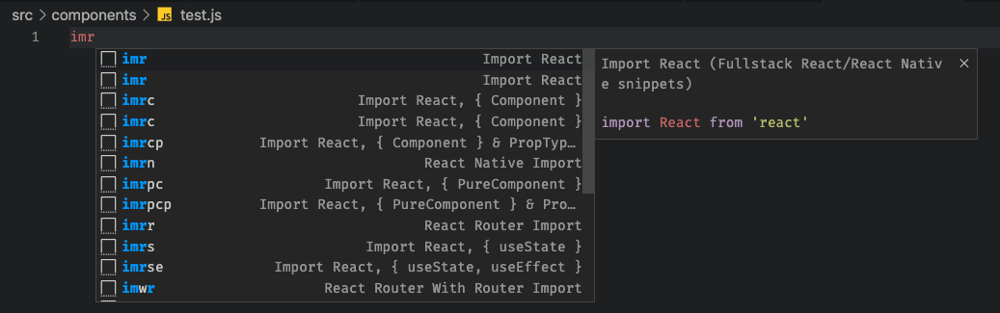
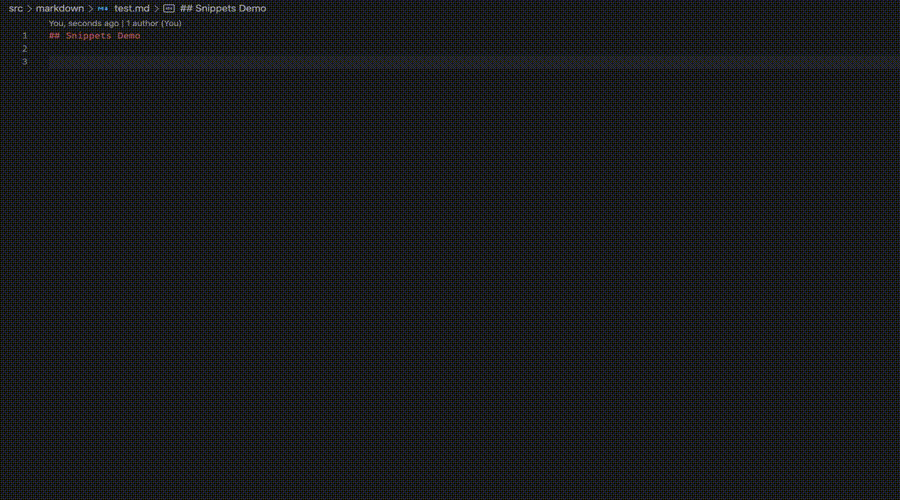
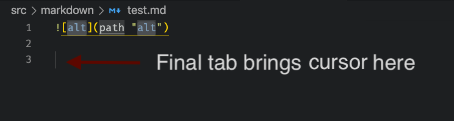

Have you ever found yourself repeating a certain pattern while coding over and over and thought there's got to be a faster way? For example, if you work with React and hooks, many component file will have this as the first line:

```js
import React, { useState, useEffect } from 'react';
```

Well there is a faster way to enter these common lines. For React specifically, install the [Simple React Snippets](https://marketplace.visualstudio.com/items?itemName=burkeholland.simple-react-snippets) VS Code extension. After it's installed, open a Javascript file and type `imr`. An intellisense menu will appear like this:



Keep typing until `imrse` is selected and hit enter. It will get replaced with:

```js
import React, { useState, useEffect } from 'react';
```

What's going on here is the Simple React Snippets extension has added a collection of frequently used React code sections as VS Code snippets. So what exactly are snippets? According to the VS Code docs:

> Code snippets are templates that make it easier to enter repeating code patterns, such as loops or conditional-statements.

But what if you have some other frequently typed lines that aren't related to React or any other framework? It could be something very specific to your code style or the project you're working on. In this case, there won't be an extension for this. The good news is VS Code allows you to add your own snippets. This post will walk you through how to do just that with an example.

Since I write a lot of documentation in markdown, I frequently want to insert a local image. The markdown for this is:

```markdown


For example:


```

Let's build a snippet for this so that it only requires typing `img`, then <kbd class="markdown-kbd">Ctrl</kbd> + <kbd class="markdown-kbd">Space</kbd> to bring up the snippet template, which can then be filled in to specify the alt text, local path to image and a title. The final result will work like this:



## Create a Snippet

To get started, select Code -> Preferences -> User Snippets from the VS Code menu.

From the "New Snippets" menu section, scroll down and select markdown.

This will open a new `markdown.json` file in your user directory, for example mine is at `~/Library/Application Support/Code/User/snippets/markdown.json`.

This file contains one json object. Each entry in this object represents a snippet. First add the `img` entry:

```json
{
  "img": {
    // snippet content will go here
  }
}
```

## Fill in Snippet Content

Next, tell VS Code what text you want to type in order to bring up the snippet in the intellisense menu. This is specified with the `prefix` property. In this case, we want this text to be `img`:

```json
{
  "img": {
    "prefix": "img"
  }
}
```

Now comes the tricky part, the `body` property is where you define the template for the snippet. This is the text that will be inserted into the document when you hit enter from the intellisense menu. Recall we want this to generate a markdown image with the ability to tab through and enter alt text, image path and image title. So we will enter `` as the `body`, but with some variables denoted in a special syntax to indicate the tab stops.

Tab stops are indicated with `$1`, `$2`, etc. But if you want the template to be more helpful and show a label (to make it clear what's supposed to go where), use the `${1:label}` syntax. Since we have 3 variables (alt text, path, and title), we will have 3 variables. Since the markdown image has double quotes for the title, and we're in a json file where quotes have a special meaning, these need to be escaped with `\`.

So the snippet is now:

```json
{
  "img": {
    "prefix": "img",
    "body": "",
  }
}
```

It looks confusing but take a closer look, and its the same familiar syntax of a markdown image ``, but with `alt` replaced with `${1:alt}`, `path` replaced with `${2:path}`, `title` replaced with `${3:title}`, and the double quotes surrounding `title` escaped by preceding each one with a backslash `\`.

Finally, add a `description` property that will be displayed in the intellisense menu when this snippet is highlighted. You may think it's obvious now but if you create a lot of snippets, the description will be helpful in reminding your future self what it does:

```json
{
  "img": {
    "prefix": "img",
    "body": "",
    "description": "Markdown image with alt text and title."
  }
}
```

## Try it out

Save the `markdown.json` file. Then open a new or existing markdown file in your project, type `img`, then then <kbd class="markdown-kbd">Ctrl</kbd> + <kbd class="markdown-kbd">Space</kbd> to bring up snippet suggestions and select your new custom snippet. It should replace `img` with the markdown template and you can tab through entering the image alt text, path to image and a title.

## Further Improvements

There's a few further improvements that can make this workflow even more efficient.

First, I tend to make the alt text and title be the same value, so it would be faster to have the `title` field automatically be filled in wth the value of whatever is entered into the `alt` field. This can be achieved by using the same variable number.

To do this, open the `markdown.json` snippets file and make the following change. If you've closed the file, go to Code -> Preferences -> User Snippets, and this time select Markdown from the Existing Snippets menu section (should be near the top).

```json
{
  "img": {
    "prefix": "img",
    "body": "",
    "description": "Markdown image with title"
  }
}
```

Notice this time the variable number `1` is being used both for `alt` and `title` fields. Save this and try to use the snippet again. This time as you're typing the alt text, notice the title is automatically populated with the same value as alt text.

One last improvement is the final tab position. Notice that after you fill out all the fields when using the snippet, if you press tab one more time, it moves your cursor to the end of the line.

Typically with a markdown image, it would be on a line by itself, so you have to hit enter twice to continue with the markdown editing. To save yourself from this extra work of having to hit enter twice, the snippet can be modified to use the special variable `$0` to indicate the final tab stop.

Again edit the `markdown.json` snippets file, adding two new line characters after the markdown image, and then `$0` to indicate the final tab stop:

```json
{
  "img": {
    "prefix": "img",
    "body": "\n\n$0",
    "description": "Markdown image with title"
  }
}
```

Again save these changes and try the snippet again in a markdown file. This time it will show a subtle grey line where the cursor will land from hitting tab after you've entered all the fields. It looks something like this:



## Summary

That's it, your very first custom VS Code snippet. I hope this post has taught you how to continue building more of these to optimize your workflow.

## Related Content

The following section contains affiliate links for related content you may find useful. I get a small commission from purchases which helps me maintain this site.

Speaking of productivity, wanted to share a book I found really incredible in improving my productivity at work by figuring out *when* is the best time to do certain types of tasks such as analytical vs insight. The book is [When: The Scientific Secrets of Perfect Timing](https://amzn.to/32dBPF1).