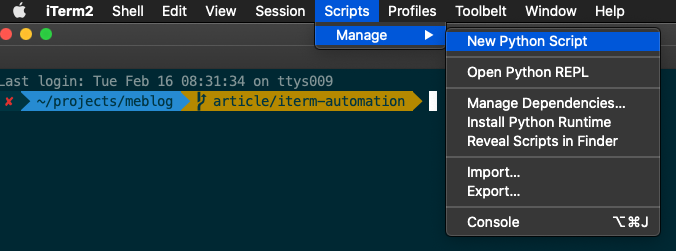

Do you find yourself opening many iTerm tabs every day to do the same daily routine such as opening editors, running a build, starting up various services etc? If yes, good news, this tedious daily startup routine can be automated, saving you precious minutes each day. This post will walk you through how to achieve this automation using [iTerm](https://iterm2.com/) and Python.

## Create Script

To get started, make sure iTerm is open, then select from the menu: Scripts -> Manage -> New Python Script as shown below:



If prompted, go ahead and download the Python runtime:


Next choose the Basic environment (Full Environment is only for more complex scripts that need to install other packages, that won't be necessary for simply opening tabs and running commands):


Choose Simple script template (because the script we will write will simply run its commands and then exit, it doesn't need to stay open listening for iTerm events):


Finally, give your script a name to save it, I name mine `daily-startup.py` but you can choose any name you like:


## Script Skeleton

This will open the script in an editor with a basic skeleton already filled in. I've added a few comments to explain what each part does:

```python
#!/usr/bin/env python3.7

# Import the iterm2 python module to provide an interface for communicating with iTerm
import iterm2

# All the script logic goes in the main function
# `connection` holds the link to a running iTerm2 process
# `async` indicates that this function can be interrupted. This is required because
#  iTerm2 communicates with the script over a websocket connection,
#  any time the script sends/receives info from iterm2, it has to wait for a few milliseconds.
async def main(connection):
    # Get a reference to the iterm2.App object - a singleton that provides access to iTerm2’s windows,
    # and in turn their tabs and sessions.
    app = await iterm2.async_get_app(connection)

    # Fetch the “current terminal window” from the app (returns None if there is no current window)
    window = app.current_terminal_window
    if window is not None:
        # Add a tab to current window using the default profile
        await window.async_create_tab()
    else:
        # You can view this message in the script console.
        print("No current window")

# Make a connection to iTerm2 and invoke the main function in an asyncio event loop.
# When main returns the program terminates.
iterm2.run_until_complete(main)
```

## Run Script

Currently, all the `daily-startup.py` script does is to open a new tab in the current terminal window. It doesn't do any real work yet but let's do a quick test and run it just to make sure everything is setup correctly.

There are several different ways to [run a script](https://iterm2.com/python-api/tutorial/running.html) but the easiest is to use the "Open Quickly" window. To launch it, enter <kbd>Cmd</kbd> + <kbd>Shift</kbd> + <kbd>O</kbd>, then start typing the name of the script, when its highlighted, hit <kbd>Enter</kbd> to run it. Make sure the focus is in iTerm when you do this:


The script should run and you should see a new tab open.

## Run Commands in Tabs

Now that we know the script is working, let's go ahead and open another tab, and run some commands in each tab. To do this, we need to get the current session associated with each tab, and then use the `async_send_text` method to send text through to the tab as if a user had entered it directly into the terminal. The newline character `\n` must be appended to each command to actually submit it. Edit your script as follows and save it:

```python
#!/usr/bin/env python3.7

import iterm2

async def main(connection):
    app = await iterm2.async_get_app(connection)
    window = app.current_terminal_window
    if window is not None:
        # Open a tab
        await window.async_create_tab()
        # Get the active session in this tab
        session = app.current_terminal_window.current_tab.current_session
        # Send text to the session as though the user had typed it
        await session.async_send_text('echo hello\n')

        # Open another tab
        await window.async_create_tab()
        session = app.current_terminal_window.current_tab.current_session
        await session.async_send_text('echo world\n')
    else:
        print("No current window")

iterm2.run_until_complete(main)
```

Go ahead and use the Open Quickly window again (<kbd>Cmd</kbd> + <kbd>Shift</kbd> + <kbd>O</kbd>) to run `daily-startup.py` again.

This time you should get two tabs opened with the first one having run `echo hello` and the second one having run `echo world`. Of course, echo-ing various text is not that useful, that was just to demonstrate the concept.

Now that the basic idea is working, the script can be customized to perform all the daily startup tasks you would run. For example, I run two different projects, one of which is started with `docker-compose up` and another which also uses docker compose but only to start the databases, then runs a rails server in another tab. I also launch a redis gui in another tab. And open VS Code for each project in more tabs. So my script looks something like this. I find it useful to comment each tab section with the task its performing:

```python
#!/usr/bin/env python3.7

import iterm2

async def main(connection):
    app = await iterm2.async_get_app(connection)
    window = app.current_terminal_window
    if window is not None:

        # Open VS Code for project A
        await window.async_create_tab()
        session = app.current_terminal_window.current_tab.current_session
        await session.async_send_text('cd path/to/projectA\n')
        await session.async_send_text('code .\n')

        # Run the full stack for project A
        await window.async_create_tab()
        session = app.current_terminal_window.current_tab.current_session
        await session.async_send_text('cd path/to/projectA\n')
        await session.async_send_text('docker-compose up\n')

        # Open VS Code for project B
        await window.async_create_tab()
        session = app.current_terminal_window.current_tab.current_session
        await session.async_send_text('cd path/to/projectB\n')
        await session.async_send_text('code .\n')

        # Run Postgres and Redis for project B
        await window.async_create_tab()
        session = app.current_terminal_window.current_tab.current_session
        await session.async_send_text('cd path/to/projectB\n')
        await session.async_send_text('docker-compose up\n')

        # Run Rails server for project B
        await window.async_create_tab()
        session = app.current_terminal_window.current_tab.current_session
        await session.async_send_text('cd path/to/projectB\n')
        await session.async_send_text('bundle exec rails s\n')

        # Run a Redis GUI
        await window.async_create_tab()
        session = app.current_terminal_window.current_tab.current_session
        await session.async_send_text('redis-commander --redis-port 6381 --redis-db 0\n')

        # ...
    else:
        print("No current window")

iterm2.run_until_complete(main)
```

You can keep customizing until the script is performing all the daily tasks you would otherwise be typing in manually.

## Backup

Last thing to do is to make a backup of the script to avoid losing it should your hard drive crash. The script is located at `/Users/yourusername/Library/Application Support/iTerm2/Scripts/script-name.py`.