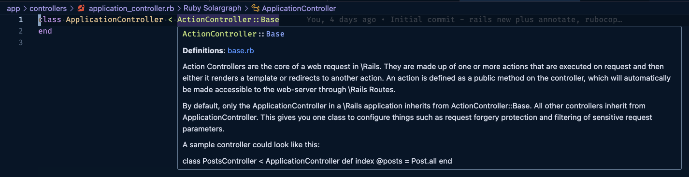
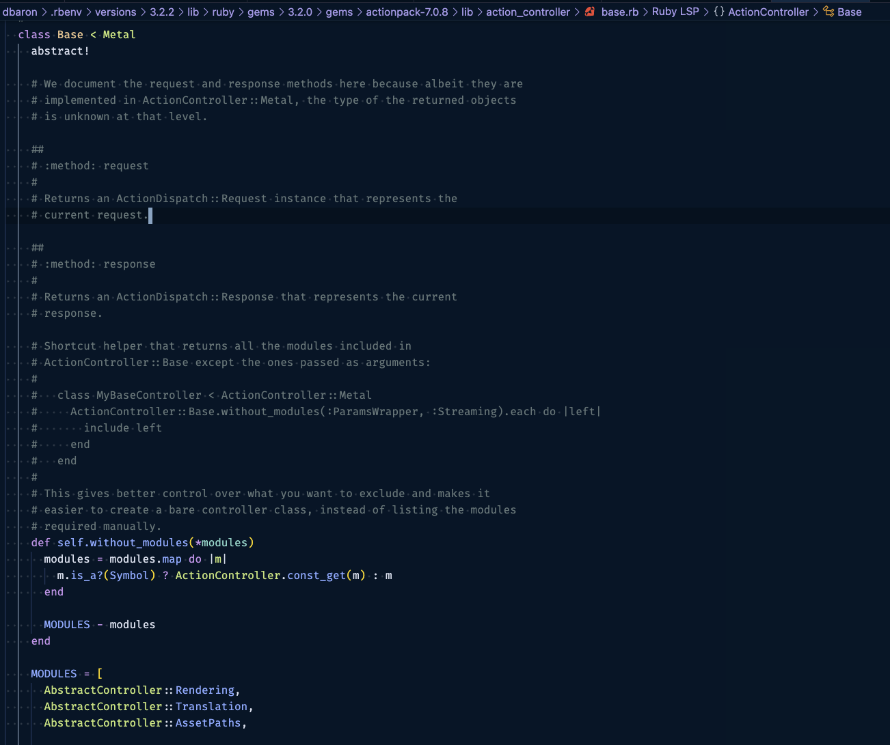

**Update:** Since originally writing this post, I have learned about the [Rails config file](https://www.writesoftwarewell.com/railsrc-rails-configuration-file/) that can make some of these steps faster.

Starting a new Rails project is an exciting time, but it also comes with its fair share of setup tasks to ensure your project kicks off on the right foot. This post will walk through some important steps that I like to follow to set up a Rails project for success. From configuring the database to ensuring code quality and style, and setting up essential development tools. Let's get started.

## Initialization

At the time of this writing, here are the versions of Ruby and Rails that I'm using:

```bash
ruby --version
# ruby 3.2.2

rails --version
# Rails 7.0.8
```

Use the `rails new` generator to generate new project with Postgres:

```bash
rails new my-awesome-app --database=postgresql
```

This assumes you're previously installed Postgres, for example: `brew install postgresql@14`. If you don't specify the `--database` flag in the generator command, it will use SQLite, which can be ok for a very small project or for someone who's just getting started with Rails and wants to keep things very simple. But later if you want to deploy it to a PaaS like Heroku or Render that use ephemeral environments, it won't work and will require switching to Postgres.

<aside class="markdown-aside">
Opting for Postgres offers many benefits, including robust data integrity, support for complex data types, advanced indexing options, compatibility with geo-spatial data, and access to community extensions.
</aside>

## Database Setup

After the project has been generated, I recommend running Postgres in a Docker container rather than directly on your laptop. This makes it convenient to add other services like Redis for Sidekiq or ActionCable later on. You can check out my detailed guide in this previous post [Setup a Rails Project with Postgres and Docker](../rails-postgres-docker).

Once you've set up Postgres, ensure that your Rails project is configured to generate a `structure.sql` file instead of `schema.rb` for your database schema. This can be done by adding the following line to your `config/application.rb` file:

```ruby
config.active_record.schema_format = :sql
```

The benefit of this is you may in the future have a migration that executes some SQL that cannot be expressed by the DSL provided by Rails. See the Rails Guides on [Schema Dumps](https://edgeguides.rubyonrails.org/active_record_migrations.html#types-of-schema-dumps) for more details.

Before moving on to further setup, this is a good time to ensure database can be started and created with `bin/setup`. If the database is configured correctly, the output of this command should include:
```
== Preparing database ==
Created database 'my_awesome_app'
Created database 'my_awesome_app_test'
```

Then launch a psql session with `bin/rails db`, which will connect you to the development database. Then run `\d` at the psql prompt to list tables, you should see:

```
                 List of relations
 Schema |         Name         | Type  |    Owner
--------+----------------------+-------+-------------
 public | ar_internal_metadata | table | my_awesome_app
 public | schema_migrations    | table | my_awesome_app
(2 rows)
```

### Annotate

For a clearer understanding of the database schema and to save time when working with models, I like to add the [annotate](https://github.com/ctran/annotate_models) gem to the development and test sections of the Gemfile.

```ruby
# Gemfile
group :development, :test do
  gem "annotate"
  # ...
end
```

After adding it, run the installation command:

```bash
bundle install
bin/rails generate annotate:install
```

This ensures that anytime database migrations are run, the schema information will be automatically prepended to the models, tests, and factories (more on [testing](../testing) later). This is beneficial when working with a model, such as adding scopes or other methods, to see what columns, indexes, and constraints are available.

For example, given the following migration to create a `products` table:

```ruby
class CreateProducts < ActiveRecord::Migration[7.0]
  def change
    create_table :products do |t|
      t.string :name, null: false
      t.string :code, null: false
      t.decimal :price, null: false
      t.integer :inventory, null: false, default: 0

      t.timestamps
    end
  end
end
```

And the corresponding Product model:

```ruby
class Product < ApplicationRecord
  # ...
end
```

After running the migration with `bin/rails db:migrate`, the model class will be updated with the schema information as comments at the beginning of the file:

```ruby
# == Schema Information
#
# Table name: products
#
#  id         :integer          not null, primary key
#  code       :string           not null
#  inventory  :integer          default(0), not null
#  name       :string           not null
#  price      :decimal(, )      not null
#  created_at :datetime         not null
#  updated_at :datetime         not null
#
class Product < ApplicationRecord
  # ...
end
```

The same schema comments will also get added to the model test `spec/models/product_spec.rb` and factory `spec/factories/product.rb` (given that these files exist at the time you run migrations).

## Code Quality

Maintaining clean and consistent code is essential for any project. Here's how you can set up code quality and style checks for your Rails project.

### Rubocop

For code quality checks, add [Rubocop](https://github.com/rubocop/rubocop) and some official extensions to the development group in the Gemfile:

```ruby
group :development do
  # Static code analysis for Ruby
  gem "rubocop"

  # Additional RuboCop rules for Ruby on Rails
  gem "rubocop-rails"

  # RuboCop rules for RSpec tests
  gem "rubocop-rspec"

  # Performance-related RuboCop rules
  gem "rubocop-performance"

  # RuboCop rules to check for thread safety
  gem "rubocop-thread_safety"

  # RuboCop rules for FactoryBot usage
  gem "rubocop-factory_bot"

  # RuboCop rules for Capybara tests
  gem "rubocop-capybara"
end

```

After adding these gems, create a `.rubocop.yml` file in your project's root directory with custom configurations. This is because you'll nearly always want to customize the Rubocop defaults. The details will vary by project, but here's where I like to start:
* Require all the extensions specified in Gemfile.
* Excluding generated files.
* Not enforcing code comment docs (although I'm a huge fan of [engineering documentation](../about-those-docs), enforcing it with `Style/Documentation` can lead to useless comments like `# This is the product model`).
* Increase some max lengths to account for modern high resolution monitors and to avoid arbitrarily splitting up cohesive methods.

```yml
require:
  - rubocop-rails
  - rubocop-rspec
  - rubocop-performance
  - rubocop-thread_safety
  - rubocop-factory_bot
  - rubocop-capybara

AllCops:
  NewCops: enable
  Exclude:
    - 'db/schema.rb'
    - 'Gemfile'
    - 'lib/tasks/*.rake'
    - 'bin/*'
    - 'node_modules/**/*'
    - 'config/puma.rb'
    - 'config/spring.rb'
    - 'config/environments/development.rb'
    - 'config/environments/production.rb'
    - 'spec/spec_helper.rb'

Style/FrozenStringLiteralComment:
  Enabled: false

Style/Documentation:
  Enabled: false

Style/StringLiterals:
  EnforcedStyle: double_quotes

Metrics/BlockLength:
  Exclude:
    - 'spec/**/*.rb'

Metrics/MethodLength:
  Max: 15

Layout/LineLength:
  Max: 120

RSpec/ExampleLength:
  Max: 15
```

### Profiler

Uncomment the `gem "rack-mini-profiler"` line in the development group of the Gemfile and run `bundle install` to enable Rack Mini Profiler:

```ruby
# Gemfile
group :development do
  # Add speed badges [https://github.com/MiniProfiler/rack-mini-profiler]
  gem "rack-mini-profiler"
end
```

This tool helps you identify performance bottlenecks in your application by providing real-time metrics on database queries, rendering times, and memory usage. The first time I saw it, I thought it only provides the time it took to render the current view, but it's so much more than that. See this [guide](https://stackify.com/rack-mini-profiler-a-complete-guide-on-rails-performance/) for more details on how to use it.


## Testing

While Rails comes with minitest for testing, I prefer using [RSpec](https://github.com/rspec/rspec-rails), together with [FactoryBot](https://github.com/thoughtbot/factory_bot) for a BDD (Behavior Driven Development) approach to testing, and explicit test data creation. Here's how to set this up.

Add `rspec-rails` gem to the Gemfile. It's placed in the development and test groups so that generators and rake tasks don't need to be preceded by `RAILS_ENV=test`. See the [installation docs](https://github.com/rspec/rspec-rails#installation) for more details.

```ruby
# Gemfile
group :development, :test do
  gem "rspec-rails"
end
```

After adding the gem, run the following commands to install and bootstrap RSpec:

```bash
bundle install
bin/rails generate rspec:install
```

Cleanup the old `test` directory from rails new generator to avoid confusion (assuming there's nothing important in here):

```bash
rm -rf test
```

Optionally, you can generate a binstub for RSpec to make running tests more convenient:

```bash
bundle binstubs rspec-core
```

Now instead of having to type `bundle exec rspec` to run tests, this can be shortened to `bin/rspec`.

### Factories

By default, Rails supports fixtures, which are yaml files that represent test data. They will be automatically loaded into the test database before every test run. While they are fast (due to database constraints being dropped before data loading), as a project and the data model grows, particularly with associations, fixtures can become a source of complexity. I prefer to use FactoryBot for more explicit data creation for each test that needs it.

<aside class="markdown-aside">
A full discussion of the pros and cons of factories and fixtures is outside the scope of this post. See this post <a class="markdown-link" href="https://harled.ca/blog/the_battle_of_factories_vs_fixtures_when_using_rspec">The Battle of Factories vs Fixtures</a> for more on this topic.
</aside>

To create test data easily, add the `factory_bot_rails` gem to your development and test groups in the Gemfile:

```ruby
group :development, :test do
  gem "factory_bot_rails"
end
```

This will cause Rails to generate factories instead of fixtures when running for example `bin/rails generate model SomeModel`. See the [generator docs](https://github.com/thoughtbot/factory_bot_rails#generators) if you want different behavior.

Next, configure FactoryBot in `spec/rails_helper.rb`:

```ruby
RSpec.configure do |config|
  # Other config...
  config.include FactoryBot::Syntax::Methods
end
```

The above configuration supports using the FactoryBot methods directly in tests, for example:

```ruby
# With config
let(:product) { build_stubbed(:product) }

# Without config
let(:product) { FactoryBot.build_stubbed(:product) }
```

**Performance tip:** Use FactoryBot's `build_stubbed` method rather than `create` where possible to speed up your test suite. Read this [post from Thoughtbot](https://thoughtbot.com/blog/use-factory-bots-build-stubbed-for-a-faster-test) for more details.

### Shoulda Matchers

For more expressive model testing, I like to add the [shoulda-matchers](https://github.com/thoughtbot/shoulda-matchers) gem. Add it to the test group in the Gemfile:

```ruby
# Gemfile
group :test do
  gem "shoulda-matchers"
end
```

After adding the gem, configure it at the end of the `spec/rails_helper.rb` file:

```ruby
# spec/rails_helper.rb

# Other config...
Shoulda::Matchers.configure do |config|
  config.integrate do |with|
    with.test_framework :rspec
    with.library :rails
  end
end
```

Here's an example of using shoulda matchers in an RSpec model test. Given the following `User` model:

```ruby
# app/models/user.rb
class User < ApplicationRecord
  validates :name, presence: true
  validates :email, presence: true
end
```

The `presence` validations can be tested with one-liners as follows:

```ruby
# spec/models/user_spec.rb
RSpec.describe User, type: :model do
  it { should validate_presence_of(:name) }
  it { should validate_presence_of(:email) }
end
```

See the docs on [matchers](https://github.com/thoughtbot/shoulda-matchers#matchers) for a full list of what can be expressed in tests.

Before moving on, make sure everything is wired up properly by generating an example model, and ensure both the rspec test and factory is generated for it. For example:

```bash
bin/rails generate model Product name:string description:text price:decimal available:boolean
```

The output of this command should show that the migration, model, model spec and product factory have been created:

```
invoke  active_record
create    db/migrate/20231002125314_create_products.rb
create    app/models/product.rb
invoke    rspec
create      spec/models/product_spec.rb
invoke      factory_bot
create        spec/factories/products.rb
```

Afterward, you can safely clean up the generated files:

```bash
bin/rails destroy model Product
```

## Dev Tooling

Here are a few more tools I like to add to enhance my workflow.

### Faker

The `faker` gem is a handy tool for generating seed data during development and can also be used in factories for test data. Add it to your development and test groups in the Gemfile:

```ruby
# Gemfile
group :development, :test do
  gem "faker"
end
```

Here's an example of how it can be used to seed the development database:

```ruby
# db/seeds.rb
10.times do
  product = Product.create(
    name: Faker::Commerce.product_name,
    description: Faker::Lorem.paragraph,
    price: Faker::Commerce.price(range: 10.0..1000.0),
    available: Faker::Boolean.boolean
  )
end
```

Faker can also be used in factories, for example:

```ruby
FactoryBot.define do
  factory :product do
    name { Faker::Commerce.product_name }
    description { Faker::Lorem.paragraph }
    price { Faker::Commerce.price(range: 10.0..1000.0) }
    available { Faker::Boolean.boolean }
  end
end
```

### Solargraph

[Solargraph](https://solargraph.org/) is a gem for Intelligent code assistance. When used together with the Solargraph VSCode [extension](https://marketplace.visualstudio.com/items?itemName=castwide.solargraph), it supports code navigation, documentation, and autocompletion.

Add it to the development group in the Gemfile:

```ruby
# Gemfile
group :development do
  gem "solargraph"
end
```

After running `bundle install`, solargraph will also install YARD. Run this command to generate documentation for installed gems:

```bash
bundle exec yard gems
```

Once Solargraph is setup, here's an example of it in action. Hovering over a Rails class in VSCode with Solargraph setup will show the documentation like this:



Hitting <kbd class="markdown-kbd">F12</kbd> will jump into the code, for example:



### Dotenv

The last bit of dev tooling I like to add is the [dotenv](https://github.com/bkeepers/dotenv) gem. This automatically loads environment files from a `.env` file in the project root, into [ENV](https://docs.ruby-lang.org/en/3.2/ENV.html) for development and testing. Add it to the development and test groups of the Gemfile:

```ruby
group :development, :test do
  gem "dotenv-rails"
  # ...
end
```

Then modify the `.gitignore` file in the project root to ignore the `.env` file, this is because secrets (even dev secrets) should not be committed to version control:

```sh
# Ignore environment variables
.env
```

Then create  `.env` and `.env.template` files in the project root. The first one will be ignored, the second one is committed to provide developers with an example of what environment variables the application needs:

```bash
touch .env .env.template
```

<aside class="markdown-aside">
The above is just a simple setup for dotenv. You can actually define multiple dot files containing env vars, and dotenv will load them according to some override rules. Depending on how you structure these, some of them could be committed. See the dotenv <a class="markdown-link" href="https://github.com/bkeepers/dotenv#frequently-answered-questions">frequently asked questions</a> for more details.
</aside>

### Editorconfig

While not Rails specific, [editorconfig](https://EditorConfig.org) is useful to have in all projects to maintain consistent whitespace in every file. To use it, add a `.editorconfig` in the project root such as:

```
# top-most EditorConfig file
root = true

# Unix-style newlines with a newline ending every file
[*]
end_of_line = lf
insert_final_newline = true
indent_style = space
indent_size = 2
```

And then install an [editor plugin](https://editorconfig.org/#download) for your editor/IDE of choice.

<aside class="markdown-aside">
It may seem like there's some overlap between editorconfig and other popular tools for linting and formatting. Here's some <a class="markdown-link" href="https://stackoverflow.com/questions/48363647/editorconfig-vs-eslint-vs-prettier-is-it-worthwhile-to-use-them-all">discussion</a> on how all these tools fit together.
</aside>

## Services

Lastly, consider configuring an `app/services` directory in your Rails project. While Rails is not opinionated about how you organize business logic, having a services layer from the beginning can keep your codebase organized as the project grows.

Add an empty `.keep` file in this directory so it will get committed to git:

```bash
# from project root
mkdir app/services
touch app/services/.keep
```

Then add the following line to `config/application.rb` file to include the `app/services` directory in Rails' autoload path:

```ruby
# config/application.rb
class Application < Rails::Application
  # other config...
  config.autoload_paths << Rails.root.join("services")
  # other config...
end
```

<aside class="markdown-aside">
Services are an area that brings about much discussion in the Rails community.  There are many different opinions on how to implement them, or whether they are needed at all. This is outside the scope of this post, but if you'd like to learn more about this, checkout this <a class="markdown-link" href="https://stackoverflow.com/questions/52526322/what-do-folks-use-app-services-in-rails-applications">Q & A on SO</a>, <a class="markdown-link" href="https://rubyvideo.dev/talks/railsconf-2022-your-service-layer-needn-t-be-fancy-it-just-needs-to-exist-by-david-copeland">RailsConf 2022 talk</a>, and a post about <a class="markdown-link" href="https://www.codewithjason.com/code-without-service-objects/">not using service objects</a>.
</aside>

## Conclusion

This post has covered important steps when starting a Rails project, including database setup, code quality and style, testing, additional dev tooling, and introducing a service layer from the start. Some projects may require more (see this post from Evil Martians on [Gemfile of Dreams](https://evilmartians.com/chronicles/gemfile-of-dreams-libraries-we-use-to-build-rails-apps)), but this is the bare minimum that I always reach for. By following these steps and practices, your Rails project should be well-prepared for efficient development and maintainability.

Finally, for convenience, here are all the gems to add to the Gemfile in one step:

```ruby
# Gemfile
group :development, :test do
  gem "annotate"
  gem "rspec-rails"
  gem "factory_bot_rails"
  gem "faker"
  gem "dotenv-rails"
end

group :development do
  gem "rubocop"
  gem "rubocop-rails"
  gem "rubocop-rspec"
  gem "rubocop-performance"
  gem "rubocop-thread_safety"
  gem "rubocop-factory_bot"
  gem "rubocop-capybara"
  gem "rack-mini-profiler"
  gem "solargraph"
end

group :test do
  gem "shoulda-matchers"
end
```

The setup commands:

```bash
bundle install
bin/rails generate annotate:install
bin/rails generate rspec:install
bundle binstubs rspec-core
rm -rf test
bundle exec yard gems
mkdir app/services
touch app/services/.keep .editorconfig .rubocop.yml .env .env.template
```

And configuration:

```ruby
# config/application.rb
module SomeApp
  class Application < Rails::Application
    config.active_record.schema_format = :sql
    config.autoload_paths << Rails.root.join("services")
  end
end
```

```ruby
# spec/rails_helper.rb
RSpec.configure do |config|
  config.include FactoryBot::Syntax::Methods
end

Shoulda::Matchers.configure do |config|
  config.integrate do |with|
    with.test_framework :rspec
    with.library :rails
  end
end
```
