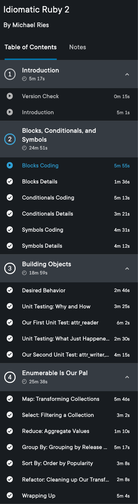
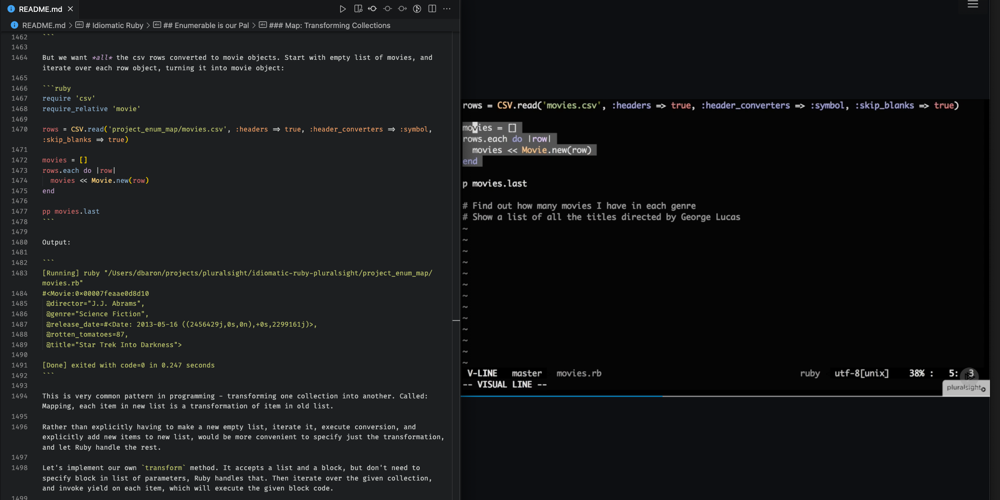

This post will cover some techniques to get the most out of online learning with screencasts. There are many services offering this including [Pluralsight](https://www.pluralsight.com/product/skills), [LinkedIn Learning](https://www.linkedin.com/learning/subscription/topics), [Wes Bos Courses](https://wesbos.com/courses), and Erik Kennedy's [Learn UI Design](https://www.learnui.design/) to name just a few. I happen to have the most experience with Pluralsight, but the advice in this post applies to all screencast style courses. Note that these are generally paid services.

## Definition

A screencast is a digital video recording of a computer screen while someone is using it, and usually includes audio narration. A course based on screencasts will have the instructor recording their screen while they run through presentation slides, terminal commands, setting up a development environment, writing code in an editor, running code, etc.

Typically these will be broken down into smaller sections rather than one massive recording. When taking the course, you can select which video to watch, then use the video player controls to pause, go forward, go back, speed up and so on. There is no time limit to complete the course, and no one is taking attendance.

Even prior to the pandemic, I've found this style of learning to be optimal as it supports an [async lifestyle](../working-towards-asynchronous-future). No need to commute to a particular location or be online at a specific hour. You login whenever you have time and go at your own pace. However, there are some pitfalls that can derail the learning experience.

## Passive Learning

Let's start with what not to do. Since the course format is video, it's tempting to treat this like a Netflix entertainment series, pop some popcorn, sit back, and binge watch.


This is the passive approach, and while not a complete waste of time, it's not the most effective way of learning. You're likely to forget most of what was covered. Instead, I recommend active learning. This requires more explicit effort on the part of the learner and takes longer, but the payoff is more information retained and a higher quality learning experience.

## Organize

One of the most effective ways to retain what you've learned is to write it down as you go. This requires prior organization so you'll be able to find your notes later.

When starting a new course, create a directory. I suggest having one directory for all courses, then sub-directories for each course you take. For example, if taking a course on Idiomatic Ruby from Pluralsight:

```bash
cd ~/path/to/courses
mkdir idiomatic-ruby-pluralsight && cd idiomatic-ruby-pluralsight
mkdir exercises doc-images
touch README.md
```

The resulting directory will be something like this:

```
courses
└── idiomatic-ruby-pluralsight
    ├── README.md
    ├── doc-images
    └── exercises
```

The `README.md` is where the course notes will go. It doesn't have to be markdown, you could write in a plain text file, or even a Google/Microsoft/Libre Office document. But I've found that [markdown](https://en.wikipedia.org/wiki/Markdown) is optimal for technical writing as it supports syntax highlighted code blocks.

The `exercises` folder will be used for saving any code examples developed during the course. The `doc-images` folder is where you will place any screenshots - for example, if developing a web app, it will be useful to save screenshots of what the app looks like as you build it up, and then reference these images in `README.md`.

Most courses are broken up into major sections, with each section having several smaller subsections with a short video for each. A good place to start organizing your notes is to create headings and subheadings matching the course structure. This way you'll know where to add your notes as you're watching each video.

For example, here's the table of contents from the Idiomatic Ruby course on Pluralsight:



In this case, I would create headings in `courses/idiomatic-ruby-pluralsight/README.md` as follows:

```markdown
# Idiomatic Ruby

## Blocks, Conditionals, and Symbols

### Blocks Coding

### Blocks Details

...

## Building Objects

### Desired Behavior

...
```

## Take Notes

Now that you're organized for note taking, it's time to start watching the videos. But you're not going to be sitting back and relaxing like watching funny cat videos on Youtube.


Every time a significant point is covered in the course, pause the video, and write down what you just learned in the appropriate heading/subheading section of `README.md` *in your own words*. This is key, do not simply transcribe the instructor's words. Make sure you understand the concept enough that you could explain it to someone else, then write down that explanation. In fact, that someone else is "future you", who will look back on these notes several months from now to reference the material.

## Write Code

Since these are technical courses, there will be many sections where the instructor writes some code and explains it. This is another good place to pause the video. Write the code yourself in the `exercises` directory you created earlier, make sure it compiles/runs and returns the same result as shown in the course.

Do not just watch the instructor code or copy/paste from the solutions (if provided), it won't stick. There's something very powerful about typing out the code yourself. After each section you type out, look back on it and make sure you understand every line. Go ahead and add explanatory comments, this is not the time to worry about "clean code" should there be comments or not. This is educational material - add any comments that will help future you understand the code.

Another variation on this is sometimes the instructor will announce the next problem that will be solved in code. This is a good time to pause the video and try to write out the code yourself *before* the instructor shows how to do it. Then compare your solution to the instructors.

## Arrange Windows

If your monitor is wide enough, I've found the optimal window arrangement for watching course videos and taking notes and the same time is to have the video playing on the right half of the monitor, and the editor open on the left half. For example, here's a screenshot from when I was learning Idiomatic Ruby with Pluralsight, at the section where we're learning about Enumerable methods:



If that's awkward for you, try different arrangements or even put each one one a different monitor if using multiple monitors. Once you find an optimal window layout, stick with that for video learning.

<aside class="markdown-aside">
One way to arrange windows is to use the mouse, hovering over the corner of any window to drag it to resize, and drag to move a window from the top bar. However, it's more efficient to use a windows manager to quickly "snap" windows to various positions such as left half, right half, top half, etc. Mac users can try <a class="markdown-link" href="https://www.spectacleapp.com/">Spectacle</a> or <a class="markdown-link" href="https://rectangleapp.com/">Rectangle</a>. Windows users check out this <a class="markdown-link" href="https://support.microsoft.com/en-us/windows/snap-your-windows-885a9b1e-a983-a3b1-16cd-c531795e6241">support</a> article.
</aside>

## Keyboard Shortcuts

The process of taking notes and writing code exercises from the video requires frequent pausing of the video player in the browser tab, where the course is hosted, switching to your code editor, then going back to the video player, possibly rewinding back a few seconds if you missed something. Trying to do all this with a mouse will be very tedious and could lead to wrist and shoulder pain due to frequency of switching.

I highly recommend learning keyboard shortcuts to control all these activities. The majority of video players I've used support the following:

* <kbd class="markdown-kbd">Space</kbd> Pause video playback (or resume if currently paused).
* <kbd class="markdown-kbd">Left Arrow</kbd> Go back 10 seconds.
* <kbd class="markdown-kbd">Right Arrow</kbd> Go forward 10 seconds.

For switching between applications such as browser and code editor, use <kbd class="markdown-kbd">Command</kbd> + <kbd class="markdown-kbd">Tab</kbd> for Mac, or <kbd class="markdown-kbd">Alt</kbd> + <kbd class="markdown-kbd">Tab</kbd> for Windows.

## Expect Issues

Sometimes you'll run into an issue where your code doesn't produce the same result as the instructor's or errors, doesn't compile etc. There are several reasons for this. Don't shrug and skip over this. It's important to investigate why your result is different. Here are some possible reasons:

**Bug in your code:** Review your code carefully and compare it to instructors for any typos. This is the root cause of many issues I've encountered in my years of learning from screencasts.

**Version mismatches:** It's possible that you have a different version of the language, library, framework etc. than what the instructor has installed. Go back to the beginning of the course and check if it mentions what version(s) are being used, then make sure to install those on your system. Many languages have version managers to make it easy to switch between projects using different versions such as [nvm](https://github.com/nvm-sh/nvm), [pyenv](https://github.com/pyenv/pyenv), [rbenv](https://github.com/rbenv/rbenv), etc. Use these wherever possible.

**Operating system mismatch:** You'll be able to tell what operating system the instructor is using from the video recordings of their screen. Windows and Mac are the most common, with the occasional instructor using Linux. It can happen that some code could be operating-system specific such as file paths and line endings. If you encounter this, update the code for your OS.

**Bug in course:** The last possibility is a bug in the course. For example, some video editing may have caused a few lines or an entire file that are needed to make the code work get missed from the recording. So even if you've copied the video code exactly, it still may not work. Some course platforms provide the code exercises as downloads. In this case, compare the downloaded solution files to your code to see if something's missing. It may also be possible to contact the instructor to ask about this, for example, Pluralsight integrates the Disqus commenting system for questions and answers. However, it could take a few days to receive an answer. You can also try to do a web search and solve the problem yourself, your solution may end up being different than what was in the course, but it will still be a valuable learning experience to solve the problem.

After the issue is fixed, add some notes about what you encountered and how you fixed it in the `README.md`. Most importantly, try not to get frustrated about encountering an issue. This is part of the learning experience. It's similar to real world development, where sometimes the most learning occurs from fixing a bug rather than when all goes smoothly.

## Tangents

One of the benefits of asynchronous learning over real-time/in-classroom, is the ability to explore something that piques your curiosity in more detail, but isn't the main topic. This could be an API that's used, or maybe the course only covers the happy path and you want to see what happens during some exceptional conditions.

Some examples from my experience - a Rails course I took was using the SQLite database, and added a length constraint to one of the fields but didn't test it. When I tried it though, the length limit wasn't enforced. Doing some research revealed that although SQLite supports the SQL syntax for setting length limits on `VARCHAR` fields, it's not enforced.

Another course I took invoked the `authenticate` method on a User model, which returns the user instance if authentication passed, or false otherwise. I got curious about where this method is defined as we hadn't written any code for it. Digging into this I learned about the `inspect` method to find more information about a method in Ruby, and eventually traced through the location in the Rails source code.

When finished exploring a tangent, make sure to add the results of this exploration to the `README.md`. This will solidify what you've just learned.

## Publish

This step is optional, but I recommend saving/publishing your notes somewhere they'll be easily searchable across devices. This could be any cloud storage such as Dropbox, OneDrive, Google Drive etc. My preference is to push the entire course folder to a Github repository. This is especially a good option when writing the notes in Markdown as they'll be automatically rendered on Github.

For example, given the following directory structure:

```
courses
└── idiomatic-ruby-pluralsight
    ├── README.md
    ├── doc-images
    └── exercises
```

I would create a new *empty* Github repository named "idiomatic-ruby-pluralsight" on [Github](https://github.com/), with no generated files such as readme or license). It's up to you if you want to make the repo public or private.

Then from the terminal:

```bash
cd idiomatic-ruby-pluralsight

# Create a local git repository
git init
git add .
gc -m "Initial commit"

# Connect it to the remote repository on Github
git remote add origin git@github.com:danielabar/idiomatic-ruby-pluralsight.git
git branch -M main
git push -u origin main
```

You don't need to wait until you're finished the course to publish your notes. I work on small amounts at a time and publish as I go (more on this in the next section). This is to avoid the catastrophic situation of hard drive crashing and losing all the precious notes.

## Break it Up

I do not advise attempting to complete a course in a single session. For example, many courses on Pluralsight are approximately 2 to 3 hours in duration. This sounds like it could be completed in a morning or afternoon. However, remember you're going to be stopping to take notes, do the exercises, go on tangents, and fix issues. Not only does this extend the time to complete the course, it also consumes significantly more mental energy than passively watching.

There's also a limit to how much new information the brain can absorb all at once. This varies by person, but I've found that doing one or at most two subsections in a single learning session is just the right amount to optimize absorbing new information. This avoids exhaustion so I'm looking forward to returning for a session another day.

## Make it a Habit

One problem that can occur when the videos can be watched at any time, is that after an initial bout of enthusiasm, learning drops off. Somehow there's never enough time in the day to get around to sitting down with the videos and your notes. Or you wait to feel inspired/energized but by the time it occurs to you to do some learning, its late and you're tired.

The solution to this is to make learning a *habit*. A habit is a routine or practice performed regularly; an automatic response to a specific situation.

TBD: One way to cultivate a new habit...

These could be subsections?

Habit Stacking

Small amounts each day

Make it easy (leave your editor open with the course folder you're working on, use browser bookmark to quickly open the course screencasts, learn )

**TODO**

- Note taking:
  - More reasoning for "This requires a little organization so you'll be able to find your notes later." - mise en place for learning - https://en.wikipedia.org/wiki/Mise_en_place
  - Example of how to screeshot, save and link in readme
  - Aside: Some course platforms have a Note taking section where you can enter your own notes but I don't recommend using this. What if they go away or if you no longer wish to pay for the service. It's better to own your own content.
- Should Publish section be last?
- Other sections
  - WIP: Make learning a habit (small amount each regular interval, habit stacking, reference: Atomic Habits)
  - Who is this for? (not absolute beginner, no real-time help if get stuck, need some discipline - no one's taking attendance)
  - Eliminate distractions (does this fit in?)