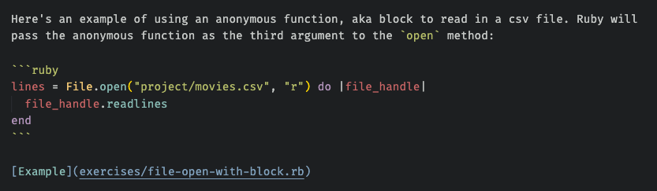

This post will cover some techniques to get the most out of online learning with screencasts. There are many services offering this including [Pluralsight](https://www.pluralsight.com/product/skills), [LinkedIn Learning](https://www.linkedin.com/learning/subscription/topics), [Wes Bos Courses](https://wesbos.com/courses), and Erik Kennedy's [Learn UI Design](https://www.learnui.design/) to name just a few. I happen to have the most experience with Pluralsight, but the advice in this post applies to all screencast style courses. Note that these are generally paid services.

## Definition

A screencast is a digital video recording of a computer screen while someone is using it, and usually includes audio narration. A course based on screencasts will have the instructor recording their screen while they run through presentation slides, terminal commands, setting up a development environment, writing code in an editor, running code, etc.

Typically these will be broken down into smaller sections rather than one massive recording. When taking the course, you can select which video to watch, then use the video player controls to pause, go forward, go back, speed up and so on. There is no time limit to complete the course, and no one is taking attendance.

After experimenting with many different [learning approaches](../how-to-learn-new-things), I've found this style of learning to be optimal as it supports an [async lifestyle](../working-towards-asynchronous-future). No need to commute to a particular location or be online at a specific hour. You login whenever you have time and go at your own pace. However, there are some pitfalls that can derail the learning experience.

## Passive Learning

Let's start with what not to do. Since the course format is video, it's tempting to treat this like a Netflix series, pop some popcorn, sit back, and binge watch.


This is the passive approach, and while not a complete waste of time, it's not the most effective way of learning. You're likely to forget most of what was covered. Instead, I recommend active learning. This requires more explicit effort on the part of the learner and takes longer, but the payoff is more information retained and a higher quality learning experience.

## Organize

One of the most effective ways to retain what you've learned is to write it down as you go. This requires prior organization so you'll be able to find your notes later. Think of this as [mise en place](https://en.wikipedia.org/wiki/Mise_en_place) for techies.

When starting a new course, create a directory. I suggest having one directory for all courses, then sub-directories for each course you take. For example, if taking a course on Idiomatic Ruby from Pluralsight:

```bash
cd ~/path/to/courses
mkdir idiomatic-ruby-pluralsight && cd idiomatic-ruby-pluralsight
mkdir exercises doc-images
touch README.md
```

The resulting directory will be something like this:

```
courses
└── idiomatic-ruby-pluralsight
    ├── README.md
    ├── doc-images
    └── exercises
```

The `README.md` is where the course notes will go. It doesn't have to be markdown, you could write in a plain text file, or even a Google/Microsoft/Libre Office document. But I've found that [markdown](https://en.wikipedia.org/wiki/Markdown) is optimal for technical writing as it supports syntax highlighted code blocks.

The `exercises` folder will be used for saving any code examples developed during the course. The `doc-images` folder is where you will place any screenshots - for example, if taking a course on css, svg, or developing a web app, it will be useful to save screenshots of what the app looks like as you build it up, and then reference these images in `README.md`.

Most courses are broken up into major sections, with each section having several smaller subsections with a short video for each. A good place to start organizing your notes is to create headings and subheadings matching the course structure. This way you'll know where to add your notes as you're watching each video. It's also useful to link to the course videos.

For example, here's the table of contents from the Idiomatic Ruby course on Pluralsight:


In this case, I would create headings in `courses/idiomatic-ruby-pluralsight/README.md` as follows:

```markdown
# Idiomatic Ruby

My notes from Pluralsight [course](https://app.pluralsight.com/library/courses/ruby-idiomatic/table-of-contents).

## Blocks, Conditionals, and Symbols

### Blocks Coding

### Blocks Details

...

## Building Objects

### Desired Behavior

...
```

## Arrange Windows

If your monitor is wide enough, I've found the optimal window arrangement for watching course videos and taking notes and the same time is to have the video playing on the right half of the monitor, and the editor open on the left half. For example, here's a screenshot from when I was learning Idiomatic Ruby with Pluralsight, at the section where we're learning about Enumerable methods:


If that's awkward for you, try different arrangements or even put each one one a different monitor if using multiple monitors. Once you find an optimal window layout, stick with that for video learning.

<aside class="markdown-aside">
One way to arrange windows is to use the mouse, hovering over the corner of any window to drag it to resize, and drag to move a window from the top bar. However, it's more efficient to use a windows manager to quickly "snap" windows to various positions such as left half, right half, top half, etc. Mac users can try <a class="markdown-link" href="https://www.spectacleapp.com/">Spectacle</a> or <a class="markdown-link" href="https://rectangleapp.com/">Rectangle</a>. Windows users check out this <a class="markdown-link" href="https://support.microsoft.com/en-us/windows/snap-your-windows-885a9b1e-a983-a3b1-16cd-c531795e6241">support</a> article.
</aside>

## Take Notes

Now that you're organized for note taking, it's time to start watching the videos. But this is not the same as watching funny cat videos on Youtube.


Every time a significant point is covered in the course, pause the video, and write down what you just learned in the appropriate heading/subheading section of `README.md` *in your own words*. This is key, do not simply transcribe the instructor's words. Make sure you understand the concept enough that you could explain it to someone else, then write down that explanation. In fact, that someone else is "future you", who will look back on these notes several months from now to reference the material.

The power of writing is that it makes you remember that you learned a topic, even if you don't remember the details. Next time you need to recall that information, you'll be able to pull up your notes and find the section where you wrote it down. Some examples from my experience include negative indexing in Python and the splat operator in Ruby. I haven't used either of these often enough to have memorized the details, but distinctly remember learning about them in courses and can quickly find these topics in my notes whenever I encounter some code that uses these.

Furthermore, while video is a great medium for learning, it's slow for recall. Later at work, if you need to pull up a detail that was covered in the course, it would be too slow to try and find in which video section this detail was covered and watch the video again. Or your membership might have expired or the course is no longer available. Your notes serve as a permanent reference.

<aside class="markdown-aside">
Some course platforms have a note taking feature built in, but I don't recommend using this. What if the service goes out of business or you no longer wish to pay for it, then your notes would disappear. It's better to own your own content and have full control over the formatting.
</aside>

## Write Code

Since these are technical courses, there will be many sections where the instructor writes some code and explains it. This is another good place to pause the video. Write the code yourself in the `exercises` directory you created earlier, make sure it compiles/runs and returns the same result as shown in the course.

Do not just watch the instructor code or copy/paste from the solutions (if provided), it won't stick. There's something very powerful about typing out the code yourself. After each section you type out, look back on it and make sure you understand every line. Go ahead and add explanatory comments, this is not the time to worry about "clean code" should there be comments or not. This is educational material - add any comments that will help future you understand the code.

Another variation on this is sometimes the instructor will announce the next problem that will be solved in code. This is a good time to pause the video and try to write out the code yourself *before* the instructor shows how to do it. Then compare your solution to the instructors.

Finally, you'll want to link up the code you wrote to the `README.md` notes so the explanations you've been writing flow with the code. One way is to place relevant snippets of code directly in the `README.md` using fenced code blocks. Another way is to link from the `README.md` to the specific file in the `exercises` directory. For example:



## Screenshot Flow

For courses that have a visual component - such as learning a framework for building a web app, css, svg, etc, you'll want to take screenshots of what you're building and save these as part of your notes. Here's the flow I use for Mac:

1. <kbd class="markdown-kbd">Cmd</kbd> + <kbd class="markdown-kbd">Control</kbd> + <kbd class="markdown-kbd">Shift</kbd> + <kbd class="markdown-kbd">4</kbd> to turn cursor into a crosshair. Right click on the mouse and drag to capture the relevant portion of the screen. When you release the mouse, the selection will be saved to the clipboard.
2. Open the Preview app using either [Alfred](https://www.alfredapp.com/) or [Spotlight Search](https://support.apple.com/en-ca/guide/mac-help/mchlp1008/mac). Default hot key for Alfred is <kbd class="markdown-kbd">Option</kbd> + <kbd class="markdown-kbd">Space</kbd>. For Spotlight Search it's <kbd class="markdown-kbd">Command</kbd> + <kbd class="markdown-kbd">Space</kbd>.
3. Hit <kbd class="markdown-kbd">Cmd</kbd> + <kbd class="markdown-kbd">N</kbd> to create a new file. It will automatically place the contents of the clipboard into the new file.
4. Hit <kbd class="markdown-kbd">Cmd</kbd> + <kbd class="markdown-kbd">S</kbd> and save the file to `/path/to/course/doc-images`.
5. Update `README.md` to link to the newly created image, for example:

```markdown
Here is what the homepage looks like:


```

Windows users see this [support article](https://support.microsoft.com/en-us/windows/use-snipping-tool-to-capture-screenshots-00246869-1843-655f-f220-97299b865f6b) on using the Snipping Tool to capture screenshots.

It seems like a lot of steps but since most of this flow uses keyboard shortcuts, you'll get very efficient after doing it a few times. More on keyboard shortcuts in the next section.

## Keyboard Shortcuts

The process of taking notes and writing code exercises from the video requires frequent pausing of the video player in the browser tab, where the course is hosted, switching to your code editor, then going back to the video player, possibly rewinding back a few seconds if you missed something. Trying to do all this with a mouse will be very tedious and could lead to wrist and shoulder pain due to frequency of switching.

I highly recommend learning keyboard shortcuts to control all these activities. The majority of video players I've used support the following:

* <kbd class="markdown-kbd">Space</kbd> Pause video playback (or resume if currently paused).
* <kbd class="markdown-kbd">Left Arrow</kbd> Go back 10 seconds.
* <kbd class="markdown-kbd">Right Arrow</kbd> Go forward 10 seconds.

For switching between applications such as browser and code editor, use <kbd class="markdown-kbd">Command</kbd> + <kbd class="markdown-kbd">Tab</kbd> for Mac, or <kbd class="markdown-kbd">Alt</kbd> + <kbd class="markdown-kbd">Tab</kbd> for Windows.

## Expect Issues

Sometimes you'll run into an issue where your code doesn't produce the same result as the instructor's or errors, doesn't compile etc. There are several reasons for this. Don't shrug and skip over this. It's important to investigate why your result is different. Here are some possible reasons:

**Bug in your code:** Review your code carefully and compare it to instructors for any typos. This is the root cause of many issues I've encountered in my years of learning from screencasts.

**Version mismatches:** It's possible that you have a different version of the language, library, framework etc. than what the instructor has installed. Go back to the beginning of the course and check if it mentions what version(s) are being used, then make sure to install those on your system. Many languages have version managers to make it easy to switch between projects using different versions such as [nvm](https://github.com/nvm-sh/nvm), [pyenv](https://github.com/pyenv/pyenv), [rbenv](https://github.com/rbenv/rbenv), etc. Use these wherever possible.

**Operating system mismatch:** You'll be able to tell what operating system the instructor is using from the video recordings of their screen. Windows and Mac are the most common, with the occasional instructor using Linux. It can happen that some code could be operating-system specific such as file paths and line endings. If you encounter this, update the code for your OS.

**Bug in course:** The last possibility is a bug in the course. For example, some video editing may have caused a few lines or an entire file that are needed to make the code work get missed from the recording. So even if you've copied the video code exactly, it still may not work. Some course platforms provide the code exercises as downloads. In this case, compare the downloaded solution files to your code to see if something's missing. It may also be possible to contact the instructor to ask about this, for example, Pluralsight integrates the Disqus commenting system for questions and answers. However, it could take a few days to receive an answer. You can also try to do a web search and solve the problem yourself, your solution may end up being different than what was in the course, but it will still be a valuable learning experience to solve the problem.

After the issue is fixed, add some notes about what you encountered and how you fixed it in the `README.md`. Most importantly, try not to get frustrated about encountering an issue. This is part of the learning experience. It's similar to real world development, where sometimes the most learning occurs from fixing a bug rather than when all goes smoothly.

## Tangents

One of the benefits of asynchronous learning over real-time/in-classroom, is the ability to explore something that piques your curiosity in more detail, but isn't the main topic. This could be an API that's used, or maybe the course only covers the happy path and you want to see what happens during some exceptional conditions.

Some examples from my experience - a Rails course I took was using the SQLite database, and added a length constraint to one of the fields but didn't test it. When I tried it, the length limit wasn't enforced. Doing some research revealed that although SQLite supports the SQL syntax for setting length limits on `VARCHAR` fields, it's not enforced.

Another course I took invoked the `authenticate` method on a User model, which returns the user instance if authentication passed, or false otherwise. I got curious about where this method is defined as we hadn't written any code for it. Digging into this I learned about the `inspect` method to find more information about a method in Ruby, and eventually traced through the location in the Rails source code.

When finished exploring a tangent, make sure to add the results of this exploration to the `README.md`. This will solidify what you've just learned.

<aside class="markdown-aside">
At this point, some of you might be thinking - wow, with all this note taking, problem solving and exploring tangents, it's going to take forever to complete a course. The way I think about this is not to focus on the number of courses completed in a year, but rather, the enjoyment and quality of the learning experience. In other words, <a class="markdown-link", href="https://pubmed.ncbi.nlm.nih.gov/31233318/">it's the journey, not the destination</a>.
</aside>

## Publish (Optional)

This step is optional, but I recommend saving/publishing your notes somewhere they'll be easily searchable across devices. This could be any cloud storage such as Dropbox, OneDrive, Google Drive etc. My preference is to push the entire course folder to a Github repository. This is especially a good option when writing the notes in Markdown as they'll be automatically rendered on Github.

For example, given the following directory structure:

```
courses
└── idiomatic-ruby-pluralsight
    ├── README.md
    ├── doc-images
    └── exercises
```

I would create a new *empty* Github repository named "idiomatic-ruby-pluralsight" on [Github](https://github.com/), with no generated files such as readme or license). It's up to you if you want to make the repo public or private.

Then from the terminal:

```bash
cd idiomatic-ruby-pluralsight

# Create a local git repository
git init
git add .
gc -m "Initial commit"

# Connect it to the remote repository on Github
git remote add origin git@github.com:danielabar/idiomatic-ruby-pluralsight.git
git branch -M main
git push -u origin main
```

You don't need to wait until you're finished the course to publish your notes. I work on small amounts at a time and publish as I go (more on this in the next section). This is to avoid the catastrophic situation of hard drive crashing and losing all the precious notes.

<aside class="markdown-aside">
If your notes have a lot of sections and subsections, it can be useful to add a table of contents to make it even easier to find details later. If the notes are written in markdown, the <a class="markdown-link" href="https://www.npmjs.com/package/doctoc">DocToc</a> package on npm does a great job of this.
</aside>

## Break it Up

I do not advise attempting to complete a course in a single session. For example, many courses on Pluralsight are approximately 2 to 3 hours in duration. This sounds like it could be completed in a morning or afternoon. However, remember you're going to be stopping to take notes, do the exercises, go on tangents, and fix issues. Not only does this extend the time to complete the course, it consumes significantly more mental energy than passively watching.

There's also a limit to how much new information the brain can absorb all at once. This varies by person, but I've found that doing one or at most two subsections in a single learning session is just the right amount to optimize absorbing new information. This avoids exhaustion so I'm looking forward to returning for a session another day. More on this in the next section on habits.

## Make it a Habit

One problem that can occur when the videos can be watched at any time, is that after an initial bout of enthusiasm, learning drops off. Somehow there's never enough time in the day to get around to sitting down with the videos and writing your notes. Or you wait to feel inspired but by the time it occurs to you to do some learning, its late and you're tired. The solution to this is to make learning a *habit*:

> A habit is a routine or practice performed regularly; an automatic response to a specific situation.

Here are a few techniques for cultivating the habit of learning.

### Small amounts regularly

It can be overwhelming to find an hour or more in a typical day to fit in learning. Instead, start with a very small amount, even 5 - 10 minutes, and commit to this several days a week. For example, Tuesday, Wednesday, and Thursday of each week, after dinner, you'll sit down for just 10 minutes with your code editor and the video course to listen and take notes. That's just an example, pick whichever days and times work for you, as long as its regularly occurring.

You might be thinking what difference could 10 minutes possibly make? The key here is making the learning activity happen regularly. Those small increments will add up surprisingly quickly. For example, 10 minutes a day, 3 times per week is a half hour. In a year (let's say approximately 50 weeks, accounting for some vacation), that's 25 hours. Furthermore, with enough repetition, you may find that 10 minute session stretch out to 20 minutes of even a half hour, especially if you're enjoying what you're learning. That would get you to 75 hours per year! Imagine how much learning you can cover in that time.

It's fine if you don't get through an entire subsection, add a line to your notes such as "Left off at 2:35 of Map: Transforming Collections". This makes it easy to pick up again in your next learning session.

### Make it easy

Speaking of making things easy, this is another key to habit formation, if you have to overcome too many hurdles to start the activity, it won't get done. Think of trying to start an exercise program but the gym is an hour's drive away and your workout clothes are in the bottom of the laundry hamper, vs an at home workout or a park in your neighborhood and clean workout clothes ready to go. Similarly with screencast video learning, there's a few things you can do to make it easier to get each learning session started.

Leave your editor open with the course folder you've started. On a Mac, next time your computer boots up, the editor will be open waiting for you. For Windows users, remembering open apps and files is not a native feature, although you could check out some [suggestions](https://www.pcworld.com/article/410688/how-to-have-windows-re-open-active-windows-and-programs-on-reboot.html).

Leave the course url open in a browser tab, and enable remember previously open tabs in your browser so the videos will always be there waiting for you. An alternative if you don't want to always have the tab open is to bookmark the course url, then [index your browser bookmarks](../how-to-access-chrome-bookmarks-via-keyboard) to load it quickly via keyboard.

### Habit Stacking

This is a technique where you identify a current habit you already do each day, and then "stack" a new habit on top. The general form of this is:

"After I `CURRENT_HABIT`, I will `NEW_HABIT`."

For example, someone trying to establish a gratitude habit might say: "After I sit down to dinner, I will say one thing I'm grateful for that happened today".

In this case, `NEW_HABIT` will be learning from screencasts. For me, I identified `CURRENT_HABIT` as making coffee first thing in the morning, which I've been doing for over 20 years! This leads to: "After I make coffee each morning, I will set down my mug at my computer desk, and have coffee while doing some screencast learning".

This works because it's tying a desired new behaviour (learning from video courses) to something you already do every day, such as making coffee. Think about a typical day in your schedule, identify `CURRENT_HABIT`, then stack it with the learning habit.

<aside class="markdown-aside">
The advice presented above just scratches the surface on the science of habit formation. It comes from the book <a class="markdown-link" href="https://jamesclear.com/atomic-habits">Atomic Habits</a>, which will teach you how to get 1% better each day. This book draws on research from the fields of biology, psychology, and neuroscience and converts these to practical, actionable advice that anyone can start right away. It sounds cliche to say this book is a game changer, but in this case, it's accurate. Whether you're trying to cultivate a new habit, or drop a bad one, I highly recommend reading this book.
</aside>

**TODO**

- Better image for side by side workflow, make windows smaller before screenshotting
- Break it up: Add example of my git history from idiomatic pluralsight course (custom glog format to include commit date)
- Reduce popcorn image size
- Why screencasts? (constantly changing tech landscape, want to pick up a new language, tool, framework, higher quality than free tutorial?)
- Who is this for? (not absolute beginner, no real-time help if get stuck, need some discipline - no one's taking attendance)
- Eliminate distractions (does this fit in?)
- Conclusion/Summary
  - Benefits of writing:
    * Helps you remember what you've learned
    * Faster recall than video
    * Useful reference even if no longer have access to the course