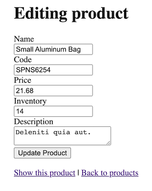
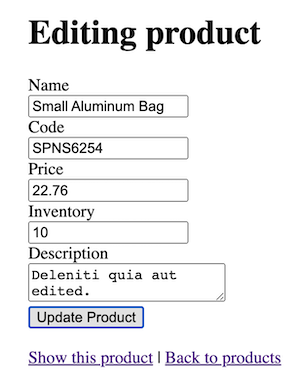

Model auditing plays a important role in tracking changes within a Rails application. While several gems are available to implement this functionality, today we'll delve into the benefits of using [PaperTrail](https://github.com/paper-trail-gem/paper_trail). By default, PaperTrail consolidates all model audit records into a single `versions` table, which could lead to performance and scaling challenges when dealing with numerous audited models. Fortunately, there's a better approach. This post will walk through the steps to configure PaperTrail to create separate `{model}_versions` tables for each model, such as `product_versions`, `order_versions`, `customer_versions`, etc. This optimization can improve performance and organization in your application's auditing process.

## Project Setup

We'll start with a simple project that just has a single `Products` model to demonstrate how to audit changes to products specifically, but the process will apply to any number of models in a real application. Assume this is a back office application for maintaining an e-commerce system. This project uses a Postgres database, which supports the json column type and is useful for representing model changes. We'll also add the [devise](https://github.com/heartcombo/devise) gem so we can have different users log in and make changes to products. I'm using Ruby 3.2 and Rails 7.0.6 but you can check the [PaperTrail Compatibility](https://github.com/paper-trail-gem/paper_trail#1a-compatibility) for older versions support.

```bash
# Create a new Rails project using a Postgres database
rails new audit_demo -d postgresql
cd audit_demo

# Initialize an empty database
bin/rails db:create

# Generate product model, database migration, controller, views, and routes,
bin/rails g scaffold Product name:string code:string price:decimal inventory:integer description:text

# Create the `products` table
bin/rails db:migrate
```

Add [devise](https://github.com/heartcombo/devise) to the Gemfile so we can have user logins, to later demonstrate how PaperTrail can keep track of *who* made a change. While you're here, also add the [faker](https://github.com/faker-ruby/faker) gem to the development and test sections, we'll use this later to generate sample data:

```ruby
# Gemfile

# User authentication
gem "devise"

group :development, :test do
  # Generate realistic looking data
  gem "faker"
end
```

Run `bundle install` to add these new gems to the project.

Run the Devise generators:

```bash
# Installs config/initializer for devise
bin/rails generate devise:install

# Generate user model, migration, modules, and routes
# for user registration and session management.
bin/rails generate devise User

# Migrate database so we now have a `users` table
bin/rails db:migrate
```

Update the routes file to set the products listing view as the root route:

```ruby
Rails.application.routes.draw do
  # CRUD for products (generated from earlier scaffold command).
  resources :products

  # Added by devise generator to expose login and registration routes.
  devise_for :users

  # Set the default route: Devise needs to know where to redirect
  # users after successful login.
  root "products#index"
end
```

To ensure there's always a logged in user that's accessing the product views, specify the `authenticate_user!` method in the product controller's `before_action` callback:

```ruby
# app/controllers/products_controller.rb
class ProductsController < ApplicationController
  before_action :authenticate_user!
  #...
end
```

Now let's seed the database with a few users and products. I'm using the [faker](https://github.com/faker-ruby/faker) gem to quickly generate some realistic looking product data. To keep the `db/seeds.rb` file clean, I've split up the user and product seeds into separate files. For a small project like this, they could go all in the same file, but it quickly gets messy as the project grows, so I like to get in the habit of splitting up the seeds files right from the start:

```ruby
# db/seeds.rb
if Rails.env.development?
  load Rails.root.join("db/seeds/users.rb")
  load Rails.root.join("db/seeds/products.rb")
  Rails.logger.info("Seeding completed!")
else
  Rails.logger.info("Seeding skipped. Not in development environment.")
end
```

```ruby
# db/seeds/users.rb
User.create!(email: "test1@example.com", password: "Password1")
User.create!(email: "test2@example.com", password: "Password1")
```

```ruby
# db/seeds/products.rb
20.times do
  Product.create!(
    name: Faker::Commerce.product_name,
    code: "#{Faker::Alphanumeric.alpha(number: 4).upcase}#{Faker::Number.number(digits: 4)}",
    price: Faker::Commerce.price(range: 0..100.0),
    inventory: rand(0..50),
    description: Faker::Lorem.sentence(word_count: 3, random_words_to_add: 4)
  )
end
```

Finally let's load the seeds into the database, I'm using the `replant` task which first truncates all the model tables. This makes it fast to re-run any time you want to reseed the database:

```bash
bin/rails db:seed:replant
```

At this point, you should be able to start a Rails server with `bin/rails s`, navigate to [http://localhost:3000](http://localhost:3000), get redirected to [http://localhost:3000/users/sign_in](http://localhost:3000/users/sign_in), login as one of the example users from the seeds such as `test1@example.com/Password1`. You'll then be redirected to the product listing view which shows all products. You can click "Show product" on any product, then click "Edit" and make any changes.

## Add PaperTrail

Now that we have a functioning project with authenticated users that can edit products, it's time to add model auditing. To start, add PaperTrail to the Gemfile, then run `bundle install` to install it:

```ruby
# Gemfile

# Model auditing
gem "paper_trail"
```

Next run the PaperTrail generator to generate the database migrations to add an audit table. I'm using the `--with-changes` column to ensure the model diffs will be persisted:

```bash
bundle exec rails generate paper_trail:install --with-changes
```

This generates two migration files as shown below - do NOT run these yet, we're going to be making a number of changes:

```ruby
# db/migrate/20230806120211_create_versions.rb
class CreateVersions < ActiveRecord::Migration[7.0]
  TEXT_BYTES = 1_073_741_823

  def change
    create_table :versions do |t|
      t.string   :item_type, null: false
      t.bigint   :item_id,   null: false
      t.string   :event,     null: false
      t.string   :whodunnit
      t.text     :object, limit: TEXT_BYTES
      t.datetime :created_at
    end
    add_index :versions, %i[item_type item_id]
  end
end
```

```ruby
# db/migrate/20230806120212_add_object_changes_to_versions.rb
class AddObjectChangesToVersions < ActiveRecord::Migration[7.0]
  TEXT_BYTES = 1_073_741_823

  def change
    add_column :versions, :object_changes, :text, limit: TEXT_BYTES
  end
end
```

The PaperTrail instructions then say to update any model classes that require auditing with the `has_paper_trail` macro. This will populate the `versions` table with a change record any time a model is updated (also persists model creation and deletion). For example, the `Product` model would get updated as follows. Again, do NOT make these changes, we'll be doing things differently:

```ruby
class Product < ApplicationRecord
  # Don't add this - we'll do it differently soon
  has_paper_trail
end

class SomeOtherWidget < ApplicationRecord
  has_paper_trail
end

# etc. for all model classes that need to be audited
```

The above migrations and code change show that the default PaperTrail behavior is to generate a single `versions` table that will store *all* model audit records. Now let's go through the changes required to have a `product_versions` table specifically for persisting changes to the `Product` model.

## Migration Changes

Make the following changes to the migration file:

* Change the file name from `db/migrate/{timestamp}_create_versions.rb` to `db/migrate{timestamp}_create_product_versions.rb`.
* Modify the migration class name from `CreateVersions` to `CreateProductVersions`.
* Modify the table and index names from `versions` to `product_versions`.
* Add the `object_changes` column from the `..._add_object_changes_to_versions.rb` migration to `..._create_product_versions.rb` and delete the second generated migration (there's no need to maintain a second migration file just to add the column).
* Change the `object` and `object_changes` columns to be of type `json` (or `jsonb` if using Postgres) rather than `text`.
* Remove the `TEXT_BYTES` constant as we're using json rather than text columns.

Here is the resulting migration file after making the above changes:

```ruby
# db/migrate/20230806120211_create_product_versions.rb
class CreateProductVersions < ActiveRecord::Migration[7.0]
  def change
    create_table :product_versions do |t|
      t.string   :item_type, null: false
      t.bigint   :item_id,   null: false
      t.string   :event,     null: false
      t.string   :whodunnit
      t.json     :object
      t.json     :object_changes
      t.datetime :created_at
    end

    add_index :product_versions, %i[item_type item_id]
  end
end
```

## Model Changes

By default, PaperTrail assumes all model changes are being persisted in a single `versions` table. We've updated the migration to create a product-specific versions table, but there are some code changes to be made as well to configure PaperTrail so it knows about this change.

The first change is to specify the `versions` option on the `has_paper_trail` macro for the `Product` model, to indicate the class that represents the product versions (this class doesn't exist yet, we'll get to that next):

```ruby
# app/models/product.rb
class Product < ApplicationRecord
  has_paper_trail versions: {
    class_name: "ProductVersion"
  }
end
```

Now add a new model class `ProductVersion` that inherits from `PaperTrail::Version` and specify the table name from the modified migration:

```ruby
# app/models/product_version.rb
class ProductVersion < PaperTrail::Version
  self.table_name = :product_versions
end
```

Finally, since all the audited models will be persisted in custom versions tables and the default `versions` table will not exist in this app, we need to tell PaperTrail that the base `ApplicationVersion` class is abstract. Add it as follows:

```ruby
# app/models/application_version.rb
class ApplicationVersion < ActiveRecord
  include PaperTrail::VersionConcern
  self.abstract_class = true
end
```

## Populate Whodunnit

PaperTrail can optionally populate a `whodunnit` column in the `xxx_versions` table to record the logged in user that made the change. If the controller has a `current_user` method available, a controller callback can be specified that will automatically populate `whodunnit` with `current_user.id`. Since this project is using devise, there is a `current_user` method available on the controller, so we can specify the callback on the base controller as follows:

```ruby
# app/controllers/application_controller.rb
class ApplicationController < ActionController::Base
  before_action :set_paper_trail_whodunnit
end
```

One final small change to make is if you want the user's email address (or some other attribute) populated in the `whodunnit` column instead of the user's `id`, you can define the `user_for_paper_trail` method in the base controller. Then PaperTrail will use whatever is returned from this method to populate `whodunnit`:

```ruby
# app/controllers/application_controller.rb
class ApplicationController < ActionController::Base
  before_action :set_paper_trail_whodunnit

  # Use devise gem's controller helper methods to return
  # the logged in user's email address, or Anonymous if
  # there is no logged in user.
  #
  # The value returned from this method will be saved in
  # the {model}_versions.whodunnit column.
  def user_for_paper_trail
    user_signed_in? ? current_user.email : "Anonymous"
  end
end
```

## Demo

Now we're ready to try this out and see the product-specific audit table populated:
* Start the Rails server with `bin/rails s`
* Navigate to [http://localhost:3000/](http://localhost:3000/).
* When presented with the login prompt, enter `test1@example.com/Password1` (from `db/seeds/users.rb`).
* From the products listing page, click the `Show` link for any product.
* From the product view page, click `Edit`.
* Make a few edits to the product and click the Update button.

For example, I've selected a product with code `SPNS6254`, here are its original values:



Here are some edits to increase the price from 21.68 to 22.76 (inflation!), decrease the inventory count from 14 to 10, and update the description to add the word `edited` at the end:



Now launch a Rails console with `bin/rails c` to see what PaperTrail has saved for this update:

```ruby
# Find the product we just edited
product = Product.find_by(code: "SPNS6254")

# Our edits have been saved to the database
=>
#<Product:0x0000000111013df0
 id: 103,
 name: "Small Aluminum Bag",
 code: "SPNS6254",
 price: 0.2276e2,
 inventory: 10,
 description: "Deleniti quia aut edited.",
 created_at: Mon, 07 Aug 2023 13:35:45.442271000 UTC +00:00,
 updated_at: Sat, 12 Aug 2023 13:14:18.913169000 UTC +00:00>

# PaperTrail adds the `versions` method to audited models
product.versions

# It returns an array of records from `product_versions` table
# `whodunnit` shows email address of logged in user that made the change
# `object` column persists how the product looked before the change
# `object_changes` shows every value we updated
=>
[
  #<ProductVersion:0x000000010d5f2180
  id: 80,
  item_type: "Product",
  item_id: 103,
  event: "update",
  whodunnit: "test1@example.com",
  object:
   {
    "name"=>"Small Aluminum Bag",
    "code"=>"SPNS6254",
    "price"=>"21.68",
    "inventory"=>14,
    "description"=>"Deleniti quia aut.",
    "id"=>103,
    "created_at"=>"2023-08-07T13:35:45.442Z",
    "updated_at"=>"2023-08-07T13:35:45.442Z"
   },
  object_changes:
   {
    "price"=>["21.68", "22.76"],
    "inventory"=>[14, 10],
    "description"=>["Deleniti quia aut.", "Deleniti quia aut edited."],
    "updated_at"=>["2023-08-07T13:35:45.442Z", "2023-08-12T13:14:18.913Z"]
   },
  created_at: Sat, 12 Aug 2023 13:14:18.913169000 UTC +00:00>
]
```

We can also connect directly to the database to verify the data is persisted in the `product_versions` table. Use the `bin/rails db` command to launch a psql session. Then query the `product_versions` table for `item_id` of `103` (which is the primary key of the product record we edited earlier):

```sql
audit_demo=> select whodunnit, object_changes from product_versions where item_id = 103;
     whodunnit     |object_changes
-------------------+---------------------------------------------------------------------------------------------------------------------------------------------------------------------------------------
 test1@example.com | {"price":["21.68","22.76"],"inventory":[14,10],"description":["Deleniti quia aut.","Deleniti quia aut edited."],"updated_at":["2023-08-07T13:35:45.442Z","2023-08-12T13:14:18.913Z"]}
(1 row)
```

As shown from both the Rails and database consoles, PaperTrail has successfully recorded the update to this product record.

## Other Models

A real application will have multiple models that need to be audited. For example, an e-commerce application could have orders, addresses, payments, etc. To get model-specific audit tables populated for these, the steps are:
1. Run the paper trail generator command: `bundle exec rails generate paper_trail:install --with-changes`.
2. Repeat the steps in the [Migration Changes](../model-audit-paper-trail#migration-changes) section of this post.
3. Repeat the steps in the [Model Changes](../model-audit-paper-trail/#model-changes) section of this post.
4. Run `bin/rails db:migrate` to create the new `{model}_versions` table.

## Conclusion

This post has provided a step-by-step guide to optimizing model auditing within a Rails application using the PaperTrail gem. By configuring separate, model-specific audit tables, you've gained insights into efficiently tracking changes while avoiding potential performance issues tied to a centralized audit structure.

## TODO
* Conclusion para wip
* maybe: Additionally, we'll discuss why using JSON columns to store the object and object_changes is a superior choice compared to YAML or text.
* Link to demo repo: https://github.com/danielabar/audit_demo
* Aside: My project has some changes from the default postgres setup in that postgres is running on Docker, not critical to this demo but if you also want to run Postgres in Docker instead of directly on your laptop, see this post (todo link)
* Aside: There's a lot more complexity to configuring Devise but out of scope for this post, link to docs/wiki/etc for more details
* Aside: For more in depth on rails routing syntax, link to excellent post: https://www.akshaykhot.com/understanding-rails-router-why-what-how/
* Aside: json vs jsonb out of scope for this post, link to a ref like Postgres docs explaining differences
* Aside: Not adding product validations as this post is focused on auditing, a real app would have validation rules (and associated db constraints)
* What is/explain `PaperTrail::Version`
* By default, PaperTrail stores `object` and `object_changes` as YAML format in text database columns (longtext for MySQL). You can specify an alternate serializer such as JSON. Even more convenient, when using Postgres and specifying either `json` or `jsonb` as column types in migration, PaperTrail will automatically use the JSON serializer, therefore no need to explicitly configure it.
* Related to above: maybe mention benefits of json vs text in that it opens up some of the PaperTrail query APIs in finding a specific change?
* Mention all the UI, routes, controllers for CRUD on products was auto generated by the Rails `scaffold` generator, link to docs for more details.
* There's a lot more to PaperTrail, read the docs to learn more about what you can do with it and further customizations. Also link to tutorial how the versions can be displayed in the UI, and even revert to an older version.
* Maybe tests
