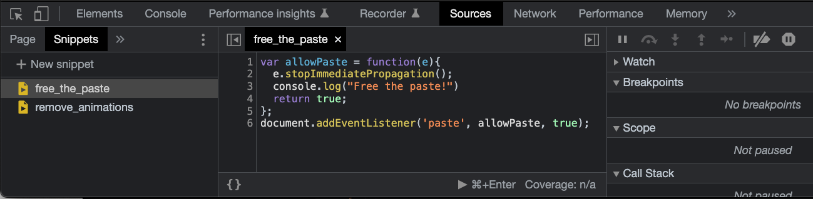

If you were affected by the [LastPass breach](https://blog.lastpass.com/2022/12/notice-of-recent-security-incident/) at the end of 2022, you've probably found yourself on various websites changing passwords. You may have also noticed that some websites block pasting in a password field. For some reason, the companies behind these seem to think that being able to paste in a password field is insecure. But it's actually the opposite, forcing users to manually type in a password one character at a time encourages the use of weak passwords - shorter and easier to type in. It can also interfere with password managers, although some of them may be able to work around it.

My first reaction when encountering this behaviour was irritation at being blocked from performing a basic function. My second reaction was curiosity - how does this work and is there anything that can be done about it? The good news is yes! This post will show how to work around this frustrating user experience.

## Solution

Next time you encounter a website that won't let you paste into a password (or any other) field, open Developer Tools (<kbd class="markdown-kbd">Cmd</kbd> + <kbd class="markdown-kbd">Option</kbd> + <kbd class="markdown-kbd">I</kbd> on a Mac if using Chrome), make sure you're in the Console tab, and paste in the following lines:

```javascript
var allowPaste = function(e) {
  e.stopImmediatePropagation();
  console.log("Free the paste!")
  return true;
};
document.addEventListener('paste', allowPaste, true);
```

Now, without refreshing the page, try to paste again in the field that wouldn't allow it before - you should now be able to paste, hurray!

### Snippet

To avoid having to remember those lines and paste them in the console each time, they can be saved in a [Snippet](https://developer.chrome.com/docs/devtools/javascript/snippets/) as follows:

1. With Developer Tools open, click on the Sources tab.
2. There should be another panel open on the left hand side with tabs like Page, Filesystem, Snippets. Click on Snippets.
3. Click on "+ New Snippet" at the top of the Snippets tab.
4. This will open up an editor in the middle panel - paste in the lines of JavaScript from above, and press <kbd class="markdown-kbd">Cmd</kbd> + <kbd class="markdown-kbd">S</kbd> to save it.
5. Chrome will automatically assign the snippet a name, shown in the snippet listing in the left panel such as "Script snippet #1". Right-click on it, select Rename, and name it whatever you like. I name mine "free_the_paste".

When you're finished, it should look something like this:



To use the snippet, next time you land on a page that is preventing pasting into a field, open dev tools, click on the snippet, then hit <kbd class="markdown-kbd">Cmd</kbd> + <kbd class="markdown-kbd">Enter</kbd> to run it. Then go ahead and paste to your hearts content.

If you'd like to test this out, I've created an [example page](https://danielabar.github.io/messing_with_paste/) with some input fields that block paste.

## How Does it Work?

In order to understand why the snippet works, we first need to understand how paste is blocked in the first place. If you inspect any input field that has paste blocked, it will most likely look like this:

```html
<input type="password" id="some_field" name="some_field" onpaste="return false;">
```

This makes use of the `paste` event. According to [MDN](https://developer.mozilla.org/en-US/docs/Web/API/Element/paste_event):

> The paste event fires when the user initiates a paste action through the browser's user interface.

That bit in the markup `onpaste="return false;"` overrides the default action, which is to insert the contents of the clipboard into the field at the cursor position. It's equivalent to the following, which adds an event handler to the field using the `onpaste` property of the field:

```javascript
const some_field = document.querySelector("#some_field");
some_field.onpaste = (event) => {
  return false;
}
```

Alternatively, it could be implemented using the [addEventListener](https://developer.mozilla.org/en-US/docs/Web/API/EventTarget/addEventListener) method of the text field:

```javascript
const some_field = document.querySelector("#some_field");
some_field.addEventListener("paste", (event) => {
  event.preventDefault();
});
```

The end result of returning false from an override of the `paste` event (or invoking `preventDefault()` on the event with `addEventListener`) is that nothing happens when the user attempts to pastes in content.

Now let's take a closer look at the solution, which was to add another event listener on the document:

```javascript
var allowPaste = function(e) {
  e.stopImmediatePropagation();
  console.log("Free the paste!")
  return true;
};
document.addEventListener('paste', allowPaste, true);
```

There's two concepts to understand for why the above code has the effect of undoing the paste blocking code.

### Element Nesting

The first concept is that when an event is fired on a DOM element (eg: by user clicking, pasting, etc), that element could be nested within other elements, which in turn are contained in the body tag, which is contained in the html tag, which is contained in the document. And all of these elements receive the event in turn, for example, given the following markup:


```html
<!DOCTYPE html>
<html lang="en">

<head>
  <title>Messing with Paste</title>
</head>

<body>
  <div class="container">
    <input type="password" id="some_field" name="some_field" onpaste="return false;">
  </div>
</body>
</html>
```

When a user pastes into `some_field`, the paste event is first fired on the input element (which has a handler that prevents the actual paste from happening). But the execution doesn't end there, the `paste` event is then also fired in turn on:

1. The `container` div that the input field is contained in.
2. The `body` element, which the container div is directly contained in.
3. The `html` element that wraps the `body` and is the root of the DOM tree.
4. The `document` object which represents the DOM for the current page.
5. The `window` object which contains the entire DOM tree and all other browser-related objects.

This is referred to as event bubbling, the event is first handled by the element that received the event, and then bubbles all the way up the DOM tree.

This means the order matters. If you were to attempt to add an event listener via dev tools to a page with the above markup like this:

```javascript
document.addEventListener('paste', function () {
  console.log('Document pasted!');
  // Try to do something to unblock paste?
});
```

It would be too late. Because the `input` element receives the `paste` event first, and has already returned false to block it. Your code would still run and would still see `Document pasted!` in the console, but it would be too late to do anything to undo the paste blocking.

What's needed is a way to reverse the order of event handling so that the event listener being added to the `document` via our "free the paste" snippet can run *before* the event is received by the input element. This leads to the second concept that's needed to understand the solution.

### Bubbling vs Capture

Let's take a closer look at the last line of the solution snippet that adds an event listener for the `paste` event. Specifically, notice the third argument `true`:

```javascript
document.addEventListener('paste', allowPaste, true);
```

If you've done any web development, you've probably used the two argument version of the `addEventListener` method:

```javascript
document.addEventListener('someEvent', someFunction)
```

However, there's also a three argument version of this method:

```javascript
document.addEventListener('someEvent', someFunction, useCapture)
```

The third argument is a boolean indicating whether the event should be handled in the capture or bubbling phase. It defaults to false which means if not specified, it will be handled during the bubbling phase. The bubbling phase is probably the most familiar to web developers. This is where the event bubbles up the DOM tree, starting from the element that received the event (for example, an input field with a listener for the paste event), then the form or whatever dom element the field is contained in, and so on up to the body, html, document, and window. This is also known as event propagation.

But it turns out, *before* the bubbling phase runs, there is a capturing phase for event handling that goes in the opposite direction. This is also event propagation, but it goes down the DOM tree. For our simple example, the order of event handling would be:

1. The `window` object which contains the entire DOM tree and all other browser-related objects.
2. The `document` object which represents the DOM for the current page.
3. The `html` element that wraps the `body` and is the root of the DOM tree.
4. The `body` element, which the container div is directly contained in.
5. The `container` div that the input field is contained in.
6. The `input` field.

Now we can see the usefulness of setting `useCapture` to `true` in an event handler. It gives you a chance to run some code *before* other event handlers that are part of the website you're visiting.

The last bit of this solution is to know that there's a method [stopImmediatePropagation](https://developer.mozilla.org/en-US/docs/Web/API/Event/stopImmediatePropagation) available on the event that prevents other listeners of the same event from being called. So for example, if you've plugged into the capture phase (event going down from window to element) and were to call `stopImmediatePropagation`, any elements lower in the DOM tree would never receive the event.

This is exactly what's needed to undo the paste blocking. Here's the solution snippet again with comments explaining what we've just learned:

```javascript
// Prevent any further event listeners from receiving event `e`.
var allowPaste = function(e) {
  e.stopImmediatePropagation();
  console.log("Free the paste!")
  return true;
};

// Listen for the `paste` event during the capture phase,
// i.e. as the event propagates down the DOM tree rather
// than up.
document.addEventListener('paste', allowPaste, true);
```

<aside class="markdown-aside">
Note that <a class="markdown-link" href="https://developer.mozilla.org/en-US/docs/Web/API/Event/stopImmediatePropagation">stopImmediatePropagation</a> is different from <a class="markdown-link" href="https://developer.mozilla.org/en-US/docs/Web/API/Event/preventDefault">preventDefault</a>, which stops the default action from occurring on the element that received the event, but does allow the event to bubble up or capture the DOM tree as it normally would. Read this excellent post from Wes Bos for a <a class="markdown-link" href="https://wesbos.com/javascript/05-events/targets-bubbling-propagation-and-capture">deeper explanation</a> of event phases.
</aside>

## Conclusion

This post has demonstrated how to work around web sites that prevent pasting into input fields with a few lines of JavaScript. It also covered an explanation of bubbling vs capturing phases in event handling and how this can be used to run custom code from the dev tools before the existing web site code runs.
