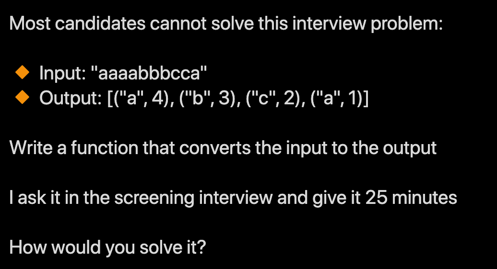

A few months ago, I came across a tweet posing a technical interview question for a data science position using Python:

Let's set aside for a moment whether this style of interviewing is useful in identifying good software developers. Plenty has been written about the problems with technical interviews so I don't want to get too much into that. Suffice to say when I'm faced with this type of question in a technical interview and a hard time limit, i.e. implying that there are bad consequences to not being able to solve it in a relatively short time limit, this is my reaction:

Why? Because being asked to solve something like this on the spot with someone watching you and waiting for a result is unnatural. In nearly 20 years of working as a software developer, its never been the case that as part of a conversation with a manager, product owner, colleagues etc. that anyone expected a piece of code to be written immediately on the spot during that conversation while they watched the developer. Usually everyone goes back to their desk (or comfort of their home office), does a little research if needed on various language APIs, tries out a few things in a REPL, then gradually comes up with a solution (and hopefully some tests!)

But regardless, found myself curious about solving this, although not in Python. It's been quite a few years since I worked in that language and have since pivoted to Ruby/Rails. So thought it would be fun to break down this problem in Ruby and solve it TDD style with RSpec. Caveat: Ruby is not the [go-to language for data science](https://www.quora.com/Is-Ruby-a-good-language-for-data-science?share=1), so this is just an exercise to get some practice with Ruby.

At first glance the problem seems relatively straightforward, given an input string such as `'aaaabbbcca'`, return a data structure containing a key for each letter, and the value being the count of how many times the letter appears in the string. But looking more closely, that's not what's being asked. Notice the last letter `a` in the input string appears separate from the first 4 `a`s in the beginning of the string. Then the expected output has two entries for the letter `a`. The first entry has a count of 4, and the last entry has a count of 1. So the question is actually asking to identify counts of repeating sequences of letters.