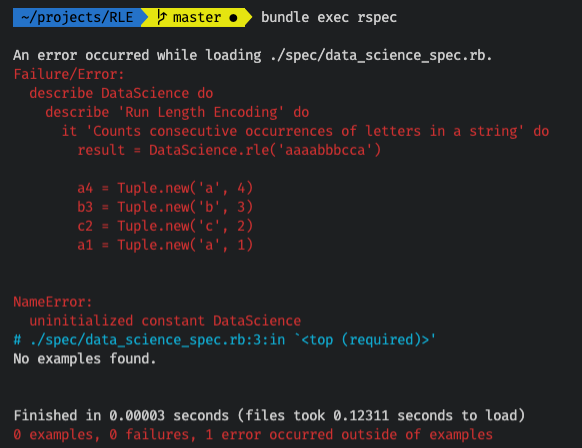
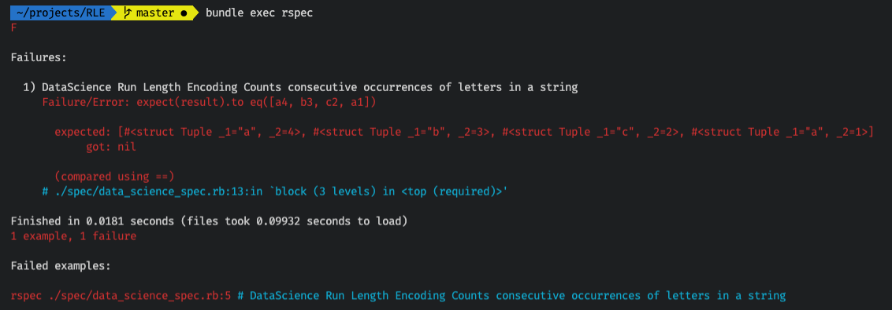
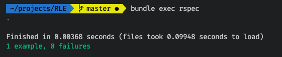
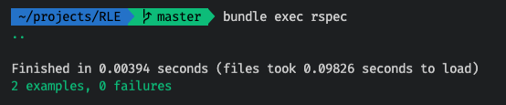
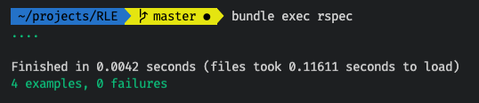
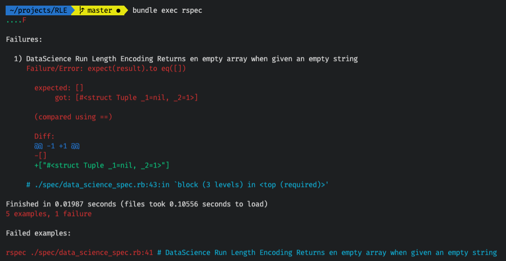
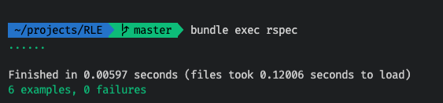

A few months ago, I came across a tweet posing a technical interview question for a data science position using Python:


Let's set aside for a moment whether this style of interviewing is useful in identifying good software developers. Plenty has been written about the problems with technical interviews so I don't want to get too much into that. Suffice to say when I'm faced with this type of question in a technical interview, this is my reaction:


Why? Because being asked to solve something like this on the spot with someone timing you and waiting for a result is unnatural. In nearly 20 years of working as a software developer, its never been the case that as part of a conversation with a manager, product owner, colleagues etc. that anyone expected a piece of code to be written immediately on the spot during that conversation while they watched me code. Typically, the actual coding work is done when developer goes back to their desk (or comfort of their home office), does a little research if needed on various language APIs, tries out a few things in a REPL, then gradually comes up with a solution, and hopefully some tests. Even better if there's also some documentation produced and later, a demo to the team on how the new feature works.

But regardless of my thoughts on technical interviews, found myself curious about solving this, although not in Python. It's been quite a few years since I worked in that language and have since pivoted to Ruby/Rails. So thought it would be interesting to break down this problem in Ruby and solve it TDD style with RSpec.

## Caveats

Ruby is [not the go-to language for data science](https://www.quora.com/Is-Ruby-a-good-language-for-data-science?share=1), and my experience is primarily with web development, not data science, so this is just an exercise to get some practice with Ruby.

## Analysis

At first glance the problem seems relatively straightforward, given an input string such as `'aaaabbbcca'`, return a data structure containing a key for each letter, and the value being the count of how many times the letter appears in the string. But looking more closely, that's not what's being asked. Notice the last letter `a` in the input string appears separate from the first 4 `a`s in the beginning of the string. Then the expected output has two entries for the letter `a`. The first entry has a count of 4, and the last entry has a count of 1. So the question is actually asking to identify counts of repeating sequences of letters. This problem is known as [Run-length encoding](https://en.wikipedia.org/wiki/Run-length_encoding).

What this means is that as each letter in the string is being processed, we need to "remember" what the previous letter we just processed was. This is because the decision whether to increment a given letter counter or start a new counter will depend on whether the previous letter was the same as the current one (in which case, increment counter) or different than the current one (in which case, start a new counter).

A general technique for this is before entering the loop, grab the first letter of the input string and store it in a variable. Then loop over the remaining letters in the string. At each iteration in the loop, compare current letter to previous, process it accordingly, then update the "previous letter" to the current letter in the loop. This way when the next loop iteration runs, it will have access to the letter that was processed in the previous iteration.

To solve these types of problems, I find it useful to write down the solution in plain English. This allows for a focus on logic, without worrying about language-specific syntax or even data structures. Something like this:

```
Start by assigning "previous letter" to the first letter in the input
Record the first entry as this letter, with a count of 1
Add this entry to list of results which will eventually be returned

For each letter in input string starting from second letter
  If the current letter is the same as the previous letter
    Increment the counter for this letter in the entry created earlier
  Else
    Create a new entry for this letter with a count of 1
    Add this entry to results
  End If

  Update the "previous letter" to the current letter for next loop iteration
End Loop

Return results
```

## Tuples

Now that the logic is sorted out, it's time to write some Ruby code. But before we do, let's take a closer look at the expected output, keeping in mind the original question is in Python:

```python
# Example input:
"aaaabbbcca"
# Expected output:
[("a", 4), ("b", 3), ("c", 2), ("a", 1)]
```

This is an array of tuples, which don't exist natively in Ruby but can be approximated with a `Struct` as follows:

```ruby
Tuple = Struct.new(:_1, :_2)
a_count = Tuple.new("a", 4)
a_count._1
=> "a"
a_count._2
=> 4
```

See this [SO answer](https://stackoverflow.com/questions/525957/using-tuples-in-ruby) for more details.

## Setup for TDD

Next step is to get a TDD workflow going with RSpec. If you want to know more about TDD, I've [written about it here](/blog/tdd-by-example/). Up until this point, my experience with RSpec has been using it with Rails, but turns out, it can also be used for a plain "vanilla" Ruby project as follows:

```bash
mkdir RLE  # this will be project name, name this whatever you want
cd RLE
touch Gemfile
```

Edit the `Gemfile` so it looks as follows:

```ruby
# Gemfile
rubocopsource 'https://rubygems.org/'

gem 'rspec'
```

Then back in the terminal:

```bash
gem install bundler  # only if you don't already have it
bundle install
bundle exec rspec --init
touch data_science.rb  # this will be the module where we will write the code, name it whatever you want
touch spec/data_science_spec.rb  # the corresponding test file
```

At this point, the project directory should look as follows: (the `spec_helper.rb` file was generated by the `rspec --init` command run in previous step):

```
.
├── Gemfile
├── Gemfile.lock
├── data_science.rb
└── spec
    ├── data_science_spec.rb
    └── spec_helper.rb
```

Now open the project in your editor of choice and open the test file `data_science_spec.rb`.

I'm planning to write the method that implements the interview question logic in a method named `rle`, which will be defined in a module named `DataScience`. This module and method will live in the `data_science.rb` file. They haven't been written yet so of course any tests written for this module/method will fail but that's ok, this is the start of the TDD process. I'm also expecting the `Tuple` struct to be defined in the `DataScience` module.

```ruby
# spec/data_science_spec.rb
require './data_science'

describe DataScience do
  describe 'Run Length Encoding' do
    it 'Counts consecutive occurrences of letters in a string' do
      result = DataScience.rle('aaaabbbcca')

      a4 = Tuple.new('a', 4)
      b3 = Tuple.new('b', 3)
      c2 = Tuple.new('c', 2)
      a1 = Tuple.new('a', 1)

      expect(result).to eq([a4, b3, c2, a1])
    end
  end
end
```

To run the tests, open a terminal and enter:

```bash
bundle exec rspec
```

The test should fail because the module hasn't been defined:



Let's fix that by defining the module, method and Tuple struct in `data_science.rb`:

```ruby
# data_science.rb

# Unlike Python, Ruby doesn't have native tuples.
Tuple = Struct.new(:_1, :_2)

module DataScience
  # RLE (run-length encoding): Encode each character by the number of times it appears consecutively.
  def self.rle(input)
    # TBD...
  end
end
```

Run the test again with `bundle exec rspec`. This time it fails comparing an array of tuples (expected value from test) to `nil` which is what is currently being returned because the `rle` method has not yet been implemented:



## Implementation

Now that there's a failing test and a scaffold of the module, we can finally implement the `rle` method to make the test pass. I filled in lines of code to go along with the English logic written earlier. To keep track of letter counters, a hash is used to conveniently lookup letters that have already been seen and increment their counters. Leaving in the English as explanatory comments (if strictly following clean code principles, further methods with more meaningful names can be extracted and comments removed, but for this exercise, simpler to read all the code linearly from top to bottom):

```ruby
# data_science.rb

# Unlike Python, Ruby doesn't have native tuples.
Tuple = Struct.new(:_1, :_2)

module DataScience
  # RLE (run-length encoding): Encode each character by the number of times it appears consecutively.
  def self.rle(input)
    # Keep track of letters that have been seen for incrementing consecutive counter.
    track = {}

    # Array of results to be returned.
    result = []

    # Initialize based on first character in input string
    previous_letter = input[0]
    track[previous_letter] = Tuple.new(previous_letter, 1)
    result << track[previous_letter]

    # Process input string one character at a time, starting from second character
    for i in 1..input.length - 1 do
      current_letter = input[i]

      # If the current letter was just seen in the previous iteration, increment its tracking counter,
      # but do not append anything to results because its already been appended.
      track[previous_letter]._2 += 1 if current_letter == previous_letter

      # Otherwise start tracking a new letter and add it to results
      if current_letter != previous_letter
        track[current_letter] = Tuple.new(current_letter, 1)
        result << track[current_letter]
      end

      # The letter that has just been processed (current) now becomes the previous for next iteration
      previous_letter = current_letter
    end
    result
  end
end
```

This time the test should pass:



## Edge Cases

It appears we now have a working solution, but it's good to push it a little with some variety of inputs. In the example given from the original tweet, all the initial letters have some repeating sequences. But what happens if there are letters that repeat, but not sequentially? For example an input of "abab" should return `[("a", 1), ("b", 1), ("a", 1), ("b", 1)]`. Let's add a test for this case:

```ruby
require './data_science'

describe DataScience do
  describe 'Run Length Encoding' do
    it 'Counts consecutive occurrences of letters in a string' do
      # ...
    end

    it 'Handles alternating letters' do
      result = DataScience.rle('abab')

      a1 = Tuple.new('a', 1)
      b1 = Tuple.new('b', 1)

      expect(result).to eq([a1, b1, a1, b1])
    end
  end
end
```

The tests are still passing so this case is handled, good!



What about if there's only a single character, repeating or not? A few more tests for this:

```ruby
require './data_science'

describe DataScience do
  describe 'Run Length Encoding' do
    it 'Counts consecutive occurrences of letters in a string' do
      # ...
    end

    it 'Handles alternating letters' do
      # ...
    end

    it 'Handles a single character occurring once' do
      result = DataScience.rle('z')

      z1 = Tuple.new('z', 1)

      expect(result).to eq([z1])
    end

    it 'Handles a single character occurring multiple times' do
      result = DataScience.rle('zzzzz')

      z1 = Tuple.new('z', 5)

      expect(result).to eq([z1])
    end
  end
end
```

All tests still passing:



How about en empty string? Hmm... what should the result be in this case? If this were for a product, this would be a good case to discuss with the product owner or with the team if there's an established standard on how to handle the empty case. For this exercise, let's assume an empty array should be returned to indicate there are no sequences.

```ruby
require './data_science'

describe DataScience do
  describe 'Run Length Encoding' do
    it 'Counts consecutive occurrences of letters in a string' do
      # ...
    end

    it 'Handles alternating letters' do
      # ...
    end

    it 'Handles a single character occurring once' do
      # ...
    end

    it 'Handles a single character occurring multiple times' do
      # ...
    end

    it 'Returns en empty array when given an empty string' do
      result = DataScience.rle('')
      expect(result).to eq([])
    end
  end
end
```

This time get a failure:



The problem happens at lines 14-16 of the `rle` method which initializes the results. In Ruby, getting the first character of an empty string returns nil. So the code adds a Tuple of `(nil, 1)` to results and returns an array with this entry:

```ruby
previous_letter = input[0]
track[previous_letter] = Tuple.new(previous_letter, 1)
result << track[previous_letter]
```

Let's fix this by first checking if the input is an empty string. While we're at it, might as well also check for nil. If this was a Rails project, could use the handy `blank?` method to check for nil or empty with a single method. But in plain Ruby, can use `variable.to_s.empty?` as explained in [this SO answer](https://stackoverflow.com/a/9915384/3991687).

```ruby
module DataScience
  def self.rle(input)
    return [] if input.to_s.empty?

    # rest of the code...
  end
end
```

Add another test for nil case and re-run:

```ruby
require './data_science'

describe DataScience do
  describe 'Run Length Encoding' do
    it 'Counts consecutive occurrences of letters in a string' do
      # ...
    end

    it 'Handles alternating letters' do
      # ...
    end

    it 'Handles a single character occurring once' do
      # ...
    end

    it 'Handles a single character occurring multiple times' do
      # ...
    end

    it 'Returns en empty array when given an empty string' do
      result = DataScience.rle('')
      expect(result).to eq([])
    end

    it 'Returns en empty array when given nil' do
      result = DataScience.rle(nil)
      expect(result).to eq([])
    end
  end
end
```



Success, edge cases are now passing!

For the complete code and project, go ahead and [clone it on Github](https://github.com/danielabar/RLE).

## Conclusion

To circle back to the original tweet that inspired all this, I didn't time myself exactly but estimate spent approximately an hour. Figuring out the actual logic was around half hour, with some extra time researching how to model Tuples in Ruby. Then more time researching how to setup a plain Ruby project with RSpec, and time to write the tests. Then a little more time thinking of edge cases. This was definitely a useful exercise, I learned a few new things including:

* The term "run length encoding"
* Use of Ruby `Struct` to model a tuple.
* Use of `some_var.to_s.empty?` to check for nil or empty in a single expression.
* How to setup a plain Ruby project with RSpec tests.

What do you think of all this? Tweet me if you have some thoughts on - is there a faster/better way to implement run length encoding in Ruby? Have I missed some test cases? What do you think of this style of interview question?