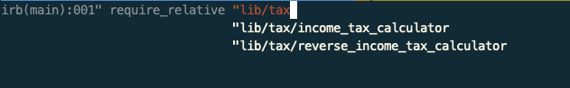
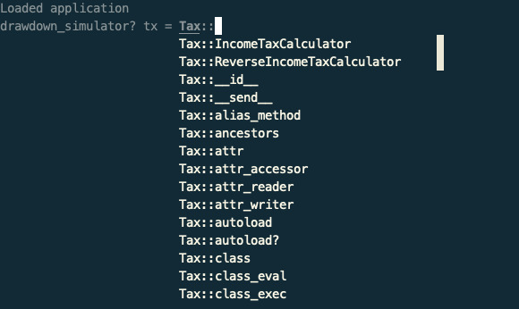
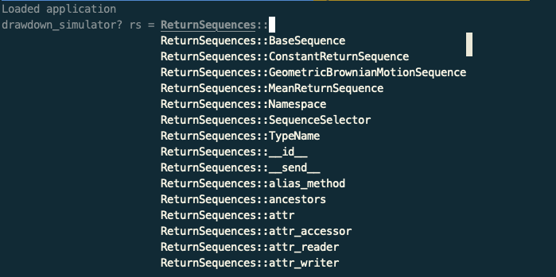

I've been working on a Ruby project without Rails. It's a CLI tool that simulates retirement drawdown strategies for Canadians (I'll write a future blog post with more details on that). While building it, I found myself missing the convenience of the Rails console (`bin/rails console`), which loads all application code, for interactive exploration and debugging.

For example, in my project, I have both a tax calculator and a reverse tax calculator. Aside from formal unit tests, it's useful to experiment with these classes interactively. Similarly, I have market return sequence generators that I may want to inspect directly. A console enables exploratory coding — it's not a replacement for tests but is great for quickly validating ideas.

This post will explain how to setup a Rails-like console environment, for a plain Ruby project.

## Project Structure

Here is my project structure (ignoring documentation and test folders). Aside from the `main.rb` entrypoint, all the code is organized in the `lib` folder, with sub-folders under that:
```
.
├── Gemfile
├── Gemfile.lock
├── README.md
├── lib
│   ├── account.rb
│   ├── app_config.rb
│   ├── first_year_cash_flow.rb
│   ├── numeric_formatter.rb
│   ├── output
│   │   ├── console_plotter.rb
│   │   └── console_printer.rb
│   ├── return_sequences
│   │   ├── base_sequence.rb
│   │   ├── constant_return_sequence.rb
│   │   ├── geometric_brownian_motion_sequence.rb
│   │   ├── mean_return_sequence.rb
│   │   └── sequence_selector.rb
│   ├── run
│   │   ├── app_runner.rb
│   │   ├── simulation_detailed.rb
│   │   └── simulation_success_rate.rb
│   ├── simulation
│   │   ├── simulation_evaluator.rb
│   │   └── simulator.rb
│   ├── strategy
│   │   ├── rrif_withdrawal_calculator.rb
│   │   ├── rrsp_to_taxable_to_tfsa.rb
│   │   └── withdrawal_planner.rb
│   ├── tax
│   │   ├── income_tax_calculator.rb
│   │   └── reverse_income_tax_calculator.rb
│   ├── withdrawal_amounts.rb
│   └── withdrawal_rate_calculator.rb
└── main.rb
```

Before getting into the automated solution, let's cover how you could load and run any individual class from a project manually.

On any Ruby project (and also Rails projects), you can always run [irb](https://ruby.github.io/irb/#label-Overview) at the terminal, to get into an interactive Ruby session. `irb` is a default gem of Ruby so no need to install it, if you've installed Ruby, then you already have `irb`. However, by default, it doesn't know about any code in the project, even when it's run from the root of the project. For example:

```ruby
# Try to instantiate the tax calculator
irb(main):004> tx = Tax::IncomeTaxCalculator.new

# Error because the Tax::IncomeTaxCalculator class hasn't been loaded
# (irb):1:in `<main>': uninitialized constant Tax (NameError)
# tx = Tax::IncomeTaxCalculator.new
#      ^^^
# 	from <internal:kernel>:187:in `loop'
```

This could be resolved by running `require_relative ...` in the irb session, for one specific file. Helpfully, irb has [autocompletion](https://ruby.github.io/irb/?search=autocomplete#label-Automatic+Completion) so when you start typing a path for the `require_relative` method, it suggests files from the contents of the current directory:



```ruby
irb(main):002> require_relative "lib/tax/income_tax_calculator"
=> true

# Now the tax calculator class can be used
 tx = Tax::IncomeTaxCalculator.new
# => <Tax::IncomeTaxCalculator:0x000000011def7270
# ...
```

But this is tedious to have to do every time you want to experiment with some of your project code. It would be nice if all the project code was always available, any time you ran `irb` form your project root. The next sections will walk through how to set this up.

## Define `config/environment.rb`

The first step is to create a `config` directory, and an `environment.rb` file in that directory:

```bash
mkdir config
touch config/environment.rb
```

Edit `config/environment.rb` to load all project dependencies from the Gemfile, and all source files in the `lib` directory:

```ruby
# frozen_string_literal: true

# Load all dependencies from Gemfile or standard Ruby library
require "descriptive_statistics"
require "tty-progressbar"
require "tty-table"
require "unicode_plot"
require "yaml"

# Load all project source files from lib dir and its subdirectories
Dir.glob(File.expand_path("../lib/**/*.rb", __dir__)) { |file| require file }
```

That one line `Dir.glob(File.expand_path("../lib/**/*.rb", __dir__)).each { |file| require file }` is doing all the heavy lifting of loading the project source.

**Explanation:**

`__dir__` is a built-in method provided by the [Kernel module](https://docs.ruby-lang.org/en/3.2/Kernel.html#method-i-__dir__) that returns the absolute path of the directory containing the current file. Since it's being called in the `config/environment.rb` file, it's value will be ` /path/to/project/config`.

`File.expand_path` converts a pathname to an absolute pathname. When given an optional `dir_string` argument, which we're doing here by passing in `__dir__`, it uses the `dir_string` as a starting point. But the first argument we're passing in says to go up one directory. So this will return `/path/to/project/lib/**/*.rb`.

The `Dir.glob` method expands it's first argument, which in our case is a pattern string `/path/to/project/lib/**/*.rb`. It returns an array of all matching file names, which in this case will be all Ruby files contained in the `lib` directory and all of its subdirectories.

Finally, when given a block `Dir.glob`, will execute that block for each file matching the pattern. In our case, we pass in a block to `require` the file. This is what makes all classes in the project available in the irb session.

## Create Project Specific `.irbrc`

Now that we have the potential to load all project dependencies from a single file, the next step is to ensure this file is always run when starting an irb session. To achieve this, create a `.irbrc` file in the project directory. This provides an opportunity to customize the behaviour of [irb](https://ruby.github.io/irb/) when started from the project root.


Edit the project level `.irbrc` file so it has the following. Note that any valid Ruby can be placed in this file:

```ruby
# Load all the project source
require_relative "config/environment"
puts "Loaded application"

# Optionally customize the prompt
IRB.conf[:PROMPT][:APP] = {
  PROMPT_I: "drawdown_simulator> ",  # Standard input prompt
  PROMPT_N: "drawdown_simulator* ",  # Multiline input
  PROMPT_S: "drawdown_simulator%l ", # String continuation
  PROMPT_C: "drawdown_simulator? ",  # Indentation level
  RETURN: "=> %s\n" # Format of return value
}

IRB.conf[:PROMPT_MODE] = :APP # Set custom prompt
```

TODO: ASIDE explain about default config in home dir, but it can be overridden on a project level because irb will look in the current directory. Reference [Configuration File Path Resolution](https://ruby.github.io/irb/Configurations_md.html#label-Configuration+File+Path+Resolution).

## Launch custom irb

Now when you run `irb` at the terminal, it will first run all the code in `.irbrc` in the project root. If you chose to customize the prompt, it will display the project name instead of the default `irb(main)>` prompt:

```
Loaded application
drawdown_simulator>
```

All project classes will be loaded, so you can now interact with them, without having to explicitly load them. And just like before when we saw autocompletion in effect for the one class we manually loaded, it's now available for all of them. For example:





## Optionally Create `bin/console`

If rather than running `irb`, you're used to the "muscle memory" of running a `bin` script, as has become standard on Rails projects, you can layer that on with the irb customization as follows:

Create a `bin` directory and a `console` file in that directory, which needs to be executable:

```bash
mkdir bin
touch bin/console
chmod +x bin/console
```

Edit `bin/console` as follow:

```ruby
#!/usr/bin/env ruby

require "irb"

# This will use project level `.irbrc` so no need to load config/environment here.
IRB.start
```

Now, you can start an interactive session with:

```sh
bin/console
```

It will behave the same as having run `irb`.

## Bonus: Use `config/environment.rb` for Tests and Main Entry Point

Instead of manually requiring files in multiple places, you can include `config/environment.rb` in your main script (`main.rb`) and spec helper to keep things DRY.

TODO: show it in my main.rb and spec helper (assuming using rspec for testing).

This approach provides a lightweight, Rails-like console experience for any Ruby project, making interactive debugging and exploration just as easy as when using Rails.

## TODO
* WIP "muscle memory" of bin scripts - introduce bin/console that starts irb
* alternative: if don't want to customize .irbrc (eg: on a team and everyone has different opinions of how they want to customize it even at project level), could instead require config/environment from bin/console for similar effect, then leave everyone to put whatever they want in projrect level .irbrc and gitignore it.
* Verify: if already have irbrc customizations in home dir `~/.irbrc`, adding project level will override but not replace other settings
* Show updated project structure with `config` dir and optional `bin` dir (which can be useful for other bin scripts such as rspec, rubocop, etc.)
* Reference other irb configuration options (just barely scratched the surface here): https://ruby.github.io/irb/Configurations_md.html
* WIP main content
* organize headings/sub-headings
* conclusion para
* edit
