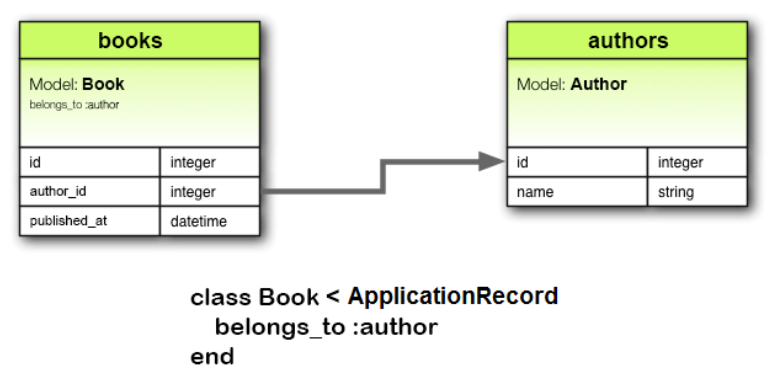
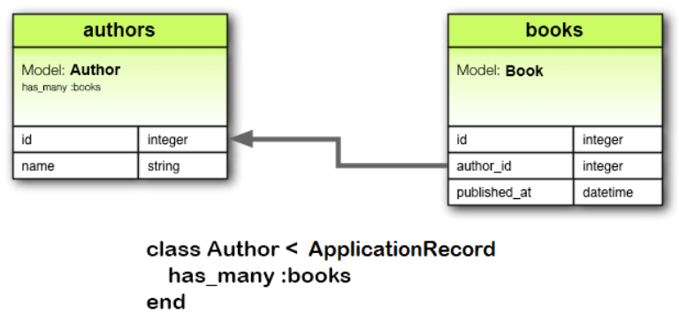

Rails makes defining relationships between models using Active Record associations super easy. Simply add a macro style declaration such as `has_one`, `has_many`, `belongs_to` etc. to your model and Rails will take care of maintaining the relationship. However, some thought is required when it comes to *removing* data from the database, while maintaining data integrity such as foreign key constraints. All the Rails courses and tutorials I've done so far cover adding associations, but none have covered what happens when a record with associations needs to be removed.

Many years ago, before the likes of GDPR and privacy concerns, the "solution" was to never remove any data or use logical, a.k.a [soft delete](https://stackoverflow.com/questions/378331/physical-vs-logical-hard-vs-soft-delete-of-database-record). But with increased privacy regulations and the [right to be forgotten](https://en.wikipedia.org/wiki/Right_to_be_forgotten), applications need the ability to safely remove certain data.

The Rails Guide on [Active Record Associations](https://guides.rubyonrails.org/association_basics.html) does cover deletion options. However, since there are so many options besides just for deletion, found myself scrolling up and down through the docs and losing track of which side of the association was being referred to. Also, since different options can be specified on each side of an association, it can be tricky to reason about what would happen with various *combinations* of options.

A further complexity is that there are two different ways to remove an ActiveRecord model in rails: Delete and Destroy. They sound similar but do slightly different things (more on this later). If you add that into the mix of removal options, the number of scenarios grows even further.

In the vein of "a picture is worth a thousand words", I decided to build a sample Rails application and do a deep dive on all the removal options for some commonly used associations and how they behave when deleting or destroying a record. This post will walk through the results of this.

## Project Setup

I started by scaffolding a new Rails project with Ruby 3 and Rails 7, using the default SQLite database:

```
rbenv install 3.1.2
rbenv local 3.1.2
gem install rails -v 7.0.4
rails new learn-associations
cd learn-associations
```

I added the [annotate](https://github.com/ctran/annotate_models) gem to add the corresponding table schema as code comments above each model class:

```ruby
# Gemfile
group :development do
  gem "annotate"
end
```

I then generated several models to study the `belongs_to` and `has_many` associations. This is a very common use case. For example, in an e-commerce application a Customer has many Orders, and an Order belongs to a single Customer. Or a Product has many Sku variations, and a Sku belongs to a Product. For this sample application, I used the Book and Author models from the [Active Record Associations Guide](https://guides.rubyonrails.org/association_basics.html#the-belongs-to-association):





I also added a `title` attribute to the `Book` model to make it easier to look up individual books for removal.

Here are the commands to generate the models, which also generate the migrations to create the tables. I also generated a `Post` model that is not associated with anything, to demonstrate the difference between destroy and delete in a simple case where there are no associated models.

```bash
# simple model with no associations to demonstrate difference between destroy and delete
bin/rails generate model post title:string body:text

# models with associations
bin/rails generate model author name:string
bin/rails generate model book title:string published_at:date author:references
```

Here are the migrations that are generated. Notice that the Book model has a foreign key reference to an Author since each Book belongs to one Author. The Post model is not related to anything:

```ruby
class CreatePosts < ActiveRecord::Migration[7.0]
  def change
    create_table :posts do |t|
      t.string :title
      t.text :body

      t.timestamps
    end
  end
end
```

```ruby
class CreateAuthors < ActiveRecord::Migration[7.0]
  def change
    create_table :authors do |t|
      t.string :name

      t.timestamps
    end
  end
end
```

```ruby
class CreateBooks < ActiveRecord::Migration[7.0]
  def change
    create_table :books do |t|
      t.string :title
      t.date :published_at
      t.references :author, null: false, foreign_key: true

      t.timestamps
    end
  end
end
```

After running the migrations, here are the model classes showing that an Author has many Books and a Book belongs to an Author. The Post model has no associations. The schema information was added by the [annotate](https://github.com/ctran/annotate_models) gem:

```ruby
# == Schema Information
#
# Table name: posts
#
#  id         :integer          not null, primary key
#  body       :text
#  title      :string
#  created_at :datetime         not null
#  updated_at :datetime         not null
#
class Post < ApplicationRecord
end
```

```ruby
# == Schema Information
#
# Table name: authors
#
#  id         :integer          not null, primary key
#  name       :string
#  created_at :datetime         not null
#  updated_at :datetime         not null
#
class Author < ApplicationRecord
  has_many :books
end
```

```ruby
# == Schema Information
#
# Table name: books
#
#  id           :integer          not null, primary key
#  published_at :date
#  title        :string
#  created_at   :datetime         not null
#  updated_at   :datetime         not null
#  author_id    :integer          not null
#
# Indexes
#
#  index_books_on_author_id  (author_id)
#
# Foreign Keys
#
#  author_id  (author_id => authors.id)
#
class Book < ApplicationRecord
  belongs_to :author
end
```

Let's seed some example Posts, Authors, and Books so that we can test what happens when trying to remove them:

```ruby
# Post is a simple model with no associations to demonstrate the difference between
# ActiveRecord methods destroy and delete
Post.create!(title: "Hello Post", body: "Learning about destroy and delete in Rails.")
Post.create!(title: "Another Post", body: "Lorem ipsum dolor sit amet, consectetur adipiscing elit.")

# Author with multiple books
author_ap = Author.create!(name: "Andrew Park")

# Author with a single book
author_jjk = Author.create!(name: "Julian James McKinnon")

# Author with no books
Author.create!(name: "John Doe")

# Create 3 books for Andrew Park and just one book for Julian James McKinnon
Book.create!(
  [
    { title: "Python Programming for Beginners", published_at: "2022-07-20", author: author_ap },
    { title: "Machine Learning: 4 Books in 1", published_at: "2020-01-20", author: author_ap },
    { title: "Python for Data Analysis", published_at: "2021-01-20", author: author_ap },
    { title: "Computer Programming Crash Course: 7 Books in 1", published_at: "2021-01-20", author: author_jjk }
  ]
)
```

Run the seeds in both the development and test databases. We'll be using the development database to experiment a little, and later the test database to automate all the experiments:

```
bin/rails db:seed
RAILS_ENV=test bin/rails db:seed
```

## Delete vs Destroy

Now I wanted to understand what would happen when attempting to remove various Author or Book records from the database with respect to their associations. However, there's an additional complexity in that there's two different methods to remove a record, which sound similar, but do slightly different things. From the [Rails API Documentation](https://api.rubyonrails.org/):

* [delete](https://api.rubyonrails.org/classes/ActiveRecord/Persistence.html#method-i-delete): Deletes the record in the database and freezes this instance to reflect that no changes should be made (since they can't be persisted). Returns the frozen instance. The row is simply removed with an SQL `DELETE` statement on the record's primary key, and no callbacks are executed.
* [destroy](https://api.rubyonrails.org/classes/ActiveRecord/Persistence.html#method-i-destroy): Deletes the record in the database and freezes this instance to reflect that no changes should be made (since they can't be persisted). There's a series of callbacks associated with destroy. If the `before_destroy` callback throws `:abort` the action is cancelled and destroy returns `false`.
* [destroy!](https://api.rubyonrails.org/classes/ActiveRecord/Persistence.html#method-i-destroy-21): Similar to `destroy`, except raises `ActiveRecord::RecordNotDestroyed` rather than returning false if the record is not destroyed.

To summarize the difference, `delete` immediately invokes SQL to remove the record from the database, whereas `destroy/destroy!` first invokes the model's `before_destroy` callback which can potentially stop the deletion. I'm assuming this could be a place for any extra cleanup code could be added.

To understand this with a simple case, let's modify the `Post` model, which has no associations, to add a `before_destroy` callback. This callback will simply output a message:

```ruby
class Post < ApplicationRecord
  before_destroy :one_last_thing

  def one_last_thing
    puts "Post model #{id} will be destroyed"
  end
end
```

Launch a Rails console with `bin/rails c` and let's see how the removal methods behave:

```ruby
post = Post.find_by(title: "Hello Post")
post.delete
# Post Destroy (3.8ms)  DELETE FROM "posts" WHERE "posts"."id" = ?  [["id", 5]]
post.frozen?
# true

another_post = Post.find_by(title: "Another Post")
another_post.destroy
# Post model 6 will be destroyed
# TRANSACTION (0.1ms)  begin transaction
# Post Destroy (0.5ms)  DELETE FROM "posts" WHERE "posts"."id" = ?  [["id", 6]]
# TRANSACTION (1.1ms)  commit transaction
```

From the above, we can see that `delete` immediately invokes the SQL `DELETE` statement whereas `destroy` first invokes the `before_destroy` callback. Now with this understood, we can move on to removal of records with associations.

## Dependent Options Matrix

Recall we have Books that `belong_to` an Author, and Author's `have_many` books. Let's start by looking at the dependent options for [belongs_to](https://guides.rubyonrails.org/association_basics.html#options-for-belongs-to-dependent):

* `:destroy` when the object is destroyed, destroy will be called on its associated objects.
* `:delete` when the object is destroyed, all its associated objects will be deleted directly from the database without calling their destroy method.

For example, to use the `destroy` option, the Book model would look like this to indicate that whenever a Book is destroyed, its associated Author should also be destroyed:

```ruby
class Book < ApplicationRecord
  belongs_to :author, dependent: :destroy
  before_destroy :one_last_thing
  def one_last_thing
    Rails.logger.warn("Book model #{id} will be destroyed")
  end
end
```

And the dependent options for [has_many](https://guides.rubyonrails.org/association_basics.html#dependent):

* `:destroy` causes all the associated objects to also be destroyed
* `:delete_all` causes all the associated objects to be deleted directly from the database (so callbacks will not execute)
* `:nullify` causes the foreign key to be set to NULL. Polymorphic type column is also nullified on polymorphic associations. Callbacks are not executed.
* `:restrict_with_exception` causes an ActiveRecord::DeleteRestrictionError exception to be raised if there are any associated records
* `:restrict_with_error` causes an error to be added to the owner if there are any associated objects

For example, to use the `destroy` option, the Author model would look like this to indicate that whenever an Author is destroyed, its Books should also be destroyed:

```ruby
class Author < ApplicationRecord
  has_many :books, dependent: :destroy
  before_destroy :one_last_thing
  def one_last_thing
    Rails.logger.warn("Author model #{id} will be destroyed")
  end
end
```

Summing up the options, there are 2 dependent options on the `belongs_to` association, plus the "option" to not specify anything which makes 3. And there are 5 dependent options on the `has_many` association, plus the do nothing "option" which makes 6. This means there are 3 * 6 = 18 possible combinations of dependent options:

| Scenario | belongs_to    | has_many                 |
|----------|---------------|--------------------------|
| [1](../rails-dependent-destroy/#scenario-1-no-dependent-options)        | not specified | not specified            |
| [2](../rails-dependent-destroy/#scenario-2-belongs-to-not-specified-and-has-many-destroy)        | not specified | :destroy                 |
| [3](../rails-dependent-destroy/#scenario-3-belongs-to-not-specified-and-has-many-delete-all)        | not specified | :delete_all              |
| [4](../rails-dependent-destroy/#scenario-4-belongs-to-not-specified-and-has-many-nullify)        | not specified | :nullify                 |
| [5](../rails-dependent-destroy/#scenario-5-belongs-to-not-specified-and-has-many-restrict-with-exception)        | not specified | :restrict_with_exception |
| [6](../rails-dependent-destroy/#scenario-6-belongs-to-not-specified-and-has-many-restrict-with-error)        | not specified | :restrict_with_error     |
| [7](../rails-dependent-destroy/#scenario-7-belongs-to-destroy-and-has-many-restrict-not-specified)        | :destroy      | not specified            |
| [8](../rails-dependent-destroy/#scenario-8-belongs-to-destroy-and-has-many-destroy)        | :destroy      | :destroy                 |
| [9](../rails-dependent-destroy/#scenario-9-belongs-to-destroy-and-has-many-delete-all)        | :destroy      | :delete_all              |
| [10](../rails-dependent-destroy/#scenario-10-belongs-to-destroy-and-has-many-nullify)       | :destroy      | :nullify                 |
| [11](../rails-dependent-destroy/#scenario-11-belongs-to-destroy-and-has-many-restrict-with-exception)       | :destroy      | :restrict_with_exception |
| [12](../rails-dependent-destroy/#scenario-12-belongs-to-destroy-and-has-many-restrict-with-error)       | :destroy      | :restrict_with_error     |
| [13](../rails-dependent-destroy/#scenario-13-belongs-to-delete-and-has-many-not-specified)       | :delete       | not specified            |
| [14](../rails-dependent-destroy/#scenario-14-belongs-to-delete-and-has-many-not-destroy)       | :delete       | :destroy                 |
| 15       | :delete       | :delete_all              |
| 16       | :delete       | :nullify                 |
| 17       | :delete       | :restrict_with_exception |
| 18       | :delete       | :restrict_with_error     |

For each combination, let's call it a scenario, I want to understand what happens given the following:

1. An Author with no books is destroyed.
2. An Author with a single book is destroyed.
3. An Author with multiple books is destroyed.
4. 1 through 3 above but deleted instead of destroyed.
5. A book belonging to an Author that only has that one book is destroyed.
6. A book belonging to an Author that has multiple other books is destroyed.
7. 5 through 6 above but deleted instead of destroyed.

So that's 7 actions * 18 scenarios = 126 actions. Definitely too much work to try out each one in the console, but easily handled by a test framework. I'll use [RSpec](https://rspec.info/) as that's what I'm familiar with, and it automatically resets the database after each example.

## Test Setup

After [adding RSpec to the project](../start-rails-6-project-with-rspec), I added the following tests for the Author and Book models. These are exploratory tests, that is, they're being used to learn what will happen rather than declaring what should happen. That's why there are no expectations, and exceptions are caught and logged.

The bang version `destroy!` is used since it raises an exception so its easier to see what went wrong. I'm also logging the beginning and ending of each test to make it clear in the log file what activity is coming from which test. Finally, a test helper is added to show the counts of how many authors and books were deleted at the end of each test:

```ruby
# spec/helpers.rb
# Add `require "./spec/helpers"` to rails_helper.rb after Rails is loaded
module Helpers
  def show_model_counts
    original_author_count = 3
    original_book_count = 4
    Rails.logger.info("  NUMBER AUTHORS DELETED: #{original_author_count - Author.count}; NUMBER BOOKS DELETED: #{original_book_count - Book.count}")
  end
end
```

```ruby
# spec/models/author_spec.rb
require "rails_helper"

describe Author, type: :model do
  before(:each) do |example|
    Rails.logger.info("\n=== BEGIN TEST #{example.metadata[:full_description]} ===")
  end

  after(:each) do
    show_model_counts
    Rails.logger.info("=== END TEST ===\n")
  end

  describe "#destroy!" do
    it "remove an author with no books" do
      author = Author.find_by(name: "John Doe")
      begin
        author.destroy!
      rescue StandardError => e
        Rails.logger.error("#{e.class} - #{e.message}")
      end
    end

    it "remove an author with a single book" do
      author = Author.find_by(name: "Julian James McKinnon")
      begin
        author.destroy!
      rescue StandardError => e
        Rails.logger.error("#{e.class} - #{e.message}")
      end
    end

    it "remove an author with multiple books" do
      author = Author.find_by(name: "Andrew Park")
      begin
        author.destroy!
      rescue StandardError => e
        Rails.logger.error("#{e.class} - #{e.message}")
      end
    end
  end

  describe "#delete" do
    it "remove an author with no books" do
      author = Author.find_by(name: "John Doe")
      begin
        author.delete
      rescue StandardError => e
        Rails.logger.error("#{e.class} - #{e.message}")
      end
    end

    it "remove an author with a single book" do
      author = Author.find_by(name: "Julian James McKinnon")
      begin
        author.delete
      rescue StandardError => e
        Rails.logger.error("#{e.class} - #{e.message}")
      end
    end

    it "remove an author with multiple books" do
      author = Author.find_by(name: "Andrew Park")
      begin
        author.delete
      rescue StandardError => e
        Rails.logger.error("#{e.class} - #{e.message}")
      end
    end
  end
end
```

```ruby
# spec/models/book_spec.rb
require "rails_helper"

describe Book, type: :model do
  before(:each) do |example|
    Rails.logger.info("\n=== BEGIN TEST #{example.metadata[:full_description]} ===")
  end

  after(:each) do
    show_model_counts
    Rails.logger.info("=== END TEST ===\n")
  end

  describe "#destroy!" do
    it "remove a book from author that only has that book" do
      book = Book.find_by(title: "Computer Programming Crash Course: 7 Books in 1")
      begin
        book.destroy!
      rescue StandardError => e
        Rails.logger.error("#{e.class} - #{e.message}")
      end
    end

    it "remove a book from author that has multiple books" do
      book = Book.find_by(title: "Python Programming for Beginners")
      begin
        book.destroy!
      rescue StandardError => e
        Rails.logger.error("#{e.class} - #{e.message}")
      end
    end
  end

  describe "#delete" do
    it "remove a book from author that only has that book" do
      book = Book.find_by(title: "Computer Programming Crash Course: 7 Books in 1")
      begin
        book.delete
      rescue StandardError => e
        Rails.logger.error("#{e.class} - #{e.message}")
      end
    end

    it "remove a book from author that has multiple books" do
      book = Book.find_by(title: "Python Programming for Beginners")
      begin
        book.delete
      rescue StandardError => e
        Rails.logger.error("#{e.class} - #{e.message}")
      end
    end
  end
end
```

## Scenario 1: No dependent options

In this scenario, we do not specify any `dependent` option on either side of the `belongs_to/has_many` relationship. So the models simply look like this:

```ruby
class Book < ApplicationRecord
  belongs_to :author
  before_destroy :one_last_thing
  def one_last_thing
    Rails.logger.warn("  Book model #{id} will be destroyed")
  end
end

class Author < ApplicationRecord
  has_many :books
  before_destroy :one_last_thing
  def one_last_thing
    Rails.logger.warn("  Author model #{id} will be destroyed")
  end
end
```

Let's run the tests with `bundle exec rspec` and then examine the `log/test.log` file:

<details class="markdown-details">
<summary class="markdown-summary">
View test log
</summary>
<pre class="grvsc-container gatsby-highlight-monokai" data-language>
<code class="grvsc-code">

=== BEGIN TEST Author#destroy! remove an author with no books ===
  <span class="rails-log-cyan">Author Load (0.3ms)</span>  <span class="rails-log-blue">SELECT "authors".* FROM "authors" WHERE "authors"."name" = ? LIMIT ?</span>  [["name", "John Doe"], ["LIMIT", 1]]
  Author model 3 will be destroyed
  <span class="rails-log-cyan">TRANSACTION (0.1ms)</span>  <span class="rails-log-magenta">SAVEPOINT active_record_1</span>
  <span class="rails-log-cyan">Author Destroy (7.6ms)</span>  <span class="rails-log-red">DELETE FROM "authors" WHERE "authors"."id" = ?</span>  [["id", 3]]
  <span class="rails-log-cyan">TRANSACTION (0.1ms)</span>  <span class="rails-log-magenta">RELEASE SAVEPOINT active_record_1</span>
  <span class="rails-log-cyan">Author Count (0.1ms)</span>  <span class="rails-log-blue">SELECT COUNT(*) FROM "authors"</span>
  <span class="rails-log-cyan">Book Count (0.1ms)</span>  <span class="rails-log-blue">SELECT COUNT(*) FROM "books"</span>
  NUMBER AUTHORS DELETED: 1; NUMBER BOOKS DELETED: 0
=== END TEST ===

=== BEGIN TEST Author#destroy! remove an author with a single book ===
  <span class="rails-log-cyan">Author Load (0.2ms)</span>  <span class="rails-log-blue">SELECT "authors".* FROM "authors" WHERE "authors"."name" = ? LIMIT ?</span>  [["name", "Julian James McKinnon"], ["LIMIT", 1]]
  Author model 2 will be destroyed
  <span class="rails-log-cyan">TRANSACTION (0.1ms)</span>  <span class="rails-log-magenta">SAVEPOINT active_record_1</span>
  <span class="rails-log-cyan">Author Destroy (0.8ms)</span>  <span class="rails-log-red">DELETE FROM "authors" WHERE "authors"."id" = ?</span>  [["id", 2]]
  <span class="rails-log-cyan">TRANSACTION (0.1ms)</span>  <span class="rails-log-red">ROLLBACK TO SAVEPOINT active_record_1</span>
ActiveRecord::InvalidForeignKey - SQLite3::ConstraintException: FOREIGN KEY constraint failed
  <span class="rails-log-cyan">Author Count (0.1ms)</span>  <span class="rails-log-blue">SELECT COUNT(*) FROM "authors"</span>
  <span class="rails-log-cyan">Book Count (0.1ms)</span>  <span class="rails-log-blue">SELECT COUNT(*) FROM "books"</span>
  NUMBER AUTHORS DELETED: 0; NUMBER BOOKS DELETED: 0
=== END TEST ===

=== BEGIN TEST Author#destroy! remove an author with multiple books ===
  <span class="rails-log-cyan">Author Load (0.1ms)</span>  <span class="rails-log-blue">SELECT "authors".* FROM "authors" WHERE "authors"."name" = ? LIMIT ?</span>  [["name", "Andrew Park"], ["LIMIT", 1]]
  Author model 1 will be destroyed
  <span class="rails-log-cyan">TRANSACTION (0.1ms)</span>  <span class="rails-log-magenta">SAVEPOINT active_record_1</span>
  <span class="rails-log-cyan">Author Destroy (0.9ms)</span>  <span class="rails-log-red">DELETE FROM "authors" WHERE "authors"."id" = ?</span>  [["id", 1]]
  <span class="rails-log-cyan">TRANSACTION (0.1ms)</span>  <span class="rails-log-red">ROLLBACK TO SAVEPOINT active_record_1</span>
ActiveRecord::InvalidForeignKey - SQLite3::ConstraintException: FOREIGN KEY constraint failed
  <span class="rails-log-cyan">Author Count (0.1ms)</span>  <span class="rails-log-blue">SELECT COUNT(*) FROM "authors"</span>
  <span class="rails-log-cyan">Book Count (0.1ms)</span>  <span class="rails-log-blue">SELECT COUNT(*) FROM "books"</span>
  NUMBER AUTHORS DELETED: 0; NUMBER BOOKS DELETED: 0
=== END TEST ===

=== BEGIN TEST Author#delete remove an author with no books ===
  <span class="rails-log-cyan">Author Load (0.2ms)</span>  <span class="rails-log-blue">SELECT "authors".* FROM "authors" WHERE "authors"."name" = ? LIMIT ?</span>  [["name", "John Doe"], ["LIMIT", 1]]
  <span class="rails-log-cyan">Author Destroy (0.4ms)</span>  <span class="rails-log-red">DELETE FROM "authors" WHERE "authors"."id" = ?</span>  [["id", 3]]
  <span class="rails-log-cyan">Author Count (0.1ms)</span>  <span class="rails-log-blue">SELECT COUNT(*) FROM "authors"</span>
  <span class="rails-log-cyan">Book Count (0.1ms)</span>  <span class="rails-log-blue">SELECT COUNT(*) FROM "books"</span>
  NUMBER AUTHORS DELETED: 1; NUMBER BOOKS DELETED: 0
=== END TEST ===

=== BEGIN TEST Author#delete remove an author with a single book ===
  <span class="rails-log-cyan">Author Load (0.2ms)</span>  <span class="rails-log-blue">SELECT "authors".* FROM "authors" WHERE "authors"."name" = ? LIMIT ?</span>  [["name", "Julian James McKinnon"], ["LIMIT", 1]]
  <span class="rails-log-cyan">Author Destroy (0.7ms)</span>  <span class="rails-log-red">DELETE FROM "authors" WHERE "authors"."id" = ?</span>  [["id", 2]]
ActiveRecord::InvalidForeignKey - SQLite3::ConstraintException: FOREIGN KEY constraint failed
  <span class="rails-log-cyan">Author Count (0.1ms)</span>  <span class="rails-log-blue">SELECT COUNT(*) FROM "authors"</span>
  <span class="rails-log-cyan">Book Count (0.1ms)</span>  <span class="rails-log-blue">SELECT COUNT(*) FROM "books"</span>
  NUMBER AUTHORS DELETED: 0; NUMBER BOOKS DELETED: 0
=== END TEST ===

=== BEGIN TEST Author#delete remove an author with multiple books ===
  <span class="rails-log-cyan">Author Load (0.2ms)</span>  <span class="rails-log-blue">SELECT "authors".* FROM "authors" WHERE "authors"."name" = ? LIMIT ?</span>  [["name", "Andrew Park"], ["LIMIT", 1]]
  <span class="rails-log-cyan">Author Destroy (0.5ms)</span>  <span class="rails-log-red">DELETE FROM "authors" WHERE "authors"."id" = ?</span>  [["id", 1]]
ActiveRecord::InvalidForeignKey - SQLite3::ConstraintException: FOREIGN KEY constraint failed
  <span class="rails-log-cyan">Author Count (0.1ms)</span>  <span class="rails-log-blue">SELECT COUNT(*) FROM "authors"</span>
  <span class="rails-log-cyan">Book Count (0.1ms)</span>  <span class="rails-log-blue">SELECT COUNT(*) FROM "books"</span>
  NUMBER AUTHORS DELETED: 0; NUMBER BOOKS DELETED: 0
=== END TEST ===

=== BEGIN TEST Book#destroy! remove a book from author that only has that book ===
  <span class="rails-log-cyan">Book Load (0.4ms)</span>  <span class="rails-log-blue">SELECT "books".* FROM "books" WHERE "books"."title" = ? LIMIT ?</span>  [["title", "Computer Programming Crash Course: 7 Books in 1"], ["LIMIT", 1]]
  Book model 4 will be destroyed
  <span class="rails-log-cyan">TRANSACTION (0.4ms)</span>  <span class="rails-log-magenta">SAVEPOINT active_record_1</span>
  <span class="rails-log-cyan">Book Destroy (3.2ms)</span>  <span class="rails-log-red">DELETE FROM "books" WHERE "books"."id" = ?</span>  [["id", 4]]
  <span class="rails-log-cyan">TRANSACTION (0.1ms)</span>  <span class="rails-log-magenta">RELEASE SAVEPOINT active_record_1</span>
  <span class="rails-log-cyan">Author Count (0.1ms)</span>  <span class="rails-log-blue">SELECT COUNT(*) FROM "authors"</span>
  <span class="rails-log-cyan">Book Count (0.1ms)</span>  <span class="rails-log-blue">SELECT COUNT(*) FROM "books"</span>
  NUMBER AUTHORS DELETED: 0; NUMBER BOOKS DELETED: 1
=== END TEST ===

=== BEGIN TEST Book#destroy! remove a book from author that has multiple books ===
  <span class="rails-log-cyan">Book Load (0.4ms)</span>  <span class="rails-log-blue">SELECT "books".* FROM "books" WHERE "books"."title" = ? LIMIT ?</span>  [["title", "Python Programming for Beginners"], ["LIMIT", 1]]
  Book model 1 will be destroyed
  <span class="rails-log-cyan">TRANSACTION (0.1ms)</span>  <span class="rails-log-magenta">SAVEPOINT active_record_1</span>
  <span class="rails-log-cyan">Book Destroy (0.5ms)</span>  <span class="rails-log-red">DELETE FROM "books" WHERE "books"."id" = ?</span>  [["id", 1]]
  <span class="rails-log-cyan">TRANSACTION (0.0ms)</span>  <span class="rails-log-magenta">RELEASE SAVEPOINT active_record_1</span>
  <span class="rails-log-cyan">Author Count (0.1ms)</span>  <span class="rails-log-blue">SELECT COUNT(*) FROM "authors"</span>
  <span class="rails-log-cyan">Book Count (0.1ms)</span>  <span class="rails-log-blue">SELECT COUNT(*) FROM "books"</span>
  NUMBER AUTHORS DELETED: 0; NUMBER BOOKS DELETED: 1
=== END TEST ===

=== BEGIN TEST Book#delete remove a book from author that only has that book ===
  <span class="rails-log-cyan">Book Load (0.1ms)</span>  <span class="rails-log-blue">SELECT "books".* FROM "books" WHERE "books"."title" = ? LIMIT ?</span>  [["title", "Computer Programming Crash Course: 7 Books in 1"], ["LIMIT", 1]]
  <span class="rails-log-cyan">Book Destroy (0.4ms)</span>  <span class="rails-log-red">DELETE FROM "books" WHERE "books"."id" = ?</span>  [["id", 4]]
  <span class="rails-log-cyan">Author Count (0.1ms)</span>  <span class="rails-log-blue">SELECT COUNT(*) FROM "authors"</span>
  <span class="rails-log-cyan">Book Count (0.1ms)</span>  <span class="rails-log-blue">SELECT COUNT(*) FROM "books"</span>
  NUMBER AUTHORS DELETED: 0; NUMBER BOOKS DELETED: 1
=== END TEST ===

=== BEGIN TEST Book#delete remove a book from author that has multiple books ===
  <span class="rails-log-cyan">Book Load (0.2ms)</span>  <span class="rails-log-blue">SELECT "books".* FROM "books" WHERE "books"."title" = ? LIMIT ?</span>  [["title", "Python Programming for Beginners"], ["LIMIT", 1]]
  <span class="rails-log-cyan">Book Destroy (0.4ms)</span>  <span class="rails-log-red">DELETE FROM "books" WHERE "books"."id" = ?</span>  [["id", 1]]
  <span class="rails-log-cyan">Author Count (0.1ms)</span>  <span class="rails-log-blue">SELECT COUNT(*) FROM "authors"</span>
  <span class="rails-log-cyan">Book Count (0.1ms)</span>  <span class="rails-log-blue">SELECT COUNT(*) FROM "books"</span>
  NUMBER AUTHORS DELETED: 0; NUMBER BOOKS DELETED: 1
=== END TEST ===
</code>
</pre>
</details>

Test Log Summary:

* Author (i.e. model on the `has_many` side of the relationship) with one or more books cannot be removed. Both `destroy!` and `delete` methods raise `ActiveRecord::InvalidForeignKey`.
* Author with no books can be successfully removed with either `destroy!` or `delete` methods.
* Book instances (`belongs_to` side of relationship) can be destroyed or deleted with no errors and this action only affects the book, not the related author.

If your system never needs to delete any instance of the model on the `has_many` side, then not specifying any `dependent` options is ok, otherwise, consider one of the other scenarios.

## Scenario 2: Belongs to not specified and Has Many Destroy

In this case, we leave the Book model with no dependent option, and specify `destroy` on the Author model:

```ruby
class Book < ApplicationRecord
  belongs_to :author
  before_destroy :one_last_thing
  def one_last_thing
    Rails.logger.warn("  Book model #{id} will be destroyed")
  end
end

class Author < ApplicationRecord
  has_many :books, dependent: :destroy
  before_destroy :one_last_thing
  def one_last_thing
    Rails.logger.warn("  Author model #{id} will be destroyed")
  end
end
```

<details class="markdown-details">
<summary class="markdown-summary">
View test log
</summary>
<pre class="grvsc-container gatsby-highlight-monokai" data-language>
<code class="grvsc-code">

=== BEGIN TEST Author#destroy! remove an author with no books ===
  <span class="rails-log-cyan">Author Load (0.3ms)</span>  <span class="rails-log-blue">SELECT "authors".* FROM "authors" WHERE "authors"."name" = ? LIMIT ?</span>  [["name", "John Doe"], ["LIMIT", 1]]
  <span class="rails-log-cyan">TRANSACTION (0.1ms)</span>  <span class="rails-log-magenta">SAVEPOINT active_record_1</span>
  <span class="rails-log-cyan">Book Load (0.5ms)</span>  <span class="rails-log-blue">SELECT "books".* FROM "books" WHERE "books"."author_id" = ?</span>  [["author_id", 3]]
  Author model 3 will be destroyed
  <span class="rails-log-cyan">Author Destroy (1.6ms)</span>  <span class="rails-log-red">DELETE FROM "authors" WHERE "authors"."id" = ?</span>  [["id", 3]]
  <span class="rails-log-cyan">TRANSACTION (0.1ms)</span>  <span class="rails-log-magenta">RELEASE SAVEPOINT active_record_1</span>
  <span class="rails-log-cyan">Author Count (0.1ms)</span>  <span class="rails-log-blue">SELECT COUNT(*) FROM "authors"</span>
  <span class="rails-log-cyan">Book Count (0.1ms)</span>  <span class="rails-log-blue">SELECT COUNT(*) FROM "books"</span>
  NUMBER AUTHORS DELETED: 1; NUMBER BOOKS DELETED: 0
=== END TEST ===

=== BEGIN TEST Author#destroy! remove an author with a single book ===
  <span class="rails-log-cyan">Author Load (0.2ms)</span>  <span class="rails-log-blue">SELECT "authors".* FROM "authors" WHERE "authors"."name" = ? LIMIT ?</span>  [["name", "Julian James McKinnon"], ["LIMIT", 1]]
  <span class="rails-log-cyan">TRANSACTION (0.0ms)</span>  <span class="rails-log-magenta">SAVEPOINT active_record_1</span>
  <span class="rails-log-cyan">Book Load (0.3ms)</span>  <span class="rails-log-blue">SELECT "books".* FROM "books" WHERE "books"."author_id" = ?</span>  [["author_id", 2]]
  Book model 4 will be destroyed
  <span class="rails-log-cyan">Book Destroy (0.4ms)</span>  <span class="rails-log-red">DELETE FROM "books" WHERE "books"."id" = ?</span>  [["id", 4]]
  Author model 2 will be destroyed
  <span class="rails-log-cyan">Author Destroy (0.1ms)</span>  <span class="rails-log-red">DELETE FROM "authors" WHERE "authors"."id" = ?</span>  [["id", 2]]
  <span class="rails-log-cyan">TRANSACTION (0.1ms)</span>  <span class="rails-log-magenta">RELEASE SAVEPOINT active_record_1</span>
  <span class="rails-log-cyan">Author Count (0.1ms)</span>  <span class="rails-log-blue">SELECT COUNT(*) FROM "authors"</span>
  <span class="rails-log-cyan">Book Count (0.1ms)</span>  <span class="rails-log-blue">SELECT COUNT(*) FROM "books"</span>
  NUMBER AUTHORS DELETED: 1; NUMBER BOOKS DELETED: 1
=== END TEST ===

=== BEGIN TEST Author#destroy! remove an author with multiple books ===
  <span class="rails-log-cyan">Author Load (0.2ms)</span>  <span class="rails-log-blue">SELECT "authors".* FROM "authors" WHERE "authors"."name" = ? LIMIT ?</span>  [["name", "Andrew Park"], ["LIMIT", 1]]
  <span class="rails-log-cyan">TRANSACTION (0.1ms)</span>  <span class="rails-log-magenta">SAVEPOINT active_record_1</span>
  <span class="rails-log-cyan">Book Load (0.1ms)</span>  <span class="rails-log-blue">SELECT "books".* FROM "books" WHERE "books"."author_id" = ?</span>  [["author_id", 1]]
  Book model 1 will be destroyed
  <span class="rails-log-cyan">Book Destroy (0.4ms)</span>  <span class="rails-log-red">DELETE FROM "books" WHERE "books"."id" = ?</span>  [["id", 1]]
  Book model 2 will be destroyed
  <span class="rails-log-cyan">Book Destroy (0.2ms)</span>  <span class="rails-log-red">DELETE FROM "books" WHERE "books"."id" = ?</span>  [["id", 2]]
  Book model 3 will be destroyed
  <span class="rails-log-cyan">Book Destroy (0.1ms)</span>  <span class="rails-log-red">DELETE FROM "books" WHERE "books"."id" = ?</span>  [["id", 3]]
  Author model 1 will be destroyed
  <span class="rails-log-cyan">Author Destroy (0.2ms)</span>  <span class="rails-log-red">DELETE FROM "authors" WHERE "authors"."id" = ?</span>  [["id", 1]]
  <span class="rails-log-cyan">TRANSACTION (0.0ms)</span>  <span class="rails-log-magenta">RELEASE SAVEPOINT active_record_1</span>
  <span class="rails-log-cyan">Author Count (0.1ms)</span>  <span class="rails-log-blue">SELECT COUNT(*) FROM "authors"</span>
  <span class="rails-log-cyan">Book Count (0.1ms)</span>  <span class="rails-log-blue">SELECT COUNT(*) FROM "books"</span>
  NUMBER AUTHORS DELETED: 1; NUMBER BOOKS DELETED: 3
=== END TEST ===

=== BEGIN TEST Author#delete remove an author with no books ===
  <span class="rails-log-cyan">Author Load (0.2ms)</span>  <span class="rails-log-blue">SELECT "authors".* FROM "authors" WHERE "authors"."name" = ? LIMIT ?</span>  [["name", "John Doe"], ["LIMIT", 1]]
  <span class="rails-log-cyan">Author Destroy (0.4ms)</span>  <span class="rails-log-red">DELETE FROM "authors" WHERE "authors"."id" = ?</span>  [["id", 3]]
  <span class="rails-log-cyan">Author Count (0.1ms)</span>  <span class="rails-log-blue">SELECT COUNT(*) FROM "authors"</span>
  <span class="rails-log-cyan">Book Count (0.1ms)</span>  <span class="rails-log-blue">SELECT COUNT(*) FROM "books"</span>
  NUMBER AUTHORS DELETED: 1; NUMBER BOOKS DELETED: 0
=== END TEST ===

=== BEGIN TEST Author#delete remove an author with a single book ===
  <span class="rails-log-cyan">Author Load (0.2ms)</span>  <span class="rails-log-blue">SELECT "authors".* FROM "authors" WHERE "authors"."name" = ? LIMIT ?</span>  [["name", "Julian James McKinnon"], ["LIMIT", 1]]
  <span class="rails-log-cyan">Author Destroy (1.2ms)</span>  <span class="rails-log-red">DELETE FROM "authors" WHERE "authors"."id" = ?</span>  [["id", 2]]
ActiveRecord::InvalidForeignKey - SQLite3::ConstraintException: FOREIGN KEY constraint failed
  <span class="rails-log-cyan">Author Count (0.2ms)</span>  <span class="rails-log-blue">SELECT COUNT(*) FROM "authors"</span>
  <span class="rails-log-cyan">Book Count (0.1ms)</span>  <span class="rails-log-blue">SELECT COUNT(*) FROM "books"</span>
  NUMBER AUTHORS DELETED: 0; NUMBER BOOKS DELETED: 0
=== END TEST ===

=== BEGIN TEST Author#delete remove an author with multiple books ===
  <span class="rails-log-cyan">Author Load (0.2ms)</span>  <span class="rails-log-blue">SELECT "authors".* FROM "authors" WHERE "authors"."name" = ? LIMIT ?</span>  [["name", "Andrew Park"], ["LIMIT", 1]]
  <span class="rails-log-cyan">Author Destroy (1.8ms)</span>  <span class="rails-log-red">DELETE FROM "authors" WHERE "authors"."id" = ?</span>  [["id", 1]]
ActiveRecord::InvalidForeignKey - SQLite3::ConstraintException: FOREIGN KEY constraint failed
  <span class="rails-log-cyan">Author Count (0.1ms)</span>  <span class="rails-log-blue">SELECT COUNT(*) FROM "authors"</span>
  <span class="rails-log-cyan">Book Count (0.0ms)</span>  <span class="rails-log-blue">SELECT COUNT(*) FROM "books"</span>
  NUMBER AUTHORS DELETED: 0; NUMBER BOOKS DELETED: 0
=== END TEST ===

=== BEGIN TEST Book#destroy! remove a book from author that only has that book ===
  <span class="rails-log-cyan">Book Load (0.2ms)</span>  <span class="rails-log-blue">SELECT "books".* FROM "books" WHERE "books"."title" = ? LIMIT ?</span>  [["title", "Computer Programming Crash Course: 7 Books in 1"], ["LIMIT", 1]]
  Book model 4 will be destroyed
  <span class="rails-log-cyan">TRANSACTION (0.0ms)</span>  <span class="rails-log-magenta">SAVEPOINT active_record_1</span>
  <span class="rails-log-cyan">Book Destroy (0.3ms)</span>  <span class="rails-log-red">DELETE FROM "books" WHERE "books"."id" = ?</span>  [["id", 4]]
  <span class="rails-log-cyan">TRANSACTION (0.0ms)</span>  <span class="rails-log-magenta">RELEASE SAVEPOINT active_record_1</span>
  <span class="rails-log-cyan">Author Count (0.1ms)</span>  <span class="rails-log-blue">SELECT COUNT(*) FROM "authors"</span>
  <span class="rails-log-cyan">Book Count (0.0ms)</span>  <span class="rails-log-blue">SELECT COUNT(*) FROM "books"</span>
  NUMBER AUTHORS DELETED: 0; NUMBER BOOKS DELETED: 1
=== END TEST ===

=== BEGIN TEST Book#destroy! remove a book from author that has multiple books ===
  <span class="rails-log-cyan">Book Load (0.1ms)</span>  <span class="rails-log-blue">SELECT "books".* FROM "books" WHERE "books"."title" = ? LIMIT ?</span>  [["title", "Python Programming for Beginners"], ["LIMIT", 1]]
  Book model 1 will be destroyed
  <span class="rails-log-cyan">TRANSACTION (0.0ms)</span>  <span class="rails-log-magenta">SAVEPOINT active_record_1</span>
  <span class="rails-log-cyan">Book Destroy (0.3ms)</span>  <span class="rails-log-red">DELETE FROM "books" WHERE "books"."id" = ?</span>  [["id", 1]]
  <span class="rails-log-cyan">TRANSACTION (0.0ms)</span>  <span class="rails-log-magenta">RELEASE SAVEPOINT active_record_1</span>
  <span class="rails-log-cyan">Author Count (0.1ms)</span>  <span class="rails-log-blue">SELECT COUNT(*) FROM "authors"</span>
  <span class="rails-log-cyan">Book Count (0.0ms)</span>  <span class="rails-log-blue">SELECT COUNT(*) FROM "books"</span>
  NUMBER AUTHORS DELETED: 0; NUMBER BOOKS DELETED: 1
=== END TEST ===

=== BEGIN TEST Book#delete remove a book from author that only has that book ===
  <span class="rails-log-cyan">Book Load (0.1ms)</span>  <span class="rails-log-blue">SELECT "books".* FROM "books" WHERE "books"."title" = ? LIMIT ?</span>  [["title", "Computer Programming Crash Course: 7 Books in 1"], ["LIMIT", 1]]
  <span class="rails-log-cyan">Book Destroy (0.3ms)</span>  <span class="rails-log-red">DELETE FROM "books" WHERE "books"."id" = ?</span>  [["id", 4]]
  <span class="rails-log-cyan">Author Count (0.1ms)</span>  <span class="rails-log-blue">SELECT COUNT(*) FROM "authors"</span>
  <span class="rails-log-cyan">Book Count (0.1ms)</span>  <span class="rails-log-blue">SELECT COUNT(*) FROM "books"</span>
  NUMBER AUTHORS DELETED: 0; NUMBER BOOKS DELETED: 1
=== END TEST ===

=== BEGIN TEST Book#delete remove a book from author that has multiple books ===
  <span class="rails-log-cyan">Book Load (0.2ms)</span>  <span class="rails-log-blue">SELECT "books".* FROM "books" WHERE "books"."title" = ? LIMIT ?</span>  [["title", "Python Programming for Beginners"], ["LIMIT", 1]]
  <span class="rails-log-cyan">Book Destroy (0.3ms)</span>  <span class="rails-log-red">DELETE FROM "books" WHERE "books"."id" = ?</span>  [["id", 1]]
  <span class="rails-log-cyan">Author Count (0.1ms)</span>  <span class="rails-log-blue">SELECT COUNT(*) FROM "authors"</span>
  <span class="rails-log-cyan">Book Count (0.8ms)</span>  <span class="rails-log-blue">SELECT COUNT(*) FROM "books"</span>
  NUMBER AUTHORS DELETED: 0; NUMBER BOOKS DELETED: 1
=== END TEST ===
</code>
</pre>
</details>

Test log summary:

* Calling `destroy/destroy!` on Author model (`has_many` side of relationship) instance works to delete that author *and* also destroys each of the author's books. That is, each associated book has its `before_destroy` callback invoked, and then is deleted from the database with a SQL DELETE statement.
* Calling `delete` on Author model fails on foreign key constraint for author instances that have one or more associated books. (`delete` on Author model with no books succeeds).
* Book instances (`belongs_to` side of relationship) can be destroyed or deleted with no errors and this action only affects the book, not the related author.

Use the `dependent: :destroy` option to support a cascade style delete where a parent model and all its associations can be removed, with the associated models `before_destroy` callbacks invoked for final cleanup.

## Scenario 3: Belongs to not specified and Has Many Delete All

In this case, we leave the Book model with no dependent option, and specify `delete_all` on the Author model:

```ruby
class Book < ApplicationRecord
  belongs_to :author
  before_destroy :one_last_thing
  def one_last_thing
    Rails.logger.warn("  Book model #{id} will be destroyed")
  end
end

class Author < ApplicationRecord
  has_many :books, dependent: :delete_all
  before_destroy :one_last_thing
  def one_last_thing
    Rails.logger.warn("  Author model #{id} will be destroyed")
  end
end
```

<details class="markdown-details">
<summary class="markdown-summary">
View test log
</summary>
<pre class="grvsc-container">
<code class="grvsc-code">

=== BEGIN TEST Author#destroy! remove an author with no books ===
  <span class="rails-log-cyan">Author Load (0.4ms)</span>  <span class="rails-log-blue">SELECT "authors".* FROM "authors" WHERE "authors"."name" = ? LIMIT ?</span>  [["name", "John Doe"], ["LIMIT", 1]]
  <span class="rails-log-cyan">TRANSACTION (0.1ms)</span>  <span class="rails-log-magenta">SAVEPOINT active_record_1</span>
  <span class="rails-log-cyan">Book Delete All (0.5ms)</span>  <span class="rails-log-red">DELETE FROM "books" WHERE "books"."author_id" = ?</span>  [["author_id", 3]]
  Author model 3 will be destroyed
  <span class="rails-log-cyan">Author Destroy (0.4ms)</span>  <span class="rails-log-red">DELETE FROM "authors" WHERE "authors"."id" = ?</span>  [["id", 3]]
  <span class="rails-log-cyan">TRANSACTION (0.0ms)</span>  <span class="rails-log-magenta">RELEASE SAVEPOINT active_record_1</span>
  <span class="rails-log-cyan">Author Count (0.1ms)</span>  <span class="rails-log-blue">SELECT COUNT(*) FROM "authors"</span>
  <span class="rails-log-cyan">Book Count (0.0ms)</span>  <span class="rails-log-blue">SELECT COUNT(*) FROM "books"</span>
  NUMBER AUTHORS DELETED: 1; NUMBER BOOKS DELETED: 0
=== END TEST ===

=== BEGIN TEST Author#destroy! remove an author with a single book ===
  <span class="rails-log-cyan">Author Load (0.1ms)</span>  <span class="rails-log-blue">SELECT "authors".* FROM "authors" WHERE "authors"."name" = ? LIMIT ?</span>  [["name", "Julian James McKinnon"], ["LIMIT", 1]]
  <span class="rails-log-cyan">TRANSACTION (0.1ms)</span>  <span class="rails-log-magenta">SAVEPOINT active_record_1</span>
  <span class="rails-log-cyan">Book Delete All (0.6ms)</span>  <span class="rails-log-red">DELETE FROM "books" WHERE "books"."author_id" = ?</span>  [["author_id", 2]]
  Author model 2 will be destroyed
  <span class="rails-log-cyan">Author Destroy (0.1ms)</span>  <span class="rails-log-red">DELETE FROM "authors" WHERE "authors"."id" = ?</span>  [["id", 2]]
  <span class="rails-log-cyan">TRANSACTION (0.0ms)</span>  <span class="rails-log-magenta">RELEASE SAVEPOINT active_record_1</span>
  <span class="rails-log-cyan">Author Count (0.1ms)</span>  <span class="rails-log-blue">SELECT COUNT(*) FROM "authors"</span>
  <span class="rails-log-cyan">Book Count (0.0ms)</span>  <span class="rails-log-blue">SELECT COUNT(*) FROM "books"</span>
  NUMBER AUTHORS DELETED: 1; NUMBER BOOKS DELETED: 1
=== END TEST ===

=== BEGIN TEST Author#destroy! remove an author with multiple books ===
  <span class="rails-log-cyan">Author Load (0.1ms)</span>  <span class="rails-log-blue">SELECT "authors".* FROM "authors" WHERE "authors"."name" = ? LIMIT ?</span>  [["name", "Andrew Park"], ["LIMIT", 1]]
  <span class="rails-log-cyan">TRANSACTION (0.0ms)</span>  <span class="rails-log-magenta">SAVEPOINT active_record_1</span>
  <span class="rails-log-cyan">Book Delete All (0.3ms)</span>  <span class="rails-log-red">DELETE FROM "books" WHERE "books"."author_id" = ?</span>  [["author_id", 1]]
  Author model 1 will be destroyed
  <span class="rails-log-cyan">Author Destroy (0.1ms)</span>  <span class="rails-log-red">DELETE FROM "authors" WHERE "authors"."id" = ?</span>  [["id", 1]]
  <span class="rails-log-cyan">TRANSACTION (0.1ms)</span>  <span class="rails-log-magenta">RELEASE SAVEPOINT active_record_1</span>
  <span class="rails-log-cyan">Author Count (0.0ms)</span>  <span class="rails-log-blue">SELECT COUNT(*) FROM "authors"</span>
  <span class="rails-log-cyan">Book Count (0.0ms)</span>  <span class="rails-log-blue">SELECT COUNT(*) FROM "books"</span>
  NUMBER AUTHORS DELETED: 1; NUMBER BOOKS DELETED: 3
=== END TEST ===

=== BEGIN TEST Author#delete remove an author with no books ===
  <span class="rails-log-cyan">Author Load (0.1ms)</span>  <span class="rails-log-blue">SELECT "authors".* FROM "authors" WHERE "authors"."name" = ? LIMIT ?</span>  [["name", "John Doe"], ["LIMIT", 1]]
  <span class="rails-log-cyan">Author Destroy (0.3ms)</span>  <span class="rails-log-red">DELETE FROM "authors" WHERE "authors"."id" = ?</span>  [["id", 3]]
  <span class="rails-log-cyan">Author Count (0.1ms)</span>  <span class="rails-log-blue">SELECT COUNT(*) FROM "authors"</span>
  <span class="rails-log-cyan">Book Count (0.0ms)</span>  <span class="rails-log-blue">SELECT COUNT(*) FROM "books"</span>
  NUMBER AUTHORS DELETED: 1; NUMBER BOOKS DELETED: 0
=== END TEST ===

=== BEGIN TEST Author#delete remove an author with a single book ===
  <span class="rails-log-cyan">Author Load (0.1ms)</span>  <span class="rails-log-blue">SELECT "authors".* FROM "authors" WHERE "authors"."name" = ? LIMIT ?</span>  [["name", "Julian James McKinnon"], ["LIMIT", 1]]
  <span class="rails-log-cyan">Author Destroy (0.4ms)</span>  <span class="rails-log-red">DELETE FROM "authors" WHERE "authors"."id" = ?</span>  [["id", 2]]
ActiveRecord::InvalidForeignKey - SQLite3::ConstraintException: FOREIGN KEY constraint failed
  <span class="rails-log-cyan">Author Count (0.0ms)</span>  <span class="rails-log-blue">SELECT COUNT(*) FROM "authors"</span>
  <span class="rails-log-cyan">Book Count (0.0ms)</span>  <span class="rails-log-blue">SELECT COUNT(*) FROM "books"</span>
  NUMBER AUTHORS DELETED: 0; NUMBER BOOKS DELETED: 0
=== END TEST ===

=== BEGIN TEST Author#delete remove an author with multiple books ===
  <span class="rails-log-cyan">Author Load (0.1ms)</span>  <span class="rails-log-blue">SELECT "authors".* FROM "authors" WHERE "authors"."name" = ? LIMIT ?</span>  [["name", "Andrew Park"], ["LIMIT", 1]]
  <span class="rails-log-cyan">Author Destroy (0.4ms)</span>  <span class="rails-log-red">DELETE FROM "authors" WHERE "authors"."id" = ?</span>  [["id", 1]]
ActiveRecord::InvalidForeignKey - SQLite3::ConstraintException: FOREIGN KEY constraint failed
  <span class="rails-log-cyan">Author Count (0.0ms)</span>  <span class="rails-log-blue">SELECT COUNT(*) FROM "authors"</span>
  <span class="rails-log-cyan">Book Count (0.0ms)</span>  <span class="rails-log-blue">SELECT COUNT(*) FROM "books"</span>
  NUMBER AUTHORS DELETED: 0; NUMBER BOOKS DELETED: 0
=== END TEST ===

=== BEGIN TEST Book#destroy! remove a book from author that only has that book ===
  <span class="rails-log-cyan">Book Load (0.3ms)</span>  <span class="rails-log-blue">SELECT "books".* FROM "books" WHERE "books"."title" = ? LIMIT ?</span>  [["title", "Computer Programming Crash Course: 7 Books in 1"], ["LIMIT", 1]]
  Book model 4 will be destroyed
  <span class="rails-log-cyan">TRANSACTION (0.1ms)</span>  <span class="rails-log-magenta">SAVEPOINT active_record_1</span>
  <span class="rails-log-cyan">Book Destroy (0.3ms)</span>  <span class="rails-log-red">DELETE FROM "books" WHERE "books"."id" = ?</span>  [["id", 4]]
  <span class="rails-log-cyan">TRANSACTION (0.0ms)</span>  <span class="rails-log-magenta">RELEASE SAVEPOINT active_record_1</span>
  <span class="rails-log-cyan">Author Count (0.0ms)</span>  <span class="rails-log-blue">SELECT COUNT(*) FROM "authors"</span>
  <span class="rails-log-cyan">Book Count (0.0ms)</span>  <span class="rails-log-blue">SELECT COUNT(*) FROM "books"</span>
  NUMBER AUTHORS DELETED: 0; NUMBER BOOKS DELETED: 1
=== END TEST ===

=== BEGIN TEST Book#destroy! remove a book from author that has multiple books ===
  <span class="rails-log-cyan">Book Load (0.2ms)</span>  <span class="rails-log-blue">SELECT "books".* FROM "books" WHERE "books"."title" = ? LIMIT ?</span>  [["title", "Python Programming for Beginners"], ["LIMIT", 1]]
  Book model 1 will be destroyed
  <span class="rails-log-cyan">TRANSACTION (0.1ms)</span>  <span class="rails-log-magenta">SAVEPOINT active_record_1</span>
  <span class="rails-log-cyan">Book Destroy (0.4ms)</span>  <span class="rails-log-red">DELETE FROM "books" WHERE "books"."id" = ?</span>  [["id", 1]]
  <span class="rails-log-cyan">TRANSACTION (0.0ms)</span>  <span class="rails-log-magenta">RELEASE SAVEPOINT active_record_1</span>
  <span class="rails-log-cyan">Author Count (0.1ms)</span>  <span class="rails-log-blue">SELECT COUNT(*) FROM "authors"</span>
  <span class="rails-log-cyan">Book Count (0.1ms)</span>  <span class="rails-log-blue">SELECT COUNT(*) FROM "books"</span>
  NUMBER AUTHORS DELETED: 0; NUMBER BOOKS DELETED: 1
=== END TEST ===

=== BEGIN TEST Book#delete remove a book from author that only has that book ===
  <span class="rails-log-cyan">Book Load (0.3ms)</span>  <span class="rails-log-blue">SELECT "books".* FROM "books" WHERE "books"."title" = ? LIMIT ?</span>  [["title", "Computer Programming Crash Course: 7 Books in 1"], ["LIMIT", 1]]
  <span class="rails-log-cyan">Book Destroy (0.4ms)</span>  <span class="rails-log-red">DELETE FROM "books" WHERE "books"."id" = ?</span>  [["id", 4]]
  <span class="rails-log-cyan">Author Count (0.1ms)</span>  <span class="rails-log-blue">SELECT COUNT(*) FROM "authors"</span>
  <span class="rails-log-cyan">Book Count (0.1ms)</span>  <span class="rails-log-blue">SELECT COUNT(*) FROM "books"</span>
  NUMBER AUTHORS DELETED: 0; NUMBER BOOKS DELETED: 1
=== END TEST ===

=== BEGIN TEST Book#delete remove a book from author that has multiple books ===
  <span class="rails-log-cyan">Book Load (0.1ms)</span>  <span class="rails-log-blue">SELECT "books".* FROM "books" WHERE "books"."title" = ? LIMIT ?</span>  [["title", "Python Programming for Beginners"], ["LIMIT", 1]]
  <span class="rails-log-cyan">Book Destroy (0.3ms)</span>  <span class="rails-log-red">DELETE FROM "books" WHERE "books"."id" = ?</span>  [["id", 1]]
  <span class="rails-log-cyan">Author Count (0.1ms)</span>  <span class="rails-log-blue">SELECT COUNT(*) FROM "authors"</span>
  <span class="rails-log-cyan">Book Count (0.0ms)</span>  <span class="rails-log-blue">SELECT COUNT(*) FROM "books"</span>
  NUMBER AUTHORS DELETED: 0; NUMBER BOOKS DELETED: 1
=== END TEST ===

</code>
</pre>
</details>

Test log summary:

* Calling `destroy/destroy!` on Author model (`has_many` side of relationship) instance works to delete that author *and* also directly deletes each of the author's books. That is, each associated book will be deleted via SQL DELETE statement but will *not* have its `before_destroy` callback invoked.
* Calling `delete` on Author model fails on foreign key constraint for author instances that have one or more associated books.
* Book instances (`belongs_to` side of relationship) can be destroyed or deleted with no errors and this action only affects the book, not the related author.

Use the `dependent: :delete_all` option to support a cascade style delete where a parent model and all its associations can be removed, where the associated models can be immediately deleted via SQL DELETE, with no need for their `before_destroy` callbacks invoked, i.e. no need for any final cleanup.

## Scenario 4: Belongs to not specified and Has Many Nullify

In this case, we leave the Book model with no dependent option, and specify `nullify` on the Author model:

```ruby
class Book < ApplicationRecord
  belongs_to :author
  before_destroy :one_last_thing
  def one_last_thing
    Rails.logger.warn("  Book model #{id} will be destroyed")
  end
end

class Author < ApplicationRecord
  has_many :books, dependent: :nullify
  before_destroy :one_last_thing
  def one_last_thing
    Rails.logger.warn("  Author model #{id} will be destroyed")
  end
end
```

<details class="markdown-details">
<summary class="markdown-summary">
View test log
</summary>
<pre class="grvsc-container gatsby-highlight-monokai" data-language>
<code class="grvsc-code">

=== BEGIN TEST Author#destroy! remove an author with no books ===
  <span class="rails-log-cyan">Author Load (0.4ms)</span>  <span class="rails-log-blue">SELECT "authors".* FROM "authors" WHERE "authors"."name" = ? LIMIT ?</span>  [["name", "John Doe"], ["LIMIT", 1]]
  <span class="rails-log-cyan">TRANSACTION (0.1ms)</span>  <span class="rails-log-magenta">SAVEPOINT active_record_1</span>
  <span class="rails-log-cyan">Book Update All (1.2ms)</span>  <span class="rails-log-yellow">UPDATE "books" SET "author_id" = ? WHERE "books"."author_id" = ?</span>  [["author_id", nil], ["author_id", 3]]
  Author model 3 will be destroyed
  <span class="rails-log-cyan">Author Destroy (0.4ms)</span>  <span class="rails-log-red">DELETE FROM "authors" WHERE "authors"."id" = ?</span>  [["id", 3]]
  <span class="rails-log-cyan">TRANSACTION (0.0ms)</span>  <span class="rails-log-magenta">RELEASE SAVEPOINT active_record_1</span>
  <span class="rails-log-cyan">Author Count (0.1ms)</span>  <span class="rails-log-blue">SELECT COUNT(*) FROM "authors"</span>
  <span class="rails-log-cyan">Book Count (0.0ms)</span>  <span class="rails-log-blue">SELECT COUNT(*) FROM "books"</span>
  NUMBER AUTHORS DELETED: 1; NUMBER BOOKS DELETED: 0
=== END TEST ===

=== BEGIN TEST Author#destroy! remove an author with a single book ===
  <span class="rails-log-cyan">Author Load (0.2ms)</span>  <span class="rails-log-blue">SELECT "authors".* FROM "authors" WHERE "authors"."name" = ? LIMIT ?</span>  [["name", "Julian James McKinnon"], ["LIMIT", 1]]
  <span class="rails-log-cyan">TRANSACTION (0.1ms)</span>  <span class="rails-log-magenta">SAVEPOINT active_record_1</span>
  <span class="rails-log-cyan">Book Update All (1.2ms)</span>  <span class="rails-log-yellow">UPDATE "books" SET "author_id" = ? WHERE "books"."author_id" = ?</span>  [["author_id", nil], ["author_id", 2]]
  <span class="rails-log-cyan">TRANSACTION (0.1ms)</span>  <span class="rails-log-red">ROLLBACK TO SAVEPOINT active_record_1</span>
ActiveRecord::NotNullViolation - SQLite3::ConstraintException: NOT NULL constraint failed: books.author_id
  <span class="rails-log-cyan">Author Count (0.1ms)</span>  <span class="rails-log-blue">SELECT COUNT(*) FROM "authors"</span>
  <span class="rails-log-cyan">Book Count (0.1ms)</span>  <span class="rails-log-blue">SELECT COUNT(*) FROM "books"</span>
  NUMBER AUTHORS DELETED: 0; NUMBER BOOKS DELETED: 0
=== END TEST ===

=== BEGIN TEST Author#destroy! remove an author with multiple books ===
  <span class="rails-log-cyan">Author Load (0.1ms)</span>  <span class="rails-log-blue">SELECT "authors".* FROM "authors" WHERE "authors"."name" = ? LIMIT ?</span>  [["name", "Andrew Park"], ["LIMIT", 1]]
  <span class="rails-log-cyan">TRANSACTION (0.0ms)</span>  <span class="rails-log-magenta">SAVEPOINT active_record_1</span>
  <span class="rails-log-cyan">Book Update All (0.4ms)</span>  <span class="rails-log-yellow">UPDATE "books" SET "author_id" = ? WHERE "books"."author_id" = ?</span>  [["author_id", nil], ["author_id", 1]]
  <span class="rails-log-cyan">TRANSACTION (0.1ms)</span>  <span class="rails-log-red">ROLLBACK TO SAVEPOINT active_record_1</span>
ActiveRecord::NotNullViolation - SQLite3::ConstraintException: NOT NULL constraint failed: books.author_id
  <span class="rails-log-cyan">Author Count (0.0ms)</span>  <span class="rails-log-blue">SELECT COUNT(*) FROM "authors"</span>
  <span class="rails-log-cyan">Book Count (0.0ms)</span>  <span class="rails-log-blue">SELECT COUNT(*) FROM "books"</span>
  NUMBER AUTHORS DELETED: 0; NUMBER BOOKS DELETED: 0
=== END TEST ===

=== BEGIN TEST Author#delete remove an author with no books ===
  <span class="rails-log-cyan">Author Load (0.1ms)</span>  <span class="rails-log-blue">SELECT "authors".* FROM "authors" WHERE "authors"."name" = ? LIMIT ?</span>  [["name", "John Doe"], ["LIMIT", 1]]
  <span class="rails-log-cyan">Author Destroy (0.4ms)</span>  <span class="rails-log-red">DELETE FROM "authors" WHERE "authors"."id" = ?</span>  [["id", 3]]
  <span class="rails-log-cyan">Author Count (0.1ms)</span>  <span class="rails-log-blue">SELECT COUNT(*) FROM "authors"</span>
  <span class="rails-log-cyan">Book Count (0.1ms)</span>  <span class="rails-log-blue">SELECT COUNT(*) FROM "books"</span>
  NUMBER AUTHORS DELETED: 1; NUMBER BOOKS DELETED: 0
=== END TEST ===

=== BEGIN TEST Author#delete remove an author with a single book ===
  <span class="rails-log-cyan">Author Load (0.2ms)</span>  <span class="rails-log-blue">SELECT "authors".* FROM "authors" WHERE "authors"."name" = ? LIMIT ?</span>  [["name", "Julian James McKinnon"], ["LIMIT", 1]]
  <span class="rails-log-cyan">Author Destroy (1.0ms)</span>  <span class="rails-log-red">DELETE FROM "authors" WHERE "authors"."id" = ?</span>  [["id", 2]]
ActiveRecord::InvalidForeignKey - SQLite3::ConstraintException: FOREIGN KEY constraint failed
  <span class="rails-log-cyan">Author Count (0.2ms)</span>  <span class="rails-log-blue">SELECT COUNT(*) FROM "authors"</span>
  <span class="rails-log-cyan">Book Count (0.2ms)</span>  <span class="rails-log-blue">SELECT COUNT(*) FROM "books"</span>
  NUMBER AUTHORS DELETED: 0; NUMBER BOOKS DELETED: 0
=== END TEST ===

=== BEGIN TEST Author#delete remove an author with multiple books ===
  <span class="rails-log-cyan">Author Load (0.1ms)</span>  <span class="rails-log-blue">SELECT "authors".* FROM "authors" WHERE "authors"."name" = ? LIMIT ?</span>  [["name", "Andrew Park"], ["LIMIT", 1]]
  <span class="rails-log-cyan">Author Destroy (0.7ms)</span>  <span class="rails-log-red">DELETE FROM "authors" WHERE "authors"."id" = ?</span>  [["id", 1]]
ActiveRecord::InvalidForeignKey - SQLite3::ConstraintException: FOREIGN KEY constraint failed
  <span class="rails-log-cyan">Author Count (0.1ms)</span>  <span class="rails-log-blue">SELECT COUNT(*) FROM "authors"</span>
  <span class="rails-log-cyan">Book Count (0.1ms)</span>  <span class="rails-log-blue">SELECT COUNT(*) FROM "books"</span>
  NUMBER AUTHORS DELETED: 0; NUMBER BOOKS DELETED: 0
=== END TEST ===

=== BEGIN TEST Book#destroy! remove a book from author that only has that book ===
  <span class="rails-log-cyan">Book Load (0.3ms)</span>  <span class="rails-log-blue">SELECT "books".* FROM "books" WHERE "books"."title" = ? LIMIT ?</span>  [["title", "Computer Programming Crash Course: 7 Books in 1"], ["LIMIT", 1]]
  Book model 4 will be destroyed
  <span class="rails-log-cyan">TRANSACTION (0.1ms)</span>  <span class="rails-log-magenta">SAVEPOINT active_record_1</span>
  <span class="rails-log-cyan">Book Destroy (1.3ms)</span>  <span class="rails-log-red">DELETE FROM "books" WHERE "books"."id" = ?</span>  [["id", 4]]
  <span class="rails-log-cyan">TRANSACTION (0.1ms)</span>  <span class="rails-log-magenta">RELEASE SAVEPOINT active_record_1</span>
  <span class="rails-log-cyan">Author Count (0.1ms)</span>  <span class="rails-log-blue">SELECT COUNT(*) FROM "authors"</span>
  <span class="rails-log-cyan">Book Count (0.1ms)</span>  <span class="rails-log-blue">SELECT COUNT(*) FROM "books"</span>
  NUMBER AUTHORS DELETED: 0; NUMBER BOOKS DELETED: 1
=== END TEST ===

=== BEGIN TEST Book#destroy! remove a book from author that has multiple books ===
  <span class="rails-log-cyan">Book Load (0.1ms)</span>  <span class="rails-log-blue">SELECT "books".* FROM "books" WHERE "books"."title" = ? LIMIT ?</span>  [["title", "Python Programming for Beginners"], ["LIMIT", 1]]
  Book model 1 will be destroyed
  <span class="rails-log-cyan">TRANSACTION (0.0ms)</span>  <span class="rails-log-magenta">SAVEPOINT active_record_1</span>
  <span class="rails-log-cyan">Book Destroy (0.3ms)</span>  <span class="rails-log-red">DELETE FROM "books" WHERE "books"."id" = ?</span>  [["id", 1]]
  <span class="rails-log-cyan">TRANSACTION (0.0ms)</span>  <span class="rails-log-magenta">RELEASE SAVEPOINT active_record_1</span>
  <span class="rails-log-cyan">Author Count (0.1ms)</span>  <span class="rails-log-blue">SELECT COUNT(*) FROM "authors"</span>
  <span class="rails-log-cyan">Book Count (0.1ms)</span>  <span class="rails-log-blue">SELECT COUNT(*) FROM "books"</span>
  NUMBER AUTHORS DELETED: 0; NUMBER BOOKS DELETED: 1
=== END TEST ===

=== BEGIN TEST Book#delete remove a book from author that only has that book ===
  <span class="rails-log-cyan">Book Load (0.1ms)</span>  <span class="rails-log-blue">SELECT "books".* FROM "books" WHERE "books"."title" = ? LIMIT ?</span>  [["title", "Computer Programming Crash Course: 7 Books in 1"], ["LIMIT", 1]]
  <span class="rails-log-cyan">Book Destroy (0.3ms)</span>  <span class="rails-log-red">DELETE FROM "books" WHERE "books"."id" = ?</span>  [["id", 4]]
  <span class="rails-log-cyan">Author Count (0.1ms)</span>  <span class="rails-log-blue">SELECT COUNT(*) FROM "authors"</span>
  <span class="rails-log-cyan">Book Count (0.1ms)</span>  <span class="rails-log-blue">SELECT COUNT(*) FROM "books"</span>
  NUMBER AUTHORS DELETED: 0; NUMBER BOOKS DELETED: 1
=== END TEST ===

=== BEGIN TEST Book#delete remove a book from author that has multiple books ===
  <span class="rails-log-cyan">Book Load (0.1ms)</span>  <span class="rails-log-blue">SELECT "books".* FROM "books" WHERE "books"."title" = ? LIMIT ?</span>  [["title", "Python Programming for Beginners"], ["LIMIT", 1]]
  <span class="rails-log-cyan">Book Destroy (0.6ms)</span>  <span class="rails-log-red">DELETE FROM "books" WHERE "books"."id" = ?</span>  [["id", 1]]
  <span class="rails-log-cyan">Author Count (0.1ms)</span>  <span class="rails-log-blue">SELECT COUNT(*) FROM "authors"</span>
  <span class="rails-log-cyan">Book Count (0.1ms)</span>  <span class="rails-log-blue">SELECT COUNT(*) FROM "books"</span>
  NUMBER AUTHORS DELETED: 0; NUMBER BOOKS DELETED: 1
=== END TEST ===
</code>
</pre>
</details>

Test log summary:

* Calling `destroy!` on an Author with no books invokes its `before_destroy` callback then removes the author from the database.
* Calling `destroy!` on an Author with one or more books fails, but not on a foreign key constraint, rather, an `ActiveRecord::NotNullViolation`. This is because it's attempting to update `author_id` on the associated Book models to `null` which is not allowed due to how the Book migration was defined.
* Calling `delete` on an Author with one or more books fails, raising `ActiveRecord::InvalidForeignKey`.
* Book instances (`belongs_to` side of relationship) can be destroyed or deleted with no errors and this action only affects the book, not the related author.

The `nullify` option could be useful if the system requirements were that an Author (parent model on the `has_many` side) could be removed from the database, but its associated Books could not be removed. In order for this to work, the Book model (child model on the `belongs_to`) side would need to allow its foreign key`author_id` to be null, i.e. the migration would have to look like this:

```ruby
class CreateBooks < ActiveRecord::Migration[7.0]
  def change
    create_table :books do |t|
      t.string :title
      t.date :published_at

      # Original column definition
      # t.references :author, null: false, foreign_key: true

      # Modified column definition to support nullify option on Author model
      t.references :author

      t.timestamps
    end
  end
end
```

In this case with a null author_id allowed, the Author destroy tests succeed in removing the Author from the database, *and* updating the Author's associated Books with a null author_id as shown in this test log below, focusing only on the Author tests:.

<details class="markdown-details">
<summary class="markdown-summary">
Test log for Author destroy with null FK allowed on Book
</summary>
<pre class="grvsc-container gatsby-highlight-monokai" data-language>
<code class="grvsc-code">

=== BEGIN TEST Author#destroy! remove an author with a single book ===
  <span class="rails-log-cyan">Author Load (0.1ms)</span>  <span class="rails-log-blue">SELECT "authors".* FROM "authors" WHERE "authors"."name" = ? LIMIT ?</span>  [["name", "Julian James McKinnon"], ["LIMIT", 1]]
  <span class="rails-log-cyan">TRANSACTION (0.1ms)</span>  <span class="rails-log-magenta">SAVEPOINT active_record_1</span>
  <span class="rails-log-cyan">Book Update All (0.4ms)</span>  <span class="rails-log-yellow">UPDATE "books" SET "author_id" = ? WHERE "books"."author_id" = ?</span>  [["author_id", nil], ["author_id", 2]]
  Author model 2 will be destroyed
  <span class="rails-log-cyan">Author Destroy (0.1ms)</span>  <span class="rails-log-red">DELETE FROM "authors" WHERE "authors"."id" = ?</span>  [["id", 2]]
  <span class="rails-log-cyan">TRANSACTION (0.0ms)</span>  <span class="rails-log-magenta">RELEASE SAVEPOINT active_record_1</span>
  <span class="rails-log-cyan">Author Count (0.0ms)</span>  <span class="rails-log-blue">SELECT COUNT(*) FROM "authors"</span>
  <span class="rails-log-cyan">Book Count (0.0ms)</span>  <span class="rails-log-blue">SELECT COUNT(*) FROM "books"</span>
  NUMBER AUTHORS DELETED: 1; NUMBER BOOKS DELETED: 0
=== END TEST ===

=== BEGIN TEST Author#destroy! remove an author with multiple books ===
  <span class="rails-log-cyan">Author Load (0.2ms)</span>  <span class="rails-log-blue">SELECT "authors".* FROM "authors" WHERE "authors"."name" = ? LIMIT ?</span>  [["name", "Andrew Park"], ["LIMIT", 1]]
  <span class="rails-log-cyan">TRANSACTION (0.1ms)</span>  <span class="rails-log-magenta">SAVEPOINT active_record_1</span>
  <span class="rails-log-cyan">Book Update All (1.6ms)</span>  <span class="rails-log-yellow">UPDATE "books" SET "author_id" = ? WHERE "books"."author_id" = ?</span>  [["author_id", nil], ["author_id", 1]]
  Author model 1 will be destroyed
  <span class="rails-log-cyan">Author Destroy (0.2ms)</span>  <span class="rails-log-red">DELETE FROM "authors" WHERE "authors"."id" = ?</span>  [["id", 1]]
  <span class="rails-log-cyan">TRANSACTION (0.1ms)</span>  <span class="rails-log-magenta">RELEASE SAVEPOINT active_record_1</span>
  <span class="rails-log-cyan">Author Count (0.1ms)</span>  <span class="rails-log-blue">SELECT COUNT(*) FROM "authors"</span>
  <span class="rails-log-cyan">Book Count (0.4ms)</span>  <span class="rails-log-blue">SELECT COUNT(*) FROM "books"</span>
  NUMBER AUTHORS DELETED: 1; NUMBER BOOKS DELETED: 0
=== END TEST ===
</code>
</pre>
</details>

Notice the order of operations:
1. A transaction is started
2. Author's associated Book models are updated with a null author_id.
3. Author model's `before_destroy` callback is invoked.
4. Author model is removed from database with SQL DELETE.
5. Transaction is committed.

In a real application, the code that handles or displays Books would have to be flexible enough to handle a null Author rather than assuming it will always be populated.

## Scenario 5: Belongs to not specified and Has Many Restrict With Exception

In this case, we leave the Book model with no dependent option, and specify `restrict_with_exception` on the Author model:

```ruby
class Book < ApplicationRecord
  belongs_to :author
  before_destroy :one_last_thing
  def one_last_thing
    Rails.logger.warn("  Book model #{id} will be destroyed")
  end
end

class Author < ApplicationRecord
  has_many :books, dependent: :restrict_with_exception
  before_destroy :one_last_thing
  def one_last_thing
    Rails.logger.warn("  Author model #{id} will be destroyed")
  end
end
```

<details class="markdown-details">
<summary class="markdown-summary">
View test log
</summary>
<pre class="grvsc-container gatsby-highlight-monokai" data-language>
<code class="grvsc-code">

=== BEGIN TEST Author#destroy! remove an author with no books ===
  <span class="rails-log-cyan">Author Load (0.5ms)</span>  <span class="rails-log-blue">SELECT "authors".* FROM "authors" WHERE "authors"."name" = ? LIMIT ?</span>  [["name", "John Doe"], ["LIMIT", 1]]
  <span class="rails-log-cyan">TRANSACTION (0.1ms)</span>  <span class="rails-log-magenta">SAVEPOINT active_record_1</span>
  <span class="rails-log-cyan">Book Exists? (0.4ms)</span>  <span class="rails-log-blue">SELECT 1 AS one FROM "books" WHERE "books"."author_id" = ? LIMIT ?</span>  [["author_id", 3], ["LIMIT", 1]]
  Author model 3 will be destroyed
  <span class="rails-log-cyan">Author Destroy (2.2ms)</span>  <span class="rails-log-red">DELETE FROM "authors" WHERE "authors"."id" = ?</span>  [["id", 3]]
  <span class="rails-log-cyan">TRANSACTION (0.1ms)</span>  <span class="rails-log-magenta">RELEASE SAVEPOINT active_record_1</span>
  <span class="rails-log-cyan">Author Count (0.1ms)</span>  <span class="rails-log-blue">SELECT COUNT(*) FROM "authors"</span>
  <span class="rails-log-cyan">Book Count (0.0ms)</span>  <span class="rails-log-blue">SELECT COUNT(*) FROM "books"</span>
  NUMBER AUTHORS DELETED: 1; NUMBER BOOKS DELETED: 0
=== END TEST ===

=== BEGIN TEST Author#destroy! remove an author with a single book ===
  <span class="rails-log-cyan">Author Load (0.1ms)</span>  <span class="rails-log-blue">SELECT "authors".* FROM "authors" WHERE "authors"."name" = ? LIMIT ?</span>  [["name", "Julian James McKinnon"], ["LIMIT", 1]]
  <span class="rails-log-cyan">TRANSACTION (0.0ms)</span>  <span class="rails-log-magenta">SAVEPOINT active_record_1</span>
  <span class="rails-log-cyan">Book Exists? (0.1ms)</span>  <span class="rails-log-blue">SELECT 1 AS one FROM "books" WHERE "books"."author_id" = ? LIMIT ?</span>  [["author_id", 2], ["LIMIT", 1]]
  <span class="rails-log-cyan">TRANSACTION (0.0ms)</span>  <span class="rails-log-red">ROLLBACK TO SAVEPOINT active_record_1</span>
ActiveRecord::DeleteRestrictionError - Cannot delete record because of dependent books
  <span class="rails-log-cyan">Author Count (0.1ms)</span>  <span class="rails-log-blue">SELECT COUNT(*) FROM "authors"</span>
  <span class="rails-log-cyan">Book Count (0.1ms)</span>  <span class="rails-log-blue">SELECT COUNT(*) FROM "books"</span>
  NUMBER AUTHORS DELETED: 0; NUMBER BOOKS DELETED: 0
=== END TEST ===

=== BEGIN TEST Author#destroy! remove an author with multiple books ===
  <span class="rails-log-cyan">Author Load (0.1ms)</span>  <span class="rails-log-blue">SELECT "authors".* FROM "authors" WHERE "authors"."name" = ? LIMIT ?</span>  [["name", "Andrew Park"], ["LIMIT", 1]]
  <span class="rails-log-cyan">TRANSACTION (0.0ms)</span>  <span class="rails-log-magenta">SAVEPOINT active_record_1</span>
  <span class="rails-log-cyan">Book Exists? (0.1ms)</span>  <span class="rails-log-blue">SELECT 1 AS one FROM "books" WHERE "books"."author_id" = ? LIMIT ?</span>  [["author_id", 1], ["LIMIT", 1]]
  <span class="rails-log-cyan">TRANSACTION (0.0ms)</span>  <span class="rails-log-red">ROLLBACK TO SAVEPOINT active_record_1</span>
ActiveRecord::DeleteRestrictionError - Cannot delete record because of dependent books
  <span class="rails-log-cyan">Author Count (0.0ms)</span>  <span class="rails-log-blue">SELECT COUNT(*) FROM "authors"</span>
  <span class="rails-log-cyan">Book Count (0.0ms)</span>  <span class="rails-log-blue">SELECT COUNT(*) FROM "books"</span>
  NUMBER AUTHORS DELETED: 0; NUMBER BOOKS DELETED: 0
=== END TEST ===

=== BEGIN TEST Author#delete remove an author with no books ===
  <span class="rails-log-cyan">Author Load (0.1ms)</span>  <span class="rails-log-blue">SELECT "authors".* FROM "authors" WHERE "authors"."name" = ? LIMIT ?</span>  [["name", "John Doe"], ["LIMIT", 1]]
  <span class="rails-log-cyan">Author Destroy (0.5ms)</span>  <span class="rails-log-red">DELETE FROM "authors" WHERE "authors"."id" = ?</span>  [["id", 3]]
  <span class="rails-log-cyan">Author Count (0.2ms)</span>  <span class="rails-log-blue">SELECT COUNT(*) FROM "authors"</span>
  <span class="rails-log-cyan">Book Count (0.6ms)</span>  <span class="rails-log-blue">SELECT COUNT(*) FROM "books"</span>
  NUMBER AUTHORS DELETED: 1; NUMBER BOOKS DELETED: 0
=== END TEST ===

=== BEGIN TEST Author#delete remove an author with a single book ===
  <span class="rails-log-cyan">Author Load (0.1ms)</span>  <span class="rails-log-blue">SELECT "authors".* FROM "authors" WHERE "authors"."name" = ? LIMIT ?</span>  [["name", "Julian James McKinnon"], ["LIMIT", 1]]
  <span class="rails-log-cyan">Author Destroy (0.4ms)</span>  <span class="rails-log-red">DELETE FROM "authors" WHERE "authors"."id" = ?</span>  [["id", 2]]
ActiveRecord::InvalidForeignKey - SQLite3::ConstraintException: FOREIGN KEY constraint failed
  <span class="rails-log-cyan">Author Count (0.1ms)</span>  <span class="rails-log-blue">SELECT COUNT(*) FROM "authors"</span>
  <span class="rails-log-cyan">Book Count (0.0ms)</span>  <span class="rails-log-blue">SELECT COUNT(*) FROM "books"</span>
  NUMBER AUTHORS DELETED: 0; NUMBER BOOKS DELETED: 0
=== END TEST ===

=== BEGIN TEST Author#delete remove an author with multiple books ===
  <span class="rails-log-cyan">Author Load (0.1ms)</span>  <span class="rails-log-blue">SELECT "authors".* FROM "authors" WHERE "authors"."name" = ? LIMIT ?</span>  [["name", "Andrew Park"], ["LIMIT", 1]]
  <span class="rails-log-cyan">Author Destroy (0.4ms)</span>  <span class="rails-log-red">DELETE FROM "authors" WHERE "authors"."id" = ?</span>  [["id", 1]]
ActiveRecord::InvalidForeignKey - SQLite3::ConstraintException: FOREIGN KEY constraint failed
  <span class="rails-log-cyan">Author Count (8.7ms)</span>  <span class="rails-log-blue">SELECT COUNT(*) FROM "authors"</span>
  <span class="rails-log-cyan">Book Count (0.1ms)</span>  <span class="rails-log-blue">SELECT COUNT(*) FROM "books"</span>
  NUMBER AUTHORS DELETED: 0; NUMBER BOOKS DELETED: 0
=== END TEST ===

=== BEGIN TEST Book#destroy! remove a book from author that only has that book ===
  <span class="rails-log-cyan">Book Load (0.5ms)</span>  <span class="rails-log-blue">SELECT "books".* FROM "books" WHERE "books"."title" = ? LIMIT ?</span>  [["title", "Computer Programming Crash Course: 7 Books in 1"], ["LIMIT", 1]]
  Book model 4 will be destroyed
  <span class="rails-log-cyan">TRANSACTION (0.1ms)</span>  <span class="rails-log-magenta">SAVEPOINT active_record_1</span>
  <span class="rails-log-cyan">Book Destroy (0.3ms)</span>  <span class="rails-log-red">DELETE FROM "books" WHERE "books"."id" = ?</span>  [["id", 4]]
  <span class="rails-log-cyan">TRANSACTION (0.2ms)</span>  <span class="rails-log-magenta">RELEASE SAVEPOINT active_record_1</span>
  <span class="rails-log-cyan">Author Count (0.1ms)</span>  <span class="rails-log-blue">SELECT COUNT(*) FROM "authors"</span>
  <span class="rails-log-cyan">Book Count (0.0ms)</span>  <span class="rails-log-blue">SELECT COUNT(*) FROM "books"</span>
  NUMBER AUTHORS DELETED: 0; NUMBER BOOKS DELETED: 1
=== END TEST ===

=== BEGIN TEST Book#destroy! remove a book from author that has multiple books ===
  <span class="rails-log-cyan">Book Load (0.1ms)</span>  <span class="rails-log-blue">SELECT "books".* FROM "books" WHERE "books"."title" = ? LIMIT ?</span>  [["title", "Python Programming for Beginners"], ["LIMIT", 1]]
  Book model 1 will be destroyed
  <span class="rails-log-cyan">TRANSACTION (0.0ms)</span>  <span class="rails-log-magenta">SAVEPOINT active_record_1</span>
  <span class="rails-log-cyan">Book Destroy (0.3ms)</span>  <span class="rails-log-red">DELETE FROM "books" WHERE "books"."id" = ?</span>  [["id", 1]]
  <span class="rails-log-cyan">TRANSACTION (0.0ms)</span>  <span class="rails-log-magenta">RELEASE SAVEPOINT active_record_1</span>
  <span class="rails-log-cyan">Author Count (0.0ms)</span>  <span class="rails-log-blue">SELECT COUNT(*) FROM "authors"</span>
  <span class="rails-log-cyan">Book Count (0.0ms)</span>  <span class="rails-log-blue">SELECT COUNT(*) FROM "books"</span>
  NUMBER AUTHORS DELETED: 0; NUMBER BOOKS DELETED: 1
=== END TEST ===

=== BEGIN TEST Book#delete remove a book from author that only has that book ===
  <span class="rails-log-cyan">Book Load (0.1ms)</span>  <span class="rails-log-blue">SELECT "books".* FROM "books" WHERE "books"."title" = ? LIMIT ?</span>  [["title", "Computer Programming Crash Course: 7 Books in 1"], ["LIMIT", 1]]
  <span class="rails-log-cyan">Book Destroy (0.4ms)</span>  <span class="rails-log-red">DELETE FROM "books" WHERE "books"."id" = ?</span>  [["id", 4]]
  <span class="rails-log-cyan">Author Count (0.1ms)</span>  <span class="rails-log-blue">SELECT COUNT(*) FROM "authors"</span>
  <span class="rails-log-cyan">Book Count (0.6ms)</span>  <span class="rails-log-blue">SELECT COUNT(*) FROM "books"</span>
  NUMBER AUTHORS DELETED: 0; NUMBER BOOKS DELETED: 1
=== END TEST ===

=== BEGIN TEST Book#delete remove a book from author that has multiple books ===
  <span class="rails-log-cyan">Book Load (0.2ms)</span>  <span class="rails-log-blue">SELECT "books".* FROM "books" WHERE "books"."title" = ? LIMIT ?</span>  [["title", "Python Programming for Beginners"], ["LIMIT", 1]]
  <span class="rails-log-cyan">Book Destroy (0.6ms)</span>  <span class="rails-log-red">DELETE FROM "books" WHERE "books"."id" = ?</span>  [["id", 1]]
  <span class="rails-log-cyan">Author Count (0.1ms)</span>  <span class="rails-log-blue">SELECT COUNT(*) FROM "authors"</span>
  <span class="rails-log-cyan">Book Count (0.0ms)</span>  <span class="rails-log-blue">SELECT COUNT(*) FROM "books"</span>
  NUMBER AUTHORS DELETED: 0; NUMBER BOOKS DELETED: 1
=== END TEST ===
</code>
</pre>
</details>

Test log summary:

* Calling `destroy!` on an Author with no books invokes its `before_destroy` callback then removes the author from the database.
* Calling `destroy!` on an Author with one or more books fails, but not on a foreign key constraint, rather, an `ActiveRecord::DeleteRestrictionError - Cannot delete record because of dependent books`. This is the behaviour of `restrict_with_exception`.
* Calling `delete` on an Author with one or more books fails, raising `ActiveRecord::InvalidForeignKey`.
* Book instances (`belongs_to` side of relationship) can be destroyed or deleted with no errors and this action only affects the book, not the related author.

Use this option if you want to prevent models with dependent models from being removed, but with an explicit exception that can be handled rather than catching a foreign key constraint violation from the database. Note that you have to use the `destroy` method to raise `DeleteRestrictionError`. The `delete` method still raises `ActiveRecord::InvalidForeignKey`.

## Scenario 6: Belongs to not specified and Has Many Restrict With Error

In this case, we leave the Book model with no dependent option, and specify `restrict_with_error` on the Author model:

```ruby
class Book < ApplicationRecord
  belongs_to :author
  before_destroy :one_last_thing
  def one_last_thing
    Rails.logger.warn("  Book model #{id} will be destroyed")
  end
end

class Author < ApplicationRecord
  has_many :books, dependent: :restrict_with_error
  before_destroy :one_last_thing
  def one_last_thing
    Rails.logger.warn("  Author model #{id} will be destroyed")
  end
end
```

The description for `restrict_with_error` option says `causes an error to be added to the owner if there are any associated objects`. Before running the tests, lets make a small change to the Author tests, to also log the model's `errors` property. I only made this change on the tests that try to remove an Author with one or more books using the `destroy` method:

```ruby
it "remove an author with a single book" do
  author = Author.find_by(name: "Julian James McKinnon")
  begin
    author.destroy!
  rescue StandardError => e
    Rails.logger.error("#{e.class} - #{e.message}")
    Rails.logger.warn("AUTHOR ERRORS: #{author.errors.full_messages}")
  end
end

it "remove an author with multiple books" do
  author = Author.find_by(name: "Andrew Park")
  begin
    author.destroy!
  rescue StandardError => e
    Rails.logger.error("#{e.class} - #{e.message}")
    Rails.logger.warn("AUTHOR ERRORS: #{author.errors.full_messages}")
  end
end
```

<details class="markdown-details">
<summary class="markdown-summary">
View test log
</summary>
<pre class="grvsc-container gatsby-highlight-monokai" data-language>
<code class="grvsc-code">

=== BEGIN TEST Author#destroy! remove an author with no books ===
  <span class="rails-log-cyan">Author Load (0.1ms)</span>  <span class="rails-log-blue">SELECT "authors".* FROM "authors" WHERE "authors"."name" = ? LIMIT ?</span>  [["name", "John Doe"], ["LIMIT", 1]]
  <span class="rails-log-cyan">TRANSACTION (0.1ms)</span>  <span class="rails-log-magenta">SAVEPOINT active_record_1</span>
  <span class="rails-log-cyan">Book Exists? (0.1ms)</span>  <span class="rails-log-blue">SELECT 1 AS one FROM "books" WHERE "books"."author_id" = ? LIMIT ?</span>  [["author_id", 3], ["LIMIT", 1]]
  Author model 3 will be destroyed
  <span class="rails-log-cyan">Author Destroy (0.4ms)</span>  <span class="rails-log-red">DELETE FROM "authors" WHERE "authors"."id" = ?</span>  [["id", 3]]
  <span class="rails-log-cyan">TRANSACTION (0.0ms)</span>  <span class="rails-log-magenta">RELEASE SAVEPOINT active_record_1</span>
  <span class="rails-log-cyan">Author Count (0.1ms)</span>  <span class="rails-log-blue">SELECT COUNT(*) FROM "authors"</span>
  <span class="rails-log-cyan">Book Count (0.0ms)</span>  <span class="rails-log-blue">SELECT COUNT(*) FROM "books"</span>
  NUMBER AUTHORS DELETED: 1; NUMBER BOOKS DELETED: 0
=== END TEST ===

=== BEGIN TEST Author#destroy! remove an author with a single book ===
  <span class="rails-log-cyan">Author Load (0.1ms)</span>  <span class="rails-log-blue">SELECT "authors".* FROM "authors" WHERE "authors"."name" = ? LIMIT ?</span>  [["name", "Julian James McKinnon"], ["LIMIT", 1]]
  <span class="rails-log-cyan">TRANSACTION (0.0ms)</span>  <span class="rails-log-magenta">SAVEPOINT active_record_1</span>
  <span class="rails-log-cyan">Book Exists? (0.1ms)</span>  <span class="rails-log-blue">SELECT 1 AS one FROM "books" WHERE "books"."author_id" = ? LIMIT ?</span>  [["author_id", 2], ["LIMIT", 1]]
  <span class="rails-log-cyan">TRANSACTION (0.1ms)</span>  <span class="rails-log-red">ROLLBACK TO SAVEPOINT active_record_1</span>
ActiveRecord::RecordNotDestroyed - Failed to destroy Author with id=2
AUTHOR ERRORS: ["Cannot delete record because dependent books exist"]
  <span class="rails-log-cyan">Author Count (0.1ms)</span>  <span class="rails-log-blue">SELECT COUNT(*) FROM "authors"</span>
  <span class="rails-log-cyan">Book Count (0.0ms)</span>  <span class="rails-log-blue">SELECT COUNT(*) FROM "books"</span>
  NUMBER AUTHORS DELETED: 0; NUMBER BOOKS DELETED: 0
=== END TEST ===

=== BEGIN TEST Author#destroy! remove an author with multiple books ===
  <span class="rails-log-cyan">Author Load (0.1ms)</span>  <span class="rails-log-blue">SELECT "authors".* FROM "authors" WHERE "authors"."name" = ? LIMIT ?</span>  [["name", "Andrew Park"], ["LIMIT", 1]]
  <span class="rails-log-cyan">TRANSACTION (0.0ms)</span>  <span class="rails-log-magenta">SAVEPOINT active_record_1</span>
  <span class="rails-log-cyan">Book Exists? (0.1ms)</span>  <span class="rails-log-blue">SELECT 1 AS one FROM "books" WHERE "books"."author_id" = ? LIMIT ?</span>  [["author_id", 1], ["LIMIT", 1]]
  <span class="rails-log-cyan">TRANSACTION (0.0ms)</span>  <span class="rails-log-red">ROLLBACK TO SAVEPOINT active_record_1</span>
ActiveRecord::RecordNotDestroyed - Failed to destroy Author with id=1
AUTHOR ERRORS: ["Cannot delete record because dependent books exist"]
  <span class="rails-log-cyan">Author Count (0.1ms)</span>  <span class="rails-log-blue">SELECT COUNT(*) FROM "authors"</span>
  <span class="rails-log-cyan">Book Count (0.0ms)</span>  <span class="rails-log-blue">SELECT COUNT(*) FROM "books"</span>
  NUMBER AUTHORS DELETED: 0; NUMBER BOOKS DELETED: 0
=== END TEST ===

=== BEGIN TEST Author#delete remove an author with no books ===
  <span class="rails-log-cyan">Author Load (0.1ms)</span>  <span class="rails-log-blue">SELECT "authors".* FROM "authors" WHERE "authors"."name" = ? LIMIT ?</span>  [["name", "John Doe"], ["LIMIT", 1]]
  <span class="rails-log-cyan">Author Destroy (0.3ms)</span>  <span class="rails-log-red">DELETE FROM "authors" WHERE "authors"."id" = ?</span>  [["id", 3]]
  <span class="rails-log-cyan">Author Count (0.0ms)</span>  <span class="rails-log-blue">SELECT COUNT(*) FROM "authors"</span>
  <span class="rails-log-cyan">Book Count (0.0ms)</span>  <span class="rails-log-blue">SELECT COUNT(*) FROM "books"</span>
  NUMBER AUTHORS DELETED: 1; NUMBER BOOKS DELETED: 0
=== END TEST ===

=== BEGIN TEST Author#delete remove an author with a single book ===
  <span class="rails-log-cyan">Author Load (0.1ms)</span>  <span class="rails-log-blue">SELECT "authors".* FROM "authors" WHERE "authors"."name" = ? LIMIT ?</span>  [["name", "Julian James McKinnon"], ["LIMIT", 1]]
  <span class="rails-log-cyan">Author Destroy (0.4ms)</span>  <span class="rails-log-red">DELETE FROM "authors" WHERE "authors"."id" = ?</span>  [["id", 2]]
ActiveRecord::InvalidForeignKey - SQLite3::ConstraintException: FOREIGN KEY constraint failed
  <span class="rails-log-cyan">Author Count (0.0ms)</span>  <span class="rails-log-blue">SELECT COUNT(*) FROM "authors"</span>
  <span class="rails-log-cyan">Book Count (0.0ms)</span>  <span class="rails-log-blue">SELECT COUNT(*) FROM "books"</span>
  NUMBER AUTHORS DELETED: 0; NUMBER BOOKS DELETED: 0
=== END TEST ===

=== BEGIN TEST Author#delete remove an author with multiple books ===
  <span class="rails-log-cyan">Author Load (0.3ms)</span>  <span class="rails-log-blue">SELECT "authors".* FROM "authors" WHERE "authors"."name" = ? LIMIT ?</span>  [["name", "Andrew Park"], ["LIMIT", 1]]
  <span class="rails-log-cyan">Author Destroy (0.6ms)</span>  <span class="rails-log-red">DELETE FROM "authors" WHERE "authors"."id" = ?</span>  [["id", 1]]
ActiveRecord::InvalidForeignKey - SQLite3::ConstraintException: FOREIGN KEY constraint failed
  <span class="rails-log-cyan">Author Count (0.1ms)</span>  <span class="rails-log-blue">SELECT COUNT(*) FROM "authors"</span>
  <span class="rails-log-cyan">Book Count (0.0ms)</span>  <span class="rails-log-blue">SELECT COUNT(*) FROM "books"</span>
  NUMBER AUTHORS DELETED: 0; NUMBER BOOKS DELETED: 0
=== END TEST ===

=== BEGIN TEST Book#destroy! remove a book from author that only has that book ===
  <span class="rails-log-cyan">Book Load (0.3ms)</span>  <span class="rails-log-blue">SELECT "books".* FROM "books" WHERE "books"."title" = ? LIMIT ?</span>  [["title", "Computer Programming Crash Course: 7 Books in 1"], ["LIMIT", 1]]
  Book model 4 will be destroyed
  <span class="rails-log-cyan">TRANSACTION (0.1ms)</span>  <span class="rails-log-magenta">SAVEPOINT active_record_1</span>
  <span class="rails-log-cyan">Book Destroy (0.9ms)</span>  <span class="rails-log-red">DELETE FROM "books" WHERE "books"."id" = ?</span>  [["id", 4]]
  <span class="rails-log-cyan">TRANSACTION (0.1ms)</span>  <span class="rails-log-magenta">RELEASE SAVEPOINT active_record_1</span>
  <span class="rails-log-cyan">Author Count (0.1ms)</span>  <span class="rails-log-blue">SELECT COUNT(*) FROM "authors"</span>
  <span class="rails-log-cyan">Book Count (0.1ms)</span>  <span class="rails-log-blue">SELECT COUNT(*) FROM "books"</span>
  NUMBER AUTHORS DELETED: 0; NUMBER BOOKS DELETED: 1
=== END TEST ===

=== BEGIN TEST Book#destroy! remove a book from author that has multiple books ===
  <span class="rails-log-cyan">Book Load (0.2ms)</span>  <span class="rails-log-blue">SELECT "books".* FROM "books" WHERE "books"."title" = ? LIMIT ?</span>  [["title", "Python Programming for Beginners"], ["LIMIT", 1]]
  Book model 1 will be destroyed
  <span class="rails-log-cyan">TRANSACTION (0.1ms)</span>  <span class="rails-log-magenta">SAVEPOINT active_record_1</span>
  <span class="rails-log-cyan">Book Destroy (0.5ms)</span>  <span class="rails-log-red">DELETE FROM "books" WHERE "books"."id" = ?</span>  [["id", 1]]
  <span class="rails-log-cyan">TRANSACTION (0.1ms)</span>  <span class="rails-log-magenta">RELEASE SAVEPOINT active_record_1</span>
  <span class="rails-log-cyan">Author Count (0.1ms)</span>  <span class="rails-log-blue">SELECT COUNT(*) FROM "authors"</span>
  <span class="rails-log-cyan">Book Count (0.0ms)</span>  <span class="rails-log-blue">SELECT COUNT(*) FROM "books"</span>
  NUMBER AUTHORS DELETED: 0; NUMBER BOOKS DELETED: 1
=== END TEST ===

=== BEGIN TEST Book#delete remove a book from author that only has that book ===
  <span class="rails-log-cyan">Book Load (0.1ms)</span>  <span class="rails-log-blue">SELECT "books".* FROM "books" WHERE "books"."title" = ? LIMIT ?</span>  [["title", "Computer Programming Crash Course: 7 Books in 1"], ["LIMIT", 1]]
  <span class="rails-log-cyan">Book Destroy (0.3ms)</span>  <span class="rails-log-red">DELETE FROM "books" WHERE "books"."id" = ?</span>  [["id", 4]]
  <span class="rails-log-cyan">Author Count (0.1ms)</span>  <span class="rails-log-blue">SELECT COUNT(*) FROM "authors"</span>
  <span class="rails-log-cyan">Book Count (0.0ms)</span>  <span class="rails-log-blue">SELECT COUNT(*) FROM "books"</span>
  NUMBER AUTHORS DELETED: 0; NUMBER BOOKS DELETED: 1
=== END TEST ===

=== BEGIN TEST Book#delete remove a book from author that has multiple books ===
  <span class="rails-log-cyan">Book Load (0.1ms)</span>  <span class="rails-log-blue">SELECT "books".* FROM "books" WHERE "books"."title" = ? LIMIT ?</span>  [["title", "Python Programming for Beginners"], ["LIMIT", 1]]
  <span class="rails-log-cyan">Book Destroy (0.3ms)</span>  <span class="rails-log-red">DELETE FROM "books" WHERE "books"."id" = ?</span>  [["id", 1]]
  <span class="rails-log-cyan">Author Count (0.1ms)</span>  <span class="rails-log-blue">SELECT COUNT(*) FROM "authors"</span>
  <span class="rails-log-cyan">Book Count (0.0ms)</span>  <span class="rails-log-blue">SELECT COUNT(*) FROM "books"</span>
  NUMBER AUTHORS DELETED: 0; NUMBER BOOKS DELETED: 1
=== END TEST ===
</code>
</pre>
</details>

Test log summary:

* Calling `destroy!` on an Author with no books invokes its `before_destroy` callback then removes the author from the database.
* Calling `destroy!` on an Author with one or more books fails, but not on a foreign key constraint, rather, an `ActiveRecord::RecordNotDestroyed - Failed to destroy Author with id={author id}`. Also, the author's `errors` property is populated with an error message: `Cannot delete record because dependent books exist`. This is the behaviour of `restrict_with_error`.
* Calling `delete` on an Author with one or more books fails, raising `ActiveRecord::InvalidForeignKey`.
* Book instances (`belongs_to` side of relationship) can be destroyed or deleted with no errors and this action only affects the book, not the related author.

Use this option if you want Rails to populate the model's `errors` property with an explanation of why the model could not be removed.

In this case, be very aware of the difference between `destroy!` and `destroy` methods. If using `destroy!`, it will raise `ActiveRecord::RecordNotDestroyed`. If you want to access the model's `errors` property you'll have to do so in a rescue block. If using the `destroy` method, it will return `false` rather than raising when the model could not be removed, and the model's `errors` property will be populated.

## Scenario 7: Belongs to Destroy and Has Many Not Specified

In this case, we update the Book model to specify `destroy` and the Author model is unspecified:

```ruby
class Book < ApplicationRecord
  belongs_to :author, dependent: :destroy
  before_destroy :one_last_thing
  def one_last_thing
    Rails.logger.warn("  Book model #{id} will be destroyed")
  end
end

class Author < ApplicationRecord
  has_many :books
  before_destroy :one_last_thing
  def one_last_thing
    Rails.logger.warn("  Author model #{id} will be destroyed")
  end
end
```

<details class="markdown-details">
<summary class="markdown-summary">
View test log
</summary>
<pre class="grvsc-container gatsby-highlight-monokai" data-language>
<code class="grvsc-code">

=== BEGIN TEST Author#destroy! remove an author with no books ===
  <span class="rails-log-cyan">Author Load (0.4ms)</span>  <span class="rails-log-blue">SELECT "authors".* FROM "authors" WHERE "authors"."name" = ? LIMIT ?</span>  [["name", "John Doe"], ["LIMIT", 1]]
  Author model 3 will be destroyed
  <span class="rails-log-cyan">TRANSACTION (0.1ms)</span>  <span class="rails-log-magenta">SAVEPOINT active_record_1</span>
  <span class="rails-log-cyan">Author Destroy (2.0ms)</span>  <span class="rails-log-red">DELETE FROM "authors" WHERE "authors"."id" = ?</span>  [["id", 3]]
  <span class="rails-log-cyan">TRANSACTION (0.1ms)</span>  <span class="rails-log-magenta">RELEASE SAVEPOINT active_record_1</span>
  <span class="rails-log-cyan">Author Count (0.1ms)</span>  <span class="rails-log-blue">SELECT COUNT(*) FROM "authors"</span>
  <span class="rails-log-cyan">Book Count (0.0ms)</span>  <span class="rails-log-blue">SELECT COUNT(*) FROM "books"</span>
  NUMBER AUTHORS DELETED: 1; NUMBER BOOKS DELETED: 0
=== END TEST ===

=== BEGIN TEST Author#destroy! remove an author with a single book ===
  <span class="rails-log-cyan">Author Load (0.2ms)</span>  <span class="rails-log-blue">SELECT "authors".* FROM "authors" WHERE "authors"."name" = ? LIMIT ?</span>  [["name", "Julian James McKinnon"], ["LIMIT", 1]]
  Author model 2 will be destroyed
  <span class="rails-log-cyan">TRANSACTION (0.1ms)</span>  <span class="rails-log-magenta">SAVEPOINT active_record_1</span>
  <span class="rails-log-cyan">Author Destroy (0.8ms)</span>  <span class="rails-log-red">DELETE FROM "authors" WHERE "authors"."id" = ?</span>  [["id", 2]]
  <span class="rails-log-cyan">TRANSACTION (0.1ms)</span>  <span class="rails-log-red">ROLLBACK TO SAVEPOINT active_record_1</span>
ActiveRecord::InvalidForeignKey - SQLite3::ConstraintException: FOREIGN KEY constraint failed
  <span class="rails-log-cyan">Author Count (0.1ms)</span>  <span class="rails-log-blue">SELECT COUNT(*) FROM "authors"</span>
  <span class="rails-log-cyan">Book Count (0.1ms)</span>  <span class="rails-log-blue">SELECT COUNT(*) FROM "books"</span>
  NUMBER AUTHORS DELETED: 0; NUMBER BOOKS DELETED: 0
=== END TEST ===

=== BEGIN TEST Author#destroy! remove an author with multiple books ===
  <span class="rails-log-cyan">Author Load (0.1ms)</span>  <span class="rails-log-blue">SELECT "authors".* FROM "authors" WHERE "authors"."name" = ? LIMIT ?</span>  [["name", "Andrew Park"], ["LIMIT", 1]]
  Author model 1 will be destroyed
  <span class="rails-log-cyan">TRANSACTION (0.0ms)</span>  <span class="rails-log-magenta">SAVEPOINT active_record_1</span>
  <span class="rails-log-cyan">Author Destroy (0.7ms)</span>  <span class="rails-log-red">DELETE FROM "authors" WHERE "authors"."id" = ?</span>  [["id", 1]]
  <span class="rails-log-cyan">TRANSACTION (0.5ms)</span>  <span class="rails-log-red">ROLLBACK TO SAVEPOINT active_record_1</span>
ActiveRecord::InvalidForeignKey - SQLite3::ConstraintException: FOREIGN KEY constraint failed
  <span class="rails-log-cyan">Author Count (0.1ms)</span>  <span class="rails-log-blue">SELECT COUNT(*) FROM "authors"</span>
  <span class="rails-log-cyan">Book Count (0.1ms)</span>  <span class="rails-log-blue">SELECT COUNT(*) FROM "books"</span>
  NUMBER AUTHORS DELETED: 0; NUMBER BOOKS DELETED: 0
=== END TEST ===

=== BEGIN TEST Author#delete remove an author with no books ===
  <span class="rails-log-cyan">Author Load (0.1ms)</span>  <span class="rails-log-blue">SELECT "authors".* FROM "authors" WHERE "authors"."name" = ? LIMIT ?</span>  [["name", "John Doe"], ["LIMIT", 1]]
  <span class="rails-log-cyan">Author Destroy (0.3ms)</span>  <span class="rails-log-red">DELETE FROM "authors" WHERE "authors"."id" = ?</span>  [["id", 3]]
  <span class="rails-log-cyan">Author Count (0.1ms)</span>  <span class="rails-log-blue">SELECT COUNT(*) FROM "authors"</span>
  <span class="rails-log-cyan">Book Count (0.0ms)</span>  <span class="rails-log-blue">SELECT COUNT(*) FROM "books"</span>
  NUMBER AUTHORS DELETED: 1; NUMBER BOOKS DELETED: 0
=== END TEST ===

=== BEGIN TEST Author#delete remove an author with a single book ===
  <span class="rails-log-cyan">Author Load (0.1ms)</span>  <span class="rails-log-blue">SELECT "authors".* FROM "authors" WHERE "authors"."name" = ? LIMIT ?</span>  [["name", "Julian James McKinnon"], ["LIMIT", 1]]
  <span class="rails-log-cyan">Author Destroy (0.4ms)</span>  <span class="rails-log-red">DELETE FROM "authors" WHERE "authors"."id" = ?</span>  [["id", 2]]
ActiveRecord::InvalidForeignKey - SQLite3::ConstraintException: FOREIGN KEY constraint failed
  <span class="rails-log-cyan">Author Count (0.0ms)</span>  <span class="rails-log-blue">SELECT COUNT(*) FROM "authors"</span>
  <span class="rails-log-cyan">Book Count (0.0ms)</span>  <span class="rails-log-blue">SELECT COUNT(*) FROM "books"</span>
  NUMBER AUTHORS DELETED: 0; NUMBER BOOKS DELETED: 0
=== END TEST ===

=== BEGIN TEST Author#delete remove an author with multiple books ===
  <span class="rails-log-cyan">Author Load (1.6ms)</span>  <span class="rails-log-blue">SELECT "authors".* FROM "authors" WHERE "authors"."name" = ? LIMIT ?</span>  [["name", "Andrew Park"], ["LIMIT", 1]]
  <span class="rails-log-cyan">Author Destroy (1.3ms)</span>  <span class="rails-log-red">DELETE FROM "authors" WHERE "authors"."id" = ?</span>  [["id", 1]]
ActiveRecord::InvalidForeignKey - SQLite3::ConstraintException: FOREIGN KEY constraint failed
  <span class="rails-log-cyan">Author Count (0.1ms)</span>  <span class="rails-log-blue">SELECT COUNT(*) FROM "authors"</span>
  <span class="rails-log-cyan">Book Count (0.1ms)</span>  <span class="rails-log-blue">SELECT COUNT(*) FROM "books"</span>
  NUMBER AUTHORS DELETED: 0; NUMBER BOOKS DELETED: 0
=== END TEST ===

=== BEGIN TEST Book#destroy! remove a book from author that only has that book ===
  <span class="rails-log-cyan">Book Load (0.4ms)</span>  <span class="rails-log-blue">SELECT "books".* FROM "books" WHERE "books"."title" = ? LIMIT ?</span>  [["title", "Computer Programming Crash Course: 7 Books in 1"], ["LIMIT", 1]]
  Book model 4 will be destroyed
  <span class="rails-log-cyan">TRANSACTION (0.1ms)</span>  <span class="rails-log-magenta">SAVEPOINT active_record_1</span>
  <span class="rails-log-cyan">Book Destroy (0.4ms)</span>  <span class="rails-log-red">DELETE FROM "books" WHERE "books"."id" = ?</span>  [["id", 4]]
  <span class="rails-log-cyan">Author Load (0.1ms)</span>  <span class="rails-log-blue">SELECT "authors".* FROM "authors" WHERE "authors"."id" = ? LIMIT ?</span>  [["id", 2], ["LIMIT", 1]]
  Author model 2 will be destroyed
  <span class="rails-log-cyan">Author Destroy (0.1ms)</span>  <span class="rails-log-red">DELETE FROM "authors" WHERE "authors"."id" = ?</span>  [["id", 2]]
  <span class="rails-log-cyan">TRANSACTION (0.0ms)</span>  <span class="rails-log-magenta">RELEASE SAVEPOINT active_record_1</span>
  <span class="rails-log-cyan">Author Count (0.0ms)</span>  <span class="rails-log-blue">SELECT COUNT(*) FROM "authors"</span>
  <span class="rails-log-cyan">Book Count (0.0ms)</span>  <span class="rails-log-blue">SELECT COUNT(*) FROM "books"</span>
  NUMBER AUTHORS DELETED: 1; NUMBER BOOKS DELETED: 1
=== END TEST ===

=== BEGIN TEST Book#destroy! remove a book from author that has multiple books ===
  <span class="rails-log-cyan">Book Load (0.2ms)</span>  <span class="rails-log-blue">SELECT "books".* FROM "books" WHERE "books"."title" = ? LIMIT ?</span>  [["title", "Python Programming for Beginners"], ["LIMIT", 1]]
  Book model 1 will be destroyed
  <span class="rails-log-cyan">TRANSACTION (0.1ms)</span>  <span class="rails-log-magenta">SAVEPOINT active_record_1</span>
  <span class="rails-log-cyan">Book Destroy (1.3ms)</span>  <span class="rails-log-red">DELETE FROM "books" WHERE "books"."id" = ?</span>  [["id", 1]]
  <span class="rails-log-cyan">Author Load (0.3ms)</span>  <span class="rails-log-blue">SELECT "authors".* FROM "authors" WHERE "authors"."id" = ? LIMIT ?</span>  [["id", 1], ["LIMIT", 1]]
  Author model 1 will be destroyed
  <span class="rails-log-cyan">Author Destroy (1.8ms)</span>  <span class="rails-log-red">DELETE FROM "authors" WHERE "authors"."id" = ?</span>  [["id", 1]]
  <span class="rails-log-cyan">TRANSACTION (0.1ms)</span>  <span class="rails-log-red">ROLLBACK TO SAVEPOINT active_record_1</span>
ActiveRecord::InvalidForeignKey - SQLite3::ConstraintException: FOREIGN KEY constraint failed
  <span class="rails-log-cyan">Author Count (0.1ms)</span>  <span class="rails-log-blue">SELECT COUNT(*) FROM "authors"</span>
  <span class="rails-log-cyan">Book Count (0.0ms)</span>  <span class="rails-log-blue">SELECT COUNT(*) FROM "books"</span>
  NUMBER AUTHORS DELETED: 0; NUMBER BOOKS DELETED: 0
=== END TEST ===

=== BEGIN TEST Book#delete remove a book from author that only has that book ===
  <span class="rails-log-cyan">Book Load (0.1ms)</span>  <span class="rails-log-blue">SELECT "books".* FROM "books" WHERE "books"."title" = ? LIMIT ?</span>  [["title", "Computer Programming Crash Course: 7 Books in 1"], ["LIMIT", 1]]
  <span class="rails-log-cyan">Book Destroy (0.5ms)</span>  <span class="rails-log-red">DELETE FROM "books" WHERE "books"."id" = ?</span>  [["id", 4]]
  <span class="rails-log-cyan">Author Count (0.1ms)</span>  <span class="rails-log-blue">SELECT COUNT(*) FROM "authors"</span>
  <span class="rails-log-cyan">Book Count (0.0ms)</span>  <span class="rails-log-blue">SELECT COUNT(*) FROM "books"</span>
  NUMBER AUTHORS DELETED: 0; NUMBER BOOKS DELETED: 1
=== END TEST ===

=== BEGIN TEST Book#delete remove a book from author that has multiple books ===
  <span class="rails-log-cyan">Book Load (0.1ms)</span>  <span class="rails-log-blue">SELECT "books".* FROM "books" WHERE "books"."title" = ? LIMIT ?</span>  [["title", "Python Programming for Beginners"], ["LIMIT", 1]]
  <span class="rails-log-cyan">Book Destroy (0.3ms)</span>  <span class="rails-log-red">DELETE FROM "books" WHERE "books"."id" = ?</span>  [["id", 1]]
  <span class="rails-log-cyan">Author Count (0.0ms)</span>  <span class="rails-log-blue">SELECT COUNT(*) FROM "authors"</span>
  <span class="rails-log-cyan">Book Count (0.0ms)</span>  <span class="rails-log-blue">SELECT COUNT(*) FROM "books"</span>
  NUMBER AUTHORS DELETED: 0; NUMBER BOOKS DELETED: 1
=== END TEST ===
</code>
</pre>
</details>

Test log summary:

* Author tests behave the same as Scenario 1, where any author with an associated book cannot be removed due to foreign key constraint.
* Calling `destroy` on a book that belongs to an author that only has that one book, destroys both the book and the author.
* Calling `destroy` on a book that belongs to an author that has other books as well fails. It attempts to delete the author but then runs into a foreign key constraint because there's still other books in the system that belong to that author. In this case, nothing is deleted.
* Calling delete on a book (whether the author has only that one book or others as well), deletes only that book and does not attempt to go up to the author for further deletion.

Note that the Rails Guides warn not to use this `dependent: :destroy` option in this way:

> You should not specify this option on a belongs_to association that is connected with a has_many association on the other class. Doing so can lead to orphaned records in your database.

The test that attempts to destroy a book belonging to an author that has other books is where this issue could happen. If the associated author had been removed, that would leave the other books "orphaned". With a non nullable foreign key constraint on the Book model, this was not allowed.

However, if the Book migration did not specify that author was a foreign key:

```ruby
class CreateBooks < ActiveRecord::Migration[7.0]
  def change
    create_table :books do |t|
      t.string :title
      t.date :published_at
      # t.references :author, null: false, foreign_key: true
      # for experimentation in allowing a nullable foreign key
      t.references :author

      t.timestamps
    end
  end
end
```

Then calling destroy on a book whose author has other books will remove both the book and author from the system, leaving the other books from this author as "orphans" in that they still have their `author_id` property populated, but the referenced author has been removed.

Let's see this in a Rails console:

```ruby
# book by author that has other books
book = Book.find_by(title: "Python Programming for Beginners")

# removing book also removes associated author, even though that author has other books!
book.destroy!
# Book model 1 will be destroyed
# TRANSACTION (0.1ms)  begin transaction
# Book Destroy (0.8ms)  DELETE FROM "books" WHERE "books"."id" = ?  [["id", 1]]
# Author Load (0.3ms)  SELECT "authors".* FROM "authors" WHERE "authors"."id" = ? LIMIT ?  [["id", 1], ["LIMIT", 1]]
# Author model 1 will be destroyed
# Author Destroy (0.3ms)  DELETE FROM "authors" WHERE "authors"."id" = ?  [["id", 1]]
# TRANSACTION (0.7ms)  commit transaction

# this leaves some books still pointing to the deleted author - these are orphans
orphaned_books = Book.where(author_id: 1)
orphaned_books.count
# Book Count (1.3ms)  SELECT COUNT(*) FROM "books" WHERE "books"."author_id" = ?  [["author_id", 1]]
# => 2
```

The `dependent: :destroy` option on the `belongs_to` side of a relationship could be useful in a 1-1 situation, for example, if an Author specified `has_one` book instead of `has_many`. But otherwise, it doesn't really make sense because either it will lead to orphan records or foreign key constraint errors in some cases.

## Scenario 8: Belongs to Destroy and Has Many Destroy

In this case, the `destroy` option is specified on both sides of the relationship:

```ruby
class Book < ApplicationRecord
  belongs_to :author, dependent: :destroy
  before_destroy :one_last_thing
  def one_last_thing
    Rails.logger.warn("  Book model #{id} will be destroyed")
  end
end

class Author < ApplicationRecord
  has_many :books, dependent: :destroy
  before_destroy :one_last_thing
  def one_last_thing
    Rails.logger.warn("  Author model #{id} will be destroyed")
  end
end
```

This could be a strange situation as declaring destroy on each side says "when this model is destroyed, also destroy its associated models". This means destroying a book would attempt to destroy its author, but that in turn would attempt to destroy its book(s), could this cause an infinite destroy loop? Let's see what happens with the tests.

<details class="markdown-details">
<summary class="markdown-summary">
View test log
</summary>
<pre class="grvsc-container gatsby-highlight-monokai" data-language>
<code class="grvsc-code">

=== BEGIN TEST Author#destroy! remove an author with no books ===
  <span class="rails-log-cyan">Author Load (0.5ms)</span>  <span class="rails-log-blue">SELECT "authors".* FROM "authors" WHERE "authors"."name" = ? LIMIT ?</span>  [["name", "John Doe"], ["LIMIT", 1]]
  <span class="rails-log-cyan">TRANSACTION (0.1ms)</span>  <span class="rails-log-magenta">SAVEPOINT active_record_1</span>
  <span class="rails-log-cyan">Book Load (0.4ms)</span>  <span class="rails-log-blue">SELECT "books".* FROM "books" WHERE "books"."author_id" = ?</span>  [["author_id", 3]]
  Author model 3 will be destroyed
  <span class="rails-log-cyan">Author Destroy (2.5ms)</span>  <span class="rails-log-red">DELETE FROM "authors" WHERE "authors"."id" = ?</span>  [["id", 3]]
  <span class="rails-log-cyan">TRANSACTION (0.1ms)</span>  <span class="rails-log-magenta">RELEASE SAVEPOINT active_record_1</span>
  <span class="rails-log-cyan">Author Count (0.1ms)</span>  <span class="rails-log-blue">SELECT COUNT(*) FROM "authors"</span>
  <span class="rails-log-cyan">Book Count (0.0ms)</span>  <span class="rails-log-blue">SELECT COUNT(*) FROM "books"</span>
  NUMBER AUTHORS DELETED: 1; NUMBER BOOKS DELETED: 0
=== END TEST ===

=== BEGIN TEST Author#destroy! remove an author with a single book ===
  <span class="rails-log-cyan">Author Load (0.2ms)</span>  <span class="rails-log-blue">SELECT "authors".* FROM "authors" WHERE "authors"."name" = ? LIMIT ?</span>  [["name", "Julian James McKinnon"], ["LIMIT", 1]]
  <span class="rails-log-cyan">TRANSACTION (0.1ms)</span>  <span class="rails-log-magenta">SAVEPOINT active_record_1</span>
  <span class="rails-log-cyan">Book Load (8.2ms)</span>  <span class="rails-log-blue">SELECT "books".* FROM "books" WHERE "books"."author_id" = ?</span>  [["author_id", 2]]
  Book model 4 will be destroyed
  <span class="rails-log-cyan">Book Destroy (0.6ms)</span>  <span class="rails-log-red">DELETE FROM "books" WHERE "books"."id" = ?</span>  [["id", 4]]
  <span class="rails-log-cyan">TRANSACTION (0.1ms)</span>  <span class="rails-log-red">ROLLBACK TO SAVEPOINT active_record_1</span>
ActiveRecord::RecordNotDestroyed - Failed to destroy Book with id=4
  <span class="rails-log-cyan">Author Count (0.1ms)</span>  <span class="rails-log-blue">SELECT COUNT(*) FROM "authors"</span>
  <span class="rails-log-cyan">Book Count (0.0ms)</span>  <span class="rails-log-blue">SELECT COUNT(*) FROM "books"</span>
  NUMBER AUTHORS DELETED: 0; NUMBER BOOKS DELETED: 0
=== END TEST ===

=== BEGIN TEST Author#destroy! remove an author with multiple books ===
  <span class="rails-log-cyan">Author Load (0.2ms)</span>  <span class="rails-log-blue">SELECT "authors".* FROM "authors" WHERE "authors"."name" = ? LIMIT ?</span>  [["name", "Andrew Park"], ["LIMIT", 1]]
  <span class="rails-log-cyan">TRANSACTION (0.1ms)</span>  <span class="rails-log-magenta">SAVEPOINT active_record_1</span>
  <span class="rails-log-cyan">Book Load (0.1ms)</span>  <span class="rails-log-blue">SELECT "books".* FROM "books" WHERE "books"."author_id" = ?</span>  [["author_id", 1]]
  Book model 1 will be destroyed
  <span class="rails-log-cyan">Book Destroy (0.5ms)</span>  <span class="rails-log-red">DELETE FROM "books" WHERE "books"."id" = ?</span>  [["id", 1]]
  <span class="rails-log-cyan">TRANSACTION (0.1ms)</span>  <span class="rails-log-red">ROLLBACK TO SAVEPOINT active_record_1</span>
ActiveRecord::RecordNotDestroyed - Failed to destroy Book with id=1
  <span class="rails-log-cyan">Author Count (0.1ms)</span>  <span class="rails-log-blue">SELECT COUNT(*) FROM "authors"</span>
  <span class="rails-log-cyan">Book Count (0.0ms)</span>  <span class="rails-log-blue">SELECT COUNT(*) FROM "books"</span>
  NUMBER AUTHORS DELETED: 0; NUMBER BOOKS DELETED: 0
=== END TEST ===

=== BEGIN TEST Author#delete remove an author with no books ===
  <span class="rails-log-cyan">Author Load (0.9ms)</span>  <span class="rails-log-blue">SELECT "authors".* FROM "authors" WHERE "authors"."name" = ? LIMIT ?</span>  [["name", "John Doe"], ["LIMIT", 1]]
  <span class="rails-log-cyan">Author Destroy (0.7ms)</span>  <span class="rails-log-red">DELETE FROM "authors" WHERE "authors"."id" = ?</span>  [["id", 3]]
  <span class="rails-log-cyan">Author Count (0.1ms)</span>  <span class="rails-log-blue">SELECT COUNT(*) FROM "authors"</span>
  <span class="rails-log-cyan">Book Count (0.0ms)</span>  <span class="rails-log-blue">SELECT COUNT(*) FROM "books"</span>
  NUMBER AUTHORS DELETED: 1; NUMBER BOOKS DELETED: 0
=== END TEST ===

=== BEGIN TEST Author#delete remove an author with a single book ===
  <span class="rails-log-cyan">Author Load (0.3ms)</span>  <span class="rails-log-blue">SELECT "authors".* FROM "authors" WHERE "authors"."name" = ? LIMIT ?</span>  [["name", "Julian James McKinnon"], ["LIMIT", 1]]
  <span class="rails-log-cyan">Author Destroy (0.9ms)</span>  <span class="rails-log-red">DELETE FROM "authors" WHERE "authors"."id" = ?</span>  [["id", 2]]
ActiveRecord::InvalidForeignKey - SQLite3::ConstraintException: FOREIGN KEY constraint failed
  <span class="rails-log-cyan">Author Count (0.1ms)</span>  <span class="rails-log-blue">SELECT COUNT(*) FROM "authors"</span>
  <span class="rails-log-cyan">Book Count (0.1ms)</span>  <span class="rails-log-blue">SELECT COUNT(*) FROM "books"</span>
  NUMBER AUTHORS DELETED: 0; NUMBER BOOKS DELETED: 0
=== END TEST ===

=== BEGIN TEST Author#delete remove an author with multiple books ===
  <span class="rails-log-cyan">Author Load (0.1ms)</span>  <span class="rails-log-blue">SELECT "authors".* FROM "authors" WHERE "authors"."name" = ? LIMIT ?</span>  [["name", "Andrew Park"], ["LIMIT", 1]]
  <span class="rails-log-cyan">Author Destroy (0.6ms)</span>  <span class="rails-log-red">DELETE FROM "authors" WHERE "authors"."id" = ?</span>  [["id", 1]]
ActiveRecord::InvalidForeignKey - SQLite3::ConstraintException: FOREIGN KEY constraint failed
  <span class="rails-log-cyan">Author Count (0.1ms)</span>  <span class="rails-log-blue">SELECT COUNT(*) FROM "authors"</span>
  <span class="rails-log-cyan">Book Count (0.1ms)</span>  <span class="rails-log-blue">SELECT COUNT(*) FROM "books"</span>
  NUMBER AUTHORS DELETED: 0; NUMBER BOOKS DELETED: 0
=== END TEST ===

=== BEGIN TEST Book#destroy! remove a book from author that only has that book ===
  <span class="rails-log-cyan">Book Load (0.4ms)</span>  <span class="rails-log-blue">SELECT "books".* FROM "books" WHERE "books"."title" = ? LIMIT ?</span>  [["title", "Computer Programming Crash Course: 7 Books in 1"], ["LIMIT", 1]]
  Book model 4 will be destroyed
  <span class="rails-log-cyan">TRANSACTION (0.1ms)</span>  <span class="rails-log-magenta">SAVEPOINT active_record_1</span>
  <span class="rails-log-cyan">Book Destroy (2.0ms)</span>  <span class="rails-log-red">DELETE FROM "books" WHERE "books"."id" = ?</span>  [["id", 4]]
  <span class="rails-log-cyan">Author Load (0.2ms)</span>  <span class="rails-log-blue">SELECT "authors".* FROM "authors" WHERE "authors"."id" = ? LIMIT ?</span>  [["id", 2], ["LIMIT", 1]]
  <span class="rails-log-cyan">Book Load (0.1ms)</span>  <span class="rails-log-blue">SELECT "books".* FROM "books" WHERE "books"."author_id" = ?</span>  [["author_id", 2]]
  Author model 2 will be destroyed
  <span class="rails-log-cyan">Author Destroy (0.3ms)</span>  <span class="rails-log-red">DELETE FROM "authors" WHERE "authors"."id" = ?</span>  [["id", 2]]
  <span class="rails-log-cyan">TRANSACTION (0.1ms)</span>  <span class="rails-log-magenta">RELEASE SAVEPOINT active_record_1</span>
  <span class="rails-log-cyan">Author Count (0.1ms)</span>  <span class="rails-log-blue">SELECT COUNT(*) FROM "authors"</span>
  <span class="rails-log-cyan">Book Count (0.1ms)</span>  <span class="rails-log-blue">SELECT COUNT(*) FROM "books"</span>
  NUMBER AUTHORS DELETED: 1; NUMBER BOOKS DELETED: 1
=== END TEST ===

=== BEGIN TEST Book#destroy! remove a book from author that has multiple books ===
  <span class="rails-log-cyan">Book Load (0.1ms)</span>  <span class="rails-log-blue">SELECT "books".* FROM "books" WHERE "books"."title" = ? LIMIT ?</span>  [["title", "Python Programming for Beginners"], ["LIMIT", 1]]
  Book model 1 will be destroyed
  <span class="rails-log-cyan">TRANSACTION (0.0ms)</span>  <span class="rails-log-magenta">SAVEPOINT active_record_1</span>
  <span class="rails-log-cyan">Book Destroy (0.3ms)</span>  <span class="rails-log-red">DELETE FROM "books" WHERE "books"."id" = ?</span>  [["id", 1]]
  <span class="rails-log-cyan">Author Load (0.1ms)</span>  <span class="rails-log-blue">SELECT "authors".* FROM "authors" WHERE "authors"."id" = ? LIMIT ?</span>  [["id", 1], ["LIMIT", 1]]
  <span class="rails-log-cyan">Book Load (0.1ms)</span>  <span class="rails-log-blue">SELECT "books".* FROM "books" WHERE "books"."author_id" = ?</span>  [["author_id", 1]]
  Book model 2 will be destroyed
  <span class="rails-log-cyan">Book Destroy (0.1ms)</span>  <span class="rails-log-red">DELETE FROM "books" WHERE "books"."id" = ?</span>  [["id", 2]]
  <span class="rails-log-cyan">TRANSACTION (0.1ms)</span>  <span class="rails-log-red">ROLLBACK TO SAVEPOINT active_record_1</span>
ActiveRecord::RecordNotDestroyed - Failed to destroy Book with id=1
  <span class="rails-log-cyan">Author Count (0.1ms)</span>  <span class="rails-log-blue">SELECT COUNT(*) FROM "authors"</span>
  <span class="rails-log-cyan">Book Count (0.1ms)</span>  <span class="rails-log-blue">SELECT COUNT(*) FROM "books"</span>
  NUMBER AUTHORS DELETED: 0; NUMBER BOOKS DELETED: 0
=== END TEST ===

=== BEGIN TEST Book#delete remove a book from author that only has that book ===
  <span class="rails-log-cyan">Book Load (0.1ms)</span>  <span class="rails-log-blue">SELECT "books".* FROM "books" WHERE "books"."title" = ? LIMIT ?</span>  [["title", "Computer Programming Crash Course: 7 Books in 1"], ["LIMIT", 1]]
  <span class="rails-log-cyan">Book Destroy (0.5ms)</span>  <span class="rails-log-red">DELETE FROM "books" WHERE "books"."id" = ?</span>  [["id", 4]]
  <span class="rails-log-cyan">Author Count (0.2ms)</span>  <span class="rails-log-blue">SELECT COUNT(*) FROM "authors"</span>
  <span class="rails-log-cyan">Book Count (0.8ms)</span>  <span class="rails-log-blue">SELECT COUNT(*) FROM "books"</span>
  NUMBER AUTHORS DELETED: 0; NUMBER BOOKS DELETED: 1
=== END TEST ===

=== BEGIN TEST Book#delete remove a book from author that has multiple books ===
  <span class="rails-log-cyan">Book Load (0.1ms)</span>  <span class="rails-log-blue">SELECT "books".* FROM "books" WHERE "books"."title" = ? LIMIT ?</span>  [["title", "Python Programming for Beginners"], ["LIMIT", 1]]
  <span class="rails-log-cyan">Book Destroy (0.3ms)</span>  <span class="rails-log-red">DELETE FROM "books" WHERE "books"."id" = ?</span>  [["id", 1]]
  <span class="rails-log-cyan">Author Count (0.1ms)</span>  <span class="rails-log-blue">SELECT COUNT(*) FROM "authors"</span>
  <span class="rails-log-cyan">Book Count (0.0ms)</span>  <span class="rails-log-blue">SELECT COUNT(*) FROM "books"</span>
  NUMBER AUTHORS DELETED: 0; NUMBER BOOKS DELETED: 1
=== END TEST ===
</code>
</pre>
</details>

Test log summary:

* Calling `destroy!` on an Author with no books invokes its `before_destroy` callback then removes the author from the database.
* Calling `destroy!` on an Author with one or more books fails, but not on a foreign key constraint, rather, an `ActiveRecord::RecordNotDestroyed - Failed to destroy Book with id={author id}`. In this case it's attempting to destroy the Author's associated book(s) but failing to do so. Interesting that the error message doesn't say why it failed.
* Calling `delete` on an Author with one or more books fails, raising `ActiveRecord::InvalidForeignKey`.
* Calling `destroy!` on a book belonging to an Author that only has that one book works - both the book and its author are removed from the database, although it does run a query first to see if that author has any other books.
* Calling `destroy!` on a book belonging to an Author that has other books fails with `ActiveRecord::RecordNotDestroyed - Failed to destroy Book with id={book_id}`. In Scenario 7 (where destroy was only specified on Book but not Author), this case also failed but with a more useful error indicating why the book could not be removed: `ActiveRecord::InvalidForeignKey - SQLite3::ConstraintException: FOREIGN KEY constraint failed`.
* Calling `delete` on a book, regardless of its author having just that book or others, successfully removes that book and does not attempt to remove any authors.

Even though Rails will not go into an infinite loop with `destroy` on both sides of the relationship, this seems like an invalid combination. In a simple application such as this one, it's easy to see the `destroy` on both sides and fix it (choose just one), but in a larger app with more models, it could be tricky to find.

## Scenario 9: Belongs to Destroy and Has Many Delete All

In this case, the `destroy` option is specified on Book and `delete_all` on Author:

```ruby
class Book < ApplicationRecord
  belongs_to :author, dependent: :destroy # when the object is destroyed, destroy will be called on its associated objects
  before_destroy :one_last_thing
  def one_last_thing
    Rails.logger.warn("  Book model #{id} will be destroyed")
  end
end

class Author < ApplicationRecord
  has_many :books, dependent: :delete_all # causes all associated objects to be deleted directly from the database
  before_destroy :one_last_thing
  def one_last_thing
    Rails.logger.warn("  Author model #{id} will be destroyed")
  end
end
```

<details class="markdown-details">
<summary class="markdown-summary">
View test log
</summary>
<pre class="grvsc-container gatsby-highlight-monokai" data-language>
<code class="grvsc-code">

=== BEGIN TEST Author#destroy! remove an author with no books ===
  <span class="rails-log-cyan">Author Load (0.5ms)</span>  <span class="rails-log-blue">SELECT "authors".* FROM "authors" WHERE "authors"."name" = ? LIMIT ?</span>  [["name", "John Doe"], ["LIMIT", 1]]
  <span class="rails-log-cyan">TRANSACTION (0.1ms)</span>  <span class="rails-log-magenta">SAVEPOINT active_record_1</span>
  <span class="rails-log-cyan">Book Delete All (1.1ms)</span>  <span class="rails-log-red">DELETE FROM "books" WHERE "books"."author_id" = ?</span>  [["author_id", 3]]
  Author model 3 will be destroyed
  <span class="rails-log-cyan">Author Destroy (0.4ms)</span>  <span class="rails-log-red">DELETE FROM "authors" WHERE "authors"."id" = ?</span>  [["id", 3]]
  <span class="rails-log-cyan">TRANSACTION (0.0ms)</span>  <span class="rails-log-magenta">RELEASE SAVEPOINT active_record_1</span>
  <span class="rails-log-cyan">Author Count (0.1ms)</span>  <span class="rails-log-blue">SELECT COUNT(*) FROM "authors"</span>
  <span class="rails-log-cyan">Book Count (0.0ms)</span>  <span class="rails-log-blue">SELECT COUNT(*) FROM "books"</span>
  NUMBER AUTHORS DELETED: 1; NUMBER BOOKS DELETED: 0
=== END TEST ===

=== BEGIN TEST Author#destroy! remove an author with a single book ===
  <span class="rails-log-cyan">Author Load (0.8ms)</span>  <span class="rails-log-blue">SELECT "authors".* FROM "authors" WHERE "authors"."name" = ? LIMIT ?</span>  [["name", "Julian James McKinnon"], ["LIMIT", 1]]
  <span class="rails-log-cyan">TRANSACTION (0.1ms)</span>  <span class="rails-log-magenta">SAVEPOINT active_record_1</span>
  <span class="rails-log-cyan">Book Delete All (0.7ms)</span>  <span class="rails-log-red">DELETE FROM "books" WHERE "books"."author_id" = ?</span>  [["author_id", 2]]
  Author model 2 will be destroyed
  <span class="rails-log-cyan">Author Destroy (0.2ms)</span>  <span class="rails-log-red">DELETE FROM "authors" WHERE "authors"."id" = ?</span>  [["id", 2]]
  <span class="rails-log-cyan">TRANSACTION (0.0ms)</span>  <span class="rails-log-magenta">RELEASE SAVEPOINT active_record_1</span>
  <span class="rails-log-cyan">Author Count (0.1ms)</span>  <span class="rails-log-blue">SELECT COUNT(*) FROM "authors"</span>
  <span class="rails-log-cyan">Book Count (0.1ms)</span>  <span class="rails-log-blue">SELECT COUNT(*) FROM "books"</span>
  NUMBER AUTHORS DELETED: 1; NUMBER BOOKS DELETED: 1
=== END TEST ===

=== BEGIN TEST Author#destroy! remove an author with multiple books ===
  <span class="rails-log-cyan">Author Load (0.2ms)</span>  <span class="rails-log-blue">SELECT "authors".* FROM "authors" WHERE "authors"."name" = ? LIMIT ?</span>  [["name", "Andrew Park"], ["LIMIT", 1]]
  <span class="rails-log-cyan">TRANSACTION (0.0ms)</span>  <span class="rails-log-magenta">SAVEPOINT active_record_1</span>
  <span class="rails-log-cyan">Book Delete All (0.4ms)</span>  <span class="rails-log-red">DELETE FROM "books" WHERE "books"."author_id" = ?</span>  [["author_id", 1]]
  Author model 1 will be destroyed
  <span class="rails-log-cyan">Author Destroy (0.1ms)</span>  <span class="rails-log-red">DELETE FROM "authors" WHERE "authors"."id" = ?</span>  [["id", 1]]
  <span class="rails-log-cyan">TRANSACTION (0.0ms)</span>  <span class="rails-log-magenta">RELEASE SAVEPOINT active_record_1</span>
  <span class="rails-log-cyan">Author Count (0.1ms)</span>  <span class="rails-log-blue">SELECT COUNT(*) FROM "authors"</span>
  <span class="rails-log-cyan">Book Count (0.0ms)</span>  <span class="rails-log-blue">SELECT COUNT(*) FROM "books"</span>
  NUMBER AUTHORS DELETED: 1; NUMBER BOOKS DELETED: 3
=== END TEST ===

=== BEGIN TEST Author#delete remove an author with no books ===
  <span class="rails-log-cyan">Author Load (0.2ms)</span>  <span class="rails-log-blue">SELECT "authors".* FROM "authors" WHERE "authors"."name" = ? LIMIT ?</span>  [["name", "John Doe"], ["LIMIT", 1]]
  <span class="rails-log-cyan">Author Destroy (1.5ms)</span>  <span class="rails-log-red">DELETE FROM "authors" WHERE "authors"."id" = ?</span>  [["id", 3]]
  <span class="rails-log-cyan">Author Count (0.1ms)</span>  <span class="rails-log-blue">SELECT COUNT(*) FROM "authors"</span>
  <span class="rails-log-cyan">Book Count (0.1ms)</span>  <span class="rails-log-blue">SELECT COUNT(*) FROM "books"</span>
  NUMBER AUTHORS DELETED: 1; NUMBER BOOKS DELETED: 0
=== END TEST ===

=== BEGIN TEST Author#delete remove an author with a single book ===
  <span class="rails-log-cyan">Author Load (0.1ms)</span>  <span class="rails-log-blue">SELECT "authors".* FROM "authors" WHERE "authors"."name" = ? LIMIT ?</span>  [["name", "Julian James McKinnon"], ["LIMIT", 1]]
  <span class="rails-log-cyan">Author Destroy (0.7ms)</span>  <span class="rails-log-red">DELETE FROM "authors" WHERE "authors"."id" = ?</span>  [["id", 2]]
ActiveRecord::InvalidForeignKey - SQLite3::ConstraintException: FOREIGN KEY constraint failed
  <span class="rails-log-cyan">Author Count (0.1ms)</span>  <span class="rails-log-blue">SELECT COUNT(*) FROM "authors"</span>
  <span class="rails-log-cyan">Book Count (0.0ms)</span>  <span class="rails-log-blue">SELECT COUNT(*) FROM "books"</span>
  NUMBER AUTHORS DELETED: 0; NUMBER BOOKS DELETED: 0
=== END TEST ===

=== BEGIN TEST Author#delete remove an author with multiple books ===
  <span class="rails-log-cyan">Author Load (0.1ms)</span>  <span class="rails-log-blue">SELECT "authors".* FROM "authors" WHERE "authors"."name" = ? LIMIT ?</span>  [["name", "Andrew Park"], ["LIMIT", 1]]
  <span class="rails-log-cyan">Author Destroy (0.5ms)</span>  <span class="rails-log-red">DELETE FROM "authors" WHERE "authors"."id" = ?</span>  [["id", 1]]
ActiveRecord::InvalidForeignKey - SQLite3::ConstraintException: FOREIGN KEY constraint failed
  <span class="rails-log-cyan">Author Count (0.0ms)</span>  <span class="rails-log-blue">SELECT COUNT(*) FROM "authors"</span>
  <span class="rails-log-cyan">Book Count (0.0ms)</span>  <span class="rails-log-blue">SELECT COUNT(*) FROM "books"</span>
  NUMBER AUTHORS DELETED: 0; NUMBER BOOKS DELETED: 0
=== END TEST ===

=== BEGIN TEST Book#destroy! remove a book from author that only has that book ===
  <span class="rails-log-cyan">Book Load (0.1ms)</span>  <span class="rails-log-blue">SELECT "books".* FROM "books" WHERE "books"."title" = ? LIMIT ?</span>  [["title", "Computer Programming Crash Course: 7 Books in 1"], ["LIMIT", 1]]
  Book model 4 will be destroyed
  <span class="rails-log-cyan">TRANSACTION (0.1ms)</span>  <span class="rails-log-magenta">SAVEPOINT active_record_1</span>
  <span class="rails-log-cyan">Book Destroy (0.4ms)</span>  <span class="rails-log-red">DELETE FROM "books" WHERE "books"."id" = ?</span>  [["id", 4]]
  <span class="rails-log-cyan">Author Load (0.1ms)</span>  <span class="rails-log-blue">SELECT "authors".* FROM "authors" WHERE "authors"."id" = ? LIMIT ?</span>  [["id", 2], ["LIMIT", 1]]
  <span class="rails-log-cyan">Book Delete All (0.1ms)</span>  <span class="rails-log-red">DELETE FROM "books" WHERE "books"."author_id" = ?</span>  [["author_id", 2]]
  Author model 2 will be destroyed
  <span class="rails-log-cyan">Author Destroy (0.1ms)</span>  <span class="rails-log-red">DELETE FROM "authors" WHERE "authors"."id" = ?</span>  [["id", 2]]
  <span class="rails-log-cyan">TRANSACTION (0.0ms)</span>  <span class="rails-log-magenta">RELEASE SAVEPOINT active_record_1</span>
  <span class="rails-log-cyan">Author Count (0.0ms)</span>  <span class="rails-log-blue">SELECT COUNT(*) FROM "authors"</span>
  <span class="rails-log-cyan">Book Count (0.0ms)</span>  <span class="rails-log-blue">SELECT COUNT(*) FROM "books"</span>
  NUMBER AUTHORS DELETED: 1; NUMBER BOOKS DELETED: 1
=== END TEST ===

=== BEGIN TEST Book#destroy! remove a book from author that has multiple books ===
  <span class="rails-log-cyan">Book Load (0.1ms)</span>  <span class="rails-log-blue">SELECT "books".* FROM "books" WHERE "books"."title" = ? LIMIT ?</span>  [["title", "Python Programming for Beginners"], ["LIMIT", 1]]
  Book model 1 will be destroyed
  <span class="rails-log-cyan">TRANSACTION (0.0ms)</span>  <span class="rails-log-magenta">SAVEPOINT active_record_1</span>
  <span class="rails-log-cyan">Book Destroy (0.3ms)</span>  <span class="rails-log-red">DELETE FROM "books" WHERE "books"."id" = ?</span>  [["id", 1]]
  <span class="rails-log-cyan">Author Load (0.0ms)</span>  <span class="rails-log-blue">SELECT "authors".* FROM "authors" WHERE "authors"."id" = ? LIMIT ?</span>  [["id", 1], ["LIMIT", 1]]
  <span class="rails-log-cyan">Book Delete All (0.1ms)</span>  <span class="rails-log-red">DELETE FROM "books" WHERE "books"."author_id" = ?</span>  [["author_id", 1]]
  Author model 1 will be destroyed
  <span class="rails-log-cyan">Author Destroy (0.1ms)</span>  <span class="rails-log-red">DELETE FROM "authors" WHERE "authors"."id" = ?</span>  [["id", 1]]
  <span class="rails-log-cyan">TRANSACTION (0.0ms)</span>  <span class="rails-log-magenta">RELEASE SAVEPOINT active_record_1</span>
  <span class="rails-log-cyan">Author Count (0.0ms)</span>  <span class="rails-log-blue">SELECT COUNT(*) FROM "authors"</span>
  <span class="rails-log-cyan">Book Count (0.0ms)</span>  <span class="rails-log-blue">SELECT COUNT(*) FROM "books"</span>
  NUMBER AUTHORS DELETED: 1; NUMBER BOOKS DELETED: 3
=== END TEST ===

=== BEGIN TEST Book#delete remove a book from author that only has that book ===
  <span class="rails-log-cyan">Book Load (0.1ms)</span>  <span class="rails-log-blue">SELECT "books".* FROM "books" WHERE "books"."title" = ? LIMIT ?</span>  [["title", "Computer Programming Crash Course: 7 Books in 1"], ["LIMIT", 1]]
  <span class="rails-log-cyan">Book Destroy (0.3ms)</span>  <span class="rails-log-red">DELETE FROM "books" WHERE "books"."id" = ?</span>  [["id", 4]]
  <span class="rails-log-cyan">Author Count (0.1ms)</span>  <span class="rails-log-blue">SELECT COUNT(*) FROM "authors"</span>
  <span class="rails-log-cyan">Book Count (0.1ms)</span>  <span class="rails-log-blue">SELECT COUNT(*) FROM "books"</span>
  NUMBER AUTHORS DELETED: 0; NUMBER BOOKS DELETED: 1
=== END TEST ===

=== BEGIN TEST Book#delete remove a book from author that has multiple books ===
  <span class="rails-log-cyan">Book Load (0.2ms)</span>  <span class="rails-log-blue">SELECT "books".* FROM "books" WHERE "books"."title" = ? LIMIT ?</span>  [["title", "Python Programming for Beginners"], ["LIMIT", 1]]
  <span class="rails-log-cyan">Book Destroy (0.4ms)</span>  <span class="rails-log-red">DELETE FROM "books" WHERE "books"."id" = ?</span>  [["id", 1]]
  <span class="rails-log-cyan">Author Count (0.2ms)</span>  <span class="rails-log-blue">SELECT COUNT(*) FROM "authors"</span>
  <span class="rails-log-cyan">Book Count (0.5ms)</span>  <span class="rails-log-blue">SELECT COUNT(*) FROM "books"</span>
  NUMBER AUTHORS DELETED: 0; NUMBER BOOKS DELETED: 1
=== END TEST ===
</code>
</pre>
</details>

Test log summary:

* Calling `destroy!` an author has the same effect as it did in Scenario 3, in that it first directly removes all of the author's books via SQL DELETE, then calls the author's `before_destroy` callback, then removes the author from the database.
* Calling `delete` on an author with books fails on a foreign key constraint.
* Calling `destroy` on a book belonging to an author that only has that one book removes both the book and its associated author from the database.
* Calling `destroy` on a book belonging to an author that has other books is the most interesting case - it removes the book from the database, then finds the author, then finds all the other books belonging to this author and removes those as well.
* Calling `delete` on a book removes just that book.

I wouldn't use this combination as it can produce a surprising result when calling `book.destroy` on a book that belongs to an author that also has other books. It ends up removing not just that book but all the other books written by this author. It's a kind of cascade but starting from a child, going up to the parent, then back down to other children.

## Scenario 10: Belongs to Destroy and Has Many Nullify

In this case, the `destroy` option is specified on Book and `nullify` on Author:

```ruby
class Book < ApplicationRecord
  belongs_to :author, dependent: :destroy # when the object is destroyed, destroy will be called on its associated objects
  before_destroy :one_last_thing
  def one_last_thing
    Rails.logger.warn("  Book model #{id} will be destroyed")
  end
end

class Author < ApplicationRecord
  has_many :books, dependent: :nullify # causes the foreign key to be set to NULL
  before_destroy :one_last_thing
  def one_last_thing
    Rails.logger.warn("  Author model #{id} will be destroyed")
  end
end
```

In Scenario 4, we learned that in order for `nullify` to work, the model on the other side of the relationship (Book) needs to allow a nullable foreign key. So we'll run the tests with the database having this migration for the `books` table:

```ruby
class CreateBooks < ActiveRecord::Migration[7.0]
  def change
    create_table :books do |t|
      t.string :title
      t.date :published_at
      # t.references :author, null: false, foreign_key: true
      # for experimentation in allowing a nullable foreign key
      t.references :author

      t.timestamps
    end
  end
end
```

<details class="markdown-details">
<summary class="markdown-summary">
View test log
</summary>
<pre class="grvsc-container gatsby-highlight-monokai" data-language>
<code class="grvsc-code">

=== BEGIN TEST Author#destroy! remove an author with no books ===
  <span class="rails-log-cyan">Author Load (0.4ms)</span>  <span class="rails-log-blue">SELECT "authors".* FROM "authors" WHERE "authors"."name" = ? LIMIT ?</span>  [["name", "John Doe"], ["LIMIT", 1]]
  <span class="rails-log-cyan">TRANSACTION (0.1ms)</span>  <span class="rails-log-magenta">SAVEPOINT active_record_1</span>
  <span class="rails-log-cyan">Book Update All (0.5ms)</span>  <span class="rails-log-yellow">UPDATE "books" SET "author_id" = ? WHERE "books"."author_id" = ?</span>  [["author_id", nil], ["author_id", 3]]
  Author model 3 will be destroyed
  <span class="rails-log-cyan">Author Destroy (0.4ms)</span>  <span class="rails-log-red">DELETE FROM "authors" WHERE "authors"."id" = ?</span>  [["id", 3]]
  <span class="rails-log-cyan">TRANSACTION (0.0ms)</span>  <span class="rails-log-magenta">RELEASE SAVEPOINT active_record_1</span>
  <span class="rails-log-cyan">Author Count (0.1ms)</span>  <span class="rails-log-blue">SELECT COUNT(*) FROM "authors"</span>
  <span class="rails-log-cyan">Book Count (0.0ms)</span>  <span class="rails-log-blue">SELECT COUNT(*) FROM "books"</span>
  NUMBER AUTHORS DELETED: 1; NUMBER BOOKS DELETED: 0
=== END TEST ===

=== BEGIN TEST Author#destroy! remove an author with a single book ===
  <span class="rails-log-cyan">Author Load (0.6ms)</span>  <span class="rails-log-blue">SELECT "authors".* FROM "authors" WHERE "authors"."name" = ? LIMIT ?</span>  [["name", "Julian James McKinnon"], ["LIMIT", 1]]
  <span class="rails-log-cyan">TRANSACTION (0.1ms)</span>  <span class="rails-log-magenta">SAVEPOINT active_record_1</span>
  <span class="rails-log-cyan">Book Update All (0.7ms)</span>  <span class="rails-log-yellow">UPDATE "books" SET "author_id" = ? WHERE "books"."author_id" = ?</span>  [["author_id", nil], ["author_id", 2]]
  Author model 2 will be destroyed
  <span class="rails-log-cyan">Author Destroy (0.1ms)</span>  <span class="rails-log-red">DELETE FROM "authors" WHERE "authors"."id" = ?</span>  [["id", 2]]
  <span class="rails-log-cyan">TRANSACTION (0.0ms)</span>  <span class="rails-log-magenta">RELEASE SAVEPOINT active_record_1</span>
  <span class="rails-log-cyan">Author Count (0.1ms)</span>  <span class="rails-log-blue">SELECT COUNT(*) FROM "authors"</span>
  <span class="rails-log-cyan">Book Count (0.0ms)</span>  <span class="rails-log-blue">SELECT COUNT(*) FROM "books"</span>
  NUMBER AUTHORS DELETED: 1; NUMBER BOOKS DELETED: 0
=== END TEST ===

=== BEGIN TEST Author#destroy! remove an author with multiple books ===
  <span class="rails-log-cyan">Author Load (0.1ms)</span>  <span class="rails-log-blue">SELECT "authors".* FROM "authors" WHERE "authors"."name" = ? LIMIT ?</span>  [["name", "Andrew Park"], ["LIMIT", 1]]
  <span class="rails-log-cyan">TRANSACTION (0.0ms)</span>  <span class="rails-log-magenta">SAVEPOINT active_record_1</span>
  <span class="rails-log-cyan">Book Update All (0.4ms)</span>  <span class="rails-log-yellow">UPDATE "books" SET "author_id" = ? WHERE "books"."author_id" = ?</span>  [["author_id", nil], ["author_id", 1]]
  Author model 1 will be destroyed
  <span class="rails-log-cyan">Author Destroy (0.1ms)</span>  <span class="rails-log-red">DELETE FROM "authors" WHERE "authors"."id" = ?</span>  [["id", 1]]
  <span class="rails-log-cyan">TRANSACTION (0.1ms)</span>  <span class="rails-log-magenta">RELEASE SAVEPOINT active_record_1</span>
  <span class="rails-log-cyan">Author Count (0.1ms)</span>  <span class="rails-log-blue">SELECT COUNT(*) FROM "authors"</span>
  <span class="rails-log-cyan">Book Count (0.1ms)</span>  <span class="rails-log-blue">SELECT COUNT(*) FROM "books"</span>
  NUMBER AUTHORS DELETED: 1; NUMBER BOOKS DELETED: 0
=== END TEST ===

=== BEGIN TEST Author#delete remove an author with no books ===
  <span class="rails-log-cyan">Author Load (0.2ms)</span>  <span class="rails-log-blue">SELECT "authors".* FROM "authors" WHERE "authors"."name" = ? LIMIT ?</span>  [["name", "John Doe"], ["LIMIT", 1]]
  <span class="rails-log-cyan">Author Destroy (0.3ms)</span>  <span class="rails-log-red">DELETE FROM "authors" WHERE "authors"."id" = ?</span>  [["id", 3]]
  <span class="rails-log-cyan">Author Count (0.1ms)</span>  <span class="rails-log-blue">SELECT COUNT(*) FROM "authors"</span>
  <span class="rails-log-cyan">Book Count (0.1ms)</span>  <span class="rails-log-blue">SELECT COUNT(*) FROM "books"</span>
  NUMBER AUTHORS DELETED: 1; NUMBER BOOKS DELETED: 0
=== END TEST ===

=== BEGIN TEST Author#delete remove an author with a single book ===
  <span class="rails-log-cyan">Author Load (0.1ms)</span>  <span class="rails-log-blue">SELECT "authors".* FROM "authors" WHERE "authors"."name" = ? LIMIT ?</span>  [["name", "Julian James McKinnon"], ["LIMIT", 1]]
  <span class="rails-log-cyan">Author Destroy (0.3ms)</span>  <span class="rails-log-red">DELETE FROM "authors" WHERE "authors"."id" = ?</span>  [["id", 2]]
  <span class="rails-log-cyan">Author Count (0.1ms)</span>  <span class="rails-log-blue">SELECT COUNT(*) FROM "authors"</span>
  <span class="rails-log-cyan">Book Count (0.0ms)</span>  <span class="rails-log-blue">SELECT COUNT(*) FROM "books"</span>
  NUMBER AUTHORS DELETED: 1; NUMBER BOOKS DELETED: 0
=== END TEST ===

=== BEGIN TEST Author#delete remove an author with multiple books ===
  <span class="rails-log-cyan">Author Load (0.2ms)</span>  <span class="rails-log-blue">SELECT "authors".* FROM "authors" WHERE "authors"."name" = ? LIMIT ?</span>  [["name", "Andrew Park"], ["LIMIT", 1]]
  <span class="rails-log-cyan">Author Destroy (16.1ms)</span>  <span class="rails-log-red">DELETE FROM "authors" WHERE "authors"."id" = ?</span>  [["id", 1]]
  <span class="rails-log-cyan">Author Count (0.2ms)</span>  <span class="rails-log-blue">SELECT COUNT(*) FROM "authors"</span>
  <span class="rails-log-cyan">Book Count (0.1ms)</span>  <span class="rails-log-blue">SELECT COUNT(*) FROM "books"</span>
  NUMBER AUTHORS DELETED: 1; NUMBER BOOKS DELETED: 0
=== END TEST ===

=== BEGIN TEST Book#destroy! remove a book from author that only has that book ===
  <span class="rails-log-cyan">Book Load (0.2ms)</span>  <span class="rails-log-blue">SELECT "books".* FROM "books" WHERE "books"."title" = ? LIMIT ?</span>  [["title", "Computer Programming Crash Course: 7 Books in 1"], ["LIMIT", 1]]
  Book model 4 will be destroyed
  <span class="rails-log-cyan">TRANSACTION (0.1ms)</span>  <span class="rails-log-magenta">SAVEPOINT active_record_1</span>
  <span class="rails-log-cyan">Book Destroy (1.3ms)</span>  <span class="rails-log-red">DELETE FROM "books" WHERE "books"."id" = ?</span>  [["id", 4]]
  <span class="rails-log-cyan">Author Load (0.1ms)</span>  <span class="rails-log-blue">SELECT "authors".* FROM "authors" WHERE "authors"."id" = ? LIMIT ?</span>  [["id", 2], ["LIMIT", 1]]
  <span class="rails-log-cyan">Book Update All (0.1ms)</span>  <span class="rails-log-yellow">UPDATE "books" SET "author_id" = ? WHERE "books"."author_id" = ?</span>  [["author_id", nil], ["author_id", 2]]
  Author model 2 will be destroyed
  <span class="rails-log-cyan">Author Destroy (0.2ms)</span>  <span class="rails-log-red">DELETE FROM "authors" WHERE "authors"."id" = ?</span>  [["id", 2]]
  <span class="rails-log-cyan">TRANSACTION (0.0ms)</span>  <span class="rails-log-magenta">RELEASE SAVEPOINT active_record_1</span>
  <span class="rails-log-cyan">Author Count (0.0ms)</span>  <span class="rails-log-blue">SELECT COUNT(*) FROM "authors"</span>
  <span class="rails-log-cyan">Book Count (0.0ms)</span>  <span class="rails-log-blue">SELECT COUNT(*) FROM "books"</span>
  NUMBER AUTHORS DELETED: 1; NUMBER BOOKS DELETED: 1
=== END TEST ===

=== BEGIN TEST Book#destroy! remove a book from author that has multiple books ===
  <span class="rails-log-cyan">Book Load (0.1ms)</span>  <span class="rails-log-blue">SELECT "books".* FROM "books" WHERE "books"."title" = ? LIMIT ?</span>  [["title", "Python Programming for Beginners"], ["LIMIT", 1]]
  Book model 1 will be destroyed
  <span class="rails-log-cyan">TRANSACTION (0.0ms)</span>  <span class="rails-log-magenta">SAVEPOINT active_record_1</span>
  <span class="rails-log-cyan">Book Destroy (0.3ms)</span>  <span class="rails-log-red">DELETE FROM "books" WHERE "books"."id" = ?</span>  [["id", 1]]
  <span class="rails-log-cyan">Author Load (0.0ms)</span>  <span class="rails-log-blue">SELECT "authors".* FROM "authors" WHERE "authors"."id" = ? LIMIT ?</span>  [["id", 1], ["LIMIT", 1]]
  <span class="rails-log-cyan">Book Update All (0.1ms)</span>  <span class="rails-log-yellow">UPDATE "books" SET "author_id" = ? WHERE "books"."author_id" = ?</span>  [["author_id", nil], ["author_id", 1]]
  Author model 1 will be destroyed
  <span class="rails-log-cyan">Author Destroy (0.1ms)</span>  <span class="rails-log-red">DELETE FROM "authors" WHERE "authors"."id" = ?</span>  [["id", 1]]
  <span class="rails-log-cyan">TRANSACTION (0.0ms)</span>  <span class="rails-log-magenta">RELEASE SAVEPOINT active_record_1</span>
  <span class="rails-log-cyan">Author Count (0.0ms)</span>  <span class="rails-log-blue">SELECT COUNT(*) FROM "authors"</span>
  <span class="rails-log-cyan">Book Count (0.0ms)</span>  <span class="rails-log-blue">SELECT COUNT(*) FROM "books"</span>
  NUMBER AUTHORS DELETED: 1; NUMBER BOOKS DELETED: 1
=== END TEST ===

=== BEGIN TEST Book#delete remove a book from author that only has that book ===
  <span class="rails-log-cyan">Book Load (0.1ms)</span>  <span class="rails-log-blue">SELECT "books".* FROM "books" WHERE "books"."title" = ? LIMIT ?</span>  [["title", "Computer Programming Crash Course: 7 Books in 1"], ["LIMIT", 1]]
  <span class="rails-log-cyan">Book Destroy (0.4ms)</span>  <span class="rails-log-red">DELETE FROM "books" WHERE "books"."id" = ?</span>  [["id", 4]]
  <span class="rails-log-cyan">Author Count (0.1ms)</span>  <span class="rails-log-blue">SELECT COUNT(*) FROM "authors"</span>
  <span class="rails-log-cyan">Book Count (0.0ms)</span>  <span class="rails-log-blue">SELECT COUNT(*) FROM "books"</span>
  NUMBER AUTHORS DELETED: 0; NUMBER BOOKS DELETED: 1
=== END TEST ===

=== BEGIN TEST Book#delete remove a book from author that has multiple books ===
  <span class="rails-log-cyan">Book Load (0.3ms)</span>  <span class="rails-log-blue">SELECT "books".* FROM "books" WHERE "books"."title" = ? LIMIT ?</span>  [["title", "Python Programming for Beginners"], ["LIMIT", 1]]
  <span class="rails-log-cyan">Book Destroy (0.7ms)</span>  <span class="rails-log-red">DELETE FROM "books" WHERE "books"."id" = ?</span>  [["id", 1]]
  <span class="rails-log-cyan">Author Count (0.5ms)</span>  <span class="rails-log-blue">SELECT COUNT(*) FROM "authors"</span>
  <span class="rails-log-cyan">Book Count (1.8ms)</span>  <span class="rails-log-blue">SELECT COUNT(*) FROM "books"</span>
  NUMBER AUTHORS DELETED: 0; NUMBER BOOKS DELETED: 1
=== END TEST ===
</code>
</pre>
</details>

Test log summary:

* Calling `destroy` on an author with one or more books is successful. It first finds the author's associated books, updates their `author_id` column to `nil`, then SQL DELETEs the author record.
* Calling `delete` on an author is also successful. However, it does not update its associated book models to have a null `author_id`. This will leave book records "orphaned" in that they're referencing an author that no longer exists.
* Calling `destroy` on a book that belongs to an author that only has that one book successfully removes first the book, and then the author from the database.
* Calling `destroy` on a book that belongs to an author that has other books is interesting. The book and author are removed from the database, and also, any other books the author has are updated to have a null `author_id`.
* Calling `delete` on any book executes SQL DELETE to remove just that book and doesn't affect any author or other books.

I wouldn't use this combination because like in Scenario 9, there's a surprising result when calling `destroy` on a book that belongs to an author that has other books. Not only does it remove the book and author, but also updates the author's other books, let's call them siblings to the deleted book, to have a null `author_id`.

## Scenario 11: Belongs to Destroy and Has Restrict With Exception

In this case, the `destroy` option is specified on Book and `restrict_with_exception` on Author:

```ruby
class Book < ApplicationRecord
  belongs_to :author, dependent: :destroy # when the object is destroyed, destroy will be called on its associated objects
  before_destroy :one_last_thing
  def one_last_thing
    Rails.logger.warn("  Book model #{id} will be destroyed")
  end
end

class Author < ApplicationRecord
  has_many :books, dependent: :restrict_with_exception # ActiveRecord::DeleteRestrictionError exception raised if there are any associated records
  before_destroy :one_last_thing
  def one_last_thing
    Rails.logger.warn("  Author model #{id} will be destroyed")
  end
end
```

<details class="markdown-details">
<summary class="markdown-summary">
View test log
</summary>
<pre class="grvsc-container gatsby-highlight-monokai" data-language>
<code class="grvsc-code">

=== BEGIN TEST Author#destroy! remove an author with no books ===
  <span class="rails-log-cyan">Author Load (0.4ms)</span>  <span class="rails-log-blue">SELECT "authors".* FROM "authors" WHERE "authors"."name" = ? LIMIT ?</span>  [["name", "John Doe"], ["LIMIT", 1]]
  <span class="rails-log-cyan">TRANSACTION (0.1ms)</span>  <span class="rails-log-magenta">SAVEPOINT active_record_1</span>
  <span class="rails-log-cyan">Book Exists? (0.3ms)</span>  <span class="rails-log-blue">SELECT 1 AS one FROM "books" WHERE "books"."author_id" = ? LIMIT ?</span>  [["author_id", 3], ["LIMIT", 1]]
  Author model 3 will be destroyed
  <span class="rails-log-cyan">Author Destroy (1.8ms)</span>  <span class="rails-log-red">DELETE FROM "authors" WHERE "authors"."id" = ?</span>  [["id", 3]]
  <span class="rails-log-cyan">TRANSACTION (0.1ms)</span>  <span class="rails-log-magenta">RELEASE SAVEPOINT active_record_1</span>
  <span class="rails-log-cyan">Author Count (0.1ms)</span>  <span class="rails-log-blue">SELECT COUNT(*) FROM "authors"</span>
  <span class="rails-log-cyan">Book Count (0.1ms)</span>  <span class="rails-log-blue">SELECT COUNT(*) FROM "books"</span>
  NUMBER AUTHORS DELETED: 1; NUMBER BOOKS DELETED: 0
=== END TEST ===

=== BEGIN TEST Author#destroy! remove an author with a single book ===
  <span class="rails-log-cyan">Author Load (0.1ms)</span>  <span class="rails-log-blue">SELECT "authors".* FROM "authors" WHERE "authors"."name" = ? LIMIT ?</span>  [["name", "Julian James McKinnon"], ["LIMIT", 1]]
  <span class="rails-log-cyan">TRANSACTION (0.0ms)</span>  <span class="rails-log-magenta">SAVEPOINT active_record_1</span>
  <span class="rails-log-cyan">Book Exists? (0.1ms)</span>  <span class="rails-log-blue">SELECT 1 AS one FROM "books" WHERE "books"."author_id" = ? LIMIT ?</span>  [["author_id", 2], ["LIMIT", 1]]
  <span class="rails-log-cyan">TRANSACTION (0.0ms)</span>  <span class="rails-log-red">ROLLBACK TO SAVEPOINT active_record_1</span>
ActiveRecord::DeleteRestrictionError - Cannot delete record because of dependent books
  <span class="rails-log-cyan">Author Count (0.1ms)</span>  <span class="rails-log-blue">SELECT COUNT(*) FROM "authors"</span>
  <span class="rails-log-cyan">Book Count (0.0ms)</span>  <span class="rails-log-blue">SELECT COUNT(*) FROM "books"</span>
  NUMBER AUTHORS DELETED: 0; NUMBER BOOKS DELETED: 0
=== END TEST ===

=== BEGIN TEST Author#destroy! remove an author with multiple books ===
  <span class="rails-log-cyan">Author Load (0.1ms)</span>  <span class="rails-log-blue">SELECT "authors".* FROM "authors" WHERE "authors"."name" = ? LIMIT ?</span>  [["name", "Andrew Park"], ["LIMIT", 1]]
  <span class="rails-log-cyan">TRANSACTION (0.1ms)</span>  <span class="rails-log-magenta">SAVEPOINT active_record_1</span>
  <span class="rails-log-cyan">Book Exists? (0.1ms)</span>  <span class="rails-log-blue">SELECT 1 AS one FROM "books" WHERE "books"."author_id" = ? LIMIT ?</span>  [["author_id", 1], ["LIMIT", 1]]
  <span class="rails-log-cyan">TRANSACTION (0.0ms)</span>  <span class="rails-log-red">ROLLBACK TO SAVEPOINT active_record_1</span>
ActiveRecord::DeleteRestrictionError - Cannot delete record because of dependent books
  <span class="rails-log-cyan">Author Count (0.1ms)</span>  <span class="rails-log-blue">SELECT COUNT(*) FROM "authors"</span>
  <span class="rails-log-cyan">Book Count (0.1ms)</span>  <span class="rails-log-blue">SELECT COUNT(*) FROM "books"</span>
  NUMBER AUTHORS DELETED: 0; NUMBER BOOKS DELETED: 0
=== END TEST ===

=== BEGIN TEST Author#delete remove an author with no books ===
  <span class="rails-log-cyan">Author Load (0.1ms)</span>  <span class="rails-log-blue">SELECT "authors".* FROM "authors" WHERE "authors"."name" = ? LIMIT ?</span>  [["name", "John Doe"], ["LIMIT", 1]]
  <span class="rails-log-cyan">Author Destroy (0.3ms)</span>  <span class="rails-log-red">DELETE FROM "authors" WHERE "authors"."id" = ?</span>  [["id", 3]]
  <span class="rails-log-cyan">Author Count (0.0ms)</span>  <span class="rails-log-blue">SELECT COUNT(*) FROM "authors"</span>
  <span class="rails-log-cyan">Book Count (0.0ms)</span>  <span class="rails-log-blue">SELECT COUNT(*) FROM "books"</span>
  NUMBER AUTHORS DELETED: 1; NUMBER BOOKS DELETED: 0
=== END TEST ===

=== BEGIN TEST Author#delete remove an author with a single book ===
  <span class="rails-log-cyan">Author Load (0.1ms)</span>  <span class="rails-log-blue">SELECT "authors".* FROM "authors" WHERE "authors"."name" = ? LIMIT ?</span>  [["name", "Julian James McKinnon"], ["LIMIT", 1]]
  <span class="rails-log-cyan">Author Destroy (0.4ms)</span>  <span class="rails-log-red">DELETE FROM "authors" WHERE "authors"."id" = ?</span>  [["id", 2]]
ActiveRecord::InvalidForeignKey - SQLite3::ConstraintException: FOREIGN KEY constraint failed
  <span class="rails-log-cyan">Author Count (0.0ms)</span>  <span class="rails-log-blue">SELECT COUNT(*) FROM "authors"</span>
  <span class="rails-log-cyan">Book Count (0.0ms)</span>  <span class="rails-log-blue">SELECT COUNT(*) FROM "books"</span>
  NUMBER AUTHORS DELETED: 0; NUMBER BOOKS DELETED: 0
=== END TEST ===

=== BEGIN TEST Author#delete remove an author with multiple books ===
  <span class="rails-log-cyan">Author Load (0.1ms)</span>  <span class="rails-log-blue">SELECT "authors".* FROM "authors" WHERE "authors"."name" = ? LIMIT ?</span>  [["name", "Andrew Park"], ["LIMIT", 1]]
  <span class="rails-log-cyan">Author Destroy (0.4ms)</span>  <span class="rails-log-red">DELETE FROM "authors" WHERE "authors"."id" = ?</span>  [["id", 1]]
ActiveRecord::InvalidForeignKey - SQLite3::ConstraintException: FOREIGN KEY constraint failed
  <span class="rails-log-cyan">Author Count (0.0ms)</span>  <span class="rails-log-blue">SELECT COUNT(*) FROM "authors"</span>
  <span class="rails-log-cyan">Book Count (0.1ms)</span>  <span class="rails-log-blue">SELECT COUNT(*) FROM "books"</span>
  NUMBER AUTHORS DELETED: 0; NUMBER BOOKS DELETED: 0
=== END TEST ===

=== BEGIN TEST Book#destroy! remove a book from author that only has that book ===
  <span class="rails-log-cyan">Book Load (0.9ms)</span>  <span class="rails-log-blue">SELECT "books".* FROM "books" WHERE "books"."title" = ? LIMIT ?</span>  [["title", "Computer Programming Crash Course: 7 Books in 1"], ["LIMIT", 1]]
  Book model 4 will be destroyed
  <span class="rails-log-cyan">TRANSACTION (0.1ms)</span>  <span class="rails-log-magenta">SAVEPOINT active_record_1</span>
  <span class="rails-log-cyan">Book Destroy (0.3ms)</span>  <span class="rails-log-red">DELETE FROM "books" WHERE "books"."id" = ?</span>  [["id", 4]]
  <span class="rails-log-cyan">Author Load (0.1ms)</span>  <span class="rails-log-blue">SELECT "authors".* FROM "authors" WHERE "authors"."id" = ? LIMIT ?</span>  [["id", 2], ["LIMIT", 1]]
  <span class="rails-log-cyan">Book Exists? (0.1ms)</span>  <span class="rails-log-blue">SELECT 1 AS one FROM "books" WHERE "books"."author_id" = ? LIMIT ?</span>  [["author_id", 2], ["LIMIT", 1]]
  Author model 2 will be destroyed
  <span class="rails-log-cyan">Author Destroy (0.1ms)</span>  <span class="rails-log-red">DELETE FROM "authors" WHERE "authors"."id" = ?</span>  [["id", 2]]
  <span class="rails-log-cyan">TRANSACTION (0.0ms)</span>  <span class="rails-log-magenta">RELEASE SAVEPOINT active_record_1</span>
  <span class="rails-log-cyan">Author Count (0.0ms)</span>  <span class="rails-log-blue">SELECT COUNT(*) FROM "authors"</span>
  <span class="rails-log-cyan">Book Count (0.0ms)</span>  <span class="rails-log-blue">SELECT COUNT(*) FROM "books"</span>
  NUMBER AUTHORS DELETED: 1; NUMBER BOOKS DELETED: 1
=== END TEST ===

=== BEGIN TEST Book#destroy! remove a book from author that has multiple books ===
  <span class="rails-log-cyan">Book Load (0.1ms)</span>  <span class="rails-log-blue">SELECT "books".* FROM "books" WHERE "books"."title" = ? LIMIT ?</span>  [["title", "Python Programming for Beginners"], ["LIMIT", 1]]
  Book model 1 will be destroyed
  <span class="rails-log-cyan">TRANSACTION (0.0ms)</span>  <span class="rails-log-magenta">SAVEPOINT active_record_1</span>
  <span class="rails-log-cyan">Book Destroy (0.3ms)</span>  <span class="rails-log-red">DELETE FROM "books" WHERE "books"."id" = ?</span>  [["id", 1]]
  <span class="rails-log-cyan">Author Load (0.1ms)</span>  <span class="rails-log-blue">SELECT "authors".* FROM "authors" WHERE "authors"."id" = ? LIMIT ?</span>  [["id", 1], ["LIMIT", 1]]
  <span class="rails-log-cyan">Book Exists? (0.2ms)</span>  <span class="rails-log-blue">SELECT 1 AS one FROM "books" WHERE "books"."author_id" = ? LIMIT ?</span>  [["author_id", 1], ["LIMIT", 1]]
  <span class="rails-log-cyan">TRANSACTION (0.2ms)</span>  <span class="rails-log-red">ROLLBACK TO SAVEPOINT active_record_1</span>
ActiveRecord::DeleteRestrictionError - Cannot delete record because of dependent books
  <span class="rails-log-cyan">Author Count (1.1ms)</span>  <span class="rails-log-blue">SELECT COUNT(*) FROM "authors"</span>
  <span class="rails-log-cyan">Book Count (0.1ms)</span>  <span class="rails-log-blue">SELECT COUNT(*) FROM "books"</span>
  NUMBER AUTHORS DELETED: 0; NUMBER BOOKS DELETED: 0
=== END TEST ===

=== BEGIN TEST Book#delete remove a book from author that only has that book ===
  <span class="rails-log-cyan">Book Load (0.3ms)</span>  <span class="rails-log-blue">SELECT "books".* FROM "books" WHERE "books"."title" = ? LIMIT ?</span>  [["title", "Computer Programming Crash Course: 7 Books in 1"], ["LIMIT", 1]]
  <span class="rails-log-cyan">Book Destroy (0.7ms)</span>  <span class="rails-log-red">DELETE FROM "books" WHERE "books"."id" = ?</span>  [["id", 4]]
  <span class="rails-log-cyan">Author Count (0.5ms)</span>  <span class="rails-log-blue">SELECT COUNT(*) FROM "authors"</span>
  <span class="rails-log-cyan">Book Count (0.7ms)</span>  <span class="rails-log-blue">SELECT COUNT(*) FROM "books"</span>
  NUMBER AUTHORS DELETED: 0; NUMBER BOOKS DELETED: 1
=== END TEST ===

=== BEGIN TEST Book#delete remove a book from author that has multiple books ===
  <span class="rails-log-cyan">Book Load (0.2ms)</span>  <span class="rails-log-blue">SELECT "books".* FROM "books" WHERE "books"."title" = ? LIMIT ?</span>  [["title", "Python Programming for Beginners"], ["LIMIT", 1]]
  <span class="rails-log-cyan">Book Destroy (0.3ms)</span>  <span class="rails-log-red">DELETE FROM "books" WHERE "books"."id" = ?</span>  [["id", 1]]
  <span class="rails-log-cyan">Author Count (0.1ms)</span>  <span class="rails-log-blue">SELECT COUNT(*) FROM "authors"</span>
  <span class="rails-log-cyan">Book Count (0.1ms)</span>  <span class="rails-log-blue">SELECT COUNT(*) FROM "books"</span>
  NUMBER AUTHORS DELETED: 0; NUMBER BOOKS DELETED: 1
=== END TEST ===
</code>
</pre>
</details>

Test log summary:

* Calling `destroy` on an author with one or more books fails due to `ActiveRecord::DeleteRestrictionError - Cannot delete record because of dependent books`. This is the same behaviour observed in Scenario 5.
* Calling `delete` on an author with one or more books also fails, but with a `ActiveRecord::InvalidForeignKey - SQLite3::ConstraintException: FOREIGN KEY constraint failed` error raised. Again, the same as Scenario 5.
* Calling `destroy` on a book belonging to an author that only has that one book removes both the book and author.
* Calling `destroy` on a book belonging to an author that has other books is interesting - it starts a SQL DELETE to remove the book, then goes up to the author to remove it as well (due to `dependent: :destroy` being specified on Book model), but then the `dependent: :restrict_with_exception` option on Author model kicks in and raises `ActiveRecord::DeleteRestrictionError - Cannot delete record because of dependent books`. Since all this activity is wrapped in a transaction, it gets rolled back and nothing is removed.
* Calling `delete` on any book executes SQL DELETE to remove just that book and doesn't affect any author or other books.

I wouldn't use this combination as it results in a conflict between the child model Book saying when I'm deleted, delete my parent, and the parent model Author saying, do not delete me if I have children.

## Scenario 12: Belongs to Destroy and Has Many Restrict With Error

In this case, the `destroy` option is specified on Book and `restrict_with_error` on Author:

```ruby
class Book < ApplicationRecord
  belongs_to :author, dependent: :destroy # when the object is destroyed, destroy will be called on its associated objects
  before_destroy :one_last_thing
  def one_last_thing
    Rails.logger.warn("  Book model #{id} will be destroyed")
  end
end

class Author < ApplicationRecord
  has_many :books, dependent: :restrict_with_error # causes an error to be added to the owner if there are any associated objects
  before_destroy :one_last_thing
  def one_last_thing
    Rails.logger.warn("  Author model #{id} will be destroyed")
  end
end
```

We'll also make the same change to the Author tests as made in Scenario 6, to log the error messages when `destroy` is called since `restrict_with_error` will populate these:

```ruby
it "remove an author with a single book" do
  author = Author.find_by(name: "Julian James McKinnon")
  begin
    author.destroy!
  rescue StandardError => e
    Rails.logger.error("#{e.class} - #{e.message}")
    Rails.logger.warn("AUTHOR ERRORS: #{author.errors.full_messages}")
  end
end

it "remove an author with multiple books" do
  author = Author.find_by(name: "Andrew Park")
  begin
    author.destroy!
  rescue StandardError => e
    Rails.logger.error("#{e.class} - #{e.message}")
    Rails.logger.warn("AUTHOR ERRORS: #{author.errors.full_messages}")
  end
end
```

<details class="markdown-details">
<summary class="markdown-summary">
View test log
</summary>
<pre class="grvsc-container gatsby-highlight-monokai" data-language>
<code class="grvsc-code">

=== BEGIN TEST Author#destroy! remove an author with no books ===
  <span class="rails-log-cyan">Author Load (0.4ms)</span>  <span class="rails-log-blue">SELECT "authors".* FROM "authors" WHERE "authors"."name" = ? LIMIT ?</span>  [["name", "John Doe"], ["LIMIT", 1]]
  <span class="rails-log-cyan">TRANSACTION (0.1ms)</span>  <span class="rails-log-magenta">SAVEPOINT active_record_1</span>
  <span class="rails-log-cyan">Book Exists? (0.4ms)</span>  <span class="rails-log-blue">SELECT 1 AS one FROM "books" WHERE "books"."author_id" = ? LIMIT ?</span>  [["author_id", 3], ["LIMIT", 1]]
  Author model 3 will be destroyed
  <span class="rails-log-cyan">Author Destroy (1.5ms)</span>  <span class="rails-log-red">DELETE FROM "authors" WHERE "authors"."id" = ?</span>  [["id", 3]]
  <span class="rails-log-cyan">TRANSACTION (0.1ms)</span>  <span class="rails-log-magenta">RELEASE SAVEPOINT active_record_1</span>
  <span class="rails-log-cyan">Author Count (0.1ms)</span>  <span class="rails-log-blue">SELECT COUNT(*) FROM "authors"</span>
  <span class="rails-log-cyan">Book Count (0.0ms)</span>  <span class="rails-log-blue">SELECT COUNT(*) FROM "books"</span>
  NUMBER AUTHORS DELETED: 1; NUMBER BOOKS DELETED: 0
=== END TEST ===

=== BEGIN TEST Author#destroy! remove an author with a single book ===
  <span class="rails-log-cyan">Author Load (0.2ms)</span>  <span class="rails-log-blue">SELECT "authors".* FROM "authors" WHERE "authors"."name" = ? LIMIT ?</span>  [["name", "Julian James McKinnon"], ["LIMIT", 1]]
  <span class="rails-log-cyan">TRANSACTION (0.0ms)</span>  <span class="rails-log-magenta">SAVEPOINT active_record_1</span>
  <span class="rails-log-cyan">Book Exists? (0.1ms)</span>  <span class="rails-log-blue">SELECT 1 AS one FROM "books" WHERE "books"."author_id" = ? LIMIT ?</span>  [["author_id", 2], ["LIMIT", 1]]
  <span class="rails-log-cyan">TRANSACTION (0.1ms)</span>  <span class="rails-log-red">ROLLBACK TO SAVEPOINT active_record_1</span>
ActiveRecord::RecordNotDestroyed - Failed to destroy Author with id=2
AUTHOR ERRORS: ["Cannot delete record because dependent books exist"]
  <span class="rails-log-cyan">Author Count (0.1ms)</span>  <span class="rails-log-blue">SELECT COUNT(*) FROM "authors"</span>
  <span class="rails-log-cyan">Book Count (0.0ms)</span>  <span class="rails-log-blue">SELECT COUNT(*) FROM "books"</span>
  NUMBER AUTHORS DELETED: 0; NUMBER BOOKS DELETED: 0
=== END TEST ===

=== BEGIN TEST Author#destroy! remove an author with multiple books ===
  <span class="rails-log-cyan">Author Load (0.1ms)</span>  <span class="rails-log-blue">SELECT "authors".* FROM "authors" WHERE "authors"."name" = ? LIMIT ?</span>  [["name", "Andrew Park"], ["LIMIT", 1]]
  <span class="rails-log-cyan">TRANSACTION (0.0ms)</span>  <span class="rails-log-magenta">SAVEPOINT active_record_1</span>
  <span class="rails-log-cyan">Book Exists? (0.1ms)</span>  <span class="rails-log-blue">SELECT 1 AS one FROM "books" WHERE "books"."author_id" = ? LIMIT ?</span>  [["author_id", 1], ["LIMIT", 1]]
  <span class="rails-log-cyan">TRANSACTION (0.0ms)</span>  <span class="rails-log-red">ROLLBACK TO SAVEPOINT active_record_1</span>
ActiveRecord::RecordNotDestroyed - Failed to destroy Author with id=1
AUTHOR ERRORS: ["Cannot delete record because dependent books exist"]
  <span class="rails-log-cyan">Author Count (0.1ms)</span>  <span class="rails-log-blue">SELECT COUNT(*) FROM "authors"</span>
  <span class="rails-log-cyan">Book Count (0.0ms)</span>  <span class="rails-log-blue">SELECT COUNT(*) FROM "books"</span>
  NUMBER AUTHORS DELETED: 0; NUMBER BOOKS DELETED: 0
=== END TEST ===

=== BEGIN TEST Author#delete remove an author with no books ===
  <span class="rails-log-cyan">Author Load (0.1ms)</span>  <span class="rails-log-blue">SELECT "authors".* FROM "authors" WHERE "authors"."name" = ? LIMIT ?</span>  [["name", "John Doe"], ["LIMIT", 1]]
  <span class="rails-log-cyan">Author Destroy (0.5ms)</span>  <span class="rails-log-red">DELETE FROM "authors" WHERE "authors"."id" = ?</span>  [["id", 3]]
  <span class="rails-log-cyan">Author Count (0.1ms)</span>  <span class="rails-log-blue">SELECT COUNT(*) FROM "authors"</span>
  <span class="rails-log-cyan">Book Count (0.0ms)</span>  <span class="rails-log-blue">SELECT COUNT(*) FROM "books"</span>
  NUMBER AUTHORS DELETED: 1; NUMBER BOOKS DELETED: 0
=== END TEST ===

=== BEGIN TEST Author#delete remove an author with a single book ===
  <span class="rails-log-cyan">Author Load (0.2ms)</span>  <span class="rails-log-blue">SELECT "authors".* FROM "authors" WHERE "authors"."name" = ? LIMIT ?</span>  [["name", "Julian James McKinnon"], ["LIMIT", 1]]
  <span class="rails-log-cyan">Author Destroy (1.0ms)</span>  <span class="rails-log-red">DELETE FROM "authors" WHERE "authors"."id" = ?</span>  [["id", 2]]
ActiveRecord::InvalidForeignKey - SQLite3::ConstraintException: FOREIGN KEY constraint failed
  <span class="rails-log-cyan">Author Count (0.2ms)</span>  <span class="rails-log-blue">SELECT COUNT(*) FROM "authors"</span>
  <span class="rails-log-cyan">Book Count (0.2ms)</span>  <span class="rails-log-blue">SELECT COUNT(*) FROM "books"</span>
  NUMBER AUTHORS DELETED: 0; NUMBER BOOKS DELETED: 0
=== END TEST ===

=== BEGIN TEST Author#delete remove an author with multiple books ===
  <span class="rails-log-cyan">Author Load (0.3ms)</span>  <span class="rails-log-blue">SELECT "authors".* FROM "authors" WHERE "authors"."name" = ? LIMIT ?</span>  [["name", "Andrew Park"], ["LIMIT", 1]]
  <span class="rails-log-cyan">Author Destroy (1.0ms)</span>  <span class="rails-log-red">DELETE FROM "authors" WHERE "authors"."id" = ?</span>  [["id", 1]]
ActiveRecord::InvalidForeignKey - SQLite3::ConstraintException: FOREIGN KEY constraint failed
  <span class="rails-log-cyan">Author Count (0.1ms)</span>  <span class="rails-log-blue">SELECT COUNT(*) FROM "authors"</span>
  <span class="rails-log-cyan">Book Count (0.2ms)</span>  <span class="rails-log-blue">SELECT COUNT(*) FROM "books"</span>
  NUMBER AUTHORS DELETED: 0; NUMBER BOOKS DELETED: 0
=== END TEST ===

=== BEGIN TEST Book#destroy! remove a book from author that only has that book ===
  <span class="rails-log-cyan">Book Load (0.5ms)</span>  <span class="rails-log-blue">SELECT "books".* FROM "books" WHERE "books"."title" = ? LIMIT ?</span>  [["title", "Computer Programming Crash Course: 7 Books in 1"], ["LIMIT", 1]]
  Book model 4 will be destroyed
  <span class="rails-log-cyan">TRANSACTION (0.1ms)</span>  <span class="rails-log-magenta">SAVEPOINT active_record_1</span>
  <span class="rails-log-cyan">Book Destroy (0.4ms)</span>  <span class="rails-log-red">DELETE FROM "books" WHERE "books"."id" = ?</span>  [["id", 4]]
  <span class="rails-log-cyan">Author Load (1.0ms)</span>  <span class="rails-log-blue">SELECT "authors".* FROM "authors" WHERE "authors"."id" = ? LIMIT ?</span>  [["id", 2], ["LIMIT", 1]]
  <span class="rails-log-cyan">Book Exists? (0.2ms)</span>  <span class="rails-log-blue">SELECT 1 AS one FROM "books" WHERE "books"."author_id" = ? LIMIT ?</span>  [["author_id", 2], ["LIMIT", 1]]
  Author model 2 will be destroyed
  <span class="rails-log-cyan">Author Destroy (0.2ms)</span>  <span class="rails-log-red">DELETE FROM "authors" WHERE "authors"."id" = ?</span>  [["id", 2]]
  <span class="rails-log-cyan">TRANSACTION (0.1ms)</span>  <span class="rails-log-magenta">RELEASE SAVEPOINT active_record_1</span>
  <span class="rails-log-cyan">Author Count (0.1ms)</span>  <span class="rails-log-blue">SELECT COUNT(*) FROM "authors"</span>
  <span class="rails-log-cyan">Book Count (0.1ms)</span>  <span class="rails-log-blue">SELECT COUNT(*) FROM "books"</span>
  NUMBER AUTHORS DELETED: 1; NUMBER BOOKS DELETED: 1
=== END TEST ===

=== BEGIN TEST Book#destroy! remove a book from author that has multiple books ===
  <span class="rails-log-cyan">Book Load (0.2ms)</span>  <span class="rails-log-blue">SELECT "books".* FROM "books" WHERE "books"."title" = ? LIMIT ?</span>  [["title", "Python Programming for Beginners"], ["LIMIT", 1]]
  Book model 1 will be destroyed
  <span class="rails-log-cyan">TRANSACTION (0.1ms)</span>  <span class="rails-log-magenta">SAVEPOINT active_record_1</span>
  <span class="rails-log-cyan">Book Destroy (0.5ms)</span>  <span class="rails-log-red">DELETE FROM "books" WHERE "books"."id" = ?</span>  [["id", 1]]
  <span class="rails-log-cyan">Author Load (0.1ms)</span>  <span class="rails-log-blue">SELECT "authors".* FROM "authors" WHERE "authors"."id" = ? LIMIT ?</span>  [["id", 1], ["LIMIT", 1]]
  <span class="rails-log-cyan">Book Exists? (0.3ms)</span>  <span class="rails-log-blue">SELECT 1 AS one FROM "books" WHERE "books"."author_id" = ? LIMIT ?</span>  [["author_id", 1], ["LIMIT", 1]]
  <span class="rails-log-cyan">TRANSACTION (0.1ms)</span>  <span class="rails-log-red">ROLLBACK TO SAVEPOINT active_record_1</span>
ActiveRecord::RecordNotDestroyed - Failed to destroy Book with id=1
  <span class="rails-log-cyan">Author Count (0.1ms)</span>  <span class="rails-log-blue">SELECT COUNT(*) FROM "authors"</span>
  <span class="rails-log-cyan">Book Count (0.1ms)</span>  <span class="rails-log-blue">SELECT COUNT(*) FROM "books"</span>
  NUMBER AUTHORS DELETED: 0; NUMBER BOOKS DELETED: 0
=== END TEST ===

=== BEGIN TEST Book#delete remove a book from author that only has that book ===
  <span class="rails-log-cyan">Book Load (0.1ms)</span>  <span class="rails-log-blue">SELECT "books".* FROM "books" WHERE "books"."title" = ? LIMIT ?</span>  [["title", "Computer Programming Crash Course: 7 Books in 1"], ["LIMIT", 1]]
  <span class="rails-log-cyan">Book Destroy (0.3ms)</span>  <span class="rails-log-red">DELETE FROM "books" WHERE "books"."id" = ?</span>  [["id", 4]]
  <span class="rails-log-cyan">Author Count (0.0ms)</span>  <span class="rails-log-blue">SELECT COUNT(*) FROM "authors"</span>
  <span class="rails-log-cyan">Book Count (0.0ms)</span>  <span class="rails-log-blue">SELECT COUNT(*) FROM "books"</span>
  NUMBER AUTHORS DELETED: 0; NUMBER BOOKS DELETED: 1
=== END TEST ===

=== BEGIN TEST Book#delete remove a book from author that has multiple books ===
  <span class="rails-log-cyan">Book Load (0.1ms)</span>  <span class="rails-log-blue">SELECT "books".* FROM "books" WHERE "books"."title" = ? LIMIT ?</span>  [["title", "Python Programming for Beginners"], ["LIMIT", 1]]
  <span class="rails-log-cyan">Book Destroy (0.3ms)</span>  <span class="rails-log-red">DELETE FROM "books" WHERE "books"."id" = ?</span>  [["id", 1]]
  <span class="rails-log-cyan">Author Count (0.0ms)</span>  <span class="rails-log-blue">SELECT COUNT(*) FROM "authors"</span>
  <span class="rails-log-cyan">Book Count (0.0ms)</span>  <span class="rails-log-blue">SELECT COUNT(*) FROM "books"</span>
  NUMBER AUTHORS DELETED: 0; NUMBER BOOKS DELETED: 1
=== END TEST ===
</code>
</pre>
</details>

Test log summary:
* Calling `destroy` on an author with one or more books fails and populates an error message on the author model `Cannot delete record because dependent books exist`.
* Calling `delete` on an author with one or more books fails due to foreign key constraint (books exist that reference the author) `ActiveRecord::InvalidForeignKey - SQLite3::ConstraintException: FOREIGN KEY constraint failed`.
* Calling `destroy` on a book belonging to an author that only has that one book works to remove first the book, and then the author.
* Calling `destroy` on a book belonging to an author that has other books fails and nothing is removed. It attempts to delete the book, then find its associated author and all other books related to that author, then fails with `ActiveRecord::RecordNotDestroyed - Failed to destroy Book with id=1` and rolls back the transaction.
* Calling `delete` on a book works to remove just that book, and nothing else.

I wouldn't use this combination because there's a conflict between the child model Book saying "when I'm destroyed, also destroy my parent", and the parent model Author saying "do not destroy me if I have children".

## Scenario 13: Belongs to Delete and Has Many Not Specified

In this case, the `delete` option is specified on Book and the Author model does not specify any dependent option:

```ruby
class Book < ApplicationRecord
  belongs_to :author, dependent: :delete # when the object is destroyed, all its associated objects will be deleted directly from the database
  before_destroy :one_last_thing
  def one_last_thing
    Rails.logger.warn("  Book model #{id} will be destroyed")
  end
end

class Author < ApplicationRecord
  has_many :books
  before_destroy :one_last_thing
  def one_last_thing
    Rails.logger.warn("  Author model #{id} will be destroyed")
  end
end
```

<details class="markdown-details">
<summary class="markdown-summary">
View test log
</summary>
<pre class="grvsc-container gatsby-highlight-monokai" data-language>
<code class="grvsc-code">

=== BEGIN TEST Author#destroy! remove an author with no books ===
  <span class="rails-log-cyan">Author Load (0.3ms)</span>  <span class="rails-log-blue">SELECT "authors".* FROM "authors" WHERE "authors"."name" = ? LIMIT ?</span>  [["name", "John Doe"], ["LIMIT", 1]]
  Author model 3 will be destroyed
  <span class="rails-log-cyan">TRANSACTION (0.1ms)</span>  <span class="rails-log-magenta">SAVEPOINT active_record_1</span>
  <span class="rails-log-cyan">Author Destroy (0.7ms)</span>  <span class="rails-log-red">DELETE FROM "authors" WHERE "authors"."id" = ?</span>  [["id", 3]]
  <span class="rails-log-cyan">TRANSACTION (0.0ms)</span>  <span class="rails-log-magenta">RELEASE SAVEPOINT active_record_1</span>
  <span class="rails-log-cyan">Author Count (0.1ms)</span>  <span class="rails-log-blue">SELECT COUNT(*) FROM "authors"</span>
  <span class="rails-log-cyan">Book Count (0.0ms)</span>  <span class="rails-log-blue">SELECT COUNT(*) FROM "books"</span>
  NUMBER AUTHORS DELETED: 1; NUMBER BOOKS DELETED: 0
=== END TEST ===

=== BEGIN TEST Author#destroy! remove an author with a single book ===
  <span class="rails-log-cyan">Author Load (0.1ms)</span>  <span class="rails-log-blue">SELECT "authors".* FROM "authors" WHERE "authors"."name" = ? LIMIT ?</span>  [["name", "Julian James McKinnon"], ["LIMIT", 1]]
  Author model 2 will be destroyed
  <span class="rails-log-cyan">TRANSACTION (0.0ms)</span>  <span class="rails-log-magenta">SAVEPOINT active_record_1</span>
  <span class="rails-log-cyan">Author Destroy (0.5ms)</span>  <span class="rails-log-red">DELETE FROM "authors" WHERE "authors"."id" = ?</span>  [["id", 2]]
  <span class="rails-log-cyan">TRANSACTION (0.0ms)</span>  <span class="rails-log-red">ROLLBACK TO SAVEPOINT active_record_1</span>
ActiveRecord::InvalidForeignKey - SQLite3::ConstraintException: FOREIGN KEY constraint failed
  <span class="rails-log-cyan">Author Count (0.1ms)</span>  <span class="rails-log-blue">SELECT COUNT(*) FROM "authors"</span>
  <span class="rails-log-cyan">Book Count (0.0ms)</span>  <span class="rails-log-blue">SELECT COUNT(*) FROM "books"</span>
  NUMBER AUTHORS DELETED: 0; NUMBER BOOKS DELETED: 0
=== END TEST ===

=== BEGIN TEST Author#destroy! remove an author with multiple books ===
  <span class="rails-log-cyan">Author Load (0.1ms)</span>  <span class="rails-log-blue">SELECT "authors".* FROM "authors" WHERE "authors"."name" = ? LIMIT ?</span>  [["name", "Andrew Park"], ["LIMIT", 1]]
  Author model 1 will be destroyed
  <span class="rails-log-cyan">TRANSACTION (0.0ms)</span>  <span class="rails-log-magenta">SAVEPOINT active_record_1</span>
  <span class="rails-log-cyan">Author Destroy (0.4ms)</span>  <span class="rails-log-red">DELETE FROM "authors" WHERE "authors"."id" = ?</span>  [["id", 1]]
  <span class="rails-log-cyan">TRANSACTION (0.1ms)</span>  <span class="rails-log-red">ROLLBACK TO SAVEPOINT active_record_1</span>
ActiveRecord::InvalidForeignKey - SQLite3::ConstraintException: FOREIGN KEY constraint failed
  <span class="rails-log-cyan">Author Count (0.0ms)</span>  <span class="rails-log-blue">SELECT COUNT(*) FROM "authors"</span>
  <span class="rails-log-cyan">Book Count (0.0ms)</span>  <span class="rails-log-blue">SELECT COUNT(*) FROM "books"</span>
  NUMBER AUTHORS DELETED: 0; NUMBER BOOKS DELETED: 0
=== END TEST ===

=== BEGIN TEST Author#delete remove an author with no books ===
  <span class="rails-log-cyan">Author Load (0.1ms)</span>  <span class="rails-log-blue">SELECT "authors".* FROM "authors" WHERE "authors"."name" = ? LIMIT ?</span>  [["name", "John Doe"], ["LIMIT", 1]]
  <span class="rails-log-cyan">Author Destroy (0.2ms)</span>  <span class="rails-log-red">DELETE FROM "authors" WHERE "authors"."id" = ?</span>  [["id", 3]]
  <span class="rails-log-cyan">Author Count (0.0ms)</span>  <span class="rails-log-blue">SELECT COUNT(*) FROM "authors"</span>
  <span class="rails-log-cyan">Book Count (0.0ms)</span>  <span class="rails-log-blue">SELECT COUNT(*) FROM "books"</span>
  NUMBER AUTHORS DELETED: 1; NUMBER BOOKS DELETED: 0
=== END TEST ===

=== BEGIN TEST Author#delete remove an author with a single book ===
  <span class="rails-log-cyan">Author Load (0.1ms)</span>  <span class="rails-log-blue">SELECT "authors".* FROM "authors" WHERE "authors"."name" = ? LIMIT ?</span>  [["name", "Julian James McKinnon"], ["LIMIT", 1]]
  <span class="rails-log-cyan">Author Destroy (0.6ms)</span>  <span class="rails-log-red">DELETE FROM "authors" WHERE "authors"."id" = ?</span>  [["id", 2]]
ActiveRecord::InvalidForeignKey - SQLite3::ConstraintException: FOREIGN KEY constraint failed
  <span class="rails-log-cyan">Author Count (0.1ms)</span>  <span class="rails-log-blue">SELECT COUNT(*) FROM "authors"</span>
  <span class="rails-log-cyan">Book Count (0.0ms)</span>  <span class="rails-log-blue">SELECT COUNT(*) FROM "books"</span>
  NUMBER AUTHORS DELETED: 0; NUMBER BOOKS DELETED: 0
=== END TEST ===

=== BEGIN TEST Author#delete remove an author with multiple books ===
  <span class="rails-log-cyan">Author Load (0.1ms)</span>  <span class="rails-log-blue">SELECT "authors".* FROM "authors" WHERE "authors"."name" = ? LIMIT ?</span>  [["name", "Andrew Park"], ["LIMIT", 1]]
  <span class="rails-log-cyan">Author Destroy (0.4ms)</span>  <span class="rails-log-red">DELETE FROM "authors" WHERE "authors"."id" = ?</span>  [["id", 1]]
ActiveRecord::InvalidForeignKey - SQLite3::ConstraintException: FOREIGN KEY constraint failed
  <span class="rails-log-cyan">Author Count (0.1ms)</span>  <span class="rails-log-blue">SELECT COUNT(*) FROM "authors"</span>
  <span class="rails-log-cyan">Book Count (0.0ms)</span>  <span class="rails-log-blue">SELECT COUNT(*) FROM "books"</span>
  NUMBER AUTHORS DELETED: 0; NUMBER BOOKS DELETED: 0
=== END TEST ===

=== BEGIN TEST Book#destroy! remove a book from author that only has that book ===
  <span class="rails-log-cyan">Book Load (0.5ms)</span>  <span class="rails-log-blue">SELECT "books".* FROM "books" WHERE "books"."title" = ? LIMIT ?</span>  [["title", "Computer Programming Crash Course: 7 Books in 1"], ["LIMIT", 1]]
  Book model 4 will be destroyed
  <span class="rails-log-cyan">TRANSACTION (0.1ms)</span>  <span class="rails-log-magenta">SAVEPOINT active_record_1</span>
  <span class="rails-log-cyan">Book Destroy (0.5ms)</span>  <span class="rails-log-red">DELETE FROM "books" WHERE "books"."id" = ?</span>  [["id", 4]]
  <span class="rails-log-cyan">Author Load (0.2ms)</span>  <span class="rails-log-blue">SELECT "authors".* FROM "authors" WHERE "authors"."id" = ? LIMIT ?</span>  [["id", 2], ["LIMIT", 1]]
  <span class="rails-log-cyan">Author Destroy (0.8ms)</span>  <span class="rails-log-red">DELETE FROM "authors" WHERE "authors"."id" = ?</span>  [["id", 2]]
  <span class="rails-log-cyan">TRANSACTION (0.4ms)</span>  <span class="rails-log-magenta">RELEASE SAVEPOINT active_record_1</span>
  <span class="rails-log-cyan">Author Count (0.4ms)</span>  <span class="rails-log-blue">SELECT COUNT(*) FROM "authors"</span>
  <span class="rails-log-cyan">Book Count (0.0ms)</span>  <span class="rails-log-blue">SELECT COUNT(*) FROM "books"</span>
  NUMBER AUTHORS DELETED: 1; NUMBER BOOKS DELETED: 1
=== END TEST ===

=== BEGIN TEST Book#destroy! remove a book from author that has multiple books ===
  <span class="rails-log-cyan">Book Load (0.1ms)</span>  <span class="rails-log-blue">SELECT "books".* FROM "books" WHERE "books"."title" = ? LIMIT ?</span>  [["title", "Python Programming for Beginners"], ["LIMIT", 1]]
  Book model 1 will be destroyed
  <span class="rails-log-cyan">TRANSACTION (0.1ms)</span>  <span class="rails-log-magenta">SAVEPOINT active_record_1</span>
  <span class="rails-log-cyan">Book Destroy (0.4ms)</span>  <span class="rails-log-red">DELETE FROM "books" WHERE "books"."id" = ?</span>  [["id", 1]]
  <span class="rails-log-cyan">Author Load (0.1ms)</span>  <span class="rails-log-blue">SELECT "authors".* FROM "authors" WHERE "authors"."id" = ? LIMIT ?</span>  [["id", 1], ["LIMIT", 1]]
  <span class="rails-log-cyan">Author Destroy (0.5ms)</span>  <span class="rails-log-red">DELETE FROM "authors" WHERE "authors"."id" = ?</span>  [["id", 1]]
  <span class="rails-log-cyan">TRANSACTION (0.1ms)</span>  <span class="rails-log-red">ROLLBACK TO SAVEPOINT active_record_1</span>
ActiveRecord::InvalidForeignKey - SQLite3::ConstraintException: FOREIGN KEY constraint failed
  <span class="rails-log-cyan">Author Count (0.1ms)</span>  <span class="rails-log-blue">SELECT COUNT(*) FROM "authors"</span>
  <span class="rails-log-cyan">Book Count (0.1ms)</span>  <span class="rails-log-blue">SELECT COUNT(*) FROM "books"</span>
  NUMBER AUTHORS DELETED: 0; NUMBER BOOKS DELETED: 0
=== END TEST ===

=== BEGIN TEST Book#delete remove a book from author that only has that book ===
  <span class="rails-log-cyan">Book Load (0.2ms)</span>  <span class="rails-log-blue">SELECT "books".* FROM "books" WHERE "books"."title" = ? LIMIT ?</span>  [["title", "Computer Programming Crash Course: 7 Books in 1"], ["LIMIT", 1]]
  <span class="rails-log-cyan">Book Destroy (0.3ms)</span>  <span class="rails-log-red">DELETE FROM "books" WHERE "books"."id" = ?</span>  [["id", 4]]
  <span class="rails-log-cyan">Author Count (0.1ms)</span>  <span class="rails-log-blue">SELECT COUNT(*) FROM "authors"</span>
  <span class="rails-log-cyan">Book Count (0.1ms)</span>  <span class="rails-log-blue">SELECT COUNT(*) FROM "books"</span>
  NUMBER AUTHORS DELETED: 0; NUMBER BOOKS DELETED: 1
=== END TEST ===

=== BEGIN TEST Book#delete remove a book from author that has multiple books ===
  <span class="rails-log-cyan">Book Load (0.1ms)</span>  <span class="rails-log-blue">SELECT "books".* FROM "books" WHERE "books"."title" = ? LIMIT ?</span>  [["title", "Python Programming for Beginners"], ["LIMIT", 1]]
  <span class="rails-log-cyan">Book Destroy (0.3ms)</span>  <span class="rails-log-red">DELETE FROM "books" WHERE "books"."id" = ?</span>  [["id", 1]]
  <span class="rails-log-cyan">Author Count (0.1ms)</span>  <span class="rails-log-blue">SELECT COUNT(*) FROM "authors"</span>
  <span class="rails-log-cyan">Book Count (0.1ms)</span>  <span class="rails-log-blue">SELECT COUNT(*) FROM "books"</span>
  NUMBER AUTHORS DELETED: 0; NUMBER BOOKS DELETED: 1
=== END TEST ===
</code>
</pre>
</details>

Test log summary:

* Similar to Scenario 7, when no dependent options are specified on the Author/has_many side of the relationship, trying to either `destroy` or `delete` an author with one or more books fails with `ActiveRecord::InvalidForeignKey - SQLite3::ConstraintException: FOREIGN KEY constraint failed`.
* Calling `destroy` on a Book that belongs to an Author that only has that one book destroys the book (i.e. callbacks and SQL DELETE), and also deletes the Author (i.e. SQL DELETE, no callbacks). This is the effect of the `delete` option specified on Book.
* Calling `destroy` on a Book that belongs to an Author that has other books as well first destroys the book, then attempts to SQL DELETE the author. This fails on a foreign key constraint, since the other books belonging to this Author are still in the database referencing it, and so the entire transaction is rolled back and nothing is removed.
* Calling `delete` on a book invokes SQL DELETE on just that book, no other models are affected.

I wouldn't use this option as the results seem inconsistent with respect to removing child models (on the belongs_to side of the relationship). That is, if removing a book that belongs to an author that only has that one book, then both the child and parent models are removed (with the child model having its destroy callback invoked but the parent model does not). But if a child model belongs to a parent with other children, then nothing is removed.

## Scenario 14: Belongs to Delete and Has Many Destroy

In this case, the `delete` option is specified on Book and `destroy` option is specified on Author:

```ruby
class Book < ApplicationRecord
  belongs_to :author, dependent: :delete # when the object is destroyed, all its associated objects will be deleted directly from the database
  before_destroy :one_last_thing
  def one_last_thing
    Rails.logger.warn("  Book model #{id} will be destroyed")
  end
end

class Author < ApplicationRecord
  has_many :books, dependent: :destroy # causes all the associated objects to also be destroyed
  before_destroy :one_last_thing
  def one_last_thing
    Rails.logger.warn("  Author model #{id} will be destroyed")
  end
end
```

Similar to Scenario 8, this seems like a situation that could lead to an infinite delete/destroy loop with each side of the relationship trying to remove the other. Let's see what happens:

<details class="markdown-details">
<summary class="markdown-summary">
View test log
</summary>
<pre class="grvsc-container gatsby-highlight-monokai" data-language>
<code class="grvsc-code">

=== BEGIN TEST Author#destroy! remove an author with no books ===
  <span class="rails-log-cyan">Author Load (0.3ms)</span>  <span class="rails-log-blue">SELECT "authors".* FROM "authors" WHERE "authors"."name" = ? LIMIT ?</span>  [["name", "John Doe"], ["LIMIT", 1]]
  <span class="rails-log-cyan">TRANSACTION (0.1ms)</span>  <span class="rails-log-magenta">SAVEPOINT active_record_1</span>
  <span class="rails-log-cyan">Book Load (0.4ms)</span>  <span class="rails-log-blue">SELECT "books".* FROM "books" WHERE "books"."author_id" = ?</span>  [["author_id", 3]]
  Author model 3 will be destroyed
  <span class="rails-log-cyan">Author Destroy (0.4ms)</span>  <span class="rails-log-red">DELETE FROM "authors" WHERE "authors"."id" = ?</span>  [["id", 3]]
  <span class="rails-log-cyan">TRANSACTION (0.0ms)</span>  <span class="rails-log-magenta">RELEASE SAVEPOINT active_record_1</span>
  <span class="rails-log-cyan">Author Count (0.1ms)</span>  <span class="rails-log-blue">SELECT COUNT(*) FROM "authors"</span>
  <span class="rails-log-cyan">Book Count (0.0ms)</span>  <span class="rails-log-blue">SELECT COUNT(*) FROM "books"</span>
  NUMBER AUTHORS DELETED: 1; NUMBER BOOKS DELETED: 0
=== END TEST ===

=== BEGIN TEST Author#destroy! remove an author with a single book ===
  <span class="rails-log-cyan">Author Load (0.1ms)</span>  <span class="rails-log-blue">SELECT "authors".* FROM "authors" WHERE "authors"."name" = ? LIMIT ?</span>  [["name", "Julian James McKinnon"], ["LIMIT", 1]]
  <span class="rails-log-cyan">TRANSACTION (0.0ms)</span>  <span class="rails-log-magenta">SAVEPOINT active_record_1</span>
  <span class="rails-log-cyan">Book Load (0.3ms)</span>  <span class="rails-log-blue">SELECT "books".* FROM "books" WHERE "books"."author_id" = ?</span>  [["author_id", 2]]
  Book model 4 will be destroyed
  <span class="rails-log-cyan">Book Destroy (0.4ms)</span>  <span class="rails-log-red">DELETE FROM "books" WHERE "books"."id" = ?</span>  [["id", 4]]
  <span class="rails-log-cyan">Author Destroy (0.1ms)</span>  <span class="rails-log-red">DELETE FROM "authors" WHERE "authors"."id" = ?</span>  [["id", 2]]
  Author model 2 will be destroyed
  <span class="rails-log-cyan">TRANSACTION (0.0ms)</span>  <span class="rails-log-magenta">RELEASE SAVEPOINT active_record_1</span>
  <span class="rails-log-cyan">Author Count (0.1ms)</span>  <span class="rails-log-blue">SELECT COUNT(*) FROM "authors"</span>
  <span class="rails-log-cyan">Book Count (0.0ms)</span>  <span class="rails-log-blue">SELECT COUNT(*) FROM "books"</span>
  NUMBER AUTHORS DELETED: 1; NUMBER BOOKS DELETED: 1
=== END TEST ===

=== BEGIN TEST Author#destroy! remove an author with multiple books ===
  <span class="rails-log-cyan">Author Load (0.2ms)</span>  <span class="rails-log-blue">SELECT "authors".* FROM "authors" WHERE "authors"."name" = ? LIMIT ?</span>  [["name", "Andrew Park"], ["LIMIT", 1]]
  <span class="rails-log-cyan">TRANSACTION (0.1ms)</span>  <span class="rails-log-magenta">SAVEPOINT active_record_1</span>
  <span class="rails-log-cyan">Book Load (0.1ms)</span>  <span class="rails-log-blue">SELECT "books".* FROM "books" WHERE "books"."author_id" = ?</span>  [["author_id", 1]]
  Book model 1 will be destroyed
  <span class="rails-log-cyan">Book Destroy (0.3ms)</span>  <span class="rails-log-red">DELETE FROM "books" WHERE "books"."id" = ?</span>  [["id", 1]]
  <span class="rails-log-cyan">Author Destroy (0.4ms)</span>  <span class="rails-log-red">DELETE FROM "authors" WHERE "authors"."id" = ?</span>  [["id", 1]]
  <span class="rails-log-cyan">TRANSACTION (0.1ms)</span>  <span class="rails-log-red">ROLLBACK TO SAVEPOINT active_record_1</span>
ActiveRecord::InvalidForeignKey - SQLite3::ConstraintException: FOREIGN KEY constraint failed
  <span class="rails-log-cyan">Author Count (0.2ms)</span>  <span class="rails-log-blue">SELECT COUNT(*) FROM "authors"</span>
  <span class="rails-log-cyan">Book Count (0.1ms)</span>  <span class="rails-log-blue">SELECT COUNT(*) FROM "books"</span>
  NUMBER AUTHORS DELETED: 0; NUMBER BOOKS DELETED: 0
=== END TEST ===

=== BEGIN TEST Author#delete remove an author with no books ===
  <span class="rails-log-cyan">Author Load (0.1ms)</span>  <span class="rails-log-blue">SELECT "authors".* FROM "authors" WHERE "authors"."name" = ? LIMIT ?</span>  [["name", "John Doe"], ["LIMIT", 1]]
  <span class="rails-log-cyan">Author Destroy (0.4ms)</span>  <span class="rails-log-red">DELETE FROM "authors" WHERE "authors"."id" = ?</span>  [["id", 3]]
  <span class="rails-log-cyan">Author Count (0.1ms)</span>  <span class="rails-log-blue">SELECT COUNT(*) FROM "authors"</span>
  <span class="rails-log-cyan">Book Count (0.2ms)</span>  <span class="rails-log-blue">SELECT COUNT(*) FROM "books"</span>
  NUMBER AUTHORS DELETED: 1; NUMBER BOOKS DELETED: 0
=== END TEST ===

=== BEGIN TEST Author#delete remove an author with a single book ===
  <span class="rails-log-cyan">Author Load (0.5ms)</span>  <span class="rails-log-blue">SELECT "authors".* FROM "authors" WHERE "authors"."name" = ? LIMIT ?</span>  [["name", "Julian James McKinnon"], ["LIMIT", 1]]
  <span class="rails-log-cyan">Author Destroy (0.6ms)</span>  <span class="rails-log-red">DELETE FROM "authors" WHERE "authors"."id" = ?</span>  [["id", 2]]
ActiveRecord::InvalidForeignKey - SQLite3::ConstraintException: FOREIGN KEY constraint failed
  <span class="rails-log-cyan">Author Count (0.1ms)</span>  <span class="rails-log-blue">SELECT COUNT(*) FROM "authors"</span>
  <span class="rails-log-cyan">Book Count (0.1ms)</span>  <span class="rails-log-blue">SELECT COUNT(*) FROM "books"</span>
  NUMBER AUTHORS DELETED: 0; NUMBER BOOKS DELETED: 0
=== END TEST ===

=== BEGIN TEST Author#delete remove an author with multiple books ===
  <span class="rails-log-cyan">Author Load (1.8ms)</span>  <span class="rails-log-blue">SELECT "authors".* FROM "authors" WHERE "authors"."name" = ? LIMIT ?</span>  [["name", "Andrew Park"], ["LIMIT", 1]]
  <span class="rails-log-cyan">Author Destroy (0.9ms)</span>  <span class="rails-log-red">DELETE FROM "authors" WHERE "authors"."id" = ?</span>  [["id", 1]]
ActiveRecord::InvalidForeignKey - SQLite3::ConstraintException: FOREIGN KEY constraint failed
  <span class="rails-log-cyan">Author Count (0.1ms)</span>  <span class="rails-log-blue">SELECT COUNT(*) FROM "authors"</span>
  <span class="rails-log-cyan">Book Count (0.5ms)</span>  <span class="rails-log-blue">SELECT COUNT(*) FROM "books"</span>
  NUMBER AUTHORS DELETED: 0; NUMBER BOOKS DELETED: 0
=== END TEST ===

=== BEGIN TEST Book#destroy! remove a book from author that only has that book ===
  <span class="rails-log-cyan">Book Load (0.3ms)</span>  <span class="rails-log-blue">SELECT "books".* FROM "books" WHERE "books"."title" = ? LIMIT ?</span>  [["title", "Computer Programming Crash Course: 7 Books in 1"], ["LIMIT", 1]]
  Book model 4 will be destroyed
  <span class="rails-log-cyan">TRANSACTION (0.1ms)</span>  <span class="rails-log-magenta">SAVEPOINT active_record_1</span>
  <span class="rails-log-cyan">Book Destroy (0.6ms)</span>  <span class="rails-log-red">DELETE FROM "books" WHERE "books"."id" = ?</span>  [["id", 4]]
  <span class="rails-log-cyan">Author Load (0.1ms)</span>  <span class="rails-log-blue">SELECT "authors".* FROM "authors" WHERE "authors"."id" = ? LIMIT ?</span>  [["id", 2], ["LIMIT", 1]]
  <span class="rails-log-cyan">Author Destroy (0.2ms)</span>  <span class="rails-log-red">DELETE FROM "authors" WHERE "authors"."id" = ?</span>  [["id", 2]]
  <span class="rails-log-cyan">TRANSACTION (0.0ms)</span>  <span class="rails-log-magenta">RELEASE SAVEPOINT active_record_1</span>
  <span class="rails-log-cyan">Author Count (0.1ms)</span>  <span class="rails-log-blue">SELECT COUNT(*) FROM "authors"</span>
  <span class="rails-log-cyan">Book Count (0.1ms)</span>  <span class="rails-log-blue">SELECT COUNT(*) FROM "books"</span>
  NUMBER AUTHORS DELETED: 1; NUMBER BOOKS DELETED: 1
=== END TEST ===

=== BEGIN TEST Book#destroy! remove a book from author that has multiple books ===
  <span class="rails-log-cyan">Book Load (0.2ms)</span>  <span class="rails-log-blue">SELECT "books".* FROM "books" WHERE "books"."title" = ? LIMIT ?</span>  [["title", "Python Programming for Beginners"], ["LIMIT", 1]]
  Book model 1 will be destroyed
  <span class="rails-log-cyan">TRANSACTION (0.1ms)</span>  <span class="rails-log-magenta">SAVEPOINT active_record_1</span>
  <span class="rails-log-cyan">Book Destroy (0.5ms)</span>  <span class="rails-log-red">DELETE FROM "books" WHERE "books"."id" = ?</span>  [["id", 1]]
  <span class="rails-log-cyan">Author Load (0.2ms)</span>  <span class="rails-log-blue">SELECT "authors".* FROM "authors" WHERE "authors"."id" = ? LIMIT ?</span>  [["id", 1], ["LIMIT", 1]]
  <span class="rails-log-cyan">Author Destroy (6.3ms)</span>  <span class="rails-log-red">DELETE FROM "authors" WHERE "authors"."id" = ?</span>  [["id", 1]]
  <span class="rails-log-cyan">TRANSACTION (0.3ms)</span>  <span class="rails-log-red">ROLLBACK TO SAVEPOINT active_record_1</span>
ActiveRecord::InvalidForeignKey - SQLite3::ConstraintException: FOREIGN KEY constraint failed
  <span class="rails-log-cyan">Author Count (0.1ms)</span>  <span class="rails-log-blue">SELECT COUNT(*) FROM "authors"</span>
  <span class="rails-log-cyan">Book Count (0.1ms)</span>  <span class="rails-log-blue">SELECT COUNT(*) FROM "books"</span>
  NUMBER AUTHORS DELETED: 0; NUMBER BOOKS DELETED: 0
=== END TEST ===

=== BEGIN TEST Book#delete remove a book from author that only has that book ===
  <span class="rails-log-cyan">Book Load (0.2ms)</span>  <span class="rails-log-blue">SELECT "books".* FROM "books" WHERE "books"."title" = ? LIMIT ?</span>  [["title", "Computer Programming Crash Course: 7 Books in 1"], ["LIMIT", 1]]
  <span class="rails-log-cyan">Book Destroy (0.5ms)</span>  <span class="rails-log-red">DELETE FROM "books" WHERE "books"."id" = ?</span>  [["id", 4]]
  <span class="rails-log-cyan">Author Count (0.1ms)</span>  <span class="rails-log-blue">SELECT COUNT(*) FROM "authors"</span>
  <span class="rails-log-cyan">Book Count (0.1ms)</span>  <span class="rails-log-blue">SELECT COUNT(*) FROM "books"</span>
  NUMBER AUTHORS DELETED: 0; NUMBER BOOKS DELETED: 1
=== END TEST ===

=== BEGIN TEST Book#delete remove a book from author that has multiple books ===
  <span class="rails-log-cyan">Book Load (0.4ms)</span>  <span class="rails-log-blue">SELECT "books".* FROM "books" WHERE "books"."title" = ? LIMIT ?</span>  [["title", "Python Programming for Beginners"], ["LIMIT", 1]]
  <span class="rails-log-cyan">Book Destroy (2.6ms)</span>  <span class="rails-log-red">DELETE FROM "books" WHERE "books"."id" = ?</span>  [["id", 1]]
  <span class="rails-log-cyan">Author Count (0.2ms)</span>  <span class="rails-log-blue">SELECT COUNT(*) FROM "authors"</span>
  <span class="rails-log-cyan">Book Count (0.1ms)</span>  <span class="rails-log-blue">SELECT COUNT(*) FROM "books"</span>
  NUMBER AUTHORS DELETED: 0; NUMBER BOOKS DELETED: 1
=== END TEST ===
</code>
</pre>
</details>

Test log summary:

* Calling `destroy` on an Author with a single book invokes destroy callback on the book and removes it from the database, and then removes the author from the database. Interesting that according to the test log, the SQL DELETE statement to delete the author runs *before* the author's `before_destroy` callback is invoked. This is different than all the other cases in which the `before_destroy` callback is invoked before the SQL DELETE.
* Calling `destroy` on an Author with multiple books, finds all books belonging to this Author, invokes the first book's callback, then executes SQL DELETE on the first book, then SQL DELETE on the author. At that point, it fails on a foreign key constraint because the author still has other books remaining that reference it. Normally the `dependent: :destroy` option on Author performs a cascading delete on all its Books but having `dependent: :delete` on the book prevents this.
* Calling `delete` on an Author with one or more books fails on a foreign key constraint, because `delete` method does not attempt to remove any associated models, and it would be invalid to have a book model referencing an author that no longer exists.
* Calling `destroy` on a Book belonging to an Author that only has that one book successfully removes the book (first invoking its callback), then removes the author via SQL DELETE (no callbacks).
* Calling `destroy` on a Book belonging to an Author that has other books fails on a foreign key constraint when attempting to SQL DELETE the author, because that would leave the other books referencing an author that no longer exists.
* Calling `delete` on a book works to remove just that book.

I wouldn't use this combination of options as the desired cascading delete effect from an Author to its Books won't happen as expected. See Scenario 2 for the expected cascade.
## TODO

* WIP: Starting with belongs_to/has_many pair (common use case, eg: Book belongs to Author, Author has many Books) - run through all scenarios in the matrix
* Make all "Scenario X" links
* Redo Scenario 4 with Book migration allowing nullable foreign key to author - observe that Author can now be deleted, and Book model will be "orphaned"?
* Update model code prior to Scenario 9 to include comments for dependent option
* Observation: Many (all?) the dependent options behaviour is only exhibited when calling `destroy/destroy!` on a model instance rather than `delete`. This is another difference in addition to invoking callbacks?
* Information hierarchy?
* Add Rails Guides sentence describing each option before trying it out.
* Cleanup Rails console output to only highlight the relevant parts
* Try to get to "orphaned records" warning as described in guide - what causes this?
* What about all the other association types - maybe too much for one blog post - do a multi part?
* Add aside: passing `-h` or `--help` to any generator command, eg: `bin/rails generate model -h` provides a complete guide to that generator. For example, wondering what are the valid data types for model attributes
* Link to companion project: https://github.com/danielabar/learn-associations
* Summarize all the results like when you want to use each? (maybe too complicated because it depends on business and legal requirements...)
* Conclusion para
* Title
* Description
* Related
* Nice to have: change margin-bottom amount on detail/summary element depending on open/closed state.
* Something weird with BOOK COUNT in log - adding markdown-emphasis