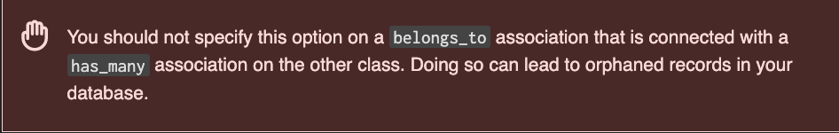

Ignoring async options as ActiveJob is not enabled on sample project.

[belongs_to dependent options](https://guides.rubyonrails.org/association_basics.html#options-for-belongs-to-dependent)

* `:destroy` when the object is destroyed, destroy will be called on its associated objects.
* `:delete` when the object is destroyed, all its associated objects will be deleted directly from the database without calling their destroy method.

[has_many dependent options](https://guides.rubyonrails.org/association_basics.html#dependent)

* `:destroy` causes all the associated objects to also be destroyed
* `:delete_all` causes all the associated objects to be deleted directly from the database (so callbacks will not execute)
* `:nullify` causes the foreign key to be set to NULL. Polymorphic type column is also nullified on polymorphic associations. Callbacks are not executed.
* `:restrict_with_exception` causes an ActiveRecord::DeleteRestrictionError exception to be raised if there are any associated records
* `:restrict_with_error` causes an error to be added to the owner if there are any associated objects

## Setup

Try latest releases of [rails](https://rubygems.org/gems/rails/versions/7.0.4) and [Ruby](https://www.ruby-lang.org/en/downloads/releases/) as of 2022-10-13

```
rbenv install 3.1.2
rbenv local 3.1.2
gem install rails -v 7.0.4
rails new learn-associations
```

## Models

```bash
# simple model with no associations to demonstrate difference between destroy and delete
bin/rails generate model post title:string body:text

# models with associations
bin/rails generate model author name:string
bin/rails generate model book title:string published_at:date author:references
```

Seeds.rb:

```ruby
# Post is a simple model with no associations to demonstrate the difference between
# ActiveRecord methods destroy and delete
Post.create!(title: "Hello Post", body: "Learning about destroy and delete in Rails.")
Post.create!(title: "Another Post", body: "Lorem ipsum dolor sit amet, consectetur adipiscing elit.")

# Authors with at least one book each
author_ap = Author.create!(name: "Andrew Park")
author_jjk = Author.create!(name: "Julian James McKinnon")

# Author with no books in the system
Author.create!(name: "John Doe")

# Create 3 books for Andrew Park and just one book for Julian James McKinnon
Book.create!(
  [
    { title: "Python Programming for Beginners", published_at: "2022-07-20", author: author_ap },
    { title: "Machine Learning: 4 Books in 1", published_at: "2020-01-20", author: author_ap },
    { title: "Python for Data Analysis", published_at: "2021-01-20", author: author_ap },
    { title: "Computer Programming Crash Course: 7 Books in 1", published_at: "2021-01-20", author: author_jjk }
  ]
)

p "Created #{Post.count} posts"
p "Created #{Author.count} authors"
p "Created #{Book.count} books"
```

Create and seed database:

```
bin/rails db:create
bin/rails db:migrate
bin/rails db:seed
```

## Destroy vs Delete

One concept to clear up first. When looking at the various `dependent` options, the words "destroy" and "delete" show up in different options. These words sound the same but there is an important difference. Let's understand this with a simple model with no associations before moving on to more complicated cases.

Given a simple `Post` model:

```ruby
# == Schema Information
#
# Table name: posts
#
#  id         :integer          not null, primary key
#  body       :text
#  title      :string
#  created_at :datetime         not null
#  updated_at :datetime         not null
#
class Post < ApplicationRecord
  before_destroy :one_last_thing

  def one_last_thing
    puts "Post model #{id} will be destroyed"
  end
end
```

TODO: Try without the destroy callback first - both methods appear to behave the same. Then add destroy callback to observe the difference.

TODO: Tidy up Rails console output to focus on the important concept.

```ruby
p1 = Post.first
p2 = Post.second
p1.destroy
# Post model 1 will be destroyed
#   TRANSACTION (0.1ms)  begin transaction
#   Post Destroy (0.7ms)  DELETE FROM "posts" WHERE "posts"."id" = ?  [["id", 1]]
#   TRANSACTION (1.4ms)  commit transaction
p2.delete
  # Post Destroy (1.5ms)  DELETE FROM "posts" WHERE "posts"."id" = ?  [["id", 2]]
```

## Belongs To and Has Many Dependency Matrix

Let's look at typical use case `belongs_to` and `has_many`. For example, Author has many books, and each book belongs to one author. Putting together all the `dependent` options (including not specifying it at all), yields a matrix:

| Scenario | belongs_to    | has_many                 |
|----------|---------------|--------------------------|
| 1        | not specified | not specified            |
| 2        | not specified | :destroy                 |
| 3        | not specified | :delete_all              |
| 4        | not specified | :nullify                 |
| 5        | not specified | :restrict_with_exception |
| 6        | not specified | :restrict_with_error     |
| 7        | :destroy      | not specified            |
| 8        | :destroy      | :destroy                 |
| 9        | :destroy      | :delete_all              |
| 10       | :destroy      | :nullify                 |
| 11       | :destroy      | :restrict_with_exception |
| 12       | :destroy      | :restrict_with_error     |
| 13       | :delete       | not specified            |
| 14       | :delete       | :destroy                 |
| 15       | :delete       | :delete_all              |
| 16       | :delete       | :nullify                 |
| 17       | :delete       | :restrict_with_exception |
| 18       | :delete       | :restrict_with_error     |

Let's try setting up each of these scenarios on the Book (belongs_to) and Author (has_many) models. Then for each scenario we'll try the following.
1. Remove an author that has multiple books.
2. Remove an author that that has a single book.
3. Remove an author that has no books.
4. Remove a book that belongs to an author that has other books.
5. Remove a book that belongs to an author that only has that one book.

Remove has multiple meanings - could be either `destroy!` or `delete` so will try both.

In tests, use `destroy!` rather than `destroy`: "Instead of returning false on failure, it will raise ActiveRecord::RecordNotDestroyed"

### Scenario 1: dependent not specified on either side of relationship

```ruby
class Book < ApplicationRecord
  belongs_to :author
  before_destroy :one_last_thing
  def one_last_thing
    puts "Book model #{id} will be destroyed"
  end
end
```

```ruby
class Author < ApplicationRecord
  has_many :books
  before_destroy :one_last_thing
  def one_last_thing
    puts "Author model #{id} will be destroyed"
  end
end
```

Console, load an Author, then try to destroy - it calls the before_destroy callback, then attempts to delete the author, but then rolls back the transaction due to the foreign key constraint from books to authors:

```ruby
author = Author.find_by(name: "Andrew Park")
author.destroy
# Author model 1 will be destroyed
#   TRANSACTION (0.1ms)  begin transaction
#   Author Destroy (0.8ms)  DELETE FROM "authors" WHERE "authors"."id" = ?  [["id", 1]]
#   TRANSACTION (0.7ms)  rollback transaction
# /Users/dbaron/.rbenv/versions/3.1.2/lib/ruby/gems/3.1.0/gems/sqlite3-1.5.3-x86_64-darwin/lib/sqlite3/statement.rb:108:in `step': SQLite3::ConstraintException: FOREIGN KEY constraint failed (ActiveRecord::InvalidForeignKey)
```

Trying to delete author with `author.delete` leads to same error, except it doesn't call the `before_destroy` callback.

How about destroy/delete a book? No problem - book records can be removed from the database with no errors.

```ruby
irb(main):001:0> b1 = Book.first
  Book Load (0.1ms)  SELECT "books".* FROM "books" ORDER BY "books"."id" ASC LIMIT ?  [["LIMIT", 1]]
=>
#<Book:0x0000000106951aa8
...
irb(main):002:0> b2 = Book.second
  Book Load (0.3ms)  SELECT "books".* FROM "books" ORDER BY "books"."id" ASC LIMIT ? OFFSET ?  [["LIMIT", 1], ["OFFSET", 1]]
=>
#<Book:0x0000000105ee27c0
...
irb(main):003:0> b1.destroy
Book model 1 will be destroyed
  TRANSACTION (0.1ms)  begin transaction
  Book Destroy (0.4ms)  DELETE FROM "books" WHERE "books"."id" = ?  [["id", 1]]
  TRANSACTION (1.3ms)  commit transaction
=>
#<Book:0x0000000106951aa8
 id: 1,
 title: "Python Programming for Beginners",
 published_at: Wed, 20 Jul 2022,
 author_id: 1,
 created_at: Mon, 17 Oct 2022 10:38:06.070095000 UTC +00:00,
 updated_at: Mon, 17 Oct 2022 10:38:06.070095000 UTC +00:00>
irb(main):004:0>
irb(main):005:0> b2.delete
  Book Destroy (1.7ms)  DELETE FROM "books" WHERE "books"."id" = ?  [["id", 2]]
=>
#<Book:0x0000000105ee27c0
 id: 2,
 title: "Machine Learning: 4 Books in 1",
 published_at: Mon, 20 Jan 2020,
 author_id: 1,
 created_at: Mon, 17 Oct 2022 10:38:06.074186000 UTC +00:00,
 updated_at: Mon, 17 Oct 2022 10:38:06.074186000 UTC +00:00>
```

### Scenario 2: belongs_to not specified, has_many destroy

```ruby
class Author < ApplicationRecord
  has_many :books, dependent: :destroy
  before_destroy :one_last_thing
  def one_last_thing
    puts "Author model #{id} will be destroyed"
  end
end
```

```ruby
class Book < ApplicationRecord
  belongs_to :author
  before_destroy :one_last_thing
  def one_last_thing
    puts "Book model #{id} will be destroyed"
  end
end
```

Destroy author with multiple books - first destroys all the author's books, then destroys author. `author.delete` behaves similarly except doesn't invoke `before_destroy` callback.

Notice it deletes the author's books one DELETE statement at a time because its going to invoke `before_destroy` callback for each. Even if the Book model did not declare a `before_destroy` callback, it will still execute multiple DELETE statements, one for each associated model. Think about this for performance.

```ruby
author = Author.find_by(name: "Andrew Park")
author.destroy
# Book model 1 will be destroyed
#   TRANSACTION (0.1ms)  begin transaction
#   Book Destroy (0.5ms)  DELETE FROM "books" WHERE "books"."id" = ?  [["id", 1]]
# Book model 2 will be destroyed
#   Book Destroy (0.1ms)  DELETE FROM "books" WHERE "books"."id" = ?  [["id", 2]]
# Book model 3 will be destroyed
#   Book Destroy (0.1ms)  DELETE FROM "books" WHERE "books"."id" = ?  [["id", 3]]
# Author model 1 will be destroyed
#   Author Destroy (0.1ms)  DELETE FROM "authors" WHERE "authors"."id" = ?  [["id", 1]]
#   TRANSACTION (1.8ms)  commit transaction
```

Destroy a book - only destroys that book:

```ruby
irb(main):001:0> b = Book.first
  Book Load (0.1ms)  SELECT "books".* FROM "books" ORDER BY "books"."id" ASC LIMIT ?  [["LIMIT", 1]]
=>
#<Book:0x00000001134717b0
...
irb(main):002:0> b.author
  Author Load (0.3ms)  SELECT "authors".* FROM "authors" WHERE "authors"."id" = ? LIMIT ?  [["id", 1], ["LIMIT", 1]]
=> #<Author:0x0000000113383fd8 id: 1, name: "Andrew Park", created_at: Sun, 16 Oct 2022 12:08:29.779841000 UTC +00:00, updated_at: Sun, 16 Oct 2022 12:08:29.779841000 UTC +00:00>
irb(main):003:0> b.destroy
Book model 1 will be destroyed
  TRANSACTION (0.1ms)  begin transaction
  Book Destroy (0.5ms)  DELETE FROM "books" WHERE "books"."id" = ?  [["id", 1]]
  TRANSACTION (1.4ms)  commit transaction
=>
#<Book:0x00000001134717b0
 id: 1,
 title: "Python Programming for Beginners",
 published_at: Wed, 20 Jul 2022,
 author_id: 1,
 created_at: Sun, 16 Oct 2022 12:08:29.801399000 UTC +00:00,
 updated_at: Sun, 16 Oct 2022 12:08:29.801399000 UTC +00:00>
```

### Scenario 3: belongs_to not specified, has_many delete_all

```ruby
class Author < ApplicationRecord
  has_many :books, dependent: :delete_all
  before_destroy :one_last_thing
  def one_last_thing
    puts "Author model #{id} will be destroyed"
  end
end
```

Book model is the same as before.

Load an author with multiple books and then call `author.destroy`. This time it deletes all the author's books in a single DELETE statement and does not invoke the book model's `before_destroy` callback. It does however invoke the author's `before_destroy` callback because we called `author.destroy`.

Could be better for performance if Author has a lot of books - deleting in a single statement rather than executing multiple. But will not have a chance to invoke the `before_destroy` callback of each associated Book model.

```ruby
irb(main):001:0> a = Author.find_by(name: "Andrew Park")
  Author Load (0.2ms)  SELECT "authors".* FROM "authors" WHERE "authors"."name" = ? LIMIT ?  [["name", "Andrew Park"], ["LIMIT", 1]]
=> #<Author:0x00000001124f80b8 id: 1, name: "Andrew Park", created_at: Mon, 17 Oct 2022 10:53:00.772059000 UTC +00:00, updated_at: Mon, 17 Oct 2022 10:53:00.772059000 UTC +00:00>
irb(main):002:0> a.destroy
  TRANSACTION (0.1ms)  begin transaction
  Book Delete All (0.5ms)  DELETE FROM "books" WHERE "books"."author_id" = ?  [["author_id", 1]]
Author model 1 will be destroyed
  Author Destroy (0.1ms)  DELETE FROM "authors" WHERE "authors"."id" = ?  [["id", 1]]
  TRANSACTION (0.9ms)  commit transaction
```

### Scenario 4: belongs_to not specified, has_many nullify

Book model unchanged.

```ruby
class Author < ApplicationRecord
  has_many :books, dependent: :nullify
  before_destroy :one_last_thing
  def one_last_thing
    puts "Author model #{id} will be destroyed"
  end
end
```

Destroy an author - it attempts to set `author_id` on all of this author's books to `nil` but fails on a SQL `NOT NULL` constraint on the foreign key.

```ruby
a = Author.find_by(name: "Andrew Park")
a.destroy
TRANSACTION (0.1ms)  begin transaction
  Book Update All (1.2ms)  UPDATE "books" SET "author_id" = ? WHERE "books"."author_id" = ?  [["author_id", nil], ["author_id", 1]]
  TRANSACTION (0.1ms)  rollback transaction
/Users/dbaron/.rbenv/versions/3.1.2/lib/ruby/gems/3.1.0/gems/sqlite3-1.5.3-x86_64-darwin/lib/sqlite3/statement.rb:108:in `step': SQLite3::ConstraintException: NOT NULL constraint failed: books.author_id (ActiveRecord::NotNullViolation)
```

The NOT NULL constraint comes from the database migration that created the `books` table. Recall the book migration and model were created with a generator as follows:

```
bin/rails generate model book title:string published_at:date author:references
```

Which created this migration that indicates the reference to author cannot be null.

```ruby
class CreateBooks < ActiveRecord::Migration[7.0]
  def change
    create_table :books do |t|
      t.string :title
      t.date :published_at
      t.references :author, null: false, foreign_key: true

      t.timestamps
    end
  end
end
```

In this case, if we want to use `has_many :books, dependent: :nullify` on the `Author` model, then the associated `books` table must allow a null reference for its `author_id` column.

To verify, we can modify the migration to remove the null constraint, then drop and recreate the database and run migrations and seeds again. (this is just a demo app, obviously in a production app you'd have to add a new migration to remove the constraint):

```ruby
class CreateBooks < ActiveRecord::Migration[7.0]
  def change
    create_table :books do |t|
      t.string :title
      t.date :published_at
      # t.references :author, null: false, foreign_key: true
      t.references :author, foreign_key: true

      t.timestamps
    end
  end
end
```

Now let's try to destroy an author again and see what the impact is on its related books, remembering that the author model has `has_many :books, dependent: :nullify`:

```ruby
a = Author.find_by(name: "Andrew Park")
a.destroy
  TRANSACTION (0.3ms)  begin transaction
  Book Update All (0.7ms)  UPDATE "books" SET "author_id" = ? WHERE "books"."author_id" = ?  [["author_id", nil], ["author_id", 1]]
Author model 1 will be destroyed
  Author Destroy (0.2ms)  DELETE FROM "authors" WHERE "authors"."id" = ?  [["id", 1]]
  TRANSACTION (2.0ms)  commit transaction
```

This time all the author's books are successfully updated to have their `author_id` column set to `nil`. Calling `.books` on the author now returns an empty array:

```ruby
a.books
# => []
```

Let's load up one of Andrew Park's books to see what happened to its author association. Recall the Book model has `belongs_to :author`:

```ruby
b = Book.find_by(title: "Python Programming for Beginners")
b.author
# => nil
```

Before moving on to other scenarios, restore the null constraint on the books table author_id column.

### Scenario 5: belongs_to not specified, has_many restrict_with_exception

Author model:

```ruby
class Author < ApplicationRecord
  has_many :books, dependent: :restrict_with_exception
  before_destroy :one_last_thing
  def one_last_thing
    puts "Author model #{id} will be destroyed"
  end
end
```

Book model unchanged.

Trying to destroy an author that has books raises [ActiveRecord::DeleteRestrictionError](https://rdoc.info/docs/rails/ActiveRecord/DeleteRestrictionError) exception.

```ruby
a = Author.find_by(name: "Andrew Park")
a.destroy
#   TRANSACTION (0.1ms)  begin transaction
#   Book Exists? (0.4ms)  SELECT 1 AS one FROM "books" WHERE "books"."author_id" = ? LIMIT ?  [["author_id", 1], ["LIMIT", 1]]
#   TRANSACTION (0.1ms)  rollback transaction
# /Users/dbaron/.rbenv/versions/3.1.2/lib/ruby/gems/3.1.0/gems/activerecord-7.0.4/lib/active_record/associations/has_many_association.rb:16:in `handle_dependency': Cannot delete record because of dependent books (ActiveRecord::DeleteRestrictionError)
```

On the other hand, trying to destroy an author that has no books succeeds. Notice that it still checks the dependent `books` table for associated records, and if there are none, then the other is destroyed:

```ruby
a = Author.find_by(name: "John Doe")
a.destroy
#   TRANSACTION (0.1ms)  begin transaction
#   Book Exists? (0.2ms)  SELECT 1 AS one FROM "books" WHERE "books"."author_id" = ? LIMIT ?  [["author_id", 3], ["LIMIT", 1]]
# Author model 3 will be destroyed
#   Author Destroy (2.1ms)  DELETE FROM "authors" WHERE "authors"."id" = ?  [["id", 3]]
#   TRANSACTION (8.8ms)  commit transaction
```

### Scenario 6: belongs_to not specified, has_many restrict_with_error

Author model:

```ruby
class Author < ApplicationRecord
  has_many :books, dependent: :restrict_with_exception
  before_destroy :one_last_thing
  def one_last_thing
    puts "Author model #{id} will be destroyed"
  end
end
```

Book model unchanged.

Try to destroy an author with books - like with the `restrict_with_exception` case, the transaction is rolled back due to this author having dependent books, but instead of raising an error, the `destroy` method returns false and populates the `errors` property of the model instance that was attempted to be removed:

```ruby
a = Author.find_by(name: "John Doe")
a.destroy
#   TRANSACTION (0.1ms)  begin transaction
#   Book Exists? (0.1ms)  SELECT 1 AS one FROM "books" WHERE "books"."author_id" = ? LIMIT ?  [["author_id", 1], ["LIMIT", 1]]
#   TRANSACTION (0.2ms)  rollback transaction
# => false

a.errors.full_messages
=> ["Cannot delete record because dependent books exist"]
```

Interestingly, calling `delete` on a model instance raises a foreign key constraint error and does not populate the `errors` property:

```ruby
a = Author.find_by(name: "John Doe")
a.delete
#   Author Destroy (2.2ms)  DELETE FROM "authors" WHERE "authors"."id" = ?  [["id", 1]]
# /Users/dbaron/.rbenv/versions/3.1.2/lib/ruby/gems/3.1.0/gems/sqlite3-1.5.3-x86_64-darwin/lib/sqlite3/statement.rb:108:in `step': SQLite3::ConstraintException: FOREIGN KEY constraint failed (ActiveRecord::InvalidForeignKey)

a.errors.full_messages
=> []
```

### Scenario 7: belongs_to destroy, has_many not specified

Now we're going to start investigating the effect of various `dependent` options on the `belongs_to` side of the relationship. In this case, the Author model (has_many) side of association does not specify any `dependent` option, and the Book model (belongs_to) side of association specifies `dependent: destroy`:

```ruby
class Author < ApplicationRecord
  has_many :books
  before_destroy :one_last_thing
  def one_last_thing
    puts "Author model #{id} will be destroyed"
  end
end
```

```ruby
class Book < ApplicationRecord
  belongs_to :author, dependent: :destroy
  before_destroy :one_last_thing
  def one_last_thing
    puts "Book model #{id} will be destroyed"
  end
end
```

Let's try to destroy one of Andrew Park's books. Recall that Andrew Park has three different books in this system:

```ruby
book = Book.find_by(title: "Python Programming for Beginners")
book.destroy
# Book model 1 will be destroyed
#   TRANSACTION (0.1ms)  begin transaction
#   Book Destroy (0.5ms)  DELETE FROM "books" WHERE "books"."id" = ?  [["id", 1]]
#   Author Load (0.6ms)  SELECT "authors".* FROM "authors" WHERE "authors"."id" = ? LIMIT ?  [["id", 1], ["LIMIT", 1]]
# Author model 1 will be destroyed
#   Author Destroy (0.8ms)  DELETE FROM "authors" WHERE "authors"."id" = ?  [["id", 1]]
#   TRANSACTION (0.5ms)  rollback transaction
# /Users/dbaron/.rbenv/versions/3.1.2/lib/ruby/gems/3.1.0/gems/sqlite3-1.5.3-x86_64-darwin/lib/sqlite3/statement.rb:108:in `step': SQLite3::ConstraintException: FOREIGN KEY constraint failed (ActiveRecord::InvalidForeignKey)
```

It calls the book model's `before_destroy` callback, then starts a transaction to delete the book, load the associated author, call the author model's `before_destroy` callback, then attempt to delete the associated author record from the database. But this deletion fails due to a `FOREIGN KEY constraint`, i.e. this particular author has other books so it would leave the database in an invalid state to not have this author record.

Therefore the transaction is rolled back. Which means neither the book nor the author have been removed from the database. Notice though that the book model's `before_destroy` callback was invoked outside of the transaction so whatever code that executed does not get rolled back. In this simple example, it's just a puts statement so it doesn't matter, but something to be aware of in a real application.

Note that even if the `books` table were to allow null values in its `author_id` foreign key column using `t.references :author, foreign_key: true`, the same behaviour results. That is, attempting to delete a book that belongs to an author that has this and other books, will fail. So there will be no orphan books left in the database, despite this [warning](https://guides.rubyonrails.org/association_basics.html#options-for-belongs-to-dependent) from the Association Guide:



Another scenario we can try is to delete a book whose author only has that single book. Here's an example with Julian James McKinnon's book. This author is seeded with only a single book:

```ruby
book = Book.find_by(title: "Computer Programming Crash Course: 7 Books in 1")
book.destroy
# Book model 4 will be destroyed
#   TRANSACTION (0.1ms)  begin transaction
#   Book Destroy (0.5ms)  DELETE FROM "books" WHERE "books"."id" = ?  [["id", 4]]
#   Author Load (0.1ms)  SELECT "authors".* FROM "authors" WHERE "authors"."id" = ? LIMIT ?  [["id", 2], ["LIMIT", 1]]
# Author model 2 will be destroyed
#   Author Destroy (0.2ms)  DELETE FROM "authors" WHERE "authors"."id" = ?  [["id", 2]]
#   TRANSACTION (1.0ms)  commit transaction
```

In this case, it successfully removes both the book and its associated author records from the database, in addition to invoking each model's `before_destroy` callback. This works because this particular author does not have any other books so it can be deleted without leaving orphan books in the database.

### Scenario 8: belongs_to destroy, has_many destroy

Now we're going to see if specifying various `dependent` options on both sides of the relationship affects the destroy behaviour. In this case, we specify `destroy` on both sides:

TODO: any circular deps - delete an author -> delete book -> delete author???

```ruby
class Author < ApplicationRecord
  has_many :books, dependent: :destroy
  before_destroy :one_last_thing
  def one_last_thing
    puts "Author model #{id} will be destroyed"
  end
end
```

```ruby
class Book < ApplicationRecord
  belongs_to :author, dependent: :destroy
  before_destroy :one_last_thing
  def one_last_thing
    puts "Book model #{id} will be destroyed"
  end
end
```

Let's try to destroy an author that has multiple books:

```ruby
author = Author.find_by(name: "Andrew Park")
author.destroy
#   TRANSACTION (0.1ms)  begin transaction
#   Book Load (0.7ms)  SELECT "books".* FROM "books" WHERE "books"."author_id" = ?  [["author_id", 1]]
# Book model 1 will be destroyed
#   Book Destroy (2.0ms)  DELETE FROM "books" WHERE "books"."id" = ?  [["id", 1]]
#   TRANSACTION => false

author.errors.full_messages
# => []
```

Like with Scenario 2 where the Author (has_many side of relationship) specified `dependent: :destroy`, destroying the author is first attempting to destroy this author's books one at a time, but the transaction is rolled back. However, it doesn't raise any exceptions and the author model's `error` array is empty. Also it looks like the author's destroy callback wasn't invoked. It's not clear what went wrong but clearly this is an invalid scenario. i.e. don't use this combination if you ever need to delete things.

What about destroying a book written by an author that has several other books in this case?

```ruby
book = Book.find_by(title: "Python Programming for Beginners")
book.destroy
# Book model 1 will be destroyed
#   TRANSACTION (0.1ms)  begin transaction
#   Book Destroy (0.7ms)  DELETE FROM "books" WHERE "books"."id" = ?  [["id", 1]]
#   Author Load (0.2ms)  SELECT "authors".* FROM "authors" WHERE "authors"."id" = ? LIMIT ?  [["id", 1], ["LIMIT", 1]]
#   Book Load (0.2ms)  SELECT "books".* FROM "books" WHERE "books"."author_id" = ?  [["author_id", 1]]
# Book model 2 will be destroyed
#   Book Destroy (0.1ms)  DELETE FROM "books" WHERE "books"."id" = ?  [["id", 2]]
#   TRANSACTION (1.1ms)  rollback transaction

book.errors.full_messages
# => []
```

It calls the book's destroy callback outside of the transaction, then opens a transaction to delete the specific book we called destroy on, find its associated author, then find that author's other books, then attempt to delete the first of these other books, then rolls back the transaction. Just like when we tried to destroy an author, no exception is raised and the model's `error` property is not populated, and yet, clearly something went wrong.

Finally let's try to destroy a book written by an author that only has that one book:

```ruby
book = Book.find_by(title: "Computer Programming Crash Course: 7 Books in 1")
book.destroy
# Book model 4 will be destroyed
#   TRANSACTION (0.1ms)  begin transaction
#   Book Destroy (1.2ms)  DELETE FROM "books" WHERE "books"."id" = ?  [["id", 4]]
#   Author Load (0.1ms)  SELECT "authors".* FROM "authors" WHERE "authors"."id" = ? LIMIT ?  [["id", 2], ["LIMIT", 1]]
#   Book Load (1.2ms)  SELECT "books".* FROM "books" WHERE "books"."author_id" = ?  [["author_id", 2]]
# Author model 2 will be destroyed
#   Author Destroy (0.3ms)  DELETE FROM "authors" WHERE "authors"."id" = ?  [["id", 2]]
#   TRANSACTION (3.4ms)  commit transaction
```

In this case, it deletes both the book and its associated author, also invoking each model's `before_destroy` callback, and the transaction is committed. This looks the same as Scenario 7 where destroy was specified on belongs_to and nothing was specified on has_many. But given the cases where the transaction is rolled back but no exception is raised nor model errors populated, I wouldn't use this combination.

### Scenario 9: belongs_to destroy, has_many delete_all

:destroy      | :delete_all

In this case we specify `destroy` on the Book model (i.e. when destroy is called on a book instance, it should also call destroy on the author it belongs to), and `delete_all` on the Author model (i.e. when Author model is removed from the database, all its books should also be deleted).

## Other Associations TBD

### belongs_to

Each instance of declaring model "belongs to" one instance of the other model.

[Options for belongs_to](https://guides.rubyonrails.org/association_basics.html#options-for-belongs-to) re: `dependent`

* not specified
* `:destroy`, when the object is destroyed, destroy will be called on its associated objects.
* `:delete`, when the object is destroyed, all its associated objects will be deleted directly from the database without calling their destroy method.


### has_one

Skipping this for now to focus on belongs_to/has_many

[Options for has_one](https://guides.rubyonrails.org/association_basics.html#options-for-has-one) re: `dependent`

* not specified
* `:destroy` causes the associated object to also be destroyed
* `:delete` causes the associated object to be deleted directly from the database (so callbacks will not execute)
* `:nullify` causes the foreign key to be set to NULL. Polymorphic type column is also nullified on polymorphic associations. Callbacks are not executed.
* `:restrict_with_exception` causes an ActiveRecord::DeleteRestrictionError exception to be raised if there is an associated record
* `:restrict_with_error` causes an error to be added to the owner if there is an associated object

### has_many

[Options for has_many](https://guides.rubyonrails.org/association_basics.html#options-for-has-many) re: `dependent`

* not specified
* `:destroy` causes all the associated objects to also be destroyed
* `:delete_all` causes all the associated objects to be deleted directly from the database (so callbacks will not execute)
* `:nullify` causes the foreign key to be set to NULL. Polymorphic type column is also nullified on polymorphic associations. Callbacks are not executed.
* `:restrict_with_exception` causes an ActiveRecord::DeleteRestrictionError exception to be raised if there are any associated records
* `:restrict_with_error` causes an error to be added to the owner if there are any associated objects

### has_many :through

### has_one :through

### has_and_belongs_to_many

## TODO

* Setup RSpec - too much work to do manually in console.
* Intro para: Want to understand all the dependent options on ActiveRecord associations. Before GDPR/privacy days, would just never delete anything, but now, may be legally required therefore have to think about impact of deletion and maintaining referential integrity.
* First, discuss difference between delete and destroy (simple model with no associations) [SO](https://stackoverflow.com/questions/22757450/difference-between-destroy-and-delete)
* Information hierarchy?
* WIP: Starting with belongs_to/has_many pair (common use case, eg: Book belongs to Author, Author has many Books) - run through all scenarios in the matrix
* Somewhere mention since the `dependent` options can be used in combination on each side of the associations, its tricky to understand from the docs how they will behave together. That's the purpose of this post to try out each.
* Add Rails Guides sentence describing each option before trying it out.
* Cleanup Rails console output to only highlight the relevant parts
* Try to get to "orphaned records" warning as described in guide - what causes this?
* What about all the other association types - maybe too much for one blog post - do a multi part?
* Add aside: passing `-h` or `--help` to any generator command, eg: `bin/rails generate model -h` provides a complete guide to that generator. For example, wondering what are the valid data types for model attributes
* Link to companion project: https://github.com/danielabar/learn-associations
* Conclusion para
* Description
* Related