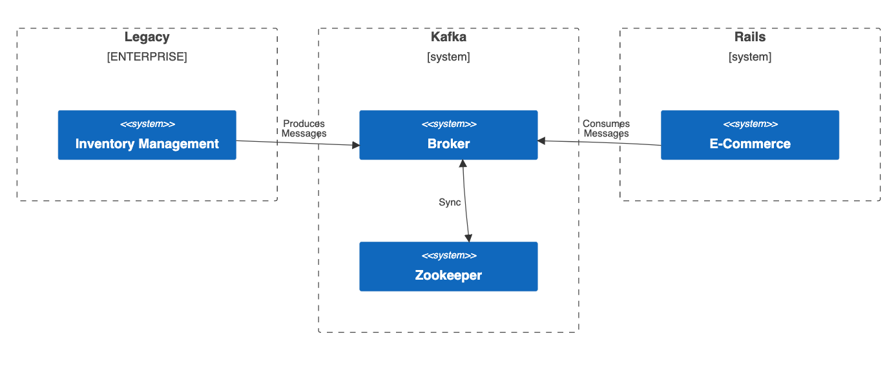

This post will walk through how to integrate a Kafka consumer into a Rails application in a maintainable and testable way. Why would you need to do this? Consider the following scenario: You're working on an e-commerce system that has been developed with Rails. You'd like to enhance the product details page to show whether the current product is in stock, out of stock, or only has small number of items left (eg: "Only 3 left in stock!"). The inventory information comes from a legacy inventory management system that has been written in a different programming language. This legacy system is responsible for updating the inventory count based on events, such as product purchases, returns, or stock replenishments.

In order to display this inventory information in the Rails e-commerce app, it needs the ability to communicate with the legacy inventory system. There are many [solutions](https://en.wikipedia.org/wiki/Enterprise_Integration_Patterns) for enabling different systems to communicate, each with tradeoffs to consider. This post will demonstrate how [Apache Kafka](https://kafka.apache.org/) can be used to solve this problem. Kafka is a distributed streaming platform that enables high-throughput, fault-tolerant, and real-time event data streaming for building scalable and event-driven applications.

Given that the inventory information is updated based on business events, this makes it a good fit to integrate with Kafka, which is designed for event-driven systems. Using Kafka will make the integration between the legacy and e-commerce system more tolerant to large bursts of inventory events, whereas a REST/HTTP based integration might be prone to information loss in the case of temporary network or database outages.

<aside class="markdown-aside">
This post assumes some basic knowledge of Rails (models and controllers), Kafka (producers, consumers, topics), and Docker (just enough to run a docker compose file). Looking to level up on any of these topics? Check out this guide on <a class="markdown-link" href="https://www.akshaykhot.com/books-to-learn-ruby-and-rails/">books for learning Rails</a>, an introductory Kafka <a class="markdown-link" href="https://developer.confluent.io/what-is-apache-kafka/">tutorial</a>, and Docker <a class="markdown-link" href="https://docs.docker.com/get-started/">getting started</a>.
</aside>

## Big Picture

Conceptually, here is what we'll be building:



We'll be focusing on the Rails side of things. Assume that another team is maintaining the inventory management system and they've already modified it to produce JSON formatted messages every time there's an inventory change. Here's an example message showing that the product identified by product code `ABCD1234` has 23 units left in stock:

```json
{
  "product_code": "ABCD1234",
  "inventory_count": 23
}
```

These messages will be produced to a Kafka topic named `inventory_management_product_updates`. When integrating Kafka, it's important for all the teams involved to agree on the topic name(s) and message formats, essentially agreeing on a "contract". This will ensure that the disparate systems can actually communicate with each other as expected.

<aside class="markdown-aside">
When it comes to Kafka topic naming conventions, there are many different <a class="markdown-link" href="https://cnr.sh/essays/how-paint-bike-shed-kafka-topic-naming-conventions">opinions</a> such as whether to include <a class="markdown-link" href="https://www.kadeck.com/blog/kafka-topic-naming-conventions-5-recommendations-with-examples">version numbers</a> or not. It's beyond the scope of this post to cover all of these. If your organization has already established a naming convention, use that.
</aside>

## Rails Product

The Rails application has a `products` table to store the product name, product code, price, and inventory count. Here is the migration:

```ruby
# db/migrate/20230524104551_create_products.rb
class CreateProducts < ActiveRecord::Migration[7.0]
  def change
    create_table :products do |t|
      t.string :name, null: false
      t.string :code, null: false
      t.decimal :price, null: false
      t.integer :inventory, null: false, default: 0

      t.timestamps
    end
  end
end
```

Here is the the corresponding `Product` model. I'm using the [annotate](https://github.com/ctran/annotate_models) gem to automatically generate schema information as comments in the model class when migrations are run:

```ruby
# app/models/product.rb
# == Schema Information
#
# Table name: products
#
#  id         :integer          not null, primary key
#  code       :string           not null
#  inventory  :integer          default(0), not null
#  name       :string           not null
#  price      :decimal(, )      not null
#  created_at :datetime         not null
#  updated_at :datetime         not null
#
class Product < ApplicationRecord
  validates :name, presence: true
  validates :code, presence: true
  validates :price, presence: true
  validates :inventory, presence: true, numericality: { greater_than_or_equal_to: 0 }

  def inspect
    "#<Product id: #{id}, name: #{name}, code: #{code}, price: #{formatted_price}, inventory: #{inventory}>"
  end

  def formatted_price
    format("%.2f", price)
  end
end
```

<aside class="markdown-aside">
Not critical to this demo, but since the prices are stored as a decimal column in the database, a format method is added to the model, and the inspect method is overridden to use it. This is so when products are displayed in the console for debugging purposes, it will show a price like 47.53 rather than 0.4753e2. Also note that for a real application, the precision and scale would be defined such as decimal(10, 2) but this simple demo is using the default SQLite database which doesn't support specifying these.
</aside>

In development, the `products` table is populated with seed data, using the [faker](https://github.com/faker-ruby/faker) gem:

```ruby
# db/seeds.rb
require "faker"

if Rails.env.development?
  Product.destroy_all
  20.times do
    Product.create!(
      name: Faker::Commerce.product_name,
      code: "#{Faker::Alphanumeric.alpha(number: 4).upcase}#{Faker::Number.number(digits: 4)}",
      price: Faker::Commerce.price(range: 0..100.0),
      inventory: rand(0..50)
    )
  end
else
  puts "Seeding skipped. Not in development environment."
end
```

Here are some example products:

```
#<Product id: 41, name: Awesome Wool Gloves, code: JANW7810, price: 47.53, inventory: 10>,
#<Product id: 42, name: Durable Steel Plate, code: BMJG7868, price: 96.25, inventory: 3>,
#<Product id: 43, name: Ergonomic Paper Bag, code: FLMA2165, price: 52.46, inventory: 6>,
...
```

## Install Kafka

Even though we'll be focused on consuming messages in the Rails application, we're going to also need to produce messages to try it out. This means we'll need access to a Kafka cluster, which includes one or more brokers, and [Zookeeper](https://zookeeper.apache.org/) to manage the cluster. While you could point to a shared cluster if your organization manages their own or uses [Confluent](https://www.confluent.io/) (Kafka as a service), I prefer to think of this similar to a database. In the same way that every developer working on a Rails application has their own local database installed, Kafka is also a kind of database (specifically, a raw, distributed database). It could get messy if all developers are pointing to a shared cluster, producing test messages that end up getting consumed by other developers running their own tests. It's also useful to have it installed locally for learning and experimentation, otherwise you would have to pay for hosting it somewhere or using a service like Confluent.

The easiest way to set up a Kafka cluster locally is with Docker and docker-compose. Confluent provides these images in their [cp-all-in-one](https://github.com/confluentinc/cp-all-in-one) repository. We actually only need to run two containers locally for a minimal cluster - one broker, and one zookeeper instance. Add the following `docker-compose.yml` file to the root of the project:

```yml
---
version: '2'
services:
  zookeeper:
    image: confluentinc/cp-zookeeper:7.2.1
    hostname: zookeeper
    ports:
      - "2181:2181"
    environment:
      ZOOKEEPER_CLIENT_PORT: 2181
      ZOOKEEPER_TICK_TIME: 2000

  broker:
    image: confluentinc/cp-server:7.2.1
    hostname: broker
    depends_on:
      - zookeeper
    ports:
      - "9092:9092"
      - "9101:9101"
    environment:
      KAFKA_BROKER_ID: 1
      KAFKA_ZOOKEEPER_CONNECT: 'zookeeper:2181'
      KAFKA_LISTENER_SECURITY_PROTOCOL_MAP: PLAINTEXT:PLAINTEXT,PLAINTEXT_HOST:PLAINTEXT
      KAFKA_ADVERTISED_LISTENERS: PLAINTEXT://broker:29092,PLAINTEXT_HOST://localhost:9092
      KAFKA_METRIC_REPORTERS: io.confluent.metrics.reporter.ConfluentMetricsReporter
      KAFKA_OFFSETS_TOPIC_REPLICATION_FACTOR: 1
      KAFKA_GROUP_INITIAL_REBALANCE_DELAY_MS: 0
      KAFKA_CONFLUENT_LICENSE_TOPIC_REPLICATION_FACTOR: 1
      KAFKA_CONFLUENT_BALANCER_TOPIC_REPLICATION_FACTOR: 1
      KAFKA_TRANSACTION_STATE_LOG_MIN_ISR: 1
      KAFKA_TRANSACTION_STATE_LOG_REPLICATION_FACTOR: 1
      KAFKA_JMX_PORT: 9101
      KAFKA_JMX_HOSTNAME: localhost
      CONFLUENT_METRICS_REPORTER_BOOTSTRAP_SERVERS: broker:29092
      CONFLUENT_METRICS_REPORTER_TOPIC_REPLICAS: 1
      CONFLUENT_METRICS_ENABLE: 'true'
      CONFLUENT_SUPPORT_CUSTOMER_ID: 'anonymous'
```

To start the containers, run:

```
docker-compose up
```

Give it a few seconds to start, then check on the status in another terminal tab:

```
docker-compose ps
```

If all is well, the output should look something like this, showing that both zookeeper and a single broker are running, with the broker exposed on port 9092:

```
                 Name                              Command            State                       Ports
----------------------------------------------------------------------------------------------------------------------------
karafka_rails_consumer_demo_broker_1      /etc/confluent/docker/run   Up      0.0.0.0:9092->9092/tcp, 0.0.0.0:9101->9101/tcp
karafka_rails_consumer_demo_zookeeper_1   /etc/confluent/docker/run   Up      0.0.0.0:2181->2181/tcp, 2888/tcp, 3888/tcp
```

<aside class="markdown-aside">
This tutorial is intentionally using just a single broker to keep the Kafka side simple. A real application would have multiple brokers with topics distributed and replicated across them for scalability and fault-tolerance. See this example <a class="markdown-link" href="https://github.com/danielabar/kafka-getting-started-pluralsight/blob/main/docker-compose-multiple.yml">docker-compose file</a> for a more advanced setup and a <a class="markdown-link" href="https://github.com/danielabar/kafka-getting-started-pluralsight#demo-fault-tolerance-and-resiliency">demo</a> of how to use it.
</aside>

## Install Karafka

Now we need to enhance the Rails application so that it can consume messages from the `inventory_management_product_updates` Kafka topic. We're going to use the [Karafka](https://karafka.io/docs/) gem to make the integration relatively easy. Some of the benefits of this gem include:
* Abstracts complexities of working directly with the Kafka protocol.
* Leverages [multithreading](https://karafka.io/docs/Concurrency-and-multithreading/) to achieve concurrency and high performance.
* Integrates easily with Rails, following [routing](https://karafka.io/docs/Routing/) style conventions.
* Built in [error handling](https://karafka.io/docs/Dead-Letter-Queue/) and retry logic.
* Testing utilities that make it easy to write [automated tests](https://karafka.io/docs/Testing/) for consumers and producers.
* Provides both an open source and pro version with additional [advanced features](https://karafka.io/docs/Pro-Features-List/).

To get started with Karafka, add the following to the project's `Gemfile` and then run `bundle install`:

```
gem "karafka", ">= 2.0.34"
```

Next run the karafka installation command which will setup some initial scaffolding:

```
bundle exec karafka install
```

This command will generate the main Karafka entrypoint file `karafka.rb` with some basic configuration, and an example topic and consumer:

```ruby
# karafka.rb
class KarafkaApp < Karafka::App
  setup do |config|
    config.kafka = { "bootstrap.servers": "127.0.0.1:9092" }
    config.client_id = "example_app"
    config.consumer_persistence = !Rails.env.development?
  end

  routes.draw do
    topic :example do
      consumer ExampleConsumer
    end
  end
end
```

Modify this file by replacing the `example` topic with the `inventory_management_product_updates` topic in the `routes.draw` block, and the example consumer with `ProductInventoryConsumer` (to be implemented shortly):

```ruby
class KarafkaApp < Karafka::App
  # config block...

  routes.draw do
    topic :inventory_management_product_updates do
      consumer ProductInventoryConsumer
    end
  end
end
```

<aside class="markdown-aside">
For this demo, there's no need to modify the default config block generated by Karafka. Recall the Kafka broker running in a docker container has exposed port 9092 so we'll be able to connect to it. In a real application, you would use an environment variable to specify the location of the bootstrap servers. There are also many more <a href="https://karafka.io/docs/Configuration/" class="markdown-link">configuration options</a>.
</aside>

Now let's implement the `ProductInventoryConsumer` class. This is a class that inherits from `ApplicationConsumer`, which was also generated from the karafka installation command and inherits from `Karafka::BaseConsumer`. The only method that's required to be implemented in a consumer class is the `consume` method, which will be invoked by Karafka with a batch of messages. For now, we will only log the message payload and [offset](https://github.com/danielabar/kafka-getting-started-pluralsight#consumer-offset-and-message-retention-policy) to confirm messages are being received. The `consume` method also has access to the `topic` so let's log the topic name as well:

```ruby
# app/consumers/product_inventory_consumer.rb
class ProductInventoryConsumer < ApplicationConsumer
  def consume
    messages.each do |message|
      Rails.logger.info(
        "ProductInventoryConsumer consuming Topic: #{topic.name}, \
        Message: #{message.payload},\
        Offset: #{message.offset}"
      )
    end
  end
end
```

To exercise this code, open a new terminal tab and run:

```
bundle exec karafka server
```

This command initializes the Karafka application defined at `karafka.rb`, connects to the Kafka cluster specified by the `bootstrap.servers` config, starts consuming messages from the topics specified in the `routes.draw` block, and invokes the configured consumer classes to process those messages. The server will continuously listen for new messages until the process is terminated. The output of this command is as follows:

```
Running Karafka 2.1.0 server
See LICENSE and the LGPL-3.0 for licensing details
[00f6800d4770] Polling messages...
[00f6800d4770] Polled 0 messages in 47.48299999954179ms
[00f6800d4770] Polling messages...
[00f6800d4770] Polled 0 messages in 1000.3159999996424ms
...
```

In order to exercise the `ProductInventoryConsumer` code, messages need to be produced to the `inventory_management_product_updates` topic. In production, this will be done by the inventory management system. For local development, we don't have that system running on our laptops. Fortunately, Karafka can also be used to [produce](https://karafka.io/docs/Components/#producer) messages. Let's try this out by launching a Rails console `bin/rails c` in another terminal tab and then enter the following code:

```ruby
# Generate a message with the expected attributes in JSON format:
message = {
  product_code: Product.first.code,
  inventory_count: 10
}.to_json
# => "{\"product_code\":\"JANW7810\",\"inventory_count\":10}"

# Produce and send a message to the `inventory_management_product_updates` topic:
Karafka.producer.produce_async(topic: 'inventory_management_product_updates', payload: message)
# [ce1340a60c42] Async producing of a message to '
#   inventory_management_product_updates' topic took 21.07400000002235 ms
# [ce1340a60c42] {:topic=>"inventory_management_product_updates",
#   :payload=>"{\"product_code\":\"JANW7810\",\"inventory_count\":10}"}
```

After submitting the producer command, watch on the terminal tab running the Karafka server. There will be some output indicating the message has been consumed from topic `inventory_management_product_updates` and offset `0`. I've added some `=== EXPLANATIONS ===`:

```
=== KARAFKA LOGGING WHEN CONSUMER STARTS PROCESSING ===
[50b2762f16b2] Consume job for ProductInventoryConsumer on
  inventory_management_product_updates/0 started

=== CONSUMER INFO LEVEL LOGGING ===
ProductInventoryConsumer consuming: Topic: inventory_management_product_updates,
  Message: {"product_code"=>"JANW7810", "inventory_count"=>10}, Offset: 0

=== KARAFKA LOGGING WHEN CONSUMER FINISHES PROCESSING ===
[50b2762f16b2] Consume job for ProductInventoryConsumer on
  inventory_management_product_updates/0 finished in 345.4149999995716ms
```

When there's a batch of messages ready to be processed, the `consume` method gets invoked with the `messages`, which can be iterated (in our simple case, there's only one message currently). Each of these is an instance of [Karafka::Messages::Message](https://karafka.io/docs/code/karafka/Karafka/Messages/Message.html). When the `payload` method is invoked on the `message` object, Karafka will deserialize it, which converts the raw Kafka message to a format you can work with in your Ruby code. By default, it uses JSON deserialization, which means it assumes the messages are in JSON format, and they will be deserialized into a Ruby hash. This is what's shown in the console output when we log `message.payload`. The Karafka docs have more details about [deserialization](https://karafka.io/docs/Deserialization/).

<aside class="markdown-aside">
For those keeping count, that's three terminal tabs required to work with this application during development mode: First one to run the Kafka cluster in Docker containers, second one to run the Karafka server for consuming messages, and a third one to run a Rails console to produce messages. If you want to be able to view the output of these all at the same time, a simple way is to use the <a class="markdown-link" href="https://iterm2.com/documentation-one-page.html">Split Panes</a> feature of iTerm or <a class="markdown-link" href="https://github.com/tmux/tmux/wiki">tmux</a> for more advanced features.
</aside>

## Update Product

Now that we know we can produce and consume messages with Kafka, it's time to do the actual work of updating the product inventory. We saw from the previous exercise that a message like this:

```
"{\"product_code\":\"JANW7810\",\"inventory_count\":10}"
```

Gets deserialized to a Ruby hash when the `payload` method is invoked on it:

```ruby
{
  "product_code" => "JANW7810",
  "inventory_count" => 10
}
```

This means the product code and inventory count can be accessed within the consumer as follows:

```ruby
# app/consumers/product_inventory_consumer.rb
class ProductInventoryConsumer < ApplicationConsumer
  def consume
    messages.each do |message|
      # Deserialize JSON message into a hash assigned to `payload`
      payload = message.payload

      # Access payload attributes
      puts "Product code = #{payload['product_code']}" # JANW7810
      puts "Inventory count = #{payload['inventory_count']}" # 10
    end
  end
```

So updating the product inventory count could be done directly in the consumer like this:

```ruby
class ProductInventoryConsumer < ApplicationConsumer
  def consume
    messages.each do |message|
      payload = message.payload
      product = Product.find_by(code: payload["product_code"])
      product.update!(inventory: payload["inventory_count"])
    end
  end
end
```

There are some problems with this approach as we'll see shortly, but first, let's exercise this version of the consumer just to see if it works. Back in the Rails console, run the code shown below to check the inventory value of the first product, then produce a message to update it to a different value:

```ruby
# Check what the current inventory value is
Product.first.inventory
# 20

# Produce a message to update it to a different value
message = {
  product_code: Product.first.code,
  inventory_count: 123
}.to_json
Karafka.producer.produce_async(topic: 'inventory_management_product_updates', payload: message)
```

Now the tab running the Karafka server (consumer polling for messages), will show that the message has been received and the product inventory has been updated:

```
=== KARAFKA LOGGING WHEN CONSUMER STARTS PROCESSING ===
[d886a13043fd] Consume job for ProductInventoryConsumer on
  inventory_management_product_updates/0 started

=== RAILS DEV LOGGING FROM FINDING AND UPDATING PRODUCT ===
  Product Load (0.9ms)  SELECT "products".* FROM "products"
  WHERE "products"."code" = ? LIMIT ?  [["code", "JANW7810"], ["LIMIT", 1]]
  ↳ app/consumers/product_inventory_consumer.rb:5:in `block in consume'
  TRANSACTION (0.2ms)  begin transaction
  ↳ app/consumers/product_inventory_consumer.rb:6:in `block in consume'
  Product Update (0.4ms)  UPDATE "products" SET "inventory" = ?, "updated_at" = ?
  WHERE "products"."id" = ?  [["inventory", 123], ["updated_at", "2023-06-02 11:10:00.738034"], ["id", 41]]
  ↳ app/consumers/product_inventory_consumer.rb:6:in `block in consume'
  TRANSACTION (2.1ms)  commit transaction
  ↳ app/consumers/product_inventory_consumer.rb:6:in `block in consume'

=== KARAFKA LOGGING WHEN CONSUMER FINISHES PROCESSING ===
[d886a13043fd] Consume job for ProductInventoryConsumer on
  inventory_management_product_updates/0 finished in 23.927999999839813ms
```

Back in the Rails console, fetch the product again and check its inventory count, it should be `123` from the Kafka message produced earlier:

```ruby
Product.first.inventory
# 123
```

Great it's working, ship it! Not so fast...

## What Could Possibly Go Wrong?

In the previous section, we saw the happy path working. Now its time to think about things that could go wrong.


For example, what if the inventory system sends a product code that the Rails e-commerce system doesn't have in its records? This could happen if the legacy system also manages in-store products that are not sold online, or maybe its buggy and no one quite understands how it works. Let's simulate this situation by producing a message in the Rails console for a non existing product code:

```ruby
message = {
  product_code: "NO-SUCH-CODE",
  inventory_count: 123
}.to_json
Karafka.producer.produce_async(topic: 'inventory_management_product_updates', payload: message)
```

Keep an eye on the terminal tab running the Karafka server, it will show a stack trace from attempting to consume this message:

```
[d886a13043fd] Consume job for ProductInventoryConsumer on
  inventory_management_product_updates/0 started

  Product Load (0.5ms)  SELECT "products".* FROM "products"
  WHERE "products"."code" = ? LIMIT ?  [["code", "NO-SUCH-CODE"], ["LIMIT", 1]]
  ↳ app/consumers/product_inventory_consumer.rb:5:in `block in consume'
Consumer consuming error: undefined method `update!' for nil:NilClass

      product.update!(inventory: payload["inventory_count"])
             ^^^^^^^^
/path/to/app/consumers/product_inventory_consumer.rb:6:in `block in consume'
/path/to/gems/karafka-2.1.0/lib/karafka/messages/messages.rb:22:in `each'
/path/to/gems/karafka-2.1.0/lib/karafka/messages/messages.rb:22:in `each'
/path/to/app/consumers/product_inventory_consumer.rb:3:in `consume'
```

What's happening is that `nil` is returned from the `find_by` method, then it errors out attempting to call the `update!` method on the `nil` return:

```ruby
# app/consumers/product_inventory_consumer.rb

# This line returns `nil` when called with `code: "NO-SUCH-CODE"`
product = Product.find_by(code: payload["product_code"])

# Which results in undefined method `update!` for nil:NilClass here
product.update!(inventory: payload["inventory_count"])
```

If you let the Karafka server keep running, you'll see the stack trace repeat several times, at increasing intervals of time. This is because Karafka's default behaviour is to keep retrying the failed message if an error is raised, according to a back-off strategy, up until a maximum value of 30,000 ms is reached (30 seconds), at which point, it will keep trying every 30 seconds:

```
[1bcb7660af45] Pausing on topic inventory_management_product_updates/0 on offset 1
[d854346b76bf] Retrying of ProductInventoryConsumer after 2000 ms on topic inventory_management_product_updates/0 from offset 1
...
[1bcb7660af45] Pausing on topic inventory_management_product_updates/0 on offset 1
[8d4c56ce8e62] Retrying of ProductInventoryConsumer after 8000 ms on topic inventory_management_product_updates/0 from offset 1
...
[1bcb7660af45] Pausing on topic inventory_management_product_updates/0 on offset 1
[15a4dead41b2] Retrying of ProductInventoryConsumer after 16000 ms on topic inventory_management_product_updates/0 from offset 1
...
[1bcb7660af45] Pausing on topic inventory_management_product_updates/0 on offset 1
[8f894960f0ac] Retrying of ProductInventoryConsumer after 30000 ms on topic inventory_management_product_updates/0 from offset 1
...
# keeps retrying every 30000 ms
```

This behaviour is controlled by the following config settings, which get assigned default values. Here's a snippet from the Karafka source [Karafka::Setup::Config](https://github.com/karafka/karafka/blob/master/lib/karafka/setup/config.rb):

```ruby
# option [Boolean] should we use exponential backoff
setting :pause_with_exponential_backoff, default: true

# option [Integer] what is the max timeout in case of an exponential backoff (milliseconds)
setting :pause_max_timeout, default: 30_000
```

Without error handling, it will keep trying to process this message, and not move on to other messages (because the offset of the bad message will not be committed). So clearly, some error handling is needed.

## Dead Letter Queue

In terms of writing the least amount of application code, the easiest way to get error handling with Karafka is to configure a [Dead Letter Queue](https://karafka.io/docs/Dead-Letter-Queue/) (DLQ) per each topic. For example:

```ruby
# karafka.rb
class KarafkaApp < Karafka::App
  # config block...

  routes.draw do
    topic :inventory_management_product_updates do
      consumer ProductInventoryConsumer
      dead_letter_queue(
        # name this as per your organization's naming conventions
        topic: "dlq_inventory_management_product_updates",
        max_retries: 2
      )
    end
  end
end
```

With this approach, if any error is raised during message processing, Karafka will automatically retry up to a configured number of `max_retries` (which can also be set to zero if you don't ever want it to retry). If message processing still fails after the retries are exhausted, a new message containing the same header and payload as the troublesome message will be produced to the topic specified in the `dead_letter_queue` method, in this case, `dlq_inventory_management_product_updates`.

With the modified `karafka.rb` in place, producing an inventory update message with a product code that does not exist will generate the following log messages in the Karafka server. I've annotated them with `=== EXPLANATION ===`, which shows that after consuming the bad message, Karafka will make two more attempts to process it. If those still fail, it writes the message the the topic `dlq_inventory_management_product_updates`, then moves on, waiting to consume new messages:

```
=== START CONSUMING BAD MESSAGE ===
[d13504295353] Consume job for ProductInventoryConsumer on
  inventory_management_product_updates/0 started

  Product Load (0.2ms)  SELECT "products".* FROM "products"
  WHERE "products"."code" = ? LIMIT ?  [["code", "NO_SUCH_CODE"], ["LIMIT", 1]]
  ↳ app/consumers/product_inventory_consumer.rb:5:in `block in consume'
Consumer consuming error: undefined method `update!' for nil:NilClass

      product.update!(inventory: payload["inventory_count"])
             ^^^^^^^^
/path/to/app/consumers/product_inventory_consumer.rb:6:in `block in consume'
...stack trace...

=== FIRST RETRY ===
[fa875ec2db84] Retrying of ProductInventoryConsumer after 2000 ms on
  topic inventory_management_product_updates/0 from offset 1
[d13504295353] Consume job for ProductInventoryConsumer on
  inventory_management_product_updates/0 started

  Product Load (0.1ms)  SELECT "products".* FROM "products"
  WHERE "products"."code" = ? LIMIT ?  [["code", "NO_SUCH_CODE"], ["LIMIT", 1]]
  ↳ app/consumers/product_inventory_consumer.rb:5:in `block in consume'
Consumer consuming error: undefined method `update!' for nil:NilClass

      product.update!(inventory: payload["inventory_count"])
             ^^^^^^^^
/path/to/app/consumers/product_inventory_consumer.rb:6:in `block in consume'
...stack trace...

=== SECOND RETRY ===
[76694e052832] Retrying of ProductInventoryConsumer after 4000 ms on
  topic inventory_management_product_updates/0 from offset 1
[d13504295353] Consume job for ProductInventoryConsumer on
  inventory_management_product_updates/0 started

  Product Load (0.2ms)  SELECT "products".* FROM "products"
  WHERE "products"."code" = ? LIMIT ?  [["code", "NO_SUCH_CODE"], ["LIMIT", 1]]
  ↳ app/consumers/product_inventory_consumer.rb:5:in `block in consume'
Consumer consuming error: undefined method `update!' for nil:NilClass

      product.update!(inventory: payload["inventory_count"])
             ^^^^^^^^
/path/to/app/consumers/product_inventory_consumer.rb:6:in `block in consume'
...stack trace...

=== WRITE BAD MESSAGE TO DLQ ===
[23c9519eb294] Async producing of a message to
  'dlq_inventory_management_product_updates' topic took 1.7790000000968575 ms
[23c9519eb294] {:topic=>"dlq_inventory_management_product_updates",
  :payload=>"{\"product_code\":\"NO_SUCH_CODE\",\"inventory_count\":5}"}
[d1e59c1bd1df] Dispatched message 1 from inventory_management_product_updates/0
  to DLQ topic: dlq_inventory_management_product_updates

=== OFFSET COMMITTED, READY TO PROCESS MORE MESSAGES ===
[316f38a98a31] Pausing on topic inventory_management_product_updates/0 on offset 2
[bc51bb551a3f] Polling messages...
```

## Error Monitoring

It's also useful to capture the error messages and stack traces in your error tracking/monitoring tool of choice (Sentry, Rollback, etc.). Karafka provides a [monitoring API](https://karafka.io/docs/Monitoring-and-logging/) that allows you to subscribe to instrumentation events such as errors occurring, and deal with them as you wish. Add this block to the `karafka.rb` file in the project root, between the configuration block and the routes:

```ruby
# frozen_string_literal: true

class KarafkaApp < Karafka::App
  setup do |config|
    # config...
  end

  # Common error handling example
  Karafka.monitor.subscribe "error.occurred" do |event|
    type = event[:type]
    error = event[:error]
    details = (error.backtrace || []).join("\n")
    Rails.logger.error("An error: #{error} of type: #{type} occurred, details: #{details}")
    # Or whatever error monitoring service Airbrake, Rollbar, etc.
    Sentry.capture_exception(error)
  end

  routes.draw do
    # topics and consumers...
  end
end
```

Now whenever an error occurs in the consumer, the message and stack trace will get logged, and additionally you can notify whatever error monitoring service you use such as Sentry, Rollbar, etc. The message that caused the error will still get produced to the DLQ as per the topic configuration.

While we could use the DLQ, together with Karafka's built-in error monitoring and simply let Karafka deal with all errors, it will be cleaner to also have the business logic be more resilient, and ensure the system produces useful error messages. Otherwise some poor soul in production support is going to be dealing with a bunch of failed messages in the dead letter queue and have no idea what's gone wrong. That could be you if developers are also responsible for production support at your company!

The other issue with this approach is there's some wasted processing with the retries. For example, if the product code does not exist in the e-commerce system, there's no point retrying the message because it still won't exist. While this can be mitigated by setting `max_retries: 0`, there could be other errors which should be retried such as if a network blip occurs and the database is temporarily unreachable.

## Validation in Consumer

As a first attempt at making the code more resilient, we could modify the consumer to first check if the product exists, before attempting an update, otherwise log an error and manually dispatch to the dead letter queue (Karafka will only automatically produce a message to the DLQ when an exception is raised):

```ruby
class ProductInventoryConsumer < ApplicationConsumer
  def consume
    messages.each do |message|
      payload = message.payload
      product = Product.find_by(code: payload["product_code"])
      if product.present?
        product.update!(inventory: payload["inventory_count"])
      else
        Rails.logger.error("Product #{payload['product_code']} does not exist")
        dispatch_to_dlq(message)
      end
    end
  end
end
```

With this in place, producing a message with an non-existing product code will result in logging an error, and the invalid message dispatched to the dead letter queue without any retries. Here's what this looks like in the Karafka server logs, again I've added `=== EXPLANATIONS ===`:

```
=== START CONSUMING MESSAGE ===
[ce8640c13bf0] Polled 1 messages in 1004.0149999996647ms
[ac5cf1c6d557] Consume job for ProductInventoryConsumer on inventory_management_product_updates/0 started

=== CHECK IF PRODUCT EXISTS ===
  Product Load (0.4ms)  SELECT "products".* FROM "products"
  WHERE "products"."code" = ? LIMIT ?  [["code", "NO_SUCH_CODE"], ["LIMIT", 1]]
  ↳ app/consumers/product_inventory_consumer.rb:5:in `block in consume'

=== RAILS LOGGER ERROR ===
Product NO_SUCH_CODE does not exist

=== DISPATCH TO DQL ===
[12cb723b4056] Async producing of a message to 'dlq_inventory_management_product_updates' topic took 0.9180000005289912 ms
[12cb723b4056] {:topic=>"dlq_inventory_management_product_updates", :payload=>"{\"product_code\":\"NO_SUCH_CODE\",\"inventory_count\":5}"}
[89c41457fc4c] Dispatched message 2 from inventory_management_product_updates/0 to DLQ topic: dlq_inventory_management_product_updates
[ac5cf1c6d557] Consume job for ProductInventoryConsumer on inventory_management_product_updates/0 finished in 275.4199999999255ms

=== READY FOR MORE MESSAGES ===
[ce8640c13bf0] Polling messages...
```

While this works, the consumer is starting to get a little messy. And it will continue to get messier as more validation rules are enforced. For example, in the e-commerce system, there's a constraint that the inventory count must be greater than zero, recall the product model has:

```ruby
# app/models/product.rb
class Product < ApplicationRecord
  # other validations...
  validates :inventory, presence: true, numericality: { greater_than_or_equal_to: 0 }
end
```

Suppose the inventory management system could send negative inventory counts, or blank values. It might do this if the business rules in the legacy system are different than those in the e-commerce system, or again, it could be buggy and not enough time/people to deal with the legacy system quirks. The consumer could be modified to handle this case as well, something like this:

```ruby
class ProductInventoryConsumer < ApplicationConsumer
  def consume
    messages.each do |message|
      payload = message.payload
      product = Product.find_by(code: payload["product_code"])
      if product.present?
        if payload["inventory_count"] >= 0
          product.update!(inventory: payload["inventory_count"])
        else
          Rails.logger.error("Inventory count cannot be negative")
          dispatch_to_dlq(message)
        end
      else
        Rails.logger.error("Product #{payload['product_code']} does not exist")
        dispatch_to_dlq(message)
      end
    end
  end
end
```

At this point, if the project is using [Rubocop](https://rubocop.org/) with a default configuration, this code will light up with the following offenses warning that the complexity of the `consume` method is too high and that there's too many lines:

```
app/consumers/product_inventory_consumer.rb:2:3:C: Metrics/AbcSize:Assignment
Branch Condition size for consume is too high. [<3, 16, 6> 17.35/17]
  def consume ...
  ^^^^^^^^^^^
app/consumers/product_inventory_consumer.rb:2:3: C: Metrics/MethodLength:
Method has too many lines. [15/10]
  def consume ...
  ^^^^^^^^^^^
```

While one could debate the max method length rule (default value is 10, perhaps 15 is reasonable), the complexity warning should not be ignored. The Rubocop [Abc rule](https://docs.rubocop.org/rubocop/cops_metrics.html#metricsabcsize) calculates the complexity of a method by considering the number of assignments (A), branches (B), aka method calls, and conditions (C) and comparing it to a maximum threshold. In this case, it's calculated a score of `17.35` which exceeds the default threshold of `17`.

One way to resolve this is to break up the `consume` method into smaller methods, for example, the validation and error handling could be extracted as separate methods. But this is just a simple example. A real application could be many more rules. For example, the e-commerce system could have a concept of active vs inactive products where only the active ones should have their inventory updated.

<aside class="markdown-aside">
Another technique that can help with some validation issues when using Kafka is a <a class="markdown-link" href="https://docs.confluent.io/platform/current/schema-registry/index.html">schema registry</a>, although you will probably still want some business level validation in the application. This is an advanced topic that won't be covered in this post.
</aside>

## Too Much Responsibility

The real issue here is that the Kafka consumer as currently written, is taking on too many responsibilities. These include:
1. Deserializing the message payloads received from the broker.
2. Implementing business rules with validation on the message payload.
3. Implementing business logic in updating the product inventory count.
4. Producing new messages to the dead letter queue topic in case of validation errors.

A useful way of thinking about this is to compare the consumer to a Rails controller. With a controller, its responsibilities should be limited to handling http requests and responses, while business logic should be delegated to services and/or models. This makes testing of business logic easier because its isolated from the complexity of http request and response handling.

Applying this way of thinking to a consumer, we can say that it should only be concerned with Kafka-specific things such as communicating with the broker to consume and produce messages, and deserializing and serializing message payloads. To simplify the consumer, we will apply two concepts:

1. A model, initialized with the message payload hash, to perform all business rule validations.
2. A service to check if the model is valid, and only perform the business logic update if the model is valid.

## Model

Typically in a Rails application, a model is a class that inherits from [ActiveRecord](https://api.rubyonrails.org/classes/ActiveRecord/Base.html) and has an underlying database table. Then it has access to the `validates` and `validate` macros to perform validations such as:

```ruby
class SomeModel < ApplicationRecord
  validates :some_attribute, presence: true
  validate :my_custom_method?

  def my_custom_method?
    # do some custom validation...
  end
end
```

These validation macros are very useful, and could help us clean up the consumer code by providing a model class whose sole responsibility is to indicate whether the message payload is valid, and if its not, list the error messages indicating what's wrong with it. But we don't have a database table specifically for the messages coming from Kafka and it would be overkill to create one. Fortunately, Rails has a solution for this. The [ActiveModel::Model](https://guides.rubyonrails.org/active_model_basics.html) module can be included in any class. It provides a way to create model-like objects that have many of the same features as traditional Rails models, but are not backed by a database table.

This new model will be named `ProductInventoryForm`. There's no naming convention on these, but the `Form` part of the name indicates that instances of this class are used to temporarily collect input data. Here is the model class, which includes `ActiveModel::Model`, defines attributes from the Kafka message `product_code` and `inventory_count`, and specifies validation using the `validates` and `validate` macros:

```ruby
# app/models/product_inventory_form.rb
class ProductInventoryForm
  include ActiveModel::Model

  attr_accessor :product_code, :inventory_count

  validates :product_code, presence: true
  validates :inventory_count, presence: true, numericality: { only_integer: true, greater_than_or_equal_to: 0 }

  # Only invoke the `product_exists?` validation if there are no validation errors with product_code.
  # For example, if product_code is blank, it doesn't make sense to try and check if it exists.
  # This is accomplished by specifying a "stabby lamda" (i.e. anonymous function) to the "if" hash key,
  # i.e. the `validate` method accepts a hash of options, one of them being `if` to specify the conditions
  # under which the given validation should run.
  validate :product_exists?, if: -> { errors[:product_code].blank? }

  def product_exists?
    errors.add(:product_code, "#{product_code} does not exist") unless Product.exists?(code: product_code)
  end
end
```

Let's launch a Rails console (`bin/rails c`) to experiment with this model:

```ruby
# Instantiate an empty model
product_form = ProductInventoryForm.new

# Including ActiveModel::Model exposes the `valid?` method
product_form.valid?
# => false

# We can also access the error messages
product_form.errors.full_messages
# => [
#      "Product code can't be blank",
#      "Inventory count can't be blank",
#      "Inventory count is not a number"
#    ]

# Instantiate a model with a hash to populate the attributes
# This should be considered invalid because
# product code does not exist and inventory is negative:
product_form = ProductInventoryForm.new({product_code: "FOO", inventory_count: -5})
=> #<ProductInventoryForm:0x000000010e7f93d8 @inventory_count=-5, @product_code="FOO">

# Run the validation rules. It runs a query against the
# products table due to the custom `product_exists?` validation.
product_form.valid?
# Product Exists? (0.4ms)  SELECT 1 AS one FROM "products"
#   WHERE "products"."code" = ? LIMIT ?  [["code", "FOO"], ["LIMIT", 1]]
# => false

# Check the error messages
product_form.errors.full_messages
# => [
#     "Inventory count must be greater than or equal to 0",
#     "Product code FOO does not exist"
#   ]

# Build a valid model: code exists and inventory count positive
product_form = ProductInventoryForm.new({product_code: Product.first.code, inventory_count: 15})
# => #<ProductInventoryForm:0x0000000110761540 @inventory_count=15, @product_code="JANW7810">

# This time, the product code exists so the model is valid,
# and no error messages are populated.
product_form.valid?
# Product Exists? (0.3ms)  SELECT 1 AS one FROM "products"
#   WHERE "products"."code" = ? LIMIT ?  [["code", "JANW7810"], ["LIMIT", 1]]
# => true
product_form.errors.full_messages
# []
```

<aside class="markdown-aside">
I'm placing this in the "app/models" directory but if you prefer, these kind of models could go in a different directory such as "app/form_objects" if you want to keep them separate from the models backed by a database table. Just remember to update "config.autoload_paths` in "config/application.rb" to include the new directory.
</aside>

## Service

With the `ProductInventoryForm` model in place, we have all the validation rules needed to replace the nested conditionals that are in the consumer. The next step is to introduce a service to make use of the model for validity checks, and to do the product updating.

<aside class="markdown-aside">
Unlike models, views, and controllers, a service is not a built-in Rails component, but it's very useful as a place for organizing business logic. Services are often used to encapsulate complex operations or interactions with external systems. See this RailsConf 2022 talk titled <a class="markdown-link" href="https://youtu.be/CRboMkFdZfg">Your Service Layer Needn't be Fancy, It Just Needs to Exist</a> to learn about the benefits of having a service layer and some practical examples how to implement it.
</aside>

Create a new directory `app/services` in your project, and add the `UpdateProductInventoryService` class as shown below:

```ruby
# app/services/update_product_inventory_service.rb
class UpdateProductInventoryService
  attr_reader :errors, :payload

  # This will be initialized with the message payload from Kafka.
  def initialize(payload)
    @payload = payload
    @errors = []
  end

  # The `process` method returns true if update succeeded, false otherwise,
  # with an array of error messages.
  def process
    # Instantiate the form object with the message payload
    product_inventory_form = ProductInventoryForm.new(payload)

    # If the "form" is valid, update product inventory, and return true.
    # Otherwise, populate `errors` from form validation messages, and return false.
    if product_inventory_form.valid?
      update_product(product_inventory_form)
      true
    else
      # Use the splat operator `*` to push each element of the form objects'
      # validation messages to the service `errors` array.
      errors.push(*product_inventory_form.errors.full_messages)
      false
    end
  end

  private

  # Update product using `product_code` and `inventory_count` attributes
  # from the form object.
  def update_product(product_inventory_form)
    product = Product.find_by(code: product_inventory_form.product_code)
    product.update!(inventory: product_inventory_form.inventory_count)
  end
end
```

This service is initialized with the message payload from Kafka, which recall, is just a hash, making it easy to test this class outside of having Kafka running. It also initializes an empty `errors` array. The `process` method instantiates a `ProductInventoryForm` with the payload, then checks if the inputs are valid by invoking the `valid?` method on the form object. Recall we saw in the previous section that the `valid?` method will run all the validation rules we defined on the form object.

If the input is valid, it updates the product inventory by looking up the `product_code` from the form object, and updating it with the given `inventory_count` from the form object. If the input is invalid, the service `errors` array is populated with the error messages from the form object, which are available by calling `product_inventory_form.errors.full_messages`.

Remember to tell Rails that this new directory should be auto loaded by adding the following to your configuration:

```ruby
# config/application.rb
config.autoload_paths << Rails.root.join("services")
```

## Lean Consumer

Now that we have a model for validations, and a service that does the business logic, we can update our consumer to make it "leaner", that is, take on less responsibilities. This will eliminate the complexity warning from Rubocop and make the code more maintainable.

In the version shown below, the consumer instantiates the `UpdateProductInventoryService` by passing it the message payload, and then invokes the `process` method on the service. If the `process` method does not return a truthy value, an error message is logged containing all the service error messages and the message is moved to the dead letter queue:

```ruby
class ProductInventoryConsumer < ApplicationConsumer
  def consume
    messages.each do |message|
      Rails.logger.info(
        "ProductInventoryConsumer consuming Topic: #{topic.name}, \
        Message: #{message.payload},\
        Offset: #{message.offset}"
      )

      # Instantiate service by passing in the payload.
      service = UpdateProductInventoryService.new(message.payload)

      # Call the service `process` method and log error(s) if unsuccessful.
      unless service.process
        Rails.logger.error("ProductInventoryConsumer message invalid: #{service.errors.join(', ')}")
        dispatch_to_dlq(message)
      end
    end
  end
end
```

## Conclusion

This post has covered a technique for integrating Kafka into a Rails application using the Karafka gem. We learned how to avoid complexity in the consumer by limiting its responsibilities to communicating with Kafka, while introducing a model for validations, and a service for business logic. This makes each component easier to maintain. This post got quite lengthy so I'm not including the tests here, but you can view the demo project including tests on [Github](https://github.com/danielabar/karafka_rails_consumer_demo).

## TODO

Mention about initial project scaffolding?

Continue editing starting from Error Monitoring.
