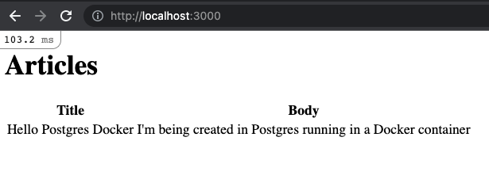

When scaffolding a new Rails project, the database flag can be used to specify a database other than the default SQLite, such as Postgres. However, the generated configuration will assume that the database is running on localhost, i.e. installed directly on your laptop or development machine. If instead you'd like the database running in a Docker container, a few more steps are necessary. This post will walk you through how to setup a new Rails project with a Postgres database running in a Docker container rather than the default SQLite running on localhost. It will be demonstrated using the Rails Getting Started Guide which builds an example blog application.

## Why?

But first, why would you want to use Docker to run your development database rather than simply installing it on your machine? There are a few benefits including:

**Version consistency:** You want everyone on the team to be running the same version locally as what's used in production. Suppose the production version gets upgraded, then every developer needs to remember to also upgrade their local installation. When the service is dockerized and run with Docker Compose, an upgrade just involves bumping the version tag in the docker-compose.yml file and pushing to version control. Next time everyone pulls that change and runs `docker-compose up`, they'll automatically get the upgraded version. This also ensures every developer on the team is using the same version, eliminating one potential source of [works on my machine](https://dzone.com/articles/works-on-my-machine) problems.

**Configuration consistency:** If your project requires some custom database configuration, it can be committed into the project and set in the container with a host mount. This leads to faster local setup as compared to adding an instruction in the readme telling each developer to configure their database manually.

**Multiple versions and services:**: For a developer that works on multiple projects, they could be using different database versions and it would be tedious to have to constantly uninstall/re-install versions every time you switch projects. Also as you work on multiple projects, each may have different service requirements such as Postgres, MySQL, Elasticsearch, Redis, etc. I'd rather not have all of those always running on my laptop when not needed, or have to remember to start/stop them for each project. Using Docker, with Docker Compose simplifies this.

Now that we've covered some benefits of using Docker locally for services, let's see how to setup Postgres in a container for a new Rails project.

## Getting Started

Install Postgres locally. Even though the Postgres database server will be run inside a Docker container, we still need the client installed on our laptop to connect to it. For a Mac, the easiest way is to use Homebrew. Note that you need to select your version, for example:

```
brew install postgresql@14
```

Scaffold a new Rails app, but specify that you want the database to be Postgres. Otherwise, the default option will use a SQLite database:

```
rails new blogpg --database=postgresql
```

## Docker Compose

We'll use [Docker Compose](https://docs.docker.com/compose/) to manage starting and stopping containers. Add the following `docker-compose.yml` file to the root of the project:

```yml
version: "3.8"

services:
  database:
    image: postgres:14
    volumes:
      - db_pg_data:/var/lib/postgresql/data
      - ./init.sql:/docker-entrypoint-initdb.d/init.sql
    ports:
      # Map to something other than default 5432 on host in case Postgres is also running natively on host.
      # Format is "host:container"
      - "5434:5432"
    environment:
      # Sets the superuser password for PostgreSQL
      POSTGRES_PASSWORD: shhhhItsASecret

volumes:
  db_pg_data:
```

A few things to note here:

**image:** This specifies what image to use. By default, it will pull from the [Docker Hub](https://index.docker.io/search?q=) public registry.

**ports:** By default, Postgres listens on port 5432. However, when the database is running in a container rather than directly on the local machine, this port must be mapped to another port on the host, in order for the Rails application to be able to connect to it. Typically, you'll see the container port mapped to same port number on the host such as `"5432:5432"`. I prefer to choose a different port to map to on the host in case anyone on the team happens to be running Postgres locally on the default port, maybe from an earlier tutorial, or even just installing the client via homebrew, they may have chosen to start the service. The idea here is to avoid a port conflict where Docker is trying to use a port that's already in use by the host.

Learn more about ports here: https://docs.docker.com/compose/compose-file/#ports

**volumes:** We're making use of two entries here. The first is a named volume `db_pg_data:/var/lib/postgresql/data`. This maps the directory inside the container where Postgres stores all the data to a Docker volume named `db_pg_data`, which is defined at the end of the file in the `volumes` section. This will save all data outside of the container (you can list your volumes with the `docker volume ls` command). This means even if the container is removed, your data is still available.

The second is a host mount `./init.sql:/docker-entrypoint-initdb.d/init.sql`. It maps a file `./init.sql` from the project root (we'll create it in the next section) to a special directory in the container `docker-entrypoint-initdb.d`. This is a property of the official Postgres Docker image. Any sql files located in this directory can be used for one-time initialization. That is, when the container starts, it checks if the `postgres` database already exists, if not, it runs all sql scripts found in the initdb directory. If a database already exists, then the files are ignored.

Learn more about volumes here: https://docs.docker.com/compose/compose-file/#volumes

**environment:** TBD...

Explain that even though there's only one service, its still more convenient to use docker compose than docker directly, less to type when starting, and we may add more services in the future such as Redis, Elasticsearch, Sidekiq etc. Also preference for using official images from Docker Hub where possible. Specify version rather than `latest` to match database version used in production.

## Initialization

Introduce init.sql to create role. Making use of Postgres image feature that any sql file mounted to init dir will run one time for initialization. It only runs if it detects that no database exists yet. This will create the role (aka user in Postgres):

```sql
-- Only used for development where Postgres is run in Docker
create role blogpg with createdb login password 'blogpg';
```

## Rails Database Config

Modify database.yml... Explain about ENV || syntax so that for prod, it can use defaults. We're only using Docker for the database in development mode. Notice the port `5434` for development and test databases is from the port mapping in `docker-compose.yml`.

```yml
default: &default
  adapter: postgresql
  encoding: unicode
  pool: <%= ENV.fetch("RAILS_MAX_THREADS") { 5 } %>
  database: <%= ENV['DATABASE_NAME'] || "blogpg" %>
  username: <%= ENV['DATABASE_USER'] || "blogpg" %>
  password: <%= ENV['DATABASE_PASSWORD'] || "blogpg" %>
  port: <%= ENV['DATABASE_PORT'] || "5432" %>
  host: <%= ENV['DATABASE_HOST'] || "127.0.0.1" %>

development:
  <<: *default
  port: 5434

test:
  <<: *default
  database: blogpg_test
  port: 5434

production:
  <<: *default
  database: blogpg_production
  username: blogpg
  password: <%= ENV['BLOGPG_DATABASE_PASSWORD'] %>
```

## Start Container

Start container(s) with docker compose.

```
docker-compose up
```

Since we haven't yet created the `blogpg` database, the console output should show that the `init.sql` script was run to create the `blogpg` role:

```
database_1  | /usr/local/bin/docker-entrypoint.sh: running /docker-entrypoint-initdb.d/init.sql
database_1  | CREATE ROLE
...
database_1  | 2022-09-06 10:33:56.184 UTC [1] LOG:  database system is ready to accept connections
```

## Create Database

Create database with `bin/rails db:create`

Verify with `psql` command line tool (got installed with homebrew earlier)

```bash
psql -h 127.0.0.1 -p 5434 -U blogpg
# enter password from init.sql
```

List all databases:

```
blogpg=> \l
                                  List of databases
    Name     |  Owner   | Encoding |  Collate   |   Ctype    |   Access privileges
-------------+----------+----------+------------+------------+-----------------------
 blogpg      | blogpg   | UTF8     | en_US.utf8 | en_US.utf8 |
 blogpg_test | blogpg   | UTF8     | en_US.utf8 | en_US.utf8 |
 postgres    | postgres | UTF8     | en_US.utf8 | en_US.utf8 |
 template0   | postgres | UTF8     | en_US.utf8 | en_US.utf8 | =c/postgres          +
             |          |          |            |            | postgres=CTc/postgres
 template1   | postgres | UTF8     | en_US.utf8 | en_US.utf8 | =c/postgres          +
             |          |          |            |            | postgres=CTc/postgres
(5 rows)
```

Keep this tab open, we'll come back to it to verify tables after creating and populating some models.

## Add Articles

Now let's follow along with the Getting Started Rails Guide. Add the following to `config/routes.rb`:

```ruby
Rails.application.routes.draw do
  root "articles#index"
  get "/articles", to: "articles#index"
end
```

Generate an Articles controller, model and run the migration to create the `articles` table in the database:

```
bin/rails generate controller Articles index --skip-routes
bin/rails generate model Article title:string body:text
bin/rails db:migrate
```

Go back to the tab where `psql` is running and verify `articles` table got created in the Postgres database running within Docker container. The `\dt` command lists all tables in the database you're connected to:

```
blogpg=> \dt
               List of relations
 Schema |         Name         | Type  | Owner
--------+----------------------+-------+--------
 public | ar_internal_metadata | table | blogpg
 public | articles             | table | blogpg
 public | schema_migrations    | table | blogpg
(3 rows)
```

We can see the `articles` table got created as well as the `schema_migrations` Rails uses to keep track of migrations.

Now let's launch a Rails console with `bin/rails console` and create a new article:

```ruby
Article.create(title: "Hello Postgres Docker", body: "I'm being created in Postgres running in a Docker container")
```

Go back to the tab where `psql` is running and verify the new article record has been created in the database in the Docker container:

```
blogpg=> select * from articles;
 id |         title         |                            body                             |         created_at         |         updated_at
----+-----------------------+-------------------------------------------------------------+----------------------------+----------------------------
  1 | Hello Postgres Docker | I'm being created in Postgres running in a Docker container | 2022-09-09 10:31:13.032458 | 2022-09-09 10:31:13.032458
(1 row)
```

## Verify Full Stack

To tie this all together, let's update the Articles controller `index` method and the Articles index view to display the articles so we can verify the full stack is working with the Dockerized database:

```ruby
# app/controllers/articles_controller.rb
class ArticlesController < ApplicationController
  def index
    @articles = Article.all
  end
end
```

```erb
<!-- app/views/articles/index.html.erb -->
<h1>Articles</h1>
<table>
  <tr>
    <th>Title</th>
    <th>Body</th>
  </tr>
  <% @articles.each do |article| %>
    <tr>
      <td><%= article.title %></td>
      <td><%= article.body %></td>
    </tr>
  <% end %>
</table>
```

Start the server with `bin/rails s` and navigate to `http://localhost:3000` and you should see:



## Conclusion

TBD

## References

* [Homebrew Package Manager for Mac](https://brew.sh/)
* [Postgresql on Homebrew](https://formulae.brew.sh/formula/postgresql@14) - notice they're all versioned now!
* [Rails Getting Started Building Blog App](https://guides.rubyonrails.org/getting_started.html)
* [Rails Command Line Option for Database](https://guides.rubyonrails.org/command_line.html#rails-with-databases-and-scm)
* [Postgres Official Image on Docker Hub](https://hub.docker.com/_/postgres)
* [Postgres Docker Image Full Readme](https://github.com/docker-library/docs/blob/master/postgres/README.md)
* [Postgres user vs role](https://stackoverflow.com/questions/27709456/what-is-the-difference-between-a-user-and-a-role)

## TODO

* Para: This post assumes some basic familiarity with Docker, Docker Compose, and Rails. If you're new to these, checkout this learning path from Pluralsight (paid service): https://www.pluralsight.com/paths/docker-fundamentals-for-developers
* Specify what Ruby, Rails, and Node versions I'm using.
* css for `erb`
* Mention that if you stop docker-compose and start up again, should not init role again, should see `PostgreSQL Database directory appears to contain a database; Skipping initialization`. This is because you ran create db and still have the named volume. If you delete the volume and start container again, role will be created again.
* Explain Postgres role === user
* WATCH OUT: Host mount option to init ROLE referencing sql file in project does not work on Github Actions using `services` because service started before source checked out in workflow. Ref: Debug Github Actions for more details.
* Mention no password option with other env var from postgres image (development only!) - put this in environments subsection where explaining docker compose details
* Note that running database in Docker container only recommended for development, not production (performance).
* Push blogpg project to Github as companion to this post for reference.
* Conclusion para