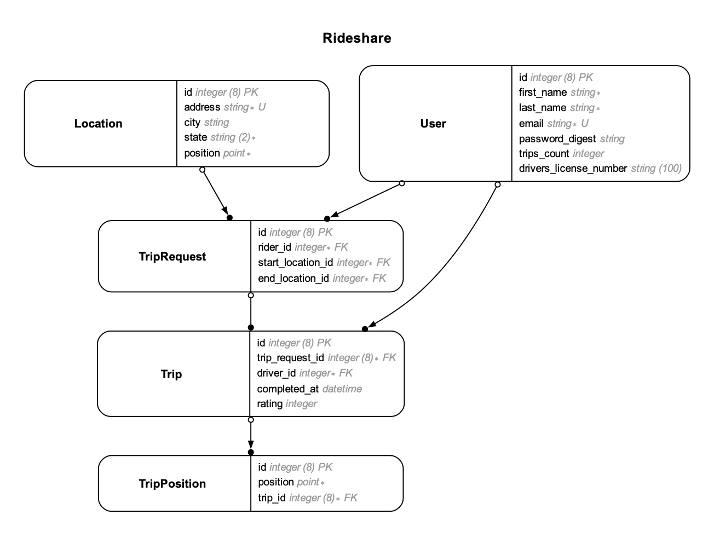

This post will walk through a step-by-step approach to PostgreSQL query enhancement in Rails applications. From indexing strategies to efficient column selection, you'll learn some techniques to ensure optimal query performance.

## Getting Started

To get started quicker with a Rails app, schema design, and data, I've forked the Rideshare Rails application. Rideshare is a Rails app on [GitHub](https://github.com/andyatkinson/rideshare) that's used for exercises in the book High Performance PostgreSQL for Rails. I had the opportunity to provide a technical review for the beta version of this book. Many insights shared in this post are derived from the valuable lessons learned during that review process. If you're interested in the book, it can be [purchased here](https://pragprog.com/titles/aapsql/high-performance-postgresql-for-rails/).

## Introducing Rideshare

Rideshare is an API-only Rails application that implements a portion of a fictional rideshare service. Think of Uber or Lyft. The core Rideshare models are Drivers, Riders, Trips, Trip Requests. The schema is shown below:



Single Table Inheritance (STI) is used to represent both Drivers and Riders in the Users table. This means that rows where `users.type = 'Driver'` are Drivers, and can be joined to Trips on `driver_id`. Rows where `users.type = 'Rider'` are Riders, and can be joined to TripRequests on `rider_id`.

For the exercises in this post, we will not be concerned with TripPositions, Vehicles, or VehicleReservations.

Here are the corresponding model classes, only focusing on the declared associations between them:

```ruby
class User < ApplicationRecord
end

class Trip < ApplicationRecord
  belongs_to :trip_request
  belongs_to :driver, class_name: 'User'
  has_many :trip_positions

  delegate :rider, to: :trip_request, allow_nil: false
end

class Location < ApplicationRecord
end

class TripRequest < ApplicationRecord
  belongs_to :rider, class_name: 'User'
  belongs_to :start_location, class_name: 'Location'
  belongs_to :end_location, class_name: 'Location'
  has_one :trip
end
```

## Building an Admin Report

We have a business requirement to create a dashboard type view for the admin team that manages Rideshare. They would like to have a view that shows recently completed trips. Each trip should display:
- Trip completed date
- Rating given by the rider
- Driver that provided the trip
- Rider that took the trip
- Location where the trip started

Being an API-only application, we will only focus on the query part of this logic in the model(s), and assume a separate front end application will take care of rendering the report.

## First Attempt

Before getting into the complexity of joins to get all the data, let's first focus on the main requirement, which is to show recently completed trips. We can use the `completed_at` timestamp column on the `Trip` model in a scope as follows:

```ruby
class Trip < ApplicationRecord
  scope :recently_completed, -> {
    where('completed_at >= ?', 1.week.ago)
  }
  # ...
end
```

Let's try this out in a Rails console `bin/rails c`

```ruby
results = Trip.recently_completed
# SELECT "trips"."id", "trips"."trip_request_id", "trips"."driver_id", "trips"."completed_at", "trips"."rating", "trips"."created_at", "trips"."updated_at"
# FROM "trips" WHERE (completed_at >= '2024-01-10 12:29:18.260820')

results.length
# => 559

results.first.attributes
# =>
# {"id"=>6011,
#  "trip_request_id"=>6031,
#  "driver_id"=>61038,
#  "completed_at"=>Wed, 10 Jan 2024 07:12:42.960652000 CST -06:00,
#  "rating"=>nil,
#  "created_at"=>Wed, 10 Jan 2024 02:12:42.960652000 CST -06:00,
#  "updated_at"=>Wed, 10 Jan 2024 07:12:42.960652000 CST -06:00}
```

In development mode, the console output displays the SQL query that ActiveRecord generated when the scope was executed. To understand the efficiency of this query, we need to view the query execution plan. To do this, launch a database console with `bin/rails dbconsole` and then enter the SQL query that was generated by ActiveRecord, preceded by the `EXPLAIN (ANALYZE)` command at the psql prompt:

```sql
EXPLAIN (ANALYZE) SELECT "trips"."id"
  , "trips"."trip_request_id"
  , "trips"."driver_id"
  , "trips"."completed_at"
  , "trips"."rating"
  , "trips"."created_at"
  , "trips"."updated_at"
FROM "trips"
WHERE (completed_at >= '2024-01-10 12:29:18.260820');

--                                               QUERY PLAN
-- ------------------------------------------------------------------------------------------------------
--  Seq Scan on trips  (cost=0.00..1106.00 rows=3521 width=48) (actual time=0.013..11.413 rows=3863 loops=1)
--    Filter: (completed_at >= '2024-01-04 12:20:54.270716'::timestamp without time zone)
--    Rows Removed by Filter: 46137
--  Planning Time: 1.193 ms
--  Execution Time: 11.880 ms
```

In PostgreSQL, the `EXPLAIN` statement is used to analyze and show the execution plan of a SQL query. It shows how the database engine is planning to execute the query, such as which indexes are used. While `EXPLAIN` can be run on its own, its typically used together with the `ANALYZE` option. This option tells PostgreSQL to actually execute the query, so the output will include runtime statistics such as the number of rows processed and execution time.

From the output above we can see that a sequential scan was performed to retrieve rows from the `trips` table:

```
Seq Scan on trips  (cost=0.00..1106.00 rows=3521 width=48) (actual time=0.013..11.413 rows=3863 loops=1)
```

It also shows that the query took nearly 12 ms to execute, which is relatively slow for such a simple query:

```
Execution Time: 11.880 ms
```

A sequential scan means that PostgreSQL is scanning the entire table sequentially to find rows that meet the condition specified in the WHERE clause - this is why its so slow. And it will continue to get slower as the number of trips increases. Which means this version of the query won't "scale" as the application grows.

To understand why a slow sequential scan is being used to filter `trips` rows based on `completed_at`, we can take a look at the `trips` table schema. Still in the database console, the `\d table_name` meta command can be used to display any table schema:

```
=> \d trips

                                           Table "rideshare.trips"
     Column      |              Type              | Collation | Nullable |              Default
-----------------+--------------------------------+-----------+----------+-----------------------------------
 id              | bigint                         |           | not null | nextval('trips_id_seq'::regclass)
 trip_request_id | bigint                         |           | not null |
 driver_id       | integer                        |           | not null |
 completed_at    | timestamp without time zone    |           |          |
 rating          | integer                        |           |          |
 created_at      | timestamp(6) without time zone |           | not null |
 updated_at      | timestamp(6) without time zone |           | not null |
Indexes:
    "trips_pkey" PRIMARY KEY, btree (id)
    "index_trips_on_driver_id" btree (driver_id)
    "index_trips_on_rating" btree (rating)
    "index_trips_on_trip_request_id" btree (trip_request_id)
Check constraints:
    "chk_rails_4743ddc2d2" CHECK (completed_at > created_at) NOT VALID
    "rating_check" CHECK (rating >= 1 AND rating <= 5)
Foreign-key constraints:
    "fk_rails_6d92acb430" FOREIGN KEY (trip_request_id) REFERENCES trip_requests(id)
    "fk_rails_e7560abc33" FOREIGN KEY (driver_id) REFERENCES users(id)
```

The `Indexes` section of the output above lists all the indexes that are available on the `trips` table. Notice there is no index on `completed_at`. So the next step in improving this query is to add an index.

## Second Attempt: Add Index

To add an index to an existing table in a Rails application, start by generating a database migration:

```bash
rails generate migration AddIndexToTripsCompletedAt
```

Fill in the `change` method, specifying what table the index should be added to, and on what column:

```ruby
# db/migrate/20240111132403_add_index_to_trips_completed_at.rb
class AddIndexToTripsCompletedAt < ActiveRecord::Migration[7.1]
  def change
    add_index :trips, :completed_at
  end
end
```

Run the migration with `bin/rails db:migrate`. However, in the Rideshare application, an error results and the migration is not applied:

```
Migrating to AddIndexToTripsCompletedAt (20240111132403)
== 20240111132403 AddIndexToTripsCompletedAt: migrating =======================
  TRANSACTION (0.7ms)  BEGIN
   (1.6ms)  SHOW server_version_num
   (0.7ms)  SET statement_timeout TO 3600000
   (0.7ms)  SET lock_timeout TO 10000
  TRANSACTION (0.7ms)  ROLLBACK
   (0.8ms)  SELECT pg_advisory_unlock(5537362570877065845)
bin/rails aborted!
StandardError: An error has occurred, this and all later migrations canceled: (StandardError)

=== Dangerous operation detected #strong_migrations ===

Adding an index non-concurrently blocks writes. Instead, use:

class AddIndexToTripsCompletedAt < ActiveRecord::Migration[7.1]
  disable_ddl_transaction!

  def change
    add_index :trips, :completed_at, algorithm: :concurrently
  end
end
```

This error is coming from the [Strong Migrations](https://github.com/ankane/strong_migrations) gem that is included in Rideshare. This gem prevents "dangerous" migrations from being added to the project.

The problem with this particular migration is that adding an index  will lock the table that it's being added to, which means the application won't be able to read or write from/to the `trips` table while this migration is in progress. Since adding an index can take a long time on large tables, this will result in application errors.

Since access to the `trips` table is critical to the functioning of the application, we can avoid potential downtime, by following the advice generated by the [Strong Migrations](https://github.com/ankane/strong_migrations) gem. Notice the error message included how the migration should be written. Here is the corrected version:

```ruby
class AddIndexToTripsCompletedAt < ActiveRecord::Migration[7.1]
  disable_ddl_transaction!

  def change
    add_index :trips, :completed_at, algorithm: :concurrently
  end
end
```

Specifying `algorithm: :concurrently` tells Postgres to add the index without locking the table. This way the application will remain responsive while the migration is running.

`disable_ddl_transaction!` disables the transaction for Data Definition Language statements, which is needed to create the index `concurrently`.

With this change in place, `bin/rails db:migrate` completes successfully and the index is now added.

Now we can re-analyze the completed trips query after adding index:
```sql
EXPLAIN (ANALYZE) SELECT "trips"."id"
  , "trips"."trip_request_id"
  , "trips"."driver_id"
  , "trips"."completed_at"
  , "trips"."rating"
  , "trips"."created_at"
  , "trips"."updated_at"
FROM "trips"
WHERE (completed_at >= '2024-01-10 12:29:18.260820');
                                                                 QUERY PLAN
-------------------------------------------------------------------------------------------------------------------------------------------
--  Bitmap Heap Scan on trips  (cost=67.58..592.59 rows=3521 width=48) (actual time=0.724..3.849 rows=3863 loops=1)
--    Recheck Cond: (completed_at >= '2024-01-04 12:20:54.270716'::timestamp without time zone)
--    Heap Blocks: exact=481
--    ->  Bitmap Index Scan on index_trips_on_completed_at  (cost=0.00..66.70 rows=3521 width=0) (actual time=0.603..0.604 --rows=3863 loops=1)
--          Index Cond: (completed_at >= '2024-01-04 12:20:54.270716'::timestamp without time zone)
--  Planning Time: 0.242 ms
--  Execution Time: 4.229 ms
```

This time the query planner is using the index on `completed_at` instead of a sequential scan:

```
Bitmap Heap Scan on trips...
->  Bitmap Index Scan on index_trips_on_completed_at...
      Index Cond: (completed_at >= '2024-01-04 12:20:54.270716'::timestamp without time zone)
```

And the overall time to complete this query is just over 4ms, a significant improvement over the previous ~12ms when using a sequential scan:

```
Execution Time: 4.229 ms
```

This is because the index allows Postgres to quickly locate and retrieve the relevant rows.

### Maybe Visualize

To use free web based tool: https://explain.dalibo.com/ (need to be ok with sharing query and plan publicly):

Put your query in a file (eg in `queries` dir):
```sql
-- queries/explain1.sql
EXPLAIN (ANALYZE, COSTS, VERBOSE, BUFFERS, FORMAT JSON)
SELECT ...
```

Run it, redirecting output to file, then copy to clipboard. These flags make it suitable for machine consumption:
```bash
psql -h 127.0.0.1 -p 5439 -U owner -d rideshare_development -XqAt -f queries/explain1.sql > queries/analyze1.json
cat queries/analyze1.json | pbcopy
# OR
psql -h 127.0.0.1 -p 5439 -U owner -d rideshare_development -XqAt -f queries/explain1.sql | tee queries/analyze1.json | pbcopy
```

## Third Attempt: Joins

Now that use of `completed_at` is optimized, we can continue development of the admin dashboard query. Recall we also need to show driver and rider information, as well as the trip location. To do this, we'll use the ActiveRecord [joins](https://api.rubyonrails.org/classes/ActiveRecord/QueryMethods.html#method-i-joins) method.

To get location information, the Trip model must be joined to `trip_request`, which must then be joined to `start_location` via a nested join. Getting rider and driver information is a little more complicated as we need to join the `users` table twice, once for Riders (which are joined on trip_request.rider_id), and another time for Drivers (which are joined on trips.driver_id). The same `where` clause as before is used to filter on recent trips.

By default, the result of `joins` will only select the columns from the model class on which its invoked, `Trip` in this case. But since the report needs to also show Driver, Rider, and Location information, this scope adds a `select` clause to get all fields from all tables:

```ruby
class Trip < ApplicationRecord
  scope :recently_completed, -> {
    joins(trip_request: [:start_location])
      .joins('INNER JOIN users AS riders ON riders.id = trip_requests.rider_id')
      .joins('INNER JOIN users AS drivers ON drivers.id = trips.driver_id')
      .where('trips.completed_at > ?', 1.week.ago)
      .select('trips.*, locations.*, drivers.*, riders.*')
  }
end
```

Here is what it looks like in a Rails console. Note that even though `results` is a relation of Trip models, each instance contains attributes from trips, locations, and users table. However, since both drivers and riders are actually from the same `users` table, the last one pulled in (`riders` in this case) "wins" and so the result only has the rider attributes. I've added `===` comments to highlight which model each set of attributes comes from:

```ruby
results = Trip.recently_completed
# Trip Load (2.5ms)  SELECT trips.*, locations.*, drivers.*, riders.*
# FROM "trips" INNER JOIN "trip_requests" ON "trip_requests"."id" = "trips"."trip_request_id"
# INNER JOIN "locations" ON "locations"."id" = "trip_requests"."start_location_id"
# INNER JOIN users AS riders ON riders.id = trip_requests.rider_id
# INNER JOIN users AS drivers ON drivers.id = trips.driver_id
# WHERE (trips.completed_at > '2024-01-10 12:20:01.192132')

results.length
# => 559

results.first.attributes
# {
#   === TRIP ATTRIBUTES ===
#   "id"=>61943,
#   "trip_request_id"=>56017,
#   "driver_id"=>60456,
#   "completed_at"=>Wed, 10 Jan 2024 07:21:26.462838000 CST -06:00,
#   "rating"=>5,

#   === LOCATION ATTRIBUTES ===
#   "address"=>"New York, NY",
#   "city"=>nil,
#   "state"=>"NY",
#   "position"=>#<struct ActiveRecord::Point x=40.7143528, y=-74.0059731>,

#   === USER AS RIDER ATTRIBUTES ===
#   "first_name"=>"Shantelle",
#   "last_name"=>"Kris",
#   "email"=>"Shantelle-Kris-522@email.com",
#   "type"=>"Rider",
#   "password_digest"=>"$2a$12...",
#   "trips_count"=>nil,
#   "drivers_license_number"=>nil
# }
```

Now this query can be analyzed in a database console session `bin/rails dbconsole`:

```sql
EXPLAIN (ANALYZE, BUFFERS) SELECT
    trips.*,
    locations.*,
    drivers.*,
    riders.*
FROM "trips"
INNER JOIN "trip_requests" ON "trip_requests"."id" = "trips"."trip_request_id"
INNER JOIN "locations" ON "locations"."id" = "trip_requests"."start_location_id"
INNER JOIN users AS riders ON riders.id = trip_requests.rider_id
INNER JOIN users AS drivers ON drivers.id = trips.driver_id
WHERE (trips.completed_at > '2024-01-10 12:05:39.639423');
--                                                                              QUERY PLAN
-----------------------------------------------------------------------------------------------------------------------------------------------------------------------
--  Hash Join  (cost=1399.44..2692.88 rows=524 width=453) (actual time=11.736..24.510 rows=559 loops=1)
--    Hash Cond: (trips.driver_id = drivers.id)
--    ->  Nested Loop  (cost=529.22..1821.28 rows=524 width=294) (actual time=1.109..13.507 rows=559 loops=1)
--          ->  Hash Join  (cost=528.93..1643.10 rows=524 width=139) (actual time=1.085..12.227 rows=559 loops=1)
--                Hash Cond: (trip_requests.start_location_id = locations.id)
--                ->  Hash Join  (cost=527.89..1637.76 rows=524 width=56) (actual time=1.054..11.992 rows=559 loops=1)
--                      Hash Cond: (trip_requests.id = trips.trip_request_id)
--                      ->  Seq Scan on trip_requests  (cost=0.00..917.10 rows=50010 width=16) (actual time=0.004..4.868 rows=50010 loops=1)
--                      ->  Hash  (cost=521.34..521.34 rows=524 width=48) (actual time=1.028..1.032 rows=559 loops=1)
--                            Buckets: 1024  Batches: 1  Memory Usage: 53kB
--                            ->  Bitmap Heap Scan on trips  (cost=12.35..521.34 rows=524 width=48) (actual time=0.116..0.896 rows=559 loops=1)
--                                  Recheck Cond: (completed_at > '2024-01-10 12:05:39.639423'::timestamp without time zone)
--                                  Heap Blocks: exact=328
--                                  ->  Bitmap Index Scan on index_trips_on_completed_at  (cost=0.00..12.22 rows=524 width=0) (actual time=0.060..0.060 rows=559 loops=1)
--                                        Index Cond: (completed_at > '2024-01-10 12:05:39.639423'::timestamp without time zone)
--                ->  Hash  (cost=1.02..1.02 rows=2 width=87) (actual time=0.019..0.021 rows=2 loops=1)
--                      Buckets: 1024  Batches: 1  Memory Usage: 9kB
--                      ->  Seq Scan on locations  (cost=0.00..1.02 rows=2 width=87) (actual time=0.011..0.013 rows=2 loops=1)
--          ->  Index Scan using users_pkey on users riders  (cost=0.29..0.34 rows=1 width=159) (actual time=0.002..0.002 rows=1 loops=559)
--                Index Cond: (id = trip_requests.rider_id)
--    ->  Hash  (cost=595.10..595.10 rows=22010 width=159) (actual time=10.601..10.601 rows=22010 loops=1)
--          Buckets: 32768  Batches: 1  Memory Usage: 3221kB
--          ->  Seq Scan on users drivers  (cost=0.00..595.10 rows=22010 width=159) (actual time=0.021..4.849 rows=22010 loops=1)
--  Planning Time: 1.046 ms
--  Execution Time: 24.936 ms
```

This time execution time has gone up, even though the query is still using the index on `trips.completed_at`:

```
Execution Time: 24.936 ms
```

This is due to the multiple joins, which are shown in the query execution plan as `Hash Cond`, which is the condition for the join operation, examples:

```
Hash Cond: (trips.driver_id = drivers.id)
Hash Cond: (trip_requests.start_location_id = locations.id)
...
```

It's also fetching more data due to the SELECT clause specifying all columns on all tables in the joins. Another way to improve performance is to reduce the "width" of the results.


## Fourth Attempt: Select only the columns you need

The previous query selected all columns from all of the joined tables. But recall the business requirements were that we only need to display a few of these. Let's "narrow" the amount of data by restricting the columns in the select to only what we need. This also allows us to do some string concatenation to distinguish between driver and rider names.

```ruby
class Trip < ApplicationRecord
  scope :recently_completed, -> {
    joins(trip_request: [:start_location])
      .joins('INNER JOIN users AS riders ON riders.id = trip_requests.rider_id')
      .joins('INNER JOIN users AS drivers ON drivers.id = trips.driver_id')
      .where('trips.completed_at > ?', 1.week.ago)
      .select('trips.completed_at, trips.rating, locations.address,
               drivers.first_name || \' \' || drivers.last_name AS driver_name,
               riders.first_name || \' \' || riders.last_name AS rider_name')
  }
  # ...
end
```

Running this query in the Rails console shows the attributes contain exactly what's needed to display in the view, with no extraneous data.

```ruby
results = Trip.recently_completed

results.first.attributes
# {
#   "completed_at" => Wed, 10 Jan 2024 07:12:42.960652000 CST -06:00,
#   "rating" => nil,
#   "address" => "New York, NY",
#   "driver_name" => "Rasheeda Brakus",
#   "rider_name" => "Corina Gorczany",
#   "id" => nil
# }
```

Again we can view the query execution plan:

```sql
EXPLAIN (ANALYZE) SELECT
  trips.completed_at,
  trips.rating,
  locations.address,
  drivers.first_name || ' ' || drivers.last_name AS driver_name,
  riders.first_name || ' ' || riders.last_name AS rider_name
FROM trips
INNER JOIN trip_requests ON trip_requests.id = trips.trip_request_id
INNER JOIN locations ON locations.id = trip_requests.start_location_id
INNER JOIN users AS riders ON riders.id = trip_requests.rider_id
INNER JOIN users AS drivers ON drivers.id = trips.driver_id
WHERE trips.completed_at > '2024-01-10 12:27:19.062944';
--                                                                               QUERY PLAN
-- -----------------------------------------------------------------------------------------------------------------------------------------------------------------------
--  Hash Join  (cost=1398.27..2693.98 rows=516 width=88) (actual time=8.572..20.188 rows=559 loops=1)
--    Hash Cond: (trips.driver_id = drivers.id)
--    ->  Nested Loop  (cost=528.05..1817.24 rows=516 width=41) (actual time=1.246..12.363 rows=559 loops=1)
--          ->  Hash Join  (cost=527.76..1641.78 rows=516 width=32) (actual time=1.224..11.156 rows=559 loops=1)
--                Hash Cond: (trip_requests.start_location_id = locations.id)
--                ->  Hash Join  (cost=526.71..1636.51 rows=516 width=24) (actual time=1.191..10.985 rows=559 loops=1)
--                      Hash Cond: (trip_requests.id = trips.trip_request_id)
--                      ->  Seq Scan on trip_requests  (cost=0.00..917.10 rows=50010 width=16) (actual time=0.005..4.199 rows=50010 loops=1)
--                      ->  Hash  (cost=520.26..520.26 rows=516 width=24) (actual time=1.167..1.174 rows=559 loops=1)
--                            Buckets: 1024  Batches: 1  Memory Usage: 38kB
--                            ->  Bitmap Heap Scan on trips  (cost=12.29..520.26 rows=516 width=24) (actual time=0.138..1.060 rows=559 loops=1)
--                                  Recheck Cond: (completed_at > '2024-01-10 12:27:19.062944'::timestamp without time zone)
--                                  Heap Blocks: exact=328
--                                  ->  Bitmap Index Scan on index_trips_on_completed_at  (cost=0.00..12.16 rows=516 width=0) (actual time=0.081..0.081 rows=559 loops=1)
--                                        Index Cond: (completed_at > '2024-01-10 12:27:19.062944'::timestamp without time zone)
--                ->  Hash  (cost=1.02..1.02 rows=2 width=20) (actual time=0.020..0.021 rows=2 loops=1)
--                      Buckets: 1024  Batches: 1  Memory Usage: 9kB
--                      ->  Seq Scan on locations  (cost=0.00..1.02 rows=2 width=20) (actual time=0.012..0.013 rows=2 loops=1)
--          ->  Index Scan using users_pkey on users riders  (cost=0.29..0.34 rows=1 width=21) (actual time=0.002..0.002 rows=1 loops=559)
--                Index Cond: (id = trip_requests.rider_id)
--    ->  Hash  (cost=595.10..595.10 rows=22010 width=21) (actual time=7.296..7.296 rows=22010 loops=1)
--          Buckets: 32768  Batches: 1  Memory Usage: 1492kB
--          ->  Seq Scan on users drivers  (cost=0.00..595.10 rows=22010 width=21) (actual time=0.007..3.716 rows=22010 loops=1)
--  Planning Time: 1.649 ms
--  Execution Time: 20.553 ms
```

This time the performance is slightly improved:

```
Execution Time: 20.553 ms
```

It still needs to perform all the joins, but less overall data is being fetched from the database. This can be observed by the smaller `width` attribute in the `Hash Join` operations. The `width` refers to the total number of bytes required to store the output of the join operation, and is proportional to the number of columns in the SELECT clause.

For example, focusing on the top level Hash Join operation, this query has a width of 88:

```
Hash Join  (cost=1398.27..2693.98 rows=516 width=88) (actual time=8.572..20.188 rows=559 loops=1)
```

Whereas the previous version of the query where all columns from all tables were being retrieved shows an overall width of 453:

```
Hash Join  (cost=1399.44..2692.88 rows=524 width=453) (actual time=11.736..24.510 rows=559 loops=1)
```

Selecting only the necessary columns can lead to performance improvements including reduced disk I/O and smaller memory requirements.

## Fifth Attempt: Restrict rows further if possible

Another way to improve performance is to reduce the total number of rows by adding additional criteria to further filter the results. This could require some discussion between engineering and product teams to make sure everyone understands the business problem that is being solved. For example, in this case, it turns out the admin team really wants to focus on recent trips with low ratings, so they can investigate what happened on some of those trips to improve customer experience. Up until now, they've been sorting the results client side by low rating, and investigating those.

Given this better understanding of the requirements, another `where` condition can be added to the scope, to only retrieve trips where the rating is less than or equal to 3 (it's a 5 star rating system). Note that there already is an index on `trips.rating`.

```ruby
class Trip < ApplicationRecord
  scope :recently_completed, -> {
    joins(trip_request: [:start_location])
      .joins('INNER JOIN users AS riders ON riders.id = trip_requests.rider_id')
      .joins('INNER JOIN users AS drivers ON drivers.id = trips.driver_id')
      .where('trips.completed_at > ?', 1.week.ago)
      .where('trips.rating <= ?', 3)
      .select('trips.completed_at, trips.rating, locations.address,
               drivers.first_name || \' \' || drivers.last_name AS driver_name,
               riders.first_name || \' \' || riders.last_name AS rider_name')
  }
end
```

This time, the results are "shaped" the same as before because the SELECT columns are the same, but the total number of results is smaller:

```ruby
results = Trip.admin_report
# query tbd...

results.length
# => 78
```

Explain/analyze the query:

```sql
EXPLAIN (ANALYZE) SELECT
  trips.completed_at,
  trips.rating,
  locations.address,
  drivers.first_name || ' ' || drivers.last_name AS driver_name,
  riders.first_name || ' ' || riders.last_name AS rider_name
FROM trips
INNER JOIN trip_requests ON trip_requests.id = trips.trip_request_id
INNER JOIN locations ON locations.id = trip_requests.start_location_id
INNER JOIN users AS riders ON riders.id = trip_requests.rider_id
INNER JOIN users AS drivers ON drivers.id = trips.driver_id
WHERE (trips.completed_at > '2024-01-10 13:08:58.257990')
  AND (trips.rating <= 3);
```

```
                                                                                 QUERY PLAN
-----------------------------------------------------------------------------------------------------------------------------------------------------------------------------
 Nested Loop  (cost=97.88..1340.17 rows=75 width=88) (actual time=0.514..1.937 rows=78 loops=1)
   Join Filter: (trip_requests.start_location_id = locations.id)
   Rows Removed by Join Filter: 78
   ->  Seq Scan on locations  (cost=0.00..1.02 rows=2 width=20) (actual time=0.012..0.015 rows=2 loops=1)
   ->  Materialize  (cost=97.88..1336.34 rows=75 width=42) (actual time=0.247..0.937 rows=78 loops=2)
         ->  Nested Loop  (cost=97.88..1335.96 rows=75 width=42) (actual time=0.488..1.819 rows=78 loops=1)
               ->  Nested Loop  (cost=97.59..862.59 rows=75 width=33) (actual time=0.463..1.492 rows=78 loops=1)
                     ->  Nested Loop  (cost=97.30..837.09 rows=75 width=24) (actual time=0.449..1.240 rows=78 loops=1)
                           ->  Bitmap Heap Scan on trips  (cost=97.01..298.02 rows=75 width=24) (actual time=0.436..0.645 rows=78 loops=1)
                                 Recheck Cond: ((completed_at > '2024-01-10 13:08:58.25799'::timestamp without time zone) AND (rating <= 3))
                                 Heap Blocks: exact=72
                                 ->  BitmapAnd  (cost=97.01..97.01 rows=75 width=0) (actual time=0.419..0.421 rows=0 loops=1)
                                       ->  Bitmap Index Scan on index_trips_on_completed_at  (cost=0.00..12.05 rows=501 width=0) (actual time=0.083..0.083 rows=559 loops=1)
                                             Index Cond: (completed_at > '2024-01-10 13:08:58.25799'::timestamp without time zone)
                                       ->  Bitmap Index Scan on index_trips_on_rating  (cost=0.00..84.67 rows=7518 width=0) (actual time=0.314..0.314 rows=7531 loops=1)
                                             Index Cond: (rating <= 3)
                           ->  Index Scan using trip_requests_pkey on trip_requests  (cost=0.29..7.19 rows=1 width=16) (actual time=0.007..0.007 rows=1 loops=78)
                                 Index Cond: (id = trips.trip_request_id)
                     ->  Index Scan using users_pkey on users riders  (cost=0.29..0.34 rows=1 width=21) (actual time=0.003..0.003 rows=1 loops=78)
                           Index Cond: (id = trip_requests.rider_id)
               ->  Memoize  (cost=0.30..6.55 rows=1 width=21) (actual time=0.004..0.004 rows=1 loops=78)
                     Cache Key: trips.driver_id
                     Cache Mode: logical
                     Hits: 8  Misses: 70  Evictions: 0  Overflows: 0  Memory Usage: 9kB
                     ->  Index Scan using users_pkey on users drivers  (cost=0.29..6.54 rows=1 width=21) (actual time=0.003..0.003 rows=1 loops=70)
                           Index Cond: (id = trips.driver_id)
 Planning Time: 1.168 ms
 Execution Time: 2.360 ms
```

Significant execution time improvement from further restricting the number of rows.

The performance improvement in Query C compared to Query B can be attributed to several factors, as indicated by the execution plans. Here are some key reasons why Query C is faster:

1. **Index Scans Optimization:**
   - Both Query B and Query C use Bitmap Index Scans on the "index_trips_on_completed_at" and "index_trips_on_rating" indexes. However, Query C benefits from the additional filter condition `(trips.rating <= 3)`, allowing the database to leverage the "index_trips_on_rating" index efficiently.

2. **BitmapAnd Operation:**
   - Query C introduces a BitmapAnd operation that combines the results of two Bitmap Index Scans, optimizing the process of satisfying both filter conditions (`completed_at` and `rating <= 3`). This can lead to a more efficient evaluation of the WHERE clause.

3. **Materialization and Caching:**
   - Query C includes a Materialize operation, which caches the result of the Nested Loop Join involving the "trips," "trip_requests," and "users" tables. This caching mechanism can contribute to performance improvement by avoiding repeated calculations.

4. **Smaller Result Set:**
   - The additional filter condition in Query C (`rating <= 3`) reduces the number of rows that need to be processed in subsequent join operations. This can lead to a smaller result set, potentially requiring less processing and memory.

5. **Nested Loop Join Optimization:**
   - The Nested Loop Join in Query C involves joining with the "locations" table. The Join Filter condition is `trip_requests.start_location_id = locations.id`. The optimizer may choose a more efficient strategy for this join, considering the additional filter condition.

6. **Reduced Memory Usage:**
   - The overall memory usage for Query C might be lower due to optimizations and the smaller result set, leading to better utilization of system resources.

## Brainstorming Outline

- start with task of admin dashboard to show recently completed trips (will just focus on query logic rather than display/view)
- simple schema diagram: User, TripRequest, Trip, Location (note that User is using STI with type for Driver and Rider)
- Also show corresponding Ruby models with associations and delegate so its clear how they can be joined (eg: TripRequest joins to Location twice, once as start_location and again as end_location: `belongs_to :start_location, class_name: 'Location'`)
- First Attempt: where there's no index on `trips.completed_at` (don't do joins at this point to keep explain analyze output simple): `Trip.where('trips.completed_at > ?', 1.week.ago)`
- show explain analyze -> sequence scan
- add index on completed_at -> note strong_migrations gem installed on project that errors on "naive" approach to adding index, fix it with concurrently, explain about avoiding locking table for reads and writes while index is applied
- Second Attempt: run `Trip.where(...)` again with explain analyze and compare improvement with index
- possibly also reference free visualization tool and how to extract detailed explain/analyze in json format
- Third Attempt: join location, riders, and drivers info but naively select *
- Fourth Attempt: reduce number of columns by selecting only what's needed in the report
- Fifth Attempt: reduce rows by focusing only on low trip ratings

## Scratch Schema

```sql
CREATE TABLE rideshare.trips (
    id bigint NOT NULL,
    trip_request_id bigint NOT NULL,
    driver_id integer NOT NULL,
    completed_at timestamp without time zone,
    rating integer,
    created_at timestamp(6) without time zone NOT NULL,
    updated_at timestamp(6) without time zone NOT NULL,
    CONSTRAINT rating_check CHECK (((rating >= 1) AND (rating <= 5)))
);

CREATE TABLE rideshare.users (
    id bigint NOT NULL,
    first_name character varying NOT NULL,
    last_name character varying NOT NULL,
    email character varying NOT NULL,
    type character varying NOT NULL,
    created_at timestamp(6) without time zone NOT NULL,
    updated_at timestamp(6) without time zone NOT NULL,
    password_digest character varying,
    trips_count integer,
    drivers_license_number character varying(100)
);

CREATE TABLE rideshare.locations (
    id bigint NOT NULL,
    address character varying NOT NULL,
    created_at timestamp(6) without time zone NOT NULL,
    updated_at timestamp(6) without time zone NOT NULL,
    city character varying,
    state character(2) NOT NULL,
    "position" point NOT NULL,
    CONSTRAINT state_length_check CHECK ((length(state) = 2))
);

CREATE TABLE rideshare.trip_positions (
    id bigint NOT NULL,
    "position" point NOT NULL,
    trip_id bigint NOT NULL,
    created_at timestamp(6) without time zone NOT NULL,
    updated_at timestamp(6) without time zone NOT NULL
);

CREATE TABLE rideshare.trip_requests (
    id bigint NOT NULL,
    rider_id integer NOT NULL,
    start_location_id integer NOT NULL,
    end_location_id integer NOT NULL,
    created_at timestamp(6) without time zone NOT NULL,
    updated_at timestamp(6) without time zone NOT NULL
);
```

## Scratch Trip Model with all versions of admin_report

Has since been converted to scope `recently_completed`

```ruby
class Trip < ApplicationRecord
  belongs_to :trip_request
  belongs_to :driver, class_name: 'User'
  delegate :rider, to: :trip_request, allow_nil: false

  # First attempt: Only focus on recently completed trips with no index on completed_at column
  # Second attempt: Re-run after adding index on completed_at, check results of explain/analyze for perf improvement
  def self.admin_report
    where('trips.completed_at > ?', 1.week.ago)
      .order(completed_at: :desc)
  end

  # Third attempt: Get additional data needed for admin report using joins, nested joins, and custom string join
  # ref: https://api.rubyonrails.org/classes/ActiveRecord/QueryMethods.html#method-i-joins
  # problem with naive select * approach is second time pulling in users table attributes override drivers/users
  # also, loads in more data than what we need because admin report doesn't need all those columns from every table
  # def self.admin_report
  #   joins(trip_request: [:start_location, :rider])
  #     .joins('INNER JOIN users AS drivers ON drivers.id = trips.driver_id')
  #     .where('trips.completed_at > ?', 1.week.ago)
  #     .select('trips.*, locations.*, drivers.*, users.*')
  #     .order(completed_at: :desc)
  # end

  # Fourth attempt: Specify only the columns you need in select rather than *
  # def self.admin_report
  #   joins(trip_request: [:start_location, :rider])
  #     .joins('INNER JOIN users AS drivers ON drivers.id = trips.driver_id')
  #     .where('trips.completed_at > ?', 1.week.ago)
  #     .select('trips.completed_at, trips.rating, locations.address,
  #              drivers.first_name || \' \' || drivers.last_name AS driver_name,
  #              users.first_name || \' \' || users.last_name AS rider_name')
  #     .order(completed_at: :desc)
  # end

  # Fifth attempt: focus only on trips with low ratings
  # def self.admin_report
  #   joins(trip_request: [:start_location, :rider])
  #     .joins('INNER JOIN users AS drivers ON drivers.id = trips.driver_id')
  #     .where('trips.completed_at > ?', 1.week.ago)
  #     .where('trips.rating <= ?', 3)
  #     .select('trips.completed_at, trips.rating, locations.address,
  #              drivers.first_name || \' \' || drivers.last_name AS driver_name,
  #              users.first_name || \' \' || users.last_name AS rider_name')
  #     .order(completed_at: :desc)
  # end

  # Maybe also mention pagination with limit/offset
end
```

## Scratch Pure SQL Solution

```sql
SELECT t.completed_at
  , t.rating
  , l.address
  , ud.first_name || ' ' || ud.last_name as driver_name
  , ur.first_name || ' ' || ur.last_name as rider_name
FROM trips t
  INNER JOIN trip_requests tr ON tr.id = t.trip_request_id
  INNER JOIN locations l on l.id = tr.start_location_id
  INNER JOIN users ud ON ud.id = t.driver_id
  INNER JOIN users ur on ur.id = tr.rider_id
ORDER BY t.completed_at DESC;
```

## Scratch Working with Rideshare

```bash
bin/rails db:truncate_all
bin/rails data_generators:generate_all
```

## TODO
* WIP: introduce rideshare schema and models
* WIP: main content
* WIP: need more work on explanation of why at each step there was perf improvement based on analyzing the plan
* Mention the database is postgres
* Mention that all the FK columns are already indexed
* Link to generate task for seeds from rideshare. Mention that I modified it to generate 50_000 rows and added random variability in `completed_at` date.
* At end of fifth attempt - caution to check for indexes on any additional filters being added to the query
* `EXPLAIN` vs `EXPLAIN (ANALYZE)` (both show the plan but analyze option passed to explain also executes the query to get actual cost rather than just estimate produced  by explain alone)
* aside: rails-erd gem was used to generate the diagram: https://github.com/voormedia/rails-erd
* aside: Need so much data because when filtering rows for tables with low row counts, PostgreSQL may decide to scan the whole table instead of using an index. i.e. need to ensure seeds generate significant enough data size, if only have 10 or so rows, Postgres may decide not to use the index even if its there.
* conclusion para
* remove scratch content
* edit
* Nice to have: Only have 50_000 rows in trips/trip_requests, need 10M or more to see effect of index? Need pure sql loading solution, will be too slow via db/seeds.rb (but tricky due to 1-1 relationship between trip_requests and trips tables)
