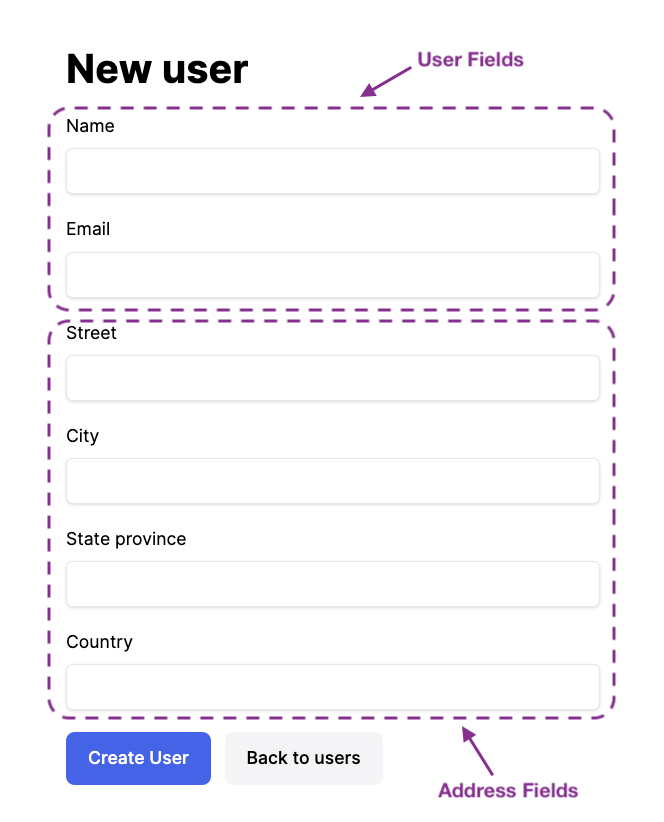

When building a web application for a  relational data model, handling nested models in a single form submission is a common requirement. Rails provides a powerful solution with the ActiveRecord method `accepts_nested_attributes_for`. This feature enables us to create a form that captures both the main model and its associated model(s), streamlining the user experience. However, this can sometimes lead to issues with validation, as we'll explore in this post. We'll see how the `reject_if` option comes to the rescue, enabling us to create a flexible form that can handle optional associated models.

You can also follow along with a complete [demo project](https://github.com/danielabar/nested_model_demo) on GitHub.

## Initial Setup

Consider the following example: A `User` can have an `Address`, and the `Address` belongs to the `User` (i.e. the `user_id` foreign key is on the `addresses` table). Both models have some basic validation rules to ensure the required data is populated:

```ruby
# == Schema Information
#
# Table name: users
#
#  id         :integer          not null, primary key
#  email      :string           not null
#  name       :string           not null
#  created_at :datetime         not null
#  updated_at :datetime         not null
#
# Indexes
#
#  index_users_on_email  (email) UNIQUE
#
class User < ApplicationRecord
  has_one :address, dependent: :destroy

  validates :name, presence: true
  validates :email, presence: true, uniqueness: true
end
```

```ruby
# == Schema Information
#
# Table name: addresses
#
#  id             :integer          not null, primary key
#  city           :string           not null
#  country        :string           not null
#  state_province :string           not null
#  street         :string           not null
#  created_at     :datetime         not null
#  updated_at     :datetime         not null
#  user_id        :integer          not null
#
# Indexes
#
#  index_addresses_on_user_id  (user_id)
#
# Foreign Keys
#
#  user_id  (user_id => users.id)
#
class Address < ApplicationRecord
  belongs_to :user

  validates :street, :city, :state_province, :country, presence: true
end
```

Here is the default `UsersController` generated by the Rails [scaffold](https://www.rubyguides.com/2020/03/rails-scaffolding/) command:

```ruby
class UsersController < ApplicationController
  before_action :set_user, only: %i[show edit update destroy]

  # GET /users or /users.json
  def index
    @users = User.all
  end

  # GET /users/1 or /users/1.json
  def show; end

  # GET /users/new
  def new
    @user = User.new
  end

  # GET /users/1/edit
  def edit
  end

  # POST /users or /users.json
  def create
    @user = User.new(user_params)

    respond_to do |format|
      if @user.save
        format.html { redirect_to user_url(@user), notice: "User was successfully created." }
        format.json { render :show, status: :created, location: @user }
      else
        format.html { render :new, status: :unprocessable_entity }
        format.json { render json: @user.errors, status: :unprocessable_entity }
      end
    end
  end

  # PATCH/PUT /users/1 or /users/1.json
  def update
    respond_to do |format|
      if @user.update(user_params)
        format.html { redirect_to user_url(@user), notice: "User was successfully updated." }
        format.json { render :show, status: :ok, location: @user }
      else
        format.html { render :edit, status: :unprocessable_entity }
        format.json { render json: @user.errors, status: :unprocessable_entity }
      end
    end
  end

  # DELETE /users/1 or /users/1.json
  def destroy
    @user.destroy!

    respond_to do |format|
      format.html { redirect_to users_url, notice: "User was successfully destroyed." }
      format.json { head :no_content }
    end
  end

  private

  # Use callbacks to share common setup or constraints between actions.
  def set_user
    @user = User.find(params[:id])
  end

  # Only allow a list of trusted parameters through.
  def user_params
    params.require(:user).permit(:name, :email)
  end
end
```

Here is the users form partial `app/views/users/_form.html.erb` that handles both new User creation and editing existing Users. Again, this is generated by the scaffold command:

```erb
<%= form_with(model: user, class: "contents") do |form| %>
  <% if user.errors.any? %>
    <div id="error_explanation">
      <h2><%= pluralize(user.errors.count, "error") %> prohibited this user from being saved:</h2>
      <ul>
        <% user.errors.each do |error| %>
          <li><%= error.full_message %></li>
        <% end %>
      </ul>
    </div>
  <% end %>

  <div>
    <%= form.label :name %>
    <%= form.text_field :name%>
  </div>

  <div>
    <%= form.label :email %>
    <%= form.text_field :email%>
  </div>

  <div>
    <%= form.submit%>
  </div>
<% end %>
```

## Introducing accepts_nested_attributes_for

Now suppose we want to enhance the User form, to also contain the Address fields, such that when the form is submitted, the address automatically gets associated with the user. Here are the changes to make this happen.

Start by updating the `User` model, to declare that it accepts nested attributes for the address model:

```ruby
class User < ApplicationRecord
  has_one :address, dependent: :destroy

  # === NEW ===
  accepts_nested_attributes_for :address

  validates :name, presence: true
  validates :email, presence: true, uniqueness: true
end
```

The [accepts_nested_attribute_for](https://api.rubyonrails.org/classes/ActiveRecord/NestedAttributes/ClassMethods.html#method-i-accepts_nested_attributes_for) method defines an attribute writer for the specified association. This enabled a parent model to accept and update attributes for its associated child model. In the example above, we're declaring that from the User model, it can populate attributes for the Address model.

Next we need to modify the `new` method in the `UsersController` to build a potential address for the user using the `build_address` method:

```ruby
class UsersController < ApplicationController
  # ...
  def new
    @user = User.new

    # === NEW ===
    @user.build_address # Build a new address for the user
  end
  # ...
end
```

Now the user form partial `app/views/users/_form.html.erb` can be updated to use the [fields_for](https://api.rubyonrails.org/classes/ActionView/Helpers/FormHelper.html#method-i-fields_for) helper to render the address fields for the user:

```erb
<%= form_with(model: user, class: "contents") do |form| %>
  <%# Validation errors... %>

  <%# === USER FIELDS === %>
    <%= form.label :name %>
    <%= form.text_field :name%>

    <%= form.label :email %>
    <%= form.text_field :email%>

  <%# === NEW SECTION START === %>
  <%= form.fields_for :address do |address_fields| %>
      <%= address_fields.label :street %>
      <%= address_fields.text_field :street %>

      <%= address_fields.label :city %>
      <%= address_fields.text_field :city %>

      <%= address_fields.label :state_province %>
      <%= address_fields.text_field :state_province %>

      <%= address_fields.label :country %>
      <%= address_fields.text_field :country %>
    <%# === NEW SECTION END === %>

    <%= form.submit%>
  <% end %>
<% end %>
```

The `fields_for` helper yields a block, similar to `form_with`, but it does not generate the `<form>...</form>` tags. This makes it suitable for specifying additional model objects in the same form.

At this point, starting a Rails server with `bin/rails s` and then navigating to the new user url at `http://localhost:3000/users/new` will show the form now has both user and address fields:



The markup generated shows that the address fields are named differently to distinguish them from being direct attributes on the user model:

```htm
<form action="/users" method="post">
  <input type="hidden" name="authenticity_token" value="abc123..." autocomplete="off">

  <!-- User attributes are named user[field] -->
  <label for="user_name">Name</label>
  <input type="text" name="user[name]" id="user_name">

  <label for="user_email">Email</label>
  <input type="text" name="user[email]" id="user_email">

  <!-- Address attributes are named user[address_attributes][field] -->
  <label for="user_address_attributes_street">Street</label>
  <input type="text" name="user[address_attributes][street]" id="user_address_attributes_street">

  <label for="user_address_attributes_city">City</label>
  <input type="text" name="user[address_attributes][city]" id="user_address_attributes_city">

  <label for="user_address_attributes_state_province">State province</label>
  <input type="text" name="user[address_attributes][state_province]" id="user_address_attributes_state_province">

  <label for="user_address_attributes_country">Country</label>
  <input type="text" name="user[address_attributes][country]" id="user_address_attributes_country">

  <input type="submit" name="commit" value="Create User" data-disable-with="Create User">
</form>
```

However, trying to submit this form won't work as expected. The user will be saved, but the associated address will not. Here is some example output from the Rails server when submitting this form with some example values. I've formatted it and added some annotations:

```
# === FORM SUBMITTED AND PROCESSED BY CONTROLLER ===
Started POST "/users" for ::1 at 2024-05-19 09:17:51 -0400
Processing by UsersController#create as TURBO_STREAM

# === ADDRESS_ATTRIBUTES ARE NESTED IN PARAMETERS ===
Parameters: {
  "authenticity_token"=>"[FILTERED]",
  "user"=>{"name"=>"Jane",
  "email"=>"jane@example.com",
  "address_attributes"=>{
    "street"=>"123 Main St.",
    "city"=>"Anytown",
    "state_province"=>"Ontario",
    "country"=>"Canada"}
  },
  "commit"=>"Create User"}

# === ERROR FROM CONTROLLER BECAUSE ADDRESS_ATTRIBUTES ARE NOT PERMITTED ===
Unpermitted parameter: :address_attributes. Context: {
  controller: UsersController,
  action: create,
  ...
}

# === CHECK IF EMAIL ALREADY EXISTS, AND IF NOT, CREATE USER ===
TRANSACTION (0.0ms)  begin transaction
  User Exists? (0.7ms)  SELECT 1 AS one FROM "users" WHERE "users"."email" = ? LIMIT ?  [["email", "jane@example.com"], ["LIMIT", 1]]
  User Create (0.1ms)  INSERT INTO "users" ("name", "email", "created_at", "updated_at")
                       VALUES (?, ?, ?, ?)
                       RETURNING "id"
                       [["name", "Jane"], ["email", "Smith"], timestamps...]
TRANSACTION (0.1ms)  commit transaction

# === CREATED NEW USER WITH ID 14 BUT IT HAS NO ADDRESS ===
Redirected to http://localhost:3000/users/14
```

The problem is that the `UsersController` generated from the scaffold command only knew about the user email and name attributes at the time:

```ruby
class UsersController < ApplicationController
  # ...

  private

  # Only allows `name` and `email` to be passed on from form submission
  def user_params
    params.require(:user).permit(:name, :email)
  end
end
```

Since we're now also expecting `street`, `city`, etc from the address attributes, those need to be permitted as well:

```ruby
class UsersController < ApplicationController
  # ...

  private

  # === MODIFIED TO ALLOW ADDRESS ATTRIBUTES ===
  def user_params
    params.require(:user).permit(:name, :email, address_attributes: %i[id street city state_province country])
  end
end
```

Now we can again try to create a new user, and this time the transaction will create both a user and associated address. Focusing on just the transaction part of the Rails server output:

```
TRANSACTION (0.1ms)  begin transaction
  # === CHECK IF THIS EMAIL IS ALREADY TAKEN ===
  User Exists? (1.1ms)  SELECT 1 AS one FROM "users" WHERE "users"."email" = ? LIMIT ?  [["email", "sarah@example.com"], ["LIMIT", 1]]

  # === CREATE USER ===
  User Create (0.2ms)  INSERT INTO "users" ("name", "email", "created_at", "updated_at")
                       VALUES (?, ?, ?, ?)
                       RETURNING "id"
                       [["name", "Sarah"], ["email", "sarah@example.com"], timestamps...]

  # === CREATE ADDRESS ASSOCIATED WITH THE USER ===
  Address Create (0.1ms)  INSERT INTO "addresses" ("street", "city", "state_province", "country", "user_id", ...)
                          VALUES (?, ?, ?, ?, ?, ?, ?, ?)
                          RETURNING "id"
                          [["street", "321 Main St."], ["city", "Somewhere"], ["state_province", "Quebec"], ["country", "Canada"], ["user_id", 15], timestamps...]
  TRANSACTION (0.2ms)  commit transaction
```

## The Problem: Validation

There is a problem with the current solution. In this particular app, it should allow the user to be created without an address. However, trying to create a new user while intentionally leaving the address fields blank will result in a validation error. For example, when submitting the form below:


The server will render the new form with validation errors:


The Rails server output shows that the transaction was rolled back:

```
# === FORM SUBMITTED AND PROCESSED BY CONTROLLER ===
Started POST "/users" for ::1 at 2024-05-19 09:55:59 -0400
Processing by UsersController#create as TURBO_STREAM

# === THIS TIME ADDRESS ATTRIBUTES ARE ALL EMPTY ===
Parameters: {
  "authenticity_token"=>"[FILTERED]",
  "user"=>{
    "name"=>"mary",
    "email"=>"mary@example.com",
    "address_attributes"=>{"street"=>"", "city"=>"", "state_province"=>"", "country"=>""}
  },
  "commit"=>"Create User"}

# === NOTHING IS SAVED ===
TRANSACTION (0.0ms)  begin transaction
User Exists? (1.9ms)  SELECT 1 AS one FROM "users" WHERE "users"."email" = ? LIMIT ?  [["email", "mary@example.com"], ["LIMIT", 1]]
TRANSACTION (0.0ms)  rollback transaction

# === RENDERS THE NEW FORM AGAIN BUT WITH VALIDATION ERRORS ===
Completed 422 Unprocessable Entity in 16ms (Views: 7.7ms | ActiveRecord: 2.8ms | Allocations: 15878)
```

This problem occurs because of the existing validation rules on the Address model:

```ruby
class Address < ApplicationRecord
  belongs_to :user

  validates :street, :city, :state_province, :country, presence: true
end
```

When the user form is submitted with empty values for all the address fields, Rails is trying to create a new Address for this User with blank values, which fails the validation. And since the entire operation (User and Address creation) occurs in a transaction, it gets rolled back if any error occurs, which results in nothing being saved.

## Solution: reject_if Option

What we'd like to tell Rails is: If any of the address fields have been filled in, then go ahead and validate them and save the address. However, if the user has not filled in any address field, it means they don't want to create an address. In this case, only create the User model, but do not attempt to create and associate a new Address model.

Rails provides a solution to this with the `reject_if` option of the `accepts_nested_attributes_for` class method. According to the [documentation](https://api.rubyonrails.org/classes/ActiveRecord/NestedAttributes/ClassMethods.html#method-i-accepts_nested_attributes_for), `reject_if`:

> Allows you to specify a Proc or a Symbol pointing to a method that checks whether a record should be built for a certain attribute hash... Passing :all_blank instead of a Proc will create a proc that will reject a record where all the attributes are blank...

Recall the User model currently has this:

```ruby
class User < ApplicationRecord
  has_one :address, dependent: :destroy

  # Requires the user to always enter an address
  accepts_nested_attributes_for :address

  validates :name, presence: true
  validates :email, presence: true, uniqueness: true
end
```

Let's try passing in the `:all_blank` symbol as a value to the `reject_if` option on `accepts_nested_attributes_for` method:

```ruby
class User < ApplicationRecord
  has_one :address, dependent: :destroy

  # === MODIFIED ===
  # Give the user the option to leave address blank
  accepts_nested_attributes_for :address, reject_if: :all_blank

  validates :name, presence: true
  validates :email, presence: true, uniqueness: true
end
```

Now if you only fill out the user name and email in the form and submit, Rails will ignore all the empty address fields and not attempt to save an invalid address. In this case, it will only save a new User model. However, if you specify all or any of the address fields, then Rails will attempt to create a new address and associate it to this user. Problem solved!

## Variations

In addition to the `:all_blank` symbol, the `reject_if` option also accepts a Proc. If this proc returns `true`, then the nested attributes hash will be ignored. If it returns `false`, then the nested attributes will be accepted and Rails will try to create and associate the child model. This allows for even more flexibility.

For example, suppose this application automatically populates the Country to `Canada` because the majority of the users are Canadian. In this case, the user might still choose to not fill in street, city, etc. if they don't want to provide an address. With the current option of `reject_if: :all_blank`, Rails will detect that `user[address_attributes][country]` has been provided, and attempt to associate an address, which will fail validation because none of the other address fields have been provided.

We can specify a proc for the `reject_if` option to apply this custom logic:

```ruby
class User < ApplicationRecord
  validates :name, presence: true
  validates :email, presence: true, uniqueness: true

  has_one :address, dependent: :destroy

  # === MODIFIED ===
  # Only associate address if user has filled in street, city, and state_province
  accepts_nested_attributes_for :address,
                                reject_if: proc { |a|
                                             a[:street].blank? && a[:city].blank? && a[:state_province].blank?
                                           }
end
```

Now if the form is submitted with the country populated, but all the other address fields are blank, then the association will be ignored. On the other hand, if any of street, city or state_province are provided, then the proc would return false, and Rails will attempt to save an address for this user.

If you don't like the `proc` syntax, or have some more complex logic, you can use a symbol that references a method instead. For example, the following is equivalent:

```ruby
class User < ApplicationRecord
  validates :name, presence: true
  validates :email, presence: true, uniqueness: true

  has_one :address, dependent: :destroy

  # === MODIFIED ===
  accepts_nested_attributes_for :address, reject_if: :address_fields_all_blank?

  private

  # Only associate address if user has filled in street, city, and state_province
  def address_fields_all_blank?(address_attributes)
    address_attributes[:street].blank? && address_attributes[:city].blank? && address_attributes[:state_province].blank?
  end
end
```

## Editing

One additional point of interest: When editing a user that has an associated address, Rails will maintain the association via a hidden field that contains the id of the child model. This behaviour is explained in the [fields_for](https://api.rubyonrails.org/classes/ActionView/Helpers/FormHelper.html#method-i-fields_for) documentation:

> fields_for will automatically generate a hidden field to store the ID of the record if it responds to persisted?.

For example, given that a user with id of `19` that has been created with an address having an id of `9`:

```ruby
user = User.last
#<User:0x000000010e8144d0> {
            :id => 19,
          :name => "Sophia",
         :email => "sophia@example.com",
    :created_at => Mon, 20 May 2024 11:23:29.543718000 UTC +00:00,
    :updated_at => Mon, 20 May 2024 11:23:29.543718000 UTC +00:00
}

user.address
#<Address:0x000000010ba92278> {
                :id => 9,
            :street => "123 Somewhere St.",
              :city => "Anytown",
    :state_province => "California",
           :country => "US",
           :user_id => 19,
        :created_at => Mon, 20 May 2024 11:23:29.545345000 UTC +00:00,
        :updated_at => Mon, 20 May 2024 11:23:29.545345000 UTC +00:00,
          :category => "home"
}
```

When this user is loaded in the edit view `http://localhost:3000/users/19/edit`, the form partial will display the user's address fields. But how does it know which address to update when the form is submitted? The answer is through a hidden field that has the value of the address id `9` associated to the user.

Here is the generated markup with explanatory comments:

```htm
<form action="/users/19" method="post">
  <!-- Tells Rails to update rather than create -->
  <input type="hidden" name="_method" value="patch">

  <!-- Cross-Site Request Forgery protection -->
  <input type="hidden" name="authenticity_token" value="abc123...">

  <!-- User fields are pre-populated -->
  <label for="user_name">Name</label>
  <input type="text" value="Sophia" name="user[name]" id="user_name">

  <label for="user_email">Email</label>
  <input type="text" value="sophia@example.com" name="user[email]" id="user_email">

  <!-- User's address fields are pre-populated -->
  <label for="user_address_attributes_street">Street</label>
  <input type="text" value="123 Somewhere St." name="user[address_attributes][street]" id="user_address_attributes_street">

  <label for="user_address_attributes_city">City</label>
  <input type="text" value="Anytown" name="user[address_attributes][city]" id="user_address_attributes_city">

  <label for="user_address_attributes_state_province">State province</label>
  <input type="text" value="California" name="user[address_attributes][state_province]" id="user_address_attributes_state_province">

  <label for="user_address_attributes_country">Country</label>
  <input type="text" value="US" name="user[address_attributes][country]" id="user_address_attributes_country">

  <!-- === ADDRESS ID HERE SO RAILS WILL KNOW WHICH ADDRESS TO UPDATE -->
  <input autocomplete="off" type="hidden" value="9" name="user[address_attributes][id]" id="user_address_attributes_id">

  <!-- Form submission -->
  <input type="submit" name="commit" value="Update User" data-disable-with="Update User">
</form>
```

## Conclusion

This post has covered the useful combination of `accepts_nested_attributes_for` class method, `fields_for` view helper, and `reject_if` options in Rails. Together, these enable creation of flexible forms to handle nested models with optional associations, streamlining data entry. Now, take the next step and explore the variations and possibilities offered by these features to enhance your Rails applications!


## TODO
* WIP: edit
* official guides links for scaffold command? https://guides.rubyonrails.org/command_line.html
* aside about dynamic `build_...` method added by AR association: https://guides.rubyonrails.org/association_basics.html#methods-added-by-belongs-to-build-association-attributes
  * The build_address method is dynamically generated by Rails based on the has_one association declaration. This is a feature of Active Record's association builder. According to the official Rails guides, when you declare a has_one association, Rails automatically generates a builder method for that association. In this case, the build_address method is generated because of the has_one :address declaration.
  * Behaviour can be observed in a Rails console:
  ```ruby
  user = User.first
  address = user.build_address
  # Checks if an associated address already exists, and returns an empty address object
  # Address Load (0.2ms)  SELECT "addresses".* FROM "addresses" WHERE "addresses"."user_id" = ? LIMIT ?  [["user_id", 13], ["LIMIT", 1]]
  # => #<Address:0x00000001048bdf30 id: nil, street: nil, city: nil, state_province: nil, country: nil, user_id: 13, created_at: nil, updated_at: nil>
  ```
Here are the relevant sections in the official Rails guides:
[Rails Guides: Active Record Associations]((link unavailable))
[Rails Guides: Active Record Association Builder]((link unavailable))
The API documentation for the has_one method also mentions the generation of the builder method:
[ActiveRecord::Associations::ClassMethods#has_one]((link unavailable))
Note that the build_address method is not explicitly documented in the API docs, as it is dynamically generated based on the association name. However, the guides and API documentation explain the general behavior of association builders and the generation of these methods.
* Diff between https://api.rubyonrails.org/classes/ActionView/Helpers/FormBuilder.html#method-i-fields_for and https://api.rubyonrails.org/classes/ActionView/Helpers/FormHelper.html#method-i-fields_for
* Aside: A real app would have dropdowns for city/state/province/country but that's not the focus of this demo app
* Make order of declarations in User model consistent across examples
