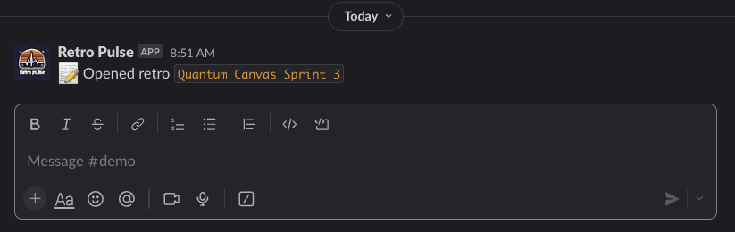

This is the first of a multi-part series on building a Slack application with Rails. In this first post, we'll get a new Rails app up and running, and get OAuth working so we can authenticate our Rails app to Slack. There's a few moving parts to get set up and configured before we can have a working application.

## Introducing Retro Pulse

Before getting into the technical details, let's take a look at the app we'll be building: Retro Pulse. The idea is to improve the agile retrospective process. Normally a retrospective meeting is booked at the end of a sprint and everyone who contributed to the project is asked to provide their feedback such as what the team should keep on doing, what they should stop doing, and something new to try for the next sprint. But sometimes the sprints can get so hectic, its hard to remember at the end everything that happened, and so, valuable feedback can be lost.

Wouldn't it be nice if a retrospective board could be opened at the beginning of a sprint like this:


Suppose our project name is "Quantum Canvas" and we're just starting on Sprint 3:


The app responds with a confirmation that the retrospective has been opened with a link to the board (a view hosted on the Rails app):



Then whenever a thought occurs to anyone on the team during the sprint about how things are going, they can request to submit their feedback quickly via Slack:


The app responds with a form where the team member can select what kind of feedback this is (keep, stop, or try):


The team member can fill in their feedback:


After submitting the form, the app responds with a DM to the user confirming their feedback has been received
Then when its time to have the retrospective meeting, a lot of feedback has already been captured:


TODO: Later, when it's time to start the retrospective meeting /retro-discuss...

## Create Rails App

Ok, now let's build it! Start by generating a new Rails project. I'm using TailwindCSS although you can leave that out if you prefer to use SASS or vanilla CSS. I'm also using PostgreSQL but you can stick with the default SQLite if you prefer:

```bash
rails new retro-pulse --css tailwind --database=postgresql
```

In order to make the Slack integration as easy as possible, we'll be working with the [slack-ruby-bot-server-events](https://github.com/slack-ruby/slack-ruby-bot-server-events) gem. This is actually an extension to the [slack-ruby-bot-server](https://github.com/slack-ruby/slack-ruby-bot-server) gem, which exposes RESTful routes for Slack team handling (although for this simple app, we won't be enabling public distribution so it will be for your team only). The slack-ruby-bot-server-events gem adds some niceties for handling Slack slash commands, actions, and events. It also expects otr-activerecord and pagy_cursor dependencies to be installed so we'll add those as well.

In the main section of the project `Gemfile`, add:

```ruby
# Slack Integration
gem "slack-ruby-bot-server-events"
gem "otr-activerecord"
gem "pagy_cursor"
```

Since integrating with Slack requires managing Slack-specific secrets, also add the [dotenv-rails](https://github.com/bkeepers/dotenv) gem to the development and test groups. This will allow us to manage secrets with environment variables rather than hard-coding them into the application.

```ruby
group :development, :test do
  gem 'dotenv-rails'
end
```

Then run `bundle install`.

## Configure Rails for Slack

This next section explains the configuration changes needed to the Rails app to support Slack integration with the slack gems.

Add a `.env` file to the root of the project with `touch .env`, we'll be filling in the values shortly:

```
SLACK_CLIENT_ID=TBD
SLACK_CLIENT_SECRET=TBD
SLACK_SIGNING_SECRET=TBD
SLACK_VERIFICATION_TOKEN=TBD
```

Update the `.gitignore` file in the project root to ignore `.env`.

Update the `config.ru` file in the project root to also start the Slack server. This will expose RESTful endpoints to handle Slack teams. The `config.ru` file got generated earlier when you ran `rails new...`. Here is the original version:

```ruby
# This file is used by Rack-based servers to start the application.
require_relative "config/environment"

run Rails.application
Rails.application.load_server
```

Add the new line shown below. This will cause the slack-ruby-bot-server to check for a working database connection and perform a migration to generate the `teams` table (will be used to persist the OAuth token). You didn't have to write this migration, it's part of the slack-ruby-bot-server gem:

```ruby
# This file is used by Rack-based servers to start the application.
require_relative "config/environment"

# === ADD THIS LINE HERE ===
SlackRubyBotServer::App.instance.prepare!

run Rails.application
Rails.application.load_server
```

Configure the slack-ruby-bot-server by defining the OAuth [scopes](https://api.slack.com/scopes) the Slack app will require. Scopes give your app permission to perform actions, such as posting messages in your workspace. Here are the specific scopes the Retro Pulse app requires:

```ruby
# config/initializers/slack_ruby_bot_server.rb
SlackRubyBotServer.configure do |config|
  config.oauth_version = :v2
  config.oauth_scope = ["commands", "chat:write", "users:read", "chat:write.public"]
end
```

Configure the slack-ruby-bot-server-events gem with the Slack signing secret (we still have `TBD` for that in `.env`, but will be populating it shortly):

```ruby
# config/initializers/slack_ruby_bot_server_events.rb
SlackRubyBotServer::Events.configure do |config|
  config.signing_secret ||= ENV.fetch("SLACK_SIGNING_SECRET")
  config.signature_expires_in ||= 300
end
```

Add the Api endpoints provided by the `slack-ruby-bot-server` gem at `/` in `config/routes.rb`:

```ruby
Rails.application.routes.draw do
  mount Api => "/"
end
```

The `slack-ruby-bot-server` gem exposes routes using [Grape](https://github.com/ruby-grape/grape). Since the details are not specified in `config/routes.rb`, if you run `bin/rails routes` in a terminal right now, you'll only see:

```
Prefix Verb   URI Pattern   Controller#Action
api           /             Api
```

However, you can run a Rails console `bin/rails c`, and run the code below to list the API routes provided by the slack-ruby-bot-server gem:

```ruby
Api.routes.each do |route|
  method = route.request_method.ljust(10)
  path = route.path
  puts "#{method} #{path} #{controller}"
  nil
end
nil

# GET        /api(.:format)
# GET        /api/status(.:format)
# GET        /api/teams/:id(.:format)
# GET        /api/teams(.:format)
# POST       /api/teams(.:format)
# GET        /api/swagger_doc(.:format)
# GET        /api/swagger_doc/:name(.:format)
# POST       /api/slack/command(.:format)
# POST       /api/slack/action(.:format)
# POST       /api/slack/event(.:format)
```

The particular one we're interested in is `POST /api/teams`, this will be a critical part of the OAuth flow explained later in this post.

At this point, you should be able to start a Rails server with `bin/dev`. Also if you launch a Rails console with `bin/rails c`, you should be able to see the `Team` model, which is defined in the `slack-ruby-bot-server` gem. There are no teams populated at the moment, because we haven't yet written the code to add this app to a Slack workspace:

```ruby
Team.all
# empty collection
```

You can also view the `teams` table schema by connecting directly to a database console with `bin/rails db`, and then:

```sql
-- This is for Postgres
\d teams
--                                                   Table "public.teams"
--            Column            |              Type              | Nullable |              Default
-- -----------------------------+--------------------------------+----------+-----------------------------------
--  id                          | bigint                         | not null | nextval('teams_id_seq'::regclass)
--  team_id                     | character varying              |          |
--  name                        | character varying              |          |
--  domain                      | character varying              |          |
--  token                       | character varying              |          |
--  oauth_scope                 | character varying              |          |
--  oauth_version               | character varying              | not null | 'v1'::character varying
--  bot_user_id                 | character varying              |          |
--  activated_user_id           | character varying              |          |
--  activated_user_access_token | character varying              |          |
--  active                      | boolean                        |          | true
--  created_at                  | timestamp(6) without time zone | not null |
--  updated_at                  | timestamp(6) without time zone | not null |
-- Indexes:
--     "teams_pkey" PRIMARY KEY, btree (id)
```

The `teams` table got generated by the slack-ruby-bot-server gem when we added `SlackRubyBotServer::App.instance.prepare!` to `config.ru` and started the Rails server for the first time. Once we have OAuth working to add this app to a Slack workspace, you'll see how this table gets populated.

## Ngrok

Our Rails application is running on http://localhost:3000. However, Slack needs a publicly accessible URL to send requests to when events like OAuth redirects or slash commands are triggered. When you configure a callback URL or specify an endpoint for Slack to communicate with, it needs to be an address that Slack's servers can reach over the internet. Since localhost is specific to each user's local machine and not accessible externally, Slack wouldn't be able to send requests to your local development server.

This is where [ngrok](https://ngrok.com/) comes in. Ngrok creates a secure tunnel to your local development environment and provides a public URL that forwards requests to your localhost. It acts as an intermediary, allowing external services like Slack to communicate with your local development server. By using ngrok, you can expose your local server to the internet and provide a public URL that can be used as a callback or endpoint for Slack to send requests to during development.

Sign up for a [free account](https://dashboard.ngrok.com/signup). Then in a terminal, start ngrok forwarding to port 3000 (which is where the Rails server is running):

```bash
ngrok http 3000

# Output will look something like this, your details will vary:
# Region                        United States (us)
# Latency                       35ms
# Web Interface                 http://127.0.0.1:4040
# Forwarding                    https://12e4-203-0-113-42.ngrok-free.app -> http://localhost:3000
```

Make a note of the forwarding address that ngrok generated, for example: `https://12e4-203-0-113-42.ngrok-free.app`. This is the address we'll be providing to Slack in the next section to tell it where to send OAuth codes to.

## Create Slack App

The next part is to create a new Slack application. Open [https://api.slack.com/apps](https://api.slack.com/apps) (sign in to your Slack account if prompted), and click on "Create New App". At the time of this writing, this is a green button at the top right of the "Your Apps" page like this:


Choose "From scratch" (later we'll use an app manifest to make updating it easier):


For the App Name, enter "Retro Pulse" (or whatever you'd like if you want to name it something else). Then select a workspace. If you're logged in to your employer's workspace that will show up in the list, but you can also [create your own workspace](https://slack.com/help/articles/206845317-Create-a-Slack-workspace) for app development, then select it from the list:


After clicking "Create App", you'll be navigated to the "Basic Information" settings of your newly created app. Copy the values Client ID, Client Secret, Signing Secret, and Verification Token from the App Credentials section, to the corresponding entries in the `.env` file you created earlier in the Rails app project root:


Still in the Basic Information section, scroll down to the section titled "Display Information", it will look something like this:

.

Fill in the details with something descriptive, here's what I used:

* App name: Retro Pulse
* Short description: Collect ongoing feedback for your team's retrospective meeting
* Long description: This is a simple app to collect ongoing feedback via Slack for team retrospectives. While the retro meeting is typically held at the end of a sprint, shape up cycle, or project, it's useful for team members to be able to quickly submit feedback whenever it occurs during project development, otherwise good ideas or feedback can be forgotten about by the time the retro meeting is booked.

Optionally, you can upload a logo and adjust the background color for how the app will appear in Slack. As I'm not a designer, I asked Bing Chat to draw a logo for me. Putting this all together, here's what my Display Information looks like:


Next, click on the OAuth & Permissions section from the left hand section under Features:


Enter the following Redirect URL. The host name should be the forwarding address you saw when starting ngrok in the previous step. Your Client ID is from the Basic Information section.

```
https://12e4-203-0-113-42.ngrok-free.app?scope=incoming-webhook&client_id=your_client_id
```

Recall that ngrok is forwarding to `http://localhost:3000`, so the above url will land on the root route of the Rails app. Let's make sure that gets handled in the next step.

## Rails Send OAuth Request

We need to create an "Add to Slack" link that will be displayed on the home page of the Rails app. When the user clicks on it, they will be taken to Slack where they will be asked if they agree to authenticate Retro Pulse (which will add the app to their chosen Slack Workspace).

Add a WelcomeController with only an index method. The method is empty as we'll just be using conventions to display the associated welcome index view:

```ruby
# app/controllers/welcome_controller.rb
class WelcomeController < ApplicationController
  def index; end
end
```

Now add the associated welcome index view. This view generates a link to the Slack OAuth authorization url, with the scopes and client ID we configured earlier. We're using `SlackRubyBotServer` to do this. The image source is from `platform.slack-edge.com`.

```erb
<%# app/views/welcome/index.html.erb %>
<div>
  <a href="<%= SlackRubyBotServer::Config.oauth_authorize_url %>?scope=<%= SlackRubyBotServer::Config.oauth_scope_s %>&client_id=<%= ENV['SLACK_CLIENT_ID'] %>">
    
  </a>
</div>
```

Configure the Welcome index view as the default route:

```ruby
# config/routes.rb
Rails.application.routes.draw do
  mount Api => "/"
  root "welcome#index"
end
```

To confirm the routes available in our app currently, run `bin/rails routes` in a terminal, you should get:

```
Prefix Verb   URI Pattern   Controller#Action
api           /             Api
root   GET    /             welcome#index
```

Run the Rails server with `bin/dev` and navigate to [http://localhost:3000](http://localhost:3000). You should see a clickable "Add to Slack" button like this:


Open developer tools and inspect the generated url for the Slack button. It will include the OAuth scopes and Client ID you configured earlier:

Generated url:

```
https://slack.com/oauth/v2/authorize?
  scope=commands,chat:write,users:read,chat:write.public
  &client_id=your_client_id
```

If you click the "Add to Slack" button, you'll be taken to a Slack page showing that the app is requesting permission to access your Slack workspace. My workspace for development is named "TestBotDev":


It shows all the OAuth permissions the Retro Pulse app is requesting. But don't click the "Allow" button yet. We still have some work to do on the Rails side to handle this.

## Rails Receive OAuth Response

When the user clicks the "Allow" button from the Slack OAuth permission page, Slack will send a request to the Redirect URL you defined in the previous section. Recall we defined the Redirect URL to be the homepage served at the root of the Rails application `/`, which is handled by the WelcomeController and view.

The Redirect URL will contain the OAuth `code`. This needs to be exchanged for a token, to do this, we'll write a small amount of JavaScript with a [StimulusJS](https://stimulus.hotwired.dev/handbook/origin) controller that takes the code, and submits a POST to the `/api/teams` endpoint provided by the slack-ruby-bot-server gem. That endpoint will do the work of exchanging the code provided in the redirect url by Slack, for a token, which will be persisted in the `teams` table. The gem will do most of the work, but as it only provides a POST endpoint, and Slack is sending us a GET, we need a small amount of JavaScript to glue this together.

Start by generating the Stimulus controller:

```bash
bin/rails generate stimulus SlackTeamRegistration
```

This generates:

```javascript
// app/javascript/controllers/slack_team_registration_controller.js
import { Controller } from "@hotwired/stimulus"

// Connects to data-controller="slack-team-registration"
export default class extends Controller {
  connect() {
  }
}
```

Update the Welcome index view to add an HTML element (we'll just use a div) with its `data-controller` attribute set to `slack-team-registration`. By naming convention, anytime an element with this attribute appears in the DOM, the `connect()` function of the `SlackTeamRegistration` Stimulus controller will run.

```erb
<%# app/views/welcome/index.html.erb %>
<div>
  <a href="<%= SlackRubyBotServer::Config.oauth_authorize_url %>?scope=<%= SlackRubyBotServer::Config.oauth_scope_s %>&client_id=<%= ENV['SLACK_CLIENT_ID'] %>">
    
  </a>

  <%# === Add a div here to connect to the StimulusJS controller === %>
  <div data-controller="slack-team-registration">
  </div>
</div>
```

Now let's implement the `connect()` function in JavaScript. When Slack sends a GET to our Rails app, it will include a `code` parameter in the URL. We can extract this from the url using [URLSearchParams](https://developer.mozilla.org/en-US/docs/Web/API/URLSearchParams), then use [fetch](https://developer.mozilla.org/en-US/docs/Web/API/Fetch_API) to send an HTTP POST to `/api/teams`:

```javascript
import { Controller } from "@hotwired/stimulus"

// Connects to data-controller="slack-team-registration"
export default class extends Controller {
  connect() {
    const code = new URLSearchParams(window.location.search).get("code")

    if (code) {
      fetch("/api/teams", {
        method: "POST",
        headers: { "Content-Type": "application/json" },
        body: JSON.stringify({ code })
      })
      .then(response => response.json())
      .then(data => {
        console.log("Successfully registered new team!")
      })
      .catch(error => {
        console.log("An error occurred while registering the team.")
      });
    }
  }
}
```

It would be nice to show the user a message while the POST to `/api/teams` is in progress, and whether it succeeded or not. Let's add a `<span>` element to the welcome index view with a target of `message`, which will make it available to the Stimulus controller as `this.messageTarget`:

```erb
<%# app/views/welcome/index.html.erb %>
<div>
  <a href="<%= SlackRubyBotServer::Config.oauth_authorize_url %>?scope=<%= SlackRubyBotServer::Config.oauth_scope_s %>&client_id=<%= ENV['SLACK_CLIENT_ID'] %>">
    
  </a>

  <div data-controller="slack-team-registration">
    <%# === Add a target for the StimulusJS controller === %>
    <span data-slack-team-registration-target="message"></span>
  </div>
</div>
```

Now we can update the Stimulus controller to access this DOM element with `static targets`, then populate it using `this.messageTarget.innerHTML`:

```javascript
import { Controller } from "@hotwired/stimulus"

// Connects to data-controller="slack-team-registration"
export default class extends Controller {
  // Connects to any DOM node, with target: message,
  // eg: <element data-slack-team-registration-target="message"></element>
  static targets = [ "message" ]

  connect() {
    const code = new URLSearchParams(window.location.search).get("code")

    if (code) {
      this.messageTarget.innerHTML = "Working, please wait ...";

      fetch("/api/teams", {
        method: "POST",
        headers: { "Content-Type": "application/json" },
        body: JSON.stringify({ code, state })
      })
      .then(response => response.json())
      .then(data => {
        this.messageTarget.innerHTML = `Team successfully registered!`;
        this.messageTarget.style.display = "block";
      })
      .catch(error => {
        this.messageTarget.innerHTML = "An error occurred while registering the team.";
        this.messageTarget.style.display = "block";
      });
    }
  }
}
```

## Rails Blocked Host

The OAuth flow isn't going to work quite yet, there's one more thing we need to do on the Rails side to allow incoming requests that aren't `localhost`. Recall we have ngrok running at something like `https://12e4-203-0-113-42.ngrok-free.app`, which will forward requests to the Rails app running at `http://localhost:3000`. However as of Rails 6, the `ActionDispatch::HostAuthorization` middleware will [block any requests that aren't localhost](../rails-blocked-host-docker-fix). This means when Slack sends us the Redirect URL containing the OAuth code, it will never hit our Welcome controller because the middleware will reject it.

To resolve this, we need to specify the ngrok forwarding address in `config/environments/development.rb` so that it will be allowed:

```ruby
# config/environments/development.rb
Rails.application.configure do
  config.hosts = [
    IPAddr.new("0.0.0.0/0"),            # All IPv4 addresses.
    IPAddr.new("::/0"),                 # All IPv6 addresses.
    "localhost",                        # The localhost reserved domain.
    "12e4-203-0-113-42.ngrok-free.app"  # Allow incoming requests from Slack via ngrok.
  ]

  # other config...
end
```

One thing to be aware of: Every time you restart ngrok, it will assign a different forwarding address (on the free plan). Also, if this project is going to be worked on by a team of developers, every developer running ngrok on their laptop will have a different forwarding address. So hard-coding a specific ngrok address in the config file as shown above will be awkward because it will require everyone to edit it and result in merge conflicts in version control.

This can be resolved by introducing an environment variable: `SERVER_HOST_NAME`. Add it to the `.env` file in the project root (recall this file is gitignored), for example:

```bash
SLACK_CLIENT_ID=your-app-client-id
SLACK_CLIENT_SECRET=your-app-client-secret
SLACK_SIGNING_SECRET=your-app-signing-secret
SLACK_VERIFICATION_TOKEN=your-app-verification-token

# Replace the value with your ngrok forwarding address:
SERVER_HOST_NAME=12e4-203-0-113-42.ngrok-free.app
```

Then update the dev config file in the Rails project to use the `SERVER_HOST_NAME` environment variable:

```ruby
# config/environments/development.rb
Rails.application.configure do
  config.hosts = [
    IPAddr.new("0.0.0.0/0"),    # All IPv4 addresses.
    IPAddr.new("::/0"),         # All IPv6 addresses.
    "localhost",                # The localhost reserved domain.
    ENV["SERVER_HOST_NAME"]     # Allow incoming requests from Slack via ngrok.
  ]

  # other config...
end
```

Remember to restart the Rails server after making changes to `config/environments/development.rb` and `.env` files.

## Run the OAuth Flow

Now, we're ready to put together all these parts and try out the OAuth flow. Restart your Rails server at `bin/dev`, navigate to [http://localhost:3000]([http://localhost:3000]), then click on the "Add to Slack" button:


You should be redirected to a url at Slack that contains your Client ID and the OAuth scopes that this app requires (which we configured earlier with `SlackRubyBotServer`). It looks something like this:

```
https://your-workspace.slack.com/oauth
  ?client_id=your-client-id
  &scope=commands,chat:write,users:read,chat:write.public
  &user_scope=
  &redirect_uri=
  &state=
  &granular_bot_scope=1
  &single_channel=0
  &install_redirect=
  &tracked=1
  &team=1
```

This time click the "Allow" button:


Clicking the "Allow" button will make Slack redirect back to the Rails app, at the ngrok forwarding address we setup in the Slack UI earlier when defining our app. The URL will look as shown below. The important piece of information here is the `code` parameter, which we will need to exchange for an OAuth token shortly:

```
https://your-ngrok-address.ngrok-free.app/
  ?scope=incoming-webhook
  &client_id=your-client-id
  &code=temp-oauth-code
  &state=
```

The very first time you're using the ngrok address, ngrok will display an intermediary page. Your values will be different but it looks something like this:


Go ahead and click the "Visit Site" button, then this request will hit the root of our Rails app running at `http://localhost:3000` (because ngrok is forwarding traffic there).

This will render the Rails app homepage which is handled by the `WelcomeController`. Recall we added a StimulusJS controller to detect if a `code` parameter is in the URL, which it is right now, so the Stimulus controller will submit a POST to the `/api/teams` endpoint. At this point you should see a "Working" message, this is the StimulusJS controller waiting for a result from the `POST /api/teams` endpoint:


The Rails server will show that it's processing the `POST /api/teams` request. Unfortunately it does not show the activity where it exchanges the `code` for a `token` with Slack, but this is what the [teams endpoint](https://github.com/slack-ruby/slack-ruby-bot-server/blob/master/lib/slack-ruby-bot-server/api/endpoints/teams_endpoint.rb#L33-L115) is doing behind the scenes. When it receives the token from Slack, it receives additional information including your Slack team name, workspace name, and the user id that activated the Slack App.

The teams endpoint then checks if a team with the given token or Slack team_id already exists, and if not, will create one in the database. This activity can be seen in the Rails server output. Here is a simplified view:

```
Started POST "/api/teams"
  Team Load (2.2ms)  SELECT "teams".* FROM "teams" WHERE "teams"."token" = $1 LIMIT $2
    [["token", "the-token-returned-by-slack"], ["LIMIT", 1]]
  Team Load (1.5ms)  SELECT "teams".* FROM "teams" WHERE "teams"."team_id" = $1 LIMIT $2
    [["team_id", "your-slack-team-id"], ["LIMIT", 1]]
  TRANSACTION (3.0ms)  BEGIN
  Team Create (4.3ms)  INSERT INTO "teams"
    ("team_id", "name", "domain", "token", "oauth_scope", "oauth_version", "bot_user_id", "activated_user_id", "activated_user_access_token", "active", "created_at", "updated_at")
    VALUES ($1, $2, $3, $4, $5, $6, $7, $8, $9, $10, $11, $12)
    RETURNING "id"
    [
      ["team_id", "your-slack-team-id"],
      ["name", "TestBotDev"],
      ["domain", nil],
      ["token", "the-token-returned-by-slack"],
      ["oauth_scope", "commands,chat:write,users:read,chat:write.public"],
      ["oauth_version", "v2"],
      ["bot_user_id", "your-slack-bot-user-id"],
      ["activated_user_id", "slack-user-that-allowed-this-app"],
      ["activated_user_access_token", "the-token-returned-by-slack"],
      ["active", true],
      ["created_at", "2023-12-15 13:02:52.784031"],
      ["updated_at", "2023-12-15 13:02:52.784031"]
    ]
  TRANSACTION (2.3ms)  COMMIT
```

When the `POST /api/teams` endpoint completes, it returns a response to the StimulusJS controller that called it. The success response will be `201 Created` with response body containing the `teams` record that was just created:

```json
{
  "id": 4,
  "team_id": "your-slack-team-id",
  "name": "your-slack-workspace",
  "active": true,
  "created_at": "2023-12-15T13:02:52.784Z",
  "updated_at": "2023-12-15T13:02:52.784Z"
}
```

Finally, when the StimulusJS controller receives a success response, it updates the display to a success message:


You can also confirm the team was created in a Rails console `bin/rails c`:

```ruby
team = Team.first
# Team Load (1.1ms)  SELECT "teams".* FROM "teams" ORDER BY "teams"."id" ASC LIMIT $1  [["LIMIT", 1]]
#<Team:0x000000010aad10a0
#  id: 4,
#  team_id: "your-slack-team-id",
#  name: "your-slack-workspace",
#  domain: nil,
#  token: "the-oauth-token-returned-by-slack",
#  oauth_scope: "commands,chat:write,users:read,chat:write.public",
#  oauth_version: "v2",
#  bot_user_id: "your-slack-bot-user-id",
#  activated_user_id: "slack-user-that-allowed-this-app",
#  activated_user_access_token: "the-oauth-token-returned-by-slack",
#  active: true,
#  created_at: Fri, 15 Dec 2023 13:02:52.784031000 UTC +00:00,
#  updated_at: Fri, 15 Dec 2023 13:02:52.784031000 UTC +00:00>
```

At this point, if you open your Slack desktop app, it should show that the Retro Pulse app has been added in the Apps section:


If you click on it and then select the "About" tab, Slack will display the information we entered earlier:


## Next Steps

We now have an authenticated Slack app added to our workspace, backed by a Rails application. The next step will be to make it do something useful. Specifically, we'd like to add some slash commands so that a new retrospective can be opened from any Slack channel in the workspace. For example, suppose we're working on a project named "Quantum Canvas", and Sprint 3 has just started. We'd like to enter a message in a channel to tell the Retro Pulse app to open a retrospective named "Quantum Canvas Sprint 3":


This is called a slash command. See part 2 of this series to learn how to configure this in the Slack and Rails apps.

## TODO
* conclusion para (or next steps since its a series)
* edit
* connecting multi-part series, include a "you are here"
* list my Ruby, Rails versions
* Possibly [diagram](https://excalidraw.com/) of Slack Oauth2 flow with Rails app and ngrok
* Somewhere: tradeoff between using a gem that does a lot of the heavy lifting, but introduces seeming "magic" vs writing it all yourself via first principles (use Slack http api directly with a gem like Faraday or http party)
* Aside: for extra security, use [token rotation](https://api.slack.com/authentication/rotation), but I couldn't find that this is implemented in slack-ruby-bot-server-events gem
* ref Slack OAuth: https://api.slack.com/authentication/oauth-v2
* Assumptions: Reader has beginner to intermediate familiarity with Rails and is also familiar with Slack (as an end user, not developer).
* List tree/nested deps of Slack gems so its clear what we all have access to (see `docs/gems_for_slack.md` in retro-pulse project) for explanation. Need to understand slack-ruby-client how to call it, so that when reading Slack api docs, you can use it to access any api method.
* explain why retro-pulse needs each of the oauth_scopes
* explain what the app does and show some screenshots
* Aside: Full explanation of OAuth is outside the scope of this post, see this Slack article: https://api.slack.com/authentication/oauth-v2
