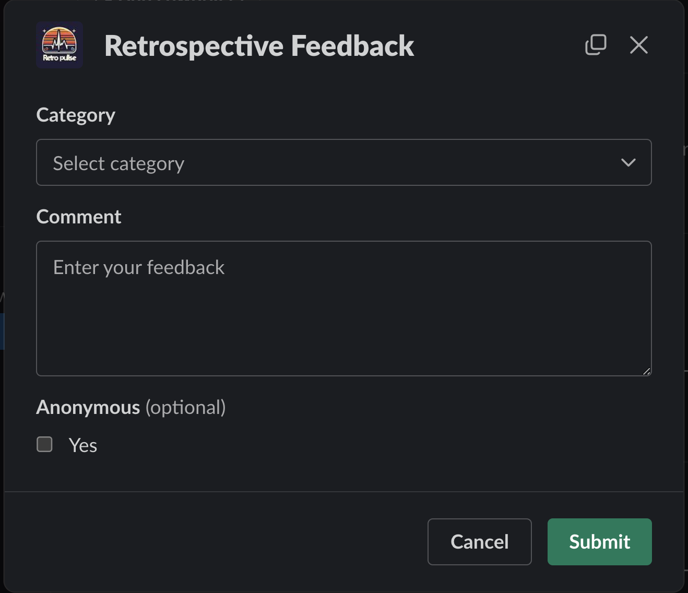

Welcome to the second installment of this multi-part series on building a Slack application with Rails. This series will guide you through the process of creating a Slack application with Rails and is structured as follows:

* [Part 1: Rails new, Slack, and OAuth](../rails-slack-app-part1-oauth)
* Part 2: Slack Slash Command with Text Response === YOU ARE HERE ===
* [Part 3: Slack Slash Command with Modal Response](../rails-slack-app-part3-slash-command-with-modal-response)
* [Part 4: Slack Action Modal Submission](../rails-slack-app-part4-action-modal-submission)
* [Part 5: Slack Slash Command with Block Kit Response](../rails-slack-app-part5-slash-block-kit-response)

Feel free to jump to a specific part of interest using the links above or follow along sequentially. You can also checkout the [source code on Github](https://github.com/danielabar/retro-pulse) for the application we'll be building.

This post assumes the reader has at least a beginner level familiarity with Ruby on Rails. It's also assumed the reader has used [Slack](https://slack.com/) as an end user with basic interactions such as joining channels, sending messages, and participating in conversations.

Part 1 of this series introduced [Retro Pulse](../rails-slack-app-part1-oauth#introducing-retro-pulse), a Slack app built with Rails for agile teams to manage their retrospectives with Slack. Part 2 (this post) will explain how to implement the Slack slash command to open a retrospective and return a markdown text response to the same Slack channel that initiated the request, confirming the retrospective has been opened.

The interaction proceeds as follows:

In a Slack workspace with the Retro Pulse app installed ([installation was covered in Part 1](../rails-slack-app-part1-oauth#run-the-oauth-flow)), a user can enter a slash command `/retro-open`, followed by a project name:


After hitting <kbd class="markdown-kbd">Enter</kbd>, the app responds with a confirmation that the retrospective has been opened:


In the Rails console `bin/rails c` of the Rails application backing the Slack app, the Retrospective has been created:

```ruby
Retrospective.last
# Retrospective Load (1.1ms)  SELECT "retrospectives".* FROM "retrospectives" ORDER BY "retrospectives"."id" DESC LIMIT $1  [["LIMIT", 1]]
# <Retrospective:
#   id: 31,
#   title: "Quantum Canvas Sprint 3",
#   created_at: ...,
#   updated_at: ...,
#   status: "open">
```

## Create Slash Command in Slack

The first step in implementing this is to navigate to [Your Apps](https://api.slack.com/apps) on Slack, select the "Retro Pulse" app you created in [Part 1 of this series](../rails-slack-app-part1-oauth#create-slack-app), and then select "Slash Commands" from the Features section:


Then click on the "Create New Command" button, and fill in the form as follows:

**Command:** `/retro-open`. This is what the user will type into a Slack message to initiate an interaction with the Retro Pulse Rails app.

**Request URL:** For example: `https://12e4-203-0-113-42.ngrok-free.app/api/slack/command`. This is where Slack will send an HTTP POST request when the user submits this slash command from Slack. The hostname is your ngrok forwarding address that you got from starting [ngrok in part 1 of this series](../rails-slack-app-part1-oauth#ngrok). The route `/api/slack/command` is defined in the `slack-ruby-bot-server` gem that we included as part of our [Rails app in part 1 of this series](../rails-slack-app-part1-oauth#create-rails-app).

**Short Description:** `Open a new retrospective for comments`. This will be displayed as the user types in the slash command.

**Usage Hint:** `title`. Since this particular slash command requires a parameter, which will be used to create the retrospective, the usage hint is also shown to the user as they type in the slash command.

**Escape Channels:** Leave this unchecked. Turning this on will modify the parameters sent with a command by a user such as wrapping URLs in angle brackets and translating channel or user mentions into their correlated IDs. It's not necessary for this app. See the Slack [documentation](https://api.slack.com/interactivity/slash-commands) if your app needs this option.

The filled out form will look something like this:


Click the "Save" button, which at the time of this writing, appears all the way at the bottom right-hand corner of the screen.

## Receive Slash Command in Rails

The next step is to update the Rails app to handle the HTTP POST to `/api/slack/command` that Slack will send whenever a user submits the `/retro-pulse something` Slash command. Recall that we're using the [slack-ruby-bot-server-events](https://github.com/slack-ruby/slack-ruby-bot-server-events) gem, which takes care of a lot of the boilerplate including providing a controller to parse the body, and logic to verify the `X-Slack-Signature` HTTP header.

Start by creating a `bot` directory in the root of the Rails project as shown below. The `bot` directory is a sibling to the Rails `app` directory:

```bash
# from root of Rails project
mkdir bot
touch bot/slash_commands.rb
mkdir bot/slash_commands
touch bot/slash_commands/retro_open.rb
```

You should have the following structure:

```
.
├── app
└── bot
    ├── slash_commands
    │   └── retro_open.rb
    └── slash_commands.rb
```

Add the following in `bot/slash_commands.rb` to load all the slash commands, there's only one for now:

```ruby
# bot/slash_commands.rb
require_relative "slash_commands/retro_open"
```

Fill in the implementation for the retro open command handler. For now, it will only log out the text it received, as well as the team name and Slack channel ID the command was called from. The team will be fetched by the `team_id` that is available from the `command` object exposed by the `slack-ruby-bot-server-events` gem. The `channel_id` and `text` are also available from the `command` object. The Team model got populated in Part 1 of this series when we ran the [OAuth flow to add this app to a Slack workspace](../rails-slack-app-part1-oauth#run-the-oauth-flow).

```ruby
# bot/slash_commands/retro_open.rb
SlackRubyBotServer::Events.configure do |config|

  # Essentially this is saying to the SlackRubyBotServer,
  # If a "/retro-open" slash command is received from Slack,
  # then execute this block.
  config.on :command, "/retro-open" do |command|
    team = Team.find_by(team_id: command[:team_id])
    channel_id = command[:channel_id]

    # If user entered /retro-open foo
    # in Slack, then command_text will be: foo
    command_text = command[:text]
    command.logger.info "=== COMMAND: retro-open, Team: #{team.name}, Channel: #{channel_id}, Title: #{command_text}"

    # Return `nil`, otherwise the slack-ruby-bot-server-events gem
    # replies to the channel with a message "true"
    nil
  end
end
```

Then update `config.ru` file in the root of the Rails app to load the command handlers in the `bot` directory. This will ensure the the Slack bot code is loaded when Rails starts:

```ruby
# This file is used by Rack-based servers to start the application.
require_relative "config/environment"

# === ADD THIS LINE TO LOAD THE SLASH COMMAND HANDLERS ===
require_relative "bot/slash_commands"

# We added this line previously in Part 1 of this series:
SlackRubyBotServer::App.instance.prepare!

run Rails.application
Rails.application.load_server
```

Now we're ready to see this in action. Start the Rails server with `bin/dev`. Then go to your Slack app, and enter the following in any channel:

```
# Enter whatever title text you want after the slash command
/retro-open My Project Sprint 1
```

After hitting <kbd class="markdown-kbd">Enter</kbd> in Slack to submit the slash command, the Rails server output will show that the HTTP POST to `/api/slack/command` has been received and processed. Notice it runs a SQL SELECT to find the team, this is as a result of `Team.find_by(team_id: command[:team_id])` in the command handler:

```
Started POST "/api/slack/command"
  Team Load (2.1ms)  SELECT "teams".* FROM "teams"
    WHERE "teams"."team_id" = $1 LIMIT $2
    [["team_id", "the-team-id-from-slack"], ["LIMIT", 1]]
I, INFO -- : === COMMAND: retro-open,
  Team: YourTeamName,
  Channel: the-channel-from-slack,
  Title: My Project Sprint 1
```

The `Title` displayed in the logger INFO should match whatever you typed in as the text following `/retro-open` in Slack.

You may be wondering how it is that the code we wrote in `bot/slash_commands/retro_open.rb` is being executed when the HTTP POST is received. This is where the combined functionality of the [slack-ruby-bot-server](https://github.com/slack-ruby/slack-ruby-bot-server) and [slack-ruby-bot-server-events](https://github.com/slack-ruby/slack-ruby-bot-server-events) gems comes into play.

When we specified `config.on` in the `SlackRubyBotServer::Events.configure` block, this added the handler as a [callback](https://github.com/slack-ruby/slack-ruby-bot-server-events?tab=readme-ov-file#implement-callbacks). Then, the endpoint provided by the `slack-ruby-bot-server` gem, which handles the HTTP POST for `/api/slack/command`, parses out the specific command name and executes all callbacks that are registered for that command. This integration between the two gems allows for the automatic execution of the appropriate code when Slack sends a request to our Rails application's endpoint.

## Inspect Request

One thing that can seem a little "magical" at this point, is that we didn't write a Rails controller to handle the `/api/slack/command` HTTP Request. This is being handled by the `slack-ruby-bot-server-events` gem. Unlike Rails controllers that we write, it doesn't log out the parameters it was called with. However, we can still view the entire HTTP POST request and body using [ngrok](../rails-slack-app-part1-oauth#ngrok).

In the terminal tab where ngrok is running, it includes an address for the Web Interface:

```bash
ngrok http 3000

# Output will look something like this, your details will vary:
# Region                        United States (us)
# Latency                       35ms
# Web Interface                 http://127.0.0.1:4040
# Forwarding                    https://12e4-203-0-113-42.ngrok-free.app -> http://localhost:3000
```

Enter `http://127.0.0.1:4040` in a browser. This will allow you to inspect all HTTP requests that were received by ngrok and the corresponding HTTP responses that were sent by the Rails app. At this point, you should have one request for `POST /api/slack/command`. It will look something like this. Your specific Slack details will vary:


This shows all the form parameters that Slack sent in the HTTP `POST /api/slack/command`. Notice these include `team_id` and `channel_id`. These get parsed out by the `slack-ruby-bot-server-events` gem and are available on the `command` object in the block of the slash command handler.

You can also view the HTTP headers. These include the `X-Slack-Request-Timestamp` and `X-Slack-Signature` headers that are verified by the `slack-ruby-bot-server-events` gem. If you weren't using a gem for this, you'd have to write this verification code yourself:


## Implement Slash Command

Now that we can see the communication between Slack and Rails working, the `/retro-open` slash command handler can be enhanced to do the real work of opening a new retrospective, with the title populated from the slash command text.

In order to create a Retrospective, we need to first define a database table to persist `retrospectives` with migrations, and a `Retrospective` model. A retrospective must have a unique title (eg: "Some Project Sprint 3"), a status (either `open` or `closed`), and there should only be one open retrospective at a time.

Here is the migration to create a `retrospectives` table with a required and unique `title`:

```ruby
class CreateRetrospectives < ActiveRecord::Migration[7.0]
  def change
    create_table :retrospectives do |t|
      t.string :title, null: false

      t.timestamps
    end
    add_index :retrospectives, :title, unique: true
  end
end
```

Here is the migration to add a `status` column to the `retrospectives` table, implemented as a PostgreSQL [enum type](../rails-enum-mysql-postgres) to restrict it to only values `open` and `closed`:

```ruby
class AddStatusToRetrospectives < ActiveRecord::Migration[7.0]
  def up
    execute <<-SQL.squish
      CREATE TYPE retrospective_status AS ENUM ('open', 'closed');
    SQL
    add_column :retrospectives, :status, :retrospective_status, default: "open", null: false
  end

  def down
    remove_column :retrospectives, :status
    execute <<-SQL.squish
      DROP TYPE retrospective_status;
    SQL
  end
end
```

Here is the `Retrospective` model with [schema annotations](https://github.com/ctran/annotate_models) and validations:

```ruby
# == Schema Information
#
# Table name: retrospectives
#
#  id         :bigint           not null, primary key
#  status     :enum             default("open"), not null
#  title      :string           not null
#  created_at :datetime         not null
#  updated_at :datetime         not null
#
# Indexes
#
#  index_retrospectives_on_title  (title) UNIQUE
#
class Retrospective < ApplicationRecord
  enum status: {
    open: "open",
    closed: "closed"
  }

  validates :title, presence: true, uniqueness: true
  validates :status, presence: true
  validate :only_one_open_retrospective

  private

  def only_one_open_retrospective
    return unless open? && Retrospective.exists?(status: "open")

    errors.add(:status, "There can only be one open retrospective at a time.")
  end
end
```

Now let's return our attention to the `retro_open.rb` slash command handler. After it has extracted the command text, which is to be the title of the retrospective, it needs to create a new retrospective. If the new retrospective can be successfully saved, then it should post a success message back to the channel from which it was called. Otherwise, it should post an error message.

To post messages to Slack, we'll use an instance of `Slack::Web::Client`, instantiating it with the team's token, that got persisted earlier in the OAuth flow. The [Slack web client](https://github.com/slack-ruby/slack-ruby-client?tab=readme-ov-file#web-client) is provided from the `slack-ruby-client` gem that is included with this project. Note that emoji's and markdown can be included in the message sent back to Slack.

```ruby
# bot/slash_commands/retro_open.rb
SlackRubyBotServer::Events.configure do |config|

  # Essentially this is saying to the SlackRubyBotServer,
  # If a "/retro-open" slash command is received from Slack,
  # then execute this block.
  config.on :command, "/retro-open" do |command|
    # Use `command[:team_id]` from request parameters sent to us
    # by Slack to find the Team model persisted in the database
    team = Team.find_by(team_id: command[:team_id])

    # This is the Slack channel we need to respond back to
    channel_id = command[:channel_id]

    # If user entered /retro-open foo
    # in Slack, then command_text will be: foo
    command_text = command[:text]
    command.logger.info "=== COMMAND: retro-open, Team: #{team.name}, Channel: #{channel_id}, Title: #{command_text}"

    # Instantiate a slack client with the team token
    # so we can communicate back to the channel
    slack_client = Slack::Web::Client.new(token: team.token)

    # Create a new retrospective with title from Slack
    # Status will default to `open`
    retrospective = Retrospective.new(title: command_text)

    # Try to save it
    if retrospective.save
      # If save worked, post a success message to the channel
      slack_client.chat_postMessage(
        channel: channel_id,
        mrkdwn: true,
        text: ":memo: Opened retro `#{retrospective.title}`"
      )
    else
      # If save failed, post the error messages from the model
      slack_client.chat_postMessage(
        channel: channel_id,
        mrkdwn: true,
        text: ":warning: Could not create retro `#{command_text}`, error: #{retrospective.errors.full_messages}"
      )
    end

    # Return `nil`, otherwise the slack-ruby-bot-server-events gem
    # replies to the channel with a message "true"
    nil
  end
end
```

<aside class="markdown-aside">
The `chat_postMessage` method is just one of many Web API methods offered by Slack. If you're curious to explore more functionalities, check out the comprehensive <a class="markdown-link" href="https://api.slack.com/methods">Slack API documentation</a> for a complete list.
</aside>

Restart the Rails server `bin/dev` after making these changes. Now you should be able to enter something like `/retro-open My Project Sprint 1` in the Slack workspace and have the app respond with a success message:


The Rails server output shows that a new record is inserted in the `retrospectives` table:

```
Retrospective Create (3.1ms)  INSERT INTO "retrospectives"
  ("title", "created_at", "updated_at", "status")
  VALUES ($1, $2, $3, $4) RETURNING "id"
  [
    ["title", "My Project Sprint 1"],
    ["created_at", "2024-01-03 14:10:19.285310"],
    ["updated_at", "2024-01-03 14:10:19.285310"],
    ["status", "open"]
  ]
```

If you try to open another retrospective, for example `/retro-open My Project Sprint 2`, then an error message should be posted back to Slack with an explanation of why the retrospective could not be created:


## Refactor

While the `retro_open.rb` slash command handler works, there are some issues to consider:
* The code is getting long and difficult to read.
* It might be a good idea to sanitize the title text from the user before saving it to the database, although adding this will make the code even longer.
* There's some code duplication in the multiple calls to `slack_client.chat_postMessage(...)` where the only thing that varies is the message text.
* There's no way to test all this logic in an automated fashion, and this problem will compound over time as more requirements are added and the logic grows in complexity.

Comparing the command handler framework provided by the `slack-ruby-bot-server-events` gem to a Rails controller, what we have here is the same problem that can affect any Rails application: Where to put the [business logic](https://en.wikipedia.org/wiki/Business_logic)?

In the case of a Slack application, the command handlers can be thought of as a type of "Slack controller". We would like to have these only focused on extracting the necessary data from the Slack command, and then have the business logic live somewhere else, where it's easier to test.

There are a number of different options for organizing business logic in Rails applications:

* Leave it in the controller and test it with [request](https://rspec.info/features/6-0/rspec-rails/request-specs/request-spec/) (aka integration) tests. This isn't an option in this case as I couldn't find any documentation about testing the command handler callbacks with the [slack-ruby-bot-server-events](https://github.com/slack-ruby/slack-ruby-bot-server-events) gem.
* Put it in ActiveRecord model methods.
* Use ActiveSupport [concerns](https://www.writesoftwarewell.com/how-rails-concerns-work-and-how-to-use-them/).
* Use ActiveRecord [callbacks](https://guides.rubyonrails.org/active_record_callbacks.html) to distribute the logic across the lifecycle of the ActiveRecord model.
* Introduce POROs (Plain Old Ruby Objects) in the `/app/models` directory and put the business logic in these model methods.
* Use [services](https://www.rubyvideo.dev/talks/railsconf-2022-your-service-layer-needn-t-be-fancy-it-just-needs-to-exist-by-david-copeland) (video link).
* Use interactors, which are simple, single-purpose objects.

All of these have their pros and cons, and a full discussion of the tradeoffs is outside the scope of this post. For this project, I chose to use interactors, implemented with the [interactor](https://github.com/collectiveidea/interactor) gem. The advantage of this approach is it provides a well documented, easy to test, and consistent pattern for implementing business logic and error handling.

## OpenRetrospective Interactor

An interactor is a single purpose object with a `call` method that's given all the information it needs to do its work via a [context](https://github.com/collectiveidea/interactor?tab=readme-ov-file#context) object. If something goes wrong, the interactor can flag this with `context.fail!`.

Interactors are typically named for the business action they perform. In this example, we'll create an interactor named `OpenRetrospective` to contain the business logic of creating a retrospective in open status, and posting messages to Slack about the success or failure of this action. Notice it is *not* named `CreateRetrospective` as this sounds more like a simple CRUD (Create, Read, Update, Delete) operation. The idea with an interactor is that it encapsulates more complex business logic than simple CRUD. In this case, we need to do more than just create the retrospective, we also need to inform the Slack channel about it. The interactor documentation has more information about [naming](https://github.com/collectiveidea/interactor?tab=readme-ov-file#clarity).

After adding `gem "interactor"` to the `Gemfile` and running `bundle install`, create a directory `app/interactors` and add the following:

```ruby
# app/interactors/open_retrospective.rb
class OpenRetrospective
  include Interactor
  include ActionView::Helpers::SanitizeHelper

  def call
    title = strip_tags(context.title).strip
    retrospective = Retrospective.new(title:)

    if retrospective.save
      message = ":memo: Opened retro `#{retrospective.title}`"
      context.slack_client.chat_postMessage(
        channel: context.channel_id,
        mrkdwn: true,
        text: message
      )
    else
      error_message = ":warning: Could not create retro `#{title}`, error: #{retrospective.errors.full_messages}"
      context.slack_client.chat_postMessage(
        channel: context.channel_id,
        mrkdwn: true,
        text: error_message
      )
    end
  rescue StandardError => e
    error_message = "Error in OpenRetrospective: #{e.message}"
    backtrace = e.backtrace.join("\n")
    Rails.logger.error("#{error_message}\n#{backtrace}")
    context.fail!
  end
end
```

**What's going on:**

* There is just one public method `call` that encapsulates all the business logic to open a new retrospective.
* Any reference to `context.something` means that the caller must provide this value when invoking the interactor. This interactor expects to be provided a `title` to initialize the retrospective model, and a `slack_client` and `channel_id` to communicate success or failure to the channel.
* The [strip_tags](https://api.rubyonrails.org/classes/ActionView/Helpers/SanitizeHelper.html#method-i-strip_tags) method from `ActionView::Helpers::SanitizeHelper` has been brought in to sanitize the user content before saving it to the database.
* If you're using Rubocop, the `call` method may be lighting up with method length and complexity warnings, this will be addressed shortly.
* Error handling has been added for any unexpected error that may occur.

Now the slash command handler can be simplified by removing the business logic, which is now delegated by calling the interactor. The `command_text` for the retrospective title, and the `slack_client` and `channel_id` are passed as inputs to the interactor context:

```ruby
# bot/slash_commands/retro_open.rb
SlackRubyBotServer::Events.configure do |config|
  config.on :command, "/retro-open" do |command|
    team = Team.find_by(team_id: command[:team_id])
    slack_client = Slack::Web::Client.new(token: team.token)
    channel_id = command[:channel_id]
    command_text = command[:text]
    command.logger.info "=== COMMAND: retro-open, Team: #{team.name}, Channel: #{channel_id}, Title: #{command_text}"

    # Delegate business logic to an interactor.
    # Anything passed in the `call` method becomes available as
    # context.something in the interactor.
    OpenRetrospective.call(title: command_text, channel_id:, slack_client:)
    nil
  end
end
```

If you restart the Rails server `bin/dev`, then try the slash command again in Slack, the behaviour is the same. You may first have to launch a Rails console `bin/rails c` and destroy all the existing retrospectives to get a clean start.

One of many benefits of interactors is that they're [easy to unit test](https://github.com/collectiveidea/interactor?tab=readme-ov-file#testing-interactors). Once the tests are in place, the `call` method can be further refactored to eliminate the Rubocop warnings about method length and complexity. This post is already fairly lengthy so the tests aren't included, but they can be accessed in the GitHub [repo](https://github.com/danielabar/retro-pulse/blob/main/spec/interactors/open_retrospective_spec.rb).

In the version below, the logic is split up into into smaller methods, there's now re-use for the call to `chat_postMessage`, and documentation has been added for the public `call` method:

```ruby
class OpenRetrospective
  include Interactor
  include ActionView::Helpers::SanitizeHelper

  # Create a new retrospective in +open+ status with the given text,
  # and reply back in the Slack channel with with a confirmation message.
  #
  # HTML tags and leading/trailing whitespace will be removed from text.
  #
  # === Example:
  #   OpenRetrospective.call(title: "New Retro", channel_id: "123", slack_client: Slack::Web::Client.new)
  #
  # === Parameters:
  # - +title+: The title for the retrospective.
  # - +channel_id+: The ID of the Slack channel where the command was issued.
  # - +slack_client+: An instance of the Slack client for communication.
  #
  # === Return:
  # [void]
  def call
    initialize_retrospective
    process_retrospective
  rescue StandardError => e
    log_error(e)
    context.fail!
  end

  private

  def initialize_retrospective
    @title = strip_tags(context.title).strip
    @retrospective = Retrospective.new(title: @title)
  end

  def process_retrospective
    if @retrospective.save
      handle_successful_save
    else
      handle_failed_save
    end
  end

  def handle_successful_save
    message = ":memo: Opened retro `#{@retrospective.title}`"
    post_message(message)
  end

  def handle_failed_save
    error_message = ":warning: Could not create retro `#{@title}`, error: #{@retrospective.errors.full_messages}"
    post_message(error_message)
  end

  def post_message(message)
    context.slack_client.chat_postMessage(
      channel: context.channel_id,
      mrkdwn: true,
      text: message
    )
  end

  def log_error(error)
    error_message = "Error in OpenRetrospective: #{error.message}"
    backtrace = error.backtrace.join("\n")
    Rails.logger.error("#{error_message}\n#{backtrace}")
  end
end
```

This post is already pretty lengthy so I'm not including the interactor tests here, but you can [check them out on Github](https://github.com/danielabar/retro-pulse/blob/main/spec/interactors/open_retrospective_spec.rb) as part of the completed project.

## Next Steps

At this point, we have an authenticated Slack app added to our workspace from [Part 1 of this series](../rails-slack-app-part1-oauth). And now in Part 2 we've added the ability to open a new retrospective with a user provided title from a slash command in Slack, and to respond with a markdown message indicating whether the retrospective was opened successfully or if a validation error occurred.

The next step will be to add another slash command `/retro-feedback` that rather than responding with a simple text message, will respond with a modal form where the user can fill in a comment on how the sprint is going. It will look like this:



Read on to [Part 3: Slack Slash Command with Modal Response](../rails-slack-app-part3-slash-command-with-modal-response) to learn how to do this.
