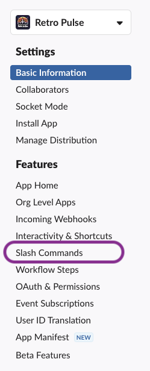

Welcome to the second installment of this multi-part series on building a Slack application with Rails. This series will guide you through the process of creating a Slack application with Rails. The series is structured as follows:

* [Part 1: Rails new, Slack, and OAuth](../rails-slack-app-part1-oauth)
* Part 2: Slack Slash Command with Text Response (You Are Here)
* [Part 3: Slack Slash Command with Modal Response](../rails-slack-app-part3-slash-modal-response)
* [Part 4: Slack Action Modal Submission](../rails-slack-app-part4-action-modal-submission)
* [Part 5: Slack Slash Command with Block Kit Response](../rails-slack-app-part5-slash-block-kit-response)

Feel free to jump to a specific part of interest using the links above or follow along sequentially. You can also checkout the [source code on Github](https://github.com/danielabar/retro-pulse) for the application we'll be building.

This post assumes the reader has at least a beginner level familiarity with Ruby on Rails. It's also assumed the reader has used [Slack](https://slack.com/) as an end user with basic interactions such as joining channels, sending messages, and participating in conversations.

Part 1 of this series introduced [Retro Pulse](../rails-slack-app-part1-oauth#introducing-retro-pulse), a Slack app built with Rails for agile teams to manage their retrospectives entirely with Slack. This post will explain how to implement the Slack Slash command to open a retrospective. The interaction looks like this:


After hitting <kbd class="markdown-kbd">Enter</kbd>, the app responds with a confirmation that the retrospective has been opened:


## Create Slash Command in Slack

The first step in implementing this is to navigate to [Your Apps](https://api.slack.com/apps) on Slack, select the "Retro Pulse" app you created in [Part 1 of this series](../rails-slack-app-part1-oauth#create-slack-app), and then select "Slash Commands" from the Features section:



Then click on the "Create New Command" button, and fill in the form as follows:

**Command:** `/retro-open`. This is what the user will type into a Slack message to initiate an interaction with the Retro Pulse Rails app.

**Request URL:** `https://12e4-203-0-113-42.ngrok-free.app/api/slack/command`. This is where Slack will send an HTTP POST request when the user submits this slash command from Slack. The hostname is your ngrok forwarding address that you got from starting [ngrok in part 1 of this series](../rails-slack-app-part1-oauth#ngrok). The route `/api/slack/command` is defined in the `slack-ruby-bot-server` gem that we included as part of our [Rails app in part 1 of this series](../rails-slack-app-part1-oauth#create-rails-app).

**Short Description:** `Open a new retrospective for comments`. This will be displayed as the user types in the slash command.

**Usage Hint:** `title`. Since this particular slash command requires a parameter, which will be used to create the retrospective, the usage hint is also shown to the user as they type in the slash command.

The filled out form will look something like this:


Click the "Save" button, which at the time of this writing, appears all the way at the bottom right-hand corner of the screen.

## Receive Slash Command in Rails

The next step is to update the Rails app to handle the HTTP POST to `/api/slack/command` that Slack will send whenever a user submits the `/retro-pulse something` Slash command. Recall that we're using the [slack-ruby-bot-server-events](https://github.com/slack-ruby/slack-ruby-bot-server-events) gem, which takes care of a lot of the boilerplate including verifying the `X-Slack-Signature` HTTP header and parsing the body.

Start by creating a `bot` directory in the root of the Rails project, then create a directory and file to handle the `/retro-open` slash command:

```bash
# from root of Rails project
mkdir bot
touch bot/slash_commands.rb
mkdir bot/slash_commands
touch bot/slash_commands/retro_open.rb
```

You should have the following structure:

```
.
├── app
└── bot
    ├── slash_commands
    │   └── retro_open.rb
    └── slash_commands.rb
```

Fill in `bot/slash_commands.rb` to load all the slash commands, there's only one for now:

```ruby
# bot/slash_commands.rb
require_relative "slash_commands/retro_open"
```

Fill in the implementation for the retro open command handler. For now, it will only log out the text it received, as well as the team name and Slack channel ID the command was called from. The team will be fetched by the `team_id` that is available from the `command` object exposed by the `slack-ruby-bot-server-events` gem. The `channel_id` and `text` are also available from the `command` object:

```ruby
# bot/slash_commands/retro_open.rb
SlackRubyBotServer::Events.configure do |config|
  config.on :command, "/retro-open" do |command|
    team = Team.find_by(team_id: command[:team_id])
    channel_id = command[:channel_id]
    command_text = command[:text]
    command.logger.info "=== COMMAND: retro-open, Team: #{team.name}, Channel: #{channel_id}, Title: #{command_text}"
    nil
  end
end
```

Then update `config.ru` file in the root of the Rails app to load the command handlers in the `bot` directory. This will ensure the the Slack bot code is loaded when Rails starts:

```ruby
# This file is used by Rack-based servers to start the application.
require_relative "config/environment"

# === ADD THIS LINE TO LOAD THE SLASH COMMAND HANDLERS ===
require_relative "bot/slash_commands"

# We added this line previously in Part 1 of this series:
SlackRubyBotServer::App.instance.prepare!

run Rails.application
Rails.application.load_server
```

Now we're ready to see this in action. Start the Rails server with `bin/dev`. Then go to your Slack desktop app, and enter the following in any channel in your Slack workspace where this app has been added. Recall that we added the Slack app to a workspace in [part 1 of this series as part of the OAuth flow](../rails-slack-app-part1-oauth#run-the-oauth-flow):

```
# Enter whatever title you want
/retro-open My Project Sprint 1
```

The Rails server output will show that the HTTP POST command has been received and processed. Notice it runs a SQL SELECT to find the team, this is as a result of `Team.find_by(team_id: command[:team_id])` in the command handler:

```
Started POST "/api/slack/command"
  Team Load (2.1ms)  SELECT "teams".* FROM "teams"
    WHERE "teams"."team_id" = $1 LIMIT $2
    [["team_id", "the-team-id-from-slack"], ["LIMIT", 1]]
I, INFO -- : === COMMAND: retro-open,
  Team: YourTeamName,
  Channel: the-channel-from-slack,
  Title: My Project Sprint 1
```

The `Title` displayed in the logger INFO should match whatever you typed in as the text following `/retro-open` in Slack.

### Inspect Request

One thing that can seem a little "magical" at this point, is that we didn't write a Rails controller to handle the `/api/slack/command` HTTP Request. This is being handled by the `slack-ruby-bot-server-events` gem. Unlike Rails controllers that we write, it doesn't log out the parameters it was called with. However, we can still view the entire HTTP POST request and body using ngrok.

In the terminal tab where ngrok is running, it includes an address for the Web Interface:

```bash
ngrok http 3000

# Output will look something like this, your details will vary:
# Region                        United States (us)
# Latency                       35ms
# Web Interface                 http://127.0.0.1:4040
# Forwarding                    https://12e4-203-0-113-42.ngrok-free.app -> http://localhost:3000
```

Enter `http://127.0.0.1:4040` in a browser. This will allow you to inspect all HTTP requests that were received by ngrok and the corresponding HTTP responses that were sent by the Rails app. At this point, you should have one request for `POST /api/slack/command`. It will look something like this, of course, all your specific Slack details will vary:


This shows all the form parameters that Slack sent in the HTTP `POST /api/slack/command`. You can also view the HTTP headers. These include the `X-Slack-Request-Timestamp` and `X-Slack-Signature` headers that are automatically verified by the `slack-ruby-bot-server-events` gem. If you weren't using a gem for this, you'd have to write this verification code yourself:


## Retrospective Model

Now that we can see the communication between the Slack slash command and Rails working, the `/retro-open` slash command handler can be enhanced to do the real work of opening a new retrospective, with the title populated from the slash command text.

In order to create a Retrospective, we need to first define the model and a migration...


## TODO
* WIP: intro para
* WIP: main content
* In the "Receive Slash Command in Rails" section: recall the Team model got populated in Part 1 of this series when we ran the OAuth flow to add this app to a Slack workspace.
* Explain about escape option when defining slash command: Turning this on will modify the parameters sent with a command by a user. It will wrap URLs in angle brackets (ie. <http://example.com>) and it will translate channel or user mentions into their correlated IDs. Ref: https://api.slack.com/interactivity/slash-commands   (not important in this app)
* ASIDE: You may be wondering how is it that the code we wrote at `bot/slash_commands/retro_open.rb` is being run. This is the work of the `slack-ruby-bot-server-events` gem. When we specified `config.on` in the `SlackRubyBotServer::Events.configure` block, this added our handler as a callback. Then the Grape API endpoint which implements the HTTP POST for `/api/slack/command` parses out the specific command name, then runs all callbacks that are registered for that command. Ref: lib/slack-ruby-bot-server-events/api/endpoints/slack/commands_endpoint.rb
* conclusion para
* edit
