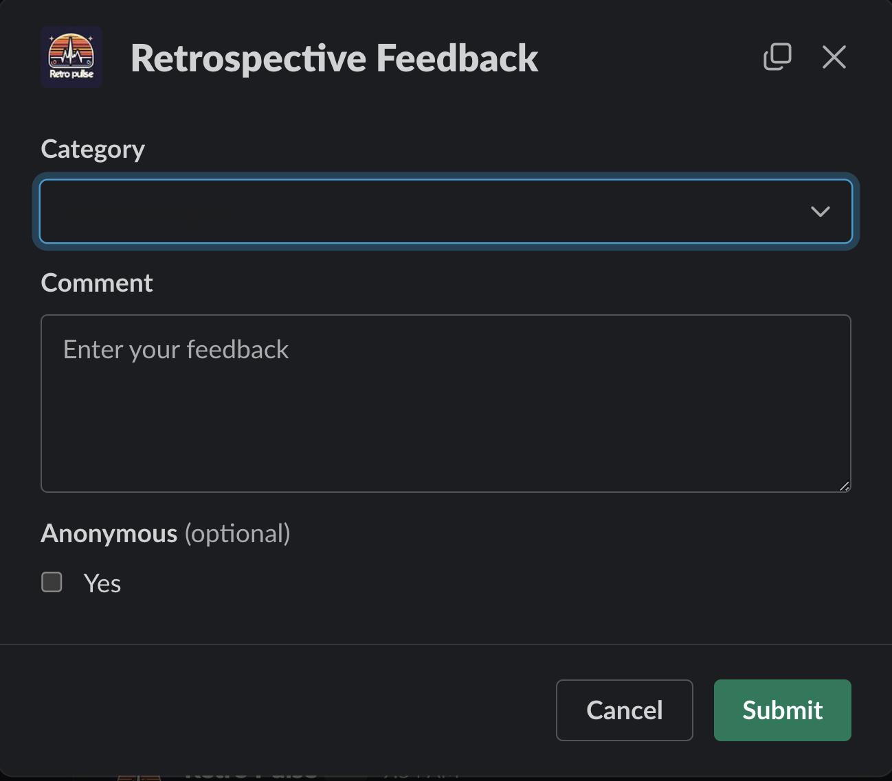

Welcome to the third installment of this multi-part series on building a Slack application with Rails. This series will guide you through the process of creating a Slack application with Rails and is structured as follows:

* [Part 1: Rails new, Slack, and OAuth](../rails-slack-app-part1-oauth)
* [Part 2: Slack Slash Command with Text Response](../rails-slack-app-part2-slash-command-with-text-response)
* Part 3: Slack Slash Command with Modal Response (You Are Here)
* [Part 4: Slack Action Modal Submission](../rails-slack-app-part4-action-modal-submission)
* [Part 5: Slack Slash Command with Block Kit Response](../rails-slack-app-part5-slash-block-kit-response)

Feel free to jump to a specific part of interest using the links above or follow along sequentially. You can also checkout the [source code on Github](https://github.com/danielabar/retro-pulse) for the application we'll be building.

This post assumes the reader has at least a beginner level familiarity with Ruby on Rails. It's also assumed the reader has used [Slack](https://slack.com/) as an end user with basic interactions such as joining channels, sending messages, and participating in conversations.

Part 1 of this series introduced [Retro Pulse](../rails-slack-app-part1-oauth#introducing-retro-pulse), a Slack app built with Rails for agile teams to manage their retrospectives entirely with Slack. Part 2 explained how to implement a Slack Slash command to open a retrospective and return a markdown text response to the same Slack channel that initiated the request. Now in Part 3, we will learn how to implement another slash command `/retro-feedback` that will respond with a modal form, allowing the user to enter some feedback for the retrospective such as something the team should keep on doing, or stop doing, or something new to try.

The interaction starts with a user entering the `/retro-feedback` slash command in a Slack workspace where the [Retro Pulse](../rails-slack-app-part1-oauth#introducing-retro-pulse) app has been added:

After hitting <kbd class="markdown-kbd">Enter</kbd>, the app responds with a modal:

The modal has a dropdown for Category:

After selecting a category, the user can enter a multi-line comment containing their feedback, optionally check the Anonymous option if they don't want their Slack username shown alongside their feedback, and Submit the form.

## Create Slash Command in Slack

The first step in implementing this is to navigate to [Your Apps](https://api.slack.com/apps) on Slack, select the "Retro Pulse" app you created in [Part 1 of this series](../rails-slack-app-part1-oauth#create-slack-app), and then select "Slash Commands" from the Features section:

Then click on the "Create New Command" button, and fill in the form as follows:

**Command:** `/retro-feedback`. This is what the user will type into a Slack message to initiate an interaction with the Retro Pulse Rails app.

**Request URL:** For example: `https://12e4-203-0-113-42.ngrok-free.app/api/slack/command`. This is where Slack will send an HTTP POST request when the user submits this slash command from Slack. The hostname is your ngrok forwarding address that you got from starting [ngrok in part 1 of this series](../rails-slack-app-part1-oauth#ngrok). The route `/api/slack/command` is defined in the `slack-ruby-bot-server` gem that we included as part of our [Rails app in part 1 of this series](../rails-slack-app-part1-oauth#create-rails-app).

**Short Description:** `Provide some feedback for what's going well, or what to stop doing, or try`. This will be displayed as the user types in the slash command.

**Usage Hint:** Leave blank.

**Escape Channels:** Leave this unchecked. Turning this on will modify the parameters sent with a command by a user such as  wrapping URLs in angle brackets and translating channel or user mentions into their correlated IDs. It's not necessary for this app. See the [Slack docs](https://api.slack.com/interactivity/slash-commands) if your app needs this option.

Then click the "Save" button which appears all the way at the bottom right hand corner.

## Receive Slash Command in Rails
