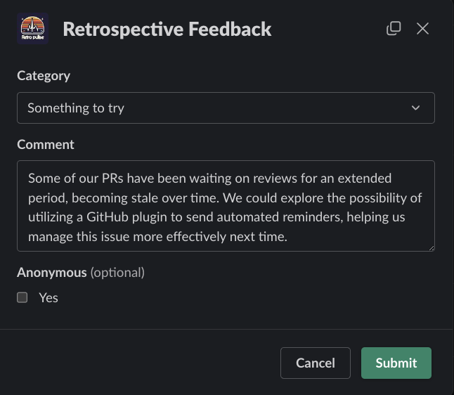
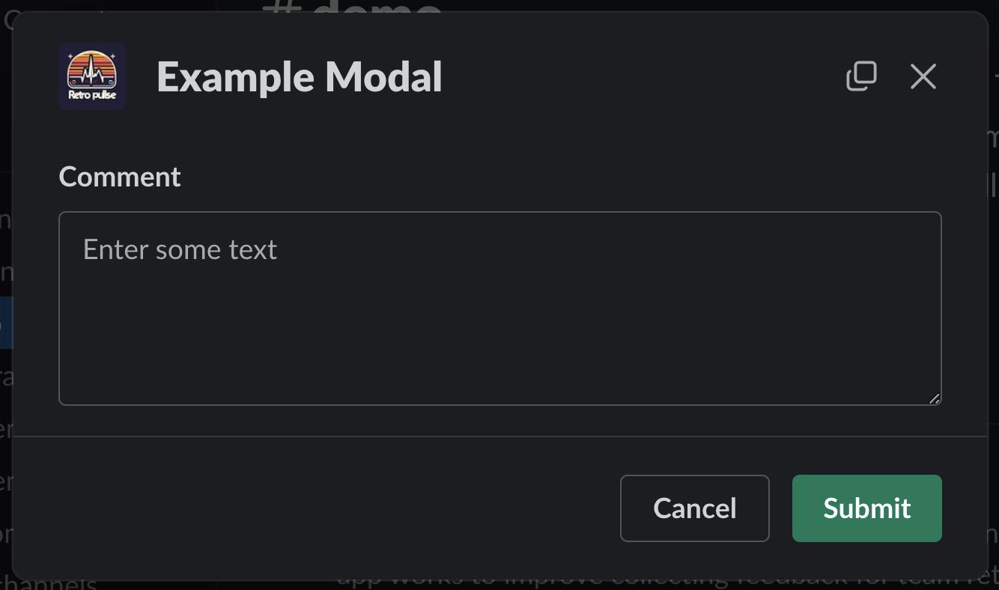
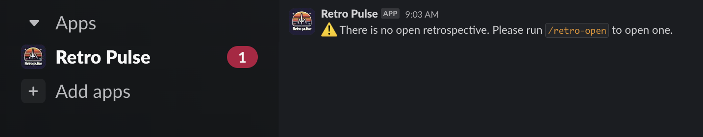

Welcome to the third installment of this multi-part series on building a Slack application with Rails. This series will guide you through the process of creating a Slack application with Rails and is structured as follows:

* [Part 1: Rails new, Slack, and OAuth](../rails-slack-app-part1-oauth)
* [Part 2: Slack Slash Command with Text Response](../rails-slack-app-part2-slash-command-with-text-response)
* Part 3: Slack Slash Command with Modal Response === YOU ARE HERE ===
* [Part 4: Slack Action Modal Submission](../rails-slack-app-part4-action-modal-submission)
* [Part 5: Slack Slash Command with Block Kit Response](../rails-slack-app-part5-slash-block-kit-response)

Feel free to jump to a specific part of interest using the links above or follow along sequentially. You can also checkout the [source code on Github](https://github.com/danielabar/retro-pulse) for the application we'll be building.

This post assumes the reader has at least a beginner level familiarity with Ruby on Rails. It's also assumed the reader has used [Slack](https://slack.com/) as an end user with basic interactions such as joining channels, sending messages, and participating in conversations.

Part 1 of this series introduced [Retro Pulse](../rails-slack-app-part1-oauth#introducing-retro-pulse), a Slack app built with Rails for agile teams to manage their retrospectives with Slack. [Part 2](../rails-slack-app-part2-slash-command-with-text-response) explained how to implement a Slack slash command to open a retrospective and return a markdown text response to the same Slack channel that initiated the request. Now in Part 3, we will learn how to implement another slash command `/retro-feedback` that will respond with a modal form, allowing the user to enter some feedback for the retrospective such as something the team should keep on doing, or stop doing, or something new to try.

The interaction starts with a user entering the `/retro-feedback` slash command in a Slack workspace where the [Retro Pulse](../rails-slack-app-part1-oauth#introducing-retro-pulse) app has been added:


After hitting <kbd class="markdown-kbd">Enter</kbd>, the app responds with a modal:


The modal has a dropdown for the category of feedback:


After selecting a category, the user can enter a multi-line comment containing their feedback, optionally check the Anonymous option if they don't want their Slack username shown alongside their feedback, and Submit the form. For example:



We'll be looking at handling the form submission in a future post. This post is focused on generating the modal response.

## Create Slash Command in Slack

The first step in implementing this is to navigate to [Your Apps](https://api.slack.com/apps) on Slack, select the "Retro Pulse" app you created in [Part 1 of this series](../rails-slack-app-part1-oauth#create-slack-app), and then select "Slash Commands" from the Features section:


Then click on the "Create New Command" button, and fill in the form as follows:

**Command:** `/retro-feedback`. This is what the user will type into a Slack message to initiate an interaction with the Retro Pulse Rails app.

**Request URL:** For example: `https://12e4-203-0-113-42.ngrok-free.app/api/slack/command`. This is where Slack will send an HTTP POST request when the user submits this slash command from Slack. The hostname is your ngrok forwarding address that you got from starting [ngrok in part 1 of this series](../rails-slack-app-part1-oauth#ngrok). The route `/api/slack/command` is defined in the `slack-ruby-bot-server` gem that we included as part of our [Rails app in part 1 of this series](../rails-slack-app-part1-oauth#create-rails-app).

**Short Description:** `Provide some feedback for what's going well, or what to stop doing, or try`. This will be displayed as the user types in the slash command.

**Usage Hint:** Leave blank.

**Escape Channels:** Leave this unchecked. Turning this on will modify the parameters sent with a command by a user such as wrapping URLs in angle brackets and translating channel or user mentions into their correlated IDs. It's not necessary for this app. See the Slack [documentation](https://api.slack.com/interactivity/slash-commands) if your app needs this option.

Then click the "Save" button which appears all the way at the bottom right hand corner.

## Receive Slash Command in Rails

In Part 2 of this series, we learned how to add a [handler to receive slash commands](../rails-slack-app-part2-slash-command-with-text-response#receive-slash-command-in-rails) using the [slack-ruby-bot-server-events](https://github.com/slack-ruby/slack-ruby-bot-server-events) gem. Let's add another one to handle the `/retro-feedback` command.

Start by adding a new file in the `bot/slash_commands` directory named `retro_feedback.rb`. The structure will be similar to the `/retro-open` command handler we added in Part 2, except this time, there will be no `command[:text]` because the `/retro-feedback` command does not accept any arguments. Instead, we will make use of the `trigger_id` that Slack sends in the request. The `trigger_id` is a unique identifier generated by Slack when a user interacts with an interactive element (e.g., slash command, button click). It's used to open modals or perform other interactive actions in response to a user's command:


```ruby
# bot/slash_commands/retro_feedback.rb
SlackRubyBotServer::Events.configure do |config|

  # Essentially this is saying to the SlackRubyBotServer,
  # If a "/retro-feedback" slash command is received from Slack,
  # then execute this block.
  config.on :command, "/retro-feedback" do |command|
    # Use `command[:team_id]` from request parameters sent to us
    # by Slack to find the Team model persisted in the database
    team_id = command[:team_id]
    team = Team.find_by(team_id:)

    # Instantiate a slack client with the team token
    # so we can communicate back to the channel
    slack_client = Slack::Web::Client.new(token: team.token)

    # This is the Slack channel we need to respond back to
    channel_id = command[:channel_id]

    # Use `command[:trigger_id]` from request parameters sent to us Slack
    # This will be needed to generate the modal response.
    trigger_id = command[:trigger_id]

    command.logger.info "=== COMMAND: retro-feedback, Team: #{team.name}, Channel: #{channel_id}"

    # == Do SOMETHING with trigger_id and slack_client ===

    # Return `nil`, otherwise the slack-ruby-bot-server-events gem
    # replies to the channel with a message "true"
    nil
  end
end
```

Also, use `require_relative` to load this new command in the `bot/slash_commands.rb` file. We created this file in Part 2 when introducing slash commands:

```ruby
# bot/slash_commands.rb

# This line was added in Part 2 of this series
require_relative "slash_commands/retro_open"

# === NEW ===
require_relative "slash_commands/retro_feedback"
```

This file is loaded by `config.ru` to ensure that all the Slack handlers are loaded when Rails starts.

At this point, if you restart the Rails server, and then enter `/retro-feedback` in any channel in a Slack workspace with the Retro Pulse app has been installed, you should see some info logging in the Rails server output displaying your team name and the channel id. Of course, nothing will happen on the Slack side because the code isn't responding yet. The next section explains how to generate a modal response.

## Respond with Example Modal

In order to send back a modal response from the slash command, we'll make use of Slack [Modals](https://api.slack.com/surfaces/modals) and [Block Kit](https://api.slack.com/block-kit/building).

**Modal:** The Slack app equivalent of an alert box, pop-up, or dialog box. Modals capture and maintain focus within Slack until the user submits or dismisses the modal.

**Block Kit:** A framework provided by Slack for building rich and interactive messages within the Slack platform. It allows developers to create visually appealing messages containing various elements such as text, buttons, images, and input fields. Think of Block Kit as a set of building blocks for crafting dynamic user interfaces directly within Slack conversations.

This will make more sense with a simple example. In the following code snippet, the `views_open` method from the Slack API is used to trigger the opening of a modal in response to the `/retro-feedback` command. This method accepts a hash that represents the modal contents. The modal includes a title "Example Modal", a submit button, a cancel button, and an input block for users to enter some text:

```ruby
# bot/slash_commands/retro_feedback.rb
SlackRubyBotServer::Events.configure do |config|
  config.on :command, "/retro-feedback" do |command|
    team_id = command[:team_id]
    team = Team.find_by(team_id:)
    slack_client = Slack::Web::Client.new(token: team.token)
    channel_id = command[:channel_id]
    trigger_id = command[:trigger_id]
    command.logger.info "=== COMMAND: retro-feedback, Team: #{team.name}, Channel: #{channel_id}"

    modal_payload = {
      trigger_id: trigger_id,
      view: {
        type: "modal",
        callback_id: "feedback_form",
        title: {
          type: "plain_text",
          text: "Example Modal",
          emoji: true
        },
        submit: {
          type: "plain_text",
          text: "Submit",
          emoji: true
        },
        close: {
          type: "plain_text",
          text: "Cancel",
          emoji: true
        },
        blocks: [
          {
            type: "input",
            block_id: "comment_block",
            element: {
              type: "plain_text_input",
              action_id: "comment_input",
              multiline: true,
              placeholder: {
                type: "plain_text",
                text: "Enter some text"
              }
            },
            label: {
              type: "plain_text",
              text: "Comment"
            }
          }
        ]
      }
    }

    slack_client.views_open(modal_payload)
    nil
  end
end
```

**Notes:**

* `trigger_id` was extracted from the Slack request sent to the Rails app when the user entered `/retro-feedback`, we need to send it back to Slack as part of the request to open a modal so that Slack can "connect" the original user's request with this modal response.
* `callback_id` is a unique identifier assigned to the modal, helping your Slack app distinguish different modals from one another when user submits it. We'll see how this is useful in the next post on processing user form submission.
* `title` will be displayed at the top of the modal.
* The `submit` and `close` attributes are optional. That is to say, Slack will always generate these buttons, but you can optionally define them in the payload to override the default text that is displayed on the buttons.
* The `blocks` section is required. It contains an array of Slack block elements that make up the modal content. In this simple example, we only have a single element, a multi-line input with some placeholder text and a label. See the Slack docs on [Reference Blocks](https://api.slack.com/reference/block-kit/blocks) for all supported elements and options.

After restarting the Rails server, go to your Slack workspace, enter `/retro-feedback` in any channel and hit <kbd class="markdown-kbd">Enter</kbd>, you should be presented with a modal like this:



## Respond with Retro Feedback Modal

Now that we understand the basics of generating a modal response, we're ready to start building the actual modal we want to send back to collect feedback on the retrospective. Recall this is what we need to generate:


Some of this we've already seen how to do including generating the title, a multi-line text input, and the Cancel and Submit buttons. The new parts are the dropdown value for Category (keep, stop, and try), and the optional checkbox for submitting the feedback anonymously.

To generate a select input element with a static list of options, Slack provides the [static_select](https://api.slack.com/reference/block-kit/block-elements#static_select) type. This allows you to specify a placeholder such as "Select category", and a list of options. Each option has display text and the value that will be submitted if user selects this option. Adding the category `static_select` input type to our list of blocks looks like this:

```ruby
# bot/slash_commands/retro_feedback.rb
SlackRubyBotServer::Events.configure do |config|
  config.on :command, "/retro-feedback" do |command|
    # extract params from command
    modal_payload = {
      trigger_id: trigger_id,
      view: {
        type: "modal",
        callback_id: "feedback_form",
        title: { ... },
        submit: { ... },
        close: { ... },
        blocks: [
          { type: "input", block_id: "comment_block", ... },
          {
            type: "input",
            block_id: "category_block",
            element: {
              type: "static_select",
              action_id: "category_select",
              placeholder: {
                type: "plain_text",
                text: "Select category"
              },
              options: [
                {
                  text: {
                    type: "plain_text",
                    text: "Something we should keep doing"
                  },
                  value: "keep"
                },
                {
                  text: {
                    type: "plain_text",
                    text: "Something we should stop doing"
                  },
                  value: "stop"
                },
                {
                  text: {
                    type: "plain_text",
                    text: "Something to try"
                  },
                  value: "try"
                }
              ]
            },
            label: {
              type: "plain_text",
              text: "Category"
            }
          }
        ]
      }
    }

    slack_client.views_open(modal_payload)
    nil
  end
end
```

To complete the modal generation, we also need to add the Anonymous checkbox. This is for user's that don't want their Slack username displayed later when the retrospective feedback is being discussed. Again we can check the Slack Block Kit reference docs on the [checkbox element](https://api.slack.com/reference/block-kit/block-elements#checkboxes), and learn that the type is `checkboxes`, and it requires an array of options. We'll also set `optional: true` to tell Slack that this isn't required. Here's what the `blocks` array looks like with the checkbox element added:

```ruby
# bot/slash_commands/retro_feedback.rb
SlackRubyBotServer::Events.configure do |config|
  config.on :command, "/retro-feedback" do |command|
    # extract params from command...
    modal_payload = {
      trigger_id: trigger_id,
      view: {
        type: "modal",
        callback_id: "feedback_form",
        title: { ... },
        submit: { ... },
        close: { ... },
        blocks: [
          { type: "input", block_id: "comment_block", ... },
          { type: "input", block_id: "category_block", ... },
          {
            type: "input",
            block_id: "anonymous_block",
            optional: true,
            element: {
              type: "checkboxes",
              action_id: "anonymous_checkbox",
              options: [
                {
                  text: {
                    type: "plain_text",
                    text: "Yes"
                  },
                  value: "true"
                }
              ]
            },
            label: {
              type: "plain_text",
              text: "Anonymous"
            }
          }
        ]
      }
    }

    slack_client.views_open(modal_payload)
    nil
  end
end
```

Restarting the Rails server at this point, and then running `/retro-feedback` in Slack will now generate the form with all the required inputs.

However, before declaring this task done, there's a problem. This code is way too long (if using Rubocop, the `Metrics/BlockLength` violation will be indicated). Furthermore, having it in the command handler makes it impossible to test. This will be addressed in the next section.

## Refactor

The issue of an overly long command handler can be addressed in a similar manner to what was done in Part 2 of this series, where the command handler was refactored by moving the business logic into an interactor named `OpenRetrospective`. A brief discussion of [how to organize business logic in Rails applications](../rails-slack-app-part2-slash-command-with-text-response#refactor) was also covered in Part 2.

We'll do something similar now by introducing an `InitiateFeedbackForm` interactor, which will receive the `trigger_id` and `slack_client` from the command handler, build the modal response, and send it back to the slack channel. This will simplify the command handler to look like this:

```ruby
# bot/slash_commands/retro_feedback.rb
SlackRubyBotServer::Events.configure do |config|
  config.on :command, "/retro-feedback" do |command|
    team_id = command[:team_id]
    team = Team.find_by(team_id:)
    slack_client = Slack::Web::Client.new(token: team.token)
    channel_id = command[:channel_id]
    trigger_id = command[:trigger_id]
    command.logger.info "=== COMMAND: retro-feedback, Team: #{team.name}, Channel: #{channel_id}"

    # Pass in the `trigger_id` and `slack_client` as context to the interactor
    InitiateFeedbackForm.call(trigger_id:, slack_client:)
    nil
  end
end
```

The interactor is responsible for building the modal payload, and sending it back to the channel using the slack client.

```ruby
# app/interactors/initiate_feedback_form.rb
class InitiateFeedbackForm
  include Interactor

  def call
    modal_payload = build_modal_payload
    context.slack_client.views_open(modal_payload)
  rescue StandardError => e
    error_message = "Error in InitiateFeedbackForm: #{error.message}"
    backtrace = error.backtrace.join("\n")
    Rails.logger.error("#{error_message}\n#{backtrace}")
    context.fail!
  end

  private

  # Use `trigger_id` from context passed in by the Slack command handler
  def build_modal_payload
    {
      trigger_id: context.trigger_id,
      view: {
        type: "modal",
        callback_id: "feedback_form",
        title: { ... },
        submit: { ... },
        close: { ... },
        blocks: [
          { type: "input", block_id: "comment_block", ... },
          { type: "input", block_id: "category_block", ... },
          { type: "input", block_id: "anonymous_block", ... }
        ]
      }
    }
  end

  def send_modal
    context.slack_client.views_open(@modal_payload)
  end
end
```

While this eliminates the Rubocop warnings from the Slack command handler `bot/slash_commands/retro_feedback.rb`, it introduces a new problem. The `build_modal_payload` method of the `InitiateFeedbackForm` is too long, which Rubocop will flag with the `Metrics/MethodLength` rule. It looks condensed above because I've replaced many sections with `...` to easily fit it in a smaller view, but the actual payload is over 100 lines long!

One way to deal with this would be to break up the building of individual portions of the modal payload into smaller methods. For example, extract a method such as `build_title_block` that only deals with the title logic:

```ruby
# app/interactors/initiate_feedback_form.rb
class InitiateFeedbackForm
  include Interactor

  def call
    # ...
  end

  private

  def build_modal_payload
    {
      trigger_id: context.trigger_id,
      view: {
        type: "modal",
        callback_id: "feedback_form",
        title: build_title_block,
        submit: { ... },
        close: { ... },
        blocks: [
          { type: "input", block_id: "comment_block", ... },
          { type: "input", block_id: "category_block", ... },
          { type: "input", block_id: "anonymous_block", ... }
        ]
      }
    }
  end

  def build_title_block
    {
      type: "plain_text",
      text: "Retrospective Feedback",
      emoji: true
    }
  end
end
```

This pattern could be carried on for every element of the modal. However, in this case, since the logic is so closely tied to the Slack API, it will be cleaner to extract Slack-specific form building logic into the `lib` directory as a new module `SlackFormBuilder`:

```ruby
# lib/slack_form_builder.rb
module SlackFormBuilder
  module_function

  def build_title_block
    {
      type: "plain_text",
      text: "Retrospective Feedback",
      emoji: true
    }
  end

  def build_submit_block
    {
      type: "plain_text",
      text: "Submit",
      emoji: true
    }
  end

  def build_close_block
    {
      type: "plain_text",
      text: "Cancel",
      emoji: true
    }
  end

  def build_category_block
    {
      type: "input",
      block_id: "category_block",
      element: build_static_select_element,
      label: {
        type: "plain_text",
        text: "Category"
      }
    }
  end

  def build_static_select_element
    {
      type: "static_select",
      action_id: "category_select",
      placeholder: {
        type: "plain_text",
        text: "Select category"
      },
      options: [
        build_option("Something we should keep doing", "keep"),
        build_option("Something we should stop doing", "stop"),
        build_option("Something to try", "try")
      ]
    }
  end

  def build_option(text, value)
    {
      text: {
        type: "plain_text",
        text:
      },
      value:
    }
  end

  def build_comment_block
    {
      type: "input",
      block_id: "comment_block",
      element: build_plain_text_input_element("Enter your feedback"),
      label: {
        type: "plain_text",
        text: "Comment"
      }
    }
  end

  def build_plain_text_input_element(placeholder_text)
    {
      type: "plain_text_input",
      action_id: "comment_input",
      multiline: true,
      placeholder: {
        type: "plain_text",
        text: placeholder_text
      }
    }
  end

  def build_anonymous_block
    {
      type: "input",
      block_id: "anonymous_block",
      optional: true,
      element: build_checkboxes_element,
      label: {
        type: "plain_text",
        text: "Anonymous"
      }
    }
  end

  def build_checkboxes_element
    {
      type: "checkboxes",
      action_id: "anonymous_checkbox",
      options: [
        build_option("Yes", "true")
      ]
    }
  end
end
```

<aside class="markdown-aside">
Note that the <a class="markdown-link" href="https://docs.ruby-lang.org/en/3.2/Module.html#method-i-module_function">module_function</a> method creates module functions for the named methods. This allows these functions to be called with the module as a receiver, and also become available as instance methods to classes that mix in the module. The ability to call the functions directly on the module is convenient for <a class="markdown-link" href="https://github.com/danielabar/retro-pulse/blob/main/spec/lib/slack_form_builder_spec.rb">unit testing</a>.
</aside>

With the `SlackFormBuilder` module in place that does all the work of building the Slack block kit form components, the `InitiateFeedbackForm` interactor can be shortened and simplified to use it as follows:

```ruby
class InitiateFeedbackForm
  include Interactor

  # Mixin our custom module so we can access the methods
  # such as `build_title_block` as instance methods
  include SlackFormBuilder

  def call
    modal_payload = build_modal_payload
    context.slack_client.views_open(modal_payload)
  rescue StandardError => e
    error_message = "Error in InitiateFeedbackForm: #{error.message}"
    backtrace = error.backtrace.join("\n")
    Rails.logger.error("#{error_message}\n#{backtrace}")

    context.fail!
  end

  private

  # Make use of the SlackFormBuilder module methods
  def build_modal_payload
    {
      trigger_id: context.trigger_id,
      view: {
        type: "modal",
        callback_id: "feedback_form",
        title: build_title_block,
        submit: build_submit_block,
        close: build_close_block,
        blocks: [
          build_category_block,
          build_comment_block,
          build_anonymous_block
        ]
      }
    }
  end
end
```

## Validation

One last thing the `InitiateFeedbackForm` needs to do is verify that an open retrospective actually exists, and if not, it should notify the user with a direct message (DM) that made the request. There's no point in letting the user provide feedback if there's nowhere to save it to.

In order to send a direct message, we'll need to know the Slack user that made the `/retro-feedback` request. This can be extracted from the `command` object exposed by the command handler, and passed on to the interactor context:

```ruby
# bot/slash_commands/retro_feedback.rb
SlackRubyBotServer::Events.configure do |config|
  config.on :command, "/retro-feedback" do |command|
    team_id = command[:team_id]
    team = Team.find_by(team_id:)
    slack_client = Slack::Web::Client.new(token: team.token)
    channel_id = command[:channel_id]
    trigger_id = command[:trigger_id]

    # === NEW: Extract the user_id ===
    user_id = command[:user_id]

    # === NEW: Also pass in user_id ===
    InitiateFeedbackForm.call(trigger_id:, slack_client:, user_id:)
    nil
  end
end
```

Then the `InitiateFeedbackForm` is modified to check for an open retrospective, and send the user an error message using the [chat_postMessage](https://api.slack.com/methods/chat.postMessage) API from the `slack_client`:

```ruby
class InitiateFeedbackForm
  include Interactor
  include SlackFormBuilder

  def call
    retrospective = Retrospective.find_by(status: Retrospective.statuses[:open])
    return no_open_retrospective_message if retrospective.nil?
    # ...
  end

  private

  # ...

  # Specifying `user_id` for the channel will send a direct message to the user
  def no_open_retrospective_message
    message = "There is no open retrospective. Please run `/retro-open` to open one."
    warning_icon = ":warning:"
    context.slack_client.chat_postMessage(
      channel: context.user_id,
      text: "#{warning_icon} #{message}"
    )
  end
end
```

With this change in place, if a user enters `/retro-feedback` in a Slack workspace with the Retro Pulse app installed, and there is no open retrospective, they will get a notification from the app as shown below:



## Next Steps

At this point, we've built the capability for a Slack user to enter a custom slash command `/retro-feedback`, and have the app respond with a nicely formatted modal. The user can then select the category of the retrospective feedback (whether it's something the team should keep on doing, stop doing, or try for next time), enter their feedback in a multi-line input, and optionally check off if they wish to remain anonymous. In the [next post in this series](../rails-slack-app-part4-action-modal-submission), we'll learn how to handle the form submission, save the user's feedback in the database, and send a direct message back to the user to confirm their feedback was received.

## TODO

* In part 1 when showing screenshots of how app works, include example of anonymous feedback vs showing the slack user id that submitted the feedback
