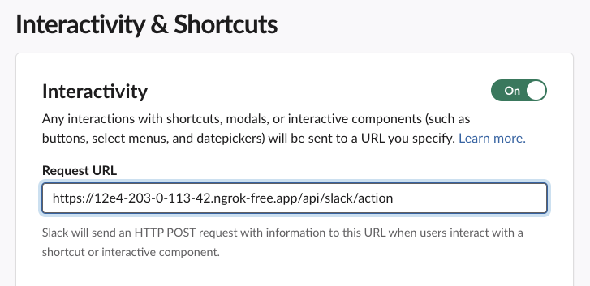

Welcome to the fourth installment of this multi-part series on building a Slack application with Rails. This series will guide you through the process of creating a Slack application with Rails and is structured as follows:

* [Part 1: Rails new, Slack, and OAuth](../rails-slack-app-part1-oauth)
* [Part 2: Slack Slash Command with Text Response](../rails-slack-app-part2-slash-command-with-text-response)
* [Part 3: Slack Slash Command with Modal Response](../rails-slack-app-part3-slash-command-with-modal-response)
* [Part 4: Slack Action Modal Submission] (=== YOU ARE HERE ===)
* [Part 5: Slack Slash Command with Block Kit Response](../rails-slack-app-part5-slash-block-kit-response)

Feel free to jump to a specific part of interest using the links above or follow along sequentially. You can also checkout the [source code on Github](https://github.com/danielabar/retro-pulse) for the application we'll be building.

This post assumes the reader has at least a beginner level familiarity with Ruby on Rails. It's also assumed the reader has used [Slack](https://slack.com/) as an end user with basic interactions such as joining channels, sending messages, and participating in conversations.

Part 1 of this series introduced [Retro Pulse](../rails-slack-app-part1-oauth#introducing-retro-pulse), a Slack app built with Rails for agile teams to manage their retrospectives entirely with Slack. [Part 2](../rails-slack-app-part2-slash-command-with-text-response) explained how to implement a Slack Slash command to open a retrospective and return a markdown text response to the same Slack channel that initiated the request. [Part 3]((../rails-slack-app-part3-slash-command-with-modal-response)) covered how to implement a slash command that responds with a modal form, allowing the user to enter feedback for the retrospective.

Now in Part 4, we will learn how to handle the modal submission, save the user's feedback in the database, and reply back with a DM to the user letting them know their input has been received. The interaction looks like this:

Recall in Part 3 we learned how to build this modal form in response ot the `/retro-feedback` slash command:


After submitting the form, the app responds with a direct message (DM) to the user confirming their feedback has been received:


## Comment Model

Before implementing the Slack portion of this, we need to ensure there's a place in the database to save the user's retrospective comments. In Part 2 of this series, we introduced the [Retrospective model](../rails-slack-ap-part2-slash-command-with-text-response#implement-slash-command), with `title` and `status` attributes:

```ruby
# == Schema Information
#
# Table name: retrospectives
#
#  id         :bigint           not null, primary key
#  status     :enum             default("open"), not null
#  title      :string           not null
#  created_at :datetime         not null
#  updated_at :datetime         not null
#
# Indexes
#
#  index_retrospectives_on_title  (title) UNIQUE
#
class Retrospective < ApplicationRecord
  enum status: {
    open: "open",
    closed: "closed"
  }
  # ...
end
```

To save the user's feedback, let's add a `Comment` model that `belongs_to` a `Retrospective`. It has a `text` column to store the content, some columns to store the Slack user information, and a `boolean` to indicate if this comment should be anonymous. Here is the migration:

```ruby
class CreateComments < ActiveRecord::Migration[7.0]
  def change
    create_table :comments do |t|
      t.text :content, null: false
      t.boolean :anonymous, null: false, default: false
      t.string :slack_user_id
      t.string :slack_username
      t.references :retrospective, null: false, foreign_key: true

      t.timestamps
    end
  end
end
```

We also need to know what kind of comment this is, i.e. whether this is something the team should *keep* on doing, *stop* doing, or *try* something new for next time. Let's add a `category` column to the `comments` table as a [Postgres enum](../rails-enum-mysql-postgres):

```ruby
class AddCategoryToComments < ActiveRecord::Migration[7.0]
  def up
    execute <<-SQL.squish
      CREATE TYPE comment_category AS ENUM ('keep', 'stop', 'try');
    SQL
    add_column :comments, :category, :comment_category, default: "keep", null: false
  end

  def down
    remove_column :comments, :category
    execute <<-SQL.squish
      DROP TYPE comment_category;
    SQL
  end
end
```

After running the migrations with `bin/rails db:migrate`, the resulting `Comment` model is:

```ruby
# == Schema Information
#
# Table name: comments
#
#  id               :bigint           not null, primary key
#  anonymous        :boolean          default(FALSE), not null
#  category         :enum             default("keep"), not null
#  content          :text             not null
#  slack_username   :string
#  slack_user_id    :string
#  created_at       :datetime         not null
#  updated_at       :datetime         not null
#  retrospective_id :bigint           not null
#
# Indexes
#
#  index_comments_on_retrospective_id  (retrospective_id)
#
# Foreign Keys
#
#  fk_rails_...  (retrospective_id => retrospectives.id)
#
class Comment < ApplicationRecord
  belongs_to :retrospective

  enum category: {
    keep: "keep",
    stop: "stop",
    try: "try"
  }
end
```

The retrospective model is also updated to indicate it `has_many` comments. The `dependent: :destroy` option is used because it ensures that when a `Retrospective` record is deleted, all associated `Comment` records belonging to that retrospective are also deleted. This prevents orphaned records by ensuring that comments tied to a specific retrospective are removed when the retrospective is no longer needed:

```ruby
# == Schema Information
#
# Table name: retrospectives
#
#  id         :bigint           not null, primary key
#  status     :enum             default("open"), not null
#  title      :string           not null
#  created_at :datetime         not null
#  updated_at :datetime         not null
#
# Indexes
#
#  index_retrospectives_on_title  (title) UNIQUE
#
class Retrospective < ApplicationRecord
  has_many :comments, dependent: :destroy
  # ...
end
```

## Anonymous Enforcement

There's one more thing to handle in the `Comment` model. The requirements of this app are that if the user selects the Anonymous checkbox when filling out the feedback form:


Then their Slack user id and name *should not* be persisted in the database. Otherwise if the feedback is not anonymous (i.e. user left the Anonymous checkbox unchecked), then their Slack user id and name *should* be persisted in the database.


To enforce this rule, a combination of `presence` and `absence` options can be passed to the ActiveRecord `validates` macro, together with conditional options:

```ruby
class Comment < ApplicationRecord
  validates :slack_user_id,
    absence: { message: "must be empty when anonymous is true" },
    if: :anonymous

  validates :slack_username,
    absence: { message: "must be empty when anonymous is true" },
    if: :anonymous

  validates :slack_user_id,
    presence: { message: "must be provided when anonymous is false" },
    unless: :anonymous

  validates :slack_username,
    presence: { message: "must be provided when anonymous is false" },
    unless: :anonymous

  # ...
end
```

However, the above validation rules will only be performed at the application level. Someone with direct database access (such as the support team) would still be able to insert invalid data. To ensure data integrity at the database level, we can also add a [CHECK CONSTRAINT](https://www.postgresql.org/docs/current/ddl-constraints.html#DDL-CONSTRAINTS-CHECK-CONSTRAINTS) to the table. This can be done with the Rails migration method `add_check_constraint`. Here is the migration:

```ruby
class AddCheckConstraintForSlackInfoInComments < ActiveRecord::Migration[7.0]
  def change
    # If a comment is anonymous, then the slack info fields should be null.
    # If a comment is not anonymous, then the slack info fields should be populated.
    add_check_constraint(
      :comments,
      "(anonymous AND slack_user_id IS NULL AND slack_username IS NULL)
      OR
      (NOT anonymous AND slack_user_id IS NOT NULL AND slack_username IS NOT NULL)",
      name: "check_slack_info_if_not_anonymous"
    )
  end
end
```

Now that the `Comment` model is implemented, we can move on to handling the Slack form submission.

## Configure Slack Interactivity

When the user clicks the Submit button on the modal form we generated, Slack will send an [interaction payload](https://api.slack.com/messaging/interactivity) to the `request_url` that is configured as part of the Interactivity Settings of the app. We haven't configured this yet so let's go ahead and do that now.

Navigate to [Your Apps](https://api.slack.com/apps/) in Slack, select the "Retro Pulse" application, then select "Interactivity & Shortcuts" from the Features section:


Enable the interactivity toggle:


Fill in your ngrok forwarding address in the Request URL field. This is the URL that Slack will POST a message to when the user submits the feedback modal. Recall we setup [ngrok in Part 1](../rails-slack-app-part1-oauth#ngrok) of this series:



As soon as you enter a valid URL, it will be saved automatically.

## Rails Slack Action Handler

WIP...

## TODO

- show example modal submission payload via ngrok
- section: handle slack action: parse payload, refactor to interactor and slack form parser lib/module, save to new comment model instance
- related
- feature image
- aside for more details on AR association dependent options
- ref: Slack server events gem handles interaction payloads with "Actions": https://github.com/slack-ruby/slack-ruby-bot-server-events?tab=readme-ov-file#actions
- aside: learned about applying db check constraints via Rails migrations in Rails Postgres perf book - link to it
