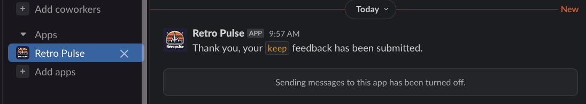

Welcome to the fourth installment of this multi-part series on building a Slack application with Rails. This series will guide you through the process of creating a Slack application with Rails and is structured as follows:

* [Part 1: Rails new, Slack, and OAuth](../rails-slack-app-part1-oauth)
* [Part 2: Slack Slash Command with Text Response](../rails-slack-app-part2-slash-command-with-text-response)
* [Part 3: Slack Slash Command with Modal Response](../rails-slack-app-part3-slash-command-with-modal-response)
* [Part 4: Slack Action Modal Submission] (=== YOU ARE HERE ===)
* [Part 5: Slack Slash Command with Block Kit Response](../rails-slack-app-part5-slash-block-kit-response)

Feel free to jump to a specific part of interest using the links above or follow along sequentially. You can also checkout the [source code on Github](https://github.com/danielabar/retro-pulse) for the application we'll be building.

This post assumes the reader has at least a beginner level familiarity with Ruby on Rails. It's also assumed the reader has used [Slack](https://slack.com/) as an end user with basic interactions such as joining channels, sending messages, and participating in conversations.

Part 1 of this series introduced [Retro Pulse](../rails-slack-app-part1-oauth#introducing-retro-pulse), a Slack app built with Rails for agile teams to manage their retrospectives entirely with Slack. [Part 2](../rails-slack-app-part2-slash-command-with-text-response) explained how to implement a Slack Slash command to open a retrospective and return a markdown text response to the same Slack channel that initiated the request. [Part 3]((../rails-slack-app-part3-slash-command-with-modal-response)) covered how to implement a slash command that responds with a modal form, allowing the user to enter feedback for the retrospective.

Now in Part 4, we will learn how to handle the modal submission, save the user's feedback in the database, and reply back with a DM to the user letting them know their input has been received. The interaction looks like this:

Recall in Part 3 we learned how to build this modal form in response ot the `/retro-feedback` slash command:


After submitting the form, the app responds with a direct message (DM) to the user confirming their feedback has been received:



## Comment Model

Before implementing the Slack portion of this, we need to ensure there's a place in the database to save the user's retrospective comments. In Part 2 of this series, we introduced the [Retrospective model](../rails-slack-ap-part2-slash-command-with-text-response#implement-slash-command), with `title` and `status` attributes:

```ruby
# == Schema Information
#
# Table name: retrospectives
#
#  id         :bigint           not null, primary key
#  status     :enum             default("open"), not null
#  title      :string           not null
#  created_at :datetime         not null
#  updated_at :datetime         not null
#
# Indexes
#
#  index_retrospectives_on_title  (title) UNIQUE
#
class Retrospective < ApplicationRecord
  enum status: {
    open: "open",
    closed: "closed"
  }
  # ...
end
```

To save the user's feedback, let's add a `Comment` model that `belongs_to` a `Retrospective`. It has a `text` column to store the content, some columns to store the Slack user information, and a `boolean` to indicate if this comment should be anonymous. Here is the migration:

```ruby
class CreateComments < ActiveRecord::Migration[7.0]
  def change
    create_table :comments do |t|
      t.text :content, null: false
      t.boolean :anonymous, null: false, default: false
      t.string :slack_user_id
      t.string :slack_username
      t.references :retrospective, null: false, foreign_key: true

      t.timestamps
    end
  end
end
```

We also need to know what kind of comment this is, i.e. whether this is something the team should *keep* on doing, *stop* doing, or *try* something new for next time. Let's add a `category` column to the `comments` table as a [Postgres enum](../rails-enum-mysql-postgres):

```ruby
class AddCategoryToComments < ActiveRecord::Migration[7.0]
  def up
    execute <<-SQL.squish
      CREATE TYPE comment_category AS ENUM ('keep', 'stop', 'try');
    SQL
    add_column :comments, :category, :comment_category, default: "keep", null: false
  end

  def down
    remove_column :comments, :category
    execute <<-SQL.squish
      DROP TYPE comment_category;
    SQL
  end
end
```

After running the migrations with `bin/rails db:migrate`, the resulting `Comment` model is:

```ruby
# == Schema Information
#
# Table name: comments
#
#  id               :bigint           not null, primary key
#  anonymous        :boolean          default(FALSE), not null
#  category         :enum             default("keep"), not null
#  content          :text             not null
#  slack_username   :string
#  slack_user_id    :string
#  created_at       :datetime         not null
#  updated_at       :datetime         not null
#  retrospective_id :bigint           not null
#
# Indexes
#
#  index_comments_on_retrospective_id  (retrospective_id)
#
# Foreign Keys
#
#  fk_rails_...  (retrospective_id => retrospectives.id)
#
class Comment < ApplicationRecord
  belongs_to :retrospective

  enum category: {
    keep: "keep",
    stop: "stop",
    try: "try"
  }
end
```

The retrospective model is also updated to indicate it `has_many` comments. The `dependent: :destroy` option is used because it ensures that when a `Retrospective` record is deleted, all associated `Comment` records belonging to that retrospective are also deleted. This prevents orphaned records by ensuring that comments tied to a specific retrospective are removed when the retrospective is no longer needed:

```ruby
# == Schema Information
#
# Table name: retrospectives
#
#  id         :bigint           not null, primary key
#  status     :enum             default("open"), not null
#  title      :string           not null
#  created_at :datetime         not null
#  updated_at :datetime         not null
#
# Indexes
#
#  index_retrospectives_on_title  (title) UNIQUE
#
class Retrospective < ApplicationRecord
  has_many :comments, dependent: :destroy
  # ...
end
```

## Anonymous Enforcement

There's one more thing to handle in the `Comment` model. The requirements of this app are that if the user selects the Anonymous checkbox when filling out the feedback form:


Then their Slack user id and name *should not* be persisted in the database. Otherwise if the feedback is not anonymous (i.e. user left the Anonymous checkbox unchecked), then their Slack user id and name *should* be persisted in the database.


To enforce this rule, a combination of `presence` and `absence` options can be passed to the ActiveRecord `validates` macro, together with conditional options:

```ruby
class Comment < ApplicationRecord
  validates :slack_user_id,
    absence: { message: "must be empty when anonymous is true" },
    if: :anonymous

  validates :slack_username,
    absence: { message: "must be empty when anonymous is true" },
    if: :anonymous

  validates :slack_user_id,
    presence: { message: "must be provided when anonymous is false" },
    unless: :anonymous

  validates :slack_username,
    presence: { message: "must be provided when anonymous is false" },
    unless: :anonymous

  # ...
end
```

However, the above validation rules will only be performed at the application level. Someone with direct database access (such as the support team) would still be able to insert invalid data. To ensure data integrity at the database level, we can also add a [CHECK CONSTRAINT](https://www.postgresql.org/docs/current/ddl-constraints.html#DDL-CONSTRAINTS-CHECK-CONSTRAINTS) to the table. This can be done with the Rails migration method `add_check_constraint`. Here is the migration:

```ruby
class AddCheckConstraintForSlackInfoInComments < ActiveRecord::Migration[7.0]
  def change
    # If a comment is anonymous, then the slack info fields should be null.
    # If a comment is not anonymous, then the slack info fields should be populated.
    add_check_constraint(
      :comments,
      "(anonymous AND slack_user_id IS NULL AND slack_username IS NULL)
      OR
      (NOT anonymous AND slack_user_id IS NOT NULL AND slack_username IS NOT NULL)",
      name: "check_slack_info_if_not_anonymous"
    )
  end
end
```

Now that the `Comment` model is implemented, we can move on to handling the Slack form submission.

## Configure Slack Interactivity

When the user clicks the Submit button on the modal form we generated, Slack will send an [interaction payload](https://api.slack.com/messaging/interactivity) to the `request_url` that is configured as part of the Interactivity Settings of the app. We haven't configured this yet so let's go ahead and do that now.

Navigate to [Your Apps](https://api.slack.com/apps/) in Slack, select the "Retro Pulse" application, then select "Interactivity & Shortcuts" from the Features section:


Enable the interactivity toggle:


Fill in your ngrok forwarding address in the Request URL field, and then `/api/slack/action`. This is the URL that Slack will POST a message to when the user submits the feedback modal. Recall we setup [ngrok in Part 1](../rails-slack-app-part1-oauth#ngrok) of this series:

TODO: URL should end with: `api/slack/action`


As soon as you enter a valid URL, it will be saved automatically.

## Receive Form Submission in Rails

Now that the Slack app has been configured to POST the form submission to the Rails app (via Ngrok), we need to write a handler to receive this payload. In Part 2 of this series, we learned how to use the slack-ruby-bot-server-events to setup a command handler to [receive a slash command](../rails-slack-app-part2-slash-command-with-text-response#receive-slash-command-in-rails). Now we'll do something similar, but for receiving the form submission. The slack-ruby-bot-server-events gem calls these "Actions".

Starting from the root of the project, create the following directories and files:

```bash
# The `bot` directory was created in Part 2 of this series
touch bot/actions.rb
mkdir bot/actions
touch bot/actions/view_submission.rb
```

You should have a directory structure that looks like this. Note that the `bot` directory is a sibling to the Rails `app` directory, and the `slash_commands` were created in Parts 2 and 3 of this series:

```
.
├── app
└── bot
    ├── actions
    │   └── view_submission.rb
    ├── actions.rb
    ├── slash_commands
    │   ├── retro_feedback.rb
    │   └── retro_open.rb
    └── slash_commands.rb
```

Add the following in `bot/actions.rb` to load all the actions, there's only one for now:

```ruby
# bot/actions.rb
require_relative "actions/view_submission"
```

Fill in the implementation for the `view_submission` action handler. For now, it will only log out the payload it received:

```ruby
# bot/actions/view_submission.rb
SlackRubyBotServer::Events.configure do |config|

  # Essentially this is saying to the SlackRubyBotServer,
  # If a "view_submission" interaction is received from Slack,
  # then execute this block.
  config.on :action, "view_submission" do |action|
    payload = action[:payload]
    action.logger.info "=== ACTION: payload = #{payload}"

    # Return `nil`, otherwise the slack-ruby-bot-server-events gem
    # replies to the channel with a message "true"
    nil
  end
end
```

Then update `config.ru` file in the root of the Rails app to load the action handlers in the `bot` directory. This will ensure the the Slack bot code is loaded when Rails starts:

```ruby
# This file is used by Rack-based servers to start the application.
require_relative "config/environment"

# This line was added in Part 2 of this series
require_relative "bot/slash_commands"

# === NEW: Load Slack action handlers ===
require_relative "bot/actions"

# We added this line previously in Part 1 of this series:
SlackRubyBotServer::App.instance.prepare!

run Rails.application
Rails.application.load_server
```

To see the action handler working, restart the Rails server `bin/dev`. Then in any Slack workspace that has the Retro Pulse app installed, enter the `/retro-feedback` slash command to launch the feedback modal. Fill it in by selecting any Category, enter some test text in the Comment, and check off the Anonymous option:


Then click the Submit button in Slack, and watch the Rails server output. It will show something like this:

```
Started POST "/api/slack/action" for 34.201.19.177 at 2024-02-06 07:10:16 -0500

INFO -- : === ACTION: payload = {"type"=>"view_submission", "team"=>{"id"=>"your-team-id", ...}
```

**What's going on:**

The above output from the Rails server shows that a POST to `/api/slack/action` is being processed. Recall when we configured Slack interactivity earlier, we told Slack to post payloads to this url. Slack is actually posting to the ngrok url, which forwards to the Rails server running on `localhost:3000`.

To view the "raw" request sent by Slack, open a browser at `http://127.0.0.1:4040`. This is the web interface exposed by ngrok which shows all HTTP requests and responses that were received by ngrok and responded to by the Rails app. For example, the form we just submitted was posted to ngrok as a url-encoded form with the following HTTP headers and body:

```
POST /api/slack/action HTTP/1.1
Host: 05f9-70-51-246-153.ngrok-free.app
User-Agent: Slackbot 1.0 (+https://api.slack.com/robots)
Content-Length: 4137
Accept: application/json,*/*
Accept-Encoding: gzip,deflate
Content-Type: application/x-www-form-urlencoded
X-Forwarded-For: 32.423.15.766
X-Forwarded-Host: 12e4-203-0-113-42.ngrok-free.app
X-Forwarded-Proto: https
X-Slack-Request-Timestamp: 1707220000
X-Slack-Signature: v0=88a...

payload=%7B%22type%22%3A%22view_submission%...
```

The `POST /api/slack/action` is handled by the routing provided by the [slack-ruby-bot-server-events](https://github.com/slack-ruby/slack-ruby-bot-server-events) gem, which takes care of a lot of the boilerplate including providing a controller to parse the raw url-encoded form body, and logic to verify the `X-Slack-Signature` HTTP header.

Then the `slack-ruby-bot-server-events` gem's controller for `/api/slack/action` parses out the specific action name, which it finds in the `type` section of the payload. From this example, the type is `view_submission`. The gem will then run all [callbacks that are registered for that action](https://github.com/slack-ruby/slack-ruby-bot-server-events?tab=readme-ov-file#implement-callbacks).

Since we added `config.on :action, "view_submission"` in `view_submission.rb`, this is how the `slack-ruby-bot-server-events` gem knows it should run our custom logic. The raw url-encoded form data received from Slack has been converted into a hash that's available as `action[:payload]`.

## Saving Feedback

Now that we have communication between Slack and the Rails app working to receive the form submission, we need to parse out the contents of the payload to save the user's retrospective feedback.

The payload contains all the field names and corresponding values submitted by the user for the custom modal we built in Part 3, along with additional information such as the Slack team, user, trigger ID, and API application ID. Here is a condensed version of the payload for the test we submitted earlier:

```ruby
{"type"=>"view_submission",
 "team"=>{"id"=>"T0-your-team-id", "domain"=>"your-slack-domain"},
 "user"=>{"id"=>"U0-your-slack-user-id", "username"=>"your.slack.user.name"},
 "api_app_id"=>"A0-your-slack-app-id",
 "token"=>"za...",
 "trigger_id"=>"659...",
 "view"=>
  {
   "type"=>"modal",
   "callback_id"=>"feedback_form",
   "blocks"=>[... ],
   "state"=>
    {"values"=>
      {"category_block"=>
        {"category_select"=>
          {"type"=>"static_select",
           "selected_option"=>
            {"text"=>{"type"=>"plain_text", "text"=>"Something we should keep doing"},
             "value"=>"keep"}}},
       "comment_block"=>
        {"comment_input"=>
          {"type"=>"plain_text_input", "value"=>"This is a test of the modal submission action handler in Rails"}},
       "anonymous_block"=>
        {"anonymous_checkbox"=>
          {"type"=>"checkboxes",
           "selected_options"=>[{"text"=>{"type"=>"plain_text", "text"=>"Yes"}, "value"=>"true"}]}}}},
   },
}
```

The payload indicates that it is of type `view_submission` and contains some information about the Slack `team` and `user`.

The `view` section contains a `blocks` section, which is a repetition of the blocks we defined earlier in Part 3 when creating the form, which follows the Slack Block Kit format. We can disregard this section.

The `view` section also contains a `state` section, which is the most important part of the payload. Here is where we find the actual values the user filled in the modal form. For example, the category option the user selected is available in `payload["view"]["state"]["values"]["category_block"]["category_select"]["selected_option"]["value"]`.

The attributes of the payload need to be parsed out for instantiating and saving a `Comment` model in the Rails app. I find it helpful to create a mapping table before writing the code, to be confident that all the data is available:

| Comment           | Slack Payload Attribute                                                                           |
| ----------------- | ------------------------------------------------------------------------------------------------- |
| category          | ["view"]["state"]["values"]["category_block"]["category_select"]["selected_option"]["value"]      |
| content           | ["view"]["state"]["values"]["comment_block"]["comment_input"]["value"]                            |
| slack_user_id     | ["user"]["id"]                                                                                    |
| slack_username    | ["user"]["username"]                                                                              |
| anonymous         | ["view"]["state"]["values"]["anonymous_block"]["anonymous_checkbox"]["selected_options"].present? |

To determine whether the user checked off the Anonymous option in the form, we have to check whether the `selected_options` of the checkbox portion of the payload exist. If yes, it means the user checked this option, otherwise, there will be no `selected_options` at all.

Now that we know how to parse the Slack payload to extract what's needed to build a Comment model, we can come back to the `view_submission` action handler, and implement the logic to create a new Comment:

```ruby
# bot/actions/view_submission.rb
SlackRubyBotServer::Events.configure do |config|
  config.on :action, "view_submission" do |action|
    payload = action[:payload]
    action.logger.info "=== ACTION: payload = #{payload}"

    anonymous = payload["view"]["state"]["values"]["anonymous_block"]["anonymous_checkbox"]["selected_options"].present?

    Comment.create!(
      retrospective: Retrospective.find_by(status: Retrospective.statuses[:open]),
      content: payload["view"]["state"]["values"]["comment_block"]["comment_input"]["value"],
      anonymous:,
      category: payload["view"]["state"]["values"]["category_block"]["category_select"]["selected_option"]["value"],
      slack_user_id: anonymous ? nil : payload["user"]["id"],
      slack_username: anonymous ? nil : payload["user"]["username"]
    )

    # Return `nil`, otherwise the slack-ruby-bot-server-events gem
    # replies to the channel with a message "true"
    nil
  end
end
```

After restarting the Rails server `bin/dev`, and submitting the form again from Slack `/retro-feedback`, you should see the following in the Rails server output, indicating that a new Comment has been saved with the payload values. I've added some annotations:

```
=== Log the action payload
INFO -- : === ACTION: payload = {"type"=>"view_submission", "team"=>{"id"=>"T0...}

=== Find the open retrospective to associate the new Comment with:
Retrospective Load (1.6ms)  SELECT "retrospectives".*
                            FROM "retrospectives"
                            WHERE "retrospectives"."status" = $1
                            ORDER BY "retrospectives"."id" ASC LIMIT $2
                            [["status", "open"], ["LIMIT", 1]]

== Insert a new Comment record in the database
== Since Anonymous checkbox was selected, slack info fields are nil
TRANSACTION (1.8ms)  BEGIN
  Comment Create (5.6ms)
    INSERT INTO "comments"
    ("content", "anonymous", "retrospective_id", "created_at", "updated_at", "category", "slack_user_id", "slack_username")
    VALUES ($1, $2, $3, $4, $5, $6, $7, $8)
    RETURNING "id"
    [
      ["content", "This is a test of the modal submission action handler in Rails"],
      ["anonymous", true],
      ["retrospective_id", 31],
      ["created_at", "2024-02-09 12:53:38.577358"],
      ["updated_at", "2024-02-09 12:53:38.577358"],
      ["category", "keep"],
      ["slack_user_id", nil],
      ["slack_username", nil]]
TRANSACTION (2.1ms)  COMMIT
```

## Refactor

While the current solution works, there are some problems with it:

1. There's no response from the Rails app to Slack, to let the user know that their feedback was received.
2. There's no error handling. For example, the Comment may fail to be saved due to validation rules.
3. Having all the business logic directly in the action handler makes it impossible to test.

## TODO

- WIP: refactor to interactor and slack form parser lib/module, save to new comment model instance
- fix `images/slack-app-interactivity-enter-url.png` to show `/api/slack/action`
- related
- feature image
- aside for more details on AR association dependent options
- ref: Slack server events gem handles interaction payloads with "Actions": https://github.com/slack-ruby/slack-ruby-bot-server-events?tab=readme-ov-file#actions
- aside: learned about applying db check constraints via Rails migrations in Rails Postgres perf book - link to it

```ruby
{"type"=>"view_submission",
 "team"=>{"id"=>"T0-your-team-id", "domain"=>"your-slack-domain"},
 "user"=>{"id"=>"U0-your-slack-user-id", "username"=>"your.slack.user.name", "name"=>"your.slack.user.name", "team_id"=>"T0-your-team-id"},
 "api_app_id"=>"A0-your-slack-app-id",
 "token"=>"za...",
 "trigger_id"=>"659...",
 "view"=>
  {"id"=>"V0-viw-id",
   "team_id"=>"T0-your-team-id",
   "type"=>"modal",
   "blocks"=>
    [{"type"=>"input",
      "block_id"=>"category_block",
      "label"=>{"type"=>"plain_text", "text"=>"Category", "emoji"=>true},
      "optional"=>false,
      "dispatch_action"=>false,
      "element"=>
       {"type"=>"static_select",
        "action_id"=>"category_select",
        "placeholder"=>{"type"=>"plain_text", "text"=>"Select category", "emoji"=>true},
        "options"=>
         [{"text"=>{"type"=>"plain_text", "text"=>"Something we should keep doing", "emoji"=>true}, "value"=>"keep"},
          {"text"=>{"type"=>"plain_text", "text"=>"Something we should stop doing", "emoji"=>true}, "value"=>"stop"},
          {"text"=>{"type"=>"plain_text", "text"=>"Something to try", "emoji"=>true}, "value"=>"try"}]}},
     {"type"=>"input",
      "block_id"=>"comment_block",
      "label"=>{"type"=>"plain_text", "text"=>"Comment", "emoji"=>true},
      "optional"=>false,
      "dispatch_action"=>false,
      "element"=>
       {"type"=>"plain_text_input",
        "action_id"=>"comment_input",
        "placeholder"=>{"type"=>"plain_text", "text"=>"Enter your feedback", "emoji"=>true},
        "multiline"=>true,
        "dispatch_action_config"=>{"trigger_actions_on"=>["on_enter_pressed"]}}},
     {"type"=>"input",
      "block_id"=>"anonymous_block",
      "label"=>{"type"=>"plain_text", "text"=>"Anonymous", "emoji"=>true},
      "optional"=>true,
      "dispatch_action"=>false,
      "element"=>
       {"type"=>"checkboxes",
        "action_id"=>"anonymous_checkbox",
        "options"=>[{"text"=>{"type"=>"plain_text", "text"=>"Yes", "emoji"=>true}, "value"=>"true"}]}}],
   "private_metadata"=>"",
   "callback_id"=>"feedback_form",
   "state"=>
    {"values"=>
      {"category_block"=>
        {"category_select"=>
          {"type"=>"static_select",
           "selected_option"=>
            {"text"=>{"type"=>"plain_text", "text"=>"Something we should keep doing", "emoji"=>true},
             "value"=>"keep"}}},
       "comment_block"=>
        {"comment_input"=>
          {"type"=>"plain_text_input", "value"=>"This is a test of the modal submission action handler in Rails"}},
       "anonymous_block"=>
        {"anonymous_checkbox"=>
          {"type"=>"checkboxes",
           "selected_options"=>[{"text"=>{"type"=>"plain_text", "text"=>"Yes", "emoji"=>true}, "value"=>"true"}]}}}},
   "hash"=>"1707...",
   "title"=>{"type"=>"plain_text", "text"=>"Retrospective Feedback", "emoji"=>true},
   "clear_on_close"=>false,
   "notify_on_close"=>false,
   "close"=>{"type"=>"plain_text", "text"=>"Cancel", "emoji"=>true},
   "submit"=>{"type"=>"plain_text", "text"=>"Submit", "emoji"=>true},
   "previous_view_id"=>nil,
   "root_view_id"=>"V0-some-root-view-id",
   "app_id"=>"A0-your-slack-app-id",
   "external_id"=>"",
   "app_installed_team_id"=>"T0-your-team-id",
   "bot_id"=>"B0-your-slack-bot-id"},
 "response_urls"=>[],
 "is_enterprise_install"=>false,
 "enterprise"=>nil}
```
