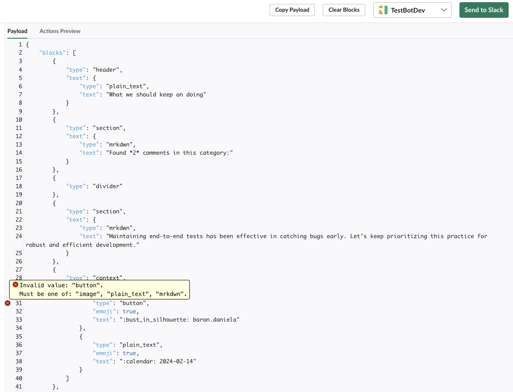

Welcome to the fifth installment of this multi-part series on building a Slack application with Rails. This series will guide you through the process of creating a Slack application with Rails and is structured as follows:

* [Part 1: Rails new, Slack, and OAuth](../rails-slack-app-part1-oauth)
* [Part 2: Slack Slash Command with Text Response](../rails-slack-app-part2-slash-command-with-text-response)
* [Part 3: Slack Slash Command with Modal Response](../rails-slack-app-part3-slash-command-with-modal-response)
* [Part 4: Slack Action Modal Submission](../rails-slack-app-part4-action-modal-submission)
* Part 5: Slack Slash Command with Block Kit Response  === YOU ARE HERE ===

Feel free to jump to a specific part of interest using the links above or follow along sequentially. You can also checkout the [source code on Github](https://github.com/danielabar/retro-pulse) for the application we'll be building.

This post assumes the reader has at least a beginner level familiarity with Ruby on Rails. It's also assumed the reader has used [Slack](https://slack.com/) as an end user with basic interactions such as joining channels, sending messages, and participating in conversations.

Part 1 of this series introduced [Retro Pulse](../rails-slack-app-part1-oauth#introducing-retro-pulse), a Slack app built with Rails for agile teams to manage their retrospectives with Slack. [Part 2](../rails-slack-app-part2-slash-command-with-text-response) explained how to implement a Slack slash command to open a retrospective and return a markdown text response to the same Slack channel that initiated the request. [Part 3](../rails-slack-app-part3-slash-command-with-modal-response) covered how to implement a slash command that responds with a modal form, allowing the user to enter feedback for the retrospective. In [Part 4](../rails-slack-app-part4-action-modal-submission), we learned how to handle the modal form submission to save the user's feedback in the database, and reply back with a direct message to let the user know their feedback was saved.

Now in Part 5, we'll be implementing the last part of the application, which is to display the feedback when the team is ready to have their retrospective meeting. The interaction looks like this:

Given that the team has started their retrospective meeting, someone who is screen sharing their Slack workspace enters the `/retro-discuss` slash command. This command accepts one argument to specify the category: keep, stop, or try:


Usually the meeting starts with a discussion of what the team should keep on doing, in this case, the slash command would be entered as `/retro-discuss keep`:


The app responds with all the comments that have been collected in that category. It also displays a header and a count of how many comments were entered. Below each comment section, it shows the date the comment was entered on and either the Slack username or "anonymous" if the person who entered this comment had selected to remain anonymous:


Finally, when the retrospective meeting is over, it can be closed with another slash command:


Which the app responds to with a confirmation message that the retrospective has been closed:


Closing the retrospective is a very similar interaction to opening a retrospective, that was already covered in [Part 2 of this series](../rails-slack-app-part2-slash-command-with-text-response), so it won't be covered here.

## Add Slash Command in Slack

The first thing we need to do to implement this interaction is to configure another slash command in the Retro Pulse app. Navigate to [Your Apps](https://api.slack.com/apps) on Slack, select the "Retro Pulse" app you created in [Part 1 of this series](../rails-slack-app-part1-oauth#create-slack-app), and then select "Slash Commands" from the Features section:


Then click on the "Create New Command" button, and fill in the form as follows:

**Command:** `/retro-discuss`. This is what the user will type into a Slack message to initiate an interaction with the Retro Pulse Rails app.

**Request URL:** For example: `https://12e4-203-0-113-42.ngrok-free.app/api/slack/command`. This is where Slack will send an HTTP POST request when the user submits this slash command from Slack. The hostname is your ngrok forwarding address that you got from starting [ngrok in Part 1 of this series](../rails-slack-app-part1-oauth#ngrok). The route `/api/slack/command` is defined in the [slack-ruby-bot-server](https://github.com/slack-ruby/slack-ruby-bot-server) gem that's included in the Retro Pulse Rails app.

**Short Description:** `Discuss retrospective feedback`. This will be displayed as the user types in the slash command.

**Usage Hint:** `keep stop try`. Since this particular slash command requires a parameter, which will be used to retrieve the comments for that category, the usage hint is also shown to the user as they type in the slash command.

**Escape Channels:** Leave this unchecked. Turning this on will modify the parameters sent with a command by a user such as wrapping URLs in angle brackets and translating channel or user mentions into their correlated IDs. It's not necessary for this app. See the Slack [documentation](https://api.slack.com/interactivity/slash-commands) if your app needs this option.

After filling out the slash command form, click the "Save" button which appears all the way at the bottom right hand corner.

## Receive Slash Command in Rails

In Part 2 of this series, we learned how to add a [handler to receive slash commands](../rails-slack-app-part2-slash-command-with-text-response#receive-slash-command-in-rails) using the [slack-ruby-bot-server-events](https://github.com/slack-ruby/slack-ruby-bot-server-events) gem. Let's add another one to handle the `/retro-discuss` command.

Create a new file in the `bot/slash_commands` directory that will get triggered whenever a user submits the `/retro-discuss` command. The `command` object exposed by the `slack-ruby-bot-server-events` gem contains many of the request parameters sent by Slack including the `team_id`, `channel_id`, and `text` that user entered.

This first attempt retrieves the comments by category for the open retrospective, concatenates their `content` attributes, and sends back a simple text response to the channel:

```ruby
# bot/slash_commands/retro_discuss.rb
SlackRubyBotServer::Events.configure do |config|
  # Essentially this is saying to the SlackRubyBotServer,
  # If a "/retro-discuss" slash command is received from Slack,
  # then execute this block.
  config.on :command, "/retro-discuss" do |command|
    # Use `command[:team_id]` from request parameters sent to us
    # by Slack to find the Team model persisted in the database
    team = Team.find_by(team_id: command[:team_id])

    # This is the Slack channel we need to respond back to
    channel_id = command[:channel_id]

    # If user entered /retro-discuss keep
    # in Slack, then command_text will be: keep
    command_text = command[:text]
    command.logger.info "=== COMMAND: retro-discuss, Team: #{team.name}, Channel: #{channel_id}, Text: #{command_text}"

    # Instantiate a slack client with the team token
    # so we can communicate back to the channel
    slack_client = Slack::Web::Client.new(token: team.token)

    # Find the one and only open Retrospective
    retrospective = Retrospective.find_by(status: Retrospective.statuses[:open])

    # Retrieve the comments for the open Retrospective, for this category
    category = command_text
    comments = retrospective.comments.where(category: category)

    # Concatenate all the comments.content into a single comma separated text
    comments_text = comments.map(&:content).join(", ")

    # Reply to the channel with all the comments text
    slack_client.chat_postMessage(
      channel: channel_id,
      text: comments_text
    )

    # Return `nil`, otherwise the slack-ruby-bot-server-events gem
    # replies to the channel with a message "true"
    nil
  end
end
```

The `Comment` model was introduced in Part 4 of this series, [have a quick read there](../rails-slack-app-part4-action-modal-submission#comment-model) if you need a refresher of what it looks like. The `Retrospective` model was introduced in [Part 2](../rails-slack-app-part2-slash-command-with-text-response#implement-slash-command).

Use `require_relative` to load this new command in the `bot/slash_commands.rb` file. We [created this file in Part 2](../rails-slack-app-part2-slash-command-with-text-response#receive-slash-command-in-rails) when introducing slash commands:

```ruby
# bot/slash_commands.rb

# This line was added in Part 2 of this series
require_relative "slash_commands/retro_open"

# This line was added in Part 3 of this series
require_relative "slash_commands/retro_feedback"

# === NEW ===
require_relative "slash_commands/retro_discuss"
```

This file is loaded by `config.ru` to ensure that all the Slack handlers are loaded when Rails starts.

After restarting the Rails server `bin/dev`, and entering `/retro-discuss keep` in a Slack workspace that has the Retro Pulse app installed, it will respond with something like this. In the example below, there are two comments, each having several sentences, separated by a comma:


Technically this works, but it's difficult to determine where one comment ends and the next begins. We'd also like to see who posted it and when. The next section covers how to make the response more visually appealing.

## Using Block Kit to Format the Response

Part 3 of this series [introduced Slack's Block Kit](../rails-slack-app-part3-slash-command-with-modal-response#respond-with-example-modal) for building the interactive modal to collect user feedback. Block Kit can also be used to compose a message that is sent via Slack's [chat_postMessage](https://api.slack.com/methods/chat.postMessage) API.

We've already been using the `chat_postMessage` API throughout this series to send simple messages. For example, in Part 2 it was used to reply to the channel that a retrospective had been created:

```ruby
slack_client = Slack::Web::Client.new(token: team.token)
slack_client.chat_postMessage(
  channel: channel_id,
  mrkdwn: true,
  text: ":memo: Opened retro `#{retrospective.title}`"
)
```

Which looks like this:


Instead of `text`, the `chat_postMessage` API can accept a `blocks` attribute, which is a JSON array. Each element in the array must be a valid [block](https://api.slack.com/reference/block-kit/blocks). If all this sounds a little abstract, an example should help to clear things up.

### Section and Divider

In the version of `bot/slash_commands/retro_discuss.rb` shown below, the `text: comments_text` has been removed and instead an array of blocks is built. For each comment, there a `section` block is created for rendering the content of the comment, followed by a `divider` block to visually distinguish one comment from the other:

```ruby
# bot/slash_commands/retro_discuss.rb
SlackRubyBotServer::Events.configure do |config|
  # ...

  # Retrieve the comments for the open Retrospective, for this category
  category = command_text
  comments = retrospective.comments.where(category: category)

  # Initialize an array of comment blocks
  comments_blocks = []

  # Add the comment content
  comments.each do |comment|
    comments_blocks << {
      type: "section",
      text: {
        type: "mrkdwn",
        text: comment.content
      }
    }
    # Add a divider after each comment
    comments_blocks << { type: "divider" }
  end

  # Send `blocks` instead of `text`
  slack_client.chat_postMessage(
    channel: channel_id,
    blocks: comments_blocks
  )
end
```

Notice that each block must have a `type` attribute. See the Slack documentation on [Reference Blocks](https://api.slack.com/reference/block-kit/blocks) for the full list of block types and how to use them.

Restarting the Rails server `bin/dev` and entering `/retro-discuss keep` again in the Slack workspace will result in this response:


This time the response is easier to read because each comment is rendered in its own `section` block, which is similar to a `<div>` in HTML, and followed by a `divider` block, which is similar to an `<hr>` element in HTML.

### Contextual Information

We'd also like to see the user that posted the comment and when it was posted. Since this information is not as visually important as the content of the comment itself, it can go in a [context](https://api.slack.com/reference/block-kit/blocks#context) block, which is used to display contextual information.

The `context` block functions as a "parent" block. It accepts a list of "children" `elements`, each of which must be a valid block. So we'll have one element to show the user information, and another element to show the date. The `emoji: true` attribute is set on the elements so we can render emoji's as well. This helps with the visual cues to indicate what kind of information this is.

Here is the updated version of the code that adds contextual information about each comment. Note the check for "anonymous" comment when rendering the user name. For the posted date, the comment model's `created_at` timestamp is formatted to display in `YYYY-MM-DD` format:

```ruby
# bot/slash_commands/retro_discuss.rb
SlackRubyBotServer::Events.configure do |config|
  # ...

  # Retrieve the comments for the open Retrospective, for this category
  category = command_text
  comments = retrospective.comments.where(category: category)

  # Initialize an array of comment blocks
  comments_blocks = []

  comments.each do |comment|
  # Add the comment content
    comments_blocks << {
      type: "section",
      text: {
        type: "mrkdwn",
        text: comment.content
      }
    }
    # Add the user and date as contextual info
    comments_blocks << {
      type: "context",
      elements: [
        {
          type: "plain_text",
          emoji: true,
          text: ":bust_in_silhouette: #{comment.anonymous ? 'anonymous' : comment.slack_username}"
        },
        {
          type: "plain_text",
          emoji: true,
          text: ":calendar: #{comment.created_at.strftime('%Y-%m-%d')}"
        }
      ]
    }
    # Add a divider after each comment
    comments_blocks << { type: "divider" }
  end

  slack_client.chat_postMessage(
    channel: channel_id,
    blocks: comments_blocks
  )
end
```

The above code results in the following response to the `/retro-discuss keep` slash command:


This is looking much better.

### Header

The last thing to add is a header showing the category of the feedback, and a smaller sub-section just below the header to display how many comments were found for that category. The category is defined as an enum in the `Comment` model. Rather than just displaying the word "keep" or "stop", a `header` method can be added to convert it to an phrase for display as follows:

```ruby
# app/models/comment.rb
class Comment < ApplicationRecord
  belongs_to :retrospective

  enum category: {
    keep: "keep",
    stop: "stop",
    try: "try"
  }

  # === NEW: Convert category enum to phrase
  def self.header(category)
    case category.to_sym
    when :keep
      "What we should keep on doing"
    when :stop
      "What we should stop doing"
    when :try
      "Something to try for next time"
    else
      "Unknown category"
    end
  end
end
```

Now the `Comment.header()` method can be used in building the header in the `/retro_discuss` handler as follows:

```ruby
# bot/slash_commands/retro_discuss.rb
SlackRubyBotServer::Events.configure do |config|
  # ...

  # Retrieve the comments for the open Retrospective, for this category
  category = command_text
  comments = retrospective.comments.where(category: category)

  # Initialize an array of comment blocks
  comments_blocks = []

  # Add the header block
  comments_blocks << {
    type: "header",
    text: {
      type: "plain_text",
      text: Comment.header(category)
    }
  }

  # Add a sub-header as a section
  # Use markdown to bold the number of comments
  comments_blocks << {
    type: "section",
    text: {
      type: "mrkdwn",
      text: "Found *#{comments.size}* comments in this category:"
    }
  }

  # Add a divider to separate the sub-header from the comments
  comments_blocks << { type: "divider" }

  comments.each do |comment|
    # comment content...
  end

  slack_client.chat_postMessage(
    channel: channel_id,
    blocks: comments_blocks
  )
end
```

Note that the `text` attribute of the `section` type can set to `mrkdwn`. In this case the `comments.size` value is wrapped in `*` so that it renders as bold in the Slack response.

Putting this all together, the app responds with a fully formatted list of comments as shown below:


## Refactor

While the current version of the code in the `/retro-discuss` handler works, there are several issues:

* It's too long, triggering the Rubocop `Metrics/BlockLength` rule.
* The verbose syntax of the Slack blocks mixed in with the business logic makes it difficult to understand what this code is actually doing.
* There's no validation - for example, what if the user types in `/retro-discuss foo` or doesn't provide a category at all? In this case the app should reply with a helpful message letting the user know to provide a valid category.

This will be resolved in a similar way to what was done in Part 2 of this series, which is to [introduce an interactor](../rails-slack-app-part2-slash-command-with-text-response#openretrospective-interactor) `DiscussRetrospective` to handle the validation and business logic. We'll also introduce a `SlackCommentBuilder` module for the responsibility of building the Slack blocks array.

Starting with the `SlackCommentBuilder` module. This contains smaller methods to build each type of block and some methods to put them all together:

```ruby
# lib/slack_comment_builder.rb
module SlackCommentBuilder
  module_function

  def build_header_block(comments, category_display)
    [
      build_header(category_display),
      build_section("Found *#{comments.size}* comments in this category:"),
      build_divider
    ]
  end

  def build_comment_blocks(comments)
    comments.flat_map do |comment|
      [
        build_comment_content(comment),
        build_comment_context(comment),
        build_divider
      ]
    end
  end

  def build_header(category_display)
    {
      type: "header",
      text: {
        type: "plain_text",
        text: category_display
      }
    }
  end

  def build_section(text)
    {
      type: "section",
      text: {
        type: "mrkdwn",
        text:
      }
    }
  end

  def build_comment_content(comment)
    build_section(comment.content)
  end

  def build_comment_context(comment)
    {
      type: "context",
      elements: [
        build_context_element(":bust_in_silhouette: #{comment.user_info}"),
        build_context_element(":calendar: #{comment.created_at.strftime('%Y-%m-%d')}")
      ]
    }
  end

  def build_context_element(text)
    {
      type: "plain_text",
      emoji: true,
      text:
    }
  end

  def build_divider
    { type: "divider" }
  end
end
```

And here is the `DiscussRetrospective` interactor:

```ruby
class DiscussRetrospective
  include Interactor
  include SlackCommentBuilder

  def call
    retrospective = Retrospective.find_by(status: Retrospective.statuses[:open])
    return no_open_retrospective_message if retrospective.nil?

    category = extract_valid_category
    return invalid_category_message unless category

    comments = retrospective.comments_by_category(category: context.category)
    post_message(comments)
  rescue StandardError => e
    log_error(e)
    context.fail!
  end

  private

  def no_open_retrospective_message
    message = "There is no open retrospective. Please run `/retro-open` to open one."
    send_error_message(message)
  end

  def extract_valid_category
    category = context.category&.to_sym
    return category if Comment.categories.key?(category)

    nil
  end

  def invalid_category_message
    valid_categories = Comment.categories.keys.map(&:to_s).join(", ")
    message = "Invalid discussion category. Please provide a valid category (#{valid_categories})."
    send_error_message(message)
  end

  def post_message(comments)
    blocks = build_header_block(comments, Comment.header(context.category))
    blocks += build_comment_blocks(comments)
    send_message(blocks)
  end

  def send_message(blocks)
    context.slack_client.chat_postMessage(
      channel: context.channel_id,
      text: "fallback TBD",
      blocks:
    )
  end

  def send_error_message(text)
    warning_icon = ":warning:"
    context.slack_client.chat_postMessage(
      channel: context.channel_id,
      text: "#{warning_icon} #{text}"
    )
  end

  def log_error(error)
    error_message = "Error in DiscussRetrospective: #{error.message}"
    backtrace = error.backtrace.join("\n")
    Rails.logger.error("#{error_message}\n#{backtrace}")
  end
end
```

**What's going on:**

* The inputs `category`, `channel_id`, and `slack_client` are provided via the [context](https://github.com/collectiveidea/interactor?tab=readme-ov-file#context) object, which contains everything the interactor needs to do its work.
* Validation is performed on `category`, if its `nil` or an unknown category, an error message is sent back to the channel.
* Given that `category` is valid, the comments for this category are retrieved from the open `Retrospective`
* The `comments` are then passed to the methods of `SlackCommentBuilder` to build the blocks array.
* The resulting `blocks` are sent back to the channel.

Finally, the `/retro-discuss` handler is updated, removing all the previous business logic, and instead it delegates to the `DiscussRetrospective` interactor, passing it the inputs it needs:

```ruby
# bot/slash_commands/retro_discuss.rb
SlackRubyBotServer::Events.configure do |config|
  # Essentially this is saying to the SlackRubyBotServer,
  # If a "/retro-discuss" slash command is received from Slack,
  # then execute this block.
  config.on :command, "/retro-discuss" do |command|
    # Use `command[:team_id]` from request parameters sent to us
    # by Slack to find the Team model persisted in the database
    team = Team.find_by(team_id: command[:team_id])

    # Instantiate a slack client with the team token
    # so we can communicate back to the channel
    slack_client = Slack::Web::Client.new(token: team.token)

    # This is the Slack channel we need to respond back to
    channel_id = command[:channel_id]

    # If user entered /retro-discuss keep
    # in Slack, then command_text will be: keep
    command_text = command[:text]
    command.logger.info "=== COMMAND: retro-discuss, Team: #{team.name}, Channel: #{channel_id}, Text: #{command_text}"

    # Delegate to the interactor passing in `command_text` as the category, and channel_id and slack_client
    DiscussRetrospective.call(category: command_text, channel_id:, slack_client:)

    # Return `nil`, otherwise the slack-ruby-bot-server-events gem
    # replies to the channel with a message "true"
    nil
  end
end
```

At this point, we have a functioning Slack application built with Rails. There's just a few more topics to cover before wrapping up.

## Debugging Blocks

A common issue that can occur when working with the block kit UI is that you accidentally put together the blocks in an invalid way or specify some attribute value that's not allowed. For example, suppose in `SlackCommentBuilder` module, we had specified a `type: "button"` instead of `type: "plain_text"` for the context element:

```ruby
# lib/slack_comment_builder.rb
module SlackCommentBuilder
  def build_context_element(text)
    {
      # type: "plain_text",
      type: "button",
      emoji: true,
      text:
    }
  end
end
```

In this case, when the message is sent to Slack using the `slack_client`:

```ruby
# app/interactors/discuss_retrospective.rb
class DiscussRetrospective
  # ...
  def send_message(blocks)
    context.slack_client.chat_postMessage(
      channel: "some_channel_id",
      text: "some_fallback_text",
      blocks: blocks # Invalid due to bug in SlackCommentBuilder
    )
  end
end
```

Slack will return an `invalid blocks` error. When working with the [slack-ruby-bot-server-events](https://github.com/slack-ruby/slack-ruby-bot-server-events) gem, it uses the [slack-ruby-client](https://github.com/slack-ruby/slack-ruby-client) gem, which in turn uses [faraday](https://github.com/lostisland/faraday) to communicate with the Slack API via HTTP. Here's what this error looks like in the Rails server output:

```
Error in DiscussRetrospective: invalid_blocks
slack-ruby-client-2.2.0/lib/slack/web/faraday/response/raise_error.rb:19:in `on_complete'
faraday-2.7.11/lib/faraday/middleware.rb:18:in `block in call'
...
retro-pulse/app/interactors/discuss_retrospective.rb:54:in `post_message'
retro-pulse/app/interactors/discuss_retrospective.rb:25:in `call'
```

Unfortunately, the error doesn't include specify *what* is wrong with the blocks. To resolve these kinds of errors, add a debug statement that outputs the json value of the blocks, just before the blocks get sent to Slack:

```ruby
# app/interactors/discuss_retrospective.rb
class DiscussRetrospective
  def send_message(blocks)
    Rails.logger.debug { "=== BLOCKS: #{blocks.to_json}" }

    context.slack_client.chat_postMessage(
      channel: "some_channel_id",
      text: "some_fallback_text",
      blocks: blocks
    )
  end
end
```

When this code runs, the Rails server output will include a debug line like this:

```
=== BLOCKS: [{"type":"header","text":{"type":"plain_text","text":"What we should keep on doing"}}...]
```

Highlight and copy the entire blocks array from the Rails server output: `[...]`.

Then open a browser tab to Slack's [Block Kit Builder](https://api.slack.com/tools/block-kit-builder). You need to be signed in to a Slack workspace to use this feature.
This renders a split screen view where on the right hand side you can enter any blocks JSON, and on the left hand side it will show you the rendered result. If invalid blocks JSON is entered, then Slack will show a red X mark beside the invalid line. Hovering over it will display what's wrong with this line.

For example, pasting in the blocks JSON from the buggy version of our code and hovering over the red X shows that `button` is in invalid type for the `context` block. The message helpfully lists the valid values which are: `"image", "plain_text", "mrkdwn"`:



## App Manifest

Throughout this series, we've been using Slack's web UI to build up the application. This has involved opening a browser tab to [Your Slack Apps](https://api.slack.com/apps) (need to be signed in to Slack workspace), then using the Settings and Features sections to tell Slack what this app supports. For example, to enable receiving a modal form submission in Part 4, we had to enable interactivity by filling out the URL that Slack should POST to:


That URL is an [ngrok](../rails-slack-app-part1-oauth#ngrok) address that's forwarding requests from Slack to the Rails app running on localhost. We setup ngrok in Part 1 of this series. An issue to be aware of with the free ngrok version is that every time you restart it, it assigns a new url. That means going back into the Slack app configuration and updating all url's such as the OAuth redirect, interactivity, and slash commands sections. This is tedious and error prone.

To save yourself this manual effort, there is an easier way. Under the Features section of your Slack app, select "App Manifest". This provides a text representation of the Slack app in either YAML or JSON format. Click on the JSON format, it will look something like this:


Notice all the url's and Slack client id are in this file.

Make a copy of the JSON contents, and paste it into a new file in the Rails project root named `app_manifest_template.json`. Update this file, making the following replacements:

1. Update all occurrences of the ngrok IP address with `SERVER_HOST_NAME`
2. Update all occurrences of your slack client id with `SLACK_CLIENT_ID`

Here's an example of [app_manifest_template.json](https://github.com/danielabar/retro-pulse/blob/main/app_manifest_template.json) from the complete source of the Retro Pulse application on Github.

`SERVER_HOST_NAME` and `SLACK_CLIENT_ID` were configured as environment variables in [Part 1](../rails-slack-app-part1-oauth#rails-blocked-host) of this series.
Add the following rake task to generate the real manifest file from the template, replacing the environment variables with their actual values from the `.env` file:

```ruby
# lib/tasks/app_manifest.rake
namespace :manifest do
  desc 'Generate and update app_manifest.json from app_manifest_template.json'
  task generate: :environment do
    require 'json'
    require 'dotenv'

    # Load environment variables from .env file in the project root directory
    Dotenv.load(File.join(Rails.root, '.env'))

    # Read the template JSON file from the project root
    template_file = File.read(File.join(Rails.root, 'app_manifest_template.json'))

    # Perform global replacements for SERVER_HOST_NAME and SLACK_CLIENT_ID
    updated_content = template_file
      .gsub('SERVER_HOST_NAME', ENV['SERVER_HOST_NAME'])
      .gsub('SLACK_CLIENT_ID', ENV['SLACK_CLIENT_ID'])

    # Write the updated JSON to app_manifest.json in the project root
    File.open(File.join(Rails.root, 'app_manifest.json'), 'w') do |file|
      file.write(updated_content)
    end

    puts 'app_manifest.json has been generated and updated.'
  end
end
```

This will generate the real manifest file `app_manifest.json`. Make sure this is in `.gitignore` as it's a generated file and contains a secret.

Now, every time you restart ngrok, you'll do the following:

1. Update the new ngrok IP address in `.env`
2. Run the rake task: `bundle exec rake manifest:generate`
3. Copy the contents of `app_manifest.json` into the [Your Slack App](https://api.slack.com/apps) Features: Manifest section, and save the changes.

Then you can restart the Rails server with `bin/dev` and it will receive requests from Slack via the new ngrok forwarding address.

## Deployment

A full discussion of how to deploy Rails apps to production is out of scope for this post. But here's a few things to note for this app.

Up until now, the Rails app has been running on a laptop, with ngrok forwarding traffic from Slack to `localhost`. For production use, you'll need to deploy your Rails application to a publicly accessible host, eg: `https://yourcompany-retropulse.com`. Then update all the url's in the Slack app to point to where the Rails app is running. You'll also need to make sure all the Slack environment variables (`SLACK_CLIENT_ID`, `SLACK_CLIENT_SECRET`, `SLACK_SIGNING_SECRET`, and `SLACK_VERIFICATION_TOKEN`) are populated in production.

By default, the Slack app is *not* available for public distribution. The Retro Pulse app described in this series is intended for just one team so this is fine, essentially it would only be installed in your workspace, which is the same one you've been developing it under.

However, if you have a different kind of application and want to distribute it more widely, it requires activating public distribution. To do this, select the "Manage Distribution" option under Settings when logged into [Your Slack App](https://api.slack.com/apps):


Then Make sure all the required steps are checked off as shown below, then click on Activate Public Distribution (only if you want *any* company/team/workspace to be able to install the app):


## Conclusion

Congratulations on making it to the end of this series on building a Slack application with Rails! I hope you've found it helpful. Throughout this series, we've covered many aspects of Slack integration, from OAuth authentication to implementing slash commands and interactive modals using Block Kit. In this final installment, we explored how to display feedback collected during retrospective meetings, bringing our app to completion.

For further exploration and reference, here are some useful links and resources:

- [Retro Pulse GitHub Repository](https://github.com/danielabar/retro-pulse)
- [Slack Ruby Client Gem](https://github.com/slack-ruby/slack-ruby-client)
- [Slack Ruby Bot Server Gem](https://github.com/slack-ruby/slack-ruby-bot-server)
- [Slack Ruby Bot Server Events Gem](https://github.com/slack-ruby/slack-ruby-bot-server-events)
- [Slack OAuth Documentation](https://api.slack.com/authentication/oauth-v2)
- [ngrok - Secure Tunnels to Localhost](https://ngrok.com/)
- [Your Slack Apps](https://api.slack.com/apps) (requires login)
- [Interactor Gem](https://github.com/collectiveidea/interactor)
- [Slack Modals Documentation](https://api.slack.com/surfaces/modals)
- [Slack Block Kit Documentation](https://api.slack.com/reference/block-kit/blocks)
- [Slack Interactivity Documentation](https://api.slack.com/messaging/interactivity)
- [Slack API Methods](https://api.slack.com/methods)
