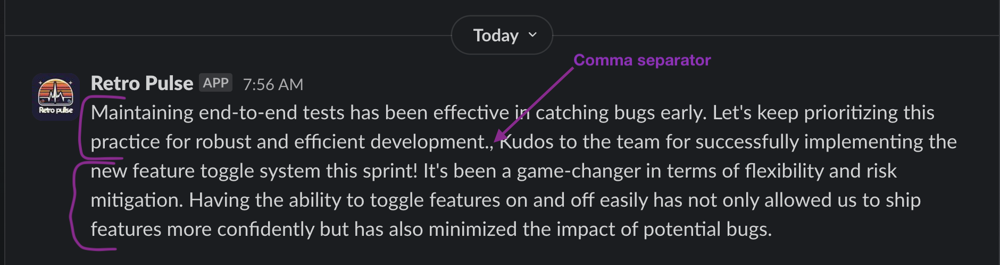

Welcome to the fifth installment of this multi-part series on building a Slack application with Rails. This series will guide you through the process of creating a Slack application with Rails and is structured as follows:

* [Part 1: Rails new, Slack, and OAuth](../rails-slack-app-part1-oauth)
* [Part 2: Slack Slash Command with Text Response](../rails-slack-app-part2-slash-command-with-text-response)
* [Part 3: Slack Slash Command with Modal Response](../rails-slack-app-part3-slash-command-with-modal-response)
* [Part 4: Slack Action Modal Submission](../rails-slack-app-part4-action-modal-submission)
* Part 5: Slack Slash Command with Block Kit Response  === YOU ARE HERE ===

Feel free to jump to a specific part of interest using the links above or follow along sequentially. You can also checkout the [source code on Github](https://github.com/danielabar/retro-pulse) for the application we'll be building.

This post assumes the reader has at least a beginner level familiarity with Ruby on Rails. It's also assumed the reader has used [Slack](https://slack.com/) as an end user with basic interactions such as joining channels, sending messages, and participating in conversations.

Part 1 of this series introduced [Retro Pulse](../rails-slack-app-part1-oauth#introducing-retro-pulse), a Slack app built with Rails for agile teams to manage their retrospectives with Slack. [Part 2](../rails-slack-app-part2-slash-command-with-text-response) explained how to implement a Slack slash command to open a retrospective and return a markdown text response to the same Slack channel that initiated the request. [Part 3]((../rails-slack-app-part3-slash-command-with-modal-response)) covered how to implement a slash command that responds with a modal form, allowing the user to enter feedback for the retrospective. In [Part 4](../rails-slack-app-part4-action-modal-submission), we learned how to handle the modal form submission to save the user's feedback in the database, and reply back with a DM to let the user know their feedback was saved.

Now in Part 5, we'll be implementing the last part of the application, which is to display the feedback when the team is ready to have their retrospective meeting. The interaction looks like this:

Given that the team has started their retrospective meeting, someone who is screen sharing their Slack workspace enters the `/retro-discuss` slash command. This command accepts one argument to specify the category: keep, stop, or try:


Usually the meeting starts with a discussion of what the team should keep on doing, in this case, the slash command would be entered as `/retro-discuss keep`:


The app responds with all the comments that have been collected in that category. Here we can also see a header and a count of how many comments were entered. Below each comment section, it shows the date the comment was entered on and either the Slack username or "anonymous" if the person who entered this comment had selected the Anonymous option:


Finally, when the retrospective meeting is over, it can be closed with another slash command:


Which the app responds to with a confirmation message that the retrospective has been closed:


Closing the retrospective is a very similar interaction to opening a retrospective, that was already covered in [Part 2 of this series](../rails-slack-app-part2-slash-command-with-text-response), so it won't be covered here.

## Add Slash Command in Slack

The first thing we need to do to implement this interaction is to configure another slash command in the Retro Pulse app. Navigate to [Your Apps](https://api.slack.com/apps) on Slack, select the "Retro Pulse" app you created in [Part 1 of this series](../rails-slack-app-part1-oauth#create-slack-app), and then select "Slash Commands" from the Features section:


Then click on the "Create New Command" button, and fill in the form as follows:

**Command:** `/retro-discuss`. This is what the user will type into a Slack message to initiate an interaction with the Retro Pulse Rails app.

**Request URL:** For example: `https://12e4-203-0-113-42.ngrok-free.app/api/slack/command`. This is where Slack will send an HTTP POST request when the user submits this slash command from Slack. The hostname is your ngrok forwarding address that you got from starting [ngrok in part 1 of this series](../rails-slack-app-part1-oauth#ngrok). The route `/api/slack/command` is defined in the `slack-ruby-bot-server` gem that we included as part of our [Rails app in part 1 of this series](../rails-slack-app-part1-oauth#create-rails-app).

**Short Description:** `Discuss retrospective feedback`. This will be displayed as the user types in the slash command.

**Usage Hint:** `keep stop try`. Since this particular slash command requires a parameter, which will be used to retrieve the comments for that category, the usage hint is also shown to the user as they type in the slash command.

**Escape Channels:** Leave this unchecked. Turning this on will modify the parameters sent with a command by a user such as wrapping URLs in angle brackets and translating channel or user mentions into their correlated IDs. It's not necessary for this app. See the [Slack docs](https://api.slack.com/interactivity/slash-commands) if your app needs this option.

After filling out the slash command form, click the "Save" button which appears all the way at the bottom right hand corner.

## Receive Slash Command in Rails

In Part 2 of this series, we learned how to add a [handler to receive slash commands](../rails-slack-app-part2-slash-command-with-text-response#receive-slash-command-in-rails) using the [slack-ruby-bot-server-events](https://github.com/slack-ruby/slack-ruby-bot-server-events) gem. Let's add another one to handle the `/retro-discuss` command.

Create a new file in the `bot/slash_commands` directory that will get triggered whenever a user submits the `/retro-discuss` command. The `command` object exposed by the `slack-ruby-bot-server-events` gem contains many of the request parameters sent by Slack including the `team_id`, `channel_id`, and `text` that user entered.

This first attempt retrieves the comments by category for the open retrospective, concatenates their `content` attributes, and sends back a simple text response to the channel:

```ruby
# bot/slash_commands/retro_discuss.rb
SlackRubyBotServer::Events.configure do |config|
  # Essentially this is saying to the SlackRubyBotServer,
  # If a "/retro-discuss" slash command is received from Slack,
  # then execute this block.
  config.on :command, "/retro-discuss" do |command|
    # Use `command[:team_id]` from request parameters sent to us
    # by Slack to find the Team model persisted in the database
    team = Team.find_by(team_id: command[:team_id])

    # This is the Slack channel we need to respond back to
    channel_id = command[:channel_id]

    # If user entered /retro-discuss keep
    # in Slack, then command_text will be: keep
    command_text = command[:text]
    command.logger.info "=== COMMAND: retro-discuss, Team: #{team.name}, Channel: #{channel_id}, Text: #{command_text}"

    # Instantiate a slack client with the team token
    # so we can communicate back to the channel
    slack_client = Slack::Web::Client.new(token: team.token)

    # Find the one and only open Retrospective
    retrospective = Retrospective.find_by(status: Retrospective.statuses[:open])

    # Retrieve the comments for the open Retrospective, for this category
    comments = retrospective.comments.where(category: command_text)

    # Concatenate all the comments.content into a single comma separated text
    comments_text = comments.map(&:content).join(", ")

    # Reply to the channel with all the comments text
    slack_client.chat_postMessage(
      channel: channel_id,
      text: comments_text
    )

    # Return `nil`, otherwise the slack-ruby-bot-server-events gem
    # replies to the channel with a message "true"
    nil
  end
end
```

The `Comment` model was introduced in Part 4 of this series, [have a quick read there](../rails-slack-app-part4-action-modal-submission#comment-model) if you need a refresher of what it looks like.

Use `require_relative` to load this new command in the `bot/slash_commands.rb` file. We created this file in Part 2 when introducing slash commands:

```ruby
# bot/slash_commands.rb

# This line was added in Part 2 of this series
require_relative "slash_commands/retro_open"

# This line was added in Part 3 of this series
require_relative "slash_commands/retro_feedback"

# === NEW ===
require_relative "slash_commands/retro_discuss"
```

This file is loaded by `config.ru` to ensure that all the Slack handlers are loaded when Rails starts.

After restarting the Rails server `bin/dev`, and entering `/retro-discuss keep` in a Slack workspace that has the Retro Pulse app installed, it will respond with something like this. In the example below, there are two comments, each having several sentences:



Technically this works, but the visuals are not very good. Returning the response in plain text makes it difficult to distinguish one comment from another. We'd also like to see who posted it and when. The next section covers how to make the response more visually appealing.

## Using Block Kit to Format the Response

Part 3 of this series [introduced Slack's Block Kit](../rails-slack-app-part3-slash-command-with-modal-response#respond-with-example-modal) for building the interactive modal to collect user feedback. Block Kit can also be used to compose a message that is sent via Slack's [chat_postMessage](https://api.slack.com/methods/chat.postMessage) API.

We've already been using the `chat_postMessage` API throughout this series to send simple messages. For example, in Part 2 it was used to reply to the channel that a retrospective had been created:

```ruby
slack_client = Slack::Web::Client.new(token: team.token)
slack_client.chat_postMessage(
  channel: channel_id,
  mrkdwn: true,
  text: ":memo: Opened retro `#{retrospective.title}`"
)
```

Which looks like this:


Instead of `text`, the `chat_postMessage` API can accept a `blocks` attribute, which is a JSON array, where each element must be a valid [block](https://api.slack.com/reference/block-kit/blocks). If all this sounds a little abstract, an example should help to clear things up.

### Section and Divider

In the version of `bot/slash_commands/retro_discuss.rb` shown below, the `text: comments_text` has been removed and instead an array of blocks is built. For each comment, there is a `section` block to render the content of the comment, followed by a `divider` block to visually distinguish one comment from the other:

```ruby
# bot/slash_commands/retro_discuss.rb
SlackRubyBotServer::Events.configure do |config|
  # ...

  # Retrieve the comments for the open Retrospective, for this category
  comments = retrospective.comments.where(category: command_text)

  # Build an array of comment blocks
  comments_blocks = []
  # Add the comment content
  comments.each do |comment|
    comments_blocks << {
      type: "section",
      text: {
        type: "mrkdwn",
        text: comment.content
      }
    }
    # Add a divider after each comment
    comments_blocks << { type: "divider" }
  end

  # Send `blocks` instead of `text`
  slack_client.chat_postMessage(
    channel: channel_id,
    blocks: comments_blocks
  )
end
```

TODO: Maybe move this sentence to end of this section:
Notice that each block must have a `type` attribute. See the Slack documentation on [Reference Blocks](https://api.slack.com/reference/block-kit/blocks) for the full list of block types and how to use them.

Restarting the Rails server `bin/dev` and entering `/retro-discuss keep` again in the Slack workspace will result in this response:


This time the response is easier to read because each comment is rendered in its own "section", which is similar to a `<div>` in HTML, and followed by a divider, which is similar to an `<hr>` element in HTML.

### Contextual Information

We'd also like to see the user that posted the comment and when it was posted. Since this information is not as visually important as the content of the comment itself, it can go in a [context](https://api.slack.com/reference/block-kit/blocks#context) block, which is used to display contextual information.

The `context` block functions as a "parent" block. It accepts a list of "children" `elements`, each of which must be a valid block. So we'll have one element to show the user information, and another element to show the date. The `emoji: true` attribute is set on the elements so we can render emoji's as well. This helps with the visual cues to indicate what kind of information this is.

Here is the updated version of the code that adds contextual information about each comment. Note that we need to check if its an "anonymous" comment when rendering the user name. For the posted date, we format the comment model's `created_at` timestamp:

```ruby
# bot/slash_commands/retro_discuss.rb
SlackRubyBotServer::Events.configure do |config|
  # ...

  # Retrieve the comments for the open Retrospective, for this category
  comments = retrospective.comments.where(category: command_text)

  # Build an array of comment blocks
  comments_blocks = []
  comments.each do |comment|
  # Add the comment content
    comments_blocks << {
      type: "section",
      text: {
        type: "mrkdwn",
        text: comment.content
      }
    }
    # Add the user and date as contextual info
    comments_blocks << {
      type: "context",
      elements: [
        {
          type: "plain_text",
          emoji: true,
          text: ":bust_in_silhouette: #{comment.anonymous ? 'anonymous' : comment.slack_username}"
        },
        {
          type: "plain_text",
          emoji: true,
          text: ":calendar: #{comment.created_at.strftime('%Y-%m-%d')}"
        }
      ]
    }
    # Add a divider after each comment
    comments_blocks << { type: "divider" }
  end

  slack_client.chat_postMessage(
    channel: channel_id,
    blocks: comments_blocks
  )
end
```

The above code results in the following response to the `/retro-discuss keep` slash command:


This is looking much better.

### Header

WIP...

## Refactor


## TODO

- WIP: explain some basic block kit like how to display each comment text in a section
- refactor to interactor, and SlackCommentBuilder module
  - gets way too long to have in the slash handler, plus we also need validation (eg: what if given no category or invalid category?)
- aside with technique for blocks debugging if get "invalid blocks response", debug log your blocks array and paste into Slack's visual block kit builder, it will red underline the problem with a useful error message (unfortunately can't get this message via API?). ref comment in `app/interactors/discuss_retrospective.rb` If Slack responds with "invalid blocks" error, take this output, convert to JSON, and paste it in Slack's Block Kit Builder to see what's wrong. https://app.slack.com/block-kit-builder (must be logged into a Slack workspace to use this feature)
- maybe a screenshot of final response with arrows pointing out each type of block kit
- section for working with Slack app manifest, especially if using free tier of ngrok, every time restart, get a new url therefore need to update every url in Slack app. To avoid manual effort, I commit a  `app_manifest_template.json` in project which has all the url's specified as `SERVER_HOST_NAME`. Then I built a rake task `lib/tasks/app_manifest.rake` to update the server host name based on what's defined in `.env`. It generates `app_manifest.json` which is ignored, then you can copy/paste that to your Slack app definition (show where to edit manifest in slack app settings). If on a mac and want to save some more manual effort of copying from app_manifest.json, use my Makefile task which also copies the result to the clipboard.
- aside re: Makefile, link to my other post on Old Ruby New Mac for benefit of introducing Makefile to save typing on long frequently used commands.
- conclusion (maybe mention other features/enhancements such as a user being able to view all the feedback they've submitted so far, being able to edit it). Include all the Slack reference docs and gem docs as a summary.
- feature image
- related
- edit
- In Receive Slash Command in Rails section, mention the Retrospective and Comment models were introduced in Parts 2 and 3 of this series respectively with links.
- in image shown for "each having several sentences", add arrow calling out the comma separator between the comments
