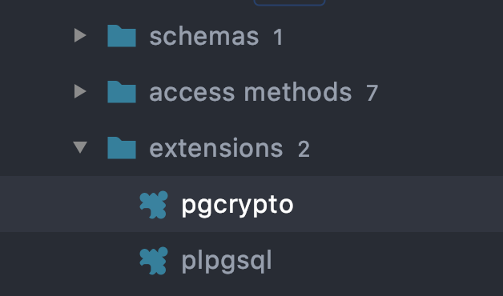

When working with Rails and a relational database such as Postgres, the default option for primary key is an auto-incrementing sequence. So the first record inserted would get a primary key of 1, next one 2 and so on. Depending on the system, this can be an issue if these values get exposed in urls, for example `/subscription/265` would reveal that 265 subscriptions have been generated, and that the next one will be id 266.

A less revealing option can be to use UUIDs (universally unique identifier) as a primary key. An example UUID looks like `123e4567-e89b-12d3-a456-426614174000`. The idea is that it's practically universally unique, and they are not sequential. So if this was a subscription id, the url would be `/subscription/123e4567-e89b-12d3-a456-426614174000` which reveals absolutely nothing about how many subscriptions have been created or what the next subscription id would be.

This post shows the steps needed to configure Rails to use UUID for primary key with Postgres. This works best on a brand new application with no production data yet. Trying to convert an existing system could be risky because every single record in every table would have to get migrated and foreign key constraints temporarily dropped during migration.

## Step 1: Enable pgycrypto

The `pgcrypto` module provides cryptographic functions for Postgres, however, it's not enabled by default. This should be the first migration to enable it:

```ruby
class EnableUuid < ActiveRecord::Migration[6.0]
  def change
    enable_extension 'pgcrypto'
  end
end
```

Run the migration:

```bash
bundle exec rake db:migrate
```

Verify the extension has been enabled. I'm using [Datagrip](https://www.jetbrains.com/datagrip/) but you can check with your sql client of choice. Expand the databases list, then check under extensions and you should see something like this:



## Step 2: Configure Generator

Add the following to the generators config so it knows to generate uuid primary keys:

```ruby
# config/initializers/generators.rb
Rails.application.config.generators do |g|
  g.orm :active_record, primary_key_type: :uuid
end
```

## Step 3: Generate Model

Time to try it out. Start by generating a model:

```bash
bundle exec rails generate model Tenant name:string
```

Open the generated migration - notice the type for id is `uuid`:

```ruby
class CreateTenants < ActiveRecord::Migration[6.0]
  def change
    create_table :tenants, id: :uuid do |t|
      t.string :name, null: false

      t.timestamps
    end
  end
end
```

Run the migration:

```bash
bundle exec rake db:migrate
```

Verify how this looks in the database - notice that the id column is using the `gen_random_uuid()` function:


Launch the Rails console and insert some data into the new table - you should see that the id is a UUID:

```
bundle exec rails console
> Tenant.create(name: 'Acme')
=> #<Tenant id: "bb57c11e-2ec7-44aa-8519-babd8b439b51", name: "Acme", created_at: "2020-11-01 22:06:58", updated_at: "2020-11-01 22:06:58">
```

## Step 4: Foreign Key Reference

One last thing to watch out for is adding a foreign key reference to a table. For example, suppose there is a `Plan` table and you want to add a reference to the Tenants table. The migration for this is:

```bash
bundle exec rails generate migration AddTenantRefToPlan tenant:references
```

Which would generate:

```ruby
class AddTenantRefToPlan < ActiveRecord::Migration[6.0]
  def change
    add_reference :plans, :tenant, null: false, foreign_key: true, index: true
  end
end
```

However, running this won't work because it will try to create an integer type column `tenant_id` on the `Plans`  referencing the `id` column on `Tenants` table which is of type uuid which doesn't match. For these type of migrations, need to specify `type: :uuid`:

```ruby
class AddTenantRefToPlan < ActiveRecord::Migration[6.0]
  def change
    add_reference :plans, :tenant, null: false, foreign_key: true, index: true, type: :uuid
  end
end
```

That's it, now you're all setup to use UUID as the primary key in all your models.
