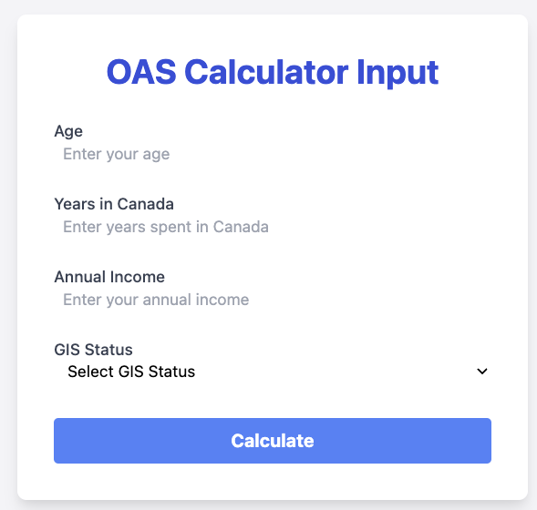
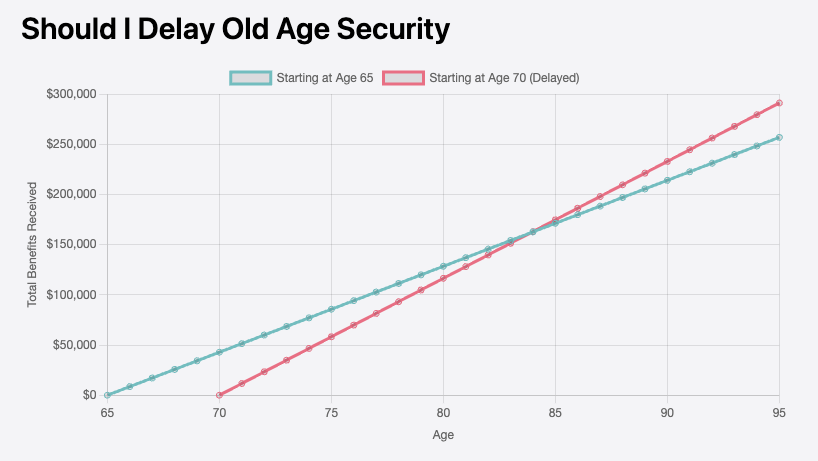

When building software, it's crucial to determine if you're on the right track before investing significant effort in selecting the language to build in, framework, architecture, automated testing, and setting up CI/CD pipelines. Rapid prototyping allows you to quickly reach valuable insights and validate your approach.

I had an opportunity to collaborate with [John Stapleton](https://openpolicyontario.com/), a subject matter expert on social assistance policy and poverty reduction, on an Old Age Security (OAS) breakeven calculator, targeted at low income Canadian seniors. The [Old Age Security](https://www.canada.ca/en/services/benefits/publicpensions/cpp/old-age-security.html) pension is a monthly payment Canadians can get if they are 65 and older. This post will demonstrate how I used ChatGPT to quickly build a prototype and validate our ideas. The final prototype is available [here](https://danielabar.github.io/oas-delay-calculator-prototype/).

This is the first part of a two-part series. In this first part, I'll walk you through the problem we aimed to address and the initial steps in building the prototype, including setting up the necessary calculations and visualization. In [Part 2](../rapid-prototype-chatgpt-oas-breakeven-part2), we’ll dive deeper into building the user interface, handling inputs, and refining the prototype.

**Disclaimer:** The content in this post is for informational purposes only and should not be considered financial advice. The OAS pension breakeven calculator prototype is a tool designed to illustrate potential outcomes based on specific scenarios. Individual financial situations vary, and it’s important to consult with a qualified financial advisor or professional before making any decisions regarding Old Age Security (OAS) or other financial matters.

## Problem

Before getting into the technical details of the prototype, let's start with the problem to be addressed:

Low uptake of Old Age Security (OAS) among low-income Canadian seniors, especially immigrants without a full 40 years in Canada after the age of 18, could be a significant issue. John Stapleton and I previously collaborated on a [Guaranteed Income Supplement RRSP calculator](https://rrspgiscalculator.site/), addressing the unintuitive aspects of financial planning for low-income Canadians with respect to retirement savings plans. Our new challenge was similar: Create a tool to help seniors understand the benefits of OAS, and if low income, it's almost never a good idea to delay it.

In the Toronto Metropolitan area, where just over 70% of seniors are immigrants, many people turning 65 are not applying for OAS due to:

1. Attempting to attain more qualifying years for OAS.
2. Understanding that waiting until age 70 increases their monthly payments.
3. Mainstream advice from some financial planners advocating for delaying OAS. This advice is sound if the money is not required and there is no eligibility for Guaranteed Income Supplement (GIS). However, for those eligible for significant GIS amounts, waiting might not be in their best interest.

<aside class="markdown-aside">
While the data mentioned above is not published, it is based on custom Statistics Canada data that has been privately obtained. If you're interested in accessing this information, you can <a class="markdown-link" href="https://openpolicyontario.com/contact/">contact John Stapleton</a> for further details or to request the data directly.
</aside>

The goal is to build a free online tool to illustrate these nuances, and encourage people who would benefit from applying earlier or when first eligible at 65.

## OAS Rules

Before building any software, we must first understand the rules around OAS pensions:

1. To receive the full monthly OAS pension amount, you must have 40 years of residency as an adult (after age 18) in Canada, at the time you turn 65.
2. If you have less than 40 years residency, you qualify for 1/40th of the full amount for every year. For example, 35 years of residency would qualify for 35/40 fraction of the full amount.
3. For every month after 65 that you delay taking OAS, the monthly amount you're entitled to increases by 0.6%, up to a maximum of 5 years, i.e. 60 months. So the most it could increase would be 0.6% * 60 = 36%.
4. Canadians whose income is below the cutoff for GIS (Guaranteed Income Supplement), also qualify for an additional top up to their OAS, however they must claim OAS to also receive the GIS amount.

<aside class="markdown-aside">
There's more nuance to these rules, but the details are not needed for the prototype. For further information, visit the Government of Canada's <a class="markdown-link" href="https://www.canada.ca/en/services/benefits/publicpensions/cpp/old-age-security/eligibility.html">OAS eligibility page</a>.
</aside>

## Initializing the Prototype

The idea was to get something that the subject matter expert and others could try out as quickly as possible. Our budget was exactly $0.00, so it had to be something that could be hosted for free. In this case, a static website hosted on [GitHub Pages](https://pages.github.com/) is a great solution. It doesn't require purchasing a domain as GitHub will generate a publicly accessible url based on your GitHub username and repository name.

The simplest possible implementation would be a single `index.html` containing all the markup, and logic in a script tag `<script>...</script>`. I didn't want to spend time setting up a build system. I envisioned from pushing any changes, to immediately having the new code available. To support this, I setup a GitHub repository to only have a `gh-pages` branch. Then any changes pushed to the branch are automatically deployed to GitHub pages. Here are the steps to do this:

* While logged in to your GitHub account, create a new public GitHub repo, name it `whatever_prototype`, do not initialize repo with any files.
* Clone the repository to your laptop: `git clone ...`
* `cd` into the repository you just cloned
* Create an empty branch: `git checkout --orphan gh-pages`
* Create an empty commit: `git commit --allow-empty -m "Initialize gh-pages branch"`
* Push: `git push origin gh-pages`
* Back in the GitHub web UI, go to your repo's Settings -> General, and make sure that `gh-pages` is the default branch.

Now anytime you push new changes while on the `gh-pages` branch, they will get deployed via a "pages build and deployment" workflow and publicly reachable at `https://your-username.github.io/your-repo-name/`. No need to setup this workflow, GitHub does it for you automatically for any project that has a `gh-pages` branch.

With the setup out of the way, it was time to start building.

## Initial Attempt

My first attempt was to pretend to be a non technical business user. I gave ChatGPT the problem statement exactly as worded from the John, the subject matter expert, along with the OAS rules from the government website, and asked it to build "something" to solve the problem. It came up with the following:




The problem was no matter what inputs I entered in the form, it produced the exact same output. Also the bar chart didn't seem helpful in a decision making process. But despite explaining to ChatGPT these issues, it continued to produce the same output.

It was at this point I realized I would have to take more technical control over the process, starting with an analysis of income streams.

## The Math

I ran some manual calculations, assuming the simplest case: Someone who is eligible for a full OAS pension at 65, and not eligible for GIS. For 2024, they would receive a monthly OAS amount of $713.34 if starting at age 65. This means by the time they turn 66, they would have received a total of $713.34 * 12 = $8,560.08, i.e. 12 monthly payments. And by age 67, they would have a total of $713.34 * 12 * 2 = $17,120.16, i.e. 12 monthly payments per year at 2 years. By age 70, this person would have accumulated 5 years worth of payments which is 60 months for a total of $713.34 * 12 * 5 = $42,800.40. And so on, for each year the person is still alive and collecting OAS.

On the other hand, waiting until age 70 would increase the monthly payment by 36%, i.e. 0.06% for each month delay, so 5 years of delay === 60 months, and 60 * 0.6% = 36%. So that 713.34 monthly payment would turn into: $713.34 * 1.36 = $970.14. By the time this person turns 71, they would have a total of $970.14 * 12 = $11,641.68. While this sounds like an impressive amount more than the $8,560.08 amount they would have had in one year if starting at 65, they're missing out on the $42,800.40 they could have had by starting at age 65.

<aside class="markdown-aside">
To keep things simple, I'm ignoring annual inflation adjustments and comparing everything in today's dollars.
</aside>

I explained the OAS rules above to ChatGPT and asked it to generate a table with columns for age, going from age 66 through 90, calculate the total OAS amount someone would have accumulated by that age if they had started at 65, and another column for starting at 70, and then to calculate the difference between starting at 70 and 65.

Here are the results - I've highlighted age 84, explanation to follow:

| Age | Start at 65 ($) | Start at 70 ($) | Difference ($) |
| --- | --------------- | --------------- | -------------- |
| 66  | 8,560.08        | 0               | -8,560.08      |
| 67  | 17,120.16       | 0               | -17,120.16     |
| 68  | 25,680.24       | 0               | -25,680.24     |
| 69  | 34,240.32       | 0               | -34,240.32     |
| 70  | 42,800.40       | 0               | -42,800.40     |
| 71  | 51,360.48       | 11,641.68       | -39,718.80     |
| 72  | 59,920.56       | 23,283.36       | -36,637.20     |
| 73  | 68,480.64       | 34,925.04       | -33,555.60     |
| 74  | 77,040.72       | 46,566.72       | -30,474.00     |
| 75  | 85,600.80       | 58,208.40       | -27,392.40     |
| 76  | 94,160.88       | 69,850.08       | -24,310.80     |
| 77  | 102,720.96      | 81,491.76       | -21,229.20     |
| 78  | 111,281.04      | 93,133.44       | -18,147.60     |
| 79  | 119,841.12      | 104,775.12      | -15,066.00     |
| 80  | 128,401.20      | 116,416.80      | -11,984.40     |
| 81  | 136,961.28      | 128,058.48      | -8,902.80      |
| 82  | 145,521.36      | 139,700.16      | -5,821.20      |
| 83  | 154,081.44      | 151,341.84      | -2,739.60      |
| <span class="markdown-table-highlight">**84**</span>  | **162,641.52**      | **162,983.52**      | **341.88**          |
| 85  | 171,201.60      | 174,625.20      | 3,423.60       |
| 86  | 179,761.68      | 186,266.88      | 6,505.20       |
| 87  | 188,321.76      | 197,908.56      | 9,586.80       |
| 88  | 196,881.84      | 209,550.24      | 12,668.40      |
| 89  | 205,441.92      | 221,191.92      | 15,750.00      |
| 90  | 214,002.00      | 232,833.60      | 18,831.60      |

The amounts represent the *total* OAS accumulated. Even though starting at age 70 results in a higher monthly payment compared to starting at age 65, the table above shows that the *total* OAS accumulated is less up until age 84, when it starts to pull ahead. In other words, someone would have to live until at least age 84 to have a greater total amount. And even then, it's only a few hundred dollars.

Given that according to Statistics Canada data [combined life expectancy](https://www150.statcan.gc.ca/t1/tbl1/en/tv.action?pid=1310011401&pickMembers%5B0%5D=1.1&pickMembers%5B1%5D=3.1&pickMembers%5B2%5D=4.8&cubeTimeFrame.startYear=2020+%2F+2022&cubeTimeFrame.endYear=2020+%2F+2022&referencePeriods=20200101%2C20200101) (for men and women that have reached age 65) for 2022 is ~85, you can start to see that it may not make sense for some people to delay OAS to age 70.

## Visualization

While the table of numbers is useful, some people's eyes glaze over when presented with rows and rows of numbers. This data could also be presented as a line chart where:

* The horizontal `x` axis is for age (i.e. time moving forward)
* The vertical `y` axis is for total accumulated OAS

The two streams of income (Start at 65, Start at 70) could be visualized as two lines on this chart, showing the total OAS income over time for starting payments at age 65 versus age 70. Each point on a line would represent the total OAS accumulated at that age. The line that starts at age 70 would have a steeper slope because each payment is greater, but it would also start "pushed out to the right" because the payments from age 65 - 70 would be 0. The line that starts at age 65 would have a flatter slope due to lower monthly payments, and start at the origin (age 65). This mean the two lines would have to intersect, and the age at which they intersect would be the break even age.

This would require bringing in a charting library. I decided to go with [Chart.js](https://www.chartjs.org/) because it's relatively simple to use and results in pleasing looking charts with the default configuration. This is ideal for a prototype where there is no designer. It also has support for [responsive charts](https://www.chartjs.org/docs/latest/configuration/responsive.html).

I asked ChatGPT to generate an `index.html` with a line chart using Chart.js, with two lines on the chart representing total accumulated OAS starting at age 65 and starting at age 70, using the business rules I had explained earlier. I also asked for a title "Should I Delay Old Age Security" and told it to use [TailwindCSS](https://tailwindcss.com/) for styling and to make it a mobile first design.

It came up with the following:

* Head section with CDN link for TailwindCSS and CDN script source for Chart.js
* Very light grey background on the page rather than default white to avoid being too bright
* Centered area for the content
* Title marked up to stand out
* Canvas element for the chart (Chart.js uses Canvas rather than SVG)
* JavaScript functions to generate chart data for each line (one starting at 65 and another starting at 70)
* JavaScript code to configure and initialize the line chart using responsive mode, and the two JavaScript functions for the data
* It even added tooltips which was a nice touch!

```htm
<!DOCTYPE html>
<html lang="en">

<head>
  <meta charset="UTF-8">
  <meta name="viewport" content="width=device-width, initial-scale=1.0">
  <title>Should I Delay Old Age Security</title>
  <!-- TailwindCSS CDN link -->
  <link href="https://cdn.jsdelivr.net/npm/tailwindcss@2.2.19/dist/tailwind.min.css" rel="stylesheet">
  <!-- Chart.js CDN links (core library and chart types that you'll use) -->
  <script src="https://cdn.jsdelivr.net/npm/chart.js@3.7.0"></script>
</head>

<body class="bg-gray-100 p-4">

  <div class="max-w-screen-md mx-auto">
    <h1 class="text-3xl font-semibold mb-4">Should I Delay Old Age Security</h1>
    <canvas id="myChart"></canvas>
  </div>

  <script>
    // Function to generate data for starting at age 65
    const generateChartData = () => {
      const initialAge = 65;
      const finalAge = 95;
      const monthlyAmount = 713.34; // Example monthly amount for OAS

      let dataPoints = [];
      dataPoints.push({ x: initialAge, y: 0})

      for (let age = initialAge + 1; age <= finalAge; age++) {
        let totalBenefit = (age - initialAge) * 12 * monthlyAmount;
        dataPoints.push({ x: age, y: totalBenefit });
      }

      return dataPoints;
    };

    // Function to generate data for starting at age 70
    const generateChartDataDelayed = () => {
      const recommendedAge = 65
      const initialAge = 70;
      const finalAge = 95;
      const originalMonthlyAmount = 713.34
      const delayedMonths = (initialAge - recommendedAge) * 12
      const multiplier = 1 + (delayedMonths * 0.006); // 0.6% increase per month
      const monthlyAmount = originalMonthlyAmount * multiplier;

      let dataPoints = [];
      dataPoints.push({ x: initialAge, y: 0 })

      for (let age = initialAge + 1; age <= finalAge; age++) {
        let totalBenefit = (age - initialAge) * 12 * monthlyAmount;
        dataPoints.push({ x: age, y: totalBenefit });
      }

      return dataPoints;
    };

    // Chart.js configuration
    const ctx = document.getElementById('myChart').getContext('2d');
    const data = {
      datasets: [
        {
          label: 'Starting at Age 65',
          data: generateChartData(),
          borderColor: 'rgb(75, 192, 192)',
          tension: 0.1,
          fill: false
        },
        {
          label: 'Starting at Age 70 (Delayed)',
          data: generateChartDataDelayed(),
          borderColor: 'rgb(255, 99, 132)',
          tension: 0.1,
          fill: false
        }
      ]
    };

    const options = {
      responsive: true,
      plugins: {
        tooltip: {
          callbacks: {
            label: function (tooltipItem) {
              return `Age ${tooltipItem.raw.x}: $${tooltipItem.raw.y.toLocaleString()}`;
            }
          }
        },
      },
      scales: {
        x: {
          type: 'linear',
          position: 'bottom',
          title: {
            display: true,
            text: 'Age'
          },
          ticks: {
            stepSize: 5
          }
        },
        y: {
          title: {
            display: true,
            text: 'Total Benefits Received'
          },
          ticks: {
            callback: function (value, index, values) {
              return '$' + value.toLocaleString(); // Add thousands separators
            }
          }
        }
      }
    };

    const myChart = new Chart(ctx, {
      type: 'line',
      data: data,
      options: options
    });
  </script>
</body>

</html>
```

Which resulted in this:



Hovering over any point on a line, renders a tooltip with the age and total OAS amount at that age. In the example below, I'm hovering over the point where the two lines intersect, which is the break even age:


## Highlight Break Even Point

The first attempt is not too bad. Using ChatGPT saved me a lot of time in setting up the initial scaffold for rendering a chart and writing functions to generate the data. However, the resulting chart requires effort from the user to hover over the intersection point to see the details of the break even point.

I asked ChatGPT if there was a way to add a marker on the chart for the intersection point and to label it the breakeven age. It told me that Chart.js has an [annotation plugin](https://www.chartjs.org/chartjs-plugin-annotation/latest/) for this purpose. It proceeded to generate some code but it didn't work. My research revealed that the annotation plugin is not built into Chart.js, but rather, a separate library needs to be pulled in.

After explaining this to ChatGPT it modified the prototype to pull in the annotation plugin from a CDN, add an `annotations` section to the chart configuration, and a `findBreakevenAge` function, called when rendering the annotation:

```htm
<head>
  <!-- Added Chart.js annotation plugin from CDN -->
  <script src="https://cdn.jsdelivr.net/npm/chartjs-plugin-annotation@1.1.0"></script>
</head>

<body>
  <!-- Existing markup -->

  <script>
    // Existing functions...

    // New function added to determine break even age
    const findBreakevenAge = () => {
      const data65 = generateChartData();
      const data70 = generateChartDataDelayed();

      let breakevenAge = null;

      for (let i = 0; i < data65.length; i++) {
        const age = data65[i].x;
        const benefitAt65 = data65[i].y;
        const benefitAt70 = data70[i].y;

        if (benefitAt70 === benefitAt65) {
          breakevenAge = age;
          break;
        }
      }

      return breakevenAge;
    };

    // Chart configuration modified to use annotation plugin:
    const breakEvenAge = findBreakevenAge()
    const options = {
      responsive: true,
      plugins: {
        tooltip: {...},
        annotation: {
          annotations: [
            {
              type: 'line',
              mode: 'vertical',
              scaleID: 'x',
              value: breakEvenAge,
              borderColor: 'gray',
              borderWidth: 2,
              label: {
                content: `Breakeven Age: ${breakEvenAge}`,
                enabled: true,
                position: 'start'
              }
            }
          ]
        }
      },
      // other options...
    }
    // Instantiate chart
    const myChart = new Chart(...)
  </script>
</body>
```

However, it wasn't rendering an annotation on the chart. After debugging into the code, I discovered two issue:

1. The datasets `data65` and `data70` aren't comparable by starting at the 0th index of data65 because the ages don't match. i.e. the 0th age of `data65` is `65` whereas 0th age of `data70` is `70`. To find the break even age we need to compare that datasets at the same ages.
2. The `findBreakevenAge()` function generated by ChatGPT was trying to find an exact equality of OAS at two ages. However, recall when the [income streams were compared](../rapid-prototype-chatgpt-oas-breakeven-part1#the-math), the incomes are never exactly equal. For example the breakeven age of 84 showed approximately a $300 difference.

I explained the above to ChatGPT and told it to start comparing the datasets at age 70. I also to find the age at which the absolute difference between the two income streams is less than or equal to $2000, i.e. to use a heuristic rather than looking for exact equality which doesn't exist.

Here's the modified code generated by ChatGPT:

```javascript
// Find the breakeven age (where the two lines intersect approximately)
const findBreakevenAge = () => {
  const data65 = generateChartData();
  const data70 = generateChartDataDelayed();

  let breakevenAge = null;

  // Start at 70 because the second dataset only starts there
  for (let age = 70; age <= 95; age++) {
    const benefitAt65 = data65.find(item => item.x === age)?.y || 0;
    const benefitAt70 = data70.find(item => item.x === age)?.y || 0;

    // Use a heuristic to find "close enough" difference in income
    // to be considered equal.
    if (Math.abs(benefitAt70 - benefitAt65) <= 2000) {
      breakevenAge = age;
      break;
    }
  }

  return breakevenAge;
};
```

There's a third issue with respect to efficiency in that the `findBreakevenAge()` function is calling the data generation functions again, even though they've already been called to render the lines. That's easily fixable by extracting these to constants and re-using them for both chart and annotation generation. I wasn't worried about optimizing at this time as I just wanted to get something working.

And here is the visual result from these fixes:


Now the breakeven annotation is correctly rendered exactly where the two lines intersect. 🎉

## Conclusion

With the basic calculations and visualizations in place, we had a solid prototype to illustrate the impact of delaying OAS. To make the tool useful however, it needed to accommodate user input, such as age to delay (for example, how does it look if delaying to age 68 rather than 70), years of residency in Canada, and income range, for personalized results. In the [next part](../rapid-prototype-chatgpt-oas-breakeven-part2), we'll focus on adding a user input form and refining the prototype to effectively respond to and display personalized data.
